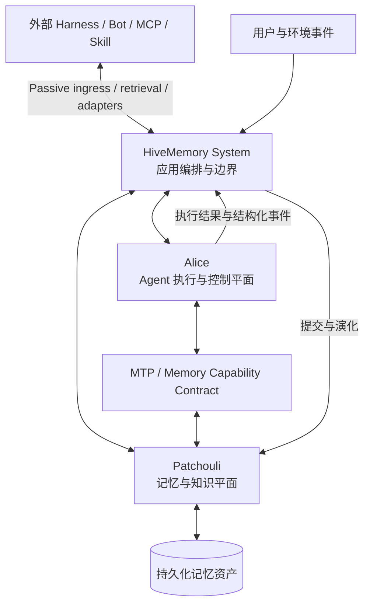

# HiveMemory 项目愿景与新定位总纲

**文档状态**：Living Vision  
**文档性质**：项目上位理念与长期方向，不代表所有能力均已实现  
**适用范围**：未来的项目介绍、架构设计、路线规划、产品决策与评估体系  
**最后更新**：2026-07-26

**相关文档**：

- [v4 当前架构总纲](./architecture/evolution/SystemArchitecture_v4.0.md)
- [Memory Tool Protocol](./protocols/MemoryToolProtocol.md)
- [Passive Conversation Memory Ingress 设计](./mod/V0.6.0PassiveIngressDesign.md)
- [三餐推荐助手产品规格](./applications/MealAssistantProductSpec.md)

---

## 0. 执行摘要

HiveMemory 的长期定位不再只是“为现有 Agent harness 提供外挂记忆的中间件”，也不应被描述为另一个追求通用能力完备性的 Agent 框架。

HiveMemory 希望探索并构建的是：

> **一套以持久化、可寻址、可追溯、可演化的记忆资产为主状态，并让这些资产参与 Agent 实例化、约束、执行、调度与能力复用的 Memory-Native Agent Runtime。**

这一定位包含两个互补而非互斥的方向：

1. **开放的记忆基础设施**：Patchouli 当前可以通过 passive ingress 和 API 服务外部信息流，并可在未来通过 MCP、skill 或其他适配层接入更多 harness，为现有生态提供独立的记忆价值。
2. **原生的实验性运行时**：Alice 作为 HiveMemory 的 Agent Runtime，用于验证当记忆不再只是 prompt 中的一段参考文本，而成为运行时主状态与控制输入时，Agent 系统可以获得哪些新的能力。

HiveMemory 不需要在通用编码、工具数量、UI 完整度或模型适配速度上全面战胜厂商原生 harness。它需要证明的是：在长期连续性、知识复用、状态演化、纠错收敛、来源追踪和持续自主性等问题上，memory-native 架构是否能够产生传统“无状态 loop + 外挂 RAG”难以自然获得的结构性优势。

这份文档将作为未来重构项目文档的上位依据。它回答“为什么做”和“凭什么取舍”，但不替代当前实现说明、版本架构、协议规范或产品规格。

---

## 1. 项目的起点与定位演化

### 1.1 最初问题：Agent 会遗忘关键决策

HiveMemory 最初来自一个直接而具体的痛点：现有 Agent 缺少可靠的跨会话状态，重要设计决策、用户偏好和项目约束会随着 context window 滚动或会话结束而消失。

最早的解决思路是一套外挂记忆系统：

```text
对话
  -> 提取高价值信息
  -> 形成长期记忆
  -> 后续检索
  -> 注入新对话
```

这一方案已经可以缓解“Agent 总是失忆”的问题，也是 Patchouli 至今仍然拥有独立产品价值的根源。

### 1.2 第一次转折：记忆不应只能被动注入

仅在每轮对话前自动注入检索结果，仍然把 Agent 限制在一问一答的 Chatbot 模式中。Agent 无法在推理过程中主动决定何时查找、读取、写入、修正或使用记忆。

由此形成了第二个核心判断：

> **Memory should be available as an active runtime capability, not only as prefilled context.**

MTP（Memory Tool Protocol）因此诞生。记忆开始具有可由 Agent 主动访问的操作语义，`SEARCH`、`READ`、`WRITE`、`UPDATE`、`RUN` 等行为进入 Agent loop，形成了 `memory as a tool` 的初步形态。

### 1.3 第二次转折：记忆系统与 Agent Runtime 必须解耦

随着 Agent loop、工具执行和多 Agent 能力逐渐加入，早期实现一度把记忆域与 Agent 执行代码混合在一起。这使两类本质不同的问题发生耦合：

- Patchouli 关心什么值得保留、如何检索、如何演化以及何时遗忘。
- Agent Runtime 关心模型如何执行、工具如何调用、任务如何调度以及运行如何终止。

v4 将 Patchouli 与 Alice 拆为同级子系统，意味着项目已经在工程上承认：

> **记忆基础设施与 Agent 执行运行时应当分离，但两者需要通过稳定协议深度协作。**

### 1.4 当前认识：从 Memory Layer 走向 Memory-Native Runtime

七个月的演进表明，HiveMemory 的目标已经超出“给任意 Agent 框架外挂一层 RAG”。越来越多的设想——记忆化 Agent Profile、动态工具复用、长期任务状态、记忆驱动的唤醒与调度、跨 Agent 知识共享——都会触及底层运行时。

因此，项目今天需要明确承认自己的双重身份：

- **对外**，HiveMemory 可以是一套可嵌入现有生态的 Agent Memory Infrastructure。
- **对内**，HiveMemory 是一条关于 Memory-Native Agent Runtime 的研究与工程路线。

这不是在两个定位之间摇摆，而是同一核心能力的两种使用深度。

---

## 2. 所处时代：模型与 harness 的协同设计

### 2.1 Agent 的竞争单位已经不再只是模型

现代 Agent 的实际表现来自一个完整系统，而非裸模型：

```text
Model
  × system prompt
  × tool protocol
  × context policy
  × execution loop
  × error recovery
  × sandbox
  × observability
  × product interaction
```

厂商原生 harness 往往可以利用模型训练、评测和 API 设计上的协同优势。其优势可能来自内部工具轨迹、模型特定 prompt、上下文压缩策略、停止条件、缓存机制、错误回填与评测体系，而不必然意味着模型只能在官方 harness 中正常工作。

因此，“官方 harness 通常能让自家模型发挥得更稳定”与“第三方 harness 仍有创新空间”可以同时成立。

### 2.2 官方优势不等于架构终局

模型厂商优先优化的是：

- 自家模型的成功率与产品体验
- 大规模用户需要的稳定性与安全性
- 能够快速交付和商业化的通用能力
- 对现有 API 和用户习惯的兼容

这些目标并不保证其会优先探索记忆原生、长期自主、个人知识主权或可替换模型等方向。社区 harness 的价值正来自不同的目标函数、更快的试验和更强的领域特化。

HiveMemory 不应把厂商原生 harness 视为必须正面击败的单一竞争对手。它们既可以是外部接入对象、实验基线，也可以是未来生态中的执行后端。

### 2.3 小型项目的现实优势

个人开发者无法在模型训练、基础工具覆盖、云资源或产品打磨上复制大厂投入，但可以拥有其他优势：

- 围绕一个非主流核心命题保持长期一致性
- 在没有历史兼容包袱时尝试新的抽象
- 让真实使用直接决定功能，而不是由平台战略决定
- 更快放弃无效设计并保留有效概念
- 针对厂商暂时没有动力解决的问题构建纵深

HiveMemory 的差异化不应建立在“功能比所有 harness 更多”，而应建立在“对长期记忆与 Agent Runtime 关系的理解更深入、更完整、更可验证”。

---

## 3. 新定位

### 3.1 一句话定位

> **HiveMemory is a memory-driven agent runtime where persistent knowledge assets are not merely retrieved as context, but participate in how agents are instantiated, constrained, executed, scheduled, and improved.**

中文表述：

> **HiveMemory 是一套以记忆知识为驱动核心的 Agent Runtime：持久化知识资产不只作为上下文被检索，还参与 Agent 的实例化、约束、执行、调度和持续改进。**

### 3.2 对外产品定位

对希望继续使用现有 Agent 框架的开发者，HiveMemory 可以表现为：

- 持久化记忆服务
- 对话与工具轨迹摄入层
- 跨会话知识检索层
- 可追溯、可更新的个人或项目知识库
- 面向 MCP、skill 和外部 harness 的记忆能力接口

这一模式不要求外部 Agent 理解 Alice 或完全采用 MTP，也不要求用户迁移现有工作流。

### 3.3 原生系统定位

对希望验证 memory-native 范式的场景，HiveMemory 通过 Alice 提供原生 Agent 执行环境：

- Agent 在运行中主动与记忆交互
- Agent Profile、约束和能力可以由持久化资产承载
- 执行结果进入记忆演化闭环，而不是只形成易逝日志
- 记忆状态可以影响后续执行、调度和恢复
- 多 Agent 围绕共享知识资产协作，而不只转发 prompt

### 3.4 HiveMemory 不是什么

HiveMemory 不应被定位为：

- 另一个以工具数量为卖点的通用 Agent harness
- 某一家模型 API 的薄包装
- 只有向量搜索与 prompt 注入的 RAG 应用
- 在尚无证据时宣称能够持续自我进化的自主智能体
- 必须替代所有现有 Agent 框架的封闭生态

---

## 4. 核心命题：从 Context-Centric 转向 Memory-Native

### 4.1 传统 Agent 的主状态是 context window

在常见 harness 中，当前 context window 实际上承担了系统主状态：历史消息、工具结果、计划和临时结论都堆叠其中。外部 memory 通常只在需要时检索若干文本片段，并作为额外上下文注入。

这种模式的根本限制不是 context window 一定太小，而是：

- 状态与一次模型调用强绑定
- 关键信息缺少稳定地址和版本语义
- 更新常以追加文本代替正式修正
- 会话结束后难以区分证据、结论和过期状态
- Agent 无法可靠地把历史资产作为长期能力使用
- 恢复任务依赖重新构造一段近似上下文

### 4.2 Memory-Native 的主状态是持久化资产

在 HiveMemory 的目标范式中，持久化记忆系统承担跨执行周期的主状态；context window 是针对当前任务编译出来的一张临时工作视图。

```text
Persistent Memory Assets
  -> retrieval / composition / policy
  -> Working Context
  -> reasoning and action
  -> observations / decisions / artifacts
  -> memory evolution
```

这里的“主状态”不意味着所有 token 都必须入库，也不意味着 Patchouli 直接取代执行调度。它意味着任何需要跨执行周期保持身份、语义和演化关系的信息，都不应只依赖易逝上下文。

### 4.3 工作定义：什么应当成为记忆

`everything is memory` 不应被解释为“不加区分地保存一切”。更精确的工程定义是：

> **任何需要跨执行周期存续、被引用、被修正、被验证、被调度或被再次使用的资产，都应成为具有明确身份和生命周期的记忆资产。**

由此可以得到三层信息形态：

1. **原始证据（Evidence / Artifact）**：对话、工具结果、文档快照、外部事件等不可随意改写的来源。
2. **候选记忆（Candidate / Pending Memory）**：系统或 Agent 认为值得沉淀、但仍处于生成、校验或合并过程中的资产。
3. **可用记忆（Materialized Memory）**：具备稳定身份、来源、类型、版本、可见性和生命周期语义的知识资产。

这一区分可以防止“任何日志都是长期知识”的类别坍缩。

### 4.4 记忆资产的最低性质

一个真正参与运行时的记忆资产，原则上应逐步具备：

- **可寻址**：拥有稳定 ID 或语义别名，而不是只能靠相似度偶然找回
- **可追溯**：能够回到原始来源、产生时间和责任主体
- **可修正**：支持更新、替代、撤回和冲突处理
- **可版本化**：重要变化可以被解释，而不是静默覆盖
- **可组合**：能够与其他记忆共同形成任务上下文或执行资产
- **可授权**：访问、修改和执行受身份与权限约束
- **可观测**：能够知道它何时被检索、引用、强化或判定无效
- **可生命周期管理**：可以成长、降权、归档、冻结或遗忘

---

## 5. 三个递进理念

### 5.1 Everything Worth Persisting Is Memory

凡是值得跨运行保留的事实、偏好、约束、计划、过程、程序、文档、Agent Profile 和反馈，都可以被统一视为记忆资产。

统一并不等于同质化。不同记忆类型必须保留不同的真实性、修改方式、生命周期和执行权限。用户偏好、不可变证据、当前任务状态和可执行代码不能因为都叫 memory 就拥有相同语义。

### 5.2 Memory as a Tool

记忆不应只能由框架预先检索后塞进 prompt。Agent 应当可以在运行中主动：

- 搜索未知记忆
- 读取完整资产
- 提交新的记忆意图
- 修正已知记忆
- 在受控条件下使用可执行记忆或程序资产

MTP 是当前对这一理念的协议化表达。其长期价值不在于语法本身，而在于它为“Agent 与持久化知识系统的双向交互”建立了明确边界。

### 5.3 Memory as Runtime State and Control Input

更进一步，记忆不只是 Agent 可调用的工具，还可以参与决定：

- 本次应实例化哪个 Agent Profile
- 哪些约束和权限必须加载
- 一个长期任务应从哪个状态恢复
- 哪些历史工具、工作流或经验值得复用
- 是否存在需要优先解决的冲突或过期知识
- 某个记忆变化是否应触发新的执行
- 多个 Agent 应围绕哪些共享资产协作

这是 HiveMemory 相对于普通 memory plugin 最关键、也最需要实证的研究命题。

---

## 6. 传统 harness 与 Memory-Native Runtime 的区别

| 维度 | 常见 Agent harness | HiveMemory 目标范式 |
|:---|:---|:---|
| 主状态 | 当前消息历史与 context window | 持久化记忆资产；context 是临时编译视图 |
| 记忆角色 | 外挂检索源或聊天历史摘要 | 知识平面、长期状态与运行时控制输入 |
| 交互方式 | 框架在调用前注入 top-k 文本 | 框架注入 + Agent 在运行中主动读写更新 |
| 更新语义 | 追加新文本或重新总结 | 对稳定资产进行修正、替代、版本化和冲突处理 |
| 工具来源 | 静态注册在 harness 中 | 静态工具 + 受控的可复用记忆资产 |
| 任务恢复 | 重放消息或生成新摘要 | 从持久化任务状态、证据和决策恢复 |
| 多 Agent 协作 | 转发 prompt、共享临时上下文 | 围绕可寻址、可授权、可追溯资产协作 |
| 学习结果 | 常停留在本次执行日志 | 成功经验、反馈和程序资产进入后续运行闭环 |
| 模型关系 | 常针对某一模型深度调优 | 允许模型适配，但核心状态独立于模型厂商 |
| 失败恢复 | 依赖 loop 重试和上下文保留 | 运行失败后仍可从已提交状态和证据继续 |

这张表描述的是目标差异，不表示 HiveMemory 当前已经完整实现右侧所有能力。

---

## 7. 系统角色：Patchouli、Alice 与顶层系统

### 7.1 总体关系



### 7.2 Patchouli：记忆与知识平面

Patchouli 负责持久化知识资产的形成、检索、演化和治理，包括：

- 外部交互与证据摄入
- 话题与上下文感知
- 记忆候选生成和物化
- 混合检索、排序和上下文编译
- 来源、置信度、可见性与身份语义
- 更新、冲突、强化、归档和遗忘
- 面向外部 harness 的独立记忆能力

Patchouli 不应因为“记忆驱动”而重新吞并 Agent loop、工具执行或多 Agent 调度。它提供状态和信号，但执行控制仍属于 Alice 与顶层应用编排。

### 7.3 Alice：Agent 执行与控制平面

Alice 是 HiveMemory 用来验证 memory-native 范式的原生 Agent Runtime，负责：

- 组装和运行 Agent 执行环境
- 管理执行 loop、frame、工具调用和终止条件
- 加载 Agent Profile、权限与记忆上下文
- 通过 MTP 与 Patchouli 交互
- 在需要时组织多个 Agent 的执行关系
- 将执行过程转化为结构化事件和可沉淀结果

Alice 的目标不是复制所有通用 harness 功能。她存在的理由是让记忆资产能够比普通外挂检索更深入地参与执行。

### 7.4 HiveMemory System：边界与编排

顶层 System 负责把两个子系统组织成清晰链路：

- 接收主动请求和被动事件
- 准备 Agent run 所需的记忆状态
- 调用 Alice 执行
- 将执行结果交回 Patchouli 演化
- 管理全局生命周期、公开能力和跨子系统契约

“memory-driven”不等于让 Patchouli 直接控制所有系统组件。它意味着顶层编排和 Alice 可以消费由记忆系统提供的持久化状态、策略和事件信号。

### 7.5 MTP：能力契约而非最终目的

MTP 当前承担 Agent 与记忆/工具 runtime 交互的协议角色。项目不应把自定义语法本身视为护城河。真正重要的是：

- 记忆操作拥有明确语义
- Agent 可以在运行中主动发起操作
- 权限、错误和结果具有稳定契约
- 记忆操作可以进入结构化执行轨迹
- 协议可以随着模型接口变化而适配，而不破坏记忆语义

未来即使底层承载方式演变为 function calling、MCP 或其他协议，`SEARCH / READ / WRITE / UPDATE / USE` 等核心能力语义仍应保持稳定。

---

## 8. 双轨策略：兼容现有生态，同时验证原生范式

### 8.1 兼容轨：Memory Infrastructure

兼容轨以 Patchouli 为核心，目标是让 HiveMemory 在不接管外部 Agent loop 的情况下产生价值：

```text
External Harness
  -> conversation / tool events
  -> passive ingress
  -> Patchouli memory evolution

External Harness
  <- retrieval / memory context / references
  <- Patchouli
```

它承担三个现实作用：

1. 让 HiveMemory 能够被立即使用，而不必等待 Alice 完全成熟。
2. 让项目兼容 MCP、skill 和社区 harness 生态，而不是成为封闭孤岛。
3. 为评估 Alice 提供可信基线：同一模型、同一记忆库，只改变执行方式。

### 8.2 原生轨：Alice Reference Runtime

原生轨以 Alice 为核心，目标不是追求通用 harness 功能清单，而是逐项验证传统外挂模式难以表达的能力：

- 持久化 Agent 身份与权限
- 记忆驱动的任务恢复
- 基于记忆状态选择工作流或 Agent
- 受控的记忆资产执行与复用
- 记忆冲突触发验证或澄清
- 从执行轨迹回流到记忆演化
- 由长期状态变化触发后续行动

### 8.3 两条轨道共享同一事实核心

兼容轨与原生轨不能演化为两套相互矛盾的记忆系统。它们应共享：

- Memory Atom 与 artifact/provenance 模型
- 检索和上下文编译语义
- 记忆生成与生命周期规则
- 身份、权限和可见性边界
- 可观测事件和评估数据

Alice 是 Patchouli 的原生消费者之一，而不是 Patchouli 存在的唯一理由。

---

## 9. Alice 存在的判定标准

每一个拟加入 Alice 的能力，都应回答：

> **为什么这项能力必须由 memory-native runtime 承担，而不能只作为通用 harness 功能或 Patchouli 外部适配器存在？**

至少满足以下一项，才值得进入 Alice 的核心范围：

1. 让持久化记忆状态直接影响 Agent 的实例化、权限、恢复或调度。
2. 保证执行过程中记忆读写、来源和生命周期语义不被普通 tool loop 丢失。
3. 为验证 memory-native 假设提供不可缺少的实验能力。
4. 被一个已经投入真实使用的应用场景明确需要。
5. 能形成外部 harness + Patchouli 难以自然达到的结构性优势。

以下理由本身不足以支持加入：

- 其他 Agent 框架都有
- 可以让项目看起来更像完整 AIOS
- 未来可能用到
- 技术上很有趣
- 能够增加功能数量

Alice 应被视为“memory-native reference runtime 与实验场”，而不是无限扩张的通用 Agent 平台。

---

## 10. 核心设计原则

### 10.1 持久化优先，但不滥写

需要长期存在的状态应拥有正式记忆身份；不值得长期保存的闲聊和中间噪音不应因为 `everything is memory` 而全部物化。

### 10.2 原始证据优先于过度摘要

摘要用于检索和压缩，不应取代不可恢复的原始证据。关键决策、用户原话、菜谱、代码和外部资料需要保留来源与必要细节。

### 10.3 保守提取与保守整合

系统宁可承认未知，也不应激进推断用户偏好或事实。更新应优先修正已有资产，而不是不断追加冲突副本。

### 10.4 Context 是编译产物

送入模型的上下文应由任务、Agent Profile、记忆状态、权限和 token 预算共同编译，而不是简单拼接最近消息与 top-k 结果。

### 10.5 记忆操作必须可解释

重要的检索、引用、写入、更新、替代和执行应具有来源、原因和结构化记录。用户应能理解系统为什么“记得”、为什么“改变”以及为什么“忘记”。

### 10.6 权限属于运行时语义

可读取不代表可修改，可修改不代表可执行。记忆类型、Agent 身份和工具能力必须共同参与权限判断，不能只依赖 prompt 约束。

### 10.7 热路径与冷路径分离

当前响应所需的检索与上下文准备追求低延迟；高质量记忆生成、整合和生命周期维护可以异步执行。不能为了后台整理阻塞用户交互。

### 10.8 模型可适配，状态不从属于模型

HiveMemory 可以针对不同模型优化 prompt、协议和 loop，但用户的长期知识资产不应被锁死在某个模型厂商的私有会话状态中。

### 10.9 渐进式自主

系统应从可观察、可确认的记忆辅助开始，逐步增加主动写入、主动恢复和主动调度。未经验证的自主行为不能仅凭理念直接上线。

### 10.10 真实使用优先于架构完整

架构设计必须服务于实际闭环。若一项重构不能解决已经观察到的问题、降低明确风险或验证核心假设，应推迟实施。

---

## 11. 项目差异化

HiveMemory 的潜在差异化不在“也能运行 Agent”，而在以下组合：

### 11.1 记忆是可演化资产，而非静态 chunks

记忆拥有类型、来源、身份、更新和生命周期。检索只是一种访问方式，不是记忆系统的全部。

### 11.2 记忆与执行是双向闭环

Agent 可以主动使用和修改记忆；执行结果也能够以结构化方式反向影响长期知识状态。

### 11.3 同时支持外挂模式与原生模式

Patchouli 允许外部 harness 获得记忆能力，Alice 则用于探索更深的 runtime integration。用户不必在“完全迁移”和“完全不用”之间二选一。

### 11.4 以长期连续性而非单次 benchmark 为中心

HiveMemory 更关心数天、数周甚至更长时间内的状态一致性、修正能力和知识复用，而不是只优化一次任务中的短期成功率。

### 11.5 用户拥有可迁移的知识资产

模型和 harness 可以更换，但用户积累的项目知识、偏好、决策、工作流和工具资产应继续存在，并能够被不同执行环境使用。

这些差异化目前是需要验证的产品与架构命题，而不是已经建立的市场壁垒。

---

## 12. 可证伪的核心假设

项目不应依靠“理念听起来正确”证明自身价值。以下假设必须通过真实应用与对照实验逐步验证。

### H1：持久化主状态改善跨会话连续性

在需要长期决策一致性的任务中，HiveMemory 应显著减少用户重复说明背景、约束和历史决定的次数。

### H2：正式更新语义减少记忆冲突

相对于追加式聊天摘要，带稳定身份的 `UPDATE / supersede / version` 机制应更快收敛到用户最新意图，并降低相互矛盾的有效记忆数量。

### H3：主动记忆交互优于纯预检索注入

在无法预先确定所需知识的复杂任务中，Agent 运行中主动 `SEARCH / READ` 应比一次性 top-k 注入获得更高的任务完成率或更低的无关上下文开销。

### H4：Alice 能产生外挂模式无法轻易获得的优势

在使用相同模型和相同 Patchouli 记忆库时，Alice 原生模式应至少在任务恢复、状态驱动执行、权限一致性或长期知识复用中的一项表现出稳定优势。

### H5：长期资产可跨模型和 harness 复用

更换底层模型或外部 harness 后，已有知识资产仍应保持可检索、可解释和可更新，而不需要从头重建用户状态。

如果这些假设长期无法得到证据，项目应收缩或修正定位，而不是通过继续增加架构复杂度来回避结论。

---

## 13. 验证体系

### 13.1 四级对照基线

在可行时，应使用相同模型与任务建立以下对照：

1. **无长期记忆**：只使用当前会话上下文。
2. **简单记忆基线**：文档/摘要 + top-k RAG 注入。
3. **外部 harness + Patchouli**：验证独立记忆基础设施的价值。
4. **Alice + Patchouli**：验证 memory-native runtime integration 的额外价值。

只有第 4 组相对第 3 组产生的增益，才可以归因于 Alice 的原生运行机制；第 3 组相对前两组的增益则证明 Patchouli 的独立价值。

### 13.2 核心评估指标

#### 记忆质量

- 高价值信息写入精确率
- 应记信息漏记率
- 记忆检索命中率与来源准确率
- 修正后的冲突残留率
- 重复记忆率
- 用户需要手工清理的频率

#### Agent 行为

- 跨会话决策一致性
- 长期任务恢复成功率
- 历史解决方案与工具复用率
- 因错误记忆造成的失败率
- 在证据不足时主动澄清而非幻觉的比例
- 对过期或冲突状态的识别率

#### 系统成本

- 检索与上下文编译延迟
- 单任务 token 与模型调用开销
- 写入、整合和维护成本
- Alice 原生模式相对外挂模式增加的复杂度
- 故障恢复与人工干预成本

#### 主观体验

- 用户是否感受到“它记得我/这个项目”
- 用户是否信任记忆来源和修正机制
- 用户是否愿意持续使用，而不是只在演示中觉得新奇

### 13.3 当前优先验证场景

1. **三餐推荐助手**：验证偏好、近期事件、菜谱、时间敏感和修正闭环。详见 [MealAssistantProductSpec](./applications/MealAssistantProductSpec.md)。
2. **HiveMemory 自身的项目知识管理**：验证设计决策、技术债、历史方案和跨会话开发连续性。

这些场景的价值在于真实、长期和可观察，而不是展示复杂多 Agent 编排。

### 13.4 证据等级

项目应区分不同强度的证据：

- **问题证据**：用户确实会忘记、重复解释或遭遇上下文丢失。
- **产品证据**：使用 HiveMemory 后，用户愿意持续使用并感受到改善。
- **机制证据**：改善来自记忆写入、修正、检索或恢复中的特定机制。
- **架构证据**：Alice 原生模式相对外部 harness + Patchouli 产生稳定增益。
- **泛化证据**：优势可以跨应用、模型或 harness 重现。

论文和研究可以增强问题与机制的合理性，但不能替代本项目自己的产品与架构证据。

---

## 14. 阶段性路线

本节描述验证顺序，不绑定具体版本号和日期。

### 阶段 A：跑通真实最小闭环

- 让三餐推荐助手进入真实使用
- 让 HiveMemory 管理自身项目知识
- 记录失败发生在写入、检索、修正、时间理解还是 Agent 决策
- 优先修复阻断使用的问题，不扩展通用 harness 功能

成功标志：系统从“理论可用”变成“有人持续使用”。

### 阶段 B：证明 Patchouli 的独立价值

- 完善 passive ingress 与外部检索契约
- 接入至少一个外部 harness 或真实信息流
- 验证不使用 Alice 时仍能产生跨会话记忆价值
- 建立来源、修正和冲突相关的基础评估

成功标志：Patchouli 不依赖 Alice 也有明确用户价值。

### 阶段 C：逐项验证 Alice 的原生优势

每次只选择一个传统外挂模式难以自然表达的能力，例如：

- 持久化任务恢复
- 记忆化 Agent Profile
- 记忆冲突驱动的验证流程
- 记忆状态驱动的执行选择
- 可复用工作流或工具资产

每项能力都与“外部 harness + Patchouli”进行对照。

成功标志：至少一个关键指标出现可重复的结构性增益。

### 阶段 D：形成开放生态接口

- 稳定 memory capability contracts
- 提供 MCP、skill、SDK 或 connector 适配
- 支持不同模型与 harness 使用同一记忆资产
- 将 Alice 定位为参考实现，而非唯一入口

成功标志：HiveMemory 的知识资产能够跨执行环境流动。

### 阶段 E：探索长期自主性

只有前述阶段得到足够证据后，才探索：

- 记忆事件触发 Agent 唤醒
- 长期目标与工作状态调度
- 多 Agent 围绕共享资产协作
- 自动冲突检测、整合与工作流归纳
- 记忆结构对 Agent 策略的反馈控制

成功标志不应是“系统看起来更自主”，而应是长期任务成功率提高且风险可控。

---

## 15. 功能决策门槛

未来新增功能前，应依次回答：

1. 它解决了哪个真实用户问题或验证了哪个核心假设？
2. 它属于 Patchouli、Alice、顶层 System，还是外部适配层？
3. 它是否必须改变 runtime，还是通过现有接口即可完成？
4. 最小实现是什么？能否在三天或一个短迭代内得到证据？
5. 如何与更简单的基线对比？
6. 如果结果无效，能否删除而不破坏核心架构？
7. 它引入的技术债是否超过当前获得的产品证据？

若无法回答第 1、4、5 项，应默认推迟，而不是进入实现。

---

## 16. 明确非目标

在缺少真实需求与验证之前，HiveMemory 不以以下事项为目标：

- 全面追平 Codex、Claude Code 或其他成熟 harness 的通用能力
- 为多 Agent 而多 Agent
- 为 AIOS 概念完整而实现操作系统式组件
- 同时支持所有模型、工具协议和存储后端
- 把所有记忆类型都变成可执行工具
- 以复杂知识图谱或新算法替代尚未跑通的基本检索闭环
- 在产品验证前追求生产级 UI、无限扩展性或极致性能
- 根据行业热点频繁改变核心抽象

非目标不是永久禁止，而是要求这些工作先获得进入核心路线的证据。

---

## 17. 主要风险与约束

### 17.1 愿景领先于实际用途

风险：架构越来越完整，但没有真实用户依赖系统。  
约束：每个阶段必须绑定 dogfooding 或外部用户闭环。

### 17.2 `everything is memory` 导致类别坍缩

风险：日志、事实、状态、程序和证据被用同一种方式处理。  
约束：统一资产接口，但保留类型特定的真实性、更新、权限和生命周期语义。

### 17.3 Alice 被通用 harness 基建吞噬

风险：大量时间花在追赶终端、沙箱、UI、插件和模型适配。  
约束：Alice 新能力必须通过第 9 节的存在判定。

### 17.4 架构重写循环

风险：为了未来可能性反复推翻已工作的边界。  
约束：优先通过稳定契约隔离技术债；只有真实场景证明边界错误时才升级架构。

### 17.5 把 prompt 行为误认为运行时保证

风险：模型通常遵循约束，被误解为权限、安全或一致性已经实现。  
约束：文档必须区分 prompt 软约束、runtime 强制约束和 storage invariant。

### 17.6 错误记忆比遗忘更危险

风险：错误偏好、错误事实或过时约束被跨会话反复放大。  
约束：保留来源、支持纠正、对高风险记忆采用保守写入和可见反馈。

### 17.7 个人开发者精力有限

风险：研究、架构、产品、UI 和运维同时推进造成长期疲劳。  
约束：同一阶段只保留一个主要验证目标；以真实问题清单决定下一轮工作。

---

## 18. 当前事实、近期假设与长期愿景

未来文档必须明确区分以下层次。

### 18.1 当前已经成立的工程事实

- HiveMemory 已形成顶层 System、Patchouli 和 Alice 的 v4 子系统边界。
- Patchouli 承担记忆准备、检索、生成和生命周期相关职责。
- Alice 承担 Agent loop 与 MTP/工具执行相关职责。
- MTP 已提供 Agent 主动访问记忆的协议基础。
- 系统同时存在主动 chat 与被动信息摄入方向。
- 三餐推荐助手已经形成最小产品规格，可用于实际验证。

### 18.2 近期需要验证的假设

- 当前记忆生成能否稳定保留用户真正重视的信息。
- 跨会话召回能否在真实使用中持续产生价值。
- 更新机制能否减少冲突，而不是制造更多重复记忆。
- passive 模式能否自然接入外部 harness。
- Alice 原生模式能否在至少一个场景中优于外挂模式。

### 18.3 尚未实现的长期愿景

- 记忆状态成为长期任务恢复的可靠主状态。
- 记忆变化能够安全触发 Agent 行动。
- Agent Profile、工作流和工具资产可跨模型复用。
- 多 Agent 围绕共享记忆资产进行长期协作。
- 系统能够从历史执行中持续改善知识组织与行为策略。

长期愿景可以指导接口设计，但不能被 README 写成当前功能。

---

## 19. 未来文档体系的重构原则

以本愿景为上位依据，未来文档可按以下层级重新组织：

| 文档层级 | 回答的问题 | 建议载体 |
|:---|:---|:---|
| Vision | 为什么存在、相信什么、如何取舍 | `docs/VISION.md` |
| Product | 为谁解决什么问题、怎样算成功 | 应用规格、用户场景文档 |
| Project Overview | 当前提供什么、如何理解整体系统 | `README.md`、`docs/PROJECT.md` |
| Architecture | 当前系统如何划分、边界是什么 | `docs/architecture/` |
| Protocol & Contract | 子系统如何稳定交互 | `docs/protocols/`、contracts 文档 |
| Roadmap | 接下来验证什么、按什么顺序 | `docs/ROADMAP.md` |
| Implementation Design | 某次实现或重构如何落地 | `docs/mod/`、各子系统目录 |
| Evidence | 实验、指标、用户反馈证明了什么 | 应用验收与评估报告 |

后续重构时应遵循：

- README 只陈述当前可用能力和最短理解路径。
- PROJECT 解释当前系统，不再混合大量过期未来构想。
- VISION 保留长期方向，但明确能力状态。
- Architecture 记录已经收敛的边界，不承担产品宣传。
- Roadmap 由验证假设驱动，不按功能数量堆叠。
- Ideas 文档可以大胆探索，但不能自动升级为项目承诺。

---

## 20. 对外表述模板

### 20.1 一句话版本

HiveMemory 是一套让持久化知识资产参与 Agent 执行与演化的 memory-native Agent Runtime。

### 20.2 简短版本

HiveMemory 不只是给 Agent 添加检索记忆。它将用户偏好、项目决策、任务状态、工作流和工具等长期资产组织为可寻址、可更新、可追溯的记忆，并通过 Patchouli 与 Alice 让这些资产参与 Agent 的上下文构建、运行、恢复和能力复用。同时，HiveMemory 保留开放的 passive 接入方式，可作为现有 harness 的独立记忆基础设施使用。

### 20.3 完整版本

HiveMemory 是一项关于 Memory-Native Agent Runtime 的长期工程探索。项目认为，context window 不应继续独自承担 Agent 的主状态；任何需要跨执行周期存续、引用、修正、验证或复用的知识，都应成为具有稳定身份和生命周期的记忆资产。Patchouli 负责这些资产的生成、检索与演化，Alice 则负责让它们进入 Agent 的执行、权限、恢复和调度过程。HiveMemory 既可以通过 passive ingress 和开放接口服务现有 Agent 生态，也提供原生运行时来验证一种不同于“无状态 loop + 外挂 RAG”的 Agent 范式。

---

## 21. 北极星

HiveMemory 的长期价值不取决于它是否拥有最多的 Agent 功能，也不取决于它是否能够在短期内追平厂商原生 harness。

项目真正需要持续回答的是：

> **当 Agent 的知识不再随 context 消失，而是成为可演化、可执行、可调度、可跨模型复用的长期资产时，软件系统应当如何重新组织 Agent 的运行？**

Patchouli 保存和治理这些资产，Alice 让它们获得行动能力，真实应用则决定这一切是否值得。

如果 HiveMemory 最终只能证明“一个好的外挂记忆层已经足够”，Patchouli 仍然具有独立价值；如果 Alice 能够证明记忆原生运行方式带来传统 harness 难以获得的长期连续性，那么 HiveMemory 将不只是一个 memory plugin，而会成为一种新的 Agent Runtime 路线。

在答案出现以前，项目不需要预先证明自己会走得最远。它需要做的是保持命题清晰、边界诚实、实验可比较，并让每一次实现都离真实证据更近一步。
