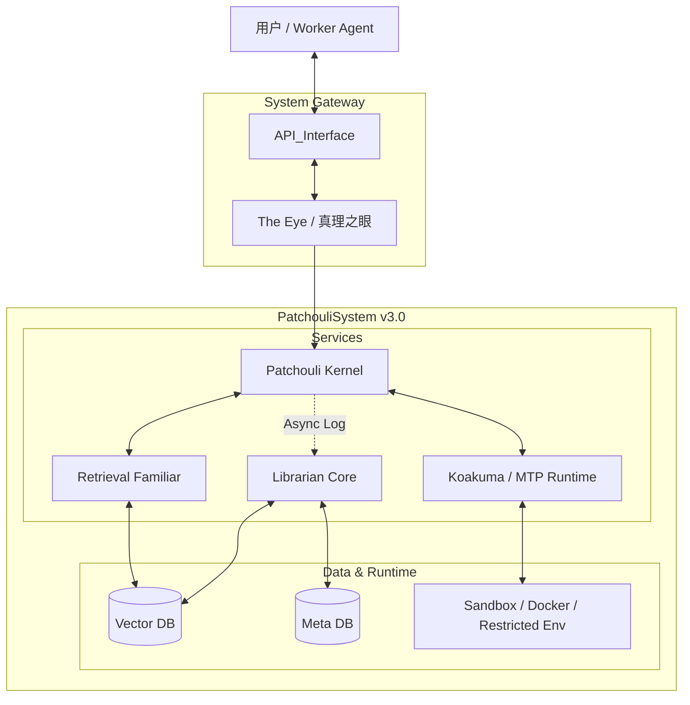

# HiveMemory 第三次架构演进：Patchouli OS 与内核运行时

**文档状态**: Draft (整理版)  
**来源说明**: 本文档从 [`MemoryToolProtocol.md`](../../protocols/MemoryToolProtocol.md) 中与“系统重构与运行时架构”直接相关的内容独立整理而来，用于单独承载第三次架构演进的顶层系统视图。  
**配套文档**: MTP 协议语法、工具设计、Prompt 规范与示例，仍以 [`MemoryToolProtocol.md`](../../protocols/MemoryToolProtocol.md) 为准。

---

## 1. 演进背景

在第二次架构演进后，HiveMemory 已经完成围绕记忆库的“三位一体”重构：

- `The Eye` 负责入口识别与重写
- `Retrieval Familiar` 负责热路径检索
- `Librarian Core` 负责感知、生成与生命周期维护

这一阶段解决了“实时检索”与“异步记忆管理”之间的基本冲突，但系统整体仍然更接近一条**线性处理链路**：

- 用户请求进入系统
- 系统检索上下文
- Worker Agent 生成回复
- 对话日志被异步送回记忆层

当系统开始真正接入 Agent 工作流后，这种线性模型暴露出新的瓶颈：

- Agent 无法在生成过程中自然调用系统能力
- 传统 Function Calling 会破坏生成心流
- 系统缺少统一的工具执行运行时
- Patchouli 需要从“记忆系统门面”进一步升级为“支持递归中断与恢复的执行内核”

因此，第三次架构演进的核心目标，是让 HiveMemory 从“记忆中间件”进一步演进为带有 **AIOS / Kernel Runtime** 特征的系统。

---

## 2. 第三次演进的核心变化

### 2.1 从线性流水线转向内核递归循环

第三次演进不再把一次对话看成单次 Request/Response，而是看成一个可被多次中断、执行、恢复的 **Kernel Loop**：

- Worker Agent 负责自然语言生成
- Patchouli Kernel 负责状态维护与中断调度
- Koakuma 负责 MTP 指令解析与执行
- Librarian 仍在后台异步处理记忆生成与管理

### 2.2 从“三位一体”扩展到“一核三使”

这次演进并不是推翻第二次架构，而是在其上增加新的运行时中心：

- `The Eye`：入口与流量清洗
- `Retrieval Familiar`：检索服务
- `Librarian Core`：记忆管理服务
- `Patchouli Kernel`：新增的总线、调度器与状态中枢
- `Koakuma`：新增的 MTP 运行时执行器

其中，**Patchouli Kernel** 是第三次演进真正引入的新架构重心。

### 2.3 MTP 成为内核态与用户态之间的系统调用总线

第三次演进以 **Memory Tool Protocol (MTP)** 为边界，明确区分：

- `User Space`：Worker Agent 所在的上下文窗口
- `Kernel Space`：Patchouli 托管的高权限运行时

MTP 不再只是工具调用语法，而是：

- Agent 到系统运行时的 syscall 接口
- 中断与恢复的控制边界
- 工具执行、记忆检索、状态回填的统一通道

---

## 3. 架构目标

第三次演进的顶层目标可以概括为以下 4 点：

### 3.1 建立 Patchouli Kernel

引入一个显式的内核角色，承担：

- 对话状态与上下文缓存管理
- LLM API 调用与 stop 中断控制
- MTP 指令调度
- 微服务之间的总线协调

### 3.2 引入 Koakuma 作为独立运行时执行器

将协议解析与工具执行从主编排链路中抽离，形成专职执行层：

- 解析 MTP 指令
- 路由内核工具与记忆工具
- 管理沙箱执行环境
- 向 Kernel 返回标准化执行结果

### 3.3 建立支持递归中断的运行时模型

系统必须支持如下循环：

- Agent 生成文本
- 生成中触发 MTP 指令
- Kernel 中断并执行
- 结果注入上下文
- Agent 恢复生成

### 3.4 保持记忆子系统的异步后台属性

虽然第三次演进强调 Kernel runtime，但 `Librarian Core` 仍然保持：

- 后台异步
- 不阻塞前台响应
- 继续承担写入、演化与维护职责

---

## 4. 顶层拓扑

---

## 5. 核心组件重新定位

### 5.1 The Eye

在第三次演进中，`The Eye` 仍是系统的入口控制器，但其职责更清晰地收敛为：

- 请求清洗
- 基础意图判断
- 查询重写
- 向 Kernel 发送标准化 JobRequest

它不再承担后续执行中断的中心角色。

### 5.2 Patchouli Kernel

`Patchouli Kernel` 是第三次演进新增的中心编排者，其职责包括：

- 会话状态管理
- 上下文缓存
- LLM IO 与 stop sequence 控制
- 决定何时调用 Retrieval、Koakuma 与 Librarian

它是系统从“工具集合”演进为“运行时宿主”的关键。

### 5.3 Retrieval Familiar

检索使魔在第三次演进中仍保持“只读热路径服务”的定位：

- 用于开场注入
- 也可被 Kernel / Koakuma 内部调用
- 负责索引检索、混排与内容读取

### 5.4 Koakuma

`Koakuma` 是第三次演进新增的关键执行层：

- MTP 解析器
- 工具分发器
- 沙箱执行控制器
- 内核级工具与记忆工具的统一执行入口

它将“执行”从 Patchouli 的其他人格职责中独立出来。

### 5.5 Librarian Core

`Librarian Core` 在第三次演进中并未降级，反而边界更清晰：

- 后台接收日志副本
- 异步执行记忆写入、演化和 GC
- 不介入前台 Kernel Loop 的同步执行

---

## 6. 运行时主循环

第三次演进的本质，在于把前台交互改造成一个递归恢复型执行循环。

### 6.1 初始化

- `The Eye` 接收请求并完成基础判断
- `Kernel` 调用 `Retrieval Familiar` 进行开场检索
- 系统组装初始 System Prompt，给 Worker Agent 提供必要的记忆背景

### 6.2 生成

- `Kernel` 向 LLM 发起生成请求
- 请求带有 MTP stop 控制，允许在协议边界主动中断

### 6.3 中断

- 若 LLM 生成普通文本并正常结束，则直接返回结果
- 若生成中触发 MTP 指令，则 `Kernel` 捕获并挂起当前生成

### 6.4 执行

- `Kernel` 将指令 Buffer 发送给 `Koakuma`
- `Koakuma` 负责解析、分发并执行
- 若涉及检索、工具运行、沙箱调用，都在此阶段完成

### 6.5 恢复

- 执行结果被注入回上下文
- `Kernel` 重新发起下一轮生成
- Agent 基于最新状态继续续写

### 6.6 收尾

- 当前台回复完成后，`Kernel` 返回结果给用户
- 对话副本被异步投递给 `Librarian Core`

---

## 7. 这次演进带来的结构性收益

### 7.1 Worker Agent 获得“行内行动”能力

Agent 不再需要脱离自然语言生成去填写结构化 JSON，而是可以在思维链中自然发出系统调用。

### 7.2 Patchouli 获得明确的内核中心

系统第一次拥有了真正意义上的：

- 编排中枢
- 状态管理器
- 执行恢复循环

这为后续更复杂的 Agent runtime 打下了基础。

### 7.3 执行与记忆管理开始分层

通过把 `Koakuma` 与 `Librarian Core` 分离：

- “执行工具”与“维护记忆”不再混在一起
- 同步前台链路与异步后台链路边界更清楚

### 7.4 为多智能体与更复杂 runtime 铺路

虽然第三次演进仍以 Patchouli 为系统中心，但它已经提前引入了：

- 内核态 / 用户态边界
- 沙箱执行
- 状态循环
- 高权限运行时中枢

这些都是后续多智能体系统与更高层 orchestrator 的前置条件。

---

## 8. 这次演进的局限

第三次演进虽然是重要跃迁，但它也留下了后续问题：

- 顶层系统层依然缺位
- `Patchouli` 继续承担了过多系统级 runtime 职责
- Kernel、Koakuma、Scheduler 等系统运行时代码逐渐汇聚到 `patchouli/`
- 为未来引入 `Alice` 作为多智能体顶层编排者埋下了目录与边界冲突

也正因为这些局限，才进一步引出了第四次架构演进对“真正顶层系统层”的需求。

---

## 9. 与其他文档的关系

- 第二次架构演进文档：
  - [SystemArchitecture_v2.0](./SystemArchitecture_v2.0.md)
  - 重点是记忆域的三位一体与冷热路径分层

- 第三次架构演进协议文档：
  - [MemoryToolProtocol.md](../../protocols/MemoryToolProtocol.md)
  - 重点是 MTP 的协议语法、工具、Prompt 与示例

- 第四次架构演进最终总纲：
  - [SystemArchitecture_v4.0](./SystemArchitecture_v4.0.md)
  - 重点是建立真正的项目级顶层系统层，让 Patchouli 与 Alice 成为同级子系统

---

## 10. 一句话总结

第三次架构演进的本质，是让 HiveMemory 从“围绕记忆库运作的增强型中间件”升级为带有 **Patchouli Kernel + Koakuma Runtime + MTP Syscall** 特征的递归执行系统，为后续多智能体 runtime 与更高层系统编排奠定基础。
