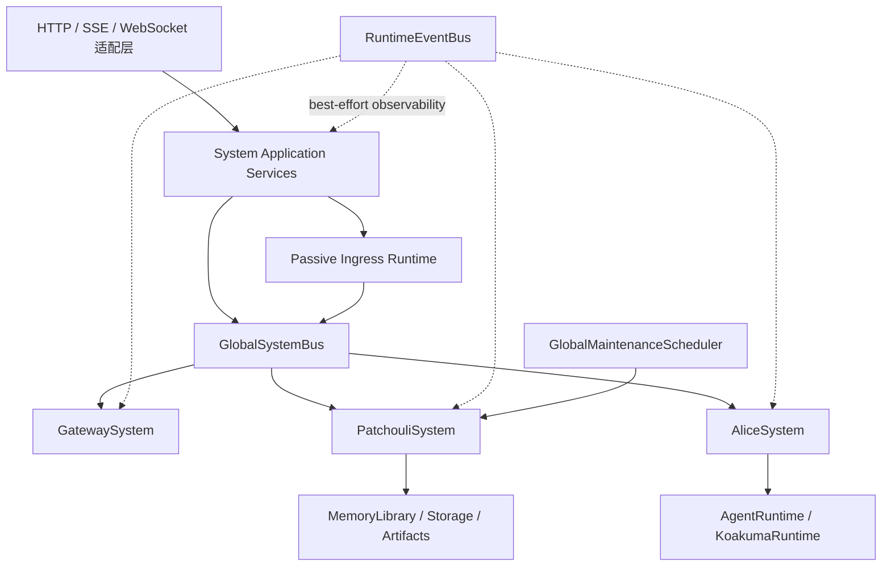

# HiveMemory 当前系统架构

本文描述当前开发分支中已经生效的后端总体结构，同时解释这些边界为什么会形成。历史架构名称、重构过程和未落地设想不构成当前实现依据，但它们揭示出的核心矛盾——前台响应与后台整理、长期知识与临时执行、统一入口与领域自治——仍然是理解现有设计的钥匙。

## 1. 架构要解决的三组矛盾

### 1.1 低延迟检索与高质量记忆生成

用户希望在提出问题时立即获得相关历史，记忆整理却需要更慢的语义感知、证据保留、去重、合并和生命周期判断。如果把这些过程串成一个同步“大脑”，系统不是牺牲响应速度，就是被迫降低记忆质量。

HiveMemory 因而保留了原项目“双系统”的核心思想：热路径负责为当前请求快速准备可用上下文，冷路径负责在交互完成后沉淀和维护长期知识。二者共享同一记忆事实核心，却拥有不同的时延预算和失败策略。

### 1.2 长期知识与临时执行

记忆需要跨会话保持身份、来源和版本，Agent 执行则围绕一次 run、一个 frame 和一组临时工具结果展开。早期实现曾把两类状态放进同一运行时，结果是 Patchouli 既要管理知识，又要管理 Agent loop；任何一侧变化都可能穿透另一侧。

当前架构将 Patchouli 与 Alice 分开：Patchouli 是长期记忆与知识平面，Alice 是临时执行与控制平面。`AgentRunContext` 和 `AgentRunResult` 是二者的交接面，而不是共享内部状态的借口。

### 1.3 统一入口与领域自治

主动对话、被动摄入和系统指令都需要理解“这条输入要去哪里”，但入口判断本身不应取得记忆或执行的所有权。Gateway 因此独立为系统级守门人：它形成决策，却不执行检索、不生成回答，也不写入记忆。

System 应用层再把 Gateway 的入口决策、Patchouli 的记忆事务和 Alice 的执行能力编排为完整用例。这样既保持统一入口，又避免 Gateway 演变成新的 God Object。

## 2. 当前基线

- 最新已发布 Git 标签：`v0.6.1`；
- 当前发布基线：`v0.6.1`；
- 当前代码、构建与运行时版本：`0.6.1`，唯一声明位于 `src/hivememory/_version.py`；
- 当前发布基线已经包含独立 Gateway、全局命令、Gateway workflow、Passive Ingress 与 Local Work Queue Runtime；
- Python 包、FastAPI/OpenAPI、health 响应和前端包清单保持同一版本；Git tag 仍是“已经发布”的唯一判断依据。

版本规划与完成度以[路线图](../ROADMAP.md)为准，系统当前由什么组件组成则以本文和代码为准。

## 3. 顶层结构

`SystemAssembler` 是组合根，负责构造共享运行时、三个同级子系统和顶层应用服务。`HiveMemorySystem` 持有最终组件图并管理生命周期。



### 3.1 System：编排舞台，而不是扮演所有角色

System 层拥有：

- 系统装配与生命周期；
- `GlobalSystemBus`、可选 `RuntimeEventBus` 和全局维护调度器；
- Provider / Model 注册表；
- 主动对话、被动摄入和面向 HTTP 的应用服务；
- 跨子系统调用顺序、取消与失败清理。

System 更像舞台管理者：它知道谁应先出场、失败后应通知谁收尾，也持有全局时钟和观测设施；但它不替任何角色完成领域工作。System 不实现 Gateway 分析、记忆域算法或 Agent 执行循环，否则顶层编排很快会重新变成无法测试和替换的总管对象。

### 3.2 Gateway：真理之眼的工程边界

Gateway 是系统级入口决策子系统。它负责入口拦截、系统指令、候选话题准备、话题路由和用户查询分析，最终只返回两类公共结果：

- `GatewayCommandOutcome`：系统指令已经形成终态，调用方应短路后续对话链；
- `GatewayDecisionOutcome`：提供话题、查询、记忆价值与检索计划，供 Patchouli 和 System 消费。

在项目的概念语言中，Gateway 延续了“真理之眼（The Eye）”的角色：它站在图书馆入口辨认来意、整理查询并选择通路。但这一比喻不能掩盖工程边界——Gateway 不持有记忆库，也不执行 Agent。它给出的是可被下游审查和消费的决策，而不是一段不可解释的“智能判断”。

### 3.3 Patchouli：帕秋莉大图书馆与记忆事实核心

Patchouli 是记忆与知识平面，拥有：

- 记忆、话题和 Agent Profile 的存储与查询；
- Retrieval、Perception、Generation、Lifecycle 与 MemoryCompiler 协作；
- 主动对话的 `prepare -> finalize` 记忆域事务；
- 记忆生成任务、PendingAtom 结算与引用/反馈记录；
- 存储健康、模型预热和 Patchouli 维护任务。

Patchouli 对应“大图书馆”本身：检索使魔负责快速找书，感知与生成链负责整理新材料，生命周期能力负责让知识在使用、衰减和归档之间演化。这个形象的工程含义是，所有会影响长期记忆真相的状态只能有一个权威所有者。

Patchouli 消费 Gateway 已形成的决策，不重新承担入口分析；它也不因为需要 Alice 的运行结果，就取得 Agent loop 的控制权。

### 3.4 Alice：使用记忆知识完成工作的多智能体执行体系

Alice 是 Agent 执行与控制平面，拥有：

- Agent Profile 驱动的运行参数与权限；
- 非流式和流式 Agent run；
- Agent loop、ExecutionFrame 和有限深度的子 Agent 编排；
- Koakuma MTP 解析、执行与回填；
- PendingAtom 的运行时视图。

Alice 是在图书馆中工作的 Agent 执行环境。它可以阅读书页、使用工具、提出写入或修订意图，也可以把工作委派给子 Agent；但正式书目如何产生、更新和归档仍由 Patchouli 决定。

因此 Alice 不拥有长期记忆存储，也不编排顶层 chat 的 prepare/finalize。这个限制并非削弱 Alice，而是让运行失败、模型替换或 frame 调度变化不会直接破坏长期知识。

## 4. 共享运行时：连接而不混合

### 4.1 GlobalSystemBus

`GlobalSystemBus` 是进程内的公开跨子系统 RPC / PubSub 总线。顶层应用服务只调用公开路由，不直接穿透子系统 Runtime。Patchouli、Alice 和 Gateway 各自的 local bus 只服务内部协作。

选择总线的目的不是模拟微服务，而是让调用方依赖“能力名称与公共模型”，而不是对方的对象图。这样才能看出一项能力究竟是公共契约还是偶然的内部方法。

总线不是网络协议、持久化队列或分布式消息系统。给它附加不存在的可靠投递承诺，反而会掩盖真实风险。公开路由和事件见[routes-and-events.md](../contracts/routes-and-events.md)。

### 4.2 RuntimeEventBus

`RuntimeEventBus` 是独立的尽力而为观测通道。它之所以不复用业务 Pub/Sub，是为了守住一条重要边界：看见系统发生了什么，不等于参与决定系统应该做什么。它为事件分配进程内递增序号，保留有界回放缓冲，并在订阅者队列积压时丢弃最旧事件。观测失败不得改变业务结果。

### 4.3 GlobalMaintenanceScheduler

全局调度器提供统一维护时钟和任务生命周期；子系统注册自己拥有的任务。当前 Patchouli 注册 idle buffer flush 与 memory gardening。调度器只回答“何时运行、如何停止和如何观测”，不回答“怎样整理记忆”，因此不会取得这些任务的业务所有权。

### 4.4 Local Work Queue Runtime

Local Work Queue Runtime 统一进程内 work 的 enqueue、状态迁移、并发、retry wait、timeout、cancel、
backpressure 与 shutdown drain。Interaction Submission 与 Memory Generation 使用独立业务 lane、payload、
成功条件和失败策略；System Runtime 只拥有机械生命周期，不解释 Patchouli 业务。

当前 Store 是 in-memory，只承诺单进程生命周期内的 accepted 与状态查询，不承诺重启恢复或 durable
accepted。当前契约见 [System 运行时与总线](../system/runtime-and-bus.md#3-local-work-queue-runtime)，
SQLite 后续见[持久化治理](../governance/reliability/durability-and-recovery.md#46-sqlite-workstore-持久化门槛与设计约束)。

## 5. 主动对话：一次跨平面的受控交接

```text
ChatApplicationService
  -> Gateway PROCESS (ACTIVE_CHAT)
     -> command: 返回命令结果并短路
     -> decision: 继续
  -> Patchouli PREPARE_AGENT_RUN
  -> Alice RUN_AGENT / RUN_AGENT_STREAM
  -> Patchouli FINALIZE_AGENT_RUN
  -> 返回 Agent 结果和记忆任务信息
```

这条三段式链路刻意把“准备知识”“执行工作”“沉淀结果”分开。若把 finalize 藏进 Alice，Agent 取消就可能留下半完成的长期写入；若把 run 藏进 Patchouli，记忆域又会重新拥有模型执行。显式交接让每一步都可以单独失败、观测和补偿。

关键语义：

1. Gateway 必须先形成命令终态或完整决策；
2. Patchouli prepare 解析 Agent Profile、话题、检索结果和已编译记忆上下文，返回 `PreparedAgentRun`；
3. Alice 只消费 `AgentRunContext` 和单次生成覆盖参数；
4. 只有正常完成的 Agent run 进入 finalize；
5. prepare 成功但 finalize 未成功时，System 请求 Patchouli cleanup，清理可能预创建的空话题；
6. finalize 从结构化 `turn_events` 归约 MTP trace，并提交 interaction、物化任务和检索命中。

## 6. 被动摄入：让外部经历进入记忆，而不是伪造一次对话

Passive Ingress 属于 System 应用层，而不是 Patchouli 或 Alice 的替代 chat 入口。它解决的是“如何把其他 harness 已经发生的经历带入 HiveMemory”，而不是要求系统重新扮演一次对话参与者。

```text
POST /api/v1/ingest
  -> PassiveIngressService
  -> Gateway PROCESS (PASSIVE_MEMORY)
  -> 可选记忆上下文准备
  -> 按外部会话键缓冲并封口 turn
  -> Patchouli SUBMIT_INTERACTION
```

因此，被动模式刻意保持较窄的能力面：

- 禁止系统指令分支；形如 `/clear` 的文本仍按普通外部消息处理；
- 可以请求 Gateway 决策与记忆上下文；
- 不运行 Alice，不生成面向用户的回复；
- 不执行 MTP 或全局命令；
- 通过去重、顺序控制和 outbox 重试保护外部事件摄入。

## 7. 生命周期顺序与设计理由

启动顺序：

```text
Gateway -> Patchouli -> Alice -> Scheduler -> Passive Ingress
```

停止顺序：

```text
Scheduler -> Passive Ingress drain -> Alice -> Patchouli -> Gateway
```

启动时先让入口决策可用，再挂载记忆和执行能力，最后接受后台维护与外部摄入。停止时顺序反转：先阻止新的维护和外部事件，排空仍可安全提交的消息，再撤销执行、记忆和入口能力。这个顺序避免系统在半关闭状态继续创建需要下游处理的新工作。

## 8. 当前不变量

下面的不变量不是代码风格偏好，而是用来判断新设计是否开始自相矛盾的检查线：

- Gateway、Patchouli、Alice 是由 System 装配的同级子系统；
- 跨子系统业务调用只依赖公开模型和 `GlobalSystemBus` 路由；
- local bus 路由不得成为其他子系统的隐式 API；
- Gateway 命令结果与普通决策互斥；
- Passive Memory 不得产生命令结果；
- Alice 不直接持有 Patchouli Runtime / Service；MTP 通过公开路由访问记忆能力；
- 观测事件是旁路信息，不参与业务正确性判断；
- 当前实现是单进程异步架构，不承诺分布式投递语义。

## 9. 如何发现新的设计矛盾

评审架构变化时，可以先问以下问题：

- 一个模块是否开始维护本应属于另一个模块的长期状态？
- 为了完成调用，是否不得不取得对方 Runtime、Controller 或 local bus 的引用？如果是，公共契约可能缺失，或者能力归属判断有误；
- 同一个业务终态是否同时由返回值、事件和缓存分别表达，并可能互相不一致？
- fallback 是否只替代了可恢复的外部失败，还是正在掩盖投影错误和状态不变量破坏？
- 为了增加观测，是否让业务流程开始依赖订阅者成功？
- 新后台任务是否拥有明确的取消、排空和长期状态边界，还是只把协程留在内存中？

这些问题没有自动答案，但能把“架构看起来更整齐”转换成可以验证的所有权与失败语义。

## 10. 已知限制

- `v0.6.1` 已发布；复合意图的下游消费和自定义入口规则属于后续 Unscheduled 方向，不是当前能力；
- RuntimeEvent 只有进程内有界缓冲，不是耐久审计日志；
- MTP RUN 的用户代码执行还没有强隔离沙箱；
- 通用持久化 Job Queue、Document Ingestion 与 Deep Research 尚未实现；
- 发布必须使用与包版本完全匹配的 Git tag，并通过版本一致性和 Release artifact 校验。

## 11. 验证入口

- 组合与生命周期：`src/hivememory/system/assembler.py`、`src/hivememory/system/system.py`；
- 主动链路：`src/hivememory/system/application/chat_service.py`；
- 被动链路：`src/hivememory/system/application/passive_ingress_service.py`、`src/hivememory/system/services/passive/`；
- 子系统宿主：`src/hivememory/{gateway,patchouli,alice}/system.py`；
- 主要测试：`tests/unit/system/`、`tests/unit/gateway/`、`tests/e2e/pipeline/`。

相关文档：[系统边界](./boundaries.md)、[子系统契约](../contracts/subsystem-contracts.md)、[MTP](../contracts/mtp.md)、[路线图](../ROADMAP.md)。
