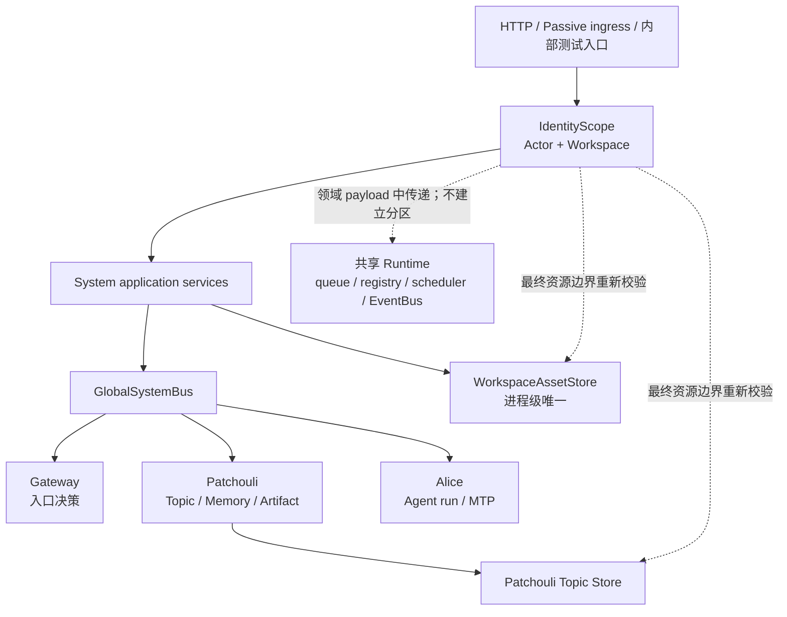

# Workspace 架构

本文是 Workspace 在当前系统架构中的事实入口，说明身份坐标、资源归属、运行时生命周期以及与 System、Patchouli、Gateway、Alice 和共享基础设施的边界。具体路由、事件字段和错误类型以[跨子系统契约](../contracts/subsystem-contracts.md)、[公开路由与事件](../contracts/routes-and-events.md)和[错误模型](../contracts/error-model.md)为准。

Workspace 在 W0 中是资源归属和访问硬边界，不是一个独立的子系统或一组按 Workspace 复制的 Runtime。System 进程只装配一套 Gateway、Patchouli、Alice、队列、注册表、调度器和 EventBus；需要隔离的资源在其最终寻址和授权处检查 WorkspaceIdentity。派生自 Workspace-owned 资源的视图缓存（Alice 的 L1 atom cache 与 profile cache）按派生源的 Workspace 坐标键控，键控规则见 [ADR-0004](./decisions/0004-execution-path-derived-caches.md)。

## 1. 为什么建立 Workspace：初步的“ME 网络”边界

HiveMemory 引入 Workspace，不是为了给现有对象再增加一个筛选字段，而是为了回答同一个问题的三个部分：谁在执行、资源归属于哪个稳定边界、一次后台或重试操作应当沿用哪一份身份事实。只有把这三部分放进同一个不可变坐标系，Topic、Memory、Artifact、WorkspaceAsset 以及它们的 binding/ref 生命周期才不会在共享进程运行时中相互串台。

Workspace 的架构意义是一个稳定的资源归属与访问边界，而不是 Agent 的永久身份。Agent、一次 Chat Run、子 Frame 和后台任务都只是暂时进入 Workspace 的执行者；资源所有权、访问硬边界和结算后的长期归属仍由 Workspace 及其领域 Store 负责。与此同时，Workspace 不会把所有基础设施复制成多套实例：queue、registry、scheduler、runtime 和 EventBus 继续共享——它们是不拥有领域状态的处理管道，谈不上按 Workspace 分区。缓存按所有权分两类：跨子系统事实源（WorkspaceAssetStore）由 System 持有并在最终寻址处校验；执行路径的派生视图缓存由执行子系统（Alice）持有并按派生源坐标键控。已经裁定为 Workspace-owned 的资源在最终寻址和授权处使用 WorkspaceIdentity。

在这个意义上，当前 Workspace 已经形成一个初步的“ME 网络”概念。这里的“ME 网络”是借用 AE2 的架构隐喻，不是代码中的独立类、网络进程或完整运行时；它指的是一片能够被稳定寻址、由同一资源归属边界约束、并通过明确交接承载执行结果的最小资源网络：

1. `WorkspaceIdentity` 与 `IdentityScope` 提供网络入口和资源归属坐标；
2. Topic、Memory、Artifact、WorkspaceAsset 是当前已落地的 Workspace-owned 资源节点，各自 Store 在最终读写处执行 hard boundary；
3. settle、generation、artifact 和后台 retry 是跨节点交接，领域载体保留同一 scope，不从进程当前 Workspace 重新推断；
4. 共享 System runtime 是网络的公共骨架，但不因此变成某个 Workspace 的私有命名域。

这与[《AE2 与 HiveMemory 的架构同构性》](../ideas/ae2-hivememory-architecture-analogy.md)形成正式的“当前事实—高阶设想”联系：Idea 文档解释 AE2 的网络、接口和子网为何能成为审查 HiveMemory 所有权、能力和执行边界的语言；本文只承接其中已经落地的 Workspace 资源边界，并把它标记为未来主网/子网体系的最小基础。完整的主网/子网拓扑、具有独立能力边界的子 Workspace、显式 Mount/Bridge、Capability Contract、独立工具与执行环境、配额/队列以及可恢复的子网生命周期尚未形成当前实现，仍以该 Idea 及后续独立 Plan 为准。

| 高阶架构维度 | 当前 Workspace 已形成的基础 | 完整主/子网系统尚缺的部分 |
|:---|:---|:---|
| 网络身份与资源寻址 | `IdentityScope`、Workspace 复合资源键、`main_workspace` 与内部隔离 seam | 用户可见的 Workspace 创建、切换和发现协议 |
| 网络存储与事实 | Topic、Memory、Artifact、WorkspaceAsset 的所有权和生命周期边界 | 跨 Workspace 的 Mount、Bridge、导入/导出及版本一致性 |
| 执行与结果回流 | Interaction、settlement、generation task 携带原始 scope，结果回到 Patchouli 边界 | 可持久化 Job Graph、子网内部执行器、恢复和 backpressure |
| 能力封装 | MTP、公开 Route 和窄 Asset port 提供现有交接基础 | 面向主网稳定暴露的 Capability Subnet 与版本化能力契约 |

因此，Workspace 当前应被理解为“初步 ME 网络边界”。后续若扩展 Workspace，必须先在 Idea/Plan 中明确所有权、Mount、能力和失败语义，再根据实际落地结果更新本文。

## 2. 在总体架构中的位置

`SystemAssembler` 是组合根。它创建全局运行时和注册表，再装配 Gateway、Patchouli、Alice 以及应用服务；`HiveMemorySystem` 只持有这张组件图并负责启停。Workspace 语义横跨这些边界，但不取得任何子系统的领域所有权：



Workspace 只在资源所有者需要它的地方生效。共享组件收到领域 payload 中的 `IdentityScope` 时，把它作为调用所需的不可变事实传递，不因此自动产生 Workspace 命名域、缓存副本或独立调度分区；Alice 的两个派生视图缓存按派生源坐标键控，属于其执行路径的私有运行时状态（见 [Alice](../alice/README.md)）。

## 3. 身份坐标

### 3.1 三个模型回答三个不同问题

| 模型 | 当前职责 | 不承担的职责 |
|:---|:---|:---|
| `ActorIdentity` | 谁在执行：`user_id`、`agent_id` 和可选 `team_id`。 | 不表示资源归属，也不单独授权 Workspace-owned 资源。 |
| `WorkspaceIdentity` | 资源归属于哪个用户和 Workspace：`owner_user_id`、`workspace_key`、`workspace_id`。W0 要求 key 与 ID 相同且非空。 | 不表示登录 session、grant 或永久 capability。 |
| `IdentityScope` | 一次操作的不可变硬边界，由 `ActorIdentity + WorkspaceIdentity` 组成，并校验 actor 用户与 owner 用户一致。 | 不携带 `interaction_id`、generation、run、frame、request 或 trace 等关联 ID。 |

`interaction_id`、`topic_id`、`memory_id`、`artifact_id` 和 work/task ID 仍由各自领域载体持有。这样可以避免把一个局部关联 ID 误当成公共身份，或在队列、缓存中派生出第二套 scope 模型。

### 3.2 默认入口和内部 seam

HTTP 层的用户导向身份选择（`user_id + workspace_id`）由统一请求头 `x-user-id` / `x-workspace-id` 承载，并在 `server/deps.py` 的 `resolve_request_identity_scope` 一次性冻结为 `IdentityScope`。该函数是默认身份解析的唯一入口：

1. 同一请求的 header 与 body/query 携带同一身份字段且不一致时显式拒绝（409），不静默择一；
2. `workspace_id` 只允许已声明的公共入口 `main_workspace`，其余值按不存在拒绝（404）；全部缺省时在此唯一回退 `DEFAULT_USER_ID` 与默认 Workspace；
3. Chat 等由具体 Agent 执行的 Agent action 必须显式提供 `agent_id`（缺失显式失败）；非 Agent action（管理读取、Topic 管理等）由 server 注入保留 `SYSTEM_AGENT_ID = "system"`，其语义是"没有具体 Agent 作为操作来源主体"，不是超级 Agent、不是前端可选 Agent，也不得写入 `MemoryAccessPolicy.target_agent_id`；
4. `/chat/stop` 通过 generation registry 使用创建时冻结的原始 scope：请求方选择只做 owner/workspace 校验，取消与事件发布沿用 run 的身份坐标。

应用服务公共方法只接受冻结的 `IdentityScope`，不再解析裸 `user_id`，也不得再次执行默认解析。W0 不提供 Workspace 创建或切换产品入口。`isolation_workspace` 仅由内部服务和隔离测试显式构造（`build_internal_identity_scope`），用于验证同一用户和 Agent 在两个资源域中的访问不会串扰。

下游不能读取进程级 `current_workspace`，也不能在 retry 时重新执行默认解析；后台任务必须从自己的领域 payload 恢复原始 scope，并在最终访问 Workspace-owned 资源时重新执行归属检查。

身份选择是 adapter 的输入处理，不是认证。Actor 的系统接入认证与 Workspace 准入由统一认证网关完成（见第 4 节）；生产 HTTP 入口切换为经网关认证由 A6 承接，当前生产请求以 `IdentityScope` 兼容分支运行，携带访问上下文的调用按第 4 节执行行为授权。

## 4. 访问边界：认证、准入与行为授权

Workspace 的访问控制分两段完成：System 统一 Actor Authentication 网关回答"谁在请求、能否进入这个 Workspace"，Workspace 访问基础设施回答"进入后每次动作允许做什么"。这一所有权划分是刻意为之：接入登记（哪个调用来源被允许经哪些 adapter 接入）是 System 的配置，准入与行为白名单（哪个 Actor 在哪个 Workspace 被允许执行哪些操作）是 Workspace 的配置；两类配置所有者不同，但不要求拆成两个对外认证入口，因此两项认证收敛在同一个网关内部顺序完成。设计取舍与实施历史见[归档的 A1 计划](../archive/plans/v0.7.0-a1-workspace-access-boundary.md)。

```text
统一 Actor Authentication 网关（system/access；唯一对外认证入口）
  1. Principal authentication：匹配 System 接入登记与 adapter，
     确认 CallerPrincipal 和 ActorIdentity
  2. Workspace authentication：委托 Workspace guard 内部准入
     （W0 owner 约束 + Workspace Actor 访问记录存在且启用）
  两项均通过 → WorkspaceAccessContext（在有效期内可复用，不绑定单次操作）
每次 API 动作
  3. Operation authorization：公共 application 调用共享行为检查
     （context 由本实例签发且在有效期内 + Actor 行为白名单包含方法所需 operation）
  4. Resource authorization：资源 owner 检查归属、可见性与资源自身规则
```

前两项回答身份与准入，后两项回答"Actor 能做什么"与"资源允不允许用"；资源状态、输入有效性、版本冲突等仍是正常领域处理，不设第五层授权。

### 4.1 两类注册配置

| 配置 | 代码位置 | 内容 | 不承担的职责 |
|:---|:---|:---|:---|
| System Actor 接入登记 | `system/access/registry.py` | 稳定来源标识、是否启用、连接/接收方式、可用 adapter、身份解析规则（可选 `allowed_user_ids` 收紧） | 不以 principal 配置授予任何 Workspace operation |
| Workspace Actor 访问注册表 | `workspace/registry.py` | `(owner_user_id, workspace_id, user_id, agent_id)` 完整坐标键、是否启用、`allowed_operations`（允许为空：可进入但未获准资源操作） | 不保存 Memory 可见性，不执行 Patchouli 业务 |

一条 Workspace 访问记录同时承载准入状态与行为白名单。`session_id`、run/frame 和调用协议不进入权限键；两个 owner 使用相同 `workspace_id` 时记录不串扰。装载期拒绝重复键、跨 owner 记录（W0 基线：`actor.user_id == workspace.owner_user_id`）和"禁用却配置白名单"的矛盾配置。相同 owner 不表示自动获准：缺失或禁用的访问记录是准入失败（`actor_not_admitted`），管理员兼容坐标 `(user_id, SYSTEM_AGENT_ID)` 同样需要登记，不因 `system` 标记自动放行。

### 4.2 WorkspaceAccessContext 与签发生命周期

`WorkspaceAccessContext` 由 guard 在内部准入成功时构造，只公开不可变的 `identity_scope`；不携带调用来源、访问记录对象、行为白名单或单次 operation。它按**对象身份**承载准入事实：guard 以私有弱引用表记录签发与到期时间，直接构造、复制（`copy`/`deepcopy`/`replace`）、同坐标重建或跨实例取得的同值对象都不继承准入（`context_not_issued`）。无引用的 context 自动释放；`close()` 清空签发跟踪并拒绝既有 context 与新认证。

`context_ttl_seconds` 与单调时钟统一注入 guard（签发与校验同一时间源），`None` 表示不设固定 TTL、随运行实例生命周期失效。context 不持久化为跨重启凭据；配置重载（当前未实现）必须同时冻结旧 context。同一有效 context 可先后执行不同的获准操作，切换 Actor/Workspace 必须重新认证；缓存命中和会话持续时间不能代替每次动作的授权。

### 4.3 操作目录与行为授权

`WorkspaceOperation` 是操作定义目录（代码契约）；某 Actor 实际获准的集合只由访问注册表表达（授权配置），两者必须分开。每个 operation 只授予其语义声明的能力，互不隐含、不可推导；新增 operation 不自动加入已有白名单：

| operation | 当前绑定的公共入口（行为授权失败时不触达资源后端） |
|:---|:---|
| `resource.read` | Actor 可见 Memory 点读；Topic 快照/话题数据读取；alias 正式读取 |
| `resource.search` | 语义检索 |
| `profile.read` | Agent Profile 快照/读取 |
| `asset.acquire` | 预留（附件解析/获取签名为迁移期兼容入口，绑定随 A5/A6 迁移落地）；不授权上传 |
| `interaction.submit` | 交互提交 |
| `memory_intent.submit` | 主动记忆意图提交 |
| `task.observe` | 生成任务 list/get/wait（观察不授予取消） |
| `management.memory` | Memory 管理 CRUD/GET/LIST/feedback；AGENT_PROFILE atom 的管理写入/列表（既有绑定例外） |
| `management.task` | 生成任务取消 |
| `management.topic` | Topic 结算/驱逐 |
| `management.asset` | WorkspaceAsset 上传登记 |

公共 application 在资源读取或副作用之前调用 `WorkspaceAccessGuard.authorize_operation(access, operation)`：确认 context 由本实例签发且在有效期内，按完整坐标取出该 Actor 的记录并确认包含所需 operation，返回可信 `IdentityScope` 供领域链使用。`task.observe` 不授予取消、Pending 内容读或 canonical Memory 读取；`management.memory` 是完整管理能力，不得被 Topic/Asset/Task 借用泛化放行。行为许可与资源许可必须同时满足：有 `resource.read` 仍可能被 private memory 拒绝，public memory 也不会使没有读取许可的 Actor 获得读取能力。

迁移期兼容：管理 CRUD、检索、Profile、Topic 管理和附件上传等既有调用方在缺失 access 时按裸 `IdentityScope` 受信适配运行；`read_memory`、`interaction.submit`、`memory_intent.submit` 等不在兼容清单内，缺失 access 一律拒绝。冻结清单（保留入口、已有调用方、A6 删除点）唯一维护在 [`access_consumption.py`](../../src/hivememory/patchouli/application/access_consumption.py)。Patchouli 提交与生成链沿用自身既有来源记录，不在公共 API 或提交载荷中重复接收调用来源字段。

### 4.4 拒绝语义与错误

认证与授权阶段以稳定错误类型 + reason 区分（完整表格见[错误模型](../contracts/error-model.md)）：接入未登记/禁用、adapter 不匹配、身份解析不允许是第一层失败（`AdmissionDeniedError`）；W0 owner 约束与缺失准入记录是准入失败（`AdmissionDeniedError`）；缺少行为许可是 `OperationDeniedError`；context 缺失、伪造、未由本实例签发、过期或实例关闭是 `ScopeRequiredError`（reason 分别为 `context_not_issued`、`context_expired`、`authentication_gateway_closed`）。访问错误必须沿 System/application 以原语义传播，不能被通用 `RuntimeError` 捕获包装成服务不可用。

### 4.5 装配

`SystemAssembler` 从 `config.access`（`principals`、`workspace_actors`、`context_ttl_seconds`；进程内不可变本地配置，修改经重启生效）装载两类注册表，构造共享的 guard 并注入统一认证网关、Patchouli 公共 application 与附件上传服务；网关经 `HiveMemorySystem.access_gateway` 暴露。依赖方向为 `system.access → workspace → core`；`workspace` 不导入 System 任何模块，Patchouli 只消费本包的中立检查能力，不反向依赖认证网关实现。生产消费者的网关接线与 shutdown 关闭时机由 A6 承接。

## 5. 资源归属与寻址

### 5.1 Workspace-owned 资源

Workspace 资源的最终寻址同时包含 WorkspaceIdentity 和资源 ID。复合键承载的是归属校验，而不是允许每个 Workspace 重新定义一套局部 ID：

| 资源 | 当前寻址结构 | 主要所有者 |
|:---|:---|:---|
| Topic | `IdentityScope + topic_id`（adapter 内部为 `WorkspaceTopicKey`） | Patchouli Perception / `ShortTermMemoryStore` |
| Memory | `WorkspaceMemoryKey(workspace_identity, memory_id)` | Patchouli `MidTermMemoryStore` / 长期存储 |
| Artifact | `WorkspaceArtifactKey(workspace_identity, artifact_id)`；`ArtifactRef` 同时带 WorkspaceIdentity | Patchouli `ArtifactStore` 及其适配器 |
| WorkspaceAsset | `WorkspaceAssetKey(workspace_identity, asset_id)`；外部使用当前 Store 的 opaque `WorkspaceAssetRef` | System-owned `WorkspaceAssetStore` |

`topic_id` 在领域上是全局唯一身份。正常创建路径由统一流程生成新的 UUID，两个 Workspace 可以使用相同标题，但不能把同一个 `topic_id` 作为两个合法 Topic 并存。调用方以 `IdentityScope + topic_id` 访问；`WorkspaceTopicKey` 仅由短期 adapter 在内部构造，用于归属校验和物理索引。

### 5.2 Memory 的归属

Memory 在 `MetaData.workspace_identity` 中保存唯一持久化归属；读取时先限定 owning Workspace，再由 Patchouli 的记忆策略判断 actor 是否可读。具体 policy 与检索规则属于 [MemoryLibrary](../patchouli/memory-library.md) 与 [Retrieval](../patchouli/retrieval.md)，本文只确认 Workspace 是 Memory 的唯一归属边界；存储层的 legacy 兼容解释分支已随存量数据迁移完成而删除，`workspace_identity` 是归属字段的唯一权威。

### 5.3 共享基础设施与派生缓存的键控规则

work queue、ordering/idempotency key、task/run registry、scheduler、runtime container 和 EventBus 维持进程级共享语义。领域 TaskSpec 可以携带唯一的 `IdentityScope`，但通用 WorkItem、WorkRecord 和 RuntimeEvent infrastructure 不把它解释为资源分区字段。`RuntimeEvent.workspace_id` 只是可选观测标签，不参与路由、订阅、sequence、授权或缓存分组。

缓存按所有权适用两条键控规则（[ADR-0004](./decisions/0004-execution-path-derived-caches.md)）：

1. **事实源按 ownership 寻址与校验**：跨子系统的 WorkspaceAssetStore 等事实源以 `WorkspaceIdentity` 参与资源复合键，在最终边界校验归属；
2. **派生视图按派生源坐标键控**：Alice 执行路径的 L1 atom cache 与 profile cache 派生自 Workspace-owned 资源，alias 索引按 `(WorkspaceIdentity, alias)`、profile key 按 `(WorkspaceIdentity, Actor 投影, alias)` 分区。分区解决"错误命中、无效覆盖和不必要的冷查询"，不替代授权——L1 atom cache 命中后仍由 resolver 重验 Workspace ownership 与 actor policy，profile cache 只复用同授权坐标内已通过 Patchouli 校验的结果。

两个缓存的当前边界与生命周期见 [Alice](../alice/README.md)。

## 6. WorkspaceAssetStore

### 6.1 所有权和生命周期

System 在 `_RuntimeBundle` 中只创建一个 `InMemoryWorkspaceAssetStore`。Store 是当前进程内 WorkspaceAsset、representation、opaque ref、幂等记录和 lease 的权威真相源，通过窄化的 Reader/Command port 提供给业务消费者。它不查询 Topic，也不负责 binding 或 settlement。

资产、表示和引用均为当前 Store 存活期内的运行时对象。`close_and_clear()` 进入不可逆关闭状态后清空 asset、representation、ref、operation token、幂等记录、REMOVED 记录和 lease bookkeeping；关闭后的 System 不能重新打开该 Store，必须重新装配进程并重新上传资源。

### 6.2 两级状态和命名命令

资产聚合状态为 `PROCESSING`、`READY`、`FAILED`、`REMOVED`；representation 状态为 `PENDING`、`PROCESSING`、`READY`、`FAILED`。状态只能由 Store 的命名 command 推进：

1. 创建操作按 `(WorkspaceIdentity, client_operation_id)` 幂等；相同操作的 metadata 不一致时报告冲突。
2. RAW representation 可以原子注册为 READY；其他 representation 先 PENDING，再由 `start_representation()` 签发 operation token 进入 PROCESSING。
3. `complete_representation()` 或 `fail_representation()` 校验 revision/token，并在同一临界区更新 representation 与 required representation 对应的资产聚合状态。
4. 只有资产 READY 且 preference 选中的 representation READY 时，`resolve_asset()` 和 `acquire_ready_representation()` 才成功。文档资产的 required representation 是 `EXTRACTED_TEXT`，RAW READY 本身不足以表示文档可用。
5. `REMOVED` 是不可逆终态。重复 remove 幂等，晚到的 parser callback、representation command 或 lease acquire 不能复活资产；活跃 lease 自己持有冻结内容，直到消费者显式 release。

WorkspaceAsset 不保存 `visibility`、`created_by_agent_id`、`created_by_team_id` 或 actor-policy target。同一 Workspace 内不同 Agent/Team 的资产访问结果一致；跨 Workspace 的 ref、asset key 或 URI 均不能绕过归属校验。

## 7. TopicAssetBinding 交接事实

`TopicAssetBinding` 是 Workspace 与 Patchouli Topic 之间需要在本文保留的 Topic 交接事实。它只记录 `asset_id`、opaque `asset_ref`、首次使用它的 `interaction_id` 和时间，不复制 WorkspaceAsset snapshot、representation 内容、actor-policy 字段或第二份 Topic/Workspace 坐标。

绑定只能在一轮成功 Interaction 中建立：上游消费者先根据用户明确选择的 READY ref 取得 representation lease，完成本轮 Interaction 后，再由 Patchouli 的 Topic 所有者提交首次 binding。调用方只应交接已经完成前置校验的 `(asset_id, asset_ref)`；Topic 写入口不会自行反查 AssetStore 或复制附件内容。重复使用同一资产只命中既有关系，不覆盖首次 Interaction 或首次绑定时间；上传、最近资产列表和 UI selection cache 不会产生 binding，没有 binding 的 WorkspaceAsset 是合法 orphan。

Asset remove 不回调 Patchouli，也不清理 binding。AssetStore 与 Topic 所有者之间不使用共同控制器、两阶段提交或额外协调器；binding 随所属 Topic 的 settle/evict 生命周期完成清理。Topic buffer 的结构、并发保护、compact/settle/evict 矩阵和 shutdown 批处理属于[Perception 与短期话题](../patchouli/perception.md)及 [MemoryLibrary](../patchouli/memory-library.md)，不在本文重复定义。

## 8. Scope 传播与跨边界交接

### 8.1 主动和被动入口

当前入口的 Workspace 交接可以概括为：

```text
用户导向身份选择（user_id + workspace_id；Agent action 附加 agent_id）
  -> server/deps.py 一次性校验并冻结 IdentityScope
  -> System application service（只接受 identity_scope）
  -> public route / 领域所有者
  -> 在 Workspace-owned 资源边界校验 scope
```

主动 Chat 与 Passive ingest 都在最外层冻结身份（Chat 与被动接入是 Agent action，必须携带具体 `agent_id`；被动接入的 `agent_id` 参与外部会话分桶命名），随后由领域载体携带 scope。`/chat/stop` 不是 Agent action：服务端用请求方选择完成 owner/workspace 校验后，通过 generation registry 复用创建时冻结的原始 scope 执行取消。Passive ingress 仍按自己的外部会话键缓冲并提交 Patchouli Interaction，但不因此建立第二套 Workspace 资源状态。下游不使用进程当前 Workspace 推断资源归属。

### 8.2 后台任务和重试

`InteractionSubmission`、`MemoryGenerationTaskSpec` 等领域 DTO 各自保存一份完整 `IdentityScope`，并携带所需的 interaction、intent、topic 或 task ID。codec 负责 scope 的完整 round-trip；Work Queue 只运输编码后的 payload 和执行状态，不解释 Workspace 领域模型。retry 从 payload 恢复原 scope 和领域 ID，再到真正的 Workspace-owned resource 边界执行授权；它不重跑默认 resolver、不读取进程当前 Workspace，也不改变身份坐标。队列的状态机和重试策略见[System 运行时与总线](../system/runtime-and-bus.md)。

## 9. System 生命周期与 shutdown

### 9.1 启动

System 的启动顺序为：

```text
Gateway -> Patchouli -> Alice -> Scheduler -> Passive Ingress
```

WorkspaceAssetStore 在 System 装配阶段创建，但在启动阶段不单独复制或按 Workspace 启动。它的可用性由 System 生命周期承载。

### 9.2 停止

停止顺序为：

```text
Scheduler.stop
  -> PassiveIngress.shutdown_drain
  -> Alice.stop
  -> Patchouli.stop
       -> Interaction submission drain
       -> Active finalize drain
       -> Perception Topic settlement / generation drain
       -> Memory generation queue stop
  -> Gateway.stop
  -> WorkspaceAssetStore.close_and_clear
  -> SYSTEM_STOPPED
```

先停调度器和被动入口，避免 shutdown 期间继续接纳新的维护或摄入；Alice 在自身停止时清空其派生缓存，Alice 和 Patchouli 完成各自已接纳工作的 drain 后，才清空 WorkspaceAssetStore。这样 settlement consumer 可以在 drain 期间按既有交接约定用 task 中的 asset ref 反查 Store、持有 lease 并在完成后 release；Store 不调用 Patchouli controller 的 `wait_all`，也不查询 Topic 或 binding。`close_and_clear()` 幂等，重复 stop 不会重新打开或恢复任何状态。Patchouli 内部的 drain 顺序见[System 组合根与生命周期](../system/composition.md)。

### 9.3 失败边界

WorkspaceAssetStore 的清理不是队列可靠性或跨 Store 事务的替代品。若上游 shutdown 尚未完成，System 不应以提前清空 Store 来掩盖活跃 lease；如果关闭过程失败，System 报告失败事件而不是把未完成的消费者工作伪装成正常的 `SYSTEM_STOPPED`。

## 10. 当前边界与限制

- W0 只支持默认 `main_workspace` 的公开入口和内部 `isolation_workspace` 测试 seam，不提供用户可见的 Workspace 创建、切换、Mount、Bridge、Grant 或跨 Workspace sharing；
- 统一认证网关与 Workspace 行为授权已落地，但首版只有进程内本地登记配置：无远程凭据协议、通用 IAM 或管理 API，外部 connector 协议由计划 B 提供；生产 HTTP/Alice/Passive 消费者尚未切换为经网关认证（A6），当前生产请求以 `IdentityScope` 兼容分支运行，迁移期兼容清单见第 4.3 节；
- 附件上传入口存在已知缺陷：带 access 上传时行为权限与传入 scope 缺少一致性校验（跨 Workspace 写入风险），已单独记录为 [Todo：WorkspaceAsset 上传的认证上下文与 scope 不一致](../todo/workspace-asset-upload-access-scope-mismatch.md)，修复前该项不视为已通过验收；
- WorkspaceAssetStore、opaque ref 和 lease 只承诺当前进程生命周期，不提供跨重启恢复；已持久化的 Memory/Artifact 按各自存储契约存在；
- Alice 的 L1 atom cache 与 profile cache 是执行路径的派生视图（见 [ADR-0004](./decisions/0004-execution-path-derived-caches.md)）：不跨重启恢复，`AliceSystem.stop()` 时清空；profile cache 没有 TTL、更新事件或显式失效入口，Profile 修改在 LRU 驻留期内可能 stale；
- atom cache 返回原始 `MemoryAtom` 引用，可变性语义遵循[数据模型 ADR-0001](./decisions/0001-data-model-mutability-and-boundary-projection.md)，未做深冻结；
- WorkspaceIdentity 的传播不意味着所有组件都参与隔离。任何新增资源都必须先明确其所有者，再决定是否使用 Workspace 复合键；新增派生缓存时按派生源坐标键控（[ADR-0004](./decisions/0004-execution-path-derived-caches.md)），不能从 scope 的存在自动推导隔离。

## 11. 代码与测试入口

核心模型和资源键：

- [`identity.py`](../../src/hivememory/core/models/identity.py)、[`workspace.py`](../../src/hivememory/core/models/workspace.py)；
- 访问边界：[`system/access/`](../../src/hivememory/system/access/)（网关、接入登记、调用来源身份）、[`workspace/access.py`](../../src/hivememory/workspace/access.py)（操作目录、准入上下文、共享行为检查）、[`workspace/registry.py`](../../src/hivememory/workspace/registry.py)（访问注册表）；
- [`topic.py`](../../src/hivememory/core/models/topic.py)、[`memory.py`](../../src/hivememory/core/models/memory.py)、[`artifact.py`](../../src/hivememory/core/models/artifact.py)、[`workspace_asset.py`](../../src/hivememory/core/models/workspace_asset.py)。

运行时和生命周期：

- [`InMemoryWorkspaceAssetStore`](../../src/hivememory/system/runtime/workspace/store.py)、[`workspace ports`](../../src/hivememory/system/runtime/workspace/ports.py)；
- Alice 派生缓存：[`KoakumaAtomCache`](../../src/hivememory/agent_runtime/aliases/cache.py)（端口见 [`AtomCachePort`](../../src/hivememory/agent_runtime/aliases/ports.py)）、[`AgentProfileCache`](../../src/hivememory/alice/runtime/profile_cache.py)；消费侧 resolver 见 [`RuntimeAliasResolver`](../../src/hivememory/agent_runtime/aliases/resolver.py) 与 [`AgentProfileResolver`](../../src/hivememory/alice/runtime/profile_resolver.py)；
- [`SystemAssembler`](../../src/hivememory/system/assembler.py)、[`HiveMemorySystem`](../../src/hivememory/system/system.py)；
- [`TopicAssetBinding`](../../src/hivememory/core/models/workspace_asset.py)、[`ShortTermMemoryStore`](../../src/hivememory/patchouli/memory_library/stores.py) 和 [`PerceptionFamiliar`](../../src/hivememory/patchouli/services/perception.py)。

代表性行为测试：

- 访问边界：[`tests/unit/workspace/test_access.py`](../../tests/unit/workspace/test_access.py)、[`tests/unit/workspace/test_registry.py`](../../tests/unit/workspace/test_registry.py)、[`tests/unit/system/access/test_gateway.py`](../../tests/unit/system/access/test_gateway.py)、[`tests/unit/workspace/test_import_boundaries.py`](../../tests/unit/workspace/test_import_boundaries.py)、[`tests/integration/workspace/test_application_access_boundary.py`](../../tests/integration/workspace/test_application_access_boundary.py)；
- [`tests/unit/core/models/test_workspace.py`](../../tests/unit/core/models/test_workspace.py)；
- [`tests/unit/system/runtime/workspace/test_store.py`](../../tests/unit/system/runtime/workspace/test_store.py)；
- Alice 派生缓存：[`tests/unit/agent_runtime/aliases/test_cache.py`](../../tests/unit/agent_runtime/aliases/test_cache.py)、[`tests/unit/alice/runtime/test_profile_cache.py`](../../tests/unit/alice/runtime/test_profile_cache.py)、[`test_alice_runtime_caches.py`](../../tests/unit/alice/runtime/test_alice_runtime_caches.py)；
- [`tests/integration/patchouli/test_memory_workspace_isolation.py`](../../tests/integration/patchouli/test_memory_workspace_isolation.py)、[`test_topic_access_chain.py`](../../tests/integration/patchouli/test_topic_access_chain.py)；
- [`tests/integration/system/test_workspace_asset_runtime.py`](../../tests/integration/system/test_workspace_asset_runtime.py)、[`test_workspace_access_propagation.py`](../../tests/integration/system/test_workspace_access_propagation.py)；
- cache 串扰与授权重验：[`tests/unit/agent_runtime/aliases/test_resolver.py`](../../tests/unit/agent_runtime/aliases/test_resolver.py)、[`tests/unit/alice/runtime/test_profile_resolver.py`](../../tests/unit/alice/runtime/test_profile_resolver.py)；
- 附件链路：[`tests/integration/system/application/test_workspace_asset_service.py`](../../tests/integration/system/application/test_workspace_asset_service.py)、[`tests/integration/system/test_workspace_asset_upload_api.py`](../../tests/integration/system/test_workspace_asset_upload_api.py)、[`test_workspace_asset_chat_selection.py`](../../tests/integration/system/test_workspace_asset_chat_selection.py)；完整入口见[Chat 附件链路](../system/attachments.md)。

相关入口：[总体架构](./overview.md)、[系统边界与所有权](./boundaries.md)、[数据模型与可变性边界](./data-model.md)、[System 组合根与生命周期](../system/composition.md)、[MemoryLibrary](../patchouli/memory-library.md)、[Perception 与短期话题](../patchouli/perception.md)、[Artifacts 与来源追踪](../patchouli/artifacts.md)、[Chat 附件链路](../system/attachments.md)、[归档的 A1 访问边界计划](../archive/plans/v0.7.0-a1-workspace-access-boundary.md)和[Workspace 文档收口历史审计](../archive/plans/documentation-migration-finalization-audit.md)。
