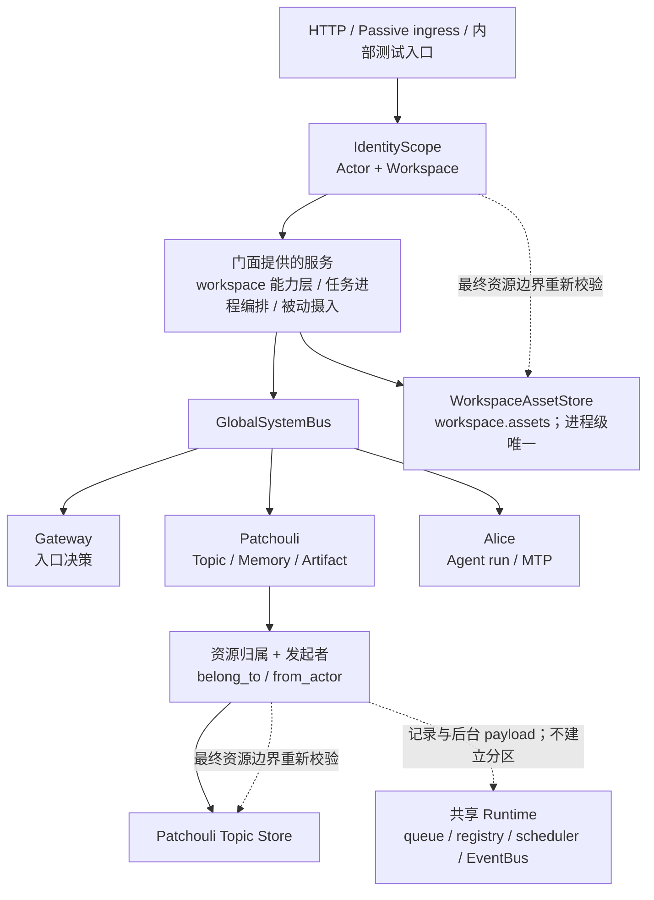

# Workspace 架构

本文是 Workspace 在当前系统架构中的事实入口，说明身份坐标、资源归属、运行时生命周期以及与 System、Patchouli、Gateway、Alice 和共享基础设施的边界。具体路由、事件字段和错误类型以[跨子系统契约](../contracts/subsystem-contracts.md)、[公开路由与事件](../contracts/routes-and-events.md)和[错误模型](../contracts/error-model.md)为准。

Workspace 在 W0 中是资源归属和访问硬边界，不是一组按 Workspace 复制的 Runtime。代码上 `workspace` 是与 Gateway、Patchouli、Alice 同层的包，承载认证入口、访问检查、actor 能力层、读取视图与 WorkspaceAsset 设施；它没有独立的生命周期宿主，由 System 组合根装配。System 进程只装配一套 Gateway、Patchouli、Alice、队列、注册表、调度器和 EventBus；需要隔离的资源在其最终寻址和授权处检查 WorkspaceIdentity。workspace 读取视图的完整原子缓存与 Profile 缓存按派生源的 Workspace 坐标键控，写入意图登记同样由 workspace 拥有。

## 1. 为什么建立 Workspace：初步的“ME 网络”边界

HiveMemory 引入 Workspace，不是为了给现有对象再增加一个筛选字段，而是为了回答同一个问题的三个部分：谁在执行、资源归属于哪个稳定边界、一次后台或重试操作应当沿用哪一份身份事实。操作、记录与后台任务分别携带符合其寿命的身份数据，Topic、Memory、Artifact、WorkspaceAsset 以及它们的 binding/ref 生命周期才能在共享进程运行时中保持稳定归属。

Workspace 的架构意义是一个稳定的资源归属与访问边界，而不是 Agent 的永久身份。Agent、一次 Chat Run、子 Frame 和后台任务都只是暂时进入 Workspace 的执行者；资源所有权、访问硬边界和结算后的长期归属仍由 Workspace 及其领域 Store 负责。与此同时，Workspace 不会把所有基础设施复制成多套实例：queue、registry、scheduler、runtime 和 EventBus 继续共享——它们是不拥有领域状态的处理管道，谈不上按 Workspace 分区。缓存按所有权分两类：跨子系统事实源（WorkspaceAssetStore）由 System 持有并在最终寻址处校验；完整原子与主进程 Profile 的派生视图由 workspace 读取视图持有；Alice 仅保留 CALL 目标 Profile 的既有缓存。已经裁定为 Workspace-owned 的资源在最终寻址和授权处使用 WorkspaceIdentity。

在这个意义上，当前 Workspace 已经形成一个初步的“ME 网络”概念。这里的“ME 网络”是借用 AE2 的架构隐喻，不是代码中的独立类、网络进程或完整运行时；它指的是一片能够被稳定寻址、由同一资源归属边界约束、并通过明确交接承载执行结果的最小资源网络：

1. `WorkspaceIdentity` 与 `IdentityScope` 提供网络入口和资源归属坐标；
2. Topic、Memory、Artifact、WorkspaceAsset 是当前已落地的 Workspace-owned 资源节点，各自 Store 在最终读写处执行 hard boundary；
3. settle、generation、artifact 和后台 retry 是跨节点交接，领域载体独立保留资源归属与需要的发起者，不从进程当前 Workspace 重新推断；
4. 共享 System runtime 是网络的公共骨架，但不因此变成某个 Workspace 的私有命名域。

这与[《AE2 与 HiveMemory 的架构同构性》](../ideas/ae2-hivememory-architecture-analogy.md)形成正式的“当前事实—高阶设想”联系：Idea 文档解释 AE2 的网络、接口和子网为何能成为审查 HiveMemory 所有权、能力和执行边界的语言；本文只承接其中已经落地的 Workspace 资源边界，并把它标记为未来主网/子网体系的最小基础。完整的主网/子网拓扑、具有独立能力边界的子 Workspace、显式 Mount/Bridge、Capability Contract、独立工具与执行环境、配额/队列以及可恢复的子网生命周期尚未形成当前实现，仍以该 Idea 及后续独立 Plan 为准。

| 高阶架构维度 | 当前 Workspace 已形成的基础 | 完整主/子网系统尚缺的部分 |
|:---|:---|:---|
| 网络身份与资源寻址 | `IdentityScope`、Workspace 复合资源键、`main_workspace` 与内部隔离 seam | 用户可见的 Workspace 创建、切换和发现协议 |
| 网络存储与事实 | Topic、Memory、Artifact、WorkspaceAsset 的所有权和生命周期边界 | 跨 Workspace 的 Mount、Bridge、导入/导出及版本一致性 |
| 执行与结果回流 | Interaction、settlement、generation task 独立携带资源归属与需要的发起者，结果回到 Patchouli 边界 | 可持久化 Job Graph、子网内部执行器、恢复和 backpressure |
| 能力封装 | MTP、公开 Route 和窄 Asset port 提供现有交接基础 | 面向主网稳定暴露的 Capability Subnet 与版本化能力契约 |

因此，Workspace 当前应被理解为“初步 ME 网络边界”。后续若扩展 Workspace，必须先在 Idea/Plan 中明确所有权、Mount、能力和失败语义，再根据实际落地结果更新本文。

## 2. 在总体架构中的位置

`SystemAssembler` 是组合根。它创建全局运行时和注册表，再装配 Gateway、Patchouli、Alice、workspace 设施（认证网关、认证一侧与操作授权者、能力层、读取视图、AssetStore、任务进程表与 chat 任务进程编排）以及其余应用服务；`HiveMemorySystem` 只持有这张组件图、作为入口使用的门面并负责启停。Workspace 语义横跨这些边界，但不取得任何子系统的领域所有权：

workspace 的 `contracts` 子包是其他 L3 子系统可以导入的唯一入口（分层规则只允许 L3 子系统之间导入对方的 `contracts`）。它目前定义任务进程交给执行者的 `CPUInputManifest`，只依赖 `core`，由 `tests/unit/workspace/test_import_boundaries.py` 守护；workspace 中 `process` 以外的模块不得导入 `process`。


```mermaid
flowchart TB
    IN["HTTP / Passive ingress / 内部测试入口"]
    SCOPE["IdentityScope\nActor + Workspace"]
    APP["门面提供的服务\nworkspace 能力层 / 任务进程编排 / 被动摄入"]
    BUS["GlobalSystemBus"]
    GW["Gateway\n入口决策"]
    PA["Patchouli\nTopic / Memory / Artifact"]
    IDENTITY["资源归属 + 发起者\nbelong_to / from_actor"]
    AL["Alice\nAgent run / MTP"]
    TOPIC["Patchouli Topic Store"]
    ASSET["WorkspaceAssetStore\nworkspace.assets；进程级唯一"]
    SHARED["共享 Runtime\nqueue / registry / scheduler / EventBus"]

    IN --> SCOPE --> APP --> BUS
    BUS --> GW
    BUS --> PA
    BUS --> AL
    PA --> IDENTITY --> TOPIC
    APP --> ASSET
    IDENTITY -. "最终资源边界重新校验" .-> TOPIC
    SCOPE -. "最终资源边界重新校验" .-> ASSET
    IDENTITY -. "记录与后台 payload；不建立分区" .-> SHARED
```

Workspace 只在资源所有者需要它的地方生效。Patchouli 在公共边界把 `IdentityScope` 拆为 `belong_to: WorkspaceIdentity` 与 `from_actor: ActorIdentity`，内部不再传递或重新组装 scope。全局总线的公开 route 参数仍可携带操作 scope；共享队列运输的记录与后台 payload 使用独立身份字段，两者都不因此自动产生 Workspace 命名域、缓存副本或独立调度分区。workspace 读取视图拥有完整原子缓存与主进程 Profile 缓存；写入意图登记保存独立的归属、发起者和进程关联，不保存访问 context 或 `IdentityScope`。WorkspaceAsset 的旧端口例外见第 10 节。

## 3. 身份坐标

### 3.1 三个模型回答三个不同问题

| 模型 | 当前职责 | 不承担的职责 |
|:---|:---|:---|
| `ActorIdentity` | 谁在执行：`user_id`、`agent_id` 和可选 `team_id`。 | 不表示资源归属，也不单独授权 Workspace-owned 资源。 |
| `WorkspaceIdentity` | 资源归属于哪个用户和 Workspace：`owner_user_id`、`workspace_key`、`workspace_id`。W0 要求 key 与 ID 相同且非空。 | 不表示登录 session、grant 或永久 capability。 |
| `IdentityScope` | 一次操作的发起者与目标 Workspace，由 `ActorIdentity + WorkspaceIdentity` 组成；由授权点在操作授权通过后组装（第 4 节）。 | 不携带 `interaction_id`、generation、run、frame、request 或 trace 等关联 ID；不校验 owner 规则（owner 约束属于第 4 节的第 2、3 阶段）；不表示 actor 驻留在哪里（那是访问 context 的内容）。 |

`interaction_id`、`topic_id`、`memory_id`、`artifact_id` 和 work/task ID 仍由各自领域载体持有。`ActorIdentity` 不含 `session_id`；Chat 请求体继续接受该兼容字段，但身份构造与 finalize 关联均不使用它。这样可以避免把局部关联 ID 误当成公共身份，或在队列、缓存中派生出第二套 scope 模型。

### 3.2 默认入口和内部 seam

HTTP 层的用户导向身份选择（`user_id + workspace_id`）由统一请求头 `x-user-id` / `x-workspace-id` 承载，并在 `server/deps.py` 的 `resolve_request_identity_claims` 解析为**身份声明**：actor 声明与请求进入的 Workspace。声明不是身份结论——认证之前 server 只持有声明，`IdentityScope` 要到第 4 节的第 3 阶段才由授权点组装。该函数是默认身份解析的唯一入口：

1. 同一请求的 header 与 body/query 携带同一身份字段且不一致时显式拒绝（409），不静默择一；
2. `workspace_id` 只允许已声明的公共入口 `main_workspace`，其余值按不存在拒绝（404）；全部缺省时在此唯一回退 `DEFAULT_USER_ID` 与默认 Workspace；
3. Chat 等由具体 Agent 执行的 Agent action 必须显式提供 `agent_id`，缺失或显式给出保留的 `system` 都返回 400；非 Agent action（管理操作、Topic 管理、取消等）由 server 使用保留 `SYSTEM_AGENT_ID = "system"`，其语义是"没有具体 Agent 作为操作来源主体"，不是超级 Agent、不是前端可选 Agent，也不得写入 `MemoryAccessPolicy.target_agent_id`。

声明只作为认证输入：server 把它交给统一认证网关，认证通过后经过验证的身份只存在于访问 context 中，server 不把声明当作已确认的身份继续使用，也不交给路由处理函数（第 4.4 节）。W0 不提供 Workspace 创建或切换产品入口。`isolation_workspace` 仅由内部服务和隔离测试显式构造（`build_internal_identity_scope`），用于验证同一用户和 Agent 在两个资源域中的访问不会串扰。

下游不能读取进程级 `current_workspace`，也不能在 retry 时重新执行默认解析；后台任务必须从自己的领域 payload 分别恢复资源归属与发起者，并在最终访问 Workspace-owned 资源时重新执行归属检查（第 8.2 节）。

被动摄入 `/ingest` 是唯一的例外：它不经统一认证网关，仍由 `resolve_request_identity_scope` 在认证前一次性组装 `IdentityScope`。Import Bus 不在现有系统的认证范围内，这是第 4.1 节不变量 1 的已知例外（第 10 节）。

## 4. 访问边界：两阶段认证与两阶段授权

Workspace 的访问控制分四个阶段。前两个阶段在 actor 进入 Workspace 时完成（认证），后两个阶段在每次操作时进行（授权）：

| 阶段 | 回答的问题 | 负责者 | 产出 |
|:---|:---|:---|:---|
| 1 Principal 认证 | 调用来源是否已登记、能否经这个 adapter 代表这个 actor | System 接入登记：`core.access.PrincipalAuthenticator` 端口，由 `system/access/` 的 `SystemPrincipalAuthenticator` 实现 | 已验证的 `ActorIdentity` |
| 2 Workspace 认证 | 这个 actor 能否进入 Workspace W | `WorkspaceAuthenticator`（`workspace/authentication.py`） | 访问 context：actor 驻留在 W，属于本次运行 |
| 3 操作授权 | 这次操作（发起者 → 目标 Workspace T）是否被允许 | `WorkspaceOperationAuthorizer`（`workspace/authorization.py`），在授权点调用 | `IdentityScope(actor, T)` |
| 4 资源授权 | 目标资源是否允许这次操作 | 资源 owner（Patchouli 等） | 允许，或按不可见处理 |

前两个阶段由唯一对外的认证入口 `ActorAuthenticationGateway` 编排。拆成四个阶段，是因为它们由不同的所有者负责，产出不同形态的身份数据：

- **接入登记与准入登记分属两个配置所有者**：哪个调用来源可以经哪些 adapter 接入是 System 的配置；哪个 actor 可以进入哪个 Workspace、能执行哪些 operation 是 Workspace 的配置（第 4.2 节）。所有者不同，但调用方只面对一个认证入口。
- **驻留 Workspace 与操作目标是两件事**：actor 进入 Workspace 时确定的是它驻留在哪里；每次操作时确定的是这次操作作用于哪个 Workspace。例如 coder 在 WA 中运行，想去 WB 查找资源：这次操作的发起者是 coder，目标是 WB，与 coder 驻留在 WA 无关。因此第 2 阶段的产出（访问 context）与第 3 阶段的产出（`IdentityScope`）由一个 actor 和一个 Workspace 组成，含义却不同，不能互相代替。W0 的简化：第 3 阶段只接受目标等于驻留 Workspace，跨 Workspace 的授权模型尚不存在。
- 资源状态、输入有效性、版本冲突等仍是正常领域处理，不是第五层授权。

### 4.1 身份数据的形态与流向

| 形态 | 回答的问题 | 何时确定 | 寿命 | 可以出现在哪里 |
|:---|:---|:---|:---|:---|
| `ActorIdentity` | 谁将要执行接下来的任务 | 认证前只是声明；第 1 阶段通过后成为已验证的身份 | 长期 | 任何地方 |
| 访问 context（`WorkspaceAccessContext`） | 这个 actor 驻留在哪个 Workspace、经由哪个来源接入、属于哪一次运行 | 第 2 阶段通过时签发 | 只在本次运行内：一个任务进程或一次请求 | 本次运行的持有者，以及授权点 |
| `IdentityScope` | 这一次操作由谁发起、作用于哪个 Workspace | 每次操作授权时组装 | 只在这一次操作的调用链内 | 授权点、资源 owner 的公共边界与 Gateway |
| `belong_to: WorkspaceIdentity` | 资源、记录或任务属于哪个 Workspace | 公共边界拆分，或资源创建时写入 | 随资源、记录或任务保存 | Patchouli 内部、引擎、存储及领域载体 |
| `from_actor: ActorIdentity` 与来源记录 | 操作或生成由谁发起、哪些 Agent 贡献内容 | 公共边界拆分，或生成链明确构造 | 随记录或需要它的任务保存 | 领域调用与来源记录；不代替资源归属 |

资源被创建时，归属取自操作的目标 Workspace，来源取自操作的发起者；此后归属与来源就是独立的数据。资源 owner 先比对目标 Workspace 与资源归属，再按 policy 判断发起者是否可见，资源的来源字段不参与授权（第 5 节）。

各层持有的身份数据：

| 层 | 持有 | 不持有 |
|:---|:---|:---|
| server（入口 adapter） | 认证前的声明（只作为认证输入）；自身的 principal 与 adapter；管理操作的请求级 context 与目标 Workspace；chat 的不透明进程句柄 | 认证前组装的 `IdentityScope`；认证后的身份；进程记录及其中的 context |
| 授权点：注册入口、能力层、任务进程的阶段检查 | 访问 context、操作授权者（注册入口作为进程 context 的运行持有者，另持认证网关） | 调用方另行传入的 `IdentityScope` |
| Gateway 与 Patchouli 公共边界 | 授权点组装后传入的 `IdentityScope`；Patchouli 立即拆分归属与发起者 | 访问 context、认证网关、操作授权者 |
| Patchouli 内部、引擎、存储 | 独立的 `WorkspaceIdentity` 与需要时的 `ActorIdentity` | `IdentityScope`、访问 context、认证网关、操作授权者 |
| 进程记录 | 访问 context 与进程元数据 | 身份字段 |

必须持续成立的不变量：

1. 第 3 阶段之前不存在 `IdentityScope`：入口在认证前只持有 actor 声明与请求进入的 Workspace（`/ingest` 是已知例外，第 3.2 节）。
2. 访问 context 只出现在本次运行的持有者和授权点；不进入资源 owner、Gateway、引擎或存储，不写入任何记录、事件、交互记录或 DTO。
3. 运行结束后不再读取访问 context。交互记录与后台任务独立保存资源归属和需要的发起者，不保存操作 scope。
4. 授权点只接收访问 context 与目标 Workspace，`IdentityScope` 只由操作授权者组装，不由调用方另行传入；公共 route 接收 scope，Patchouli 公共边界以下只接收拆分后的归属与发起者。没有函数同时接收 `identity_scope` 与 `access`（`/ingest` 除外）。
5. 资源 owner 先校验目标 Workspace 等于资源归属，再按资源 policy 检查发起者；管理视角也不跳过 Workspace 硬边界，资源来源不能充当权限依据。
6. 授权规则不是身份类型的约束：“actor 用户等于 Workspace owner”属于第 2、3 阶段，`IdentityScope` 不校验它。

不变量 2、4 由架构测试守护：认证与授权模块只允许 workspace、组合根与 server 导入；能力层、任务进程的执行器 `TaskProcessRunner` 与 CPU 分配不导入认证一侧；Gateway、Patchouli 不导入两者。身份拆分边界测试另限定 Patchouli 的 scope 引用只能出现在公共 handler，五个引擎与记录/任务模型不保留 scope。

### 4.2 两类访问登记

两类登记各用一个 YAML 文件，对应各自的配置所有者，由 `config/access.py` 的 `load_access_registration()` 在启动时装载：

| 文件 | 内容 | 配置所有者 | 装载为 |
|:---|:---|:---|:---|
| `configs/system_principals.yaml` | `principals`：稳定来源标识 `principal_id`、连接方式 `kind`、是否启用、可用 adapter、可选的 `allowed_user_ids` 收紧 | System | `system/access/registry.py` 的接入注册表 |
| `configs/workspace_actors.yaml` | `workspace_actors`：`(owner_user_id, workspace_id, user_id, agent_id)` 坐标、是否启用、`allowed_operations` | Workspace | `workspace/registry.py` 的 Workspace Actor 访问注册表 |

- principal 登记不授予任何 Workspace operation；一条 Workspace 访问记录同时承载准入状态与行为白名单，白名单允许为空（可进入但没有资源操作）。`session_id`、run/frame 和调用协议不进入权限键；两个 owner 使用相同 `workspace_id` 时记录不串扰。
- **用户级记录**：省略 `agent_id` 的记录覆盖该用户的所有具体 Agent，但不覆盖保留的 `system`；`system` 必须单独登记。查询时精确记录优先，精确记录被禁用即拒绝，不回落到用户级记录；每个 `(owner, workspace, user)` 至多一条用户级记录。
- **装载规则**：两个文件都拒绝未知字段；装载期拒绝重复键、跨 owner 记录（W0 基线：`user_id` 必须等于 `owner_user_id`）和"禁用却配置白名单"的矛盾配置，未知 operation 值装载期失败。默认路径的文件缺失时按空登记装载并告警，网关随后拒绝一切认证（fail closed）；文件路径可用 `HIVEMEMORY_PRINCIPALS_PATH` / `HIVEMEMORY_WORKSPACE_ACTORS_PATH` 覆盖，显式指定的路径缺失或内容非法则显式失败。登记在运行实例内不可变，修改经重启生效；登记中没有 context 有效期。
- **随仓库发布的默认登记**：

| 文件 | 登记 | 内容 |
|:---|:---|:---|
| principals | server 的 principal `hivememory:http-server` | adapter `http`；需与 `config.yaml` 的 `system.server_principal_id` 一致 |
| workspace_actors | 用户 `default` 在 `main_workspace` 的用户级记录（所有具体 Agent） | `resource.read`、`resource.search`、`profile.read`、`asset.acquire`、`interaction.submit` |
| workspace_actors | 用户 `default` 的 `system` | `management.memory`、`management.topic`、`management.asset`、`management.task`、`task.observe` |

`system` 的白名单不含任何 actor 可见的读取 operation（`resource.read` / `resource.search` / `profile.read`）：管理员的直接通道只做管理操作，不会走到第 4.5 节中带缓存的 actor 可见读取。

HTTP 入口以自身登记的 principal 与 `http` adapter 调用认证网关；请求头中的用户身份不做证明，这是本地单用户部署的信任假设（第 10 节）。

### 4.3 访问 context：密封的运行时凭据

`WorkspaceAccessContext`（`core/access.py`）在第 2 阶段签发时写入授予内容 `AccessGrant`：

| 内容 | 说明 |
|:---|:---|
| actor | 已验证的 `ActorIdentity` |
| 驻留 Workspace | 准入的 `WorkspaceIdentity` |
| principal | 认证经由的 `CallerPrincipal` |
| 运行绑定 | 运行类型（任务进程或请求）与运行标识（`process_id`，或 server 为本次请求生成的标识） |

行为白名单不进入授予内容：每次授权都按访问登记即时查询，不缓存授权结论。

context 是**密封的**凭据：

- 没有公开字段，repr 不显示内容；签发（`_seal`）、读取（`_unseal`）与撤销（`_revoke`）是私有接口，架构测试限定签发与撤销只在认证一侧调用，读取只在操作授权者与认证一侧的诊断查询调用；
- 直接构造被拒绝——只有认证一侧能签发，不存在“未签发的 context”；
- 复制与序列化被拒绝，修改被拒绝：撤销状态随凭据对象本身，副本不能逃过撤销。

为什么这样设计：

- **不公开字段**：如果 context 公开身份字段，持有它的代码就会直接读身份往下传，“驻留 Workspace”被当作操作身份使用，第 3 阶段的目标检查与白名单被绕过。身份只在授权点经操作授权者取得，其余代码只能传递 context。
- **内容密封在凭据内，而不是存在签发方**：如果内容存在签发方的表里，读取内容就必须回到签发方，第 3 阶段因此依赖第 2 阶段的对象；把内容密封在凭据内，认证一侧与操作授权者互不依赖，只经 context 这个类型发生联系（第 4.4 节）。
- **信任模型**：私有接口与架构测试维护的是可信进程内的调用纪律，不隔离刻意违规的进程内代码。

**生命周期**：context 只属于一次运行，没有固定有效期，只在三个时点失效：

- 任务进程的 context 在注册时签发并绑定本进程，由进程记录持有，进程以任何结局关闭时由注册入口撤销；
- 请求级 context 在请求开始时签发并绑定本次请求，请求结束（含失败）时撤销；
- System 停止时先关闭认证网关、拒绝新认证，停止流程最后撤销全部已签发 context。关闭网关不影响已签发的 context。

### 4.4 认证网关、认证一侧与操作授权者

| 类 | 负责 | 依赖 | 调用方 |
|:---|:---|:---|:---|
| `ActorAuthenticationGateway` | 唯一对外的认证入口：`authenticate(adapter, principal, actor, workspace, binding)` 依次完成第 1、2 阶段并签发 context；转交单个撤销、撤销全部与诊断查询；关闭（拒绝新认证） | `PrincipalAuthenticator` 端口、`WorkspaceAuthenticator` | 运行持有者：server（请求级 context）、注册入口（进程 context）；System |
| `WorkspaceAuthenticator` | 第 2 阶段：检查 actor 用户等于要进入的 Workspace 的 owner，准入记录存在且启用；签发写有授予内容的 context；撤销；诊断查询（授予内容摘要，只用于日志与观测标签） | Workspace Actor 访问注册表 | 只有认证网关 |
| `WorkspaceOperationAuthorizer` | 第 3 阶段：`authorize_operation(access, operation, target_workspace)`；进程控制授权；CPU 执行身份的过渡组装；无状态 | Workspace Actor 访问注册表 | 授权点 |

认证与授权互不依赖：两者都只读同一份访问注册表，经 context 这个类型发生联系；认证网关是唯一对外的认证入口，运行持有者不直接持有 `WorkspaceAuthenticator`。

`authorize_operation` 的检查顺序：读取 context 的授予内容并确认未撤销、准入记录仍然有效；目标 Workspace 等于驻留 Workspace；actor 用户等于目标 Workspace 的 owner；访问登记的白名单包含该 operation；全部通过才返回 `IdentityScope(actor, target)`。owner 检查因此分在两处：第 2 阶段检查要进入的 Workspace，第 3 阶段检查操作的目标。

**进程控制授权**：取消与状态查询比对请求方 context 与进程记录中的 context，两者驻留在同一 owner 与 Workspace 时允许；请求方 context 无效以 `ScopeRequiredError` 拒绝；进程记录侧的 context 已撤销时按不可控处理，呈现为 `not_found`，不泄露进程是否存在。

**CPU 执行身份（过渡）**：Alice 仍以 `IdentityScope` 直接调用 Patchouli（第 10 节），CPU 输入清单需要一个 `IdentityScope`，而 CPU 执行本身没有对应的 operation。`cpu_execution_identity` 只做与 `authorize_operation` 相同的目标与 owner 检查、不检查 operation；架构测试把它的调用点限定在任务进程的 CPU 分配。

### 4.5 操作目录与授权点

`WorkspaceOperation`（`core.access`）是操作定义目录（代码契约）；某 Actor 实际获准的集合只由访问注册表表达（授权配置），两者必须分开。每个 operation 只授予其语义声明的能力，互不隐含、不可推导；新增 operation 不自动加入已有白名单：

| operation | 绑定的授权点（授权失败时不触达资源后端） |
|:---|:---|
| `resource.read` | 能力层的 Actor 可见 Memory 点读与 alias 读取；任务进程的 Gateway 话题读取与结算后的话题池读取 |
| `resource.search` | 能力层的语义检索；任务进程的 prepare（话题与检索）与 cleanup 补偿 |
| `profile.read` | 能力层的 Agent Profile 读取；任务进程 CPU 分配中的 Profile 解析 |
| `asset.acquire` | 任务进程 CPU 分配中的附件租借；不授权上传 |
| `interaction.submit` | 任务进程的 finalize（提交交互记录）：进入 Actor 执行前预检，调用 finalize 前再次授权 |
| `memory_intent.submit` | 能力层的 WRITE/UPDATE 意图提交；UPDATE 基础在提交授权后按正式原子 policy 验证 |
| `task.observe` | 能力层的生成任务 list/get（观察不授予取消） |
| `management.memory` | 能力层的 Memory 管理 create/list/get/update/delete/feedback；Agent Profile 的管理创建与列表 |
| `management.task` | 能力层的生成任务取消 |
| `management.topic` | 能力层的 Topic 结算/驱逐，以及管理员的话题列表 |
| `management.asset` | 能力层的 WorkspaceAsset 上传登记 |

**授权点**：

- **能力层**（`workspace/capability/`）：方法只接收访问 context、目标 Workspace 与业务参数，先调用 `authorize_operation`，再用返回的 `IdentityScope` 构造领域对象并调用 Patchouli，不向下传 context。附件上传只使用授权返回的 scope，调用方不能另传 scope；检索请求由能力层用授权返回的 scope 构造。
- **任务进程的阶段检查**：阶段调用是进程自身的编排而非 actor 的主动操作，每次阶段调用前以任务参数中的目标 Workspace 授权，再把返回的 `IdentityScope` 传给对应路由。`PreparedAgentRun` 只冻结 prepare 的 `belong_to`；finalize 使用当次 `interaction.submit` 授权所得发起者，归属不一致时在接纳交互前抛 `WorkspaceMismatchError`。cleanup 重新授权 `resource.search`，拒绝时记录警告并完成进程关闭；资源 owner 对越域 prepared 返回 `False`，不执行删除。
- **注册入口**：注册时完成两阶段认证；取消与状态查询经进程控制授权（[应用服务](../system/application-services.md)第 4 节）。

能力层的读取分为两族，对应两种视角：

| | Actor 可见读取 | 管理读取 |
|:---|:---|:---|
| 方法 | `read`、`retrieve_by_aliases`、`resolve_references`、`retrieve`、`get_agent_profile` | `get_memory`、`list_memories`、`list_agent_profiles` |
| operation | `resource.read`、`resource.search`、`profile.read` | `management.memory` |
| 可见性 | 按原子的 `MemoryAccessPolicy` 对当前 Actor 授权，不可见与不存在都按不存在处理 | owner 管理语义：整个 Workspace 可见，只校验 Workspace 归属 |
| 读取路径 | workspace 读取视图（L0 意图登记、L1 原子/Profile 缓存、L2 冷读回填） | 经 Patchouli 公开路由直接读取中期库，不进入缓存 |

行为许可与资源许可必须同时满足：有 `resource.read` 仍可能被 private memory 拒绝，public memory 也不会使没有读取许可的 Actor 获得读取能力。`task.observe` 不授予取消、Pending 内容读或 canonical Memory 读取；`management.memory` 不得被 Topic/Asset/Task 借用泛化放行。

### 4.6 拒绝语义

四个阶段的失败以稳定错误类型与 reason 区分：第 1、2 阶段的失败是 `AdmissionDeniedError`，第 3 阶段的失败是 `OperationDeniedError`，凭据本身无效（不是签发的或已撤销）是 `ScopeRequiredError`——生产入口经网关签发后不应出现，出现即为接线缺陷。reason、错误码与 HTTP 映射的完整表格只维护在[错误模型](../contracts/error-model.md)第 4.4 节。访问错误必须沿 System/application 以原语义传播，不能被通用 `RuntimeError` 捕获包装成服务不可用。

### 4.7 装配

`SystemAssembler` 从两个登记文件装载两类注册表，构造 `WorkspaceAuthenticator` 与 `WorkspaceOperationAuthorizer`（两者都只接收 Workspace Actor 访问注册表），再以 `SystemPrincipalAuthenticator` 与 `WorkspaceAuthenticator` 组装认证网关：

- 认证网关注入任务进程的注册入口，并经 `HiveMemorySystem.access_gateway` 暴露给 server；
- 操作授权者注入能力层各服务、注册入口与 CPU 分配；
- Patchouli 与 Gateway 不注入任何认证或授权对象。

依赖方向为 `system → workspace → core`；workspace 不导入 System，Patchouli 不依赖 workspace 的认证与授权实现。停止顺序见第 9.2 节。

## 5. 资源归属与寻址

### 5.1 Workspace-owned 资源

Workspace 资源的最终寻址同时包含 WorkspaceIdentity 和资源 ID。复合键承载的是归属校验，而不是允许每个 Workspace 重新定义一套局部 ID：

| 资源 | 当前寻址结构 | 主要所有者 |
|:---|:---|:---|
| Topic | 公共边界为 `IdentityScope + topic_id`；内部为 `belong_to + topic_id`（adapter 内部为 `WorkspaceTopicKey`） | Patchouli Perception / `ShortTermMemoryStore` |
| Memory | `WorkspaceMemoryKey(workspace_identity, memory_id)` | Patchouli `MidTermMemoryStore` / 长期存储 |
| Artifact | `WorkspaceArtifactKey(workspace_identity, artifact_id)`；`ArtifactRef` 同时带 WorkspaceIdentity | Patchouli `ArtifactStore` 及其适配器 |
| WorkspaceAsset | `WorkspaceAssetKey(workspace_identity, asset_id)`；外部使用当前 Store 的 opaque `WorkspaceAssetRef` | workspace 持有的 `WorkspaceAssetStore`（组合根装配） |

`topic_id` 在领域上是全局唯一身份。正常创建路径由统一流程生成新的 UUID，两个 Workspace 可以使用相同标题，但不能把同一个 `topic_id` 作为两个合法 Topic 并存。公共调用方以 `IdentityScope + topic_id` 访问，Patchouli 内部只传 `belong_to + topic_id`；`WorkspaceTopicKey` 仅由短期 adapter 在内部构造，用于归属校验和物理索引。

### 5.2 Memory 的归属

Memory 在 `MetaData.workspace_identity` 中保存唯一持久化归属；读取时先限定 owning Workspace，再由 Patchouli 的记忆策略判断 actor 是否可读。具体 policy 与检索规则属于 [MemoryLibrary](../patchouli/memory-library.md) 与 [Retrieval](../patchouli/retrieval.md)，本文只确认 Workspace 是 Memory 的唯一归属边界；存储层的 legacy 兼容解释分支已随存量数据迁移完成而删除，`workspace_identity` 是归属字段的唯一权威。

### 5.3 共享基础设施与派生缓存的键控规则

work queue、ordering/idempotency key、task/run registry、scheduler、runtime container 和 EventBus 维持进程级共享语义。领域 TaskSpec 独立携带 `belong_to` 与需要的 `from_actor`，通用 WorkItem、WorkRecord 和 RuntimeEvent infrastructure 不解释这些身份字段。`RuntimeEvent.workspace_id` 只是可选观测标签，不参与路由、订阅、sequence、授权或缓存分组。

缓存按所有权适用两条键控规则：

1. **事实源按 ownership 寻址与校验**：跨子系统的 WorkspaceAssetStore 等事实源以 `WorkspaceIdentity` 参与资源复合键，在最终边界校验归属；
2. **派生视图按派生源坐标键控**：workspace 的完整原子缓存按 `(WorkspaceIdentity, memory_id)` 寻址并维护 alias 索引，Profile 缓存按 `(WorkspaceIdentity, agent_alias)` 寻址，随条目保存源原子 policy 与 UUID。命中后对当前发起者逐次授权，不缓存授权结论；保存与交付均复制嵌套可变对象。Alice 的 CALL 目标 Profile 缓存仍属于其执行路径，限制见第 10 节。

canonical 变更经 Patchouli local bus 与 bridge 内联转发（只改 `meta.lifecycle` 动态状态的 patch 不发布，缓存原子的统计值可能较旧）；workspace 依次失效原子及 alias、失效源原子的 Profile 条目、推进 Workspace 代次。冷读开始与回填前比较代次，避免旧值在变更后重新进入缓存。通知只携带资源引用，不回放值，不做未送达补齐或重试。语义检索能力可预热缓存；Alice 直接 SEARCH 与 prepare 检索结果不再预热。

### 5.4 写入意图与进程操作通道

`WriteIntentRegistry` 是进程级唯一登记，记录 `belong_to`、`from_actor` 与只作关联的 `process_id`。同 Workspace 的其他 Agent 可经 `resource.read` 回读；越界与不存在相同。UPDATE 意图携带基础原子的修改内容与坐标，回读跟随基础原子的可读性：读不到基础的 Actor 在任何状态下都得到 not_found。WRITE/UPDATE 经 `memory_intent.submit` 授权后登记，ACK 仅表示接纳意图；UPDATE 只接受可读的正式 atom，pending 与 redirect 句柄不能作为基础，登记成功后失效基础原子。

`AliasResolver` 统一产出 core 的 `ReferenceResolution`：pending、redirect、discarded、failed、atom 与 not_found。SETTLED redirect 的正式目标仍按原子 policy 授权；不可读时清空 canonical 字段与结算视图中的引用，并不交付 pending 记录，避免 UPDATE focus 泄露基础身份。意图和原子结果都是独立副本。新登记不产生 expired，终态句柄保留到重启。

每个任务进程创建一个 `ProcessOperationChannel`，绑定主线程访问 context、注册目标 Workspace 与 process_id，经 `workspace.contracts.ProcessOperations` 独立交给 CPU。端口不暴露凭据或目标参数，Alice 子 frame 沿用同一端口。completed 时任务进程认领本进程 PENDING 意图为 MATERIALIZING，并投影到交互记录；关闭时同步失效通道、释放附件租借，并只取消本进程仍为 PENDING 的意图。已认领任务在 finalize 失败时保持 MATERIALIZING。

结算事件仍由 Patchouli 发布。settled 必带且匹配 intent_id；failed/cancelled 保持只带不可复用 pending_alias 的旧载荷，登记处理器在可选 intent_id 被提供时追加校验。

## 6. WorkspaceAssetStore

### 6.1 所有权和生命周期

组合根在 `_RuntimeBundle` 中只创建一个 `InMemoryWorkspaceAssetStore`（`workspace/assets/store.py`）。Store 是当前进程内 WorkspaceAsset、representation、opaque ref、幂等记录和 lease 的权威真相源，通过窄化的 Reader/Command port（`core/ports/workspace_assets.py`）提供给业务消费者。它不查询 Topic，也不负责 binding 或 settlement。lease 的业务消费者有两个：任务进程在 CPU 分配时为 Chat 选择的附件取得 lease，登记在进程工作集中，进程结束时由取得它的 `CPUAllocator` 释放；Patchouli 在 Artifact promotion 时按 binding 自行取得并释放。

资产、表示和引用均为当前 Store 存活期内的运行时对象。`close_and_clear()` 进入不可逆关闭状态后清空 asset、representation、ref、operation token、幂等记录、REMOVED 记录和 lease bookkeeping；关闭后的 System 不能重新打开该 Store，必须重新装配进程并重新上传资源。

### 6.2 两级状态和命名命令

资产聚合状态为 `PROCESSING`、`READY`、`FAILED`、`REMOVED`；representation 状态为 `PENDING`、`PROCESSING`、`READY`、`FAILED`。状态只能由 Store 的命名 command 推进：

1. 创建操作按 `(WorkspaceIdentity, client_operation_id)` 幂等；相同操作的 metadata 不一致时报告冲突。
2. RAW representation 可以原子注册为 READY；其他 representation 先 PENDING，再由 `start_representation()` 签发 operation token 进入 PROCESSING。
3. `complete_representation()` 或 `fail_representation()` 校验 revision/token，并在同一临界区更新 representation 与 required representation 对应的资产聚合状态。
4. 只有资产 READY 且 preference 选中的 representation READY 时，`resolve_asset()` 和 `acquire_ready_representation()` 才成功。文档资产的 required representation 是 `EXTRACTED_TEXT`，RAW READY 本身不足以表示文档可用。
5. `REMOVED` 是不可逆终态。重复 remove 幂等，晚到的 parser callback、representation command 或 lease acquire 不能复活资产；活跃 lease 自己持有冻结内容，直到消费者显式 release。

WorkspaceAsset 不保存 `visibility`、`created_by_agent_id`、`created_by_team_id` 或 actor-policy target。同一 Workspace 内不同 Agent/Team 的资产访问结果一致；跨 Workspace 的 ref、asset key 或 URI 均不能绕过归属校验。

## 7. TopicAssetBinding 交接事实

`TopicAssetBinding` 是 Workspace 与 Patchouli Topic 之间需要在本文保留的 Topic 交接事实。它只记录 `asset_id`、opaque `asset_ref`、首次使用它的 `interaction_id` 和时间，不复制 WorkspaceAsset snapshot、representation 内容、actor-policy 字段或第二份 Topic/Workspace 坐标。

绑定只能在一轮成功 Interaction 中建立：上游消费者先根据用户明确选择的 READY ref 取得 representation lease，完成本轮 Interaction 后，再由 Patchouli 的 Topic 所有者提交首次 binding。调用方只应交接已经完成前置校验的 `(asset_id, asset_ref)`；Topic 写入口不会自行反查 AssetStore 或复制附件内容。重复使用同一资产只命中既有关系，不覆盖首次 Interaction 或首次绑定时间；上传、最近资产列表和 UI selection cache 不会产生 binding，没有 binding 的 WorkspaceAsset 是合法 orphan。

Asset remove 不回调 Patchouli，也不清理 binding。AssetStore 与 Topic 所有者之间不使用共同控制器、两阶段提交或额外协调器；binding 随所属 Topic 的 settle/evict 生命周期完成清理。Topic buffer 的结构、并发保护、compact/settle/evict 矩阵和 shutdown 批处理属于[Perception 与短期话题](../patchouli/perception.md)及 [MemoryLibrary](../patchouli/memory-library.md)，不在本文重复定义。

## 8. 操作身份与资源归属交接

### 8.1 主动和被动入口

当前入口的 Workspace 交接可以概括为：

```text
用户导向身份选择（user_id + workspace_id；Agent action 附加 agent_id）
  -> server/deps.py 解析为身份声明（actor 声明 + 请求进入的 Workspace）
  -> 统一认证网关：第 1、2 阶段，签发绑定本次运行的访问 context
       chat：由注册入口认证并创建任务进程；管理操作与取消：请求级 context
  -> 授权点：第 3 阶段，组装 IdentityScope（能力层 / 任务进程的阶段检查）
  -> public route / 资源 owner 公共边界（接收 IdentityScope）
  -> Patchouli 拆为 belong_to / from_actor，内部独立传递
  -> 在 Workspace-owned 资源边界校验归属与 actor policy
```

主动 Chat 是 Agent action，必须携带具体 `agent_id`；注册入口完成认证并立即创建进程，进程的阶段调用以注册时通过认证的 Workspace 为目标授权（[应用服务](../system/application-services.md)第 3、4 节）。`/chat/stop` 不是 Agent action：server 以 `(user, system)` 声明取得请求级 context，注册入口经进程控制授权比对请求方与进程记录的驻留坐标。被动接入 `/ingest` 不经网关，在最外层组装 `IdentityScope`（第 3.2 节），被动接入的 `agent_id` 参与外部会话分桶命名；Passive ingress 按自己的外部会话键缓冲并提交 Patchouli Interaction，但不因此建立第二套 Workspace 资源状态。下游不使用进程当前 Workspace 推断资源归属。

### 8.2 后台任务和重试

`InteractionSubmission`、`MemoryGenerationTaskSpec`、`MemoryGenerationTask` 与 `PendingAtomMaterializeTask` 独立保存必需的 `belong_to` 和 `from_actor`，并携带所需的 interaction、intent、topic 或 task ID；`PreparedAgentRun`、`TopicMaterializeTask` 和 Topic working set 的 lease 只保存归属。Topic working set 的驻留记录为 `(WorkspaceIdentity, topic_id) → 最近访问时间`，idle/LRU/shutdown 候选只返回归属与 Topic ID，不保存最近访问者。

Interaction codec 为 v3，generation codec 的 `schema_version` 为字符串 `"1.1"`，分别完整编码归属与发起者；当前队列是进程内队列，未注册旧 codec。Work Queue 只运输编码后的 payload 和执行状态，不解释 Workspace 领域模型。retry 从 payload 分别恢复身份与领域 ID，再到真正的 Workspace-owned resource 边界执行检查；它不重跑默认 resolver、不读取进程当前 Workspace，也不重新组装 scope。任务 list/get/cancel 以 task 的 `belong_to` 检查目标 Workspace，越域与不存在统一按 not found 处理。

手动、idle、LRU 与 shutdown 结算都由 coordinator 创建 SETTLE 生成任务，发起者统一为 `system_actor_for_workspace(belong_to)`（Workspace owner 用户、保留的 `system`、无 Team）。参与内容的 Agent 只进入贡献者集合；结算查重按这个 system actor 的普通读取规则只看到本 Workspace 的 PUBLIC 记忆。WRITE/UPDATE 则保留提交 Agent 的可见性与来源。队列的状态机和重试策略见[运行时机制：总线、调度器与 Work Queue](../components/runtime-and-bus.md)。

## 9. System 生命周期与 shutdown

### 9.1 启动

System 的启动顺序为：

```text
Gateway -> Patchouli -> Alice -> Scheduler -> Passive Ingress
```

WorkspaceAssetStore 在 System 装配阶段创建，但在启动阶段不单独复制或按 Workspace 启动。它的可用性由 System 生命周期承载。

### 9.2 停止

停止顺序为：

```text
AccessGateway.close（拒绝新认证）
  -> Scheduler.stop
  -> PassiveIngress.shutdown_drain
  -> Alice.stop
  -> Patchouli.stop
       -> Interaction submission drain
       -> Active finalize drain
       -> Perception Topic settlement / generation drain
       -> Memory generation queue stop
  -> Gateway.stop
  -> WorkspaceRuntime.close
  -> WorkspaceAssetStore.close_and_clear
  -> 撤销全部已签发的访问 context
  -> SYSTEM_STOPPED
```

认证网关最先关闭，此后不再签发新的访问 context，已签发的 context 照常可用，使在途请求与任务进程能完成各自的授权；全部已签发 context 在最后一步撤销。先停调度器和被动入口，避免 shutdown 期间继续接纳新的维护或摄入；Alice 在自身停止时清空其 CALL 目标 Profile 缓存，Alice 和 Patchouli 完成各自已接纳工作的 drain 后，先解除 workspace 的 canonical 变更与意图结算订阅、关闭读取视图（停止新读、清理派生缓存，不触碰 canonical 数据），再清空 WorkspaceAssetStore。这样 settlement consumer 可以在 drain 期间按既有交接约定用 task 中的 asset ref 反查 Store、持有 lease 并在完成后 release；Store 不调用 Patchouli controller 的 `wait_all`，也不查询 Topic 或 binding。`close_and_clear()` 幂等，重复 stop 不会重新打开或恢复任何状态。Patchouli 内部的 drain 顺序见[System 组合根与生命周期](../system/composition.md)。

### 9.3 失败边界

WorkspaceAssetStore 的清理不是队列可靠性或跨 Store 事务的替代品。若上游 shutdown 尚未完成，System 不应以提前清空 Store 来掩盖活跃 lease；如果关闭过程失败，System 报告失败事件而不是把未完成的消费者工作伪装成正常的 `SYSTEM_STOPPED`。

## 10. 当前边界与限制

- W0 只支持默认 `main_workspace` 的公开入口和内部 `isolation_workspace` 测试 seam，不提供用户可见的 Workspace 创建、切换、Mount、Bridge、Grant 或跨 Workspace sharing；
- 访问登记只有进程内本地配置：无远程凭据协议、通用 IAM、管理 API 或热更新；HTTP 请求头中的用户身份不做证明，只适用于本地单用户部署；
- 用户级访问记录让同一用户的所有具体 Agent 共享一份白名单，不能按 Agent 区分权限；
- Alice 的 SEARCH、CALL 目标 Profile 解析与引用记录仍以 `IdentityScope` 直接请求 Patchouli 公开路由，不经能力层，这些调用没有操作授权；READ/RUN、WRITE/UPDATE 与 CALL context_refs 已经进程操作端口进入能力层；CPU 输入清单的 `IdentityScope` 由过渡方法 `cpu_execution_identity` 组装（第 4.4 节）。Patchouli 的交互提交与主动记忆意图提交路由同样只接收 `IdentityScope`、不做操作授权，目前没有生产调用方；
- `/ingest` 不经认证网关，在认证前组装 `IdentityScope`（第 3.2 节）；
- WorkspaceAssetStore、解析流程与原 `WorkspaceAssetReaderPort` 仍接收 `IdentityScope`，身份拆分留待[WorkspaceAsset 归属身份拆分](../todo/workspace-asset-ownership-identity-split.md)。System 的 `AssetMaterializationReader` 兼容适配器接收 Patchouli 提交的 `belong_to`，仅在一次租借调用内构造旧端口所需的 system scope，不保存到后台任务、不返回给 Patchouli；
- 进程控制授权只比对驻留的 owner 与 Workspace：同一 Workspace 下的请求方可以查询或停止其他请求方的进程；System 停止流程不排空任务进程表，任务进程由注册入口在交付结束时关闭；
- WorkspaceAssetStore、opaque ref 和 lease 只承诺当前进程生命周期，不提供跨重启恢复；已持久化的 Memory/Artifact 按各自存储契约存在；
- Alice 的 CALL 目标 Profile 缓存仍没有更新事件失效，Profile 修改在其 LRU 驻留期内可能 stale；主进程 Profile 解析已经能力层使用可失效的 workspace Profile 缓存；
- workspace 读取视图与写入意图登记均为进程内状态；失效通知不处理未送达补齐，意图句柄不回收也不跨重启恢复，物化仍由 completed finalize 派发；
- 原子缓存与意图读取交付独立副本，但对象仍可变，不宣称递归冻结；
- WorkspaceIdentity 的传播不意味着所有组件都参与隔离。任何新增资源都必须先明确其所有者，再决定是否使用 Workspace 复合键；新增派生缓存时按派生源坐标键控，不能从 scope 的存在自动推导隔离。

## 11. 代码与测试入口

核心模型和资源键：

- [`identity.py`](../../src/hivememory/core/models/identity.py)、[`workspace.py`](../../src/hivememory/core/models/workspace.py)；
- 访问边界：[`workspace/authentication.py`](../../src/hivememory/workspace/authentication.py)（认证网关与 `WorkspaceAuthenticator`）、[`workspace/authorization.py`](../../src/hivememory/workspace/authorization.py)（`WorkspaceOperationAuthorizer`）、[`system/access/`](../../src/hivememory/system/access/)（接入登记与 Principal authentication）、[`core/access.py`](../../src/hivememory/core/access.py)（操作目录、密封的访问 context 与授予内容、调用来源身份与端口协议）、[`workspace/registry.py`](../../src/hivememory/workspace/registry.py)（访问注册表）、[`config/access.py`](../../src/hivememory/config/access.py)（登记文件装载）与 [`server/deps.py`](../../src/hivememory/server/deps.py)（声明解析与请求级访问）；
- [`topic.py`](../../src/hivememory/core/models/topic.py)、[`memory.py`](../../src/hivememory/core/models/memory.py)、[`artifact.py`](../../src/hivememory/core/models/artifact.py)、[`workspace_asset.py`](../../src/hivememory/core/models/workspace_asset.py)。

运行时和生命周期：

- [`InMemoryWorkspaceAssetStore`](../../src/hivememory/workspace/assets/store.py)、[`workspace ports`](../../src/hivememory/core/ports/workspace_assets.py)；
- 任务进程与公共契约：[`workspace/process/`](../../src/hivememory/workspace/process/)（注册入口与进程表、进程状态容器、四阶段骨架 `TaskProcessRunner` 与交付、CPU 分配、`chat.run.*` 事件投影与工作集）、[`workspace/contracts/`](../../src/hivememory/workspace/contracts/)（`CPUInputManifest`）；
- 能力层与读取视图：[`workspace/capability/`](../../src/hivememory/workspace/capability/)、[`WorkspaceRuntime`](../../src/hivememory/workspace/runtime.py)（[`cache/`](../../src/hivememory/workspace/cache/)、[`resolution/`](../../src/hivememory/workspace/resolution/)）；
- 写入意图：[`WriteIntentRegistry`](../../src/hivememory/workspace/intents/registry.py)、[`ProcessOperationChannel`](../../src/hivememory/workspace/process/operations.py)；Alice 的 CALL 目标 Profile 仍经 [`AgentProfileResolver`](../../src/hivememory/alice/runtime/profile_resolver.py) 解析；
- [`SystemAssembler`](../../src/hivememory/system/assembler.py)、[`HiveMemorySystem`](../../src/hivememory/system/system.py)；
- [`AssetMaterializationReader`](../../src/hivememory/system/services/asset_materialization_reader.py)（WorkspaceAsset 旧身份端口的临时物化适配器）；
- [`TopicAssetBinding`](../../src/hivememory/core/models/workspace_asset.py)、[`ShortTermMemoryStore`](../../src/hivememory/patchouli/memory_library/stores.py) 和 [`PerceptionFamiliar`](../../src/hivememory/patchouli/services/perception.py)。

代表性行为测试：

- 访问边界：[`tests/unit/workspace/test_access.py`](../../tests/unit/workspace/test_access.py)、[`tests/unit/workspace/test_registry.py`](../../tests/unit/workspace/test_registry.py)、[`tests/unit/system/access/test_gateway.py`](../../tests/unit/system/access/test_gateway.py)、[`tests/unit/architecture/test_access_boundaries.py`](../../tests/unit/architecture/test_access_boundaries.py)、[`tests/unit/workspace/test_import_boundaries.py`](../../tests/unit/workspace/test_import_boundaries.py)、[`tests/unit/architecture/test_package_layers.py`](../../tests/unit/architecture/test_package_layers.py)、[`tests/integration/workspace/test_application_access_boundary.py`](../../tests/integration/workspace/test_application_access_boundary.py)、[`tests/integration/workspace/test_published_registration_chain.py`](../../tests/integration/workspace/test_published_registration_chain.py)（随仓库发布的登记文件驱动的 HTTP 链路）；
- [`tests/unit/core/models/test_workspace.py`](../../tests/unit/core/models/test_workspace.py)；
- [`tests/unit/workspace/assets/test_store.py`](../../tests/unit/workspace/assets/test_store.py)；
- 写入意图与读取失效：[`tests/unit/workspace/intents/test_registry.py`](../../tests/unit/workspace/intents/test_registry.py)、[`tests/integration/workspace/test_intent_registry_and_read_cache.py`](../../tests/integration/workspace/test_intent_registry_and_read_cache.py)；
- [`tests/integration/patchouli/test_memory_workspace_isolation.py`](../../tests/integration/patchouli/test_memory_workspace_isolation.py)、[`test_topic_access_chain.py`](../../tests/integration/patchouli/test_topic_access_chain.py)；
- [`tests/integration/system/test_workspace_asset_runtime.py`](../../tests/integration/system/test_workspace_asset_runtime.py)、[`test_workspace_access_propagation.py`](../../tests/integration/system/test_workspace_access_propagation.py)；
- cache 串扰与授权重验：[`tests/unit/workspace/resolution/test_alias_resolver.py`](../../tests/unit/workspace/resolution/test_alias_resolver.py)、[`tests/unit/alice/runtime/test_profile_resolver.py`](../../tests/unit/alice/runtime/test_profile_resolver.py)；
- 附件链路：[`tests/integration/workspace/capability/test_assets.py`](../../tests/integration/workspace/capability/test_assets.py)、[`tests/integration/system/test_workspace_asset_upload_api.py`](../../tests/integration/system/test_workspace_asset_upload_api.py)、[`test_workspace_asset_chat_selection.py`](../../tests/integration/system/test_workspace_asset_chat_selection.py)；完整入口见[Chat 附件链路](../system/attachments.md)。

相关入口：[总体架构](./overview.md)、[系统边界与所有权](./boundaries.md)、[数据模型与可变性边界](./data-model.md)、[System 组合根与生命周期](../system/composition.md)、[MemoryLibrary](../patchouli/memory-library.md)、[Perception 与短期话题](../patchouli/perception.md)、[Artifacts 与来源追踪](../patchouli/artifacts.md)、[Chat 附件链路](../system/attachments.md)、[归档的 A1 访问边界计划](../archive/plans/v0.7.0-a1-workspace-access-boundary.md)和[Workspace 文档收口历史审计](../archive/plans/documentation-migration-finalization-audit.md)。
