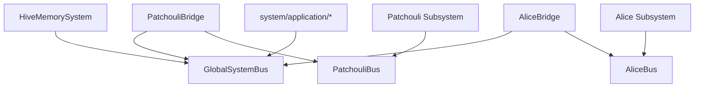

# HiveMemory 第四次架构演进 Bus Foundation 设计

**文档状态**: Draft (设计草案)\
**所属演进**: 第四次架构演进\
**建议阶段名**: Phase B0 / Bus Foundation\
**阶段目标**: 在正式迁移 `ChatApplicationService` 与 `PassiveIngressService` 之前，先建立“全局总线 + 子系统私有总线 + 桥接器”的通信基建，并以 `AsyncSystemBus` 作为统一异步总线基类，为后续 Patchouli/Alice 同级子系统化提供稳定的跨域通信骨架。\
**配套文档**:

- [SystemArchitecture\_v4\_TopLevelSketch.md](file:///c:/Users/29305/Projects/HiveMemory/docs/architecture_evolution/SystemArchitecture_v4_TopLevelSketch.md)
- [SystemArchitecture\_v4\_PhaseA\_Design.md](file:///c:/Users/29305/Projects/HiveMemory/docs/architecture_evolution/SystemArchitecture_v4_PhaseA_Design.md)
- [SystemArchitecture\_v4\_PhaseB\_Design.md](file:///c:/Users/29305/Projects/HiveMemory/docs/architecture_evolution/SystemArchitecture_v4_PhaseB_Design.md)

***

## 1. 文档定位

这份文档回答的不是“某个 service 应该怎么写”，而是一个更基础的问题：

> **在第四次架构演进中，顶层 system、Patchouli 子系统、未来 Alice 子系统之间，究竟通过什么通信骨架交互？**

当前如果不先回答这个问题，后续所有迁移都会不断退化成以下几种不健康形式：

- 顶层 `system/application` 直接注入 `PatchouliSystem`
- 顶层 service 直接持有 `TheEye`
- 顶层代码直接 import `patchouli.protocol` 或其他内部模型
- 通过兼容层跨目录调用旧对象，最终重新缠回历史依赖

因此，这份文档将“总线分层”提升为第四次架构演进中的**前置基础设施阶段**，即：

> **先完成 Bus Foundation，再推进真正的 Phase B 入口编排迁移。**

***

## 2. 为什么 Bus Foundation 必须先做

虽然第四次演进已经建立了：

- `HiveMemorySystem`
- `GlobalSystemBus` 的概念
- `PatchouliSubsystemAdapter`
- `system/application/` 的目录占位

但当前仍缺少真正可执行的通信分层设计。

现状中的关键问题有：

- 现有 [system\_bus.py](file:///c:/Users/29305/Projects/HiveMemory/src/hivememory/infrastructure/system_bus.py) 同时承担：
  - request-response
  - pub/sub
  - sync/async 双栈兼容
  - 无 running loop 时的 `asyncio.run()`
- 这更像历史过渡总线，而不是第四次演进要依赖的稳定通信骨架
- `system/application` 如果没有明确的跨子系统契约入口，就只能继续依赖 Patchouli 内部对象

特别是在 `PassiveIngressService` 的迁移尝试中，这个问题已经非常明显：

- 被动链路想调用 `submit_interaction`
- 被动链路想请求 `handle_hot`
- 但由于没有公开的全局能力契约，只能继续直接拿 `PatchouliSystem`、`TheEye`、`InteractionPayload`

这说明：

- 问题不在某个 service 写得不对
- 而在总线与能力边界还没有先成型

***

## 3. Bus Foundation 的核心目标

Bus Foundation 只做 4 件事。

### 3.1 建立统一的异步总线基类 `AsyncSystemBus`

它是所有新总线实现的共同基类，用于承载：

- 异步 request-response
- 异步 publish-subscribe
- 内省与调试能力
- 生命周期安全约束

### 3.2 建立分层总线实例

至少明确以下三类总线：

- `GlobalSystemBus`
- `PatchouliBus`
- `AliceBus`

它们不是三套完全不同的协议，而是**共享同一抽象基类的不同作用域实例**。

### 3.3 建立桥接器模型

桥接器负责：

- 把子系统的公开能力挂载到全局总线
- 把子系统公开领域事件上抛到全局总线
- 在必要时把全局请求转发回子系统私有总线

### 3.4 建立“公开能力”与“内部通信”的边界

Bus Foundation 最重要的成果之一，不是代码，而是规则：

- 哪些 route/event 可以进入全局总线
- 哪些 route/event 只能留在私有总线
- 顶层 service 可以依赖什么，不能依赖什么

***

## 4. 设计原则

### 4.1 纯 `asyncio`

新总线体系必须是纯 `asyncio` 运行模型：

- 不支持内部偷偷 `asyncio.run()`
- 不再以同步包装为主要调用方式
- 默认要求在已有 running event loop 中运行

### 4.2 同一抽象，多个作用域实例

这次演进不建议为每个总线都发明一套完全不同的机制。

更合理的方式是：

- 一个统一抽象：`AsyncSystemBus`
- 多个派生类：
  - `GlobalSystemBus`
  - `PatchouliBus`
  - `AliceBus`

### 4.3 跨子系统通信必须显式公开

默认情况下：

- 子系统内部 route 不允许自动暴露到全局
- 子系统内部 event 不允许自动进入全局

只有显式声明为：

- `public route`
- `domain event`

的能力，才允许被桥接。

### 4.4 顶层 application 只依赖全局公开契约

`system/application` 下的 service：

- 可以依赖 `GlobalSystemBus`
- 不可以直接依赖 `PatchouliBus`
- 不可以直接 import Patchouli 内部 runtime / protocol / engine

### 4.5 事件与请求必须分开建模

建议在总线接口层明确区分：

- `request-response`
- `publish-subscribe`

而不是继续把所有通信语义混在一个“万能总线”里。

***

## 5. 总体结构

### 5.1 分层关系



### 5.2 一句话解释

- 顶层 `HiveMemorySystem` 持有 `GlobalSystemBus`
- 每个子系统持有自己的私有总线
- 顶层 application 只通过 `GlobalSystemBus` 调用已公开的子系统能力
- 私有总线与全局总线之间通过桥接器连接

***

## 6. `AsyncSystemBus` 基类设计

### 6.1 角色定位

`AsyncSystemBus` 是所有新总线实现的共同基类，不关心它服务的是全局 system 还是某个子系统。

它只关心一件事：

> **在同一个事件循环中，以可预测的方式承载异步 request 和异步 event。**

### 6.2 建议接口

建议基类至少定义以下接口：

```python
class AsyncSystemBus:
    async def request(self, route: str, *args, **kwargs) -> Any: ...
    def register(self, route: str, handler: Callable[..., Awaitable[Any]]) -> None: ...
    def unregister(self, route: str) -> None: ...

    async def publish(self, event: str, *args, **kwargs) -> None: ...
    def subscribe(self, event: str, callback: Callable[..., Awaitable[None]]) -> None: ...
    def unsubscribe(self, event: str, callback: Callable[..., Awaitable[None]]) -> None: ...

    def list_routes(self) -> list[str]: ...
    def list_events(self) -> list[str]: ...
```

### 6.3 与旧 `SystemBus` 的关键区别

新总线基类建议明确以下差异：

- 不再提供同步 `request()`
- 不再提供同步 `emit()`
- 不再自动兼容 sync callback
- 不再在无 loop 时使用 `asyncio.run()`
- 新 API 只接受 async handler / async subscriber

### 6.4 为什么要这么“严格”

因为第四次演进要解决的正是：

- 隐式跨 loop
- 同步异步混用
- 运行时边界不清
- 兼容层过厚导致的结构塌陷

所以总线基类越“保守”，后续系统层迁移越稳。

***

## 7. 派生总线设计

### 7.1 `GlobalSystemBus`

#### 角色

- 项目级顶层公开通信骨架
- 由 `HiveMemorySystem` 持有
- 只服务跨子系统公开契约

#### 允许承载的内容

- 跨子系统公开 route
- 全局系统事件
- 子系统公开的领域事件

#### 不允许承载的内容

- Patchouli 内部 perception / kernel / gateway 的私有 route
- Alice 内部 orchestration runtime 的私有事件
- 任意“临时为了方便调通”的内部能力泄露

### 7.2 `PatchouliBus`

#### 角色

- Patchouli 子系统私有总线
- 由 Patchouli bootstrap/runtime 持有
- 仅服务记忆域内部对象与运行时协作

#### 允许承载的内容

- Patchouli 内部 route
- Patchouli 内部事件
- Patchouli runtime 之间的协作信号

#### 不允许承载的内容

- 直接被顶层 application 调用
- 不经桥接器直接暴露给 `GlobalSystemBus`

### 7.3 `AliceBus`

#### 角色

- Alice 子系统私有总线
- 在 Phase C 中接入，未来完善实现
- 承载多智能体域内部编排与协作

#### 当前要求

Bus Foundation 阶段只需要保留接口与命名位置，不要求立即实现全部 Alice 侧能力。

***

## 8. 桥接器设计

### 8.1 为什么需要桥接器

如果没有桥接器，只有两种糟糕选择：

- 顶层 application 直接访问子系统私有总线
- 子系统内部 route 全量暴露到全局总线

这两种都会破坏边界。

桥接器的存在，就是为了把“可跨域公开的能力”与“纯内部能力”硬切开。

### 8.2 `PatchouliBridge` 的职责

它至少负责三件事：

- 把 Patchouli 愿意公开的 `public routes` 注册到 `GlobalSystemBus`
- 把来自 `GlobalSystemBus` 的调用转发到 `PatchouliBus`
- 把 Patchouli 愿意公开的 `domain events` 上抛到 `GlobalSystemBus`

### 8.3 建议接口

```python
class PatchouliBridge:
    def __init__(self, global_bus: GlobalSystemBus, patchouli_bus: PatchouliBus): ...

    def mount_public_routes(self) -> None: ...
    def mount_event_bridges(self) -> None: ...
    def unmount(self) -> None: ...
```

### 8.4 桥接器不是业务服务

桥接器不应承担：

- 业务编排
- 数据模型转换的复杂策略
- 顶层 application 逻辑

它只负责：

- 契约暴露
- 调用转发
- 事件转发

***

## 9. 路由与事件命名分层

为了防止新总线体系重新滑回“万能字符串定位器”，建议从一开始就定义命名分层。

### 9.1 全局公开 route

建议格式：

- `patchouli.public.*`
- `alice.public.*`
- `system.public.*`（仅在非常必要时）

例如：

- `patchouli.public.passive.handle_hot`
- `patchouli.public.submit_interaction`
- `patchouli.public.topics.manual_trigger`

### 9.2 子系统私有 route

建议格式：

- `passive.*`
- `memory.*`
- `perception.*`
- `gateway.*`
- `orchestration.*`

这些 route 仅存在于私有总线上，不应直接暴露到全局。

### 9.3 领域事件命名

建议格式：

- `patchouli.domain.*`
- `alice.domain.*`
- `system.lifecycle.*`

例如：

- `patchouli.domain.memory.archived`
- `patchouli.domain.perception.flushed`
- `system.lifecycle.ready`

***

## 10. Bus Foundation 对 `PassiveIngressService` 的直接意义

这部分是当前最关键的应用场景。

在新的设计里，顶层 `PassiveIngressService` 应只依赖 `GlobalSystemBus`，并通过桥接后的公开能力与 Patchouli 交互。

### 10.1 顶层 service 未来应使用的全局公开 route

至少包括：

- `patchouli.public.passive.handle_hot`
- `patchouli.public.submit_interaction`

### 10.2 这意味着什么

这意味着：

- 顶层 `PassiveIngressService` 不再持有 `PatchouliSystem`
- 顶层不再持有 `TheEye`
- 顶层不再直接 import `InteractionPayload`
- `TheEye` 继续留在 Patchouli 内部
- `handle_hot` 内部如需先做 `TheEye.gaze()`，由 Patchouli 自己完成

### 10.3 为什么这一步必须先于服务迁移

因为如果没有这些公开 route，顶层 service 就没有合法依赖路径，只能重新回到：

- 直接拿子系统实例
- 直接拿内部模型
- 继续沿用兼容入口

而这正是第四次演进要避免的。

***

## 11. Bus Foundation 对 `ChatApplicationService` 的意义

虽然 `PassiveIngressService` 是当前最先需要迁移的链路，但这套总线基建同样会决定后续 chat 如何演进。

Phase B 之后，`ChatApplicationService` 不应直接绑定 `PatchouliSystem`，而应只依赖：

- 顶层路由决策
- `GlobalSystemBus` 上的公开能力

在 Alice 未接入前：

- 公开 route 可能仍主要落到 Patchouli

在 Alice 接入后：

- 顶层 chat 编排可切换为“先 Alice 决策，再调用 Patchouli 或其他子系统”

所以 Bus Foundation 并不是只服务被动链路，而是整个顶层 application 层的前置通信基础。

***

## 12. 目录建议

考虑到后续会有多个总线实现，建议直接围绕 `AsyncSystemBus` 组织目录。

### 12.1 顶层 system

```text
src/hivememory/system/runtime
│  __init__.py
└─bus
   │  __init__.py
   │  async_bus.py       # AsyncSystemBus 基类
   │  global_bus.py      # GlobalSystemBus
   └─bridge.py           # Bridge 抽象 / 通用桥接辅助
└─contracts
   routes.py
   events.py
```

### 12.2 Patchouli 子系统

```text
src/hivememory/patchouli/runtime
│  __init__.py
│  bus.py                # PatchouliBus
└─bridge.py              # PatchouliBridge

src/hivememory/patchouli/contracts
│  __init__.py
│  public_routes.py
└─domain_events.py
```

### 12.3 Alice 子系统

```text
src/hivememory/alice/runtime
│  __init__.py
│  bus.py                # AliceBus
└─bridge.py              # AliceBridge

src/hivememory/alice/contracts
│  __init__.py
│  public_routes.py
└─domain_events.py
```

### 12.4 与现有代码的关系

Bus Foundation 阶段允许：

- 旧 `SystemBus` 继续存在于 `infrastructure/`
- 新总线体系作为第四次演进专用骨架逐步接管新路径

但不允许：

- 新的 Phase B 代码继续基于旧 `SystemBus` 扩展

***

## 13. 与旧 `SystemBus` 的迁移关系

### 13.1 旧 `SystemBus` 的角色

现有 [system\_bus.py](file:///c:/Users/29305/Projects/HiveMemory/src/hivememory/infrastructure/system_bus.py) 应被重新定义为：

- 历史通信组件
- 向后兼容层
- 非第四次演进新代码的标准依赖

### 13.2 新旧并存策略

Bus Foundation 阶段建议采用“双轨过渡”：

- 旧路径继续可用
- 新迁移路径必须走 `AsyncSystemBus` 体系

### 13.3 不建议做的事

- 不建议直接在旧 `SystemBus` 上继续加 async 兼容补丁
- 不建议为了图快把 `GlobalSystemBus = SystemBus`
- 不建议在桥接器里混用旧 bus 与新 bus 语义

***

## 14. Bus Foundation 的实施顺序

建议按以下顺序推进。

### Step 1：定义 `AsyncSystemBus`

先冻结：

- 基类接口
- 只接受 async handler/subscriber
- request / publish 语义分离

### Step 2：实现 `GlobalSystemBus`

在顶层 system 中明确：

- 由 `HiveMemorySystem` 持有
- 只服务公开契约

### Step 3：实现 `PatchouliBus`

把 Patchouli 私有 route/event 的宿主位置先建立起来。

### Step 4：实现 `PatchouliBridge`

先桥接最小公开能力集合：

- `patchouli.public.passive.handle_hot`
- `patchouli.public.submit_interaction`

### Step 5：补齐契约文档

至少形成：

- `public_routes.py`
- `domain_events.py`
- 命名规范与 payload 草案

### Step 6：在此基础上再迁 `PassiveIngressService`

只有完成前 5 步后，`PassiveIngressService` 的迁移才不会重新滑回对子系统实例的直接依赖。

***

## 15. 测试要求

Bus Foundation 虽然是基础设施层，但必须有独立测试。

### 15.1 `AsyncSystemBus` 基类测试

- 注册 async route
- request 返回结果
- 未注册 route 报错
- publish 调用所有 subscriber
- subscriber 异常隔离

### 15.2 分层边界测试

- `GlobalSystemBus` 不直接持有 Patchouli 私有 route
- `PatchouliBus` 私有 route 不自动进入全局
- 只有桥接后 route 才能在 `GlobalSystemBus` 上调用

### 15.3 桥接器测试

- `PatchouliBridge` 能正确暴露公开 route
- 全局调用会被正确转发到私有总线
- 内部领域事件能够按规则上抛

### 15.4 迁移前置测试

至少需要一条测试明确验证：

- 顶层 `PassiveIngressService` 未来只依赖 `GlobalSystemBus`，而不需要 `PatchouliSystem`

***

## 16. 完成标准

当 Bus Foundation 完成时，至少应满足：

- `AsyncSystemBus` 已成为新总线体系统一基类
- `GlobalSystemBus`、`PatchouliBus`、`AliceBus` 的角色与目录位置已明确
- `PatchouliBridge` 的最小模型已落地
- Patchouli 至少有两条公开能力可通过全局总线访问
- 新迁移代码不再允许直接以兼容方式注入 `PatchouliSystem`
- 后续 `PassiveIngressService` 迁移已经具备稳定前置条件

如果只是新建了几个 bus 类，但顶层 service 仍然需要直接依赖 Patchouli 内部对象，那就不能算真正完成了 Bus Foundation。

***

## 17. 一句话结论

Bus Foundation 的本质，不是“把旧 `SystemBus` 换个名字”，而是**建立第四次架构演进真正可执行的通信骨架**：以 `AsyncSystemBus` 为统一异步总线基类，在其上分化出 `GlobalSystemBus`、`PatchouliBus`、`AliceBus`，并通过桥接器把“子系统内部通信”与“跨子系统公开契约”硬性分层。只有先完成这一步，后续 `PassiveIngressService` 与 `ChatApplicationService` 的迁移才不会重新塌回旧的依赖结构。
