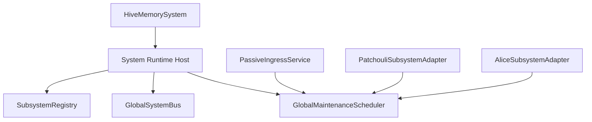

# HiveMemory 第四次架构演进 Maintenance Foundation 设计

**文档状态**: Draft (设计草案)\
**所属演进**: 第四次架构演进\
**建议阶段名**: Phase B0.5 / Maintenance Foundation\
**阶段目标**: 在正式推进 `PassiveIngressService`、`ChatApplicationService` 与未来 `Alice` 子系统的长期编排迁移之前，先建立“全局定时维护器 + 子系统/应用任务注册”的调度基建，并以统一的异步维护调度器抽象承载系统级定时任务，为后续顶层 runtime 收敛提供稳定的维护执行骨架。\
**配套文档**:

- [SystemArchitecture\_v4\_TopLevelSketch.md](file:///c:/Users/29305/Projects/HiveMemory/docs/architecture_evolution/SystemArchitecture_v4_TopLevelSketch.md)
- [SystemArchitecture\_v4\_PhaseA\_Design.md](file:///c:/Users/29305/Projects/HiveMemory/docs/architecture_evolution/SystemArchitecture_v4_PhaseA_Design.md)
- [SystemArchitecture\_v4\_PhaseB\_Design.md](file:///c:/Users/29305/Projects/HiveMemory/docs/architecture_evolution/SystemArchitecture_v4_PhaseB_Design.md)
- [SystemArchitecture\_v4\_BusFoundation\_Design.md](file:///c:/Users/29305/Projects/HiveMemory/docs/architecture_evolution/SystemArchitecture_v4_BusFoundation_Design.md)

***

## 1. 文档定位

这份文档回答的不是“某个 flush 任务该放在哪个类里”，而是一个更基础的问题：

> **在第四次架构演进中，系统级定时维护任务究竟由谁持有、谁注册、谁启动、谁停止？**

如果这个问题不先回答，后续所有迁移都会不断退化成以下几种不健康形式：

- `PatchouliSystem` 自己 new 一个 `SystemAsyncScheduler`
- `PassiveIngressService` 再自己 new 一个 `SystemAsyncScheduler`
- 未来 `ChatApplicationService` / `Alice` / 其他顶层 service 也各自维护一套 scheduler
- 生命周期停止时先后顺序不明，导致 shutdown 期间仍继续触发 flush / cleanup

因此，这份文档将“全局定时维护器”提升为第四次架构演进中的**前置基础设施阶段**，即：

> **先完成 Maintenance Foundation，再继续推进真正稳定的 Phase B 编排迁移。**

***

## 2. 为什么 Maintenance Foundation 必须先做

虽然目前项目里已经有一个可工作的 [maintenance\_scheduler.py](file:///c:/Users/29305/Projects/HiveMemory/src/hivememory/patchouli/kernel/runtime/maintenance_scheduler.py)，并且它解决了早期 APScheduler / 线程 / 事件循环冲突问题，但它仍然没有完成第四次演进意义上的“系统化”。

当前的关键问题有：

- `SystemAsyncScheduler` 的实现路径仍位于 `patchouli/kernel/runtime/`
- 它最初由 `PatchouliSystem` 唯一持有
- 最近在 `PassiveIngressService` 迁移中，又出现了顶层 service 直接实例化 scheduler 的情况

这说明：

- 问题已经不再是“有没有统一调度器”
- 而是“统一调度器的持有权与注册权还没有进入顶层 runtime 基建”

换句话说，这与此前 `SystemBus` 的问题是同构的：

- 功能已经存在
- 但基础设施归属仍不正确
- 一旦继续推进新迁移代码，就会重复制造新的局部宿主

***

## 3. Maintenance Foundation 的核心目标

Maintenance Foundation 只做 4 件事。

### 3.1 建立统一的异步维护调度基类 `AsyncMaintenanceScheduler`

它是所有新维护调度器实现的共同基类，用于承载：

- 维护任务注册表
- 主事件循环中的定时调度
- 非重入保护
- 异常隔离
- 关闭排空
- 内省与运行状态查询

### 3.2 建立全局实例 `GlobalMaintenanceScheduler`

它是项目级唯一的系统维护调度器实例：

- 由顶层 runtime 持有
- 服务整个 `HiveMemorySystem`
- 统一承接应用层与子系统层注册的维护任务

### 3.3 建立“任务归属”模型

维护调度最重要的成果之一，不是执行循环本身，而是规则：

- 哪些任务属于顶层 application
- 哪些任务属于某个 subsystem
- 哪些任务必须跟随 owner 的生命周期注册/卸载

### 3.4 建立“持有权”与“注册权”的分层边界

Maintenance Foundation 最重要的原则是：

- 谁都可以注册自己的维护任务
- 但不是谁都可以 new 一个新的 scheduler

***

## 4. 设计原则

### 4.1 纯 `asyncio`

新的维护调度体系必须继续保持纯 `asyncio`：

- 不创建额外线程
- 不隐式创建新的事件循环
- 不在无 running loop 时偷偷 `asyncio.run()`
- 默认要求在顶层已有 running event loop 中运行

### 4.2 同一抽象，统一宿主

这次演进不建议每个 application service / subsystem 都各自实现一套调度器。

更合理的方式是：

- 一个统一抽象：`AsyncMaintenanceScheduler`
- 一个系统级实例：`GlobalMaintenanceScheduler`
- 多个任务 owner：`patchouli`、`system.passive_ingress`、`alice` 等

### 4.3 任务可以分域，调度器不能分裂

允许不同域拥有不同维护任务：

- `observer_idle_flush`
- `perception_idle_flush`
- 未来的 generation cleanup
- 未来的 agent session maintenance

但不允许这些域各自再持有自己的项目级维护器。

### 4.4 生命周期必须受顶层统一控制

与 bus 类似，scheduler 也是 runtime 基础设施，因此：

- 创建权在顶层 bootstrap/runtime
- 启动权在顶层 lifecycle
- 停止权在顶层 lifecycle

而不是交给某个业务 service 自行决定。

### 4.5 停止顺序必须优先于业务 drain

全局维护器与总线不同。

总线在 shutdown 期间通常仍需要保留，用于完成最后的清理通信；但 scheduler 在 shutdown 期间如果继续运行，就可能反过来再触发新的 flush / cleanup。

因此建议明确：

- stop 阶段优先停止 scheduler
- 然后再执行 service / subsystem 自己的 drain

***

## 5. 总体结构

### 5.1 分层关系



### 5.2 一句话解释

- 顶层 runtime 持有唯一的 `GlobalMaintenanceScheduler`
- application/service 与 subsystem 只负责注册和卸载自己的维护任务
- 任务如何运行由全局维护器统一控制
- 任务何时存在由 owner 生命周期决定

***

## 6. `AsyncMaintenanceScheduler` 基类设计

### 6.1 角色定位

`AsyncMaintenanceScheduler` 是所有新维护调度器实现的共同基类，不关心它服务的是全局 system、某个子系统，还是测试专用 runtime。

它只关心一件事：

> **在同一个事件循环中，以可预测的方式承载异步维护任务的注册、调度、关闭与状态内省。**

### 6.2 建议接口

建议基类至少定义以下接口：

```python
class AsyncMaintenanceScheduler:
    def register(
        self,
        spec: MaintenanceTaskSpec,
        callback: Callable[[], Awaitable[Any]],
    ) -> None: ...

    def unregister(self, task_key: str) -> bool: ...
    def unregister_owner(self, owner: str) -> int: ...

    def set_enabled(self, task_key: str, enabled: bool) -> bool: ...

    def start(self) -> None: ...
    async def stop(self) -> None: ...

    def list_tasks(self) -> list[str]: ...
    def get_status(self) -> dict[str, Any]: ...
```

### 6.3 与当前 `SystemAsyncScheduler` 的关系

当前 [maintenance\_scheduler.py](file:///c:/Users/29305/Projects/HiveMemory/src/hivememory/patchouli/kernel/runtime/maintenance_scheduler.py) 已经证明以下机制是正确方向：

- 纯 `asyncio`
- 非重入保护
- `tick_seconds`
- `shutdown_wait_seconds`
- `get_status()`

因此 Maintenance Foundation 不要求推翻当前逻辑，而是要求：

- 抽离其目录归属
- 补齐 owner 维度
- 补齐系统级持有和生命周期控制

### 6.4 为什么不建议继续把它当成“普通工具类”

因为一旦它继续被当作普通工具类：

- 每个 service 都会自然地自己实例化一份
- 维护任务的命名与归属会快速混乱
- 生命周期顺序会再次漂移到业务类内部

这会直接破坏第四次演进正在建立的 runtime 分层。

***

## 7. `GlobalMaintenanceScheduler`

### 7.1 角色

- 项目级顶层维护调度骨架
- 由 `SystemRuntimeHost` 持有
- 只负责“调度”
- 不负责任何业务任务逻辑

### 7.2 它应当承载的内容

- application 层维护任务
- subsystem 层维护任务
- 运行状态查询
- 停止阶段的统一排空控制

### 7.3 它不应当承载的内容

- 业务规则判断
- 某个子系统内部专属数据模型转换
- 顶层 API 行为组织
- 跨子系统通信语义

### 7.4 它与 `GlobalSystemBus` 的关系

两者都应由 `SystemRuntimeHost` 持有，但职责严格分离：

- `GlobalSystemBus`: 跨边界通信骨架
- `GlobalMaintenanceScheduler`: 定时维护执行骨架

不要将 scheduler 做成 bus 的一个特殊 route，也不要将 bus 做成 scheduler 的回调调度器。

***

## 8. 任务模型设计

### 8.1 为什么必须引入 owner

如果没有 owner，维护任务会快速退化成一组“全局散装字符串”：

- `observer_idle_flush`
- `perception_idle_flush`
- `cleanup`
- `gc`

这样会导致：

- 无法区分任务归属
- 无法在 owner 停止时批量卸载
- 无法做稳定的状态查询

### 8.2 建议的 `MaintenanceTaskSpec`

建议至少包含：

```python
@dataclass
class MaintenanceTaskSpec:
    owner: str
    name: str
    interval_seconds: float
    enabled: bool = True
    non_reentrant: bool = True
    skip_if_running: bool = True
    jitter_seconds: float = 0.0
```

### 8.3 建议的任务主键

建议统一生成：

- `system.passive_ingress.observer_idle_flush`
- `patchouli.perception_idle_flush`
- `alice.session_gc`

这样带来的好处：

- 日志与状态内省统一
- 配置覆盖路径更稳定
- owner 注销更容易做

### 8.4 owner 范围建议

建议至少允许以下 owner：

- `system.passive_ingress`
- `system.chat`
- `patchouli`
- `alice`

不建议用过于细碎的 owner，例如：

- `patchouli.eye`
- `patchouli.kernel.librarian.perception.idle`

这种粒度更适合写在任务名里，而不是 owner 层级。

***

## 9. 谁注册什么任务

### 9.1 `PassiveIngressService`

应注册：

- `system.passive_ingress.observer_idle_flush`

原因：

- 该任务服务的是顶层被动消息接入编排
- 它不再属于 Patchouli 内部私有运行时

### 9.2 `PatchouliSubsystem`

应注册：

- `patchouli.perception_idle_flush`
- 未来仍留在记忆域内部的 maintenance task

原因：

- 这些任务仍是 Patchouli 记忆域的内部维护职责

### 9.3 `ChatApplicationService`

目前可以不注册任务，但未来如果有，则应注册为：

- `system.chat.*`

### 9.4 `AliceSubsystem`

当前只保留设计位置，不要求立即落地全部任务。

未来如接入 agent orchestration maintenance，则应注册为：

- `alice.*`

***

## 10. 生命周期与启动顺序

### 10.1 为什么 scheduler 不应由业务类直接 start/stop

如果 `PassiveIngressService` 或 `PatchouliSystem` 直接 start/stop scheduler，会带来三个问题：

- runtime 基建职责下沉到了业务层
- 启停顺序无法由顶层统一约束
- 多个 service 可能重复持有自己的调度器

### 10.2 建议启动顺序

建议：

1. `SystemBootstrap` 创建 `GlobalMaintenanceScheduler`
2. 构建 `RuntimeHost`
3. 构建 application service 与 subsystem adapter
4. 各 owner 在自己的 `start()` 阶段注册任务
5. 顶层 lifecycle 最后统一启动 scheduler

### 10.3 建议停止顺序

建议：

1. 顶层 lifecycle 先停止 scheduler
2. 然后让 application/service 执行 drain
3. 再停止 subsystem
4. 最后结束 runtime

### 10.4 为什么 stop 要先停 scheduler

因为如果 scheduler 在 shutdown drain 过程中仍继续运行，就可能发生：

- drain 期间又触发一轮 idle flush
- perception 刚开始停机又被重新调度
- 产生重复提交或新的清理竞争

这在结构上是不稳定的。

***

## 11. 目录建议

考虑到未来可能有多种维护调度实现，建议围绕统一抽象组织目录。

### 11.1 顶层 system

```text
src/hivememory/system/runtime
│  __init__.py
│  host.py
│  registry.py
│
└─bus
   │  __init__.py
   │  async_bus.py
   │  global_bus.py
   └─bridge.py
│
└─scheduler
   │  __init__.py
   │  async_scheduler.py        # AsyncMaintenanceScheduler 基类
   │  global_scheduler.py       # GlobalMaintenanceScheduler
   └─models.py                  # MaintenanceTaskSpec / TaskRuntimeState
```

### 11.2 与当前代码的关系

Maintenance Foundation 阶段允许：

- 先复用当前 `SystemAsyncScheduler` 的实现逻辑
- 通过搬迁或别名过渡逐步切换目录位置

但不允许：

- 新的 Phase B 代码继续在 application/service 内直接 `SystemAsyncScheduler(...)`

***

## 12. 与当前 `SystemAsyncScheduler` 的迁移关系

### 12.1 当前实现的角色

现有 [maintenance\_scheduler.py](file:///c:/Users/29305/Projects/HiveMemory/src/hivememory/patchouli/kernel/runtime/maintenance_scheduler.py) 应被重新定义为：

- 已验证有效的异步维护调度实现原型
- 第四次演进新维护基建的逻辑来源
- 但不是最终的基础设施归属位置

### 12.2 新旧并存策略

Maintenance Foundation 阶段建议采用“双轨过渡”：

- 旧路径继续可引用
- 新迁移路径必须开始转向 `system/runtime/scheduler/`

### 12.3 不建议做的事

- 不建议继续让 `PatchouliSystem` 作为项目级 scheduler 的宿主
- 不建议在顶层 `PassiveIngressService` 中直接 new scheduler
- 不建议在多个 service 中各自复制一套 start/stop/register 逻辑

***

## 13. 对当前 `PassiveIngressService` 的直接意义

这是当前最关键的应用场景。

在新的设计里，顶层 `PassiveIngressService` 应：

- 注册自己的 observer maintenance task
- 但不拥有 scheduler 实例本身

### 13.1 它未来应做的事

- 向 `GlobalMaintenanceScheduler` 注册：
  - `system.passive_ingress.observer_idle_flush`
- 在 stop/shutdown 时卸载或依赖 owner 维度统一卸载

### 13.2 它不应再做的事

- `self._scheduler = SystemAsyncScheduler(...)`
- 自己决定 scheduler 启停顺序
- 作为项目级调度器宿主

### 13.3 为什么这一步必须先于后续继续迁移

因为如果 scheduler 的基建先不成型，任何新的 application migration 都会再次犯同样的问题：

- service 看起来迁出来了
- 但 runtime 基础设施却继续分散持有

这会使第四次演进的边界收敛变成表面迁移。

***

## 14. 对 `PatchouliSystem` 的直接意义

Maintenance Foundation 完成后，`PatchouliSystem` 应逐步失去“项目级调度器宿主”这一角色。

### 14.1 `PatchouliSystem` 仍可保留的内容

- 记忆域内部维护任务的 callback 实现
- 记忆域 runtime 专属状态
- 可能的 Patchouli 私有 task 定义辅助

### 14.2 `PatchouliSystem` 不再适合继续承担的内容

- 项目级 scheduler 的创建
- 项目级 scheduler 的 start/stop
- application 层 maintenance task 的统一装配

### 14.3 更合理的目标形态

`PatchouliSubsystemAdapter` 或 Patchouli 自己的 runtime bootstrap：

- 在 start 时向全局维护器注册 Patchouli 任务
- 在 stop 时注销 Patchouli 任务

而不是让 `PatchouliSystem` 自己拥有并驱动调度器。

***

## 15. 实施顺序

建议按以下顺序推进。

### Step 1：抽象 `AsyncMaintenanceScheduler`

先冻结：

- 统一接口
- 只接受 async callback
- start/stop 语义
- owner 维度

### Step 2：实现 `GlobalMaintenanceScheduler`

在顶层 runtime 中明确：

- 由 `SystemRuntimeHost` 持有
- 只服务系统级维护任务调度

### Step 3：改造 `RuntimeHost` 与 lifecycle

让 lifecycle 明确：

- start 时统一启动全局维护器
- stop 时优先停止全局维护器

### Step 4：迁移 `PassiveIngressService`

改成：

- 不再实例化 scheduler
- 只注册/卸载自己的 observer task

### Step 5：迁移 `PatchouliSystem`

改成：

- 不再拥有项目级 scheduler
- 只暴露 perception idle flush 等 callback

### Step 6：为未来 `Alice` 预留 owner 与注册模式

确保后续接入不再重新发明第二套维护基础设施。

***

## 16. 测试要求

Maintenance Foundation 虽然是基础设施层，但必须有独立测试。

### 16.1 调度器基类测试

- 注册任务
- 未注册任务注销
- 非重入保护
- 关闭超时与取消
- 状态查询

### 16.2 owner 维度测试

- 同 owner 多任务注册
- `unregister_owner(owner)` 批量卸载
- owner 停止后任务不再继续调度

### 16.3 lifecycle 测试

- 顶层 start 后全局维护器进入运行态
- 顶层 stop 时先停维护器再执行业务 drain

### 16.4 迁移前置测试

至少需要明确验证：

- `PassiveIngressService` 不再直接持有 scheduler
- `PatchouliSystem` 不再直接持有项目级 scheduler
- application task 与 subsystem task 可同时注册到同一全局维护器

***

## 17. 完成标准

当 Maintenance Foundation 完成时，至少应满足：

- 只有一个顶层 `GlobalMaintenanceScheduler` 被创建
- 它由 `SystemRuntimeHost` 持有
- 顶层 lifecycle 统一控制 scheduler 的启动与停止
- `PassiveIngressService` 不再直接实例化 scheduler
- `PatchouliSystem` 不再作为项目级 scheduler 宿主
- 维护任务已具备稳定的 owner 命名与状态查询能力
- `observer_idle_flush` 与 `perception_idle_flush` 可以在同一全局维护器下共存而不互相污染

如果只是把 `SystemAsyncScheduler` 从一个类挪到另一个类，但没有解决“谁持有、谁注册、谁启停”的问题，就不能算真正完成了 Maintenance Foundation。

***

## 18. 一句话结论

Maintenance Foundation 的本质，不是“再把当前 scheduler 挪个目录”，而是**建立第四次架构演进真正可执行的系统级维护执行骨架**：以统一的异步维护调度器抽象为基础，在顶层 runtime 中持有唯一的 `GlobalMaintenanceScheduler`，让 application 与 subsystem 只负责注册各自的维护任务，而不再各自持有项目级定时器。只有先完成这一步，后续 `PassiveIngressService`、`ChatApplicationService` 与未来 `Alice` 的迁移，才不会再次滑回“谁需要定时器谁就自己 new 一个”的旧结构。
