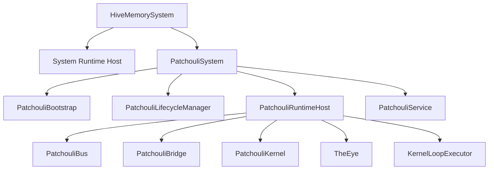

# HiveMemory 第四次架构演进 Patchouli Subsystem Normalization 设计

**文档状态**: Draft (设计草案)\
**所属演进**: 第四次架构演进\
**建议阶段名**: Phase B1 / Patchouli System Normalization\
**阶段目标**: 在顶层 `HiveMemorySystem`、总线基建与全局维护基建已经建立后，进一步将 `Patchouli` 从“被顶层 system 临时包裹的历史大类”规范化为真正的记忆子系统，建立其独立的 `PatchouliSystem` 宿主、bootstrap、runtime host 与 lifecycle 边界，并将当前承担对外 API 的 `PatchouliSystem` 收缩并重命名为 `PatchouliService`，为后续 `ChatApplicationService`、`PassiveIngressService` 与 `Alice` 子系统迁移提供稳定的记忆域宿主骨架。\
**配套文档**:

- [SystemArchitecture_v4_TopLevelSketch.md](file:///c:/Users/29305/Projects/HiveMemory/docs/architecture_evolution/SystemArchitecture_v4_TopLevelSketch.md)
- [SystemArchitecture_v4_PhaseA_Design.md](file:///c:/Users/29305/Projects/HiveMemory/docs/architecture_evolution/SystemArchitecture_v4_PhaseA_Design.md)
- [SystemArchitecture_v4_BusFoundation_Design.md](file:///c:/Users/29305/Projects/HiveMemory/docs/architecture_evolution/SystemArchitecture_v4_BusFoundation_Design.md)
- [SystemArchitecture_v4_MaintenanceFoundation_Design.md](file:///c:/Users/29305/Projects/HiveMemory/docs/architecture_evolution/SystemArchitecture_v4_MaintenanceFoundation_Design.md)

***

## 1. 文档定位

这份文档回答的不是“`PatchouliSystem` 里还有哪些方法该删”，而是一个更基础的问题：

> **在第四次架构演进中，Patchouli 作为记忆子系统，究竟应该怎样拥有自己的 bootstrap、runtime 与 lifecycle 边界？**

如果这个问题不先回答，后续所有迁移都会继续退化成以下几种不健康形式：

- 顶层 `SystemBootstrap` 继续直接理解 Patchouli 私有装配细节
- `PatchouliSubsystemAdapter` 不断吸收 Patchouli 私有 lifecycle 逻辑
- `PatchouliSystem` 一边作为 façade，一边继续承担对象图装配与运行时宿主职责
- `shutdown_drain()`、本地 routes、maintenance tasks、bridge 生命周期继续散落在 system 层与 patchouli 层之间

因此，这份文档将 “Patchouli 子系统规范化” 定义为第四次架构演进中 **晚于 Phase A / Bus Foundation / Maintenance Foundation，但先于 Patchouli 彻底瘦身** 的关键阶段。

### 1.1 本文采用的命名映射

为避免继续混淆“运行单元”和“能力门面”，本文后续统一采用以下目标命名：

- 当前代码里的 `PatchouliSystem`
  - 在目标形态中收缩并重命名为 `PatchouliService`
  - 负责对外能力 API
- 计划中的 `PatchouliSubsystem`
  - 在目标形态中命名为 `PatchouliSystem`
  - 负责 bootstrap、runtime 与 lifecycle

如果本文某处提到“当前 `PatchouliSystem`”，指的是仓库现状中的历史大类；如果提到“目标形态中的 `PatchouliSystem`”，指的是规范化后的 Patchouli 子系统宿主。

***

## 2. 为什么这一步现在必须做

当前顶层系统相关的三项前置工作已经基本成立：

- `HiveMemorySystem` 顶层宿主层已经建立
- `GlobalSystemBus + PatchouliBus + PatchouliBridge` 的通信骨架已经落地
- `GlobalMaintenanceScheduler` 的持有权、注册权与启停顺序已经收敛

这意味着：

- 顶层 system 已经有地方承载项目级 runtime
- Patchouli 已经不需要继续充当项目级 bus / scheduler 宿主
- `PassiveIngressService` 与后续 `ChatApplicationService` 的迁移，已经不再缺乏基础设施支撑

但当前 Patchouli 本身仍处于“结构未规范化”的中间态。

典型表现包括：

- `SystemBootstrap` 仍直接创建 `PatchouliBus`、`PatchouliBridge`、`PatchouliSubsystemAdapter`
- `PatchouliSubsystemAdapter` 仍代替 Patchouli 自己完成：
  - 本地 route 注册
  - maintenance 注册/卸载
  - bridge mount/unmount
  - shutdown drain 调用
- `PatchouliSystem` 仍同时承担：
  - 对象图装配
  - gateway 初始化
  - runtime 状态持有
  - maintenance task 定义
  - shutdown drain
  - façade 能力暴露

这说明：

- 顶层结构虽然已经成立
- 但 Patchouli 还没有真正成为“独立、规范、可演进的子系统”

如果现在继续推进更多入口迁移，只会把 Patchouli 的私有结构继续从侧面暴露给顶层。

***

## 3. 这一阶段的核心目标

Patchouli System Normalization 只做 4 件事。

### 3.1 建立 Patchouli 子系统自己的 bootstrap

由 Patchouli 自己负责：

- 读入配置依赖
- 创建 Patchouli 私有 runtime
- 创建 Patchouli 私有 bus / bridge
- 创建 `PatchouliService` 与 `PatchouliSystem`

而不是继续让顶层 `SystemBootstrap` 理解这些细节。

### 3.2 建立 Patchouli 子系统自己的 runtime host

将当前散落在 `PatchouliSystem` 内部的运行时对象与状态收拢到统一宿主，例如：

- `PatchouliKernel`
- `TheEye`
- `WorkerAgentService`
- `KernelLoopExecutor`
- `MessageAssembler`
- `PatchouliBus`
- `PatchouliBridge`
- shutdown / generation / runtime flags

### 3.3 建立 Patchouli 子系统自己的 lifecycle manager

由 Patchouli 自己负责：

- 本地 route 注册与卸载
- maintenance task 注册与卸载
- bridge mount / unmount
- 子系统级 shutdown drain

而不是继续由 `PatchouliSubsystemAdapter` 临时代管。

### 3.4 将当前 `PatchouliSystem` 收缩并重命名为 `PatchouliService`

规范化之后，`PatchouliService` 应主要承担：

- 记忆子系统对上暴露的能力接口
- façade 级兼容访问器
- 对 runtime host / services 的薄委托

而目标形态中的 `PatchouliSystem` 则负责：

- 持有 `PatchouliBootstrap`
- 持有 `PatchouliRuntimeHost`
- 持有 `PatchouliLifecycleManager`
- 作为正式子系统接入顶层 registry

***

## 4. 设计原则

### 4.1 顶层只知道“Patchouli 是一个子系统”

`HiveMemorySystem` 与 `SystemBootstrap` 可以知道：

- 有一个名为 `patchouli` 的子系统
- 它实现了 `SubsystemProtocol`
- 它需要接入全局 bus / scheduler

但不应继续知道：

- Patchouli 本地 route 的具体注册细节
- Patchouli 私有 bridge 的装配细节
- Patchouli 私有 runtime 的对象图

### 4.2 Patchouli 私有 runtime 必须回到 Patchouli 内部

Patchouli 的私有 bus、bridge、lifecycle、runtime host，都应由 `patchouli/` 自己持有。

### 4.3 façade、bootstrap、lifecycle 三者必须解耦

这一步最重要的结构原则是：

- façade 负责“暴露能力”
- bootstrap 负责“装配对象”
- lifecycle 负责“管理启停”

不允许继续在当前 `PatchouliSystem`（未来的 `PatchouliService`）类里混合三者职责。

### 4.4 规范化优先于继续删代码

在 Patchouli 子系统骨架稳定之前，不建议继续零散删除更多方法。

更稳妥的顺序是：

- 先建立新宿主
- 再迁职责
- 最后删残留兼容层

### 4.5 行为尽量不变，结构先收敛

这一阶段仍然以结构迁移为主，不应主动引入大规模业务行为变化。

***

## 5. 当前结构中的具体问题

### 5.1 `SystemBootstrap` 仍在装配 Patchouli 私有结构

当前顶层 bootstrap 直接创建：

- `PatchouliSystem`
- `PatchouliBus`
- `PatchouliBridge`
- `PatchouliSubsystemAdapter`

这说明 Patchouli 还没有自己的子系统 bootstrap 边界。

### 5.2 `PatchouliSubsystemAdapter` 过度承载 Patchouli 私有 lifecycle

当前 adapter 实际上已经在做 Patchouli 的 lifecycle manager 工作：

- 注册本地 routes
- 注册维护任务
- mount / unmount bridge
- 调用 `shutdown_drain()`

这会导致：

- 顶层 system 层不断吸收 Patchouli 私有逻辑
- Patchouli 的真实边界继续模糊

### 5.3 `PatchouliSystem` 仍是“历史大类”

它同时承担了：

- façade
- bootstrap
- runtime host
- lifecycle 状态持有
- shutdown drain

这正是你前面一系列架构演进中不断遇到的“PatchouliSystem 臃肿”根源之一。

### 5.4 `shutdown_drain()` 仍未子系统化

当前它仍带有历史 observer 残留语义，尚未被规范成“纯 Patchouli 子系统 shutdown drain”。

也就是说：

- 它现在是一个“过渡态 shutdown 方法”
- 还不是一个真正由 Patchouli lifecycle manager 接管的子系统级关闭流程

***

## 6. 目标结构

### 6.1 顶层关系



### 6.2 一句话解释

- 顶层只装配一个 `PatchouliSystem`
- `PatchouliSystem` 自己拥有 bootstrap / runtime host / lifecycle
- 当前 `PatchouliSystem` 收缩并重命名为 `PatchouliService`

***

## 7. 推荐组件设计

### 7.1 `PatchouliBootstrap`

#### 角色

- Patchouli 子系统内部装配器
- 负责构建 Patchouli 私有对象图
- 向顶层返回规范化的子系统对象

#### 输入

- `HiveMemoryConfig`
- `GlobalSystemBus`
- `GlobalMaintenanceScheduler`

#### 输出

- `PatchouliSystem`
- `PatchouliService`
- `PatchouliRuntimeHost`

#### 它应负责

- 创建 `PatchouliKernel`
- 创建 `TheEye`
- 创建 `WorkerAgentService`
- 创建 `KernelLoopExecutor`
- 创建 `MessageAssembler`
- 创建 `PatchouliBus`
- 创建 `PatchouliBridge`
- 创建 `PatchouliLifecycleManager`

#### 它不应负责

- 顶层系统 lifecycle
- server 层适配
- 其他子系统装配

### 7.2 `PatchouliRuntimeHost`

#### 角色

- 聚合 Patchouli 子系统专属 runtime 对象与状态

#### 建议持有

- `PatchouliKernel`
- `TheEye`
- `WorkerAgentService`
- `KernelLoopExecutor`
- `MessageAssembler`
- `PatchouliBus`
- `PatchouliBridge`
- generation cancellation registry
- shutdown / health flags

#### 它不应持有

- 顶层全局 bus
- 顶层全局 scheduler 的控制权
- 顶层 application service

### 7.3 `PatchouliLifecycleManager`

#### 角色

- Patchouli 子系统的正式生命周期管理器

#### 应负责

- 注册/卸载本地 routes
- 注册/卸载 Patchouli maintenance tasks
- mount/unmount bridge
- 触发 Patchouli shutdown drain

#### 应暴露的最小接口

```python
class PatchouliLifecycleManager:
    async def start(self) -> None: ...
    async def stop(self) -> None: ...
    async def health(self) -> dict[str, Any]: ...
```

### 7.4 `PatchouliSystem`

#### 角色

- Patchouli 子系统的正式 `SubsystemProtocol` 实现
- 顶层 registry 只注册它，不再注册 `PatchouliSubsystemAdapter`

#### 应持有

- `name = "patchouli"`
- `PatchouliLifecycleManager`
- `PatchouliService`
- `PatchouliRuntimeHost`

#### 它不应变成新的胖 façade

`PatchouliSystem` 的重点是“对子系统作为运行单元进行承载”，而不是再成为另一个对外大总管。

### 7.5 `PatchouliService`

#### 规范化后的角色

- Patchouli façade
- 供顶层应用服务或未来 Alice 使用的记忆域能力接口

#### 预期保留能力

- `analyze_and_retrieve()`
- `chat()`
- `chat_stream()`
- `manual_trigger()`
- 少量兼容访问器

#### 预期迁出的内容

- 对象图装配
- route 注册
- maintenance 注册
- bridge 生命周期
- shutdown lifecycle 控制

***

## 8. 生命周期设计

### 8.1 启动顺序

Patchouli 子系统启动时，建议顺序为：

1. 注册 Patchouli 本地 routes
2. 注册 Patchouli maintenance tasks
3. mount PatchouliBridge
4. 标记子系统 ready

### 8.2 停止顺序

在当前第四次演进已建立的全局 stop 顺序下，Patchouli 子系统 stop 阶段建议为：

1. 先确认全局 scheduler 已停止
2. 执行 Patchouli 子系统 shutdown drain
3. unmount bridge
4. 卸载本地 routes
5. 卸载 maintenance tasks（若尚未在更早阶段完成）

### 8.3 为什么 shutdown drain 应归 Patchouli lifecycle

因为它属于：

- Patchouli 内部 runtime 关闭逻辑
- Patchouli 记忆域状态排空逻辑

而不是顶层 system 应直接理解的东西。

***

## 9. 与总线基建的关系

Patchouli System Normalization 不重新定义 Bus Foundation，但要把其结论真正接入 Patchouli 子系统内部：

- `PatchouliBus` 由 Patchouli 自己持有
- `PatchouliBridge` 由 Patchouli 自己持有
- 公开 route 的注册应由 Patchouli lifecycle 自己管理
- 顶层 `SystemBootstrap` 不再直接理解本地 route 细节

换句话说：

- Bus Foundation 解决“总线该长什么样”
- Patchouli Normalization 解决“Patchouli 该如何真正拥有并使用这套总线”

***

## 10. 与维护基建的关系

Patchouli System Normalization 同样不重新定义 Maintenance Foundation，但要把其结论真正接入 Patchouli 子系统内部：

- Patchouli 只定义自己的 task callback
- Patchouli lifecycle 负责在 start/stop 时注册和卸载任务
- `PatchouliService` 不再承担项目级 scheduler 宿主职责

这意味着当前的：

- `register_maintenance_tasks()`
- `unregister_maintenance_tasks()`

最终更适合迁入 Patchouli lifecycle / runtime 层，而不长期留在 façade 上。

***

## 11. 目录建议

建议围绕“system / service / runtime”三层组织 Patchouli。

```text
src/hivememory/patchouli
│  __init__.py
│  system.py                    # PatchouliSystem
│  service.py                   # PatchouliService
│
└─runtime
   │  __init__.py
   │  bootstrap.py              # PatchouliBootstrap
   │  host.py                   # PatchouliRuntimeHost
   │  lifecycle.py              # PatchouliLifecycleManager
   │  bus.py                    # PatchouliBus
   └─bridge.py                  # PatchouliBridge
```

### 11.1 与当前代码的关系

这一阶段允许：

- 保留 `patchouli/system.py` 作为子系统宿主文件
- 新增 `patchouli/service.py` 作为能力门面
- 暂时保留部分兼容访问器

但不允许：

- 继续把新的 Patchouli 私有 lifecycle 逻辑堆回当前 `PatchouliSystem`
- 继续让 `SystemBootstrap` 承担 Patchouli 私有装配职责

***

## 12. 对当前文件的迁移映射

### 12.1 从 `system/bootstrap.py` 迁出的内容

当前顶层 bootstrap 中与 Patchouli 私有相关的内容，应迁入 `patchouli/runtime/bootstrap.py`：

- `PatchouliBus` 创建
- `PatchouliBridge` 创建
- `PatchouliSubsystemAdapter` 的构造细节

### 12.2 从 `system/patchouli_subsystem.py` 迁出的内容

当前 adapter 中的以下内容，应迁入 `patchouli/runtime/lifecycle.py`：

- `_register_local_routes()`
- `_unregister_local_routes()`
- maintenance register/unregister
- bridge mount/unmount
- `shutdown_drain()` 的 stop 编排调用

### 12.3 从 `patchouli/system.py` 迁出的内容

以下内容应从当前 `patchouli/system.py` 中迁出：

- 子系统宿主职责迁入新的 `patchouli/system.py`
- 能力 façade 收缩并迁入新的 `patchouli/service.py`

其中以下内容应迁出 `PatchouliService`：

- `_init_gateway()`
- worker / loop executor 初始化
- runtime flags
- 本地 runtime 宿主状态
- 生命周期控制逻辑

***

## 13. 实施顺序

建议按以下顺序推进。

### Step 1：建立 Patchouli 子系统骨架

先创建：

- `PatchouliBootstrap`
- `PatchouliRuntimeHost`
- `PatchouliLifecycleManager`
- `PatchouliSystem`

### Step 2：把顶层 Patchouli 私有装配迁回子系统

让 `SystemBootstrap` 改为只调用：

- `PatchouliBootstrap.build(...)`

而不是自己拼 Patchouli 私有 bus / bridge / adapter。

### Step 3：把 lifecycle 从 adapter 迁回 Patchouli

把当前 `PatchouliSubsystemAdapter` 中的 lifecycle 逻辑迁到 Patchouli 自己的 lifecycle manager。

### Step 4：收缩并重命名当前 `PatchouliSystem`

让它退回能力门面，并重命名为 `PatchouliService`，只保留能力接口与极薄兼容层。

### Step 5：清理历史残留

在新结构稳定后，再继续删除：

- `_passive_ingressor`
- observer 残留 shutdown 语义
- 不再合理的兼容访问器

***

## 14. 测试要求

这一阶段虽然是结构重构，但必须有独立测试。

### 14.1 bootstrap 测试

- `PatchouliBootstrap` 可成功构建完整子系统
- 顶层只需依赖 `PatchouliSystem`，不需理解私有 bus / bridge 细节

### 14.2 lifecycle 测试

- Patchouli 子系统 start 能正确：
  - 注册本地 routes
  - 注册 maintenance tasks
  - mount bridge
- Patchouli 子系统 stop 能正确：
  - 执行 shutdown drain
  - unmount bridge
  - 卸载 routes / tasks

### 14.3 service 测试

- `PatchouliService` 的核心能力仍可正常工作
- service 只做委托，不重新吸收 lifecycle 职责

### 14.4 迁移边界测试

至少需要明确验证：

- `SystemBootstrap` 不再直接创建 `PatchouliBus` / `PatchouliBridge`
- `PatchouliSubsystemAdapter` 已删除或退化为兼容壳

***

## 15. 完成标准

当 Patchouli Subsystem Normalization 完成时，至少应满足：

- Patchouli 已拥有自己的 bootstrap、runtime host 与 lifecycle manager
- 顶层 `SystemBootstrap` 不再理解 Patchouli 私有装配细节
- `PatchouliSubsystemAdapter` 被删除或极薄化
- `PatchouliSystem` 成为正式子系统宿主
- `PatchouliService` 不再承担对象图装配与 lifecycle 宿主职责
- Patchouli 的 route 注册、maintenance 注册、shutdown drain 已归于子系统自身管理
- 后续 `ChatApplicationService` / `Alice` 接入时，不再需要直接碰 Patchouli 私有 runtime 结构

如果只是从 `PatchouliSystem` 中挪出几个方法，但顶层仍在拼 Patchouli 私有对象图，这一步就不能算真正完成。

***

## 16. 一句话结论

Patchouli System Normalization 的本质，不是“继续给当前 `PatchouliSystem` 拆小方法”，而是**建立新的 `PatchouliSystem` 作为正式子系统宿主，并把当前 `PatchouliSystem` 收缩重命名为 `PatchouliService`**：顶层 system 只负责装配一个名为 `patchouli` 的子系统，而 Patchouli 自己负责持有并管理其私有 bus、bridge、maintenance、shutdown drain 与运行时对象；对外能力则统一经由 `PatchouliService` 暴露。只有先完成这一步，后续规范化 `ChatApplicationService` 与接入 `Alice` 才会真正顺畅。
