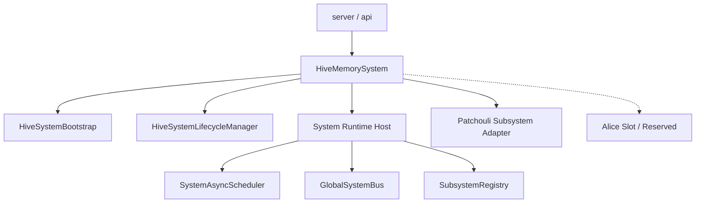

# HiveMemory 第四次架构演进 Phase A 设计

**文档状态**: Draft (设计草案)\
**所属演进**: 第四次架构演进\
**阶段目标**: 建立 `HiveMemorySystem` 顶层系统壳，在尽量不改业务行为的前提下，为后续 `Patchouli` 回归记忆子系统、`Alice` 作为同级多智能体子系统接入、以及系统级 runtime 抽离提供稳定宿主层。\
**配套草图**: [SystemArchitecture\_v4\_TopLevelSketch.md](file:///c:/Users/29305/Projects/HiveMemory/docs/architecture_evolution/SystemArchitecture_v4_TopLevelSketch.md)

***

## 1. Phase A 的定位

Phase A 不是一次“功能重写”，而是一次**结构先行的顶层宿主层建立**。

它要解决的问题是：

- 当前项目已经长出了项目级 runtime，但仓库里还没有真正的顶层系统层
- `PatchouliSystem` 正在事实性承担系统宿主职责
- `SystemAsyncScheduler`、`SystemBus` 这类项目级运行时原语仍寄居在 `patchouli/` 或 `infrastructure/`
- 如果继续在当前结构上推进 Alice Phase 3，多智能体顶层编排会继续被迫嵌套在 `patchouli/`

因此，Phase A 的目标不是立即完成“Patchouli 拆身”或“把所有逻辑都迁走”，而是先建立一个足够稳定的上层壳：

- 新的 `system/` 顶层目录
- 新的 `HiveMemorySystem` 门面
- 新的顶层 bootstrap / lifecycle / runtime 骨架
- 与现有 `PatchouliSystem` 共存的过渡装配方式

换句话说，Phase A 的核心是：

> **先让顶层系统层存在，再让后续迁移有地方可去。**

***

## 2. 当前基线

从当前实现看，[system.py](file:///c:/Users/29305/Projects/HiveMemory/src/hivememory/patchouli/system.py) 已经在承担大量项目宿主职责：

- 创建并持有 `SystemBus`
- 创建并持有 `PatchouliKernel`
- 初始化 `TheEye`
- 初始化被动 ingress 编排器 `PassiveObserverIngressor`
- 初始化 `WorkerAgentService`
- 初始化 `KernelLoopExecutor`
- 创建并持有 `SystemAsyncScheduler`
- 注册维护任务
- 对外暴露主动 `chat`、被动 `ingest`、lifecycle、shutdown drain 等入口

这说明当前代码中已经存在一个“事实上的顶层 system”，只是它还叫 `PatchouliSystem`，并且还落在 `patchouli/` 下。

此外，[maintenance\_scheduler.py](file:///c:/Users/29305/Projects/HiveMemory/src/hivememory/patchouli/kernel/runtime/maintenance_scheduler.py) 已经证明了一件事：

- 项目级 runtime 原语是可以脱离具体业务实现而独立存在的
- 这正是 Phase A 可以优先落地“顶层系统壳”的基础

***

## 3. Phase A 的目标

Phase A 只聚焦 5 个目标。

### 3.1 建立 `system/` 顶层目录

在 `src/hivememory/` 下建立真正的项目级顶层系统目录，至少包含：

- 顶层 façade
- bootstrap
- lifecycle
- runtime 原语骨架
- contracts
- application 占位层

### 3.2 建立 `HiveMemorySystem`

新增 `HiveMemorySystem` 作为项目级门面，用于：

- 承担项目级系统身份
- 持有系统级 runtime
- 装配子系统
- 对外暴露统一入口

### 3.3 把系统级 runtime 明确“升格”

Phase A 中至少要完成语义层面的升格设计：

- `SystemAsyncScheduler` 视为 `system/runtime` 原语
- `SystemBus` 视为 `system/runtime` 原语

这里的重点是**归属关系被明确**，不要求在 Phase A 一次性完成所有旧代码迁移。

### 3.4 建立子系统装配骨架

Phase A 中需要让 `HiveMemorySystem` 能够装配子系统，但先不要求所有子系统都完成最终形态。

第一步至少应支持：

- 装配 `Patchouli` 作为当前唯一正式子系统
- 为未来 `Alice` 预留并列装配位置

### 3.5 为后续 Phase B/C 提供稳定迁移目标

Phase A 完成后，后续各阶段应不再需要“先争论目录该放哪”，而是直接围绕 `system/` 顶层壳继续演进。

***

## 4. Phase A 明确不做什么

为了避免“顶层结构迁移”和“业务行为重写”纠缠在一起，Phase A 明确不做以下事情：

- 不在本阶段重写 `chat` / `chat_stream` / `ingest` 的完整编排逻辑
- 不在本阶段彻底重构 `PatchouliSystem`
- 不在本阶段接入 Alice 的真实业务实现
- 不在本阶段强行判断所有 runtime 对象的最终归属
- 不在本阶段重做所有 bus / event 契约
- 不在本阶段追求一次性清空全部旧导入路径

也就是说，Phase A 的关键策略是：

> **允许过渡层存在，但不允许顶层系统层继续缺席。**

***

## 5. Phase A 的核心产出

### 5.1 目录级产出

建议至少新增以下骨架：

```text
src/hivememory/system
│  __init__.py
│  system.py
│  bootstrap.py
│  lifecycle.py
│
├─application
│  │  __init__.py
│  │  chat_service.py
│  └─passive_ingress_service.py
│
├─runtime
│  │  __init__.py
│  │  scheduler.py
│  │  bus.py
│  │  host.py
│  └─registry.py
│
└─contracts
   │  __init__.py
   │  subsystem.py
   └─events.py
```

### 5.2 对应代码级产出

建议 Phase A 至少形成以下对象：

- `HiveMemorySystem`
- `SystemBootstrap`
- `SystemLifecycleManager`
- `GlobalSystemBus` 骨架
- `SystemAsyncScheduler` 新归属导出
- `SubsystemRegistry`
- `SubsystemProtocol`
- `ChatApplicationService` 占位
- `PassiveIngressService` 占位

### 5.3 文档级产出

Phase A 结束时，除了本文件，还建议至少具备：

- 顶层 system 接口草案
- 启动/关闭时序说明
- Patchouli 过渡接入说明

***

## 6. Phase A 的目标形态

### 6.1 顶层关系



### 6.2 关键特征

Phase A 之后的系统应该满足：

- 已有一个真实的 `HiveMemorySystem`
- server 层有能力只依赖顶层 system
- `Patchouli` 虽然仍可能保持大量现有实现，但已被“作为子系统被装配”
- 全局 runtime 原语已经有新的语义归属位置
- `Alice` 虽然尚未真正接入，但已不需要再讨论“将来放哪”

***

## 7. `HiveMemorySystem` 设计

### 7.1 角色定位

`HiveMemorySystem` 在 Phase A 中应是一个**薄门面 + 宿主容器**，而不是新的大总管类。

它负责：

- 持有顶层配置
- 持有系统级 runtime
- 持有已装配子系统
- 暴露统一入口
- 驱动 bootstrap / start / stop / shutdown

它不负责：

- 直接承载复杂 chat 编排
- 直接承载复杂被动 ingress 编排
- 直接实现子系统内部逻辑

### 7.2 推荐最小接口

Phase A 建议先定义最小接口，而不是一步到位暴露所有最终能力：

```python
class HiveMemorySystem:
    def __init__(self, config: HiveMemoryConfig | None = None): ...

    async def start(self) -> None: ...
    async def stop(self) -> None: ...

    async def health(self) -> dict[str, Any]: ...

    async def chat(...): ...
    async def chat_stream(...): ...
    async def ingest_event(...): ...
```

这里需要特别强调：

- `chat` / `chat_stream` / `ingest_event` 在 Phase A 可以暂时委托旧实现
- 重点是入口已经升格到顶层 façade
- 真正的完整编排迁移属于后续 Phase B

### 7.3 Phase A 中推荐的实现策略

最稳妥的实现方式不是立刻拆完逻辑，而是：

- `HiveMemorySystem` 内部先装配一个 `PatchouliSystem` 兼容适配层
- 顶层方法暂时 delegate 给 Patchouli 现有入口
- 同时逐步把 runtime、bootstrap、lifecycle 的所有权提到顶层

也就是说，Phase A 建议引入的是：

- **顶层宿主先成立**
- **旧业务逻辑先被包裹**
- **后续再逐步内移或重构**

***

## 8. Bootstrap 设计

### 8.1 为什么要单独有 bootstrap

当前 [PatchouliSystem.__init__](file:///c:/Users/29305/Projects/HiveMemory/src/hivememory/patchouli/system.py#L84-L149) 已经具备明显的 bootstrap 特征：

- 读配置
- 创建总线
- 创建 kernel
- 创建 gateway
- 创建 worker
- 创建 ingress
- 创建 scheduler

这类逻辑不应继续直接堆在 `HiveMemorySystem.__init__` 中，否则顶层 facade 会在第一天就重新变胖。

### 8.2 `SystemBootstrap` 的职责

Phase A 中，建议引入 `SystemBootstrap`，负责：

- 读取并规范化配置
- 创建系统级 runtime
- 创建子系统注册表
- 装配 `Patchouli` 子系统
- 为未来 `Alice` 保留装配接口
- 返回 `HiveMemorySystem` 所需依赖集合

### 8.3 Bootstrap 输出

建议 bootstrap 的产出是一个结构化依赖对象，例如：

```python
@dataclass
class SystemComponents:
    config: HiveMemoryConfig
    runtime_host: SystemRuntimeHost
    scheduler: SystemAsyncScheduler
    global_bus: GlobalSystemBus
    registry: SubsystemRegistry
    patchouli: "PatchouliSubsystem"
```

这样可以避免 `HiveMemorySystem` 在构造时重新知道所有具体组件如何创建。

***

## 9. Runtime Host 设计

### 9.1 为什么需要 `SystemRuntimeHost`

Phase A 中不建议让 `HiveMemorySystem` 直接零散持有一堆 runtime 原语，例如：

- scheduler
- global bus
- lifecycle flags
- registry

更适合的方式是建立一个聚合宿主：

```python
class SystemRuntimeHost:
    scheduler: SystemAsyncScheduler
    global_bus: GlobalSystemBus
    registry: SubsystemRegistry
```

### 9.2 角色边界

`SystemRuntimeHost` 的职责：

- 聚合项目级 runtime 原语
- 统一提供 runtime 访问入口
- 作为 bootstrap 与 lifecycle 的共享依赖

`SystemRuntimeHost` 不负责：

- 业务编排
- 子系统内部实现
- server 适配

***

## 10. `SystemAsyncScheduler` 与 `SystemBus` 在 Phase A 中怎么处理

### 10.1 `SystemAsyncScheduler`

Phase A 中建议先完成以下动作：

- 在 `system/runtime/scheduler.py` 中建立正式归属
- 允许先通过 re-export 或兼容导入方式复用当前实现
- 不要求本阶段立刻重写全部依赖方

这意味着 Phase A 追求的是：

- 先让“所有权”正确
- 再在后续阶段逐步把实际使用方迁过去

### 10.2 `SystemBus`

对 `SystemBus`，Phase A 中建议完成：

- 新建 `system/runtime/bus.py`
- 定义 `GlobalSystemBus` 最小骨架
- 定义与未来 `PatchouliBus` / `AliceBus` 配套的抽象接口
- 保留与旧 `SystemBus` 的过渡兼容壳

但 Phase A 不要求立刻完成：

- 全部事件命名重构
- 全部订阅关系迁移
- 全部桥接器实现

### 10.3 Phase A 的现实策略

Phase A 对 bus/scheduler 的策略都应一致：

- **先升格归属**
- **再做真实迁移**

***

## 11. Subsystem Registry 与契约设计

### 11.1 Phase A 为什么需要 registry

既然第四次演进的目标是“顶层系统装配多个同级子系统”，那么从第一阶段起就应避免：

- `HiveMemorySystem` 手写硬编码字段越来越多
- 将来 Alice 接入时又去改顶层 façade 构造器

因此建议 Phase A 先引入 `SubsystemRegistry` 骨架。

### 11.2 最小子系统契约

Phase A 中不需要把契约设计得很大，只需要最小可启动接口，例如：

```python
class SubsystemProtocol(Protocol):
    name: str

    async def start(self) -> None: ...
    async def stop(self) -> None: ...
    async def health(self) -> dict[str, Any]: ...
```

### 11.3 Phase A 的现实装配

在 Phase A 中，registry 至少注册：

- `patchouli`

为未来预留：

- `alice`

但不要求：

- 现在就做完整插件化
- 现在就做动态发现

***

## 12. `system/application/` 在 Phase A 中做到什么程度

虽然 `ChatApplicationService` 与 `PassiveIngressService` 的完整编排迁移不属于 Phase A 主任务，但仍建议在 Phase A 中先建立：

- 目录
- 类占位
- 职责说明
- 构造依赖骨架

原因很简单：

- 顶层 system 一旦建立，入口编排层就应有明确落点
- 否则后续很容易为了“先跑起来”又把逻辑继续堆回 `HiveMemorySystem`

### 12.1 Phase A 中的建议策略

- `HiveMemorySystem.chat()` 暂时可委托旧实现
- 但建议已经通过 `ChatApplicationService` 作为一层转发
- `HiveMemorySystem.ingest_event()` 同理，先经过 `PassiveIngressService`

这样即使内部还是旧逻辑，结构上也已经进入正确轨道。

***

## 13. 生命周期设计

### 13.1 Phase A 必须回答的问题

即使 Phase A 不重写业务逻辑，也必须明确顶层系统的启动与关闭顺序。

建议至少定义以下时序：

1. 读取配置
2. bootstrap 构建 runtime host
3. bootstrap 装配 `patchouli` 子系统
4. 创建 `HiveMemorySystem`
5. `start()` 时启动全局 runtime
6. `start()` 时启动已注册子系统
7. `stop()` 时先停入口，再停子系统，再停 runtime

### 13.2 推荐关闭顺序

建议关闭顺序为：

1. 停止对外入口
2. 停止新的应用服务接收任务
3. 停止子系统
4. 停止 scheduler / bus 等 runtime
5. 执行 shutdown drain / 清理

这样可以避免“顶层 runtime 先死，子系统还在发事件/调度任务”的问题。

***

## 14. Phase A 的迁移策略

### 14.1 兼容优先

Phase A 必须优先保证：

- 外部行为尽量不变
- server 层有清晰迁移路径
- 旧 `PatchouliSystem` 不会在第一步就被粗暴删除

### 14.2 推荐过渡方案

建议采用“双层并存”的过渡策略：

- 新增 `HiveMemorySystem`
- 保留现有 `PatchouliSystem`
- 由 `HiveMemorySystem` 在 Phase A 中装配并委托 `PatchouliSystem`

这样后续可以分阶段完成：

- 顶层入口迁移
- runtime 所有权迁移
- 子系统 façade 归位
- 旧 API 兼容收口

### 14.3 不建议的做法

Phase A 不建议：

- 直接把 `PatchouliSystem` 改名为 `HiveMemorySystem`
- 一步改完所有导入路径
- 同时迁 chat/ingest 逻辑和 runtime 所有权
- 同时接入 Alice 真正实现

这些会把“建立宿主层”和“重写内部结构”混在一起，风险过高。

***

## 15. Phase A 的测试要求

虽然 Phase A 以结构迁移为主，但仍然应补一组最小验证。

### 15.1 最小测试集

- `HiveMemorySystem` 可成功构建
- `HiveMemorySystem.start()` / `stop()` 生命周期可闭合
- `HiveMemorySystem` 可成功装配 `patchouli` 子系统
- 顶层 façade 的 `chat` / `ingest` 可正确委托到旧路径
- `SystemAsyncScheduler` 与 `GlobalSystemBus` 的顶层持有关系可验证

### 15.2 回归关注点

特别需要防止：

- 入口迁移后行为变化
- 启停顺序变化导致 scheduler/bus 异常
- 顶层 façade 与旧 `PatchouliSystem` 双持有 runtime 造成冲突

***

## 16. Phase A 完成标准

当 Phase A 完成时，至少应满足：

- `src/hivememory/system/` 已存在且结构稳定
- `HiveMemorySystem` 已成为合法的顶层系统门面
- `Patchouli` 已能以“被顶层 system 装配的子系统”身份存在
- `SystemAsyncScheduler` 与 `SystemBus` 已有新的顶层归属位置
- `system/application/` 已建立且不再允许新入口继续堆到 façade 本体
- server 层已有明确迁移到 `HiveMemorySystem` 的路径

如果做不到这些，即使目录已经新建，也不能算真正完成了 Phase A。

***

## 17. 一句话结论

Phase A 的本质不是“先把所有逻辑迁过去”，而是**先建立一个可承载未来所有迁移的顶层系统壳**：让 `HiveMemorySystem`、顶层 runtime、子系统装配、应用服务落点同时成立，并用最小兼容方式把当前 `PatchouliSystem` 包进新的系统层里。
