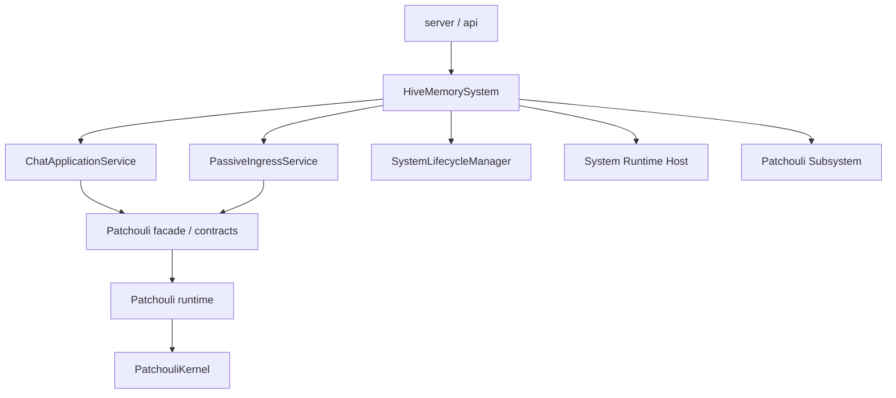

# HiveMemory 第四次架构演进 Phase B 设计

**文档状态**: Draft (历史方案，现顺延至 Phase D 参考)\
**所属演进**: 第四次架构演进\
**阶段目标**: 本文记录的是“顶层应用服务迁移”这条原先曾归入 Phase B 的方案；随着 v4 路线调整，这部分工作现已整体顺延为 `Phase D / 顶层 chat 与 passive ingress 应用服务迁移`。\
**前置阶段核心结论**: 已回写至 [SystemArchitecture\_v4\_TopLevelSketch.md](file:///c:/Users/29305/Projects/HiveMemory/docs/architecture_evolution/SystemArchitecture_v4_TopLevelSketch.md)\
**配套草图**: [SystemArchitecture\_v4\_TopLevelSketch.md](file:///c:/Users/29305/Projects/HiveMemory/docs/architecture_evolution/SystemArchitecture_v4_TopLevelSketch.md)

> **阅读说明**
>
> 本文内部保留的 `Phase B` 表述属于历史编号。
> 在当前路线下，应统一理解为 `Phase D / 顶层应用服务迁移` 的设计参考。

***

## 1. Phase B 的定位

如果说 Phase A 解决的是“顶层 system 缺位”，那么 Phase B 要解决的就是：

> **既然顶层 system 已经建立，哪些逻辑还留在** **`PatchouliSystem`** **中是不合理的？**

Phase B 的任务，不是继续给 `HiveMemorySystem` 加功能，而是完成一次**入口编排层与子系统边界的重新分配**：

- `HiveMemorySystem` 继续做顶层门面
- `system/application/` 正式接管入口级编排
- `PatchouliSystem` 回归 Patchouli 子系统门面
- `Patchouli` 只对外暴露记忆域相关能力，不再继续承担项目级入口编排职责

换句话说，Phase B 的核心不是“多写几个 service”，而是：

> **把“顶层入口模式”和“记忆子系统能力”从代码层面真正拆开。**

***

## 2. 为什么需要 Phase B

虽然 Phase A 已经建立了：

- `HiveMemorySystem`
- `GlobalSystemBus`
- `SubsystemRegistry`
- `PatchouliSubsystemAdapter`
- `ChatApplicationService`
- `PassiveIngressService`

但当前实现仍然保留着明显的“Phase A 过渡特征”：

- `ChatApplicationService` 仍然只是把 `chat` / `chat_stream` 委托给 `PatchouliSystem`
- `PassiveIngressService` 仍然只是把 `ingest_event` / `flush_ingressor` 委托给 `PatchouliSystem`
- `HiveMemorySystem` 兼容性访问器仍然大量代理 `patchouli.kernel`、`storage` 等旧能力
- `PatchouliSystem` 依然同时持有：
  - 主动 chat 完整链路
  - 被动 ingest 完整链路
  - 记忆子系统内部对象
  - Patchouli 自身 runtime

这意味着：

- 顶层 system 已经存在
- 但顶层入口编排还没有真正“升格”
- `PatchouliSystem` 仍然没有真正“降格”

因此，Phase B 的必要性非常明确：

- 如果不做 Phase B，`system/application/` 会长期停留在空壳状态
- `PatchouliSystem` 会继续成为事实上的主业务入口
- Alice 接入前，顶层 system 虽然名义存在，但实际仍然只是旧 `PatchouliSystem` 的包裹层

***

## 3. Phase B 的目标

Phase B 聚焦 5 个目标。

### 3.1 主动 chat 入口编排正式迁移到 `system/application/`

需要将当前 `PatchouliSystem.chat()` / `chat_stream()` 中属于**系统级入口编排**的部分迁移到顶层应用服务。

### 3.2 被动 ingest 入口编排正式迁移到 `system/application/`

需要将当前 `PatchouliSystem.ingest_event()` / `flush_ingressor()` 中属于**系统级消息接入**的部分迁移到顶层应用服务。

### 3.3 `PatchouliSystem` 回归子系统 façade

需要把 `PatchouliSystem` 的定位收敛为：

- Patchouli 子系统门面
- Patchouli 内部能力协调者
- Patchouli 记忆域 runtime 的承载体

而不是项目最终入口的事实宿主。

### 3.4 建立 Patchouli 子系统内部 bootstrap / runtime 边界

Phase B 应明确：

- 哪些对象仍属于 Patchouli
- 哪些对象已经属于 top-level `system`
- Patchouli 的内部装配入口应该如何组织

### 3.5 为 Phase C 的 Alice 并列接入铺平路径

Phase B 完成后，顶层入口应不再默认直接绑定 Patchouli 私有实现，否则未来 Alice 接入时还会遇到同样的结构阻力。

***

## 4. Phase B 明确不做什么

为了避免范围失控，Phase B 明确不做以下事情：

- 不在本阶段重写 Patchouli 的记忆核心能力实现
- 不在本阶段一次性重构所有 server 路由
- 不在本阶段把所有兼容访问器全部删除
- 不在本阶段对 `KernelLoopExecutor`、`Koakuma` 做最终归属判定
- 不在本阶段完整实现跨子系统事件桥接协议

Phase B 的原则是：

> **迁入口编排，不重写记忆内核；缩边界，不强行一次性清空历史兼容层。**

***

## 5. 当前基线与主要臃肿点

从当前实现看，[system.py](file:///c:/Users/29305/Projects/HiveMemory/src/hivememory/system/system.py) 与 [patchouli/system.py](file:///c:/Users/29305/Projects/HiveMemory/src/hivememory/patchouli/system.py) 已形成一种“壳已建立、逻辑未迁完”的结构：

- `HiveMemorySystem` 已拥有顶层 façade 形式
- 但 `ChatApplicationService` / `PassiveIngressService` 仍为薄委托层
- `PatchouliSystem` 仍然保留完整主动/被动入口编排

这会带来两个问题：

### 5.1 顶层 application 层名义存在，实质缺位

如果 `system/application/` 长期只是转发壳，那么后续：

- `Alice` 无法自然接管或参与 chat 编排
- 顶层身份规范化、路由决策、跨子系统协调无处落地

### 5.2 `PatchouliSystem` 仍然在扮演事实上的主应用服务

这会继续模糊以下边界：

- 入口编排 vs 子系统能力
- 项目级身份/调度 vs Patchouli 私有逻辑
- 全局 system vs 记忆子系统

因此，Phase B 的核心工作不是“再拆类”，而是把当前还滞留在 `PatchouliSystem` 中的**入口级编排逻辑**抽出来。

***

## 6. Phase B 的目标形态

### 6.1 顶层关系

### 6.2 关键变化

Phase B 后应实现：

- 顶层入口编排落在 `system/application/`
- `PatchouliSystem` 不再是主动/被动入口的唯一完整实现者
- `HiveMemorySystem` 不需要通过大量兼容访问器才能完成主链路
- Patchouli 对顶层暴露的是“能力接口”，而不是“历史宿主大对象”

***

## 7. `ChatApplicationService` 在 Phase B 中要接管什么

Phase B 中，`ChatApplicationService` 不应再只是转发，而应成为**顶层主动交互应用服务**。

### 7.1 它需要承担的职责

- 顶层身份归一化
  - `user_id`
  - `agent_id`
  - `session_id`
- generation 选项标准化
- 顶层 chat / chat\_stream 入口统一
- 顶层路由决策占位
  - 当前仍只走 Patchouli
  - 未来可扩展到 Alice 参与编排
- 统一后处理
  - 返回模型整理
  - stream 事件规范
  - generation cancel 注册接入点

### 7.2 它不应承担的职责

- 不直接实现 Patchouli 内核工作流
- 不直接操纵 perception / retrieval / storage 细节
- 不直接管理 Patchouli 私有 runtime

### 7.3 Phase B 推荐迁移范围

优先迁移以下类型逻辑：

- 参数默认值与标准化
- 顶层入口模型转换
- stream / non-stream 的共用骨架
- generation 生命周期入口
- 顶层应用级日志与埋点

不要求 Phase B 一次性迁移：

- Patchouli 内核的完整推理执行细节
- 所有后处理实现细节

***

## 8. `PassiveIngressService` 在 Phase B 中要接管什么

Phase B 中，`PassiveIngressService` 不应再只是被动代理层，而应成为**系统级消息接入应用服务**。

### 8.1 它需要承担的职责

- 外部被动事件到系统内部输入模型的标准化
- 顶层 identity 映射
- 统一的接入入口
  - `ingest_event`
  - `flush_ingressor`
- 与顶层 bus / scheduler 的接点预留
- 对外返回结果模型的统一

### 8.2 它不应承担的职责

- 不直接实现 observer buffer 内部机制
- 不直接实现感知层 flush 规则
- 不直接实现 Patchouli 内部 topic / block 管理

### 8.3 迁移重点

Phase B 应重点抽离以下逻辑：

- 顶层会话标识与 source 归一化
- 返回 payload 结构统一
- 顶层 ingress 生命周期入口
- 后续 Alice/其他子系统可复用的接入模式占位

Patchouli 内部仍保留：

- `PassiveObserverIngressor`
- observer buffer 管理
- flush 后向内核提交记忆沉淀的 Patchouli 专属实现

***

## 9. `PatchouliSystem` 在 Phase B 中应如何收敛

### 9.1 新定位

Phase B 中，`PatchouliSystem` 应被重新定义为：

- Patchouli 子系统 façade
- 记忆子系统的对外能力入口
- Patchouli 私有 runtime 的承载体

### 9.2 建议保留在 `PatchouliSystem` 中的内容

- `PatchouliKernel`
- `TheEye`
- `PassiveObserverIngressor`
- `WorkerAgentService`
- `KernelLoopExecutor`
- Patchouli 私有 scheduler task 定义
- Patchouli 私有 bus / event 订阅（如果后续建立私有 bus）
- Patchouli 记忆域专属 façade 方法

### 9.3 建议从 `PatchouliSystem` 中迁出的内容

- 顶层主动 chat 的入口编排
- 顶层被动 ingest 的入口编排
- 顶层 façade 的对外 API 语义
- 项目级 system 对外暴露的行为约束

### 9.4 Phase B 后的理想状态

Patchouli 不再回答“系统怎么对外交互”，而是回答：

- Patchouli 能提供什么记忆能力
- Patchouli 内部如何围绕记忆域组织执行

***

## 10. Patchouli 内部 bootstrap 与 runtime 边界

Phase B 还需要处理一个非常关键但容易被忽略的问题：

> **既然 Patchouli 已经不再是顶层宿主，那么 Patchouli 自己的内部装配入口应放在哪里？**

### 10.1 为什么需要 `patchouli/bootstrap.py`

当前 `PatchouliSystem` 仍然兼具：

- façade
- bootstrap
- runtime host

这与 Phase A 之前顶层 system 的问题是同构的。

因此，Phase B 建议开始引入：

- `patchouli/bootstrap.py`

用于承接：

- Patchouli 私有对象装配
- Patchouli runtime 组件创建
- Patchouli façade 所需依赖汇总

### 10.2 为什么这件事属于 Phase B

因为只有在顶层入口编排离开 `PatchouliSystem` 后，Patchouli 子系统内部 bootstrap 的边界才会真正清晰。

### 10.3 Phase B 中对 Patchouli runtime 的要求

至少要做到：

- 项目级 runtime 不再回流到 `patchouli/`
- Patchouli 私有 runtime 与顶层 runtime 可以在文档和代码上区分
- `PatchouliSystem` 不再同时扮演子系统 façade 和项目级 bootstrap

***

## 11. 兼容层策略

Phase B 是边界收紧阶段，不是“兼容层清零阶段”。

因此需要允许一段时间内保留以下兼容方式：

- `HiveMemorySystem.kernel`
- `HiveMemorySystem.storage`
- `HiveMemorySystem.manual_trigger()`
- `HiveMemorySystem.patchouli`

但这些能力需要在文档上被明确标记为：

- 管理接口
- 兼容接口
- 非长期建议扩展点

### 11.1 不建议在 Phase B 做的事

- 不建议立刻删除所有兼容代理
- 不建议强迫全部 server/router 立即改成只走新的细粒度 service
- 不建议为了“结构纯洁”而一次性打碎所有历史调用路径

### 11.2 建议的收口方式

Phase B 可接受：

- 主链路先切新入口
- 管理类/遗留类接口暂时继续代理到 Patchouli
- 在文档中标明后续 deprecate 路径

***

## 12. Phase B 的实施建议

建议按以下顺序推进。

### Step 1：扩展 `system/application/`

先把：

- `ChatApplicationService`
- `PassiveIngressService`

从“薄委托层”提升为“真正的入口编排层”。

### Step 2：定义 Patchouli façade 能力边界

在不大改 Patchouli 内部实现的前提下，先收紧顶层依赖面。

### Step 3：引入 `patchouli/bootstrap.py`

将 Patchouli 私有装配逻辑逐步从 `PatchouliSystem.__init__` 中迁出。

### Step 4：回收 `PatchouliSystem` 的顶层入口语义

将其从“项目最终入口”降格为：

- 子系统 façade
- 兼容壳
- 内部能力容器

### Step 5：补齐回归测试

确保迁移后：

- server 层主链路不回归
- scheduler / bus / lifecycle 行为不回归
- Phase A 建立的顶层壳不被重新侵蚀

***

## 13. Phase B 的测试要求

Phase B 必须补齐以下类型测试。

### 13.1 顶层应用服务测试

- `ChatApplicationService` 不再只是委托测试，而要覆盖：
  - 输入标准化
  - 路由决策占位
  - stream / non-stream 共用骨架
  - cancel generation 接点
- `PassiveIngressService` 需覆盖：
  - identity 归一化
  - 返回结果模型
  - flush 入口行为

### 13.2 Patchouli façade 契约测试

- 顶层依赖的 Patchouli 能力接口可独立验证
- 顶层 application 不需要依赖整个历史大对象的所有细节

### 13.3 server 回归测试

- `/chat`
- `/chat/stop`
- `/ingest`
- `/topics/*`
- `/memories/*`

至少要验证主链路仍然稳定。

### 13.4 生命周期回归测试

- 顶层 `HiveMemorySystem.start()/stop()`
- Patchouli 子系统 shutdown drain
- scheduler 行为未退化

***

## 14. 风险与注意事项

### 14.1 最大风险

最大的风险不是“代码搬不动”，而是：

- application 层迁了一半
- Patchouli 仍保留完整旧入口
- 最终形成“双实现并存”

这会让职责边界比现在更模糊。

### 14.2 避免方式

一旦某条主链路迁到 `system/application/`，就应明确：

- 谁是唯一权威入口
- 旧 `PatchouliSystem` 方法是兼容壳还是内部能力
- 新旧路径谁负责测试

### 14.3 第二个风险

不要在 Phase B 中把所有“管理/查询/运维”接口也一起卷进来。

例如：

- `storage`
- `manual_trigger`
- topics admin
- config admin

这些接口中有一部分仍可能合理地继续走 Patchouli 管理能力，而不是必须一并迁入 `system/application/`。

***

## 15. Phase B 的完成标准

当 Phase B 完成时，至少应满足：

- `ChatApplicationService` 已承担真实的主动 chat 入口编排职责
- `PassiveIngressService` 已承担真实的被动 ingest 入口编排职责
- `PatchouliSystem` 不再是主动/被动入口的唯一完整实现者
- Patchouli 已拥有更清晰的子系统 façade / bootstrap / runtime 边界
- `HiveMemorySystem` 的主链路不再依赖大量历史兼容代理才能成立
- 为 Alice 的同级接入预留的顶层入口已在结构上成立

如果只是把更多代码从一个类搬到另一个类，但顶层入口与子系统边界仍然说不清，就不能算真正完成了 Phase B。

***
