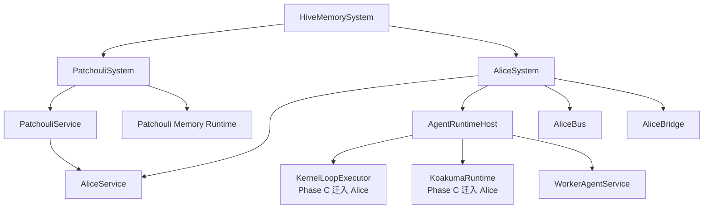

# HiveMemory 第四次架构演进 Phase C Alice Runtime Foundation 设计

> **归档说明**: 本文是 v4 演进过程中的阶段设计记录，保留用于追溯迁移背景与取舍。v4 当前最终结构、术语与实现准则已统一收敛到 [SystemArchitecture_v4_TopLevelSketch.md](./SystemArchitecture_v4_TopLevelSketch.md)。如本文与最终总纲冲突，以最终总纲为准。

**文档状态**: Archived (阶段设计记录)\
**所属演进**: 第四次架构演进\
**建议阶段名**: Phase C / Alice Runtime Foundation\
**阶段目标**: 在 `Phase B / Patchouli Subsystemization` 基本完成后，将当前仍寄居在 `Patchouli` 内部的 Agent 运算服务逐步抽离到 `Alice` 子系统，建立 Alice 作为多智能体编排与计算子系统的最小可用骨架，并形成通过 `alice.run_agent(topic_id, ...)` 驱动单次 agent 计算的初步能力边界。\
**配套文档**:

- [SystemArchitecture\_v4\_TopLevelSketch.md](file:///c:/Users/29305/Projects/HiveMemory/docs/architecture_evolution/SystemArchitecture_v4_TopLevelSketch.md)
- [SystemArchitecture\_v4\_PatchouliSubsystemNormalization\_Design.md](file:///c:/Users/29305/Projects/HiveMemory/docs/architecture_evolution/SystemArchitecture_v4_PatchouliSubsystemNormalization_Design.md)
- [SystemArchitecture\_v4\_PhaseB\_Design.md](file:///c:/Users/29305/Projects/HiveMemory/docs/architecture_evolution/SystemArchitecture_v4_PhaseB_Design.md)（现作为 Phase D 顶层应用服务迁移参考）

***

## 1. 文档定位

这份文档回答的是一个在当前代码状态下已经无法再回避的问题：

> **如果** **`Patchouli`** **要再次退化为纯粹的 Agent 记忆子系统，那么现在由** **`Patchouli`** **持有的 Agent 运算服务，应该由谁接管？**

在当前实现中：

- `PatchouliService.chat()` / `chat_stream()` 仍直接驱动 `KernelLoopExecutor`
- `KernelLoopExecutor` 又直接依赖 `PatchouliKernel`、`WorkerAgentService` 与 `KoakumaRuntime`
- `KoakumaRuntime` 仍负责 MTP 指令解析、工具执行、权限检查与回填格式化

这意味着：

- 计算服务仍被组织在记忆子系统内部
- 顶层 `ChatApplicationService` 暂时不适合迁移，因为它一旦继续上移，就会被迫直接接触 Patchouli 私有运算结构
- Alice 虽然已经在架构上被定位为多智能体子系统，但在代码层仍只是一个空壳占位

因此，`Phase C / Alice Runtime Foundation` 的本质不是“先做一个新目录”，而是：

> **先让 Alice 成为 Agent runtime 的正式宿主，再让顶层 chat 编排迁移真正有可依赖的目标子系统。**

***

## 2. 为什么现在必须做

当前阶段已经具备三项关键前提：

- 顶层 `HiveMemorySystem` 已建立，并持有全局 bus 与全局 scheduler
- `PatchouliSystem` / `PatchouliService` 已完成第一轮子系统化，Patchouli 私有 bus / bridge 已回到子系统内部
- 顶层 `ChatApplicationService` 与 `PassiveIngressService` 已有入口落点，但完整编排仍未上移

与此同时，运行时侧的真实情况也已经很清楚：

- `KernelLoopExecutor` 负责 Agent 帧栈驱动、CALL 挂起恢复与流式/非流式循环
- `KoakumaRuntime` 负责 MTP 协议解析、权限控制、sys 工具执行与回填格式化
- 二者当前都仍被视为 `Patchouli` 内部 runtime

如果继续维持这种状态，后续会遇到三个结构性阻力：

- Alice 无法真正承担多智能体“编排 + 计算”子系统角色，只能继续停留在概念层
- 顶层 `ChatApplicationService` 一旦上移，仍会被迫穿透到 Patchouli 的 loop / tool runtime 私有实现
- `Patchouli` 无法真正退回“记忆能力提供者”，因为其内部仍握着整个 Agent 计算主循环

因此，本阶段要解决的不是“chat 怎么搬”，而是“chat 背后的计算 runtime 到底由谁拥有”。

***

## 3. 当前实现中的核心问题

### 3.1 `KernelLoopExecutor` 实际上是 Agent runtime，而不是记忆 runtime

当前 `KernelLoopExecutor` 的职责包括：

- 主帧与子帧执行循环
- 流式/非流式生成编排
- CALL 指令触发的子 Agent 派生
- 事件命名空间、IPC payload 组装与 MTP 回填协调

这些职责都更接近：

- Agent 进程调度
- Agent 执行循环
- 多智能体派生与恢复控制

而不是 Patchouli 作为“记忆子系统”应长期持有的能力。

### 3.2 `KoakumaRuntime` 是工具执行运行时，而不是记忆域私有工具

当前 `KoakumaRuntime` 不只是 Patchouli 的一个内部 helper，它承担了：

- MTP 指令解析
- sys 工具注册与执行
- 权限沙箱
- WRITE / UPDATE 延迟捕获
- 结果容器格式化与别名缓存

它的长期角色更接近：

- Agent tool runtime
- Agent tool sandbox
- Agent 执行环境中的 syscall 层

这类能力应作为 Agent runtime 的一部分，被 Alice 托管，而不是继续长期寄居在 PatchouliKernel 名下。

### 3.3 当前 `PatchouliService.chat()` 仍混合了记忆能力与 Agent 计算编排

现有 `PatchouliService.chat()` 的流程同时包含：

- 记忆域工作：
  - 话题快照
  - gaze / 路由
  - prepare\_topic
  - retrieval / assemble context
  - post process / interaction submit
- Agent 计算工作：
  - 设置 active profile
  - 驱动 `KernelLoopExecutor`
  - 处理流式事件和 MTP 执行结果

这说明当前 chat 主链路仍然把“记忆准备”和“Agent 执行”绑在一个子系统里。

***

## 4. Phase C 的核心目标

本阶段只做 4 件事。

### 4.1 让 Alice 成为 Agent runtime 的正式宿主

Alice 在 Phase C 中的最低目标，不是立即接管所有多智能体功能，而是先成为：

- `KernelLoopExecutor` 的新宿主
- `KoakumaRuntime` 的新宿主
- `WorkerAgentService` 的直接组织者
- 未来 team / orchestration runtime 的自然扩展点

### 4.2 定义 `alice.run_agent(...)` 的最小能力边界

顶层和其他子系统在 Phase C 中，不需要知道 Alice 内部 loop / tool runtime 如何实现，但需要有一个稳定入口，例如：

```python
await alice.run_agent(
    topic_id=topic_id,
    identity=identity,
    agent_id=agent_id,
    messages=messages,
    generation_options=generation_options,
    stream=False,
)
```

其语义是：

- 给定已准备好的执行上下文
- 由 Alice 负责调度 Agent runtime 完成一次计算
- 返回统一的计算结果或流式事件

### 4.3 让 Patchouli 回到“记忆准备 + 记忆提交”边界

Patchouli 在 Phase C 中应继续保留：

- `gaze`
- `prepare_topic`
- `handle_hot`
- context assemble
- interaction submit / post process

但不应再长期持有：

- loop 执行循环的宿主权
- tool runtime 的宿主权
- Agent 计算主入口

### 4.4 为 Phase D 的顶层 chat 迁移建立稳定桥梁

当 Alice 有了最小可用的 `run_agent(...)` 能力后，Phase D 顶层 `ChatApplicationService` 才能自然演化为：

```text
ChatApplicationService
  -> Patchouli.prepare_agent_run
  -> Alice.run_agent(...)
  -> Patchouli.finalize_agent_run
```

这样顶层 chat 迁移不再需要直接碰 Patchouli 的私有 loop runtime。

***

## 5. Alice 在 Phase C 中的角色定义

### 5.1 Alice 不是“另一个 Agent 门面”

Phase C 中的 Alice，不应被设计成某个单独 persona 或固定 Agent 实现，而应明确为：

- 多智能体编排与计算子系统
- Agent runtime 宿主
- Agent 计算任务调度器
- 未来 team runtime / orchestrator 的容器引擎

### 5.2 Alice 在当前阶段的最小职责

Alice 建议只承担以下最小职责：

- 持有 `AliceBus`
- 持有 `AliceBridge`
- 持有 `AgentRuntimeHost`
- 提供 `run_agent(...)` 与 `run_agent_stream(...)`
- 管理与 Agent runtime 相关的本地 routes / maintenance / health

### 5.3 Alice 在当前阶段明确不做什么

- 不在本阶段把 chat 顶层编排一起迁完

Phase C 的原则是：

> **先接管 Agent runtime，再扩展多智能体能力；先换宿主，不急着换行为。**

***

## 6. 目标结构

### 6.1 顶层关系



### 6.2 一句话解释

- `Patchouli` 负责“记忆域上下文与记忆提交”
- `Alice` 负责“Agent 计算与执行循环”
- `HiveMemorySystem` 只负责装配两个同级子系统

***

## 7. 推荐组件设计

### 7.1 `AliceSystem`

#### 角色

- Alice 子系统宿主
- 正式的 `SubsystemProtocol` 实现

#### 应负责

- 持有 Alice runtime host
- 持有 Alice service
- 接入全局 bus / scheduler
- 在 `__init__()` 中直接完成 Alice 私有 runtime 装配
- 直接在 `SubsystemProtocol` 契约方法中实现子系统 start / stop / health

#### 为什么不再拆独立 bootstrap / lifecycle

参考当前 `PatchouliSystem` 已经完成的收敛方向，Phase C 的 Alice 也不建议在当前阶段继续拆出：

- `AliceBootstrap`
- `AliceLifecycleManager`

原因不是这些职责不重要，而是：

- 当前 Alice 仍处于最小骨架阶段
- 子系统数量和复杂度都还不高
- 独立类会先引入额外层级，但暂时不能带来同等收益

因此，Alice 更合适的做法是：

- 在 `AliceSystem.__init__()` 中直接完成私有对象图装配
- 在 `AliceSystem.start()` / `stop()` / `health()` 中直接完成本地 route、bridge、maintenance 与健康检查管理

也就是说，当前阶段的目标不是“把 Alice 拆得更碎”，而是“先让 Alice 像现在的 `PatchouliSystem` 一样，成为一个收敛且可用的子系统宿主”。

### 7.2 `AliceService`

#### 角色

- Alice 子系统对上暴露的能力门面

#### Phase C 最小接口

```python
class AliceService:
    async def run_agent(...) -> ChatResult: ...
    async def run_agent_stream(...) -> AsyncGenerator[dict[str, Any], None]: ...
```

#### 它不应负责

- 记忆检索
- topic prepare
- interaction submit
- 顶层 chat 入口编排

### 7.3 `AgentRuntimeHost`

#### 角色

- 聚合 Alice 负责的 Agent 运算 runtime 对象与状态

#### 建议持有

- `KernelLoopExecutor`
- `KoakumaRuntime`
- `WorkerAgentService`
- 与 Agent runtime 相关的 cancellation / health / runtime flags
- 后续 `TeamRuntime` / `OrchestrationRuntime` 的扩展位

#### 它不应持有

- Patchouli 的 retrieval / librarian / perception runtime
- 顶层 application service
- 顶层 scheduler 控制权

### 7.4 当前阶段的实现建议

当前阶段建议直接采用与 `PatchouliSystem` 类似的收敛实现：

- `AliceSystem.__init__()`
  - 创建 `AliceBus`
  - 创建 `AliceBridge`
  - 创建 `AgentRuntimeHost`
  - 创建 `AliceService`
  - 初始化子系统级 runtime flags
- `AliceSystem.start()`
  - 注册/卸载 Alice 本地 routes
  - mount/unmount AliceBridge
  - 注册 Alice 维护任务
- `AliceSystem.stop()`
  - 卸载 Alice 维护任务
  - unmount bridge
  - 清理运行时状态
- `AliceSystem.health()`
  - 汇总 Agent runtime host 的健康状态

只有在 Alice 后续真正进入 team runtime、复杂 orchestration、独立降级恢复策略都显著膨胀之后，才再评估是否需要单独拆出 bootstrap / lifecycle manager。

***

## 8. `run_agent(...)` 的契约设计

### 8.1 最小输入

建议 `run_agent(...)` 的最小输入只包含 Agent 计算真正需要的内容：

- `messages`
- `identity`
- `agent_id`
- `topic_id`
- `generation_options`
- `stream`

可选补充：

- `agent_profile`
- `cancel_event`
- `runtime_context`

### 8.2 最小输出

非流式：

- `ChatResult`

流式：

- 事件流，事件结构在 Phase C 中保持兼容当前 `KernelLoopExecutor` 输出：
  - `token`
  - `mtp_start`
  - `mtp_result`
  - `done`
  - `error`

### 8.3 为什么 Patchouli 不应直接传全部内部对象

`run_agent(...)` 应避免直接暴露：

- `PatchouliKernel及其内部组件`

否则只会把运行时宿主从 `Patchouli` 挪到 `Alice`，却保留同样的内部耦合方式。

更合理的做法是：

- 先由 Patchouli 完成记忆域准备
- 再把“已准备好的执行上下文”传给 Alice
- Alice 只专注于执行 Agent runtime

***

## 9. 与 Patchouli 的边界重划

### 9.1 Phase C 前的边界

当前 `PatchouliService.chat()` 大致为：

```text
PatchouliService.chat()
  -> gaze
  -> prepare_topic
  -> handle_hot
  -> assemble messages
  -> loop executor
  -> post process
```

### 9.2 Phase C 后的目标边界

建议重划为：

```text
PatchouliService.prepare_agent_run(...)
  -> gaze
  -> prepare_topic
  -> handle_hot
  -> assemble messages
  -> return prepared runtime context

AliceService.run_agent(...)
  -> execute loop
  -> execute tools
  -> return ChatResult / stream

PatchouliService.finalize_agent_run(...)
  -> submit interaction
  -> flush / post process
```

### 9.3 为什么先拆成 prepare / run / finalize

因为这样可以最大限度保持现有行为稳定：

- Patchouli 仍掌握记忆域前后处理
- Alice 只接手中间那段真正的 Agent runtime
- 顶层 Phase D 迁移时，只需把这三段编排上移，而不是同时重构所有底层行为

***

## 10. 迁移对象清单

### 10.1 第一批直接迁移对象

- `KernelLoopExecutor`
- `WorkerAgentService`
- `KoakumaRuntime`

理由：

- 三者共同组成当前 Agent 执行主循环
- 三者都直接参与单次 Agent 计算任务
- 它们的长期定位更接近 Alice runtime，而非记忆子系统

### 10.2 第二批延后评估对象

- `FrameScheduler`
- execution frame / IPC 相关对象
- team runtime / orchestration runtime 占位

这些对象与 loop 强相关，但可以在 Alice 接管第一批对象后继续逐步收编。

***

## 11. 迁移策略

### 11.1 Step 1：先在 Alice 中建立空骨架

创建：

- `alice/system.py`
- `alice/service.py`
- `alice/runtime/host.py`

此时只建立结构，不切主路径。

### 11.2 Step 2：把 Agent runtime 从 Patchouli 中包装为可注入对象

先不要立刻搬代码文件，而是先在 Patchouli 当前实现中完成：

- `KernelLoopExecutor` 可外部注入
- `KoakumaRuntime` 宿主关系可收口
- `WorkerAgentService` 从 `PatchouliSystem` 的初始化段中剥离为独立 runtime 依赖

### 11.3 Step 3：让 Alice 接管 runtime host

由 Alice 创建并持有：

- `WorkerAgentService`
- `KernelLoopExecutor`
- `KoakumaRuntime`

Patchouli 不再直接 new 它们，只通过 Alice 暴露的 service / route 调用。

### 11.4 Step 4：为 Phase D 提供新的中间接口

在主路径暂不迁移的情况下，先允许：

- `PatchouliService.chat()` 内部改为调用 `AliceService.run_agent(...)`
- 保持外部 API 不变

这样可以先完成“宿主迁移”，再处理“顶层入口迁移”。

***

## 12. 总线与契约建议

### 12.1 Alice 对外公开 route

建议至少定义：

- `alice.run_agent`
- `alice.run_agent_stream`

可选预留：

- `alice.cancel_run`
- `alice.health.runtime`

### 12.2 Patchouli 与 Alice 的调用方向

建议坚持以下方向：

- Patchouli 不直接持有 Alice 内部 runtime 对象
- Patchouli 只调用 Alice 的公开 service / route
- 顶层 application 未来也只通过稳定契约调用 Alice

### 12.3 事件桥接建议

Phase C 中不需要立即扩展很多事件，但应预留至少两类：

- `alice.run.started`
- `alice.run.completed`

后续可扩展：

- `alice.run.failed`
- `alice.subagent.spawned`
- `alice.subagent.completed`

***

## 13. 风险与限制

### 13.1 当前最大的风险不是代码搬移，而是契约破坏

当前 `chat_stream()` 的流式事件、`ChatResult` 结构、MTP 回填与 WRITE/UPDATE 延迟捕获，都已经被前端和测试消费。

因此，本阶段必须避免：

- 改变现有 SSE 事件 schema
- 改变 `ChatResult` 结构
- 改变 MTP 回填与 trace 语义

### 13.2 `PatchouliKernel` 仍是过渡期耦合点

在 Phase C 初期，即使 loop / tool runtime 迁给 Alice，它们仍可能阶段性依赖：

- `PatchouliKernel`
- 旧 `SystemBus`
- Patchouli 内部 retrieval / librarian 路由

这是允许的，但必须被明确标记为“过渡期依赖”，不能被视为 Alice 的长期边界。

### 13.3 不在 Phase C 里同时解决旧总线统一问题

`SystemBus -> AsyncSystemBus` 的统一是后续仍需处理的问题，但不宜和 Alice runtime 迁移绑死在一步里。

更稳妥的方式是：

- 先迁宿主
- 再迁内部调用契约

***

## 14. 测试要求

### 14.1 Alice 子系统骨架测试

- Alice 可成功构建 `AliceSystem`
- `AliceSystem` 可实现 `SubsystemProtocol`
- 本地 routes / bridge / health 可正常工作

### 14.2 runtime 迁移边界测试

- `PatchouliSystem` 不再直接 new `KernelLoopExecutor`
- `PatchouliSystem` 不再直接 new `KoakumaRuntime`
- `PatchouliService` 可通过 Alice 完成单次 agent 运行

### 14.3 契约稳定测试

- `run_agent_stream(...)` 产出的事件集合与当前主路径保持兼容
- `ChatResult` 结构保持兼容
- WRITE / UPDATE / CALL 的 trace 与回填行为不回归

***
