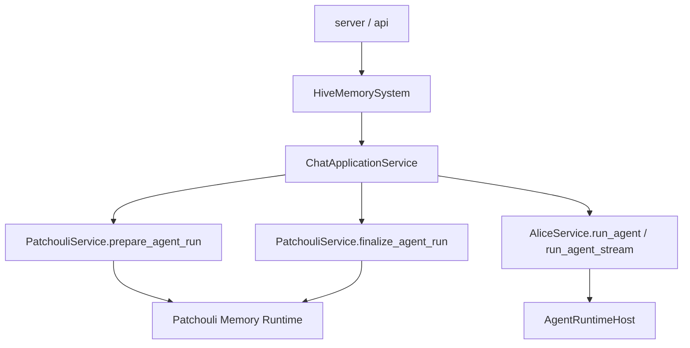

# HiveMemory 第四次架构演进 Phase D 设计

> **归档说明**: 本文是 v4 演进过程中的阶段设计记录，保留用于追溯迁移背景与取舍。v4 当前最终结构、术语与实现准则已统一收敛到 [SystemArchitecture_v4_TopLevelSketch.md](./SystemArchitecture_v4_TopLevelSketch.md)。如本文与最终总纲冲突，以最终总纲为准。

**文档状态**: Archived (阶段设计记录)\
**所属演进**: 第四次架构演进\
**阶段目标**: 在 `Phase C / Alice Runtime Foundation` 已基本建立稳定 `alice.run_agent(...)` 边界后，将当前仍滞留在 `PatchouliService` 内部的 chat 主链路编排正式上移到顶层 `ChatApplicationService`，完成 v4 目标中的主动 chat 应用服务迁移。\
**前置文档**:

- [SystemArchitecture\_v4\_TopLevelSketch.md](file:///c:/Users/29305/Projects/HiveMemory/docs/architecture_evolution/SystemArchitecture_v4_TopLevelSketch.md)
- [SystemArchitecture\_v4\_PhaseC\_AliceRuntimeFoundation\_Design.md](file:///c:/Users/29305/Projects/HiveMemory/docs/architecture_evolution/SystemArchitecture_v4_PhaseC_AliceRuntimeFoundation_Design.md)
- [SystemArchitecture\_v4\_PhaseB\_Design.md](file:///c:/Users/29305/Projects/HiveMemory/docs/architecture_evolution/SystemArchitecture_v4_PhaseB_Design.md)
- [SystemArchitecture\_v4\_PatchouliSubsystemNormalization\_Design.md](file:///c:/Users/29305/Projects/HiveMemory/docs/architecture_evolution/SystemArchitecture_v4_PatchouliSubsystemNormalization_Design.md)

> **阅读说明**
>
> 当前 `Phase D` 同时包含 `chat` 与 `passive ingress` 两条入口迁移方向。
> 本文聚焦其中优先级更高、与 `Phase C` 耦合最强的 `ChatApplicationService` 迁移。
> `PassiveIngressService` 仍沿用顶层草图与历史 `Phase B` 文档中的边界约束，但不在本文展开完整细化。

***

## 1. 文档定位

这份文档回答的核心问题不是“`ChatApplicationService` 还要不要继续保留”，而是：

> **当 Alice 已经接管 Agent runtime 后，顶层 chat 主路径应该如何从** **`PatchouliService`** **中抽离出来，并在不破坏记忆域边界的前提下回到** **`system/application/`？**

`Phase C` 已经解决了中段执行宿主的问题：

- Alice 成为 `KernelLoopExecutor`、`KoakumaRuntime`、`WorkerAgentService` 的正式宿主
- `PatchouliService` 已不再直接持有 Agent runtime，而是通过 `GlobalSystemBus -> Alice` 发起计算
- 顶层 system 已具备同时装配 `Patchouli` 与 `Alice` 两个同级子系统的能力

但直到目前，主动 chat 的完整主链路仍然停留在 `PatchouliService.chat()` / `chat_stream()` 中。这意味着：

- `ChatApplicationService` 依然只是薄委托层
- `PatchouliService` 仍在承担项目级入口编排
- 顶层无法自然接入 generation lifecycle、统一错误语义、流式协议整形与后续路由决策

因此，`Phase D` 的真正任务是：

> **把 chat 从“Patchouli 作为事实入口”迁回“顶层 application 编排 + Patchouli 记忆能力 + Alice 运行时执行”的目标结构。**

***

## 2. 为什么 Phase D 现在可以开始

在此前阶段中，推进 chat 主链路迁移的阻力主要来自两个方面：

- 顶层还没有稳定的多子系统装配与总线基础设施
- `Patchouli` 仍同时持有记忆域与 Agent runtime，导致入口编排与执行循环无法拆开

这些前提在当前代码基线中已经基本具备：

- `HiveMemorySystem` 已同时持有 `PatchouliSystem`、`AliceSystem`、`GlobalSystemBus` 与 `GlobalMaintenanceScheduler`
- `AliceService` 已对外提供 `run_agent(...)` / `run_agent_stream(...)`
- `PatchouliService` 当前已经通过 `GlobalRoutes.ALICE_RUN_AGENT`、`ALICE_RUN_AGENT_STREAM`、`ALICE_REGISTER_PRERETRIEVAL_ALIASES`、`ALICE_GET_INTERACTION_STATE` 调用 Alice 能力
- `ChatApplicationService` 已是顶层外部 API 的唯一主动 chat 入口落点，只是内部逻辑尚未迁入

这意味着，`Phase D` 不再需要解决“如何让 Alice 接住运行时”这个问题，而是可以直接开始解决：

- 顶层 chat 编排该如何落位
- `PatchouliService` 应如何收敛为“记忆准备 + 记忆提交”门面
- stream / non-stream 该如何共享统一骨架
- generation cancel 与运行期状态该由谁承载

***

## 3. 当前基线与主要问题

### 3.1 当前调用关系

当前主路径大致如下：

```text
HiveMemorySystem.chat()
  -> ChatApplicationService.chat()
  -> PatchouliService.chat()
      -> gaze
      -> prepare_topic
      -> handle_hot
      -> assemble messages
      -> GlobalBus.request(alice.run_agent)
      -> submit_interaction
```

流式路径则为：

```text
HiveMemorySystem.chat_stream()
  -> ChatApplicationService.chat_stream()
  -> PatchouliService.chat_stream()
      -> generation_id/topic_info/memory_refs 事件
      -> GlobalBus.request(alice.run_agent_stream)
      -> submit_interaction
      -> done/error 事件
```

这比 `Phase C` 之前已经更接近目标结构，但仍然存在 4 个明显问题。

### 3.2 顶层 application 层仍然缺位

当前 `ChatApplicationService` 只做参数透传：

- 不负责身份归一化
- 不负责 generation 选项标准化
- 不负责统一错误语义
- 不负责 stream / non-stream 共用骨架
- 不负责 generation lifecycle 注册与取消

这使得顶层虽然已经有了入口类，但没有真正拥有“入口编排”。

### 3.3 PatchouliService 仍然承担项目级入口职责

`PatchouliService` 当前仍同时负责：

- 记忆域准备
- 流式前置事件产出
- Agent runtime 调度触发
- chat 结果后处理
- 对顶层 API 的输入输出编排

这超出了“记忆子系统对外门面”的合理边界。

### 3.4 chat 与 stream 共享逻辑仍未显式分层

虽然当前 `PatchouliService.chat()` 与 `chat_stream()` 已复用部分私有方法，但两条链路仍有大量重复：

- 身份构造
- `gaze -> prepare_topic -> handle_hot`
- messages 组装
- 运行时调用前后的异常处理
- 最终交互提交

这些步骤应该在 `Phase D` 中被提炼成顶层统一编排骨架，而不是继续留在 Patchouli API 内部。

### 3.5 generation cancel 仍处于断链状态

当前 `PatchouliService.cancel_generation()` 只是占位返回 `False`。这说明：

- generation 生命周期没有稳定的顶层注册点
- 取消能力还没有正式回接到 Alice runtime
- `ChatApplicationService` 还没有成为 generation 控制面的宿主

而这恰恰是应用层而不是记忆子系统应承担的职责。

***

## 4. Phase D 的目标

`Phase D` 只聚焦主动 chat 主链路迁移，目标是完成 5 件事。

### 4.1 让 ChatApplicationService 成为真正的顶层 chat 编排服务

`ChatApplicationService` 不再只是委托层，而要正式承担：

- 顶层 chat / chat\_stream 入口统一
- 顶层身份与 generation 选项标准化
- 对 `Patchouli` 与 `Alice` 的调用编排
- 流式协议整形
- generation 生命周期注册与取消入口
- 顶层应用级错误语义与日志埋点

### 4.2 让 PatchouliService 收敛到“prepare + finalize”边界

`PatchouliService` 在 `Phase D` 后应明确收敛为：

- 记忆域准备
- 记忆域后处理与 interaction submit
- 记忆能力 API

而不再作为顶层 chat API 的完整编排宿主。

### 4.3 让 Alice 保持纯 Agent runtime 边界

`AliceService` 继续只负责：

- `run_agent(...)`
- `run_agent_stream(...)`
- runtime 交互状态导出
- generation 取消等运行期控制能力

Alice 不接管记忆检索、topic 准备、interaction 提交，也不直接升级为顶层 chat 门面。

### 4.4 建立 stream / non-stream 的共享编排骨架

两条链路应共享同一套顶层三段式骨架：

```text
Patchouli.prepare_agent_run(...)
  -> Alice.run_agent(...) / run_agent_stream(...)
  -> Patchouli.finalize_agent_run(...)
```

二者差异只应体现在：

- 是否提前产出 `generation_id`
- 是否输出 `topic_info` / `memory_refs`
- 是否逐步转发 token 与 MTP 事件
- `done` 事件的收尾时机

### 4.5 补齐 generation cancel 控制链

`Phase D` 需要把“取消一次生成”从过渡占位恢复为正式能力，目标链路为：

```text
HiveMemorySystem.cancel_generation(...)
  -> ChatApplicationService.cancel_generation(...)
  -> Alice runtime cancel route / service
```

Patchouli 不再持有 generation 生命周期控制面。

***

## 5. 设计原则

### 5.1 顶层 application 编排不直接进入 Patchouli 私有 runtime

`ChatApplicationService` 可以调用：

- `PatchouliService` 的公开 prepare / finalize 能力
- `AliceService` 的公开 run / cancel 能力
- `GlobalSystemBus` 暴露的稳定公开路由

但不应继续直接理解：

- `PatchouliKernel` 内部对象
- `TheEye`、`Librarian`、`PerceptionLayer` 的细节
- Alice runtime host 内部对象图

### 5.2 Patchouli 只暴露记忆域语义，而不暴露历史宿主语义

`PatchouliService` 对顶层暴露的能力应该是：

- 准备一次 Agent 运行所需的记忆上下文
- 在 Agent 运行完成后提交 interaction 并做后处理

而不是继续暴露一个“帮我把整条 chat 路径都跑完”的历史大入口。

### 5.3 顶层保持 API 稳定，内部迁移逐步收敛

`HiveMemorySystem.chat()` / `chat_stream()` / `cancel_generation()` 的对外签名在 `Phase D` 中应尽量保持不变。

变化优先发生在：

- `system/application/chat_service.py`
- `patchouli/service.py`
- Alice 的公共运行时控制契约

### 5.4 共享骨架优先于分裂实现

`chat` 与 `chat_stream` 虽然对外表现不同，但其业务本质都是：

- 先准备执行上下文
- 再由 Alice 运行
- 最后提交 interaction

因此，`Phase D` 应优先提炼共享骨架，再在骨架外侧处理流式事件差异，而不是继续复制两条近似实现。

***

## 6. 目标结构

### 6.1 顶层关系



### 6.2 一句话解释

- `ChatApplicationService` 负责“应用入口编排”
- `PatchouliService` 负责“记忆域准备与提交”
- `AliceService` 负责“Agent 运行时执行与控制”

### 6.3 目标调用链

非流式：

```text
HiveMemorySystem.chat()
  -> ChatApplicationService.chat()
      -> PatchouliService.prepare_agent_run()
      -> AliceService.run_agent()
      -> PatchouliService.finalize_agent_run()
      -> return ChatResult
```

流式：

```text
HiveMemorySystem.chat_stream()
  -> ChatApplicationService.chat_stream()
      -> PatchouliService.prepare_agent_run()
      -> emit generation_id/topic_info/memory_refs
      -> AliceService.run_agent_stream()
      -> PatchouliService.finalize_agent_run()
      -> emit done
```

***

## 7. ChatApplicationService 的职责设计

### 7.1 Phase D 后应负责什么

`ChatApplicationService` 应成为顶层主动交互应用服务，承担以下职责：

- 统一入口参数
  - `user_message`
  - `user_id`
  - `agent_id`
  - `session_id`
  - `enable_memory_retrieval`
  - `generation_options`
- 顶层 identity 归一化
- generation options 默认值补齐与标准化
- 调用 `PatchouliService.prepare_agent_run(...)`
- 调用 `AliceService.run_agent(...)` / `run_agent_stream(...)`
- 调用 `PatchouliService.finalize_agent_run(...)`
- 统一日志、trace 与异常语义
- generation lifecycle 注册、查询与取消

### 7.2 Phase D 后不应负责什么

- 不直接实现 `gaze`
- 不直接实现 `prepare_topic`
- 不直接实现 `handle_hot`
- 不直接组装 Patchouli 私有 memory runtime
- 不直接理解 `KernelLoopExecutor` 或 `KoakumaRuntime` 内部细节

### 7.3 推荐内部结构

建议 `ChatApplicationService` 内部按“共享骨架 + 差异分支”组织：

- `_normalize_chat_request(...)`
- `_prepare_agent_run(...)`
- `_run_agent_once(...)`
- `_run_agent_stream(...)`
- `_finalize_agent_run(...)`
- `_register_generation(...)`
- `_cancel_generation(...)`
- `_emit_stream_prelude(...)`

这样 `chat()` 与 `chat_stream()` 可以只保留薄入口，而不是各自再堆叠完整业务链路。

***

## 8. PatchouliService 的职责收敛

### 8.1 Phase D 后应保留什么

`PatchouliService` 继续保留以下记忆域能力：

- `analyze_and_retrieve(...)`
- `manual_trigger(...)`
- `prepare_agent_run(...)`
- `finalize_agent_run(...)`
- memory retrieve / alias resolve 等公共能力

### 8.2 Phase D 后应迁出什么

应从 `PatchouliService.chat()` / `chat_stream()` 迁出的内容包括：

- 顶层 request 参数归一化
- stream / non-stream 入口统一
- generation\_id 生命周期注册
- 流式前置事件的顶层输出编排
- 统一错误映射
- generation cancel 控制面

### 8.3 推荐新增能力边界

为承接 `Phase D`，建议将当前 `chat()` / `chat_stream()` 中的记忆域部分正式整理为两个公开步骤。

#### `prepare_agent_run(...)`

负责：

- 构造 `Identity`
- 加载 `agent_profile`
- 获取 `topic_snapshots`
- 调用 `gaze`
- 调用 `prepare_topic`
- 调用 `handle_hot`
- 注册预检索别名
- 组装 messages
- 返回“已准备好的执行上下文”

建议返回一个显式的准备结果模型，例如：

```text
PreparedAgentRun
  - identity
  - topic_id
  - is_new_topic
  - pool_snapshot
  - hot_result
  - agent_profile
  - messages
  - user_message
  - stream_prelude_payload
```

#### `finalize_agent_run(...)`

负责：

- 获取运行期交互状态
- 构造 `InteractionPayload`
- 提交 `submit_interaction`
- 执行必要的 post process / flush

这个接口应只接收 finalize 真正需要的信息，而不应再次回头理解顶层请求对象。

### 8.4 兼容期策略

迁移初期可以暂时保留 `PatchouliService.chat()` / `chat_stream()` 作为兼容壳，但其内部实现应尽快改为：

```text
prepare_agent_run -> run_agent -> finalize_agent_run
```

并标记其为兼容路径，而不是长期主实现。

***

## 9. AliceService 与运行时控制边界

### 9.1 Alice 在 Phase D 中继续负责什么

`AliceService` 在 `Phase D` 中仍然保持 Phase C 已定义的最小边界：

- 执行一次非流式 Agent 计算
- 执行一次流式 Agent 计算
- 导出一次运行积累的交互状态
- 维护 generation cancel 与 runtime health 等运行期能力

### 9.2 Phase D 对 Alice 的新增诉求

为支撑真正的顶层 chat 服务迁移，建议 Alice 补齐以下公开能力：

- `alice.cancel_run`
- 可选的 generation registry 查询能力
- 更清晰的运行中状态与结束状态语义

这些能力仍然属于运行时控制面，应放在 Alice，而不是回退给 Patchouli。

### 9.3 调用方向约束

在 `Phase D` 中应继续坚持：

- `ChatApplicationService` 不直接持有 Alice runtime host
- `PatchouliService` 不直接持有 Alice 内部运行时对象
- 顶层与 Patchouli 都只通过 Alice 的公开 service / route 与之交互

***

## 10. 编排契约设计

### 10.1 非流式链路

推荐的顶层编排步骤如下：

```text
1. ChatApplicationService 归一化请求
2. PatchouliService.prepare_agent_run 返回 PreparedAgentRun
3. ChatApplicationService 注册 generation 生命周期
4. AliceService.run_agent 执行一次计算
5. PatchouliService.finalize_agent_run 提交 interaction
6. ChatApplicationService 清理 generation 生命周期并返回 ChatResult
```

### 10.2 流式链路

推荐的顶层编排步骤如下：

```text
1. ChatApplicationService 归一化请求
2. 生成 generation_id 并注册取消控制
3. PatchouliService.prepare_agent_run 返回 PreparedAgentRun
4. ChatApplicationService 输出 stream prelude:
   - generation_id
   - topic_info
   - memory_refs
5. AliceService.run_agent_stream 转发 token / mtp 事件
6. 捕获 done 结果并组装 ChatResult
7. PatchouliService.finalize_agent_run 提交 interaction
8. ChatApplicationService 输出最终 done
9. 清理 generation 生命周期
```

### 10.3 错误处理原则

顶层需要统一处理以下几类错误：

- Patchouli 准备阶段错误
- Alice 运行阶段错误
- finalize 阶段错误
- stream 中断但未产出 `done` 的错误

建议规则：

- `prepare` 失败时，不进入 `Alice.run_agent`
- `run` 失败时，不提交 interaction，除非后续明确引入“失败回执”语义
- `finalize` 失败时，优先记录日志并返回主结果，避免吞掉已生成的 assistant 输出
- stream 模式下，顶层负责把内部异常映射为统一 `error` 事件

### 10.4 取消语义

建议将 generation 控制语义统一为：

- `registered`: 已创建 generation\_id，但尚未完成
- `running`: 已进入 Alice runtime
- `cancelling`: 已收到取消请求
- `completed`: 正常结束
- `failed`: 异常结束
- `cancelled`: 取消结束

状态的实际宿主可以是 `ChatApplicationService` 的顶层 registry，也可以是其对 Alice registry 的薄包装，但无论采取哪种实现，公开控制入口都应位于 `ChatApplicationService`。

***

## 11. 数据与返回模型建议

### 11.1 顶层请求模型

`ChatApplicationService` 内部建议显式引入统一请求模型，例如：

```text
ChatApplicationRequest
  - user_message
  - identity
  - enable_memory_retrieval
  - generation_options
  - stream
```

它的价值不是“再造一层 DTO”，而是把顶层标准化与 Patchouli/Alice 的内部输入解耦。

### 11.2 Patchouli 准备结果模型

建议显式引入 `PreparedAgentRun`，以免顶层继续在多个返回值之间传递松散元组。

至少应包含：

- `identity`
- `agent_id`
- `topic_id`
- `user_message`
- `messages`
- `agent_profile`
- `hot_result`
- `stream_prelude`
- `finalize_context`

其中：

- `stream_prelude` 供顶层输出 `topic_info` / `memory_refs`
- `finalize_context` 供 `finalize_agent_run(...)` 使用，避免顶层理解过多记忆域内部细节

### 11.3 finalize 输入模型

建议显式定义 `FinalizeAgentRunInput`，至少包含：

- `prepared_run`
- `loop_result`
- 必要的 runtime interaction state

顶层只负责把 `prepared_run` 与 `loop_result` 交回 Patchouli，而不是重新拼装 `InteractionPayload`。

***

## 12. 迁移策略

### 12.1 Step 1：先提炼 Patchouli 的 prepare / finalize 公开能力

第一步不改顶层对外 API，只在 `PatchouliService` 内部完成：

- 从 `chat()` / `chat_stream()` 中抽出 `prepare_agent_run(...)`
- 从后处理段抽出 `finalize_agent_run(...)`
- 让原有 `chat()` / `chat_stream()` 改为基于这两个步骤重组

这样可以先把“记忆域边界”固化。

### 12.2 Step 2：让 ChatApplicationService 接管非流式主链路

完成 `prepare / run / finalize` 三段式后，优先迁移非流式路径：

- `ChatApplicationService.chat()` 改为主实现
- `PatchouliService.chat()` 降级为兼容壳或删除

优先选择非流式的原因是：

- 事件语义更简单
- 更容易验证行为一致性
- 有利于先稳定顶层责任边界

### 12.3 Step 3：让 ChatApplicationService 接管流式主链路

在非流式稳定后，再迁移：

- `generation_id` 注册
- `topic_info` / `memory_refs` prelude 事件
- token / mtp 事件透传
- `done` 收尾与 finalize 调用顺序

这一阶段应确保旧 SSE 协议尽量保持兼容。

### 12.4 Step 4：补齐 cancel\_generation 正式能力

在流式主链路迁移完成后，补齐：

- 顶层 generation registry
- `ChatApplicationService.cancel_generation(...)`
- Alice 的 cancel route / service
- 取消后的最终状态清理

### 12.5 Step 5：清理兼容壳

当以下条件满足时，可开始清理旧实现：

- 顶层 `chat` / `chat_stream` 全量走 `ChatApplicationService`
- `PatchouliService.chat()` / `chat_stream()` 已无外部生产调用
- 取消链路可用
- 测试覆盖 prepare / run / finalize 的关键行为

届时 `PatchouliService` 可以正式收敛为纯记忆域门面。

***
