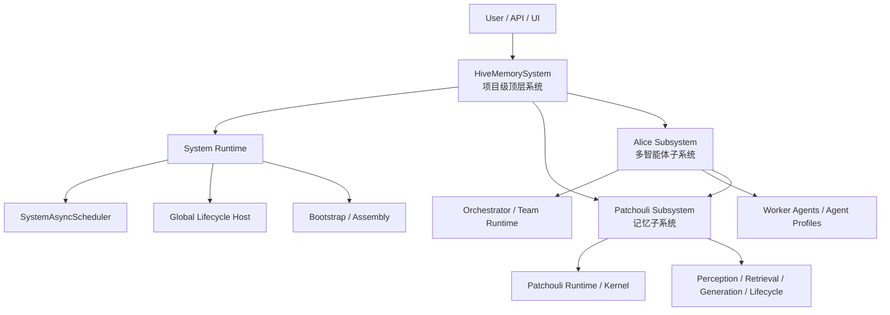

# HiveMemory 第四次架构演进顶层架构草图

**文档状态**: Draft (草案)\
**文档目的**: 为第四次架构演进提供顶层边界规划，明确项目级系统层、记忆子系统 Patchouli 与多智能体子系统 Alice 的职责分工与目录归属。\
**本次文档不直接定义具体实现细节**，而是先回答“谁是顶层系统”“谁拥有运行时”“谁负责什么”这三个架构问题。

***

## 1. 背景与问题

在前两次架构演进中，HiveMemory 主要作为一个被动的 Agent 记忆层中间件存在。系统的主要结构是：

- `engines/`：承载感知、生成、检索、生命周期等记忆能力组件
- `patchouli/`：作为记忆系统的人格门面与功能汇总层

到了第三次架构演进，为了引入 Agent 能力，记忆域的三个核心分身进一步下沉到 `patchouli/kernel/`，形成围绕记忆库展开的执行中枢。此时：

- `PatchouliSystem` 作为门面对外提供 `chat` 等入口
- 系统开始初步出现运行时代码
- 运行时仍主要围绕记忆域而生，尚未形成真正的项目级系统层

随着多智能体系统的推进，这个结构开始显露边界问题。当前已经出现或正在形成的运行时能力包括：

- `KernelLoopExecutor`：控制 Agent 生成循环
- `Koakuma`：提供 MTP 工具运行时支持
- `SystemAsyncScheduler`：统一系统级异步维护任务
- 未来的 `Alice`：作为多智能体系统顶层编排者，负责全局编排、调度与生命周期

这些能力虽然暂时都放在 `patchouli/` 下，但它们并不都属于“记忆子系统”本身。其结果是：

- `patchouli/` 从“记忆域中枢”逐渐膨胀为“整个系统事实上的宿主”
- `PatchouliSystem` 名义上是 Patchouli 门面，实际上逐步容纳了项目级系统职责
- 未来若把 `Alice` 继续放进 `patchouli/`，会在语义上把“多智能体顶层编排”错误地降级为“记忆子系统的一个内部模块”

**因此，第四次架构演进的根本目标不是继续细拆** **`PatchouliSystem`，而是补上真正缺失的顶层系统层。**

***

## 2. 核心判断

### 2.1 当前真正缺失的是顶层系统层

当前问题的根源不是单个类臃肿，而是仓库层级中缺少一个“项目级系统”的归属位置，导致所有新增运行时代码只能继续堆积在 `patchouli/` 下。

### 2.2 Patchouli 应回归记忆子系统编排者

`Patchouli` 仍然可以保留强大的内部能力，例如：

- 记忆检索与注入
- 感知与缓冲
- 记忆生成
- 生命周期维护
- 围绕记忆库展开的专属执行中枢

但其边界应明确为：**记忆子系统的运行时与编排者**，而不是整个 HiveMemory 项目的事实总控。

### 2.3 Alice 应作为多智能体子系统顶层编排者

未来的 `Alice` 不应只是一个普通 Agent 配置或 persona，而应被明确定位为：

- 多智能体系统编排者
- 系统级调度与协同中心
- 跨 Agent 生命周期与协作关系的控制者

因此，`Alice` 与 `Patchouli` 是**同级子系统**，而非父子嵌套关系。

### 2.4 SystemAsyncScheduler 不属于 infrastructure

`SystemAsyncScheduler` 的职责是项目内运行时调度，而非外部基础设施适配。因此它更适合归属于未来的顶层系统运行时层，而不是 `infrastructure/`。

***

## 3. 第四次演进的目标

本次演进建议聚焦以下 5 个目标：

### 3.1 建立真正的项目级系统层

新增一个高于 `patchouli/` 的顶层系统层，用于承载：

- 项目级启动与关闭
- 项目级生命周期管理
- 全局异步调度
- 多子系统装配与依赖注入
- 跨子系统协作与编排

### 3.2 将 Patchouli 重新定位为记忆子系统

Patchouli 负责记忆域内部的：

- 记忆能力编排
- 记忆域运行时
- 记忆工具与感知链路
- 向上暴露记忆能力门面

### 3.3 将 Alice 定位为多智能体子系统

Alice 负责多智能体域内部的：

- Agent 编排
- Agent 调度
- Team / session / agent 生命周期
- 任务分解与高层协调

### 3.4 将系统级运行时从 Patchouli 中抽离

以下能力应优先评估是否迁出 `patchouli/`，转入新的顶层系统层：

- `SystemAsyncScheduler`
- 全局 lifecycle host
- 顶层装配器 / bootstrap
- 全局 orchestration host

以下能力则需要进一步甄别边界：

- `KernelLoopExecutor`
- `Koakuma`
- 与 MTP 执行循环强相关的运行时对象

它们中有些可能仍归属于 Patchouli 记忆域执行中枢，有些则可能在未来被抽象为更通用的 Agent runtime。

### 3.5 为后续 Alice Phase 3 提前预留架构位置

第四次演进必须为未来 Alice 的真正接入提前铺路，避免第三阶段开发再次建立在错误的顶层归属之上。

### 3.6 当前已经明确的三项基础设施结论

随着配套设计逐步完成，第四次演进中已经有 3 组结论可以视为当前总文档中的已定前置条件：

- 顶层宿主层已经明确
  - `HiveMemorySystem`、`SystemBootstrap`、`SystemLifecycleManager`、`RuntimeHost`、`SubsystemRegistry` 已是正式骨架
  - `server/` 应只依赖顶层 system
  - `system/application/` 是主动 `chat` 与被动 `ingest` 的正式入口编排层
- 通信骨架已经明确
  - 统一异步总线基类为 `AsyncSystemBus`
  - 顶层持有 `GlobalSystemBus`
  - 子系统持有自己的私有总线
  - 跨域能力通过桥接器与公开契约暴露
- 维护调度骨架已经明确
  - 顶层 runtime 持有唯一的 `GlobalMaintenanceScheduler`
  - application 与 subsystem 只注册任务，不再各自持有项目级 scheduler
  - stop 顺序中应先停 scheduler，再执行业务 drain

对应设计文档：

- [SystemArchitecture_v4_PhaseA_Design.md](file:///c:/Users/29305/Projects/HiveMemory/docs/architecture_evolution/SystemArchitecture_v4_PhaseA_Design.md)
- [SystemArchitecture_v4_BusFoundation_Design.md](file:///c:/Users/29305/Projects/HiveMemory/docs/architecture_evolution/SystemArchitecture_v4_BusFoundation_Design.md)
- [SystemArchitecture_v4_MaintenanceFoundation_Design.md](file:///c:/Users/29305/Projects/HiveMemory/docs/architecture_evolution/SystemArchitecture_v4_MaintenanceFoundation_Design.md)

这意味着第四次演进接下来的重点，已经不再是“继续补顶层 system 骨架”，而是“让各子系统真正接入并内化这套骨架”，其中最优先的就是 `Patchouli` 子系统规范化。

***

## 4. 目标架构图

### 4.1 顶层逻辑关系



### 4.2 分层含义

- `HiveMemorySystem`
  - 项目级顶层系统门面
  - 持有各子系统与全局 runtime
- `System Runtime`
  - 不直接承载业务语义
  - 负责系统级生命周期、调度、装配、运行时宿主
- `Patchouli Subsystem`
  - 负责记忆相关业务与记忆域运行时
- `Alice Subsystem`
  - 负责多智能体相关业务与多智能体域编排

***

## 5. 建议的边界划分

### 5.1 顶层系统层应负责什么

顶层系统层建议负责以下职责：

- 系统启动顺序与统一关闭
- 系统级配置装配
- 全局 `SystemAsyncScheduler`
- 子系统实例化与依赖注入
- 顶层门面 API
- 跨子系统调用路由
- 系统级观测、心跳、健康检查

需要特别说明的是：

- 在建立 `HiveMemorySystem` 后，原先由 `PatchouliSystem` 提供的主动 `chat` 与被动 `ingest` 入口，原则上都应迁移到顶层系统门面
- 但顶层门面不应直接承载其完整编排逻辑
- 这些逻辑应进一步下沉到顶层应用服务层，而不是再次堆回新的 `HiveMemorySystem`

### 5.1.1 顶层应用服务层

第四次演进建议在 `system/` 下显式建立一层 `application/`，用于承接顶层系统的入口级应用编排逻辑。

这一层的意义是：

- 避免 `HiveMemorySystem` 再次膨胀为新的“大总管类”
- 将“对外入口”与“子系统内部实现”分开
- 为未来 Alice 接入后的顶层协调预留稳定落点

建议优先建立以下两个应用服务：

- `ChatApplicationService`
  - 承接主动 `chat` / `chat_stream` 链路
  - 负责顶层身份归一化、入口路由、上下文装配、stream/non-stream 编排、结果后处理
  - 站在 `HiveMemorySystem` 视角协调 `Patchouli` 与未来 `Alice`

- `PassiveIngressService`
  - 承接被动 `ingest` / observer ingress 链路
  - 负责外部事件转内部 payload、session/source/identity 映射、flush 后提交流转、与 bus / scheduler 的配合
  - 同样属于顶层应用服务，而不是 Patchouli 内部私有细节

换句话说：

- `HiveMemorySystem` 负责“提供入口”
- `system/application/*` 负责“实现入口级编排”
- `patchouli/` 与 `alice/` 负责“各自子系统内部职责”

进一步说，这一层的存在并不是为了“继续拆类”，而是为了明确以下结构关系：

- 顶层门面 (`HiveMemorySystem`) 不应直接承载长编排逻辑
- 主动交互与被动接入都已经是**系统级入口模式**，不再只是 Patchouli 私有方法
- 这两条链路未来都可能同时依赖顶层 identity、bus、scheduler、Patchouli、Alice 甚至更多子系统
- 因此它们更适合被定义为**顶层应用服务**，而不是继续粘在 façade 本体上

从演进角度看，这也意味着：

- `PatchouliSystem.chat()` 未来应降格为 Patchouli 子系统内部能力接口，而不是项目最终入口
- 原本的被动 `ingest` 相关逻辑，也应从“Patchouli 侧 observer 接口”提升为“系统级消息接入链路”
- 顶层 system 新增入口时，应优先落在 `system/application/`，避免再次复制出新的“胖 facade”

### 5.2 Patchouli 应负责什么

Patchouli 建议只负责记忆子系统范围内的职责：

- 记忆相关引擎的编排与门面
- 记忆上下文装配与读取
- 感知缓冲与记忆生成
- 记忆生命周期维护
- 围绕记忆域组织的 kernel / runtime
- 为上层系统提供记忆能力接口

### 5.3 Alice 应负责什么

Alice 建议负责多智能体子系统范围内的职责：

- 顶层任务编排
- 子 Agent 选择、调度与协调
- 团队级策略与资源使用控制
- 多智能体生命周期管理
- 跨 Agent 协作图谱与执行状态
- 向上提供系统级智能调度能力

### 5.4 infrastructure 应继续负责什么

`infrastructure/` 的角色应保持清晰，主要承担：

- 数据存储适配
- LLM / embedding / reranker / transport 等外部服务接入
- 底层工具、网络、消息、文件、观测设施接入

它不应成为“凡是不知道放哪就放这里”的兜底目录。

### 5.5 系统通信骨架应如何分层

当前 `SystemBus` 虽然放在 `infrastructure/` 下，但其职责与 `SystemAsyncScheduler` 类似，实质上都属于**项目内运行时原语**，而不是外部基础设施适配器。

因此，第四次演进建议将 `SystemBus` 一并迁出 `infrastructure/`，纳入新的 `system/` 层统一管理。

这里不建议继续维持“一个全局万能总线”的思路，而应采用**全局总线 + 子系统私有总线 + 桥接器**的分层结构：

- `GlobalSystemBus`
  - 由 `HiveMemorySystem` 持有
  - 只负责跨子系统通信
  - 主要服务 `Patchouli <-> Alice <-> 未来其他子系统`

- `PatchouliBus`
  - 由 Patchouli 子系统内部持有
  - 负责记忆域内部模块、分身、服务之间的通信

- `AliceBus`
  - 由 Alice 子系统内部持有
  - 负责多智能体编排域内部通信

- `EventBridge`
  - 负责把子系统内部选定的领域事件上抛到 `GlobalSystemBus`
  - 负责把全局跨域事件按契约转发回目标子系统

### 5.6 总线分束原则

为了避免“全局通信打通”再次冲垮子系统边界，建议总线遵循以下原则：

- 默认**子系统内部事件不直接暴露给全局**
- 只有明确声明为跨域契约的事件，才允许通过桥接器进入 `GlobalSystemBus`
- 跨子系统协作优先采用**事件驱动**
- 需要同步返回值、强一致阻塞或明确生命周期约束的调用，优先使用显式 facade / service 接口，而不是字符串路由 RPC
- 不将 `SystemBus` 演化为“字符串版服务定位器”

### 5.7 建议的事件分层

为了让未来的全局通信仍然可解释，建议至少区分以下几类事件：

- `internal event`
  - 仅在子系统内部流转
  - 例如 Patchouli 感知层、生命周期层、执行中枢之间的内部协作事件

- `domain event`
  - 子系统愿意向外暴露的领域事件
  - 例如“某段记忆完成归档”“某个多智能体任务进入新阶段”

- `system event`
  - 由顶层系统 runtime 发出的全局事件
  - 例如系统启动、关闭、调度 tick、健康状态变更

- `orchestration event` (待定)
  - 面向 Alice 或未来顶层编排器的跨域编排事件
  - 用于触发任务协同、资源调度、子系统间配合

### 5.8 对 SystemBus 的实现约束

如果 `SystemBus` 被提升为第四次演进中的系统级通信骨架，则建议同步明确以下约束：

- 不再将其视为 `infrastructure` 组件
- 新版本优先采用纯 `asyncio` 运行模型
- 避免在无运行中事件循环时通过 `asyncio.run()` 临时拉起 loop
- 逐步弱化“同步 request + 字符串路由”作为默认主路径的使用范围
- 将“事件广播”作为跨子系统通信主语义
- 将“显式接口调用”保留给强同步、强耦合、需要返回值的场景

### 5.9 系统级维护调度骨架应如何分层

与总线一样，维护调度在第四次演进中也应被视为系统级 runtime 原语，而不是某个业务类内部的普通工具对象。

当前已经明确的方向是：

- 统一抽象为 `AsyncMaintenanceScheduler`
- 顶层 runtime 持有唯一的 `GlobalMaintenanceScheduler`
- application / subsystem 只注册任务，不再各自持有项目级 scheduler
- 维护任务以 owner 维度分域，例如：
  - `system.passive_ingress.*`
  - `patchouli.*`
  - `alice.*`

### 5.10 维护调度分层原则

- 顶层 lifecycle 统一控制 scheduler 的 start/stop
- application 层维护任务归 application 自己定义与注册
- 子系统内部维护任务归对应 subsystem 自己定义与注册
- stop 顺序必须先停 scheduler，再执行业务 drain
- `Patchouli` 不再承担项目级 scheduler 宿主职责，只保留记忆域内部 task callback

这意味着后续任何新的迁移工作，只要需要定时维护能力，都应优先接入 `GlobalMaintenanceScheduler`，而不是重新在局部 `new` 一个自己的维护器。

***

## 6. 目录草图建议

以下目录结构仅作为草图，不要求一次性完全到位。

```text
src/hivememory
│  __init__.py
│
├─system/                         # [NEW] 项目级顶层系统层
│  │  __init__.py
│  │  system.py                   # HiveMemorySystem / 顶层系统门面
│  │  bootstrap.py                # 系统装配与构建
│  │  lifecycle.py                # 启动/停止/健康检查/关闭排水
│  │
│  ├─application
│  │  │  __init__.py
│  │  │  chat_service.py          # ChatApplicationService
│  │  └─passive_ingress_service.py # PassiveIngressService
│  │
│  ├─runtime
│  │  │  __init__.py
│  │  │  host.py                  # 全局 runtime host
│  │  └─registry.py               # 子系统注册/发现/依赖装配
│  │  ├─bus
│  │  │  │  __init__.py
│  │  │  │  async_bus.py
│  │  │  │  global_bus.py
│  │  │  └─bridge.py
│  │  └─scheduler
│  │     │  __init__.py
│  │     │  async_scheduler.py
│  │     │  global_scheduler.py
│  │     └─models.py
│  │
│  └─contracts
│     │  __init__.py
│     │  subsystem.py             # 子系统统一接口协议
│     └─events.py                 # 顶层系统事件协议
│
├─patchouli/                      # [REFOCUS] 记忆子系统
│  │  __init__.py
│  │  system.py                   # PatchouliSystem
│  │  service.py                  # PatchouliService
│  │
│  ├─kernel                       # 记忆域执行中枢
│  ├─runtime                      # Patchouli 专属 runtime
│  │  │  bootstrap.py             # PatchouliBootstrap
│  │  │  host.py                  # PatchouliRuntimeHost
│  │  │  lifecycle.py             # PatchouliLifecycleManager
│  │  │  bus.py                   # PatchouliBus
│  │  └─bridge.py                 # PatchouliBridge
│  ├─services                     # 记忆域应用服务
│  ├─protocol                     # Patchouli 相关协议与模型
│  └─contracts
│     └─events.py                 # Patchouli 对外领域事件契约
│
├─alice/                          # [NEW] 多智能体子系统
│  │  __init__.py
│  │  system.py                   # Alice 子系统门面
│  │  bootstrap.py                # Alice 内部装配
│  │
│  ├─runtime                      # 多智能体运行时
│  │  └─bus.py                    # AliceBus / AliceEventBridge
│  ├─orchestration                # 顶层编排、调度、路由
│  ├─services                     # 多智能体应用服务
│  ├─protocol                     # Alice 相关协议与模型
│  └─contracts
│     └─events.py                 # Alice 对外领域事件契约
│
├─engines/                        # 纯能力层 / 工具层
│  ├─perception
│  ├─retrieval
│  ├─generation
│  └─lifecycle
│
├─infrastructure/                 # 外部适配与基础设施
│  ├─storage
│  ├─llm
│  ├─embedding
│  ├─observability
│  └─transport
│
└─server/                         # Web / API 对外服务层
```

***

## 7. 关键依赖方向

为了避免第四次演进后重新长回“Patchouli 事实顶层”，建议明确依赖方向：

```text
server -> system -> {patchouli, alice}
patchouli -> engines, infrastructure
alice -> patchouli?, infrastructure
engines -> infrastructure
infrastructure -> (不反向依赖业务子系统)
```

### 7.1 依赖原则

- `server/` 只依赖顶层系统门面，不直接拼装内部子系统
- `system/` 可以装配 `patchouli/` 与 `alice/`
- `system/` 持有全局总线；子系统各自持有私有总线
- `system/application/` 承接主动 chat 与被动 ingest 的入口级编排逻辑
- `patchouli/` 不应再反向拥有顶层系统
- `alice/` 可以调用 `patchouli/` 提供的记忆能力，但应通过清晰接口完成
- `engines/` 保持纯能力实现，不感知顶层编排者是谁
- 子系统内部事件默认不跨域传播，跨域通信通过事件桥接与公开契约完成

### 7.2 重要限制

- 不允许把 `Alice` 作为 `patchouli/` 的子目录引入
- 不允许让当前代码中的 `PatchouliSystem` 继续承担项目级总控职责
- 不允许把系统级 runtime 继续长期寄居在 `patchouli/` 中
- 不允许把 `SystemBus` 继续作为 `infrastructure` 中的全局万能总线无限扩张

***

## 8. 第四次演进的实施建议

这次演进是破坏性更新，但建议优先做“结构迁移”，尽量推迟“行为变更”。

### Phase A：建立顶层系统壳

目标：

- 新建 `system/` 顶层目录
- 定义 `HiveMemorySystem` 或等价顶层门面
- 先不大改业务逻辑，只建立新的宿主层与装配层

产出：

- 顶层启动入口
- 子系统注册与装配骨架
- `SystemAsyncScheduler` 的新归属位置
- `SystemBus` 的新归属位置与 `GlobalSystemBus` 骨架
- 子系统私有总线与事件桥接机制的最小接口定义
- `system/application/` 骨架，以及 `ChatApplicationService` / `PassiveIngressService` 的职责占位

### Phase B0：Bus Foundation

目标：

- 建立 `AsyncSystemBus`
- 明确 `GlobalSystemBus / PatchouliBus / AliceBus`
- 建立 `PatchouliBridge / AliceBridge` 的最小模型
- 固化“全局公开契约”与“子系统私有通信”的分层

产出：

- `system/runtime/bus/`
- `patchouli/runtime/bus.py`
- `patchouli/runtime/bridge.py`
- `alice/runtime/bus.py`
- `alice/runtime/bridge.py`

### Phase B0.5：Maintenance Foundation

目标：

- 建立 `AsyncMaintenanceScheduler`
- 建立 `GlobalMaintenanceScheduler`
- 将定时维护从业务类内部持有迁移为顶层 runtime 原语
- 固化 owner 化任务注册与 stop 顺序

产出：

- `system/runtime/scheduler/`
- `GlobalMaintenanceScheduler`
- owner 化 maintenance task 模型
- application / subsystem 级任务注册边界

### Phase B1：Patchouli System Normalization

目标：

- 建立新的 `PatchouliSystem` 作为 Patchouli 子系统宿主
- 让 Patchouli 真正以正式子系统身份接入 `HiveMemorySystem`
- 让当前 `PatchouliSystem` 收缩并重命名为 `PatchouliService`，不再承担私有装配与生命周期宿主职责
- 为后续继续收缩 `shutdown_drain()`、`_passive_ingressor` 等残留提供稳定宿主层

产出：

- `patchouli/system.py`
- `patchouli/service.py`
- `patchouli/runtime/bootstrap.py`
- `patchouli/runtime/host.py`
- `patchouli/runtime/lifecycle.py`

### Phase B2：顶层应用服务迁移

目标：

- 将主动 `chat` 与被动 `ingest` 的顶层入口编排稳定迁移到 `system/application/`
- 明确顶层应用服务只依赖全局公开契约，不直接理解 Patchouli 私有 runtime
- 在 Patchouli 子系统边界稳定后继续收缩 façade 兼容层

产出：

- `ChatApplicationService` 的正式编排骨架
- `PassiveIngressService` 的正式编排骨架
- 对旧 Patchouli 入口兼容层的进一步收口

### Phase C：为 Alice 铺设同级子系统入口

目标：

- 新建 `alice/` 子系统目录
- 定义 Alice 的 facade、bootstrap、runtime、orchestration 边界
- 让 Alice 与 Patchouli 在顶层系统中并列装配

产出：

- `alice/system.py`
- `alice/bootstrap.py`
- Alice <-> Patchouli 的接口契约

### Phase D：逐步迁移剩余运行时代码

目标：

- 评估 `KernelLoopExecutor`、`Koakuma`、其他 runtime 对象的真实归属
- 把项目级 runtime 与记忆域 runtime 进一步拆清

注意：

- 这一阶段不应仓促追求“所有 runtime 一次性归位”
- 对边界不清楚的对象，允许暂时保留过渡层

***

## 9. 距离正式设计文档还缺哪些设计

当前这份文档仍然属于“顶层架构草图”，已经回答了**层级、归属、方向**问题，但要升级为可直接指导破坏性重构的正式设计文档，还至少缺少以下 8 类设计。

### 9.1 顶层系统接口设计

还需要明确 `HiveMemorySystem` 的正式对外接口：

- 暴露哪些 public API
- `chat` / `chat_stream` / `ingest` / lifecycle / health check 的签名
- 顶层 system 对外返回什么对象模型
- 哪些接口属于同步，哪些属于异步，哪些仅供 server 层使用

### 9.2 子系统契约设计

还需要定义 `Patchouli` 与 `Alice` 作为同级子系统时，对顶层 system 暴露什么能力：

- facade 接口列表
- 能力边界
- 允许依赖的方向
- 哪些能力可跨域调用，哪些只能通过事件触发

### 9.3 应用服务编排设计

虽然已经明确需要 `ChatApplicationService` 与 `PassiveIngressService`，但还缺：

- 每个 service 的输入输出模型
- 其内部编排步骤
- 何时调用 Patchouli
- 何时调用 Alice
- stream 与 non-stream 是否共用同一编排骨架
- 被动 ingress 的 flush/提交/归档链路如何与顶层总线对接

### 9.4 总线契约与事件清单

当前文档已经确定了总线分层思想，但正式设计还需要补齐：

- `GlobalSystemBus` / `PatchouliBus` / `AliceBus` 的正式接口
- `EventBridge` 的桥接规则
- 第一批公开 `domain event` 的事件清单
- 事件命名规范
- 事件 payload schema
- 是否支持 request-reply，还是纯事件广播优先

### 9.5 Patchouli 子系统规范化设计

当前最优先缺失的正式设计之一，就是 Patchouli 子系统自身的规范化设计，即：

- 新的 `PatchouliSystem` 子系统宿主
- 子系统自己的 bootstrap
- 子系统自己的 runtime host
- 子系统自己的 lifecycle manager
- 当前 `PatchouliSystem` 收缩为 `PatchouliService` 的最终职责边界

这部分已在 [SystemArchitecture_v4_PatchouliSubsystemNormalization_Design.md](file:///c:/Users/29305/Projects/HiveMemory/docs/architecture_evolution/SystemArchitecture_v4_PatchouliSubsystemNormalization_Design.md) 中单独展开。

### 9.6 系统生命周期设计

顶层 system 成立后，需要一份明确的启动/关闭时序设计：

- `HiveMemorySystem.bootstrap()`
- scheduler / bus / subsystems / server 的初始化顺序
- shutdown drain 顺序
- 出错后的回滚策略
- 子系统启动失败时的降级与中止策略

### 9.7 运行时归属设计

目前文档只给出了方向，但对以下对象还缺正式归属判断：

- `KernelLoopExecutor`
- `Koakuma`
- 未来的 team runtime / orchestration runtime
- 哪些 runtime 仍属于 Patchouli
- 哪些 runtime 应升格到 system
- 哪些 runtime 属于 Alice

### 9.8 配置与装配设计

正式设计文档还应说明：

- 顶层配置树如何组织
- `system/patchouli/alice` 三层配置如何拆分
- `bootstrap` 如何完成依赖注入
- 测试环境如何替换子系统实现
- 是否需要 registry / plugin 风格的子系统注册机制

### 9.9 迁移与兼容设计

由于第四次演进是破坏性更新，正式设计文档还必须补一份迁移策略：

- 旧 `PatchouliSystem` 如何过渡
- 导入路径如何兼容
- server 层如何切换到 `HiveMemorySystem`
- 测试如何分阶段迁移
- 哪些旧 API 需要保留兼容壳
- 迁移期间如何避免行为回归

如果只从优先级来看，我认为最先应该补齐的是：

- 顶层系统接口设计
- 子系统契约设计
- 应用服务编排设计
- Patchouli 子系统规范化设计
- 系统生命周期设计

因为这 4 项会直接决定你后面代码迁移时最核心的骨架是否稳定。

***

## 10. 这次演进刻意不做的事

为了降低风险，本次顶层规划阶段不直接承诺以下内容：

- 不在本草案中直接重写所有导入路径
- 不在本草案中定义 Alice 的完整行为模型
- 不在本草案中重做所有协议层
- 不在本草案中一次性判断每个 runtime 对象的最终归属
- 不把“架构层迁移”与“多智能体新功能开发”绑死在一次提交中

***

## 11. 成功标准

当第四次架构演进完成到一个健康的中期状态时，应至少满足以下标准：

- 仓库中存在明确的项目级顶层系统层
- `Patchouli` 被清晰识别为记忆子系统，而非整个系统
- `Alice` 被清晰识别为多智能体子系统，而非 Patchouli 的内部模块
- `SystemAsyncScheduler` 等系统级运行时不再挂靠在 `patchouli/`
- 新增项目级运行时代码时，不再默认只能塞进 `patchouli/`
- 顶层系统、记忆子系统、多智能体子系统三者的依赖方向稳定且可解释

***
