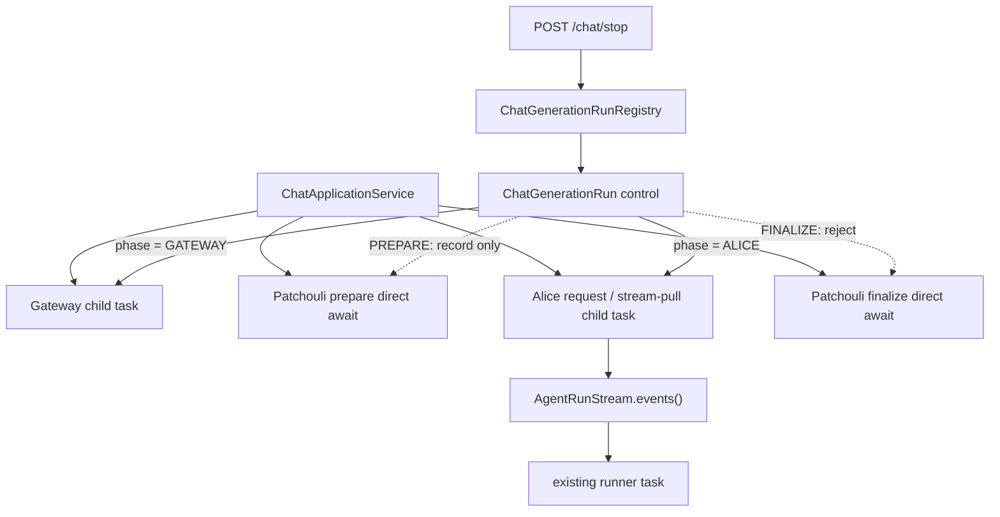

# Chat Run 取消重构最小闭环

## 实施完成记录

本计划已在 `refactor/chat-run-cancel` 分支完成，实施提交从 `6fc6892`（控制契约测试）延续至
`fb4ab51`（取消期间 cleanup 异常优先级修复），并包含 Gateway/Alice 兼容代码清理、ASGI
断流处理、Worker stream 关闭和路由可读性整理。

当前事实以 [System 应用服务](../../system/application-services.md)、
[System 运行时与总线](../../system/runtime-and-bus.md)、[Gateway 固定工作流](../../gateway/workflow.md)、
[Alice 多 Agent 编排](../../alice/orchestration.md)、[Agent Runtime](../../alice/agent-runtime.md)和
[公开路由与事件](../../contracts/routes-and-events.md)为准。本文归档后只保留实施边界、设计依据与验收记录；
未实施的生命周期候选继续由[后续 Idea](../../ideas/chat-run-lifecycle-follow-ups.md)维护。

## 1. 文档定位

本文档曾是 Chat Run 取消重构的**唯一首期实施依据**，现已完成。目标只有一个：

> 用 `Task.cancel()` + `asyncio.CancelledError` 取代沿 Gateway、Alice、Worker、MTP、CALL 逐层传递和轮询的 `asyncio.Event`，跑通 `/chat/stop` 到 Chat 终态的最小闭环。

首期不同时重构 Chat Run 的完整生命周期。现有 `ChatApplicationService.chat()` /
`chat_stream()` 继续承担编排和收尾；不会为了取消先引入独立 `ChatRunJob`、
`ChatOutputChannel`、`PreparedRunLease` 或新的 SSE 协议。

后续候选设计统一放入
[Chat Run 生命周期后续候选](../../ideas/chat-run-lifecycle-follow-ups.md)，不得反向成为首期依赖。

---

## 2. 首期范围

### 2.1 只取消两个真正耗时的阶段

| 阶段 | 用户停止行为 | 原因 |
|:---|:---|:---|
| Gateway | 立即取消当前 Gateway task | 包含 LLM query understanding / routing 调用 |
| Patchouli prepare | 接受停止，但不取消 prepare；返回后再终止 Chat Run | 当前主要是短时上下文、检索和 topic 准备，不值得引入资源租约 |
| Alice agent run | 立即取消当前 Alice 消费 task，并由现有 stream 所有权链取消内部 runner | 包含主 LLM、MTP 与子 Agent LLM 调用 |
| Patchouli finalize | 拒绝用户停止 | 属于已开始的提交阶段；首期沿用现有完成语义 |

“Prepare 不响应取消”只针对用户 `/chat/stop`。进程关闭、请求 task 被基础设施取消、
真实异常仍按 Python 原生控制流传播；本方案不把 prepare 变成不可失败或不可关闭的操作。

### 2.2 明确不做

- 不引入独立 `ChatRunJob`，SSE 仍暂时拥有 `chat_stream()` 调用生命周期；
- 不解耦 SSE transport 与 Chat Run 所有权；
- 不保证取消瞬间 Alice 内部队列中尚未转发的尾部 event 全部送达；
- 不重构 `done.final_text`、`memory_task_ids`、topic pool 或前端渲染协议；
- 不收敛 RuntimeEvent 的事件数量、命名与严格发布顺序；
- 不引入 `PreparedRunLease`、prepare id、补偿重试或 reconciliation；
- 不设计 Gateway command 的不可逆提交屏障；
- 不解决同步 CPU/IO、`asyncio.to_thread` 或不能响应 task cancellation 的第三方调用；
- 不把系统 shutdown、管理员强停与用户 stop 统一成同一业务结果；
- 不把当前进程内 Registry 扩展为跨进程控制面；首期要求 `/chat` 与 `/chat/stop`
  命中同一应用进程和 event loop。

这些事项是否实施以及实施顺序由 future 文档单独裁定。

---

## 3. 最小架构



首期有三个所有权层次：

1. `ChatApplicationService` 是现有编排者和收尾者，本身不因 `/chat/stop` 被取消；
2. Gateway、非流式 Alice request，以及流式 Alice 的每次 stream pull，都由 Chat
   application 创建并等待一个 child task；
3. Alice 的 `AgentRunStream` 继续拥有内部 runner task，当前 stream pull 被取消时通过
   现有 generator `finally` 取消并 join runner。

不让 `ChatRunControl` 直接取得 Alice runner task。首期取消目标始终是 Chat application
自己创建并等待的阶段 child task，避免引入 `start()`、runner handle 和双 task 绑定。

---

## 4. 控制模型

### 4.1 Run 级事实与 phase 级引用

`system/runtime/control.py` 维护可被 stop API 查询和修改的事实，不定义 Chat 领域异常：

```python
class ChatRunPhase(str, Enum):
    CREATED = "created"
    GATEWAY = "gateway"
    PREPARE = "prepare"
    ALICE = "alice"
    FINALIZE = "finalize"
    TERMINAL = "terminal"


class ChatRunOutcome(str, Enum):
    RUNNING = "running"
    STOP_REQUESTED = "stop_requested"
    CANCELLED = "cancelled"
    COMPLETED = "completed"
    FAILED = "failed"


@dataclass
class ChatGenerationRun:
    generation_id: str
    phase: ChatRunPhase = ChatRunPhase.CREATED
    outcome: ChatRunOutcome = ChatRunOutcome.RUNNING
    stop_reason: str | None = None
    active_task: asyncio.Task[object] | None = None
```

不增加 `CancellationToken`、`Event`、waiter、`stop_was_accepted` 或第二套取消状态。

- `outcome` / `stop_reason` 是 run 级持久事实，首次停止后不 reset；
- `active_task` 是当前可中断阶段的身份引用，同时是 Control 唯一允许取消的 task；
- Prepare、Finalize 和阶段交接期间 `active_task is None`；
- `phase` 与 `outcome` 分离，停止请求不会抹掉当前阶段。

### 4.2 `request_stop()`

```python
def request_stop(self, reason: str = "user_requested") -> StopResult:
    if self.outcome in {ChatRunOutcome.STOP_REQUESTED, ChatRunOutcome.CANCELLED}:
        return StopResult(
            accepted=True,
            reason=self.stop_reason or reason,
        )

    if self.phase in {ChatRunPhase.FINALIZE, ChatRunPhase.TERMINAL}:
        return StopResult(
            accepted=False,
            reason=(
                "already_finalizing"
                if self.phase is ChatRunPhase.FINALIZE
                else "already_terminal"
            ),
        )

    self.outcome = ChatRunOutcome.STOP_REQUESTED
    self.stop_reason = reason

    task = self.active_task
    if task is not None and not task.done():
        task.cancel()

    return StopResult(
        accepted=True,
        reason=reason,
    )
```

`StopResult` 是本次调用的返回判定，不写回 run，也不充当新的
`stop_was_accepted` 状态。Registry 将它投影为现有 stop API 的 `CancelResult`。

该方法在同一个 event loop 中同步完成，不包含 `await`：

- Gateway / Alice 运行中：记录停止并取消 `active_task`；
- Prepare 运行中：只记录停止，prepare 继续运行；
- 阶段交接空窗：只记录停止，下一个阶段不会启动；
- Finalize 或正常/失败 Terminal：拒绝且不修改 run 状态；
- 已进入 `STOP_REQUESTED` / `CANCELLED` 后的重复 stop：幂等返回首次 reason，
  不重复取消 task。

Registry 的 `cancel(generation_id)` 只负责查找 run、调用 `request_stop()` 并把结果返回
给路由层，不创建占位 run，也不发布新的控制信号。

---

## 5. Chat application 私有取消边界

### 5.1 私有异常

`ChatRunCancelled` 不是跨子系统协议。首期使用定义在 `system/application/chat_service.py` 内的私有异常：

```python
class _ChatRunCancelled(Exception):
    def __init__(self, phase: ChatRunPhase, reason: str) -> None:
        super().__init__(f"{phase.value} cancelled: {reason}")
        self.phase = phase
        self.reason = reason
```

边界规则：

- 只允许 `chat_service.py` 定义、抛出和捕获 `_ChatRunCancelled`；
- Gateway、Patchouli、Alice、AgentRuntime、Worker、MTP、CALL 不得 import 它；
- 跨子系统向上传播的取消只能是原生 `asyncio.CancelledError`；
- 不通过 `FrameExecutionResult`、`AgentRunResult` 或字符串哨兵模拟 task cancellation。

### 5.2 可中断阶段 helper

Gateway 与 Alice 共享同一个 Chat application 私有 helper：

```python
async def _run_interruptible(control, phase, operation_factory):
    owner_task = asyncio.current_task()
    entry_cancelling = owner_task.cancelling()

    if control.outcome is ChatRunOutcome.STOP_REQUESTED:
        raise _ChatRunCancelled(phase, control.stop_reason or "user_requested")

    async def invoke():
        return await operation_factory()

    task = asyncio.create_task(invoke())
    control.bind_phase(phase, task)                 # 同步，无 await
    try:
        result = await task

        # task 已完成但 Chat owner 尚未消费结果时到达的 stop。
        if control.outcome is ChatRunOutcome.STOP_REQUESTED:
            raise _ChatRunCancelled(
                phase,
                control.stop_reason or "user_requested",
            )

        return result
    except asyncio.CancelledError:
        # chat()/chat_stream() 自己被 shutdown 或 transport 取消，不能伪装成用户 stop。
        if owner_task.cancelling() > entry_cancelling:
            raise

        if (
            control.outcome is ChatRunOutcome.STOP_REQUESTED
            and control.active_task is task
        ):
            raise _ChatRunCancelled(
                phase,
                control.stop_reason or "user_requested",
            ) from None

        raise
    finally:
        control.unbind_phase(task)                  # 按 task 身份解绑
```

`bind_phase()`、`unbind_phase()`、`try_enter_finalizing()` 都是同步方法。`unbind_phase()`
只在参数与当前 `active_task` 身份一致时清空，避免旧 task 的 finally 解绑新阶段。

helper 接收 awaitable factory，而不是已创建的 coroutine。这样入口发现已有 stop 时不会
遗留一个从未 await 的 coroutine；内部 `invoke()` 也允许 factory 返回普通 Awaitable，
包括 async generator 的 `__anext__()` 对象。

### 5.3 Prepare 延迟响应

Prepare 不进入 `_run_interruptible()`：

```python
control.enter_phase(ChatRunPhase.PREPARE)           # active_task = None
prepared = await bus.request(PATCHOULI_PREPARE_AGENT_RUN, ...)

if control.outcome is ChatRunOutcome.STOP_REQUESTED:
    raise _ChatRunCancelled(
        ChatRunPhase.PREPARE,
        control.stop_reason or "user_requested",
    )
```

这样 stop 不会打断 prepare。prepare 正常返回后，`prepared` 已明确移交给
`chat_service`，现有 `finally -> PATCHOULI_CLEANUP_PREPARED_AGENT_RUN` 可以完成清理，
不会出现“资源已经创建，但返回值尚未交给上层就被取消”的新窗口。

如果 stop 在 prepare 之前的交接空窗到达，进入 prepare 前先检查
`STOP_REQUESTED`，prepare 根本不启动。

### 5.4 Finalize 门禁

进入 finalize 前执行一个同步门禁：

```python
if not control.try_enter_finalizing():
    raise _ChatRunCancelled(
        control.phase,
        control.stop_reason or "user_requested",
    )

await bus.request(PATCHOULI_FINALIZE_AGENT_RUN, ...)
```

`try_enter_finalizing()`：

- 若已接受 stop，返回 `False`，不进入 finalize；
- 否则同步设置 `phase=FINALIZE`、清空 `active_task` 并返回 `True`；
- 进入后 `/chat/stop` 返回 `already_finalizing`；
- finalize 自身不接收 Chat Run 取消参数。

---

## 6. Gateway 改造

Gateway 的目标是恢复普通异步函数语义：调用 task 被取消，当前 await 收到
`CancelledError` 并自然展开。

删除：

- `GatewayService.process(cancel_event=...)`；
- `GatewayWorkflow.run(cancel_event=...)` 与 `_run_step(cancel_event=...)`；
- `_raise_if_cancelled()`；
- `_invoke_with_control()` 中 `cancel_event.wait()` 的竞争 task；
- `GatewayCancelledError` 及其所有捕获、翻译和导出。

保留：

- Gateway request deadline 与 step timeout；
- timeout fallback 和 `GatewayTimeoutError`；
- 正常失败事件与 step completed 事件；
- 普通 `finally` 资源清理。

Gateway 不捕获 `CancelledError` 转成业务异常或结果。若需要记录日志，只允许在最外层
做无状态日志后原样 `raise`；首期不以此为事件收敛契机。

Gateway command 仍位于现有 workflow 内，因此首期 task cancellation 可能在 command await
处到达。不可逆 command 的提交屏障属于 future 设计；首期新增或改造 command handler 时，
不得假设取消能够回滚已经提交的副作用。

---

## 7. Alice 与 AgentRuntime 改造

### 7.1 传播规则

Alice 全链路只保留原生 task cancellation：

```text
Chat Alice child task.cancel()
  -> run_agent / run_agent_stream
  -> AgentRunStream consumer close
  -> AgentRunStream cancels runner task
  -> RunExecutor
  -> AgentRuntime / Worker / MTP / CALL 当前 await
```

不新增 `_guarded_run`，不把 `CancelledError` 转成 `AgentRunStatus.CANCELLED` 后再让 Chat
反向识别，也不读取 `executor.terminal_result` 作为跨层取消结果。

### 7.2 删除显式信号和轮询

从以下签名与调用中删除 `cancel_event`：

- `AgentRunService.run_agent()` / `run_agent_stream()`；
- `RunSession`；
- `AgentRuntime.run_frame()` / loop executor；
- Worker `generate_async()` / `generate_stream()`；
- MTP runtime 与 syscall 调用；
- `RunExecutor`、`CallCoordinator` 及子 Agent 调用链。

同时删除：

- `cancel_event.is_set()` 检查；
- Worker `_completion_with_cancel()` 和 `cancel_event.wait()` 竞争；
- `finish_reason == "cancelled"`、`response_status == "cancelled"` 等 task 取消哨兵；
- `_normalize_terminal_result()`；
- 全局 stop 时构造 `cancelled_response()`、恢复 caller 或继续下一轮的路径。

`FrameExecutionStatus.CANCELLED` 可以继续作为 Alice **内部已经结算的记录状态**，但不能
用于吞掉 task cancellation 并恢复为普通返回值。

### 7.3 保留的 unwind 清理

删除轮询不等于删除清理。以下行为保留并要求幂等：

- `RunExecutor.run()` 捕获 `CancelledError`，调用 `_abort_cancelled_run()` 后原样重抛；
- `_execute_call()` 在展开时取消已登记但未完成的 CALL record；
- `session.cancel_unapplied_calls()` 或等价的无信号清理方法；
- `CallRecord.cancel()`；
- `AgentRunStream.events()` 在消费端关闭时取消并 join 自己创建的 runner task；
- Worker / LLM stream 在 `finally` 中关闭底层 async iterator 或 HTTP 响应。

这些是资源所有者的本地收尾，不是新的取消控制面。

### 7.4 Streaming 首期约束

流式入口不能把“完整消费 Alice stream”放进单个 child task：child coroutine 无法直接
向外层 `chat_stream()` 执行 `yield`，若为此增加队列，就提前引入了输出通道设计。

首期将**取得 stream**以及**每一次推进 stream**分别包装为 Alice phase child task：

```python
async def _next_event(stream):
    return await anext(stream)


stream = await _run_interruptible(
    control,
    ChatRunPhase.ALICE,
    lambda: bus.request(ALICE_RUN_AGENT_STREAM, ...),
)
try:
    while True:
        try:
            event = await _run_interruptible(
                control,
                ChatRunPhase.ALICE,
                lambda: _next_event(stream),
            )
        except StopAsyncIteration:
            break

        ...  # 外层沿用当前 yield 与 Alice done 拦截逻辑
finally:
    await stream.aclose()
```

用户 stop 若发生在 Alice await 内，当前 stream-pull task 被取消，`CancelledError` 注入
Alice generator；其 `finally` 关闭 `executor_stream`，`AgentRunStream.events()` 再取消并
join 内部 runner。若 stop 发生在两个 pull 之间，`active_task` 暂为空，下一次 helper
入口会在推进 generator 前终止。Chat owner 自身不是被取消目标，因此可以安全执行
`aclose()` 和 Chat-level 收尾。

这不是完全独立于 SSE 背压的强保证：若外层 generator 正暂停在 `yield`，下一次 pull
尚未发生，stop 会先被记录，Alice generator 要等消费方恢复推进或关闭后才收到取消。
首期不为消除这个窗口增加中转队列；它随 SSE 所有权与输出通道设计留待 future 文档。

首期接受一个明确限制：stream-pull task 一旦取消，不保证 Alice 队列中尚未被 Chat application
取出的尾部 event 继续送达 SSE。是否需要 drain、独立输出通道以及取消时的文本契约，
统一留给 future 文档。

---

## 8. Chat 终态与现有协议

`chat()` 与 `chat_stream()` 顶层只新增一条私有取消分支：

```python
except _ChatRunCancelled as cancelled:
    control.mark_cancelled()
    # prepared 已返回时沿用现有 cleanup；未返回时无需 lease。
    emit_chat_cancelled(cancelled.phase, cancelled.reason)
    return_or_yield_existing_cancelled_contract()
```

约束：

- 不调用 Patchouli finalize；
- prepared 已存在时，继续走现有 `PATCHOULI_CLEANUP_PREPARED_AGENT_RUN`；
- `_ChatRunCancelled` 分支必须位于 `except Exception` 之前；
- `asyncio.CancelledError` 不得在这里无条件转换，基础设施取消仍原样传播；
- 流式入口最多发一次现有 Chat-level cancelled `done`；
- Alice 内部 `done` 继续由现有 Chat 消费逻辑拦截，不直接作为第二个 Chat `done` 转发；
- 本阶段不重新定义 `final_text`，不从 `terminal_result` 或 `frame.progress` 回捞 partial。

现有 RuntimeEvent 结构暂不重构。最低要求只有：用户 stop 不能落入
`agent.run.failed` 或 `chat.run.failed`。事件 exactly-once、phase cancelled 与严格清理顺序
属于 future 工作。

---

## 9. 实施顺序

### Step 0：控制契约测试

1. 为 `request_stop()` 固化 Gateway/Alice 立即取消、Prepare 延迟、Finalize 拒绝；
2. 固化重复 stop、not found、terminal 的幂等返回；
3. 固化阶段 task 刚完成但结果尚未消费时的 stop；
4. 固化 owner task 的基础设施取消不会转成 `_ChatRunCancelled`。

### Step 1：Chat application 最小闭环

1. 重构 `ChatGenerationRun` 为 phase/outcome/active_task/stop_reason；
2. 在 `chat_service.py` 定义 `_ChatRunCancelled` 和 `_run_interruptible()`；
3. Gateway 与 Alice 接入 child task；
4. Prepare 直接 await，返回后检查 stop；
5. Finalize 增加同步门禁；
6. 流式与非流式入口共享相同取消判定。

完成本步后，即使下游仍临时接收 `cancel_event`，新控制面也只能依赖 task cancellation；
兼容参数不得再决定结果。

### Step 2：Gateway 清理

1. 删除 Gateway `cancel_event` 参数与事件竞争；
2. 删除 `GatewayCancelledError`；
3. 保持 timeout 测试全部通过；
4. 验证 Gateway LLM await 被 task cancel 立即打断。

### Step 3：Alice 清理

1. 从 Alice 到 Worker/MTP/CALL 逐层删除 `cancel_event`；
2. 删除轮询、字符串哨兵和 custom cancellation result；
3. 保留 RunExecutor、CALL record 与 stream runner 的 unwind 清理；
4. 验证非流式、流式、MTP、CALL preparation、callee generation 的取消展开；
5. 验证取消不会发布 `agent.run.failed`。

### Step 4：移除兼容代码并回归

1. 删除不再使用的 imports、测试 fixture 和文档引用；
2. 以搜索断言生产代码不存在 Chat Run `cancel_event` 透传与 `is_set()` 轮询；
3. 跑通 server stop API、流式与非流式集成测试；
4. future 文档中的事项不得混入本阶段 PR。

---

## 10. 必测场景

- stop 在 Gateway LLM 请求启动前、请求中和 task 刚完成时到达；
- stop 在 Prepare 开始前到达：Prepare 不启动；
- stop 在 Prepare 运行中到达：Prepare 不被取消，返回后跳过 Alice/finalize；
- stop 在 Prepare 返回后、Alice task 绑定前到达；
- stop 在 Alice 首 token 前、token 中、MTP await、CALL preparation 和 callee generation 时到达；
- Alice stream pull 被取消后，内部 runner 被取消并 join，无悬挂 task；
- RunExecutor 取消每个 active CALL record 恰好一次；
- stop 与 Alice 自然完成竞争，已接受 stop 不进入 finalize；
- stop 在 Finalize 期间返回 `already_finalizing`，不取消 finalize；
- chat owner task 被 shutdown 取消时保留原生 `CancelledError`；
- 真实 Gateway/Alice 异常仍进入 failed，不被 stop 状态掩盖；
- 重复 stop 不重复调用 `task.cancel()`，首次 reason 保持稳定。

---

## 11. 验收标准

- `/chat/stop` 能立即中断已绑定的 Gateway request、非流式 Alice request 或流式 Alice
  stream-pull task；
- Patchouli prepare 不因用户 stop 收到 `CancelledError`，但 stop 被接受后不会启动 Alice；
- 已接受 stop 不进入 Patchouli finalize；
- Finalize 开始后用户 stop 被拒绝；
- Gateway、Alice、AgentRuntime、Worker、MTP、CALL 签名中不再出现 Chat Run
  `cancel_event`；
- 生产代码中不存在 Chat Run `cancel_event.is_set()` 或等价轮询；
- `GatewayCancelledError` 和 task 取消字符串哨兵删除；
- `_ChatRunCancelled` 只存在于 `system/application/chat_service.py`；
- 下游所有 task cancellation 以 `asyncio.CancelledError` 原样传播；
- 用户 stop 不发布 `agent.run.failed` / `chat.run.failed`；
- Alice streaming 取消后无遗留 runner task、活动 CALL record 或未关闭 LLM stream；
- 流式与非流式 Chat 都产生稳定的 cancelled 终态并跳过 finalize；
- 现有 timeout、普通失败、正常完成和 command 回归测试通过。

---

## 12. 实施完成后的边界

§11 已满足，本次取消机制重构完成。SSE adapter 现在会在客户端断开或 ASGI 取消时请求停止
generation，先取消并 join 自己创建的 pull task，再关闭 `chat_stream()`；Alice、Agent loop、
Worker 与 RunExecutor 的清理异常也不会替换正在传播的 `CancelledError`。

以下事项仍不属于本次最小闭环：

- Chat Run 生命周期仍由当前请求中的 `chat_stream()` 拥有，没有独立 Job、断线重连或后台状态查询；
- 取消时少量尚未离开 Alice 内部队列的 event 可能不再送达；
- cancelled `done` 与前端 partial text 的长期契约尚未版本化；
- RuntimeEvent 仍存在历史事件粒度和时序差异；
- Prepare 未使用资源租约，且在现有短时、不可取消语义下默认不需要；
- Gateway command 尚未建立通用提交屏障。

这些是后续设计的按需候选，不是已完成取消闭环的缺陷回补清单。
