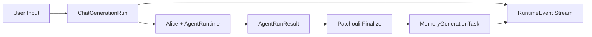

> 本文保留 v0.4.0 chat run、memory task 取消控制与 RuntimeEvent v1 的实施背景，已停止维护。当前前台用例、运行控制、可观测性和记忆任务事实分别以 [System 应用服务](../../../system/application-services.md)、[System Runtime](../../../system/runtime-and-bus.md)、[System 可观测性](../../../system/observability.md)和[记忆生成](../../../patchouli/generation.md)为准；未继续实现的跨进程恢复与强抢占设想不属于当前能力。

# v0.4.0 Runtime Control 与系统事件观测实现规划

**文档状态**: Draft
**适用范围**: `system/application/chat_service.py`、`server/routers/chat.py`、`agent_runtime/`、`alice/runtime/`、`patchouli/service.py`、`patchouli/services/librarian.py`、`infrastructure/trace_context.py`、`infrastructure/log_handler.py`、前端 chat/kernel runtime 面板
**核心目标**: v0.4.0 不继续扩展复杂智能体能力，而是补齐运行时控制面。重点交付端到端取消语义、主动记忆生成的独立观测与控制、系统事件流 v1，为后续 Gateway 上移、MTP RUN、多智能体 Phase 3 提供可控、可追踪、可恢复的运行时基础。

---

## 1. 版本定位

v0.3.0 已经完成了较大规模的运行时边界整理：

- `agent_runtime/` 已成为单 Agent 执行引擎的物理载体。
- `AgentLoopExecutor` 已收敛为更纯粹的 generate -> MTP -> return/suspend 循环。
- `AgentOrchestrator` 已承担 CALL、子 Agent、IPC 回填、结果组装等编排职责。
- `PendingAtomMaterializeTask` 已从 Agent run 结果流入 Patchouli finalize，再触发主动记忆生成。
- 前端 SSE 对话、后端 `generation_id`、`cancel_event`、日志 trace grouping 已具备基础形态。

但这些能力现在仍有一个共同问题：**运行时状态还没有成为一等公民**。取消、后台记忆生成、系统事件、日志展示、SSE 断连、finalize 策略之间缺少统一契约。

因此 v0.4.0 的主题不是“增加更多智能行为”，而是：

> 将一次用户交互及其派生的记忆生成任务，建模为可取消、可观测、可审计、可清理的 runtime run/task。

后续版本依赖关系：

| 后续能力 | 为什么依赖 v0.4.0 |
| :--- | :--- |
| Gateway 上移与复合意图拆分 | 一个输入可能拆成多个下游任务，必须先有统一 task/run 观测与取消语义 |
| MTP RUN executable asset | 可执行资产必须能被中断、审计、追踪来源 |
| Alice Phase 3 多智能体编排 | 多 Agent 并发会放大 cancel/trace/finalize 的不一致 |
| 记忆分裂与合并 | 生命周期事件必须可追踪，否则难以回滚与解释 |

---

## 2. 本期目标与非目标

### 2.1 目标

1. **完整取消语义**
   - 前端 Stop、SSE 客户端 abort、浏览器断连、后端 `/chat/stop` 都收敛到同一个取消控制面。
   - 取消信号必须穿透 ChatApplicationService、Alice Orchestrator、AgentLoopExecutor、WorkerAgent、sub-agent frame、MTP 执行边界、Patchouli finalize 策略。
   - 被取消的 run 不应继续产生误导性的最终回答或默认触发长期记忆生成。

2. **主动记忆生成独立运行时**
   - `run_active_generation()` 从 finalize 的直接过程调用，升级为可观测的 memory generation task。
   - 前端增加独立窗口展示后台记忆生成状态、任务列表、trace、错误与产物。
   - 支持单独取消 memory generation task，不影响已经完成的对话回答。

3. **系统事件观测流 v1**
   - 从“捕获 logging namespace 并展示”升级为“日志 + domain event 双通道”。
   - 日志继续用于调试文本，domain event 用于前端可靠渲染运行时状态。
   - 修复生产环境下观测面板可能无法显示的问题。

4. **可验证的运行时契约**
   - 为 cancel、memory task、event stream 增加单元测试、集成测试和前端状态测试。
   - 建立 v0.4.0 的验收清单，避免只完成局部停止按钮。

### 2.2 非目标

本期不做以下工作：

- 不上移 TheEye/Gateway 到 System 级。
- 不实现复合意图识别与任务拆分。
- 不实现 MTP READ/RUN 特殊编译。
- 不实现新的多智能体编排策略。
- 不实现记忆分裂/合并。
- 不重写现有日志系统；本期是在日志通道旁建立 domain event contract。

---

## 3. 当前现状与问题清单

### 3.1 已存在的取消能力

当前链路已经具备基础取消信号：

- `ChatApplicationService.chat_stream()` 创建 `generation_id` 与 `asyncio.Event`，并存入 `_generation_events`。
- 前端 `stopStreaming()` 调用 `/api/v1/chat/stop` 后中断 SSE client。
- `AgentLoopExecutor.execute_frame()` 在循环顶部检查 `cancel_event`。
- `WorkerAgentService.generate_stream()` 在流式 chunk 迭代中检查 `cancel_event`。
- Alice service/orchestrator 的若干入口已经接收 `cancel_event`。

这说明 v0.4.0 不需要从零建立取消，而是要把“局部中断”提升为“系统语义”。

### 3.2 取消链路缺口

需要重点补齐：

| 缺口 | 风险 |
| :--- | :--- |
| SSE 客户端断连没有显式映射为后端 cancel | 用户关闭页面后后端可能继续跑 Agent 和记忆生成 |
| 非流式 chat 路径没有同等取消能力 | API 行为不一致 |
| 子 Agent / CALL 路径 cancel 传递需要逐段确认 | Stop 可能只能停主 frame，子 frame 继续运行 |
| MTP 执行期间 cancel 检查不成体系 | 工具调用或长步骤可能延迟响应取消 |
| cancel 后仍可能进入 finalize | 可能把 partial output 和 pending atom 误写入长期记忆 |
| PendingAtom 缺少 cancelled settlement | 前端/后端无法解释 draft atom 为什么没有落库 |
| SSE done 事件只带 `stopped` 布尔值 | 前端缺少稳定状态机 |
| `_generation_events` 无清理机制 | 正常完成路径下 dict 永不清空，长时间运行后内存泄漏 |
| Orchestrator/AgentLoopExecutor 的 `finally` 块在正常完成时也会 set `cancel_event` | 污染外部传入的共享 cancel token，正常完成被误认为取消 |

### 3.3 主动记忆生成现状

v0.3.0 后，主动记忆生成已经从旧 perception buffer 结算链路中抽出：

1. Agent run 期间产生 pending atom materialize tasks。
2. `AgentOrchestrator` 组装 `AgentRunResult.materialize_tasks`。
3. `PatchouliService.finalize_agent_run()` 先提交本轮 interaction，再调用 `LibrarianCore.run_active_generation()`。
4. `run_active_generation()` 按 task 调用 generation engine mode b/c，并发布 pending atom settled/failed 事件。

这个方向是正确的，但当前仍是 finalize 的直接子过程。用户在前端看到的是“对话生成结束/停止”，看不到后台 memory generation 的独立状态，也不能单独取消。

### 3.4 观测现状

当前观测面主要依赖：

- `trace_context.py` 通过 `contextvars` 注入 `trace_id`、`span_name`、`task_type`。
- `WebSocketLogHandler` 按 namespace 捕获 logging record 并转发前端。
- 前端 kernel store 按 `trace_id/span_name` 分组展示。

这套机制适合调试日志，但不适合承担运行时状态协议：

- 日志文本不是稳定 API。
- 生产环境 namespace、WebSocket URL、websocket disabled 时可能导致展示缺失。
- 前端要从日志推断“任务开始/结束/取消/失败”，容易脆弱。
- 后台记忆生成、pending atom settlement、cancel result 等状态应该是 domain event，而不是日志副产品。

---

## 4. 目标架构

### 4.1 三类运行时对象

v0.4.0 引入三个清晰概念：

| 对象 | 含义 | 生命周期 |
| :--- | :--- | :--- |
| `ChatGenerationRun` | 一次用户输入触发的前台 Agent 对话生成 | SSE generation_id 创建 -> Agent run -> finalize/skip finalize -> done |
| `MemoryGenerationTask` | 单个 pending atom materialize task 或单次 archive 请求触发的后台记忆生成 | finalize/归档派生 -> generation mode a/b/c -> settled/failed/cancelled |
| `RuntimeEvent` | 面向前端和调试系统的稳定状态事件 | run/task 生命周期内持续发布 |

三者关系：



### 4.2 状态枚举

#### ChatGenerationRunStatus

```python
class ChatGenerationRunStatus(str, Enum):
    CREATED = "created"
    PREPARING = "preparing"
    STREAMING = "streaming"
    FINALIZING = "finalizing"
    COMPLETED = "completed"
    CANCELLING = "cancelling"
    CANCELLED = "cancelled"
    FAILED = "failed"
```

#### MemoryGenerationTaskStatus

```python
class MemoryGenerationTaskStatus(str, Enum):
    PENDING = "pending"
    RUNNING = "running"
    COMPLETED = "completed"
    CANCELLED = "cancelled"
    FAILED = "failed"
```

`MemoryGenerationTask` 当前是单任务句柄，而不是一批 materialize tasks 的批处理容器。因此：

- `PENDING` 表示任务已注册但后台协程尚未进入执行段。
- 不引入 `PARTIAL_FAILED`：单 task 内部没有需要独立结算的子任务集合。
- 不引入 `CANCELLING`：取消请求由 `cancel_event` / cancel result 表达，终态由 `CANCELLED` 表达；前端如需“取消中”状态，可用 `status not in terminal && cancel_requested` 派生。

### 4.3 取消层级

取消必须区分两个层级：

| 取消对象 | 入口 | 效果 |
| :--- | :--- | :--- |
| Chat generation cancel | `/chat/stop`、SSE disconnect、前端 stop | 停止主对话 Agent run；默认跳过或降级 finalize；不再派生新的 memory task |
| Memory generation cancel | 新增 memory task cancel API | 停止后台记忆生成；不修改已完成的对话回答；未落库 pending atom 标记 cancelled |

原则：

- 取消前台 chat run 不应误杀其它已存在的后台 memory tasks，除非这些 tasks 由该 run 派生且尚未开始，并且策略明确为 cascade。
- 取消 memory task 不应影响已完成的 assistant message。
- 同一个 cancel API 必须幂等：重复取消返回当前状态，不报错。

---

## 5. 后端实现规划

### 5.1 Runtime control ownership boundary

v0.4.0 后端收尾阶段不再采用“统一 RuntimeControlRegistry 管理所有运行时对象”的方案。chat run 与 memory task 虽然都需要查询、取消和事件观测，但它们的业务归属不同：

| 对象 | Registry / Owner | 所属层 | 说明 |
| :--- | :--- | :--- | :--- |
| `ChatGenerationRun` | `ChatGenerationRunRegistry` | `system/application` | 描述一次顶层 chat run，覆盖 Patchouli prepare、Alice `agent.run`、Patchouli finalize 的前台链路。 |
| `MemoryGenerationTask` | `MemoryGenerationTaskRegistry` | `patchouli/runtime` | 描述单个 WRITE/UPDATE 主动记忆生成或 ARCHIVE 被动归档生成任务，生命周期由 Patchouli 记忆域拥有。 |
| `RuntimeEvent` | `RuntimeEventBus` | `system/runtime` | 只承载可观测事件流，不拥有业务生命周期状态。 |

落地决策：

- `RuntimeControlRegistry` 重命名为 `ChatGenerationRunRegistry`，`system/runtime/control.py` 只保留 chat run 控制面。
- `MemoryGenerationTask`、`MemoryGenerationTaskStatus`、`MemoryGenerationSource`、`MemoryGenerationTaskRegistry` 移到 `patchouli/runtime/memory_tasks.py`，作为 Patchouli 运行时模型。
- system 层不直接创建、关闭或修改 memory task；这些状态变更只允许通过 Patchouli service / controller 发生。
- HTTP API 层不再穿透访问 `system._patchouli.service`，而是依赖顶层 `MemoryTaskApplicationService` 作为 facade，再由 facade 委托 Patchouli service。
- 统一视图由 RuntimeEvent stream 与 API facade 提供，而不是通过共享 registry 合并所有运行时对象。

当前边界：

```text
System/Application
  owns ChatGenerationRun lifecycle
  exposes ChatApplicationService
  exposes MemoryTaskApplicationService facade

Patchouli
  owns MemoryGenerationTask lifecycle
  owns active/passive memory generation

RuntimeEventBus
  observes chat.run / agent.run / memory.task
  owns no business lifecycle state
```

后续如果需要跨进程恢复或历史查询，应分别设计 chat run history 与 Patchouli memory task history 的持久化视图，再由查询 API 聚合；不应重新把两类对象塞回一个进程内 mega registry。

### 5.2 ChatApplicationService 改造

`ChatApplicationService.chat_stream()` 需要从“局部 dict 保存 cancel_event”升级为 run lifecycle owner。

改造点：

1. 创建 `ChatGenerationRun`。
2. 发布 `chat.run.created`。
3. prepare 前进入 `PREPARING`。
4. Alice stream 前进入 `STREAMING`。
5. 捕获 cancel 状态并停止继续推进。
6. 根据 run status 决定是否 finalize。
7. 最终发布 `chat.run.completed` / `chat.run.cancelled` / `chat.run.failed`。
8. 清理 registry 中的 active run。

伪代码：

```python
run = registry.create_chat_run(...)
await events.publish("chat.run.created", run.to_event())

try:
    await run.set_status(PREPARING)
    prepared = await bus.request(PATCHOULI_PREPARE_AGENT_RUN, ...)

    if run.cancelled:
        return cancelled_done()

    await run.set_status(STREAMING)
    loop_result = await bus.request(ALICE_RUN_AGENT_STREAM, cancel_event=run.cancel_event, ...)

    if loop_result.status != AgentRunStatus.COMPLETED or run.cancelled:
        await maybe_record_cancelled_transcript(...)
        return cancelled_done()

    await run.set_status(FINALIZING)
    finalize_result = await bus.request(PATCHOULI_FINALIZE_AGENT_RUN, ...)
    return completed_done(finalize_result)
finally:
    registry.close_chat_run(run.generation_id)
```

### 5.3 SSE 断连映射为 cancel

`server/routers/chat.py` 的 `event_generator()` 需要检查 request disconnect。

要求：

- 客户端断连时调用 `cancel_chat_run(generation_id, reason="client_disconnected")`。
- 如果断连发生在 generation_id 发给前端之前，也必须能取消当前 run。
- route 层不要吞掉 `CancelledError` 后让后台任务继续跑。

建议：

- `chat_stream()` 接收一个 `is_disconnected` callback，或 route 层 wrap async iterator。
- `ChatApplicationService` 内部持有 run 后，route 层可以通过 run handle 取消。
- 如果实现复杂，先在 service 的 async generator 每次 yield 前后检查 `await request.is_disconnected()`。

### 5.4 AgentRuntime / Alice cancel contract

需要逐层确认并补齐 `cancel_event`：

| 层 | 要求 |
| :--- | :--- |
| `AliceService.run_agent_stream` | 必须将 cancel_event 传入 orchestrator |
| `AgentOrchestrator.run_agent_stream` | 主 frame、sub frame、CALL resume 均传递同一个 token |
| `_handle_suspend` / sub-agent execution | 子 Agent 执行必须响应同一个 token |
| `AgentRuntime.run_frame_emitting` | 接收并转发给 `AgentLoopExecutor` |
| `AgentLoopExecutor.execute_frame` | 每轮 generate 前、MTP 前后、SUSPEND 返回前检查 |
| `WorkerAgentService.generate_stream` | chunk 迭代中检查，取消时返回 cancelled finish reason |
| `MTPRuntime.intercept_and_execute` | 长耗时工具执行前后检查；无法抢占的工具至少在返回后立即停止后续 loop |

新增约定：

```python
class AgentRunResult(BaseModel):
    status: AgentRunStatus
    final_text: str = ""
    cancelled_reason: str | None = None
    materialize_tasks: list[PendingAtomMaterializeTask] = []
```

取消时：

- `status = CANCELLED`
- `materialize_tasks` 保留原始列表，但每个 task 携带 `cancelled` settlement intent，不得默认触发 generation。这样前端 Memory Runtime Window 能正确展示"这批 atoms 因取消而未落库"，而不是凭空消失。
- `final_text` 可以保留 partial text 给 UI，但不得作为完整 assistant answer 进入长期记忆。

### 5.5 Finalize 策略

v0.4.0 必须明确 finalize 是否执行。

推荐策略：

| 场景 | submit_interaction | run_active_generation | 说明 |
| :--- | :---: | :---: | :--- |
| 正常完成 | 是 | 是 | 当前行为 |
| 用户取消，未产生 assistant partial | 否 | 否 | 不产生长期记忆 |
| 用户取消，已有 partial output | 可配置，默认否 | 否 | 避免 partial 污染记忆 |
| Agent 已完成，finalize 期间取消 | 是 | 取消/跳过未开始 memory task | 对话可保留，记忆生成可独立取消 |
| memory task 单独取消 | 不影响 | 停止该 task | pending atom 标记 cancelled |

第一版建议配置项：

```yaml
runtime:
  cancellation:
    persist_cancelled_transcript: true
    cancelled_transcript_as_memory_source: false
    cascade_cancel_pending_memory_tasks: true
```

`persist_cancelled_transcript` 只表示保留 raw transcript 或调试 artifact，不表示写长期记忆。

### 5.6 MemoryGenerationTask

`PatchouliService.finalize_agent_run()` 不再直接把 `materialize_tasks` 交给 `run_active_generation()` 并阻塞到结束，而是为每个 materialize task 创建独立的 `MemoryGenerationTask`。

第一阶段可以先同步执行 task，但必须已经具备 task 状态与 cancel token：

```python
memory_task = MemoryGenerationTask(
    task_id=...,
    source_generation_id=...,
    trace_id=...,
    pending_alias=materialize_task.pending_alias,
    source=materialize_task.source_verb,
    status=PENDING,
    cancel_event=asyncio.Event(),
)
registry.register_memory_task(memory_task)
await memory_task_runner.run(memory_task, materialize_task)
```

第二阶段再把 task runner 改成后台 task / queue。

`LibrarianCore.run_active_generation()` 改造要求：

- 接收 `task_id`、`cancel_event`、`source_generation_id`。
- 每个 `MemoryGenerationTask` 开始前检查 cancel。
- 每个 `MemoryGenerationTask` 发布 created/status/completed/failed/cancelled RuntimeEvent；PendingAtom settled/failed/cancelled 仅保留为 Alice/Patchouli 内部功能总线事件。
- 取消时对对应 pending atom 产生 cancelled settlement event。
- 不再只靠 logging 表达进度。

### 5.7 Memory task API

新增后端 API：

| API | 方法 | 说明 |
| :--- | :--- | :--- |
| `/api/v1/memory-tasks` | GET | 列出最近/活跃 memory generation tasks |
| `/api/v1/memory-tasks/{task_id}` | GET | 查询 task 详情 |
| `/api/v1/memory-tasks/{task_id}/cancel` | POST | 取消指定 task |

如果暂不新增 router，也可先挂在现有 memory/kernel API 下，但命名上应保留 `task` 概念。

---

## 6. 系统事件流 v1

### 6.1 事件与日志分层

v0.4.0 后前端运行时状态必须依赖 RuntimeEvent，而不是解析日志。

| 通道 | 用途 | 稳定性 |
| :--- | :--- | :--- |
| RuntimeEvent | run/task 生命周期、状态机、进度、取消、失败、产物引用 | 稳定 API |
| Log stream | 人类调试文本、异常堆栈、组件内部细节 | 非稳定 API |

日志可以携带 `trace_id`，但不再承担“任务是否完成”的唯一事实来源。

### 6.2 RuntimeEvent 数据结构

建议新增 `system/contracts/runtime_events.py`。

```python
class RuntimeEventType(str, Enum):
    CHAT_RUN_CREATED = "chat.run.created"
    CHAT_RUN_STATUS = "chat.run.status"
    CHAT_RUN_CANCEL_REQUESTED = "chat.run.cancel_requested"
    CHAT_RUN_CANCELLED = "chat.run.cancelled"
    CHAT_RUN_COMPLETED = "chat.run.completed"
    CHAT_RUN_FAILED = "chat.run.failed"

    AGENT_RUN_STARTED = "agent.run.started"
    AGENT_RUN_STATUS = "agent.run.status"
    AGENT_RUN_COMPLETED = "agent.run.completed"
    AGENT_RUN_CANCELLED = "agent.run.cancelled"
    AGENT_RUN_FAILED = "agent.run.failed"

    MEMORY_TASK_CREATED = "memory.task.created"
    MEMORY_TASK_STATUS = "memory.task.status"
    MEMORY_TASK_CANCEL_REQUESTED = "memory.task.cancel_requested"
    MEMORY_TASK_CANCELLED = "memory.task.cancelled"
    MEMORY_TASK_COMPLETED = "memory.task.completed"
    MEMORY_TASK_FAILED = "memory.task.failed"

    EVENT_STREAM_GAP = "event.stream.gap"
```

Phase 3 首期最小事件集合只覆盖 `chat.run.*`、`agent.run.*`、`memory.task.*` 与 `event.stream.gap`。`agent.frame.*` 可作为后续扩展；除非前端开始展示 frame 树，否则不纳入 v1 必交付。PendingAtom 是 Alice/Patchouli 主动生成链路的内部运行态协议，不作为 RuntimeEvent 对外暴露；未来如需一般意义的 `memory.atom.*`，应另行定义语义。

`chat.run` 与 `agent.run` 边界：

- `chat.run.*` 表示一次 HTTP/SSE chat 请求的端到端生命周期，覆盖 Patchouli prepare、Alice run_agent、Patchouli finalize、memory task 派生与最终 done。
- `agent.run.*` 表示 Alice orchestrator 的一次 `run_agent` / `run_agent_stream` 过程。现有 `AliceEvents.RUN_STARTED = "alice.run.started"` 与 `AliceEvents.RUN_COMPLETED = "alice.run.completed"` 应迁移或映射为 `agent.run.started` / `agent.run.completed` RuntimeEvent。
- 一个 `chat.run` 通常包含一个 `agent.run`，但边界上不应混用：Agent 运行完成后，chat run 可能仍处于 `finalizing`。

统一 payload：

```python
class RuntimeEvent(BaseModel):
    event_id: str
    sequence: int
    event_type: RuntimeEventType
    timestamp: datetime
    trace_id: str | None = None
    span_name: str | None = None
    task_type: Literal["foreground", "background"] | None = None

    source: str | None = None
    subsystem: str | None = None
    component: str | None = None
    severity: Literal["debug", "info", "warning", "error"] = "info"

    generation_id: str | None = None
    agent_run_id: str | None = None
    task_id: str | None = None
    agent_id: str | None = None
    frame_id: str | None = None
    topic_id: str | None = None
    atom_id: str | None = None

    status: str | None = None
    reason: str | None = None
    message: str | None = None
    data: dict[str, Any] = Field(default_factory=dict)
```

字段约束：

- `event_id` 使用 `evt_<uuid>`，用于 SSE `id` 与日志引用。
- `sequence` 是 `RuntimeEventBus` 进程内递增整数；前端排序优先用 `sequence`，其次才是 `timestamp`。
- `trace_id` 尽量由发布 helper 从 `trace_context` 自动填充，但允许为空，避免无 trace 场景为了观测事件反向污染业务路径。
- `source/subsystem/component` 由 scoped sink 自动补齐，例如 `source="patchouli.memory_generation_task_controller"`。
- `data` 只放小型结构化状态，不放 prompt 全文、大对象、完整异常栈或敏感原文；详细调试内容仍走 log stream。

### 6.3 RuntimeEventBus 独立观测总线

RuntimeEvent 不复用 `GlobalSystemBus.publish()` 作为主发布通道，而是新增独立的 `RuntimeEventBus` / `RuntimeEventStream`。

设计理由：

- `GlobalSystemBus`、`PatchouliBus`、`AliceBus` 是功能通信总线，`publish()` 事件有明确消费者并参与系统行为。
- `RuntimeEvent` 是可观测性事实，当前主要用于展示、调试、审计和后续 CLI/Electron adapter，不应驱动业务状态推进。
- 观测 transport 断开、disabled、客户端消费慢、buffer 满，都不能影响 chat run、agent loop 或 memory generation 主链路。
- 避免后续代码把 `runtime.event` 当成功能协议消费，形成隐式业务依赖。

因此，功能总线与观测总线职责分束：

| 总线 | 职责 | 消费语义 |
| :--- | :--- | :--- |
| `GlobalSystemBus` / 子系统 bus | RPC、跨子系统功能事件、固定消费者信号 | 消费者是系统行为的一部分 |
| `RuntimeEventBus` | run/task/frame 生命周期观测事件、前端展示、调试与审计事实 | best-effort 旁路观察，不驱动业务 |

`RuntimeEventBus` 不继承现有 `AsyncSystemBus`。`AsyncSystemBus` 暴露 `register/request`，且 `publish()` 会逐个 `await` subscriber；这些语义更适合功能通信，不适合可观测性 fanout。`RuntimeEventBus` 应是独立类，只暴露观测流所需能力：

```python
class RuntimeEventSink(Protocol):
    def emit(self, event: RuntimeEvent) -> None: ...


class RuntimeEventBus(RuntimeEventSink):
    def emit(self, event: RuntimeEvent) -> None:
        """Best-effort: append ring buffer and fan out to subscriber queues."""
        ...

    async def subscribe(
        self,
        replay_last: int = 100,
    ) -> AsyncIterator[RuntimeEvent]:
        ...
```

发布约束：

- `emit()` 不抛出业务可见异常。
- `emit()` 是同步 best-effort 接口，业务路径不 `await` 观测流；它只负责补齐 `event_id/sequence/timestamp/trace_context`、写入 ring buffer，并对 subscriber queue 做非阻塞 fanout。
- `emit()` 不等待慢 subscriber 完成；对 client queue 使用 `put_nowait` 或等价非阻塞策略。
- bus 内部维护最近 N 条 ring buffer，供新连接 catch-up。首期建议 `buffer_size=1000`。
- subscriber queue 满时允许丢弃旧事件保留新事件，避免前端卡顿导致状态永久落后；需要记录 per-subscriber dropped count。
- transport disabled 时使用 `NullRuntimeEventSink`，业务代码无需分支。

### 6.4 RuntimeEventBus 拓扑

v0.4.0 首期采用**顶层扁平事件流**，由 `HiveMemorySystem` 持有一条 `RuntimeEventBus`，并把 `RuntimeEventSink` 自顶向下注入 `ChatApplicationService`、`PatchouliSystem` / `PatchouliService` / `MemoryGenerationTaskController`、`AliceSystem` / runtime 等需要发布观测事件的组件。

推荐结构：

```text
ChatApplicationService
PatchouliService / MemoryGenerationTaskController
AliceRuntime / AgentOrchestrator
        |
        v
RuntimeEventSink / RuntimeEventBus
        |
        +-- in-memory ring buffer
        +-- SSE / WebSocket transport
        +-- future CLI JSONL adapter
```

暂不建立 `PatchouliRuntimeEventBus` / `AliceRuntimeEventBus` 再选择性向上转发。当前项目以单用户本地部署为主，子系统私有观测流会增加转发器、生命周期注册、重复 buffer 和测试复杂度，但收益有限。

为保持子系统代码边界清晰，可以提供 scoped sink：

```python
patchouli_events = runtime_events.scoped("patchouli")
alice_events = runtime_events.scoped("alice")
```

scoped sink 只自动补齐 `source` / `subsystem` / `component` 等字段，底层仍进入同一条顶层扁平流。未来只有出现以下需求时，再考虑子系统私有事件流：

- 子系统内部出现高频 telemetry，不希望全部进入全局观测流。
- 多用户、多 workspace、多客户端隔离要求观测事件按权限过滤。
- 子系统需要脱离 `HiveMemorySystem` 独立运行并提供自己的 event transport。
- 不同子系统需要不同事件保留策略。

### 6.5 前端订阅方式

当前已有 WebSocket log stream。v0.4.0 有两个选择：

1. **扩展现有 WebSocket**：在 message 中增加 `kind: "log" | "event"`。
2. **新增 RuntimeEvent WebSocket/SSE**：日志和事件完全分离。

**部署假设**：项目当前及今后较长时间内为单用户本地部署，WebSocket 广播不需要 per-client 过滤。若未来引入多用户或多 tab 隔离场景，再按 `session_id` / `generation_id` 增加过滤层。

推荐第一阶段采用方案 2，并以 **SSE 作为首期 transport**。原因：

- RuntimeEvent 是后端到前端的单向状态流，不需要 WebSocket 双向协议。
- SSE 自带 `Last-Event-ID` 语义，适合和 ring buffer replay 配合。
- CLI JSONL adapter 与 SSE event line 结构更接近。
- 现有日志 WebSocket 可以继续独立存在，避免日志与业务运行时事件混流。

因此业务事件不应绑定到日志 WebSocket，也不应只存在于 chat SSE。SSE/WebSocket/CLI JSONL 都应只是 `RuntimeEvent` 的 transport adapter。

Phase 3 的后端实现应先定义统一事件 envelope，再提供至少一种实时传输：

- Web / Electron renderer：首期使用 RuntimeEvent SSE；后续如需要双向控制再增加 WebSocket adapter。
- Electron main process：可消费同一 HTTP/SSE/WebSocket，再转 IPC。
- CLI：后续可复用同一事件源输出 JSONL，或通过短轮询 list/detail 作为降级。

SSE replay 语义：

- 端点建议为 `GET /api/v1/runtime-events/stream`。
- 每条 SSE 使用 `id: <event_id>`，`event: runtime_event`，`data` 为 `RuntimeEvent` JSON。
- 客户端重连时可通过 `Last-Event-ID` header 或 `?last_event_id=` 查询参数请求 replay。
- 如果 `last_event_id` 仍在 ring buffer 中，从下一条事件开始补发，然后进入实时流。
- 如果 `last_event_id` 已被淘汰，先发送 `event.stream.gap` RuntimeEvent，携带 `last_event_id`、当前最早 `event_id`、`dropped_count`，再进入实时流。
- transport disabled 时返回明确状态，例如 `503 {"status":"disabled"}`，前端展示 disabled，不无限重连。

前端 store 内部必须分为 `logs` 与 `runtimeEvents` 两个 reducer。

消息格式：

```json
{
  "kind": "event",
  "event": {
    "event_id": "evt_...",
    "sequence": 1024,
    "event_type": "memory.task.status",
    "trace_id": "stream_...",
    "task_type": "background",
    "subsystem": "patchouli",
    "component": "memory_generation_task_controller",
    "task_id": "memtask_...",
    "status": "running",
    "message": "Generating memory atom 1/3"
  }
}
```

### 6.6 生产环境观测修复

本期必须解决：

- WebSocket URL 不应硬编码开发端口。
- 生产构建应基于当前 origin 或后端配置生成 WS endpoint。
- websocket disabled 时后端不应 500，应返回明确状态或前端展示 disabled。
- 前端 connection state 必须可见：`connecting`、`connected`、`disconnected`、`disabled`、`error`。
- 日志 namespace 配置错误不应影响 RuntimeEvent 展示。

---

## 7. 前端实现规划

### 7.1 Chat stop 状态机

前端 `chatStore` 需要从 `isStreaming: boolean` 扩展为运行状态：

```ts
type ChatRunStatus =
  | 'idle'
  | 'preparing'
  | 'streaming'
  | 'cancelling'
  | 'cancelled'
  | 'finalizing'
  | 'completed'
  | 'failed'
```

Stop 按钮行为：

- `streaming` / `preparing` / `finalizing` 时可点击。
- 点击后立即进入 `cancelling`，按钮 disabled 或显示取消中。
- 收到 `chat.run.cancelled` 后进入 `cancelled`。
- 如果后端返回 run 已完成，则进入 `completed`，不显示错误。

### 7.2 Memory Runtime Window

新增一个前端窗口或 KernelTerminal 内的独立 tab：`Memory Runtime`。

最小展示：

- active memory tasks 列表。
- task 状态：pending/running/cancelled/completed/failed。取消中状态由 `cancel_requested && status not in terminal` 派生。
- 来源：source generation id、trace id、topic id、pending aliases。
- 进度：单 task 当前阶段；如果后续引入批处理 task，再扩展已处理 items / 总 items。
- 每个 task 的 settled/failed/cancelled 结果。
- 单 task Cancel 按钮。

不要求本期做复杂可视化，但要让用户明确知道：

> 对话生成结束后，后台是否仍在生成记忆；如果还在生成，是哪一批任务；能否停止。

### 7.3 KernelTerminal 调整

现有 KernelTerminal 继续展示日志，但增加 Runtime Events 视图或混合视图：

- Logs：按 trace/span 展示文本日志。
- Events：按 run/task 展示结构化状态。
- 对同一 `trace_id`，允许从 event 跳转到 logs。

### 7.4 SSE 事件兼容

当前 chat SSE 仍保留：

- `generation_id`
- `token` / message chunk
- `done`
- `error`

新增或扩展：

```json
{
  "event": "run_status",
  "data": {
    "generation_id": "...",
    "status": "cancelling"
  }
}
```

`done` 事件采用两步发送（方案 B）：

**第一步**：Agent run 结束、进入 finalize 时，发出 `status=finalizing`：

```json
{
  "event": "run_status",
  "data": {
    "generation_id": "...",
    "status": "finalizing"
  }
}
```

**第二步**：finalize 完成、memory task 创建并注册后，发出最终 `done` 事件：

```json
{
  "generation_id": "...",
  "status": "completed",
  "stopped": false,
  "reason": null,
  "memory_task_ids": ["memtask_..."]
}
```

取消路径下的 `done`：

```json
{
  "generation_id": "...",
  "status": "cancelled",
  "stopped": true,
  "reason": "user_requested",
  "memory_task_ids": []
}
```

这样 `done` 中的 `memory_task_ids` 是真实可用的 task id，而不是空列表或尚未存在的 id。

---

## 8. 分阶段实施计划

### Phase 1: Cancel contract hardening

目标：前台 chat generation 能可靠停止。

任务：

1. 引入 `ChatGenerationRunStatus` / `AgentRunStatus` 的 cancelled 状态。
2. 将 `_generation_events` 替换为 `ChatGenerationRunRegistry`。
3. `/chat/stop` 改为幂等 cancel result。
4. SSE disconnect 映射为 cancel。
5. 确认 cancel_event 贯穿 Alice orchestrator 主/子 frame。
6. Worker stream cancelled finish reason 统一上抛为 AgentRunResult cancelled。
7. cancel 后默认跳过 `run_active_generation()`。
8. SSE done 返回稳定 `status/reason/stopped`。

验收：

- 生成中点击 Stop，后端 LLM stream 停止。
- sub-agent CALL 中点击 Stop，主/子 frame 都停止。
- Stop 后不产生新的 memory atom。
- 重复 Stop 不报错。
- 关闭浏览器连接后后端不继续跑该 generation。

### Phase 2: MemoryGenerationTask runtime

目标：主动记忆生成可见、可取消，且对话完成后立即返回 done，记忆在后台独立运行。

**实现说明**：task 包装与异步后台执行必须同步完成，不拆两步。原因：同步等待 task 完成再发 done 会导致前端 Memory Runtime Window 打开时 task 已结束，cancel 按钮无实际意义，Phase 2 的核心用户价值（"对话已完成，记忆在后台"）无法体现。`asyncio.create_task()` 本身并不复杂，task 对象与 cancel 语义才是真正的设计工作，无论同步异步都需要完成。后台 task 的终态由业务协程的 `_finish_task()` 统一写入并发布事件，`asyncio.Task` 本身只承载执行，不再通过 done callback 反推 completed/failed/cancelled。

**Phase 2/Phase 3 边界决策**：

- Phase 2 负责让 `MemoryGenerationTask` 成为统一后端 runtime 句柄，并覆盖主动 `WRITE/UPDATE` 与被动 `ARCHIVE` 两类来源。
- Phase 2 可通过 chat `done.memory_task_ids` 暴露主动链路创建的 task，使一次对话完成后前端能关联后台主动记忆生成。
- 被动链路（例如定时 idle flush、manual archive、shutdown flush）创建的 `ARCHIVE` task 不依赖某个 chat SSE，因此“前端窗口自动浮现”不纳入 Phase 2。
- 被动 `ARCHIVE` task 自动推送、Memory Runtime Window 自动打开、以及 Electron / CLI / Web 多形态事件适配统一归入 Phase 3 的 RuntimeEvent stream。
- Phase 2 结束时允许前端通过 `/api/v1/memory-tasks` list/detail/cancel 查询和控制被动 task；实时发现与自动浮现由 Phase 3 交付。

任务：

1. 定义 `MemoryGenerationTask` 模型。
2. `finalize_agent_run()` 创建 task 并注册，`asyncio.create_task()` 启动后台执行，随即返回（不 await）。
3. `run_active_generation()` 接收 task context 与 cancel_event；每个 task 开始前检查 cancel；异常通过 `memory.task.failed` 事件上报。
4. 增加 memory task list/detail/cancel API。
5. 对每个 materialize task 发布 status/settled/failed/cancelled event。
6. 后端返回主动链路创建的 `memory_task_ids`，并保留 `/memory-tasks` list/detail/cancel 作为被动 task 的查询与控制入口。

验收：

- 一次 MTP WRITE/UPDATE 后，chat `done.memory_task_ids` 能引用真实已注册 memory task。
- memory task 进行中可单独 cancel。
- cancel memory task 不影响已完成 assistant message。
- 未处理 pending atoms 有 cancelled 状态或 cancelled event。
- 被动 ARCHIVE 链路创建的 task 能出现在 `/api/v1/memory-tasks` 中，但不要求 Phase 2 自动推送。

### Phase 3: RuntimeEvent stream v1

目标：前端运行时状态不再依赖日志文本推断，并让业务运行时事件可以适配 Web、Electron 客户端与 CLI 等多种使用形态。

任务：

1. 新增 `RuntimeEvent` contract。
2. 新增独立 `RuntimeEventBus` / `RuntimeEventSink`，由 `HiveMemorySystem` 持有并通过依赖注入传入应用服务与子系统。
3. 提供 `NullRuntimeEventSink` 与测试用 recorder，确保观测流 disabled 时业务代码无需分支。
4. Chat run、Agent run、Memory task 发布核心 RuntimeEvent；其中现有 `AliceEvents.RUN_STARTED/RUN_COMPLETED` 映射为 `agent.run.started/completed`。
5. 明确 `chat.run` 覆盖 prepare -> agent.run -> finalize，`agent.run` 只覆盖 Alice orchestrator 的 run_agent 过程。
6. 被动 ARCHIVE `MemoryGenerationTask` 创建后发布 `memory.task.created`，前端 Memory Runtime Window 可自动浮现。
7. 保留现有功能事件（如 pending atom settled/failed/cancelled）原语义；这些事件只服务 Alice/Patchouli 内部协作，不旁路转换为 RuntimeEvent，也不用 RuntimeEvent 替代功能 bus。
8. 提供 RuntimeEvent SSE transport adapter，支持 `Last-Event-ID` / `last_event_id` replay 与 `event.stream.gap`。
9. 前端 kernel store 分离 logs/events。
10. 修复生产 SSE 连接、disabled 状态和 endpoint 生成。
11. 为 Electron / CLI 预留同一事件 envelope 的 adapter 边界。

验收：

- 关闭日志 namespace，前端仍能展示 chat run 和 memory task 状态。
- 一次 chat 请求能看到外层 `chat.run.*` 与内层 `agent.run.*` 事件，并且 agent run 完成后 chat run 仍可继续进入 finalize。
- 触发被动 ARCHIVE task 后，客户端能通过 RuntimeEvent 收到 `memory.task.created`。
- 客户端收到被动 task created 后可立即调用 memory task cancel API。
- SSE 客户端断线重连时能按 `Last-Event-ID` replay；如果事件已淘汰，则先收到 `event.stream.gap`。
- 断开或禁用 RuntimeEvent transport 不影响 chat generation、memory generation、pending atom settlement 等功能路径。
- 现有 `GlobalSystemBus` / `PatchouliBus` / `AliceBus` 不新增 `RuntimeEvent` 主通道职责，功能事件消费者不依赖 RuntimeEvent 推进状态。
- 后端 event transport disabled 时前端显示 disabled，而不是空白或无限重连。
- 生产构建使用正确 event endpoint，不硬编码开发端口。
- 同一 RuntimeEvent envelope 可被 SSE/WebSocket/CLI JSONL 复用。

### Phase 4: Tests and release hardening

目标：把 v0.4.0 行为固化为回归基线。

任务：

1. 单元测试 cancel registry。
2. 单元测试 AgentLoop cancel。
3. 集成测试 chat stream stop。
4. 集成测试 sub-agent cancel。
5. 集成测试 finalize skip memory generation。
6. 集成测试 memory task cancel。
7. 前端 store reducer 测试。
8. 文档更新 `ROADMAP.md` / `TODO.md` 中 v0.4.0 状态。

---

## 9. 测试矩阵

| 测试 | 类型 | 期望 |
| :--- | :--- | :--- |
| stop before first token | integration | run -> cancelled，no memory task |
| stop during worker stream | integration | worker returns cancelled，SSE done status cancelled |
| stop during MTP execution | unit/integration | MTP 后续 loop 不继续，run cancelled |
| stop during CALL sub-agent | integration | main/sub frame 都 cancelled |
| client disconnect | integration | service cancel_event set，active run 清理 |
| repeated stop | unit | 幂等返回 cancelled/cancelling |
| cancelled run finalize | integration | 默认不调用 active generation |
| memory task cancel pending | unit | task cancelled，pending atom cancelled |
| memory task cancel running | integration | 当前 task 停止或返回后进入 cancelled，pending atom cancelled |
| runtime event stream without logs | frontend/integration | 前端仍展示状态 |
| runtime event SSE disabled | frontend/integration | 前端显示 disabled |

---

## 10. 兼容性与迁移策略

### 10.1 API 兼容

- `/api/v1/chat/stop` 保留。
- 请求参数 `generation_id` 保留。
- 响应从简单 bool 扩展为结构化结果：

```json
{
  "generation_id": "...",
  "cancelled": true,
  "status": "cancelling",
  "reason": "user_requested"
}
```

前端可兼容旧字段 `cancelled`。

### 10.2 SSE 兼容

原有 token 流不变。新增事件不应破坏旧前端；旧前端忽略未知事件即可。

### 10.3 日志兼容

保留 `WebSocketLogHandler`。RuntimeEvent 是新增事实通道，不删除日志通道。

### 10.4 配置兼容

新增配置必须有保守默认值：

- 默认启用 chat cancel。
- 默认启用 runtime event stream。
- 默认取消 run 后不生成长期记忆。
- 默认保留日志通道。

建议配置：

```yaml
runtime_events:
  enabled: true
  transport: sse
  buffer_size: 1000
  subscriber_queue_size: 200
  replay_default: 100
```

其中 `buffer_size` 控制进程内 ring buffer 保留事件数，`subscriber_queue_size` 控制单客户端待发送队列，`replay_default` 控制无 `Last-Event-ID` 时新连接默认 catch-up 数量。

---

## 11. 风险与决策点

### 11.1 是否异步后台执行 memory task

本期推荐两步走：

1. 先把 memory generation 包成 task，但仍可同步等待执行完成。
2. 再切到后台 task/queue。

原因：task 状态与 cancel contract 是必须的；是否后台异步是执行策略。先拆契约，再改调度，风险更低。

### 11.2 已经 partial 输出的 cancelled run 是否保存

建议：

- raw transcript 可保存，用于调试和后续数据开发。
- 默认不作为长期记忆生成来源。
- UI 上标记为 cancelled partial，而不是 assistant 完整回答。

### 11.3 MTP 工具调用能否强抢占

Python async 无法可靠强杀任意同步工具。v0.4.0 的最低要求是：

- 进入工具前检查 cancel。
- 工具返回后立即检查 cancel。
- 对支持 async/cancellable 的工具传入 cancel token。
- 对不可抢占工具在文档中标记为 non-preemptive。

后续 MTP RUN sandbox 再解决更强的执行中断。

### 11.4 RuntimeEvent 是否持久化

v0.4.0 默认不要求持久化所有事件。只要求：

- active run/task 在内存可查询。
- 最近 N 条事件可在前端会话内展示。
- 错误和最终状态写日志。

后续如引入 run history，再持久化 event log。

### 11.5 RuntimeEventBus 是否复用现有系统总线

决策：RuntimeEventBus 不继承 `AsyncSystemBus`，也不通过 `GlobalSystemBus.publish()` 作为主事件流。

原因：

- `AsyncSystemBus` 同时包含 RPC 与功能 pub/sub，暴露 `register/request` 会模糊 RuntimeEvent 的观测职责。
- `AsyncSystemBus.publish()` 逐个 await subscriber，慢消费者可能拖住业务路径；RuntimeEventBus 需要非阻塞 fanout 与可丢弃队列。
- 现有功能事件有固定消费者并参与状态推进；RuntimeEvent 是旁路事实，transport 或前端展示失败不应改变系统行为。

允许复用的只有实现思路，例如异常隔离、subscriber 管理、ring buffer catch-up；不复用类型继承关系。

### 11.6 是否建立子系统私有 RuntimeEvent 流

v0.4.0 不建立子系统私有 RuntimeEvent 流。首期采用由 `HiveMemorySystem` 持有的顶层扁平流，并通过 scoped sink 补齐 `subsystem/component/source` 字段。

后续只有当子系统高频 telemetry、多用户隔离、独立运行或不同保留策略成为真实需求时，再引入 Patchouli/Alice 私有观测流与选择性上行转发。

---

## 12. v0.4.0 Done Definition

v0.4.0 可以发布的最低标准：

1. 前端 Stop 能可靠停止主对话生成。
2. SSE 断连能触发后端取消。
3. cancel 信号贯穿主 Agent、子 Agent、worker stream。
4. cancelled run 默认不会触发长期记忆生成。
5. 主动记忆生成有独立 task id、状态、前端窗口。
6. memory task 可以单独取消。
7. RuntimeEvent stream 可驱动前端状态展示，不依赖日志文本。
8. 生产环境观测面板连接状态明确，不再静默空白。
9. 关键 cancel/memory task/event 行为有自动化测试。
10. 文档同步更新 roadmap/todo，标记 v0.4.0 的边界与非目标。

---
