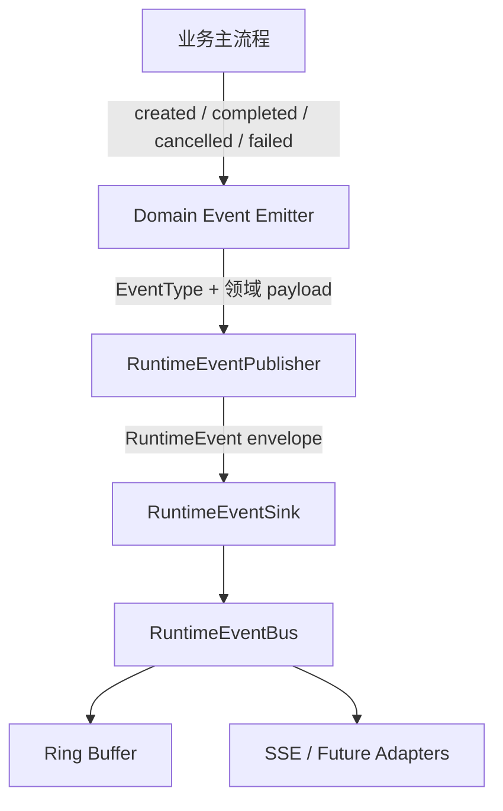

# RuntimeEvent 生产端发布抽象重构

## 1. 文档定位

本文档描述 HiveMemory `RuntimeEvent` 生产端的发布抽象重构方案，重点解决事件构造与发布逻辑侵入业务主流程、不同生产域重复实现 `_emit_*`、payload 缺少类型约束等问题。

> 本文已归档，只保存 RuntimeEvent 生产端抽象的设计演进。当前规范见 [System 可观测性](../../system/observability.md)和[公开路由与事件](../../contracts/routes-and-events.md)，未完成迁移见 [RuntimeEvent 生产端迁移后续](../../todo/runtime-event-producer-migration.md)。

本文档是 [System 可观测性](../../system/observability.md)当前设计之上的历史生产端重构稿。它沿用 v0.4.0 已经落地的 RuntimeEvent 体系，但不把下列“已生效的不变量”与当时尚未实现的 Publisher/Emitter 代码混为一谈：

- `RuntimeEvent` 是稳定的可观测性事实，不驱动业务状态推进。
- `RuntimeEventBus` 是独立的 best-effort 观测总线，不复用功能总线。
- 全系统保留一条顶层扁平 RuntimeEvent 流，不为 Gateway、Patchouli、Alice 分别建立私有观测总线。
- RuntimeEvent transport 断开、禁用或消费缓慢，不得影响业务主流程。
- RuntimeEvent envelope 和 SSE replay 协议保持稳定。

本次重构只调整事件生产端的代码组织和调用 API，不修改 RuntimeEvent 的外部消费语义。

---

## 2. 背景与问题

当前 RuntimeEvent 体系已经可以稳定工作，但生产端通常需要同时完成以下工作：

1. 选择 `RuntimeEventType`。
2. 设置 `status`、`severity`、`reason` 和 `message`。
3. 填充 `generation_id`、`agent_run_id`、`task_id`、`agent_id`、`topic_id` 等关联字段。
4. 从领域对象中提取并组装 `data`。
5. 对复杂值进行摘要或 JSON 安全转换。
6. 调用 `RuntimeEventSink.emit()`。
7. 在部分生产点额外隔离 sink 异常。

这些工作散落在 Chat、Gateway、Alice、Memory Task、Scheduler 和 System Lifecycle 等主流程中，形成了多个职责相近但接口不同的私有方法，例如：

- `ChatApplicationService._emit_chat_event()`
- `GatewayWorkflow._emit()`
- `AgentRunService._emit_agent_event()`
- `MemoryGenerationTaskController._emit_memory_task_event()`
- `GlobalMaintenanceScheduler._emit_task_event()`
- `HiveMemorySystem._emit_lifecycle_event()`

当前实现主要有以下问题。

### 2.1 主流程可读性下降

事件构造通常占据多行，并与状态变更、异常处理和业务分支交错。阅读者需要区分哪些字段影响业务行为，哪些字段只是旁路观测信息。

### 2.2 重复实现 envelope 组装

多个生产域重复设置 task type、关联 ID、默认 severity、状态和 payload。`ScopedRuntimeEventSink` 可以补齐 `subsystem/source/component`，但调用方仍然需要完整构造 `RuntimeEvent`。

### 2.3 payload 契约分散

`RuntimeEvent.data` 是开放的 `dict[str, Any]`。相同事件的数据字段由各调用点手工维护，容易出现字段拼写不一致、序列化不一致和不适合进入观测流的大对象。

### 2.4 best-effort 边界不统一

`RuntimeEventBus.emit()` 已经执行异常隔离，但部分生产点仍然额外使用 `try/except`。生产者无法仅从接口判断 sink 是否一定不会影响业务流程。

### 2.5 已有抽象未形成统一模式

项目中已经存在两个可复用方向：

- `PassiveIngressEventEmitter` 把领域事件投影、脱敏和发布从 Passive Ingress 主流程中分离出来。
- `RuntimeOperationObserver` 封装标准的 started/completed/failed 操作生命周期。

但这两个方向还没有形成全项目一致的生产端分层。

---

## 3. 设计目标

### 3.1 主要目标

1. 业务主流程只表达“发生了什么”，不直接组装 RuntimeEvent envelope。
2. 统一处理 scope、关联上下文、payload 序列化和 best-effort 异常隔离。
3. 按稳定事件族集中管理 EventType、默认状态、severity、payload 投影和隐私规则。
4. 保留事件发生时机的显式性，使取消、fallback、stream close 等复杂控制流仍然清晰可见。
5. 在不改变现有 RuntimeEvent wire format 的前提下渐进迁移。
6. 为关键事件 payload 提供静态类型和运行时校验能力。

### 3.2 非目标

本次重构不包含以下内容：

- 不修改 `RuntimeEvent` 的 SSE JSON envelope。
- 不改变 `RuntimeEventType` 的现有事件名称和语义。
- 不将 RuntimeEvent 迁移到 `GlobalSystemBus` 或子系统功能总线。
- 不建立 Gateway、Patchouli、Alice 私有 RuntimeEventBus。
- 不使用 RuntimeEvent 推进业务状态机。
- 不要求一次性为所有 `data` payload 建立完整模型。
- 不通过装饰器或隐式订阅自动推断所有事件发生时机。

---

## 4. 核心设计决策

### 4.1 使用三层生产端结构

RuntimeEvent 生产端划分为 Domain Event Emitter、RuntimeEventPublisher 和 RuntimeEventSink 三层：



各层职责如下：

| 层 | 核心职责 | 不负责 |
| :--- | :--- | :--- |
| Domain Event Emitter | 领域语义、EventType 选择、领域对象投影、默认状态与 severity、隐私白名单 | transport、sequence、subscriber、业务状态变更 |
| RuntimeEventPublisher | envelope 构造、scope/context 合并、payload 安全转换、best-effort 隔离 | 领域状态机、事件发生时机、业务重试 |
| RuntimeEventSink / Bus | sequence、timestamp、trace context 补齐、buffer、fanout、replay | 领域 payload 推导、业务决策 |

### 4.2 Emitter 按“稳定事件族”划分

不为每个生产类机械地创建 emitter。Emitter 的边界应对应一个具有共同上下文和生命周期的稳定事件族，例如 `chat.run.*`、`gateway.workflow.*`、`memory.task.*`。

Emitter 的推荐粒度不是：

```text
一个 Python 类 -> 一个 Emitter
```

而是：

```text
一个稳定的领域生命周期 / 事件族 -> 一个 Emitter
```

### 4.3 复杂控制流保持显式发布

Chat stream、Gateway workflow 和 Agent stream 包含 cancelled、missing done、fallback、stream closed 等多种终态。这些事件仍由主流程在明确的控制流位置调用 emitter，不通过通用装饰器自动推断。

标准线性操作的 started/completed/failed 可以复用 `RuntimeOperationObserver` 或后续的 lifecycle helper。

### 4.4 保持 transport 和领域语义解耦

Emitter 不直接依赖 `RuntimeEventBus`，只依赖 `RuntimeEventPublisher`。Publisher 只依赖 `RuntimeEventSink`。因此 Recording、Null、Bus 或未来 adapter 都可以在不改变领域 emitter 的情况下替换。

---

## 5. RuntimeEventPublisher 设计

### 5.1 职责

`RuntimeEventPublisher` 是 RuntimeEvent 生产端的统一基础设施入口，负责：

- 创建 `RuntimeEvent`。
- 合并固定 scope 和运行关联上下文。
- 将 Pydantic payload 或 Mapping 转换为 `data`。
- 调用 `safe_runtime_event_value()`。
- 集中保证 best-effort 语义。
- 为 emitter 提供 `scoped()` 和 `bind()` 能力。

Publisher 不负责：

- 根据 EventType 名称猜测 status 或 severity。
- 根据异常类型自动决定业务终态。
- 修改业务对象。
- 产生 sequence 或管理订阅者。

### 5.2 上下文模型

建议引入不可变的关联上下文：

```python
from dataclasses import dataclass
from typing import Literal


TaskType = Literal["foreground", "background"]
Severity = Literal["debug", "info", "warning", "error"]


@dataclass(frozen=True, slots=True)
class RuntimeEventContext:
    task_type: TaskType | None = None
    trace_id: str | None = None
    generation_id: str | None = None
    agent_run_id: str | None = None
    task_id: str | None = None
    agent_id: str | None = None
    frame_id: str | None = None
    topic_id: str | None = None
    atom_id: str | None = None
```

`RuntimeEventContext` 只保存一次 run/task 内稳定或高频复用的关联字段。`status`、`reason`、`message` 和 `data` 属于单个事件，不进入 context。

### 5.3 Publisher API 草案

```python
from collections.abc import Mapping
from pydantic import BaseModel


RuntimeEventData = BaseModel | Mapping[str, object]


class RuntimeEventPublisher:
    def __init__(
        self,
        sink: RuntimeEventSink,
        *,
        subsystem: str | None = None,
        source: str | None = None,
        component: str | None = None,
        context: RuntimeEventContext | None = None,
    ) -> None:
        ...

    def scoped(
        self,
        *,
        subsystem: str | None = None,
        source: str | None = None,
        component: str | None = None,
    ) -> "RuntimeEventPublisher":
        """返回合并固定来源元数据的 publisher。"""
        ...

    def bind(self, **context: object) -> "RuntimeEventPublisher":
        """返回绑定 run/task/topic 关联字段的轻量 publisher。"""
        ...

    def emit(
        self,
        event_type: RuntimeEventType,
        *,
        status: str | None = None,
        severity: Severity = "info",
        reason: str | None = None,
        message: str | None = None,
        data: RuntimeEventData | None = None,
    ) -> None:
        """构造并 best-effort 发布一个 RuntimeEvent。"""
        ...
```

### 5.4 `scoped()` 与 `bind()` 的区别

`scoped()` 表示组件级固定元数据，通常在装配或组件初始化阶段调用：

```python
gateway_publisher = root_publisher.scoped(
    subsystem="gateway",
    component="workflow",
)
```

`bind()` 表示一次运行或任务的关联上下文，通常在业务入口调用：

```python
run_publisher = gateway_publisher.bind(
    task_type="foreground",
    generation_id=generation_id,
    agent_id=agent_id,
    topic_id=topic_id,
)
```

两者都返回轻量不可变副本，避免不同并发运行之间共享可变上下文。

### 5.5 best-effort 契约

`RuntimeEventPublisher.emit()` 必须保证：

- sink 抛出的异常不会传播到业务调用方。
- payload 转换失败不会影响业务流程。
- 发布失败可以写入普通 warning log，但不得递归发布新的 RuntimeEvent。
- `NullRuntimeEventSink` 下无需业务分支。

`RuntimeEventBus.emit()` 可以保留现有内部异常隔离，形成防御性双边界；生产域不再自行编写发布用 `try/except`。

---

## 6. Domain Event Emitter 设计

### 6.1 Emitter 的职责

每个领域 emitter 负责：

1. 暴露语义化方法，例如 `created()`、`completed()`、`cancelled()` 和 `failed()`。
2. 选择正确的 `RuntimeEventType`。
3. 设置领域默认 `status`、`severity`、`reason` 和 `message`。
4. 从领域对象提取关联 ID 和 payload。
5. 实施 payload 白名单、摘要和隐私规则。
6. 将数据交给 `RuntimeEventPublisher`。

Emitter 不负责：

- 改变 run/task 的业务状态。
- 决定业务操作是否成功。
- 捕获异常并吞掉业务失败。
- 启动任务、重试任务或发送取消信号。
- 通过 RuntimeEvent 驱动其他业务组件。

### 6.2 推荐的 emitter 划分

| Event Emitter | 覆盖事件族 | 决策 |
| :--- | :--- | :--- |
| `PassiveIngressEventEmitter` | `passive.*` | 保留并迁移到底层 publisher |
| `ChatRunEventEmitter` | `chat.run.*`、必要的 command runtime event | 新增 |
| `GatewayWorkflowEventEmitter` | `gateway.workflow.*`、`gateway.step.*`、gateway capability | 新增 |
| `AgentRunEventEmitter` | `agent.run.*` | 新增 |
| `MemoryTaskEventEmitter` | `memory.task.*` | 新增 |
| `SystemLifecycleEventEmitter` | `system.*` | 新增 |
| `MaintenanceTaskEventEmitter` | `maintenance.task.*` | 视 payload 复杂度选择新建或复用 operation observer |
| 独立 Query Analysis emitter | 单个 capability event | 不新建，归入 Gateway emitter |
| Event stream gap emitter | `event.stream.gap` | 不新建，继续由 RuntimeEventBus 内部产生 |
| Subsystem operation emitter | `subsystem.operation.*` | 继续使用 `RuntimeOperationObserver` |

### 6.3 建立 emitter 的判断标准

一个事件族满足以下任意两至三项时，应建立领域 emitter：

- 包含多个相关事件。
- 多个事件共享 generation/task/agent/topic 等上下文。
- 多处需要从同一个领域对象提取字段。
- 存在固定的 status、severity 或 reason 映射。
- 存在脱敏、摘要或 payload 白名单要求。
- 生命周期会继续扩展。
- 同一事件可能由多个生产点发布。

只有一个简单生产点、没有共享上下文和隐私规则的事件，可以直接使用基础 publisher，避免产生只有一个薄方法的小类。

### 6.4 示例：ChatRunEventEmitter

```python
class ChatRunEventEmitter:
    def __init__(self, publisher: RuntimeEventPublisher) -> None:
        self._publisher = publisher

    def for_run(
        self,
        run: ChatGenerationRun,
        *,
        trace_id: str | None = None,
        agent_id: str | None = None,
    ) -> "BoundChatRunEvents":
        publisher = self._publisher.bind(
            task_type="foreground",
            trace_id=trace_id,
            generation_id=run.generation_id,
            agent_id=agent_id,
        )
        return BoundChatRunEvents(publisher, run)


class BoundChatRunEvents:
    def __init__(
        self,
        publisher: RuntimeEventPublisher,
        run: ChatGenerationRun,
    ) -> None:
        self._publisher = publisher
        self._run = run

    def created(self) -> None:
        self._emit(RuntimeEventType.CHAT_RUN_CREATED)

    def completed(
        self,
        *,
        topic_id: str | None = None,
        memory_task_ids: list[str] | None = None,
    ) -> None:
        self._emit(
            RuntimeEventType.CHAT_RUN_COMPLETED,
            topic_id=topic_id,
            data=ChatRunCompletedData(
                memory_task_ids=memory_task_ids or [],
            ),
        )

    def cancelled(
        self,
        *,
        topic_id: str | None = None,
        message: str | None = None,
    ) -> None:
        self._emit(
            RuntimeEventType.CHAT_RUN_CANCELLED,
            topic_id=topic_id,
            message=message,
        )

    def failed(
        self,
        *,
        topic_id: str | None = None,
        message: str | None = None,
    ) -> None:
        self._emit(
            RuntimeEventType.CHAT_RUN_FAILED,
            topic_id=topic_id,
            severity="error",
            message=message,
        )
```

`BoundChatRunEvents` 绑定一次运行中稳定的 `generation_id`、`trace_id` 和 `agent_id`，后续调用不再重复传入。它不保存或修改 chat run 的生命周期状态，只读取最新状态用于事件投影。

### 6.5 业务调用前后对比

重构前：

```python
run.status = ChatGenerationRunStatus.COMPLETED
self._emit_chat_event(
    RuntimeEventType.CHAT_RUN_COMPLETED,
    run,
    trace_id=trace_id,
    agent_id=agent_id,
    topic_id=prepared.topic_id,
    data={"memory_task_ids": memory_task_ids},
)
```

重构后：

```python
run.status = ChatGenerationRunStatus.COMPLETED
run_events.completed(
    topic_id=prepared.topic_id,
    memory_task_ids=memory_task_ids,
)
```

状态变更仍然显式存在于业务代码中，事件组装细节被收敛到 emitter。

---

## 7. 生命周期操作抽象

### 7.1 适用场景

`RuntimeOperationObserver` 适用于只有以下标准状态的线性操作：

```text
started -> completed
started -> failed
```

典型场景包括：

- Maintenance scheduler task
- Subsystem maintenance operation
- 无多终态分支的后台能力调用

### 7.2 不适用场景

以下场景不应仅依赖通用 context manager 或装饰器：

- Chat stream 提前关闭
- 用户主动取消
- Agent stream 缺少 done 终态
- Gateway fallback
- 部分步骤完成后失败
- 异常被转换为业务降级结果

这些场景应使用领域 emitter，在明确的分支位置发布 `cancelled`、`failed` 或其他事件。

### 7.3 演进建议

保留 `RuntimeOperationObserver`，使其底层改用 `RuntimeEventPublisher`，从而复用 scope、payload 安全转换和 best-effort 边界。暂不引入覆盖所有事件族的通用装饰器。

---

## 8. Payload 类型与兼容性

### 8.1 外部 envelope 保持不变

`RuntimeEvent.data` 在外部协议中继续表现为 JSON object：

```python
class RuntimeEvent(BaseModel):
    ...
    data: dict[str, Any] = Field(default_factory=dict)
```

本次重构只在生产端允许 emitter 使用 Pydantic payload model，最终仍由 publisher 转换为 dict。

### 8.2 优先建模的 payload

不要求一次性为所有事件建立模型。优先覆盖：

1. Chat run 终态事件。
2. Gateway workflow 和 step 事件。
3. Memory task 状态事件。
4. Passive ingress 事件。
5. System lifecycle 事件。

简单且稳定的事件可以暂时使用 `Mapping[str, object]`。

### 8.3 示例

```python
class GatewayStepCompletedData(BaseModel):
    step_id: str
    step_index: int
    duration_ms: float
    is_fallback: bool = False
    fallback_reason: str | None = None
    flow_ended: bool = False
```

使用显式 payload 类型可以获得：

- 字段拼写和类型检查。
- IDE 补全。
- 集中的默认值和兼容性规则。
- 清晰的 payload 白名单。
- 对敏感字段进入 RuntimeEvent 的审计入口。

### 8.4 Payload 约束

所有 emitter 必须遵循以下规则：

- 不发送 prompt 全文、外部消息全文、完整 memory context 或 tool args。
- 不发送不可控体积的大型对象。
- 不发送完整异常栈；异常栈进入普通日志。
- ID、计数、状态、耗时、布尔标记和小型摘要可以进入 payload。
- 非 JSON 友好值由 publisher 统一通过 `safe_runtime_event_value()` 降级。

---

## 9. 依赖注入与对象所有权

### 9.1 装配层职责

`SystemAssembler` 继续拥有：

- `RuntimeEventBus`
- enabled/disabled 配置
- `NullRuntimeEventSink`
- root publisher 或 root sink
- 顶层 subsystem scope

装配层不直接创建并注入所有领域 emitter，避免了解各子系统内部事件族。

### 9.2 推荐装配方式

```python
root_publisher = RuntimeEventPublisher(runtime_event_sink)

gateway = GatewaySystem(
    event_publisher=root_publisher.scoped(subsystem="gateway"),
)

patchouli = PatchouliSystem(
    event_publisher=root_publisher.scoped(subsystem="patchouli"),
)

alice = AliceSystem(
    event_publisher=root_publisher.scoped(subsystem="alice"),
)
```

子系统内部创建领域 emitter：

```python
self._workflow_events = GatewayWorkflowEventEmitter(
    event_publisher.scoped(component="workflow")
)
```

### 9.3 渐进迁移兼容

为降低一次性改造范围，可以先保留现有构造器的 `RuntimeEventSink` 参数，由组件内部创建 publisher：

```python
publisher = RuntimeEventPublisher(
    runtime_events.scoped("gateway", component="workflow")
)
```

当主要生产域完成迁移后，再统一把跨层依赖类型调整为 `RuntimeEventPublisher`。

---

## 10. 推荐代码布局

建议将通用基础设施放在 `system/runtime`，领域 emitter 与领域代码就近放置：

```text
src/hivememory/
  system/runtime/
    events.py                 # Sink、Bus、Subscription、ScopedSink
    publisher.py              # RuntimeEventPublisher、RuntimeEventContext
    operations.py             # RuntimeOperationObserver

  system/application/
    chat_events.py            # ChatRunEventEmitter、payload models
    passive/events.py         # PassiveIngressEventEmitter

  gateway/runtime/
    events.py                 # GatewayWorkflowEventEmitter、payload models

  alice/runtime/
    runtime_events.py         # AgentRunEventEmitter、payload models

  patchouli/runtime/
    events.py                 # MemoryTaskEventEmitter、payload models
```

如果单个领域的 payload 模型持续增加，可以再拆为 `events.py` 和 `event_payloads.py`。首期不提前拆分空模块。

---

## 11. 迁移计划

### Phase 1：建立统一 Publisher

1. 新增 `RuntimeEventContext`、`Severity` 和 `RuntimeEventPublisher`。
2. 实现 `scoped()`、`bind()` 和 `emit()`。
3. 集中 payload 转换和 best-effort 异常隔离。
4. 保持 `RuntimeEventSink`、`RuntimeEventBus` 和 SSE contract 不变。
5. 为 publisher 增加独立单元测试。

### Phase 2：验证现有 Emitter 模式

1. 将 `PassiveIngressEventEmitter` 底层迁移到 publisher。
2. 保持 Passive Ingress 的事件内容和脱敏规则不变。
3. 使用现有 passive runtime event 测试验证 wire compatibility。

### Phase 3：迁移高收益主流程

按以下顺序迁移：

1. `ChatRunEventEmitter`
2. `GatewayWorkflowEventEmitter`
3. `AgentRunEventEmitter`

这些模块的事件发布与复杂控制流交错最多，优先迁移能够直接改善主逻辑可读性。

### Phase 4：迁移任务与系统生命周期

1. `MemoryTaskEventEmitter`
2. `SystemLifecycleEventEmitter`
3. Scheduler 改用 publisher-backed `RuntimeOperationObserver` 或 `MaintenanceTaskEventEmitter`

### Phase 5：Payload 类型化与清理

1. 为高价值事件补充 Pydantic payload models。
2. 删除重复的 `_emit_*` 私有包装。
3. 删除生产点重复的发布异常隔离代码。
4. 消除 severity 相关 `type: ignore`。
5. 审计所有直接 `RuntimeEvent(...)` 的生产点，只保留 Bus 内部事件等基础设施场景。

### 当前实施进度（2026-08-03）

- Phase 1 的 `RuntimeEventPublisher`、`RuntimeEventContext`、`scoped()/bind()/emit()`、payload 安全转换和 best-effort 单元测试已经落地；SystemAssembler 已创建唯一 root publisher。
- Phase 3 中 Alice `agent.run.*` 的迁移已经落地：`AgentRunEventEmitter` 位于 `alice/runtime/runtime_events.py`，AgentRunService 只保留 `started/completed/cancelled/failed` 语义调用，并补齐 `generation_id`。
- Chat、Gateway、Memory Task、Scheduler、System Lifecycle 与 Passive Ingress 尚未按本计划完成迁移；计划总体状态仍为 `planned`，不能因 Alice 接入而标记完成。
- Alice 的 token/MTP/CALL/`done` 交互输出已经与 RuntimeEvent 明确分流：前者由 `FrameOutputSink -> AgentRunOutput -> AgentRunStreamAdapter` 承载，后者继续进入全局 RuntimeEventBus。两条通道不自动桥接，RuntimeEvent 不驱动 Agent run 业务状态。

---

## 12. 测试策略

### 12.1 Publisher 单元测试

覆盖：

- scope 合并优先级。
- bind context 合并优先级。
- 显式事件字段覆盖默认 context。
- Pydantic payload 转换。
- Mapping payload 转换。
- 非 JSON 值安全降级。
- sink 抛出异常时 publisher 不向业务调用方抛出。
- `NullRuntimeEventSink` 下无副作用。

### 12.2 Emitter 契约测试

每个 emitter 使用 `RecordingRuntimeEventSink` 验证：

- 语义方法映射到正确的 `RuntimeEventType`。
- 默认 status 和 severity 正确。
- 关联 ID 正确。
- payload 字段和默认值正确。
- 敏感数据不会进入 event。
- 同一领域不同调用点产生一致结构。

### 12.3 回归测试

现有 RuntimeEvent 测试继续作为 wire compatibility 基线，重点确保：

- 事件顺序不变。
- event type 不变。
- 关键 payload 字段不变。
- SSE replay 和 gap 行为不变。
- transport disabled 不影响业务流程。
- chat/agent/memory task 的取消与失败路径不变。

### 12.4 失败注入测试

提供一个始终抛出异常的 sink：

```python
class FailingRuntimeEventSink:
    def emit(self, event: RuntimeEvent) -> None:
        raise RuntimeError("injected sink failure")
```

使用该 sink 验证 Chat、Gateway、Memory Task 和 Scheduler 的核心业务路径不会因为观测失败而改变结果。

---

## 13. 验收标准

重构完成后应满足：

1. 业务主流程不再直接构造 `RuntimeEvent`，基础设施内部场景除外。
2. Chat、Gateway、Agent、Memory Task、Passive Ingress 和 System Lifecycle 使用领域 emitter。
3. 标准 subsystem operation 使用 publisher-backed `RuntimeOperationObserver`。
4. 生产点不再重复实现发布用 `try/except`。
5. RuntimeEvent wire format、event type、SSE endpoint 和 replay 行为不变。
6. 关键 payload 具有类型定义或集中投影函数。
7. emitter 不修改业务状态，不驱动功能流程。
8. sink 故障不会改变业务结果。
9. 现有 runtime event 测试全部通过。
10. 主流程中的典型发布调用收敛为一至三行语义代码。

典型目标调用形式：

```python
run_events.created()
run_events.completed(memory_task_ids=memory_task_ids)
run_events.cancelled(reason=run.cancel_reason)
task_events.failed(task, reason=type(exc).__name__)
```

---

## 14. 未采用方案

### 14.1 只增加 RuntimeEvent Builder

Builder 只能缩短构造语法，无法集中领域 payload 投影、默认 severity、隐私规则和关联上下文，因此不足以解决主流程可读性问题。

### 14.2 单一全局 RuntimeEventEmitter

一个包含所有 `chat_*`、`gateway_*`、`agent_*`、`memory_*` 方法的全局 emitter 会形成新的 God Object，使子系统互相可见并扩大依赖面。因此 emitter 必须按稳定事件族拆分。

### 14.3 每个生产类一个 Emitter

机械地为每个生产类创建 emitter 会产生大量只有一个方法的薄类，增加文件、构造器参数和测试成本。只有具备共享上下文、生命周期或投影规则的事件族才建立 emitter。

### 14.4 使用 RuntimeEvent 驱动业务状态

RuntimeEvent 是 best-effort 旁路观测事实，可能被丢弃或禁用，不能作为业务功能协议。功能协作继续使用 Global/System/Subsystem bus 或显式调用。

### 14.5 对所有事件使用装饰器自动发布

装饰器难以表达 cancelled、fallback、partial completion、stream closed 和 missing terminal event，会隐藏事件与控制流的因果位置。仅标准线性 operation 可以使用统一生命周期包装。

### 14.6 一次性强类型化所有 payload

一次性为全部事件建立模型会扩大重构范围并引入无必要的迁移风险。采用高价值事件优先、Mapping 兼容过渡的方式更适合当前项目。

---

## 15. 最终决策摘要

本设计采用以下最终方向：

- 保留现有 RuntimeEvent contract、RuntimeEventBus 和顶层扁平事件流。
- 新增 `RuntimeEventPublisher`，统一 envelope 构造、scope/context、payload 转换和 best-effort 边界。
- 按稳定事件族建立领域 emitter，而不是为每个生产类建立 emitter。
- 业务代码显式决定事件发生时机，emitter 只负责领域事件投影。
- 标准 started/completed/failed 操作复用 `RuntimeOperationObserver`。
- 关键 payload 渐进迁移到 Pydantic model，外部仍保持 `data` JSON object。
- 以 Passive Ingress 的现有 emitter 作为首个迁移样板，再依次迁移 Chat、Gateway、Agent、Memory Task 和 System Lifecycle。

目标不是完全隐藏事件发布，而是让业务主流程只留下可读、可审计的领域语义：

```python
run_events.completed(memory_task_ids=memory_task_ids)
```

事件 envelope、来源元数据、关联上下文、payload 安全和 transport 容错由下层统一承担。
