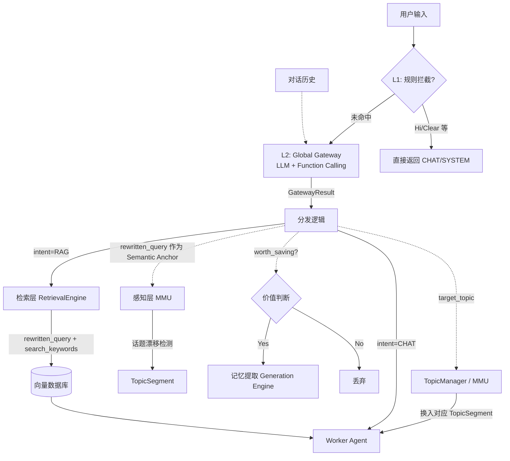

# 4 核心功能 I：全局智能网关 (Global Intelligent Gateway)

> **[归属分身：真理之眼 (The Eye)]**

本章定义了系统的统一入口与中枢神经。为了解决下游模块各自调用外部服务导致的"重复计算"与"延迟过高"的问题，我们引入了 **Global Gateway** 模块，实现了 **"一次计算，多处复用" (Compute Once, Use Everywhere)** 的设计理念。

## 4.0 模块概览

```
src/hivememory/engines/gateway/
├── engine.py            # GatewayEngine — 纯数据操作层，协调 L1/L2
├── interceptors.py      # RuleInterceptor / NoOpInterceptor — L1 规则拦截器
├── semantic_analyzer.py # LLMAnalyzer / NoOpSemanticAnalyzer — L2 语义分析器
├── observer_buffer.py   # ObserverSessionBuffer / ObserverBufferManager — 被动模式缓冲器
├── prompts.py           # 系统提示词模板（标准/简化/调度器/英文变体）
├── models.py            # GatewayResult / GatewayIntent / SemanticAnalysisResult 等数据模型
└── interfaces.py        # BaseInterceptor / BaseSemanticAnalyzer 抽象接口
```

Gateway 是整个系统的第一道关卡，所有用户输入必须经过它的处理才能流向下游。它的核心产出 `GatewayResult` 是一个结构化的指令包，同时驱动检索层、感知层和生成层三个下游模块。

***

## 4.1 核心设计理念

### 4.1.1 痛点解决

旧架构中，对用户 Query 的处理逻辑分散在多个独立环节，存在三个核心痛点：

1. **检索前**：Router 判断是否检索 + QueryRewriter 进行重写 → **两次 LLM 调用，高延迟**
2. **生成前**：Extractor 内部或前置 Gating 判断记忆价值 → **重复计算，浪费 Token**
3. **感知层**：使用 Raw Query 进行话题连续性检测 → **指代不明导致准确度低**

Gateway 将这些前置计算统一收口，通过单次 LLM 调用同时产出意图、重写 Query、检索关键词和记忆价值判定，显著降低 Token 消耗与响应延迟。

### 4.1.2 漏斗式架构 (The Funnel Architecture)

Gateway 采用两级串行处理机制，形如漏斗：

```
用户输入
    │
    ▼
┌─────────────────────────────────┐
│  L1: 规则拦截器 (The Fast Pass)  │  ← 正则/字符串匹配，零延迟
│  命中 → 直接返回 SYSTEM/CHAT     │
└────────────────┬────────────────┘
                 │ 未命中
                 ▼
┌─────────────────────────────────┐
│  L2: 语义分析核心 (Semantic Core)│  ← LLM + Function Calling
│  输出 → GatewayResult           │
└─────────────────────────────────┘
```

1. **L1: 规则拦截器 (The Fast Pass)**
   - **机制**：基于正则和字符串匹配，预编译正则表达式。
   - **职责**：零延迟拦截 `/clear` 等系统指令及极短的无效文本（如"你好"），防止无意义的 LLM 调用。
   - **预期效果**：可拦截约 20-30% 的无效 LLM 调用。

2. **L2: 语义分析核心 (The Semantic Core)**
   - **机制**：调用高响应速度的通用 LLM（如 GPT-4o-mini / DeepSeek-V3），使用 **Function Calling** 强制结构化输出。
   - **职责**：在一个 Prompt 中同时完成 **意图分类**、**指代消解**、**关键词提取** 与 **记忆价值判断**。

### 4.1.3 乐观检索策略 (Optimistic Retrieval)

当前版本采用乐观检索策略：**不再由 Gateway 生成 `target_filters` 过滤条件**，而是将过滤逻辑下放给 `RetrievalFamiliar` 根据 `user_id` 动态创建。这简化了 Gateway 的职责边界，并将意图分类统一为 `RAG`（即使是 CHAT 类查询也默认尝试检索）。

***

## 4.2 统一输出协议 (Unified Output Protocol)

Gateway 的核心产出是 `GatewayResult`，一个结构化的指令包，驱动所有下游模块：

```python
class GatewayResult(BaseModel):
    # 核心输出
    intent: GatewayIntent          # RAG | CHAT | SYSTEM（乐观策略下默认 RAG）
    rewritten_query: str           # 指代消解后的完整、独立查询
    search_keywords: List[str]     # 用于稀疏检索/BM25 的关键词数组
    worth_saving: bool             # 是否值得保存为长期记忆
    reason: str                    # 判断理由（用于调试与可观测）

    # 元信息
    processing_time_ms: float      # 处理耗时（由 TheEye 填充）
    gateway_parse_failed: bool     # 解析失败标记
    l1_result: Optional[InterceptorResult]  # L1 拦截结果

    # MMU 话题路由 (Phase 4.5)
    target_topic: str              # 路由目标话题 ID 或 "NEW_TOPIC"
```

### 意图枚举

| 意图 | 含义 | 触发方式 |
| :--- | :--- | :--- |
| `RAG` | 需要检索历史记忆 | L2 分析结果（乐观策略下为默认） |
| `CHAT` | 闲聊，无需检索 | L1 拦截简单寒暄 |
| `SYSTEM` | 系统指令 | L1 拦截 `/clear`、`/reset` 等 |

### 回退策略 (Fallback)

当 L2 分析失败时，`GatewayResult.fallback()` 提供保守回退，避免格式风险扩散到下游模块：

| 字段 | 回退值 | 说明 |
| :--- | :--- | :--- |
| `intent` | `RAG` | 保守策略，默认尝试检索 |
| `rewritten_query` | 原始 query | 透传，不做任何处理 |
| `search_keywords` | `[]` | 空数组，由检索层自行处理 |
| `worth_saving` | `False` | 保守策略，不触发昂贵的提取流程 |
| `gateway_parse_failed` | `True` | 标记失败，供下游可观测 |

***

## 4.3 数据流转与复用

Gateway 的输出被下游模块充分复用，实现"一次计算，多处复用"：

```
GatewayResult
    ├── rewritten_query + search_keywords
    │       └──→ RetrievalEngine (Hot Path)
    │               直接用于混合检索，无需再次调用重写模型
    │
    ├── rewritten_query (作为 Semantic Anchor)
    │       └──→ Perception Layer (Cold Path)
    │               用于话题漂移检测，解决原始 Query 指代不明的问题
    │
    ├── worth_saving
    │       └──→ Generation Layer (Cold Path)
    │               决定是否启动昂贵的 LLM 提取流程
    │
    └── target_topic
            └──→ TopicManager / MMU (Phase 4.5)
                    决定将哪个 TopicSegment 换入内核工作区
```

***

## 4.4 L1 规则拦截器

`RuleInterceptor` 是 L1 的具体实现，维护两组预编译正则规则：

### 系统指令模式

```python
SYSTEM_PATTERNS = [
    r"^/clear$",
    r"^/reset$",
    r"^/start$",
    r"^/help$",
    r"^/restart$",
]
```

命中后返回 `intent=SYSTEM`，`worth_saving=False`。

### 无效闲聊模式

```python
CHAT_PATTERNS = [
    r"^(你好|hi|hello|hey|嗨|哈喽)[\s\!\?。\?\！]*$",  # 问候
    r"^(谢谢|thanks|thank you|感谢)[\s\!\?。\?\！]*$",  # 感谢
    r"^(再见|bye|goodbye|拜拜|88)[\s\!\?。\?\！]*$",    # 再见
    r"^(好的|ok|okay|o?k)[\s\!\?。\?\！]*$",            # 确认
    r"^(是|是的|对|yes|yeah)[\s\!\?。\?\！]*$",
    r"^(不|不是|no|nope)[\s\!\?。\?\！]*$",
    r"^.{0,2}$",                                         # 极短文本
]
```

命中后返回 `intent=CHAT`，`worth_saving=False`。

支持通过 `add_chat_pattern()` / `add_system_pattern()` 动态扩展规则。当配置 `enabled=False` 时，自动降级为 `NoOpInterceptor`（总是返回 `None`，放行所有请求）。

***

## 4.5 L2 语义分析器

`LLMAnalyzer` 是 L2 的具体实现，通过 **Function Calling** 强制 LLM 输出结构化 JSON，避免自由文本解析的不稳定性。

### Function Calling Schema

```python
GATEWAY_FUNCTION_SCHEMA = {
    "name": "analyze_user_query",
    "parameters": {
        "target_topic":      str,   # 活跃话题 ID 或 "NEW_TOPIC"
        "rewritten_query":   str,   # 指代消解后的完整查询
        "search_keywords":   list,  # 3-5 个稀疏检索关键词
        "worth_saving":      bool,  # 是否值得保存为长期记忆
        "reason":            str,   # 判断理由
    }
}
```

### 处理流程

```python
def analyze(query, active_topics_menu=None):
    # 1. 选择 Prompt 变体
    if active_topics_menu:
        system_prompt = DISPATCHER_PROMPT  # Agentic Dispatcher 模式
    else:
        system_prompt = STANDARD_PROMPT    # 标准分析模式

    # 2. 构建消息
    messages = [system, user_query]

    # 3. 调用 LLM with Function Calling
    response = await llm_service.acomplete_with_tools(
        messages, tools=[GATEWAY_FUNCTION_SCHEMA],
        tool_choice={"type": "function", "function": {"name": "analyze_user_query"}}
    )

    # 4. 解析 tool_calls 结果 → SemanticAnalysisResult
```

### Prompt 变体

| 变体 | 触发条件 | 用途 |
| :--- | :--- | :--- |
| `default` (中文) | 无活跃话题菜单 | 标准指代消解 + 元数据提取 |
| `simple` (中文) | 低延迟场景 | 精简版，减少 Token 消耗 |
| `dispatcher` (中文) | 有活跃话题菜单 | Agentic Dispatcher 模式，含话题路由 |
| `default` (英文) | `language="en"` | 英文环境 |
| `dispatcher` (英文) | `language="en"` + 话题菜单 | 英文 Dispatcher 模式 |

当配置 `enabled=False` 时，自动降级为 `NoOpSemanticAnalyzer`（返回原始 query，`worth_saving=False`，`intent=RAG`）。

***

## 4.6 Agentic Dispatcher 模式 (Phase 4.5)

随着 STM 重构引入多话题并发管理（MMU），Gateway 从单纯的"文本重写器"升级为**拥有全局视野的进程调度员**。

### 核心流程

当 `active_topics_menu` 不为空时，L2 分析器自动切换到 Dispatcher 模式：

```
用户输入 + 活跃话题菜单
         │
         ▼
┌─────────────────────────────────────────────────────┐
│  Agentic Dispatcher Prompt                          │
│                                                     │
│  【当前活跃任务列表】                                │
│  T_01: 编写贪吃蛇游戏                               │
│  T_02: 晚餐食谱规划                                 │
│                                                     │
│  【用户输入】"把它调快点"                            │
│                                                     │
│  → target_topic: "T_01"                             │
│  → rewritten_query: "把贪吃蛇游戏的移动速度调快点"  │
└─────────────────────────────────────────────────────┘
```

### 经典路由场景

| 场景 | 用户输入 | The Eye 决策 | 输出 |
| :--- | :--- | :--- | :--- |
| **连续强指代** | "把它调快点"（当前在 T_01 贪吃蛇） | 命中 T_01 | `rewritten_query`: "把贪吃蛇游戏的移动速度调快点" |
| **跨话题跳跃** | "看看训练情况"（当前在 T_02，但有 T_01 训练任务） | 跨越当前上下文，命中 T_01 | `rewritten_query`: "看看 LoRA 脚本的训练情况" |
| **开拓新话题** | "今天天气怎么样" | 无匹配 | `target_topic`: "NEW_TOPIC" |

***

## 4.7 被动观察模式 (Passive Observer Mode)

除了主动驱动模式（AIOS 引擎），Gateway 还支持**被动观察模式**，用于接入不受 PatchouliKernel 控制的外部系统（如独立的 Discord Bot、微信机器人或传统 Agent 框架）。

### 双模态架构

| 形态 | 名称 | 流程 | 适用场景 |
| :--- | :--- | :--- | :--- |
| **形态 A** | AIOS 引擎 (Active Kernel Mode) | Kernel 主动调用 LLM，通过 MTP 协议控制生成流 | 基于 HiveMemory 原生构建的 Worker Agent |
| **形态 B** | 记忆中间件 (Passive Observer Mode) | 外部系统接管 LLM 生成，Gateway 仅作旁路监听者 | 接入已有的外部 Chatbot 或传统 Agent 系统 |

### ObserverSessionBuffer 状态机

`ObserverSessionBuffer` 负责将外部系统碎片化的离散消息拼接为完整的 `InteractionPayload`：

```
IDLE ──(accept_user)──→ AWAITING_RESPONSE ──(accept_assistant)──→ SEALED
  ↑                                                                    │
  └──────────────────────────(flush)──────────────────────────────────┘
```

| 状态 | 含义 |
| :--- | :--- |
| `IDLE` | 空闲，等待 user 消息 |
| `AWAITING_RESPONSE` | 已收到 user，等待 assistant |
| `SEALED` | user + assistant 配对完成，待 flush |

### 三种 Flush 触发器

1. **Next User Turn（新用户消息打断）**：收到同一 Session 的下一条 `role: "user"` 消息时，自动 flush 上一轮数据，并将新消息作为新一轮的开头。这是最常见的触发方式。

2. **Idle Timeout（闲置超时）**：收到 Assistant 消息后，若超过 T 秒无新消息，由外部调度器调用 `flush_idle_buffers(timeout_seconds)` 触发。

3. **Explicit EOF（显式结束符）**：外部系统主动调用 `flush()`，实现零延迟打包。

### 构建 Payload

触发 flush 时，`ObserverSessionBuffer._build_payload()` 组装 `InteractionPayload`：

```python
InteractionPayload(
    user_message=self._user_content,
    assistant_message="\n".join(self._assistant_parts),
    mtp_traces=[],          # 被动模式无 MTP 协议指令
    write_focus=None,       # 被动模式无主动写入
    update_focus=None,
    identity=self._identity,
    rewritten_query=gaze_result.rewritten_query if gaze_result else None,
    worth_saving=gaze_result.worth_saving if gaze_result else None,
)
```

### ObserverBufferManager

`ObserverBufferManager` 按 `Identity.buffer_key` 管理多个 `ObserverSessionBuffer`，使用 `threading.RLock` 保证线程安全：

```python
manager = ObserverBufferManager()
buf = manager.get_buffer(identity)          # 获取或创建 buffer
payloads = manager.flush_idle_buffers(30)   # 扫描并 flush 超时 buffer
```

### 检索降级策略

在被动模式下，外部 Agent 不懂 MTP 协议，无法使用 `⟪ READ ⟫` 获取记忆详情。因此检索层必须支持策略降级：

| 模式 | 渲染器 | 行为 |
| :--- | :--- | :--- |
| `active` | `CompactContextRenderer` | 仅注入 Title + Alias 菜单，引导 Agent 使用 MTP 查阅 |
| `passive` | `FullContextRenderer` | 直接将 Top-K 的完整 Payload 文本拼接，强制 `max_tokens=2000` 截断 |

***

## 4.8 数据模型参考

### GatewayResult

| 字段 | 类型 | 说明 |
| :--- | :--- | :--- |
| `intent` | `GatewayIntent` | 意图分类（RAG/CHAT/SYSTEM） |
| `rewritten_query` | `str` | 指代消解后的完整查询 |
| `search_keywords` | `List[str]` | 稀疏检索关键词（3-5 个） |
| `worth_saving` | `bool` | 是否值得保存为长期记忆 |
| `reason` | `str` | 判断理由（调试用） |
| `processing_time_ms` | `float` | 处理耗时（由 TheEye 填充） |
| `gateway_parse_failed` | `bool` | 解析失败标记 |
| `l1_result` | `Optional[InterceptorResult]` | L1 拦截结果 |
| `target_topic` | `str` | 路由目标话题 ID 或 `"NEW_TOPIC"` |

### SemanticAnalysisResult

L2 分析器的原始输出，字段与 `GatewayResult` 基本一致，额外包含 `model: Optional[str]`（使用的 LLM 模型名）。由 `GatewayEngine` 负责将其转换为 `GatewayResult`。

***

## 4.9 配置参考

Gateway 相关配置分布在 `LLMAnalyzerConfig` 与 `RuleInterceptorConfig` 中：

### LLMAnalyzerConfig

| 配置项 | 类型 | 默认值 | 说明 |
| :--- | :--- | :--- | :--- |
| `enabled` | `bool` | `True` | 是否启用 L2 语义分析（禁用时降级为 NoOp） |
| `prompt_variant` | `str` | `"default"` | Prompt 变体（`default`/`simple`/`dispatcher`） |
| `prompt_language` | `str` | `"zh"` | Prompt 语言（`zh`/`en`） |

### RuleInterceptorConfig

| 配置项 | 类型 | 默认值 | 说明 |
| :--- | :--- | :--- | :--- |
| `enabled` | `bool` | `True` | 是否启用 L1 规则拦截（禁用时降级为 NoOp） |
| `enable_system` | `bool` | `True` | 是否启用系统指令拦截 |
| `enable_chat` | `bool` | `True` | 是否启用闲聊拦截 |
| `custom_system_patterns` | `List[str]` | `None` | 自定义系统指令正则（覆盖默认列表） |
| `custom_chat_patterns` | `List[str]` | `None` | 自定义闲聊正则（覆盖默认列表） |

***

## 4.10 架构图示


