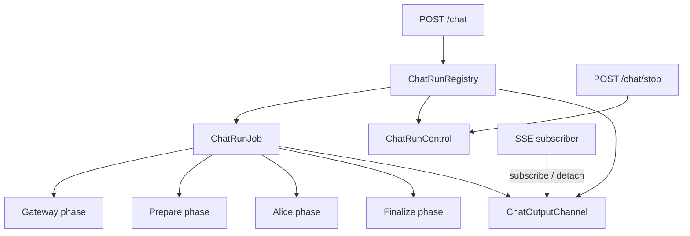

# Chat Run 取消与生命周期后续设计

## 1. 文档定位

本文档保存从取消重构中拆出的后续候选设计。它不是当前实施依据，也不是
[已归档的 Chat Run 取消重构最小闭环](../archive/plans/chat-run-cancellation-unified.md) 的前置依赖。

最小闭环已完成。只有在产品需求、运行指标或真实故障证明有必要时，才按本文各节的
独立启用条件立项。不得以“架构最终会需要”为理由一次性实施全部内容。

本文覆盖：

- 独立 `ChatRunJob` 与 SSE 生命周期解耦；
- `ChatOutputChannel` 与断连后的输出策略；
- RuntimeEvent 发布位置、数量和顺序收敛；
- cancelled `done.final_text` 与前端 partial text 契约；
- Gateway command 提交屏障；
- Patchouli `PreparedRunLease` 候选设计；
- Chat Run 查询、恢复与 reconciliation 的扩展点。

---

## 2. 不可破坏的最小方案基线

任何未来设计都必须保留以下基线：

1. Gateway 与 Alice 通过 `Task.cancel()` 接收用户停止；
2. Patchouli prepare 默认不响应用户取消；
3. 跨子系统取消信号是原生 `asyncio.CancelledError`；
4. Chat 私有取消异常不得进入 Gateway、Patchouli、Alice 或 AgentRuntime；
5. 不重新引入 `Event`、Token、waiter、轮询或字符串取消哨兵；
6. Finalize 开始后用户 stop 不再打断提交；
7. 资源所有者通过 `finally` / unwind hook 清理自己创建的对象；
8. RuntimeEvent 只能记录事实，不能成为取消投递通道。

未来改造可以替换生命周期所有者和输出协议，但不能建立第二套取消控制面。

---

## 3. 候选 A：独立 `ChatRunJob` 与 SSE 所有权解耦

### 3.1 解决的问题

最小方案继续由 `chat_stream()` async generator 拥有编排。客户端断开时，ASGI 关闭
generator，当前 Chat Run 也随之结束。这在短链路中可以接受，但无法表达：

- Alice 已完成、Patchouli finalize 仍应继续；
- 客户端临时断线后重新订阅同一个 generation；
- HTTP transport 消失但后台提交必须完成；
- 一个 Chat Run 同时被状态查询与 SSE 订阅观察。

只有出现上述明确需求时，才引入独立 Job。

### 3.2 目标拓扑



所有权规则：

- Registry 持有 Job、Control 与输出通道；
- Job 是唯一推进阶段、裁决终态和执行 finalize 的对象；
- SSE 只订阅输出，断开只 detach，不直接取消 Job task；
- 是否在 detach 后调用 `request_stop(reason="client_disconnected")` 是产品策略；
- Job 进入 Finalize 后，detach 和用户 stop 都不能打断提交；
- Registry 只在 Job 产生最终终态后移除运行项，或保留有限期快照。

### 3.3 启用条件

满足任一条件再立项：

- finalize 已经出现明显耗时，断连导致提交丢失；
- 产品要求断线重连或同 generation 多订阅者；
- 非流式和流式入口因所有权不同持续产生状态分叉；
- Chat Run 需要独立状态查询或后台观察。

在此之前，独立 Job 只增加 registry、task、队列和关闭协议，不应实现。

---

## 4. 候选 B：`ChatOutputChannel` 与输出背压

### 4.1 职责

独立 Job 启用后，输出通道需要区分三类消息：

| 类型 | 示例 | 建议策略 |
|:---|:---|:---|
| 高频交互输出 | token、MTP、sub-agent | 有界缓冲；无订阅者时按产品策略丢弃、保留尾部或落临时日志 |
| Chat 控制输出 | run_status、done、error | 保留终态；不得因高频队列占满而永久阻塞 |
| RuntimeEvent | chat.run.*、agent.run.* | 独立发布，不依赖 SSE channel 成功写入 |

必须先回答以下问题，再选择队列实现：

- 无订阅者时 token 是否仍需保留；
- 重连是否要求重放全部、尾部还是只查询终态；
- 控制消息是否使用独立容量；
- producer 在队列满时等待、丢弃还是断开慢消费者；
- 一个 Job 是否允许多个订阅者。

### 4.2 Alice 队列与 Chat 通道的边界

Alice 的 `done` 是子系统内部终态，Chat Job 必须消费但不得直接转发为 Chat `done`。
Chat 对外只能发布一次 Chat-level `done`。

如果未来要求“用户 stop 后，Alice 队列中已经产生的 event 也必须全部送达”，应在
Alice runner 与 Chat channel 之间定义明确的 drain/join 契约。可考虑暴露 opaque
`AgentRunHandle`，但不得让 `FrameExecutionResult`、runner `terminal_result` 或
Chat Control 类型跨越子系统边界。

若监控证明最小方案的 stream-pull task 会因 SSE `yield` 背压产生不可接受的取消延迟，
也应由独立 producer / output channel 消除该窗口，而不是重新把 Event 传入 Alice。

该保证不是最小取消闭环的前置条件。

---

## 5. 候选 C：RuntimeEvent 发布收敛

### 5.1 目标事件序列

理想情况下，一次被接受的用户停止最多产生：

```text
chat.run.cancel_requested
  -> [gateway.cancelled | agent.run.cancelled]  # 仅实际被打断的可取消阶段
  -> chat.run.cancelled
  -> SSE done(status=cancelled)  # 仅订阅者仍存在时
```

发布原则：

- Control 只裁决，不拼装重复事件 envelope；
- phase cancelled 只在 Gateway / Alice task 确实被打断且本地 unwind 完成后发布；
- stop 在 Patchouli prepare 期间到达时，prepare 正常完成，因此不得发布
  `prepare.cancelled`；Chat 在 prepare 返回和 cleanup 后直接发布 run 级 cancelled；
- chat.run.cancelled 在跨阶段清理完成后发布；
- cancelled 与 failed 互斥，清理失败则按独立策略表达；
- 重复 stop 不重复发布 requested；
- timeout、user stop、client disconnect、shutdown 使用不同 reason；
- RuntimeEvent 发布失败不能反向改变业务终态。

### 5.2 与现有治理事项的关系

事件 emitter、payload 安全和 best-effort 边界依赖
[RuntimeEvent 生产端迁移后续](../todo/runtime-event-producer-migration.md)。
在该依赖完成前，不应只为取消建立另一套专用事件总线。

### 5.3 启用条件

- 重复或矛盾事件已影响监控、告警或审计；
- 必须按阶段统计取消延迟；
- 独立 Job 使事件生产位置发生实质变化。

---

## 6. 候选 D：cancelled `done.final_text` 与前端契约

### 6.1 当前问题

流式生成中，前端已经通过 token delta 累积了取消前可见文本。后端若在取消后从
`frame.progress.text_segments` 重建 `final_text`，可能遗漏当前尚未 append 的生成轮，
得到比前端已经渲染内容更短的字符串。

使用这份重建结果覆盖前端文本，会造成内容回退。`FrameExecutionResult` 本身也不承载
文本，不能作为 partial 来源。

### 6.2 推荐长期契约

若决定版本化 SSE 协议，推荐：

- `status=completed`：`done.final_text` 是后端权威终稿；
- `status=cancelled`：`done` 省略 `final_text`，前端保留已渲染文本；
- `status=failed`：是否保留 partial 由独立产品策略决定；
- 不使用 `final_text=""` 表达缺失，避免前端把已有文本清空；
- 非流式取消没有 token 可保留，仍返回取消元数据，不伪造 partial；
- `done` 的 schema 与 TypeScript 类型显式允许 `final_text` 缺失；
- Alice 内部 `done` 不直接进入 Chat SSE。

前端 `applyDone` 应把 `undefined` / `null` 解释为“保留当前内容”，只在收到明确字符串时
替换文本，并增加 cancelled contract 测试。

### 6.3 持久化不是默认要求

前端保留的 partial text 是否写入 interaction、刷新后是否恢复，是单独的产品决策。
如需落库，必须先定义“取消 interaction”的提交语义；不得借 Patchouli finalize 或
`done.final_text` 顺带实现。

### 6.4 启用条件

- 用户实际观察到停止后文本回退或清空；
- SSE schema 准备版本化；
- 独立输出通道需要定义重连重放内容。

---

## 7. 候选 E：`PreparedRunLease`——默认无限期延后，可删除

### 7.1 当前决策

**默认不实施 `PreparedRunLease`。** 最小方案规定 Patchouli prepare 不响应用户 stop：

1. stop 在 prepare 运行中只写入 run 级停止事实；
2. prepare 继续完成并把 `PreparedAgentRun` 返回给 `chat_service`；
3. Chat application 检查到停止后跳过 Alice/finalize；
4. 现有 `PATCHOULI_CLEANUP_PREPARED_AGENT_RUN` 处理已返回的 prepared resource。

这消除了“用户取消恰好发生在资源创建成功、但资源 id 尚未返回上层”这一主要租约动机。
只要 prepare 保持短时且不可被用户取消，引入 lease 的成本高于收益。

### 7.2 删除候选条件

长期满足以下条件时，可从路线图彻底删除 `PreparedRunLease`：

- prepare 没有明显长尾延迟；
- prepare 内不执行不可逆提交；
- 新 topic 或临时资源能在正常返回后由现有 cleanup 定位；
- 没有可归因于 prepare 中断的资源孤儿事故；
- 产品不要求用户在 prepare 中途立即停止。

### 7.3 重新启用条件

只有出现至少一项真实需求时才重新设计：

- 检索体系显著复杂化，prepare 出现用户可感知的长耗时；
- prepare 必须重新支持用户 task cancellation；
- prepare 在返回前创建多个外部可见资源；
- 现有 cleanup 无法定位部分完成的资源；
- 线上出现可复现的 topic/resource orphan；
- prepare 需要跨进程恢复或补偿。

### 7.4 若重新启用的最小不变量

只有触发 §7.3 后，才采用类似状态：

```text
OPEN -> ABORTED
OPEN -> COMMITTED
```

届时要求：

- 资源创建后立即登记稳定 `prepare_id` / `generation_id`；
- `abort()` / `commit()` 幂等；
- prepare 中断时在重新抛出 `CancelledError` 前 abort；
- prepare 返回后所有权明确移交给 Chat owner；
- 补偿失败进入可查询 reconciliation，不伪装成普通 cancelled；
- 需要与跨子系统幂等性治理保持一致；只有具体候选立项后才进入同一版本实施。

在重新启用前，不创建 lease interface、表字段、状态枚举或兼容占位代码。

---

## 8. 候选 F：Gateway command 提交屏障

Gateway 最小方案取消整个 workflow task，因此取消可能在 command await 中到达。
若未来 command 出现不可逆副作用，需要按行为分类：

| command 类型 | 候选策略 |
|:---|:---|
| 纯查询 | 随 Gateway task 取消 |
| 幂等写入 | 允许取消等待，依赖 operation id 查询或重试 |
| 可补偿写入 | 取消后执行幂等 compensation |
| 不可逆提交 | 进入最小提交屏障，结果确定后再结束 Chat Run |
| 结果未知的外部调用 | 标记 unknown/reconciliation，不能报告普通成功或普通取消 |

提交屏障不能覆盖整个 Gateway，只保护已经开始的最小不可逆区域。若现有 command 均为
快速查询或本地操作，不实施通用框架。

---

## 9. generation done 与 Chat Run completed

独立 Job 和后台 finalize 启用后，需要区分两个事实：

| 事实 | 含义 | 候选通道 |
|:---|:---|:---|
| generation done | Alice 不再产生交互输出 | Chat SSE / output channel |
| Chat Run completed | Patchouli finalize 已提交 | RuntimeEvent / status query |

可能的顺序：

1. Alice 产生稳定完成结果；
2. Job 同步关闭用户 stop 入口；
3. 发布 generation done；
4. SSE 可选择关闭；
5. Job 后台执行 finalize；
6. 发布 chat.run.completed。

这会影响 `memory_task_ids`、最终 topic pool 和前端 refresh 时机，必须版本化迁移；
不得在最小取消重构中顺带改变。

---

## 10. 候选实施优先级

| 候选 | 默认状态 | 何时优先 |
|:---|:---|:---|
| 独立 ChatRunJob / SSE 解耦 | 延后 | finalize 丢失、断线重连或后台状态查询成为真实需求 |
| ChatOutputChannel | 跟随 Job | Job 与 SSE 解耦后才有独立价值 |
| RuntimeEvent 收敛 | 延后 | 监控/审计被重复事件影响，且 emitter 基础完成 |
| cancelled final_text 契约 | 延后但推荐 | 用户出现文本回退，或 SSE schema 版本化 |
| PreparedRunLease | 无限期延后 / 删除候选 | 仅在 prepare 重新变长且可取消时重启 |
| Gateway command 屏障 | 按需 | 出现不可逆或结果未知的 command |
| partial text 持久化 | 产品决策 | 明确要求刷新后恢复取消文本 |

任何候选立项时，应从本文摘出为独立计划并重新做代码审计、风险评估和验收标准；
本文不作为一次性大重构的实施清单。

---

## 11. 未来方案验收原则

无论启用哪一项，都必须验证：

- 不重新引入散落的 cancel 参数和轮询；
- 不让 Chat 私有异常进入下层子系统；
- shutdown 与用户 stop 不互相伪装；
- 真实异常不会因已有 stop 状态被吞掉；
- 最多一个 Chat-level `done`；
- 输出背压不会阻塞终态或资源清理；
- 进入 finalize 后用户 stop 不破坏提交；
- 事件在所声称的清理完成事实之后发布；
- 任何新增补偿操作具有稳定 identity 和幂等语义；
- 未达到启用条件的候选不会留下预埋抽象或死代码。
