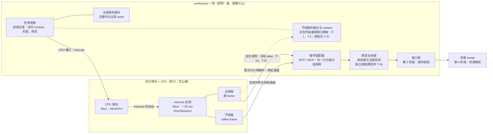

# 执行单元、执行线程与执行环境

**文档状态**：Idea；T-4a、T-4c 主线程通道已实施，其余执行线程与环境方向仍在讨论
**记录日期**：2026-10-05 起；2026-10-06 由总 Idea 第四部分拆出

## 0. 文档性质

本文讨论任务进程内“谁在执行、谁发起操作”的分层：执行单元（CPU）与执行线程（actor）、CPU 驱动与 harness 实例、操作适配器与请求入口，以及 agent 与执行环境的关系。

- 2026-10-06 由[总 Idea](./workspace-network-task-process-architecture.md)第四部分拆出；前提编号（1–10）与问题编号（T-1–T-8）不变，总 Idea 与其他文档提到“第四部分”及这些编号时，均指本文。拆出时只把章节号改为本文的编号、把指向总 Idea 的引用改写为“总 Idea X”，并补充同日的两项决定：T-7、T-8 不在 v0.7.0（第 5 节），以及写入意图迁移第 1 步对回调通道的依赖（T-4）。
- 总 Idea 的章节在本文中写作“总 Idea X”，例如“总 Idea 15.5”；身份数据的界定以[身份与访问体系 Idea](./identity-and-access-model.md)为准，外部 harness 的接入以[外部 Actor Idea](./external-actor-registration-and-runtime-access.md)为准。
- 版本归属：T-1a、T-1b、T-2a、T-3、T-4、T-5a 服务于 v0.7.0 的 Alice 迁移（总 Idea 15.5）；T-7、T-8（执行环境的选择）不在 v0.7.0，见第 5 节。
- 前提是 owner 提出的出发点；已完成的问题注明决定日期与实施状态；未完成的问题只列出选项及其影响，不替 owner 作出选择，选项顺序不代表倾向；分析均标注为分析。

## 1. 前提（owner 提出）

> 2026-10-05、2026-10-06：本文讨论任务进程内“谁在执行、谁发起操作”的分层，以及 CPU 驱动、操作适配器与请求入口的划分，由 Alice 的能力层调用迁移（总 Idea 15.5）的讨论引出。它与总 Idea 第三部分的认证与授权流程、[身份与访问体系 Idea](./identity-and-access-model.md) 中的访问 context 直接相关；身份数据的界定仍以该 Idea 为准。

1. （2026-10-05）actor 不感知能力层如何调用：agent 不在工具调用中自报身份；能力层需要的访问 context 不来自 actor，由 actor 之外的某一层提供。
2. （2026-10-05）一次操作的发起者与目标分开看待：
   - **发起者**是客观事实，由某一层补全，agent 不在工具调用中声明；
   - **目标 workspace** 是 agent 的意图：当前由补全的一层给出（第 3 阶段只接受驻留 workspace，见身份 Idea 第 3 节）；实现跨 workspace 的受限穿透访问后，agent 需要能够自己带上操作目标。
3. （2026-10-06）**执行单元 = CPU**。一个执行单元内部可以包含多个执行者（actor），即**执行线程**：发起任务的 agent 是主线程，CALL 派生的每个子 agent 是一个子线程。
   - 这修订了总 Idea 第 2.1 节“合成 CPU = 任意 Actor”的映射：最初按 AE2 类比把 CPU 与 actor 画等号；分为执行单元与执行线程两层后，一个 CPU 内可以同时存在多个 actor。
   - 总 Idea 与[任务进程 Idea](./task-process-table-and-registration-entry.md) 此前所说的“CALL 派生的子执行单元”，按本条即子执行线程；两文中的定义处已改称。
4. （2026-10-06）执行单元认识其全部执行线程的身份：任一执行线程发出的工具调用，由执行单元补上请求的发起人，再交给上一层。
5. （2026-10-06）CPU 是执行流程中的顶层抽象：任务进程不认识各个 CPU 的形态，只经统一的 CPU 端口调用。CPU 内部可以有多种 backend，即各个 agent harness 的实现（harness 实例）。
   - CPU 端口的实现称 **CPU 驱动**：把输入清单与控制（开始、取消、关闭）翻译成该 harness 的协议，并把输出翻译回事件流与终态结果。驱动按协议编写，一个驱动可以覆盖支持同一协议的多个 harness（外部 Actor Idea 1.2）。
   - 一个运行中的执行单元即 CPU 驱动加上它驱动的 harness 实例。现有的 `AliceCPU` 是 Alice 的 CPU 驱动；测试用的 `ScriptedCPU` 是没有真实 harness 的驱动。
6. （2026-10-06）adapter 称**操作适配器**（operation adapter）：把任意外部操作请求归一化为 workspace 统一能力层 API 的一次调用。例如 MTP READ 与将来经 MCP 提供的记忆读取，都归一化为 `MemoryApplicationService.read`；管理员操作同样经 HTTP 操作适配器归一化，只是因身份与操作意图不同而映射到不同的方法。定义与边界见[外部 Actor Idea](./external-actor-registration-and-runtime-access.md#34-操作适配器的定义与边界) 3.4。
   - 操作适配器属于接入侧面，不在 CPU 驱动之内：plugin 模式只经操作适配器访问能力层，没有进程，也没有驱动。controller 模式下两者如何连接（驱动把绑定进程的操作适配器端点交给 harness，工具调用经它回到 workspace），见 T-4。
   - 驱动与操作适配器分别对应外部 Actor Idea 1.2 中 harness 登记的执行侧面与接入侧面。
7. （2026-10-06）HTTP server 承担两个角色：对任务请求，它是**请求入口**，`POST /chat` 进入唯一注册入口、创建任务进程，这不是能力层的操作（总 Idea P-4b 已决定不设“创建任务”类 operation）；对管理操作，它是 HTTP 操作适配器。
8. （2026-10-06）“kernel”是早期架构遗留的命名，不再作为概念使用；harness 实例不称 kernel。代码与文档中的剩余使用点见 [kernel 遗留命名清理 Todo](../todo/kernel-legacy-naming.md)。
9. （2026-10-06）**agent 与执行环境解耦**：外部 harness 最初被视为一个单独的 agent；现在它是一个执行环境（CPU 的 backend）。理论上可以在外部 harness 之上再应用 Agent Profile（例如作为系统提示词），外部协议是否支持另当别论。用户在前端或任何交互环境中分别选择要使用的 agent 与执行环境，外部 harness 本身与单个 agent 的概念解耦。这一条决定了[外部 Actor Idea](./external-actor-registration-and-runtime-access.md#e-6-actor-与执行单元的对应) E-6a。
   - 分析：agent 的身份、访问登记、记忆可见性与（迁入能力层 operation 控制之后的）权限都只跟随 agent，由 HiveMemory 强制执行，与执行环境无关；更换执行环境不改变 agent 能看到什么、能做什么。Profile 的权限字段并入能力层的 operation 控制（总 Idea 15.4）是这一点成立的前提：现有的 MTP 动词检查只在 Alice 内部生效。
   - 分析：Profile 中的执行参数（persona、`model_name`、`temperature`、`top_p`、`language`）能否生效取决于执行环境，对外部 harness 只能尽力应用；应用结果的承载见总 Idea P-10a。按 ACP 仓库文档（2026-10-06 核对），`session/new` 的参数为 `cwd`、`mcpServers` 等，未见系统提示词字段；模型只能在 harness 自己声明的配置项（`configOptions` 中 `category` 为 `model` 的选项）中经 `session/set_config_option` 选择。persona 只能作为首轮 prompt 内容或各 harness 私有的扩展注入，约束力弱于系统提示词。
   - 分析：Alice 成为可选的执行环境之一；同一个 Agent Profile 可以在不同执行环境中运行，便于对照评估。交互记录或记忆来源可以记录执行所用的执行环境，作为观测与评估信息；按身份 Idea 的原则，来源不参与授权。
10. （2026-10-06）**执行环境的选择**：只有用户能选择执行环境，并且只能在对话开始前选择。
    - 选择执行环境不是 workspace 的能力：operation 目录中不设对应的 operation，能力层也不提供这一方法，actor 无法在执行中选择或更换执行环境。
    - owner 倾向：它大概率成为系统层级的控制，在 CPU 分配时决定实际使用的 backend（任务进程 Idea 1.2）。具体形态见 T-8。
    - 分析：执行环境在对话内固定，CALL 派生的子线程无法为自己选择另一个执行环境；外部 Actor Idea E-6b 中“允许一个进程内有多个执行单元”的选项与本条冲突。

## 2. 现状

### 2.1 术语在现有文档中的用法（文档核对，2026-10-06）

前提 3 之前，以下术语在不同文档中跨层使用：

| 术语 | 用法 | 出处 |
|:---|:---|:---|
| Actor | 执行系统，等同于 CPU | 总 Idea 第 2.1 节（修订前）、4.1 图（修订前）、7.1.1 “run/frame/MTP 归 Actor（Alice 等）”、[AGENTS.md](../../AGENTS.md) 第 4 节“Actor 执行（经 CPU 端口）” |
| Actor | 身份：`ActorIdentity`（user、agent、team），访问登记按 (user, agent) 记录 | 身份 Idea 第 2 节；[Workspace 架构](../architecture/workspace.md) |
| Actor | 一次操作的发起者 | 总 Idea 第 12 节前提 4“actor 的任何主动操作请求都导向能力层”；能力层的“actor 可见读取” |
| CPU | 执行侧面：CPU 端口的实现，由任务进程驱动 | 任务进程 Idea 1.2；[子系统公共契约](../contracts/subsystem-contracts.md) |
| CPU | 接入侧面：能力层的调用方，包括管理员直接通道与 plugin 模式的 harness | 总 Idea 第 12 节前提 7 的注；[外部 Actor Idea](./external-actor-registration-and-runtime-access.md) 1.2 |
| 执行者 | CPU 端口的实现 | 子系统公共契约 |
| 执行者 | “Agent、一次 Chat Run、子 Frame 和后台任务” | [Workspace 架构](../architecture/workspace.md) 第 1 节 |
| adapter | 入站：把外部协议的请求归一化后调用能力层 | 总 Idea 7.1.6、15.1“HTTP 入口作为 system actor 的 adapter”；外部 Actor Idea 3.4；[`configs/system_principals.yaml`](../../configs/system_principals.yaml) 的 `adapters` 字段 |
| adapter | 泛指接口转换，与接入无关 | 代码中的 `QdrantStorageAdapter`、`AgentRunStreamAdapter`、`QueueTaskAdapter` 等 |
| kernel | 早期架构遗留：MTP 的内核工具、提示词中的“memory kernel”、前端的 `stores/kernel/` | 见 [kernel 遗留命名清理 Todo](../todo/kernel-legacy-naming.md) |

按前提 3、5–10 统一后的用语：

| 用语 | 含义 |
|:---|:---|
| CPU（执行单元） | 执行流程的顶层抽象；运行时即 CPU 驱动加上它驱动的 harness 实例 |
| CPU 端口 | 任务进程调用 CPU 的统一接口 |
| CPU 驱动 | CPU 端口的实现，按协议编写；对应 harness 登记的执行侧面 |
| harness 实例 | CPU 内部的 backend，即某个 agent harness 的实现；面向用户称**执行环境**，与 agent 分别选择（前提 9、10） |
| 执行线程（actor） | 执行单元内的执行者：主线程与 CALL 派生的子线程；对应一个 `ActorIdentity` |
| 操作适配器 | 把外部操作请求归一化为能力层 API 的一次调用；对应 harness 登记的接入侧面 |
| 请求入口 | 任务请求进入唯一注册入口的传输入口，例如 HTTP 的 `POST /chat` |

- 按前提 3，Actor 的三种用法合为一层：一个执行线程对应一个 `ActorIdentity`，也是它所发起操作的发起者；CPU 只指执行单元，只有接入侧面的参与者不称 CPU（T-6）。
- 代码中泛指接口转换的“Adapter”类名不属于操作适配器，不需要随之改名。
- 事实文档（AGENTS.md、契约、Workspace 架构、Alice 文档）描述的是现有实现，措辞在相关设计实施并晋升时随之统一，不在讨论阶段修改。
- 例：总 Idea D-9 写“Alice 作为 CPU 既要实现 CPU 端口，又要调用能力层”，前提 4 写“actor 的主动操作请求导向能力层”，两句的主语按前提 3 分属执行单元与执行线程。

### 2.2 代码现状（2026-10-07 核对）

- **执行单元一侧已有线程表**：Alice 每次 run 的 [`RunSession`](../../src/hivememory/alice/orchestration/run_session.py) 持有 frame 注册表，`register_root_frame` 登记唯一的根 frame（主线程），`register_callee_frame` 连同 `CallRecord` 登记 callee frame（子线程）。
- **派生在 Alice 内部完成**：MTP CALL 必须指定目标 agent alias（`MTPCallRequest.target_alias`，[`core/mtp/models.py`](../../src/hivememory/core/mtp/models.py)）；Koakuma 处理 CALL 时返回 SUSPEND 并携带调用请求（[`agent_runtime/mtp/runtime.py`](../../src/hivememory/agent_runtime/mtp/runtime.py)），`RunExecutor` 交给 `CallCoordinator` 解析目标 Profile 并创建 callee frame（[`run_executor.py`](../../src/hivememory/alice/orchestration/run_executor.py)）。整个派生过程不经过任务进程。
- **子线程沿用主线程的身份与通道**：callee frame 继承 caller 的 operations 端口，`RuntimeScope` 直接取 caller frame 的 `IdentityScope`（[`call_coordinator.py`](../../src/hivememory/alice/orchestration/sub_agent/call_coordinator.py)），被调用方的 Profile 也以调用方的身份解析（[`call_context_provider.py`](../../src/hivememory/alice/orchestration/sub_agent/call_context_provider.py)）。因此子线程发起的读取、写入意图与引用记录，在授权与记录上都算作主线程的 actor；[Alice 文档](../alice/README.md#9-当前限制与设计张力)第 9 节记录了子帧的 PendingAtom 来源会记成父 Agent。
- **CPU 驱动**：[`AliceCPU`](../../src/hivememory/alice/application/cpu.py) 经全局总线请求 Alice 的统一执行路由，把 `done` 事件转换为 `CPUExecutionResult`，其余交互事件原样转交。组合根只注入这一个驱动（[`system/assembler.py`](../../src/hivememory/system/assembler.py)），没有选择 CPU 的步骤；`CPUAllocator` 名为“CPU 分配”，实际只为 CPU 准备输入（Profile 解析、附件租借、记忆与附件编译、输入清单），进程记录也不登记所用的 CPU（任务进程 Idea 1.2）。chat 请求体 `ChatRequest`（[`server/models/chat.py`](../../src/hivememory/server/models/chat.py)）必须显式给出 `agent_id`，没有选择执行环境的字段。
- **操作适配器**：HTTP 仍是唯一已登记的外部 adapter（`system_principals.yaml` 中 `adapters: ["http"]`）。MTP 的 WRITE、UPDATE 与共同引用解析已在 Alice 内转换为 `ProcessOperations` 端口调用，由 workspace 的绑定进程通道进入能力层；SEARCH、引用记录、CALL 目标 Profile 仍走直接路由，MCP 尚未接入。
- **任务进程一侧没有线程层**：进程记录只持有一份访问 context（身份 Idea I-8）；context 的运行绑定 `RunBinding`（[`core/access.py`](../../src/hivememory/core/access.py)）只有运行类型（任务进程或请求）与运行标识。
- **CPU 已有主线程回调通道**：进程调用 `CPUPort.execute` 时把 operations 作为独立参数交给 CPU，执行单元仍交回事件流与唯一终态结果（[`workspace/contracts/cpu.py`](../../src/hivememory/workspace/contracts/cpu.py)、[`operations.py`](../../src/hivememory/workspace/contracts/operations.py)）。`ProcessOperationChannel` 绑定访问 context、注册目标与 process_id，执行者不提交这些身份参数；关闭同步使通道失效并取消在途操作，防止迟到 UPDATE 冷读再登记新意图。输入清单仍携带过渡 `IdentityScope`（I-9），用于 SEARCH、引用记录与 CALL 目标 Profile 的剩余直接调用。
- **目标 workspace**：授权点显式接收目标 workspace（身份 Idea I-4）；任务进程的阶段调用与 operations 通道均以任务注册时声明并通过认证的 workspace 为目标（I-8）。[MTP 契约](../contracts/mtp.md#2-执行位置)第 2 节继续禁止 MTP 文本、alias 或进程级缓存自行指定或推导 Workspace；已迁移的操作由进程通道绑定身份，剩余直接路由仍使用过渡 `RuntimeScope`。
- **Profile 的默认可见性**：管理入口创建的 Agent Profile 使用 `MemoryAccessPolicy.public()`（[`workspace/capability/agent_profiles.py`](../../src/hivememory/workspace/capability/agent_profiles.py)）；`AgentProfile.agent_id` 取自源原子的 `index.alias`。

## 3. 流程图

实线是现状：主线程提交与引用解析已有绑定通道，子线程当前共用它；虚线表示独立子线程身份与派生准入等第 5 节的未完成问题。SEARCH、引用记录与 CALL 目标 Profile 的剩余直连路径未在图中展开。

图中操作适配器与补全分开画，表示归一化（对应哪个方法）与补全（谁发起、目标是哪里）是两件事；两者如何组合、操作适配器如何绑定进程，见 T-4c。

分析（2026-10-06）：任务进程与执行单元是同一个任务的两面，前者回答“谁、能做什么”，后者回答“怎么做”；两面在任务与线程两个粒度上对应。

| 粒度 | workspace 一侧 | 执行单元一侧 | 现状 |
|:---|:---|:---|:---|
| 任务 | 任务进程：进程记录与工作集 | 一次执行：Alice 的 `RunSession` | 两侧都已实现，经 CPU 端口对接 |
| 线程 | 每个线程一份访问 context（T-2，已决定） | 执行线程：Alice 的 `ExecutionFrame` | 主线程 context 与回调通道已实现；子线程共用主线程通道，尚无独立登记与 context；外部执行单元不识别子线程（T-1） |

按操作系统的直觉，线程属于进程而不属于 CPU；按两面分开看，线程的执行状态在执行单元内，线程的身份与授权在进程一侧，两种说法并不冲突。

## 4. 已完成的问题

### T-1 执行线程身份的确定方式

**状态**：已完成（方向）。2026-10-06 决定；随 Alice 的能力层调用迁移实施，尚未实施。T-1a、T-1b 见第 5 节。

**问题**：前提 4 由执行单元为工具调用补上发起人。“某个线程是哪个 actor”以什么为准：执行单元在工具调用上直接标注 actor，还是经进程确定？

**设计**：

- **子线程的身份在派生时由派生调用确定**（owner）：父线程派生子 agent 的工具调用必须指明目标，解析这次调用即可得到接下来的执行线程以哪个 actor 运行。Alice 的 MTP CALL 必须指定目标 agent alias（2.2），这一步就确定了子线程的身份；这也是取得子线程身份最早、最可靠的时机。
- **派生必须到达进程一侧**（分析，owner 认可）：每个执行线程有自己的访问 context（T-2），而 context 只能由 workspace 一侧签发（身份 Idea I-1）。因此派生要送到进程：进程以被调用方做 Workspace 准入（principal 继承自主线程）、签发子线程的 context，并在此判断是否允许派生（T-3）。执行单元负责认出“是哪个线程”，“是谁”由进程确定，与“身份只在授权点取得”一致。
- **外部执行单元不识别子线程**（owner，最坏打算）：外部 harness 的子 agent 派生行为不纳入，一个进程内的所有 actor 共享主线程的 context，所发起的操作都记在主线程的 actor 名下。依据与影响见[外部 Actor Idea](./external-actor-registration-and-runtime-access.md#e-5-外部执行单元的执行线程) E-5。

**取舍**：原先列出的选项中，“执行单元在工具调用上直接标注 actor、上一层照此授权”使执行单元成为身份的来源，外部执行单元可以标注任意 agent，等于自报身份（前提 1）；“进程内的执行单元直接标注、外部执行单元经进程”需要按执行单元区分信任程度。外部执行单元不识别子线程后，后一种区分不再需要：只有 Alice 存在子线程，它的派生同样经过进程。

### T-2 执行线程的访问 context

**状态**：已完成。2026-10-06 决定；随 Alice 的能力层调用迁移实施，尚未实施。T-2a 见第 5 节。

**问题**：身份 Idea 第 2 节规定一份 context 只属于一个 actor 和一次运行；I-8 规定进程记录只持有访问 context；任务进程 Idea Q-10 规定父进程的访问上下文需要容纳被调用方的身份与权限。一个进程内有多个执行线程时，context 采用什么形态？

**设计**（owner）：每个执行线程一份 context，因为各线程的 agent 身份不同。

- 主线程使用注册时签发的 context；子线程在派生到达进程时另签一份（T-1）；
- 进程记录持有本进程全部线程的 context；context 的运行绑定在进程之外再带上线程标识；
- 第 3 阶段组装的 `IdentityScope` 的发起者就是发起调用的线程的 actor。
- 影响（分析）：身份 Idea 第 2 节“一份 context 只属于一个 actor 和一次运行”保持不变，运行的粒度细化到线程；I-8“进程记录只持有访问 context”与 `RunBinding`（2.2）在实施时修订；任务进程 Idea Q-10 的“父进程的访问上下文容纳被调用方的身份与权限”由进程持有的子线程 context 满足。
- 外部执行单元不识别子线程（T-1），在 HiveMemory 看来只有主线程一个 actor，仍是一份 context 对应一个 actor。

**取舍**：另一种做法是进程只持有主线程的一份 context，授权时另行传入发起线程的 actor；它使一份 context 对应多个 actor，需要修订身份 Idea 第 2 节，第 3 阶段还要另行校验该 actor 属于本进程登记的线程。

### T-4a、T-4c 主线程的回调通道

**状态**：已完成（主线程部分）。2026-10-06 决定，2026-10-07 实施验收；历史记录见[写入意图登记与读取缓存失效归档计划](../archive/plans/v0.7.0-intent-registry-and-read-cache.md)。T-4b 与子线程的独立身份部分见第 5 节。

**问题**：写入意图迁移第 1 步需要 Alice 经能力层提交与读回意图（总 Idea 15.11），通道怎样交给 Alice、操作适配器怎样绑定进程？

**设计**（owner 接受的默认决定 W2、W3）：

- **T-4a**：作为 `CPUPort.execute` 的独立参数交给 CPU，协议定义在 `workspace.contracts`，不放进输入清单。输入清单是冻结的 DTO，访问 context 及持有它的对象不能进入 DTO（身份 Idea 不变量 2）。
- **T-4c**：每个进程一个绑定实例，持有本进程主线程的访问 context 与目标 workspace，对外方法不带这两个参数，进程关闭即失效；MTP 到这些方法的翻译放在 Alice 一侧。
- 影响（分析）：执行线程层（T-1b）可以为每个线程各发一个实例，沿用同一结构。

**取舍**：放进输入清单会让持有 context 的对象进入 DTO；由执行单元在执行开始时向进程取得，需要额外的查找入口。不绑定进程、每次调用附带标记，需要在归一化之后另做补全。

### T-6 只有接入侧面的参与者是否称 CPU

**状态**：已完成。2026-10-06 决定；属于讨论层面的用语，无需代码实施。

**问题**：前提 3 起 CPU 专指执行单元。总 Idea 第 12 节前提 7 把管理员操作称为“CPU 的一种接入”，并注明此处的“CPU”指能力层的调用方（外部 Actor Idea 1.2 的接入侧面）；总 Idea 4.1 图曾把管理员直接通道与 plugin 模式的 harness 画在 CPU 一栏。它们没有执行单元，只调用能力层。是保留“接入侧面的 CPU”的称谓，还是 CPU 只指执行单元？

**设计**：CPU 只指执行单元（前提 3、5）。只有接入侧面的参与者不称 CPU，它们经操作适配器调用能力层（前提 6）：管理员直接通道是经 HTTP 操作适配器、以请求级 context 发起操作的 actor（保留的 `system`），没有执行单元，也没有进程；plugin 模式的 harness 经 MCP 等操作适配器访问，同样不建进程（外部 Actor Idea 1.1）。总 Idea 第 12 节前提 7 的注、4.1 图与外部 Actor Idea 1.2 已按此修订。

**取舍**：保留“接入侧面的 CPU”会让 CPU 端口的 CPU 与能力层调用方的 CPU 继续同名。

## 5. 未完成的问题

每个问题只列出选项及其影响，不作选择；选项顺序不代表倾向。

### T-1a 派生到达进程的途径

T-1 的方向已完成，见第 4 节：子线程的身份由派生调用确定，派生必须到达进程。剩下的问题是 Alice 的派生经什么途径到达进程。现状是 MTP CALL 完全在 Alice 内部处理，进程看不到派生（2.2）。

| 选项 | 内容 | 影响 |
|:---|:---|:---|
| A | 执行单元经回调通道上报派生：Koakuma 仍返回 SUSPEND，`CallCoordinator` 在创建 callee frame 前经通道请求进程登记子线程 | 通道需要承载线程派生（T-4b 的第二项）；派生仍由 Alice 的编排发起，进程只做准入、签发与授权 |
| B | MTP 操作适配器把 CALL 归一化为进程一侧的“派生线程”方法，由它返回子线程的句柄后，Alice 再创建 callee frame | CALL 归一化的目标是进程而不是能力层的资源操作，与任务请求进入注册入口而不是能力层属于同一类情况；外部 Actor Idea 3.4“归一化的目标必须是能力层已有的方法”需要相应限定 |
| C | 其他 | —— |

### T-1b 后续调用与执行线程的对应

**背景**：派生只确定“出现了一个以某个 actor 运行的线程”；该线程此后的每次工具调用都要对应到它自己的 context（T-2）。外部执行单元只有主线程（T-1），本问题只涉及 Alice。

- 选项：派生时签发绑定该线程 context 的句柄或端点，线程的调用都经它发出 / 每次调用附带线程标记，由进程按登记查表 / 其他。
- 影响（分析）：前一项中 Alice 的每个 frame 持有自己的句柄，进程内的句柄可沿用 I-8 进程句柄的做法，按对象身份判定有效；与 T-4c（操作适配器如何绑定进程）一并决定。

### T-2a 子线程 context 的失效时点

T-2 已完成，见第 4 节：每个执行线程一份 context。

- 选项：子线程结束时撤销 / 随进程关闭（总 Idea P-6） / 其他。
- 影响：前一项使已结束的子线程无法继续发起操作，需要在 CALL 返回时撤销；后一项与主线程的 context 同时失效，实现更简单，但子线程结束后其 context 仍然有效直到进程关闭。

### T-3 派生执行线程的认证与授权（原总 Idea P-5a）

**背景**：总 Idea P-5a 原问题是 CALL 子执行单元以被调用方身份重新做 Workspace authentication（principal 继承自父进程），还是沿用父进程的认证结果（子执行单元使用父 Actor 的白名单，而不是被调用方的访问记录）。按前提 2，子线程所发起操作的发起者是被调用方；剩下的问题是认证与权限从哪里来。现状是子线程沿用主线程的身份（2.2）。

- **T-3a 子线程的 Workspace 认证**：以被调用方重新认证（principal 继承自主线程） / 沿用主线程的认证结果 / 其他。
- **T-3b 子线程的操作白名单与资源可见性**：按被调用方自己的访问登记与 policy / 按主线程的 / 两者取交集 / 其他。
- **T-3c 派生本身是否需要授权**：派生方须持有 CALL 类 operation（总 Idea 15.4 已决定执行类操作的授权进入 operation 目录） / 不单独授权 / 其他。
- 影响（分析，2026-10-06）：被调用方的身份取自 Agent Profile 原子，而管理入口创建的 Profile 默认是 PUBLIC（2.2）。若子线程按被调用方自己的权限读取（T-3b 第一项），且派生不单独授权（T-3c 第二项），任何 agent 都能派生一个公开 Profile 的子线程，读到该 agent 的 PRIVATE 记忆，再经 CALL 的返回值交给主线程。T-3b 与 T-3c 至少需要有一项限制这条路径。
- 授权点（2026-10-06，随 T-1 确定）：派生到达进程时，由进程完成子线程的 Profile 解析、准入与派生授权，不再只在 Alice 的 `CallContextProvider` 内部完成。外部执行单元不识别子线程（T-1），不经过这一授权点。
- 影响（分析，2026-10-06）：若 T-3c 选择“派生方须持有 CALL 类 operation”，实施派生授权的执行线程层就依赖 operation 目录中的执行类条目，而这些条目属于从 Alice 的能力层调用迁移中拆出的 Profile 权限计划（总 Idea 15.4）。两份计划的先后因此受 T-3c 的选择约束（总 Idea 15.5“重新划分”）。

### T-4 进程与执行单元之间的回调通道

**背景**：讨论发起时 CPU 端口是单向的；2026-10-07 已实现主线程提交与引用解析回调（2.2）。其余执行线程的工具调用（前提 4），以及 T-1a 选择经通道上报时的线程派生，都需要执行单元在执行期间回到进程。外部 Actor Idea 1.1 的分析中提到，controller 模式下 HiveMemory 可以向外部 harness 提供绑定进程的操作适配器端点（例如 ACP 创建会话时由客户端提供的 MCP server），属于同一类通道。按前提 6，操作适配器只负责归一化；发起者与默认目标的补全（前提 4、T-1b、T-5）需要知道调用属于哪个进程、哪个线程。

- 2026-10-07：T-4a 与 T-4c 的主线程部分已实施，见第 4 节；以下保留原选项，子线程独立身份及其余操作的部分随执行线程层与 Alice 剩余迁移决定。
- **T-4a 通道交给执行单元的方式**：作为 `execute` 的参数，由 CPU 驱动转交给 harness / 放入输入清单 / 由执行单元在执行开始时向进程取得 / 其他。
- **T-4b 通道承载的内容**：只承载工具调用 / 同时承载线程的派生与结束 / 其他。与 T-1a 联动：T-1a 选择经回调通道上报派生时，通道必须承载派生。
- **T-4c 操作适配器与进程的绑定方式**：每个进程一个绑定进程的操作适配器实例，调用经它到达时即可确定进程 / 操作适配器不绑定进程，由通道在每次调用时附上进程与线程标记，归一化之后再补全 / 其他。与外部 Actor Idea E-3b（操作适配器的代码位置）相关；管理员与 plugin 模式经同一种操作适配器、按请求认证（T-6），不绑定进程。
- 影响（分析，2026-10-06）：总 Idea P-11 已决定写入意图迁移的第 1 步在 Alice 的能力层调用迁移之前完成。第 1 步中 Alice 的写入意图提交与 pending 读回要经能力层，而能力层要求访问 context，Alice 不持有它；因此至少主线程的回调通道（T-4a、T-4c）需要在第 1 步的计划之前决定。
- 影响（分析）：通道建立后，输入清单中过渡用的 `identity_scope` 与 `cpu_execution_identity` 不再需要，随 Alice 的能力层调用迁移删除（总 Idea 15.5、身份 Idea I-9）。

### T-5 目标 workspace 的默认值与表达

**背景**：前提 2；授权点已显式接收目标 workspace（2.2）。

- **T-5a 默认值**：2026-10-07 主线程通道已绑定任务注册时声明并通过认证的 workspace，不接收 Actor 另传目标；当前子线程共用通道，因此沿用相同默认目标。独立子线程通道是否继续继承该目标，随执行线程层决定；原选项是注册目标 / context 的驻留 workspace（当前两者相同） / 其他。
- **T-5b 将来的表达形式**（受限穿透访问不在 v0.7.0）：按指令给出目标，一条指令一个目标 / 按引用限定，alias 带上 workspace 限定 / 其他。影响：alias 目前按 (workspace, alias) 分区，跨 workspace 的引用必须带限定；agent 只能给出 workspace key 一类名称，`WorkspaceIdentity` 中的 owner 由补全的一层解析，解析失败与无权访问需要对 agent 表现一致。
- 影响（分析）：MTP 文本不能指定 Workspace 的现有约束，随穿透访问设计另行评审；发起者不能由工具调用指定（前提 1、2）长期成立，已经落地的进程绑定通道继续满足这一边界。

T-7、T-8 不在 v0.7.0（owner，2026-10-06）：v0.7.0 只有 Alice 一个执行环境，选择机制没有可验收的对象；它随后续版本实施，不一定是 v0.7.1。前提 9、10 已确定执行环境与 agent 的关系，v0.7.0 之后接入外部执行环境不需要再改动拓扑。

### T-7 agent 与执行环境组合的有效性

**背景**：按前提 9，用户分别选择 agent 与执行环境，并非每个组合都有效。例如 Profile 指定的模型不在 harness 声明的模型配置项中；harness 无法注入 persona；执行环境要求的工作目录等条件不满足。

- **T-7a 校验时点**：注册入口创建进程之前 / CPU 分配时，在 Patchouli prepare 之前（与 Profile 解析当前的时点相同） / 执行开始后由 CPU 驱动报告 / 其他。影响：Profile 目前提前到 prepare 之前解析，是因为 prepare 可能新建 Topic 或按 LRU 结算已有话题，这些副作用不可逆（任务进程 Idea 1.2“解析时点的中间态”）；组合在 prepare 之后才被判定无效，会留下同样的副作用。
- **T-7b 无法完全应用时的处理**：拒绝请求 / 降级运行并报告未生效的项（总 Idea P-10a） / 按 Profile 字段区分：模型不可用时拒绝，persona 无法注入时降级 / 其他。

### T-8 执行环境选择的承载与系统层级的控制

**背景**：前提 10 已决定只有用户能选择执行环境、只能在对话开始前选择，且不是 workspace 的能力；owner 倾向由系统层级控制，在 CPU 分配时决定实际使用的 backend。现状：chat 请求只携带 `agent_id`，组合根只注入 Alice 一个 CPU 驱动（2.2）。

- **T-8a 选择的承载位置**：作为会话的属性在对话开始时确定，此后各任务进程从会话取得 / 每次请求都携带，由入口校验它与对话开始时的选择一致 / 其他。影响：ConversationSession 尚未实现，会话模型见[外部会话与 Topic 投影 Idea](./external-session-and-topic-projection.md#01-会话模型与-topic-池owner2026-09-28) 0.1；无论哪一项，选择都要作为任务参数到达 CPU 分配，并记入进程记录（任务进程 Idea 1.2）。
- **T-8b 默认值**：系统默认的执行环境（当前为 Alice） / Agent Profile 中声明的偏好 / 用户设置 / 其他。影响：由 Profile 声明偏好会让 agent 与执行环境重新部分耦合（前提 9）。
- **T-8c 系统层级控制的形态**：哪些执行环境可用、对哪些用户可用：由 System 在启动时随 harness 登记的执行侧面装载（外部 Actor Idea 1.2、E-1），CPU 分配按用户的选择取得驱动 / 按用户登记可用的执行环境 / 其他。影响：向前端列出可选执行环境的接口属于 System 层面的 API，不经 workspace（总 Idea 15.3）。

### 与其他问题的关联

| 本文问题 | 相关问题 |
|:---|:---|
| T-1a、T-1b | T-1、T-4b、T-4c；外部 Actor Idea 3.4；身份 Idea I-8（进程句柄） |
| T-2a | T-2；总 Idea P-6 |
| T-3 | 总 Idea P-5a（并入本问题）、15.4（Profile 权限计划的先后）、P-3；T-1；任务进程 Idea Q-10 |
| T-4 | 总 Idea 15.5；身份 Idea I-9；外部 Actor Idea 1.1（绑定进程的操作适配器端点）、3.4、E-3b |
| T-5 | 身份 Idea I-4 与第 3 节（受限穿透访问） |
| T-7 | 前提 9；总 Idea P-10a；任务进程 Idea 1.2（Profile 的解析时点） |
| T-8 | 前提 10；总 Idea 15.3；外部 Actor Idea 1.2、E-1、E-6；外部会话 Idea 0.1；任务进程 Idea 1.2（CPU 分配记入进程记录） |

分析（2026-10-07）：按总 Idea 15.5 的重新划分，写入意图迁移第 1 步已完成 T-4 中主线程的提交与共同引用解析部分，收窄后的 Alice 能力层调用迁移完成 T-4，执行线程层实现 T-1、T-2 的决定并给出 T-1a、T-1b、T-2a、T-3 的一种实现；外部 Actor 的 controller 模式（v0.7.1）沿用同一结构，但只有主线程（T-1、外部 Actor Idea E-5），actor 与执行单元的对应见外部 Actor Idea E-6。

## 6. 与其他文档的关系

| 文档 | 关系 |
|:---|:---|
| [总 Idea](./workspace-network-task-process-architecture.md) | 本文原为其第四部分；Alice 的能力层调用迁移（15.5）、Profile 权限并入 operation 控制（15.4）、与写入意图迁移的先后（P-11）与能力层为 MTP 补齐的接口（P-12）在总 Idea 维护 |
| [身份与访问体系 Idea](./identity-and-access-model.md) | 访问 context 的界定；T-2 使运行绑定细化到线程，I-8 与 `RunBinding` 在实施时修订；T-4 决定 I-9 的删除 |
| [任务进程 Idea](./task-process-table-and-registration-entry.md) | CPU 端口与 CPU 分配（1.2）；Q-10 由 T-1、T-2 满足 |
| [外部 Actor Idea](./external-actor-registration-and-runtime-access.md) | 操作适配器的定义（3.4）；harness 登记的两个侧面（1.2）；外部执行单元不识别子线程（E-5）；外部 harness 是执行环境（E-6a） |
| [写入意图迁移 Idea](./pending-intent-migration.md) | 第 1 步先于 Alice 的能力层调用迁移（总 Idea P-11），需要主线程的回调通道（T-4） |

## 7. 形成计划的条件

- 满足 [Ideas 升级规则](./README.md#升级规则)与[文档治理规范](../DOCUMENTATION.md)第 8.3 节的计划约束；
- 本文不单独形成计划：其决定由 v0.7.0 中消费它们的方向实施，所需的前置决定见 [Plans 导航](../plans/README.md#v070)；
- 已完成的问题在对应计划实施、验收并晋升为事实之后，按晋升门禁写入当前事实文档。
