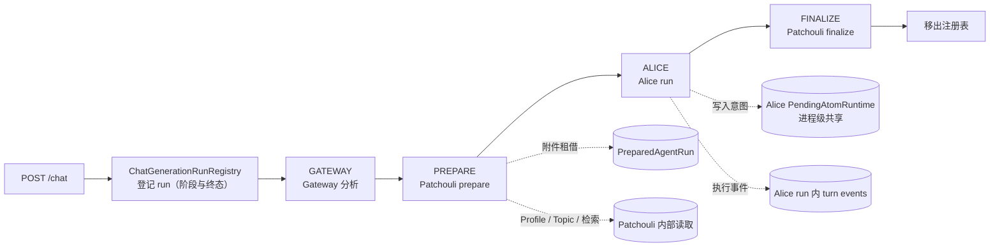
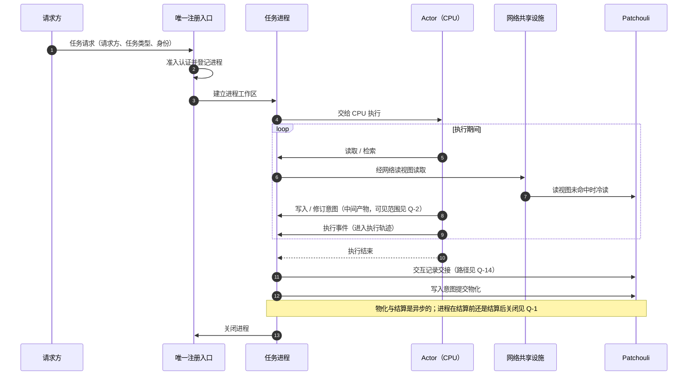
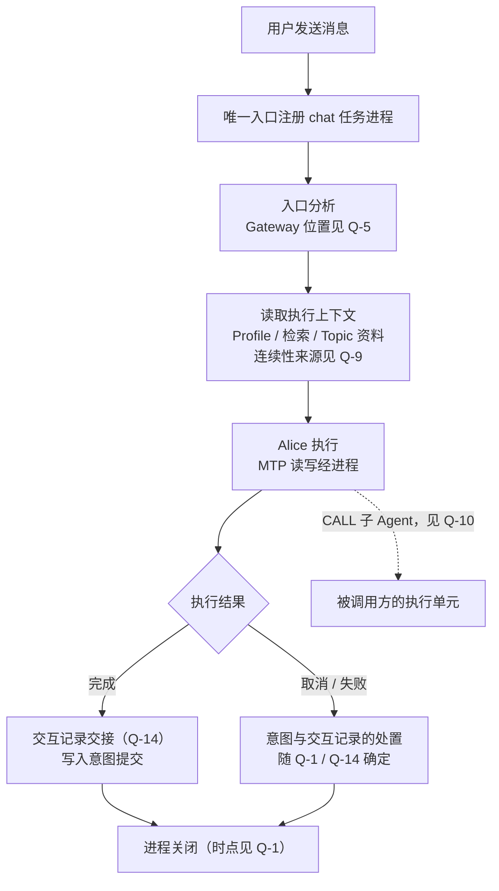
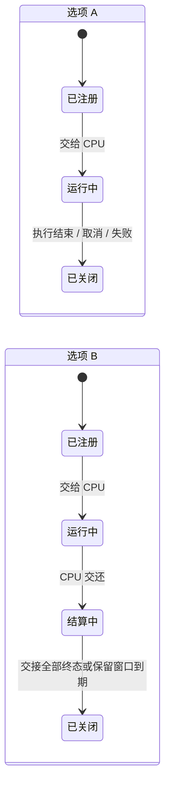

# 任务进程表与任务请求唯一注册入口

**文档状态**：Idea，未形成实施承诺
**记录日期**：2026-09-27，内容自 [Workspace 网络与任务进程架构](./workspace-network-task-process-architecture.md)第一部分拆出

## 0. 文档性质

owner 于 2026-09-27 将“任务进程表与任务请求唯一注册入口”定为 v0.7.0 当前唯一的有效计划方向。本文是形成该 Plan 之前的集中讨论载体，本身不是 Plan。

- 内容自总 Idea 第一部分拆出：前提 2.2、现状事实 3.1/3.2/3.5、流程图 4.2–4.4 与问题 Q-1–Q-10、Q-14。问题编号沿用原编号，已有引用继续成立。全局拓扑、被动输入（Q-11–Q-13）、迁移问题（M-1–M-7）与认证授权（第三部分）仍在总 Idea，关联见第 5 节。
- 现状事实按 2026-09-27 的代码重新核对，路径为包分层重构后的位置。
- 流程图只画出前提已经确定的部分；依赖待决问题的内容标注问题编号。
- 待决问题只列出选项及其影响，不替 owner 作出选择；选项顺序不代表倾向。
- workspace 包的现有实现（A2 已实施部分）不作为本方向的前提，形成 Plan 时重新调查（总 Idea 第 6.1 节）。

## 1. 前提（owner 提出）

类比映射见总 Idea [第 2.1 节](./workspace-network-task-process-architecture.md#21-类比映射)：Workspace 对应 ME 网络，Patchouli 对应存储系统，任意 Actor 对应合成 CPU，一次任务请求对应一个任务进程。

1. 运行一个任务，需要为它保留一个“合成进程”；CPU 在进程内工作。
2. CPU 必须在 Workspace 的一个集中区域里工作，但这件事不由单一的 runtime 环境承担。原先把 Workspace runtime 当作 CPU 真实工作区的观念是半对半错。
3. 任意任务请求从**唯一入口**注册为一个进程，直到任务结束进程才关闭。这是新架构下 Workspace 网络的核心运作逻辑。
4. 请求方不只有用户主动下单；满足指定条件的被动请求方（类比合成卡、ME 请求器）也可以向网络创建任务。
5. 现有实现中与此最接近的是 chat application service 的 run 注册表：用户发出指令后，注册一个独立的 chat generation run。

## 2. 现状事实（代码核对，2026-09-27）

### 2.1 Chat run 注册表

[`ChatGenerationRunRegistry`](../../src/hivememory/alice/application/chat_control.py) 以 `interaction_id` 为键登记 run，重复登记直接拒绝；提供 get / cancel / status，控制请求只比较 Workspace 身份。

- 阶段枚举 `ChatRunPhase` 把 chat 编排写死：`CREATED → GATEWAY → PREPARE → ALICE → FINALIZE → TERMINAL`；
- 注册表本身不持有工作状态：附件租借在 Patchouli prepare 返回的 `PreparedAgentRun` 中，写入意图在 Alice 的 `PendingAtomRuntime` 中，执行事件在 Alice run 中；
- 注册与编排都在 [`chat_service.py`](../../src/hivememory/alice/application/chat_service.py) 内完成（包分层重构后暂置于 `alice.application`，最终归属待 Q-3，见总 Idea D-9）；run 记录终态后由 `close` 移出注册表。

### 2.2 写入意图的现有寿命

- 每个 AliceRuntime 只创建一个 `PendingAtomRuntime` 实例（[`alice/runtime/core.py`](../../src/hivememory/alice/runtime/core.py)），主帧与子帧共享；
- 任何一个根 run 以 COMPLETED 收尾时，[`AgentRuntime.finalize_run`](../../src/hivememory/agent_runtime/runtime.py) 都会调用 `evict_by_run`：删除上一次已标为 EXPIRED 的意图，并把**其他** run 中已离开 in-flight 的意图标为 EXPIRED；非 COMPLETED 的 run 调用 `cancel_run`；
- 因此一条已结算意图还能保留多久，取决于其后有多少个根 run 完成，其中也包括其他用户的 run。意图在事实上比产生它的 run 活得更久，但没有明确的持有者与保留期限。

### 2.3 记忆库内部工作

记忆生成（独立业务 lane）、Topic 的空闲/LRU 结算，以及在全局维护调度器上注册的维护任务，目前都在 Patchouli 或 System 调度设施内部运行，不由任何 Actor 执行。

## 3. 流程图

### 3.1 任务进程的生命周期（前提部分）

前提只确定“从唯一入口注册、任务结束后关闭”。“任务结束”如何判定属于 Q-1，两种选项的状态图见 Q-1。

### 3.2 主动任务进程的通用流程

### 3.3 以 Chat 为例的任务类型

骨架的形态见 Q-4，Gateway 的位置见 Q-5，连续性来源见 Q-9。

## 4. 待决问题

每个问题只列出选项及其影响，不作选择；选项顺序不代表倾向。

### Q-1 进程何时关闭

**背景**：AE2 中合成任务结束即产物回到网络存储，是同步、可确认的。HiveMemory 中交互要等 applied 才进入 Topic，写入意图的物化可能需要数十秒以上，结果也可能被丢弃。现状下意图的寿命见 2.2。

| 选项 | 内容 | 影响 |
|:---|:---|:---|
| A | 执行结束即关闭：Actor 执行完毕、交接已提交后关闭进程 | 结算发生在进程关闭之后；尚未结算的意图需要进程之外的持有者，其保留期限需另行定义 |
| B | 两阶段关闭：运行中 → 结算中 → 关闭。结算中的进程已不占用 CPU，仍留在进程表中；在所有交接到达终态或保留窗口到期后关闭 | 意图在关闭前归该进程；进程表中存在不占用 CPU 的进程，需要定义保留窗口、容量与停机时的处理 |

### Q-2 写入意图（中间产物）的可见范围

**背景**：AE2 中合成 CPU 存储的中间材料不出现在网络存储视图中。现状下意图在同一 AliceRuntime 内共享，可见性按 `identity_scope` 相等判断。原 A4 计划的目标之一是外部 Actor 与后续 run 都能读回意图，其候选设计现见[写入意图体系迁移](./pending-intent-migration.md)。

| 选项 | 内容 | 影响 |
|:---|:---|:---|
| A | 仅本进程可见（以及其子执行单元，取决于 Q-10）；结算后以正式记忆出现在网络中 | 后续任务在结算前读不到上一个任务的意图别名，与现状在同一 AliceRuntime 内可读不同 |
| B | 本进程及显式声明的前驱进程链可见 | 需要定义前驱的声明方式、校验与链长 |
| C | 在 Workspace 内按 policy 可见（原 A4 方向） | 意图需要 Workspace 级的登记与可见性策略，与“中间产物归进程”的类比不同 |

### Q-3 唯一注册入口的职责边界

**背景**：现有注册表把 chat 阶段写死在枚举中，且不持有工作状态（2.1）。

| 选项 | 内容 | 影响 |
|:---|:---|:---|
| A | 入口只负责注册与通用生命周期：进程标识、准入认证、请求方、状态、取消、停机收尾；执行步骤由各任务类型定义 | 需要任务类型的登记与分派机制；入口不认识具体流程 |
| B | 入口同时承担各任务类型的编排 | 入口需要认识全部任务类型，新增任务类型需要改动入口 |
| C | 其他划分 | —— |

**子问题 Q-3a**：哪些现有工作状态进入进程工作区。候选包括写入意图、附件租借、执行轨迹、访问上下文；每一项都可以选择进入进程，或留在网络共享设施 / 其他位置。

**子问题 Q-3b**：唯一入口指唯一的注册点，还是同时要求唯一的传输入口（HTTP、外部协议、触发器是否都经同一个对外端点）。

### Q-4 “合成树”在 HiveMemory 中的形态

**背景**：AE2 的合成计划由样板确定性推导；Agent 任务是在线的“生成—行动—观察”循环（见 [AE2 类比 §1](./ae2-hivememory-architecture-analogy.md#1-结论摘要)）。ROADMAP 中通用 workflow / DAG 为 Unscheduled。

| 选项 | 内容 | 影响 |
|:---|:---|:---|
| A | 任务类型只定义固定骨架（如 chat：分析 → 读上下文 → 执行 → 交接），骨架内部由 Actor 在线决定 | 不需要计划表示与规划器；骨架随任务类型维护 |
| B | 进程启动时计算显式执行计划（任务图），CPU 按计划执行 | 需要计划表示、规划器与计划失败语义，接近 AE2 类比中的 Job Graph |
| C | 按任务类型选择 A 或 B | 两套机制并存 |

### Q-5 Gateway 在新架构中的位置

**背景**：Gateway 现有 `ACTIVE_CHAT`（命令、查询分析、检索计划、话题路由）与 `PASSIVE_MEMORY`（分析、话题路由、价值信号）两种模式。

| 选项 | 内容 | 影响 |
|:---|:---|:---|
| A | 作为特定任务类型（如 chat）在进程内的入口分析步骤 | 其他任务类型不经 Gateway |
| B | 作为唯一注册入口的通用前置步骤，对所有任务请求执行 | 所有任务类型共享入口分析，Gateway 需能区分任务类型 |
| C | 其他 | —— |

**子问题 Q-5a**：Gateway 命令（如 `/compact` 一类）是注册为任务进程，还是作为直接的网络操作执行而不建立进程。

**子问题 Q-5b**：`PASSIVE_MEMORY` 模式的去留，取决于总 Idea 的 [Q-11](./workspace-network-task-process-architecture.md#q-11-被动交互的-topic-落位) 与 [Q-12](./workspace-network-task-process-architecture.md#q-12-被动交互的价值信号worth_saving)。

### Q-6 触发型请求方的范围

**背景**：前提第 4 条（第 1 节）允许条件触发的请求方。VISION 阶段 E 把“记忆事件触发 Agent 唤醒”放在前序阶段取得证据之后。

| 选项 | 内容 | 影响 |
|:---|:---|:---|
| A | 当前阶段只在注册请求中保留请求方类型，不实现触发条件与调度 | 入口形状兼容触发方，不交付触发能力 |
| B | 实现一种最小触发机制 | 需要定义触发条件、去重、失败与取消语义 |
| C | 当前阶段不考虑触发型请求方 | 入口形状以后可能需要调整 |

### Q-7 记忆库内部工作与进程表

**背景**：记忆生成、Topic 结算与维护任务目前在 Patchouli 或调度设施内部运行，不由 Actor 执行（2.3）。在 AE2 中，存储系统的存取不经过合成 CPU。

| 选项 | 内容 | 影响 |
|:---|:---|:---|
| A | 不进入进程表，保留在 Patchouli 内部队列与维护调度 | 进程表只包含由 Actor 执行的任务 |
| B | 全部进入统一进程表 | 进程表成为全局任务表，承担调度职责 |
| C | 部分进入（例如由模型驱动的生成任务进入，纯维护不进入） | 需要明确划分标准 |

### Q-8 外部 CPU 的进程

**背景**：Alice 在进程内运行，注册表能取消它，也知道它何时结束。外部 harness 不受网络控制，更接近 AE2 中“处理样板 → 外部机器”：网络送出材料，等待产物回流。

- **Q-8a 回收方式**：请求方显式关闭 / TTL / 心跳 / 组合。
- **Q-8b 取消语义**：网络对外部 CPU 的取消能做到什么程度（例如吊销访问、丢弃未提交的意图、通知外部方），各项分别是否纳入。
- **Q-8c 粒度**：外部 harness 的一轮对应一个进程 / 一个外部会话对应一个进程 / 由接入适配层决定。

### Q-9 对话连续性的承载

**背景**：进程按任务划分后，多轮对话的连续性不在单个进程内。现状下 chat 的连续性来自 Gateway 的话题路由与 Topic 工作集；`ChatRequest.session_id` 只是兼容字段；原 A3 计划设计了 `ConversationSession` 记录，其候选设计现见[外部会话与 Topic 投影](./external-session-and-topic-projection.md)。

| 选项 | 内容 | 影响 |
|:---|:---|:---|
| A | 仅依靠 Topic（记忆库侧） | 不新增会话对象；外部会话标识到 Topic 的映射需另行处理 |
| B | 保留独立的会话记录（作为数据记录，不是运行时容器） | 需要定义会话记录的归属、保留与读取 |
| C | 由进程链（进程声明前驱）承载 | 与 Q-2 选项 B 相关 |
| D | 以上组合 | —— |

### Q-10 CALL 子 Agent

**背景**：被调用方有不同的 agent_id、Profile 与 MTP 权限。现状下子帧与主帧共享 `PendingAtomRuntime`，子帧写入主帧可见；现有规则是 CALL 只能从根 frame 发起。

| 选项 | 内容 | 影响 |
|:---|:---|:---|
| A | 子进程：带被调用方身份与访问上下文、父进程链接 | 需要定义父子间意图可见性，以及“只有顶层进程可派生子进程”等规则 |
| B | 共用父进程，以 frame 区分 | 父进程的访问上下文需要容纳多个身份与权限 |
| C | 其他 | —— |

### Q-14 主动进程的交互记录去向

**背景**：Active finalize 与 Passive 已共用同一提交队列，Active 有 applied gate（总 Idea [3.4](./workspace-network-task-process-architecture.md#34-统一的交互提交队列)）。原 A3/A4 设计中，写入意图的物化需要读取本轮交互所在 Topic 的资料（见[外部会话与 Topic 投影](./external-session-and-topic-projection.md)第 4.4 节与[写入意图体系迁移](./pending-intent-migration.md)第 3 节）。

| 选项 | 内容 | 影响 |
|:---|:---|:---|
| A | 进程自行封口并提交交互记录（与现有 finalize 形态相同） | 外部 harness 若同时被动上报对话又开主动进程，需要规则避免同一交互被记录两次 |
| B | 进程把执行轨迹作为一份完整交互记录交给被动输入通道；进程自身只读取与提交写入意图 | 被动输入通道需要向提交方返回可等待的 applied 回执；Alice 与外部 harness 在记录侧成为同类来源 |

## 5. 相关问题（位于其他文档）

| 问题 | 位置 | 与本文的关系 |
|:---|:---|:---|
| P-4 进程级权限收窄与创建进程的授权 | 总 Idea [第三部分](./workspace-network-task-process-architecture.md#p-4-进程级权限收窄与创建进程的授权) | P-4b 与 Q-3 相关 |
| P-5 CALL 与触发器的认证 | 同上 | P-5a 与 Q-10、P-5b/c 与 Q-6 相关 |
| P-6 进程绑定 context 的失效时点 | 同上 | 与 Q-1 相关 |
| P-7 进程控制操作的授权主体 | 同上 | 与 Q-3 相关 |
| P-9d 进程的定义 | 同上 | 管理员直接通道（方案 C）与前提第 3 条的关系 |
| P-1 经网络接入的 Actor 如何证明身份 | 同上 | 与 Q-8 相关 |
| Q-11–Q-13 被动输入 | 总 Idea [第 5 节](./workspace-network-task-process-architecture.md#5-待决问题被动输入) | Q-14 选项 B 把进程的交互记录交给被动输入通道 |
| M-1–M-5 迁移问题 | 总 Idea [第 6 节](./workspace-network-task-process-architecture.md#6-待决问题迁移与现有工作来自前序讨论) | M-3（首条迁移的流程）与 M-5（v0.7.0 范围）决定首个 Plan 的范围 |
| 会话记录的候选设计 | [外部会话与 Topic 投影](./external-session-and-topic-projection.md) | Q-9 选项 B 的一种形态 |
| Workspace 级共享写入意图的候选设计 | [写入意图体系迁移](./pending-intent-migration.md) | Q-2 选项 C 的一种形态 |
| 外部 Actor 的接入与运行时访问 | [外部 Actor 的接入登记与运行时访问](./external-actor-registration-and-runtime-access.md) | Q-8 外部 CPU 的进程；Q-3b 传输入口 |

## 6. 形成 Plan 的条件

- 满足 [Ideas 升级规则](./README.md#升级规则)，并遵守[文档治理规范](../DOCUMENTATION.md)第 8.3 节的计划约束：Plan 只能以事实文档、代码、ADR、已归档计划与作为背景的 Idea 为依据，不以另一份活动计划的章节为依据；
- 至少以下问题影响首个 Plan 的范围与接口：Q-3（入口职责，含 Q-3a/Q-3b）、Q-1（进程关闭时点）、Q-2（中间产物的可见范围）、P-6（context 失效时点）、P-4b（创建进程的授权），以及 M-3、M-5；
- owner 对各问题的决定记录在本文对应问题下，并注明日期。
