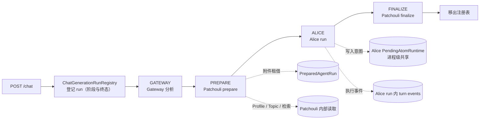
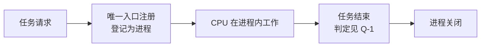
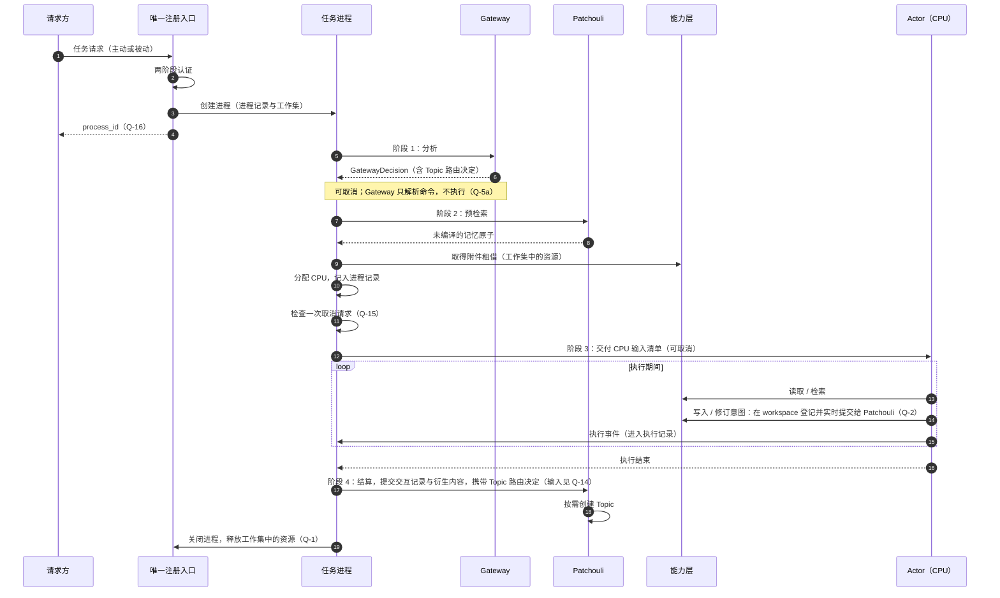
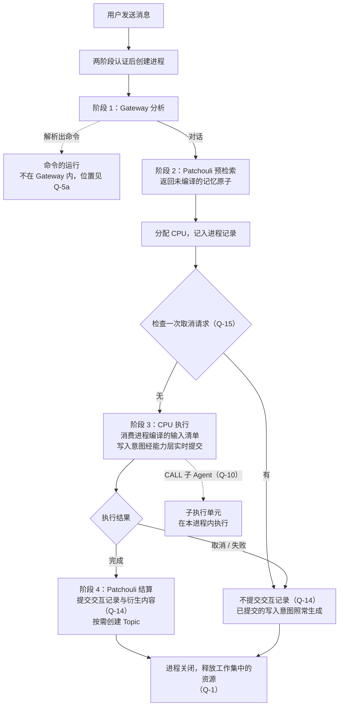
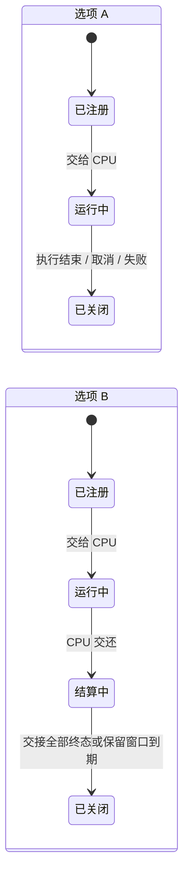

# 任务进程表与任务请求唯一注册入口

**文档状态**：Idea，未形成实施承诺
**记录日期**：2026-09-27，内容自 [Workspace 网络与任务进程架构](./workspace-network-task-process-architecture.md)第一部分拆出

## 0. 文档性质

owner 于 2026-09-27 将“任务进程表与任务请求唯一注册入口”定为 v0.7.0 当前唯一的有效计划方向。本文是形成该 Plan 之前的集中讨论载体，本身不是 Plan。同日决定的 v0.7.0 范围（M-5）、迁移方式（M-1）与首条迁移流程（M-3，Alice 的 chat 链路）见总 Idea [第 6.1 节](./workspace-network-task-process-architecture.md#61-已决定事项)。

- 内容自总 Idea 第一部分拆出：前提 2.2、现状事实 3.1/3.2/3.5、流程图 4.2–4.4 与问题 Q-1–Q-10、Q-14。问题编号沿用原编号，已有引用继续成立。全局拓扑、Import Bus（Q-11–Q-13，原“被动输入”）、迁移问题（M-1–M-7）与认证授权（第三部分）仍在总 Idea，关联见第 5 节。
- 现状事实按 2026-09-27 的代码重新核对，路径为包分层重构后的位置。
- 流程图只画出前提已经确定的部分；依赖待决问题的内容标注问题编号。
- 待决问题只列出选项及其影响，不替 owner 作出选择；选项顺序不代表倾向。owner 已作出的决定注明日期，记录在对应位置：第 1.1 节（请求方的分类）、第 1.2 节（任务进程的结构）、Q-1、Q-2、Q-3、Q-4、Q-5、Q-7、Q-8、Q-9、Q-10、Q-14、Q-15、Q-16。
- workspace 包的现有实现（A2 已实施部分）不作为本方向的前提，形成 Plan 时重新调查（总 Idea 第 6.1 节）。2026-09-28 已完成调查，结论与 workspace 的子包划分见总 Idea [D-9](./workspace-network-task-process-architecture.md#d-9-chat-编排与-chat-run-注册表的最终归属)。
- **实施进度（2026-09-28）**：本方向的第一批实施已完成并晋升为当前事实——1.2 的进程表落位（进程表与 chat 四阶段骨架迁入 `workspace.process`）、Q-15 的取消收口与 Q-16 的 `process_id` 标识，见[已归档计划](../archive/plans/v0.7.0-task-process-table.md)与[应用服务](../system/application-services.md)。第 2 节的现状事实保留为迁移前的代码快照，不再描述当前实现。
- **实施进度（2026-09-29）**：第二批实施已完成并晋升为当前事实——1.2 中 Patchouli prepare 与结算的拆分：prepare 只做 Topic 与检索，CPU 分配（Profile 解析、附件租借与编译、记忆编译、`CPUInputManifest`）由进程完成，附件租借由进程工作集持有并随进程结束释放，见[已归档计划](../archive/plans/v0.7.0-task-process-prepare-split.md)、[应用服务](../system/application-services.md)与[子系统公共契约](../contracts/subsystem-contracts.md)。1.2 中的其余内容（Topic 按需创建、写入意图迁移等）仍未实施。
- **实施进度（2026-09-30）**：第三批实施已完成并晋升为当前事实——1.2 中结算阶段的中立输入：进程在进入 finalize 前封口交互记录 `InteractionPayload`（MTP 轨迹经 core 归约器得到），Patchouli finalize 改为接收 `PreparedAgentRun` 与 `InteractionPayload` 并原样提交，不再接收 `AgentRunResult`，版本目标第 1 条收口；见[已归档计划](../archive/plans/v0.7.0-task-process-finalize-neutral-input.md)与[子系统公共契约](../contracts/subsystem-contracts.md)。`InteractionPayload` 在写入意图实时派发实现前仍携带 `materialize_tasks`。
- **实施进度（2026-10-01）**：第四批实施已完成并晋升为当前事实——1.2 中的 CPU 端口：`workspace.contracts` 定义对象端口 `CPUPort` 与 CPU 中立的执行结果 `CPUExecutionResult`（取代 `AgentRunResult`，不含 `mtp_iterations`/`total_iterations`），任务进程只经组合根注入的端口调用 CPU，交互事件原样透传、终态结果单独产出；Alice 的流式与非流式合并为以 `stream` 参数控制的统一入口与单一路由，并以 `AliceCPU` 实现端口；测试 CPU 在没有 Alice 路由的情况下跑通任务进程，版本目标第 2 条达成。见[已归档计划](../archive/plans/v0.7.0-task-process-cpu-port.md)与[子系统公共契约](../contracts/subsystem-contracts.md)第 4 节。CPU 的选择机制与 actor 对应 CPU 的映射仍待后续设计。
- **实施进度（2026-10-01，第五批）**：命令只解析不执行已实施并晋升为当前事实：Gateway 的命令结果只携带解析结果（解析模型移入 `core.protocol.gateway`），命令分发与执行已删除，任务进程按解析状态产生命令终态，内置命令暂时不可用；见[已归档计划](../archive/plans/v0.7.0-task-process-command-parse-only.md)与 [Gateway 全局命令](../gateway/commands.md)。本方向在 v0.7.0 内的批次至此全部完成。1.2 中的 Topic 按需创建与写入意图分别归外部会话与 Topic 投影、写入意图迁移两个方向；进程记录与工作集中尚未实施的部分见 1.2“进程记录与工作集”的实施状态。

## 1. 前提（owner 提出）

类比映射见总 Idea [第 2.1 节](./workspace-network-task-process-architecture.md#21-类比映射)：Workspace 对应 ME 网络，Patchouli 对应存储系统，任意 Actor 对应合成 CPU，一次任务请求对应一个任务进程。

1. 运行一个任务，需要为它保留一个“合成进程”；CPU 在进程内工作。
2. CPU 必须在 Workspace 的一个集中区域里工作，但这件事不由单一的 runtime 环境承担。原先把 Workspace runtime 当作 CPU 真实工作区的观念是半对半错。
3. 任意任务请求从**唯一入口**注册为一个进程，直到任务结束进程才关闭。这是新架构下 Workspace 网络的核心运作逻辑。
4. 请求方不只有用户主动下单；满足指定条件的被动请求方（类比合成卡、ME 请求器）也可以向网络创建任务。两类请求方的定义与区分标准见 1.1。
5. 现有实现中与此最接近的是 chat application service 的 run 注册表：用户发出指令后，注册一个独立的 chat generation run。

### 1.1 请求方的分类（owner，2026-09-27）

请求方只有两类：

| 类别 | 定义 | 例子 |
|:---|:---|:---|
| 主动请求 | 用户发出的指令主动且即时地驱动接下来的任务进程 | 经 Alice 的 chat 链路；未来以 controller 模式接入的外部 harness |
| 被动请求（Passive） | 由条件触发；用户设定之后不再主动发出请求 | 最常见的是定时任务与队列任务 |

- **区分标准是“即时”**：进程在用户指令到达的那一刻创建，即为主动请求；否则为被动请求。队列任务虽由用户提交，但进程要等条件满足时才创建，因此属于被动请求。
- **术语**：“被动（Passive）”一词保留给被动请求体系。现有的 Passive Ingress 链路不是请求方，总 Idea 称其为 Import Bus；它已从核心全局拓扑断开，不在 v0.7.0 计划内（总 Idea [2.3](./workspace-network-task-process-architecture.md#23-import-bus原被动输入)、6.1）。
- 请求方类别与执行者（CPU）是两个维度：controller 模式下，请求方是在 HiveMemory 入口发出指令的用户，外部 harness 是 CPU；plugin 模式下的对话不经注册入口（[外部 Actor Idea](./external-actor-registration-and-runtime-access.md#11-两种接入模式owner2026-09-27) 1.1）。

以下对象不是请求方：

| 对象 | 定位 |
|:---|:---|
| CALL 派生的子执行单元 | 在父 Agent 的任务进程内执行，不能请求新进程（Q-10） |
| 管理员直接通道 | 不是请求；性质更接近 CPU，直接执行 operation，不经注册入口、不建进程（总 Idea 第 15 节） |
| Patchouli 的记忆任务 | 给后台系统的任务，不暴露给 Agent（Q-7） |
| plugin 模式下的外部 harness | 对话由外部 harness 管理，不经注册入口；以不建进程的方式经能力层访问（外部 Actor Idea 1.1） |

被动请求的 principal 由谁承担（总 Idea P-5b；owner 倾向由登记的 Agent 反推）仍待决；被动请求只存在于 controller 模式。外部 Actor 的形态已于 2026-09-27 审议为 plugin 与 controller 两种接入模式，请求方类型与认证 principal 的关系按两种模式的定义理解，见[外部 Actor Idea](./external-actor-registration-and-runtime-access.md#11-两种接入模式owner2026-09-27) 1.1。

### 1.2 任务进程的结构（owner，2026-09-28）

> 2026-09-28：本节中 chat 链路的进程表落位已随第一批实施晋升为事实（`workspace.process`），取消收口规则（Q-15）同步落地。
>
> 2026-09-29：“Patchouli prepare 与结算的拆分”中的 prepare 退化、进程编译、附件与 Profile 三项已随第二批实施晋升为事实；Profile 解析时点按中间态放在 prepare 之前。Topic 按需创建尚未实施。
>
> 2026-09-30：结算阶段的中立输入（进程封口交互记录）已随第三批实施晋升为事实。
>
> 2026-10-01：CPU 端口（对象端口、中立执行结果、Alice 统一入口）已随第四批实施晋升为事实。

本节适用于 controller 模式；plugin 模式不建进程（[外部 Actor Idea](./external-actor-registration-and-runtime-access.md#11-两种接入模式owner2026-09-27) 1.1）。

**创建时机与入口**

- 入口只管理任务进程的生命周期（Q-3）。
- 进程在最开始创建：完成两阶段认证后立即创建。此后 Gateway 的分析、记忆上下文等都由进程携带。这样取消在进程容器上响应，完整覆盖后续流程；中间产物与认证信息也都有携带者。
- 不存在“任务类型”。主动请求与被动请求只是触发方式不同，在入口注册这一步就收敛到一起，对入口没有影响。
- 生产入口接入认证网关随 A1 返工进行，排在本方向之后（总 Idea 6.1）。

**四阶段通用骨架**

- controller 模式下，所有任务进程共用四个阶段：Gateway 分析 → Patchouli 预检索 → Actor 执行 → Patchouli 结算。这一划分不受全局拓扑影响（Q-4）。
- `ChatRunPhase` 设置阶段，最初主要是为了取消：四个阶段相对独立，取消需要各自处理，不同阶段的策略也不同（现状见 2.4）。阶段划分同时反映了 chat 链路的实际结构。
- 由此：Gateway 是每个进程的第一阶段，在进程内执行（Q-5）；命令解析在 Gateway 内进行，命令的实际运行不在 Gateway 中（Q-5a）。
- 只有 Gateway 与 Actor 执行两个阶段可以取消；进入 Actor 执行前统一检查一次取消请求（Q-15）。
- 失效条件（分析）：出现装不进四阶段的任务，例如 v0.7.4 Deep Research 需要多轮检索与执行、长期保留研究状态，或被动请求保存的指令无法作为用户消息交给 Gateway 分析。届时需要重新讨论任务类型。

**CPU 分配与输入清单**

- 进入 Actor 执行阶段前完成 CPU 分配，并同步记录到进程中。
- 前面阶段的产出作为面向 CPU 的输入清单，让任意 Actor 都能接收。
- **CPU 端口**（owner，2026-09-30）：进程经对象端口调用 CPU：端口由 workspace 定义（`workspace.contracts`），CPU 实现，组合根注入；不采用总线路由契约。依据是外部 harness 的一份登记派生接入与执行两个侧面（[外部 Actor Idea](./external-actor-registration-and-runtime-access.md#12-harness-登记的两个侧面owner2026-09-30) 1.2）：外部 harness 的驱动多数不是子系统，按路由契约接入需要为每种驱动增加路由常量，或在总线后面再建一层分派。v0.7.0 只需要 Alice 接入；CPU 的选择机制与 actor 对应 CPU 的映射后续设计。
  - **CPU 端口的输出**（owner，2026-10-01）：CPU 的事件流把终态结果与其余交互事件分开，交互事件原样透传；执行结果去掉 `mtp_iterations` 与 `total_iterations` 两个冗余字段。
  - **Alice 的统一入口**（owner，2026-10-01）：Alice 的流式与非流式两条执行路径合并为一个入口，与任务进程的 `run_process` 一样以参数控制是否流式。
  - 2026-10-01：CPU 端口、端口输出与 Alice 统一入口已随第四批实施晋升为事实，见[子系统公共契约](../contracts/subsystem-contracts.md)第 4 节。

**进程记录与工作集**

任务进程是运行时的状态容器，容纳任务状态与中间产物。它分为两部分，按“进程关闭时有没有义务”划分：

| 部分 | 内容 | 性质 |
|:---|:---|:---|
| 进程记录（控制面，由进程表持有） | 进程标识 `process_id`（Q-16）、身份与访问 context、请求方式（主动或被动）、当前阶段、待处理的取消请求、终态、CPU 分配 | 字段固定，有类型 |
| 工作集中的值 | GatewayDecision（含 Topic 路由决定）、预检索得到的记忆原子、执行记录 | 不可变，关闭时无需处理 |
| 工作集中的资源 | 附件租借 | 进程关闭时必须释放或补偿，无论从哪个阶段结束 |

- 槽位可以动态，值必须有类型：哪些槽位被填上由进程自己决定（例如命令进程只有 GatewayDecision），但每个槽位都有声明的类型与所有者；不使用 `dict[str, Any]` 这类无类型载体。
- 进程关闭时释放工作集中登记的资源，取代现有分散的清理：`finally` 中的 prepared run 清理、finalize 中的租借释放、临时话题的补偿（2.5）。
- 写入意图不在工作集中：它在 workspace 登记，生命周期与进程完全解耦（Q-1、Q-2，[写入意图迁移 Idea](./pending-intent-migration.md#01-owner-的决定2026-09-28) 0.1）；进程最多在执行记录中保留意图的引用。
- **实施状态**（2026-10-01 复核）：
  - 进程记录（`ProcessRecord`）目前只有 `process_id`、冻结的 `IdentityScope`、当前阶段、停止请求与终态。请求方式、CPU 分配与访问 context 尚未记入：被动请求这一阶段不考虑（Q-6），CPU 的选择机制后置，访问 context 随 A1 返工取得。（2026-10-03 注：进程记录在进程关闭时从进程表移除，与进程同寿；按 Q-3a 由它持有访问 context，与[身份与访问体系 Idea](./identity-and-access-model.md)不变量 3 一致。进程记录如何持有身份见该 Idea I-8（选项 C：只持有 context 与进程元数据，不保存身份）。`TaskProcess` 反向持有进程表与各类组件、自行登记与注销的问题见 [Todo](../todo/task-process-container-ownership.md)。）
  - 工作集（`ProcessWorkingSet`）持有 prepare 结果、附件租借与附件编译得出的实际使用引用。GatewayDecision 与 CPU 执行结果目前由编排骨架以局部值持有，尚未成为工作集槽位；Topic 路由决定跨阶段传到结算是 Topic 按需创建的一部分（本节“Patchouli prepare 与结算的拆分”）。
  - `PreparedAgentRun` 已不再回传用户消息与 GatewayDecision，两者由进程自己持有。

现有对象的去向：

| 现有对象 | 去向 |
|:---|:---|
| `ChatGenerationRunRegistry` | 演化为进程表，位于 workspace 的 `process` 子包（总 Idea [D-9](./workspace-network-task-process-architecture.md#d-9-chat-编排与-chat-run-注册表的最终归属)） |
| `ChatGenerationRun` | 演化为进程记录 |
| `interaction_id` / `generation_id` 作为进程标识的用法 | 由 `process_id` 取代（Q-16） |
| `PreparedAgentRun` | 拆散：GatewayDecision 与附件租借进入工作集；记忆原子、编译后的记忆与附件文本进入 CPU 输入清单；`AgentRunContext` 中编译好的记忆文本改由进程编译（2026-09-29 修订）；`StreamPrelude` 改由进程从自身状态推导 |

**Patchouli prepare 与结算的拆分**

- prepare 退化为只执行一轮预检索，返回未编译的记忆原子；产出 `AgentRunContext` 的步骤移到新流程。
  - **编译由进程完成**（owner，2026-09-29；修订原记录中的“由 CPU 一侧编译”）：进程在分配 CPU 之后，调用共享引擎 `MemoryCompiler` 编译本轮检索结果，把编译后的文本与原始记忆原子一起放入输入清单；CPU 只决定文本在提示词中的位置。理由：编译算法本就是共享的 L2 引擎，已有 Patchouli prepare、Passive Ingress、Alice MTP、Alice CALL、向量存储与 reranker 等调用方；在 controller 模式下，由进程调用可以让外部 harness 的 adapter 不必各自重复调用逻辑。
  - 原记录的理由“编译结果依赖 Alice 的 alias 体系”有误：`engines/memory_compiler` 对 `agent_runtime.aliases` 的依赖只在编译 Alice 的 MTP 解析结果（`ResolveResult`，即 MTP READ 的返回）时出现；编译检索结果（`RETRIEVAL_CONTEXT`）使用记忆自身的 alias，与 Alice 无关。MTP READ 在执行循环中的返回仍由 Alice 的 MTP runtime 编译。
  - 编译的预算与目标将来由 CPU 在分配时声明；在只有 Alice 一个 CPU 时，沿用现有配置。
- 附件脱离 Patchouli：附件租借作为工作集中的资源。**附件由进程取得租借并编译**（owner，2026-09-29）：进程据编译结果得知本轮实际用到的附件，交给结算阶段。
- Topic 将与 conversation session 解耦，不再承担上下文（Q-9）。因此不再需要“先建临时话题”：Gateway 的 Topic 路由决定作为工作集中的值，跨阶段传递到结算，提交后依此按需创建 Topic。现有临时话题的补偿（Patchouli 的 prepared run 清理路由）随之不再需要。
  - 实际使用的对话上下文由 ConversationSession 提供，原样积累，不再由外界干涉；Topic 作为内部记忆生成的资料，Gateway 话题路由与 Topic 只为记忆生成服务（Q-9）。conversation session 不是记忆的材料来源（owner，2026-09-28）。
  - 影响：前端以 SSE 事件 `topic_info` 确认本轮的 Topic（[Chat 工作区](../frontend/chat-workspace.md)），该事件目前在 prepare 之后、Alice 执行之前发出。Topic 改为提交后创建，而进程在交互被提交队列接纳后就结束（Q-1），进程结束时新 Topic 可能还没有路由确定；Topic 又只为记忆生成服务（Q-9）。这个事件的时点、含义，以及前端“当前 Topic”的概念都需要重新设计。2026-09-28 已决定：取消“当前 Topic”概念，`topic_info` 改为进程结束后的异步记忆标注，前端回归 session 模型（[外部会话与 Topic 投影 Idea](./external-session-and-topic-projection.md#01-会话模型与-topic-池owner2026-09-28) 0.1）。
- Agent Profile 的 `allowed_mtp_verbs` 与 `allowed_sys_tools` 演变为 workspace 能力层的 operation 控制，对所有 CPU 生效（总 Idea P-2、P-10，见其 15.4）。prepare 不再解析 Profile。**Profile 在 CPU 分配时由进程解析**（owner，2026-09-29）：暂时直接调用 Patchouli 的公开路由，不经能力层。原因是能力层的 `get_agent_profile` 需要访问上下文，而生产入口要到 A1 返工才取得；它依赖的 Profile 缓存也没有失效机制（`ProfileCache.evict_source` 没有调用方）。两者都具备后再改经能力层。
  - **解析时点的中间态**（owner，2026-09-29）：Profile 暂时在 Gateway 之后、Patchouli prepare 之前解析。当前 prepare 会按路由决定预先新建 Topic，话题池已满时还会先按 LRU 结算一个已有话题；若 Profile 在 prepare 之后才失败，失败的请求会留下这些不可逆的副作用。Topic 的新建与驱逐改到 interaction 提交之后（本节“Topic 不再预先创建”）以后，Profile 可以回到 prepare 之后的 CPU 分配步骤。
- 结算阶段：现有 finalize 接收 Alice 的 `AgentRunResult`，用 ActionReducer / TraceReducer 从 turn events 归约 MTP 轨迹，`materialize_tasks` 是 PendingAtom 的物化任务（2.5）。写入意图改为经能力层实时提交之后，结算阶段只提交交互记录与相应的衍生内容，随后关闭进程（Q-1）；交互记录采用 `InteractionPayload`（Q-14）。
  - **交互记录由进程组装**（owner，2026-09-29）：进程组装最终的交互记录 `InteractionPayload` 交给结算阶段，结算阶段不再接收 `AgentRunResult`（版本目标第 1 条）。`PendingAtomMaterializeTask` 这个类继续存在；在写入意图的实时派发实现之前，`InteractionPayload` 仍携带 `materialize_tasks`。CPU 端口放在其后的一批。（2026-09-30 已实施并晋升为事实，见[子系统公共契约](../contracts/subsystem-contracts.md) 3.2。）
  - 分析：被动链路已经由提交方（System 的 turn buffer）自行组装 `InteractionPayload`；ActionReducer 与 TraceReducer 位于 core，进程调用它们归约轨迹不形成第二套规则。

**v0.7.0 版本目标**：以下四条是 v0.7.0 的版本目标（owner，2026-09-28；记录见总 Idea [6.1](./workspace-network-task-process-architecture.md#61-已决定事项)）：

1. Patchouli 的公开路由既不产出、也不接收 Alice 专属的类型，包括 `AgentRunContext`、`StreamPrelude`、`AgentRunResult` 与编译好的记忆文本（2026-09-30 已随第二、三批实施达成；`InteractionPayload` 过渡期仍携带 `materialize_tasks`）；
2. 一个非 Alice 的 CPU（测试中的替身即可）能跑完整个任务进程，不需要改动进程与入口的代码（2026-10-01 已随第四批实施达成）；
3. 取消与清理都经过进程容器：进程关闭时释放已登记的资源，取代 Patchouli 的清理路由与 chat 编排中的补偿；每个阶段的取消都能通过容器接口测试（2026-10-01：取消与关闭已收口到进程容器，`TaskProcess.close()` 统一释放附件租借、关闭 CPU 输出流并请求 cleanup，各阶段的取消经进程服务接口测试；剩余的 Patchouli cleanup 路由随 Topic 按需创建移除，归外部会话与 Topic 投影方向）；
4. 命令、主动请求与被动请求经同一入口注册（被动请求的实现范围见 Q-6；命令系统后置，v0.7.0 内现有内置命令暂时不可用，见 Q-5a）。2026-10-01：被动请求按 Q-6 这一阶段不考虑；命令与主动请求经同一入口登记为进程、命令只解析不执行，已随第五批实施达成，本条在这一阶段收口。

## 2. 现状事实（代码核对，2026-09-27；迁移前快照，2026-09-28 起由 `workspace.process` 取代）

### 2.1 Chat run 注册表

`ChatGenerationRunRegistry`（原 `src/hivememory/alice/application/chat_control.py`，已随第一批实施删除）以 `interaction_id` 为键登记 run，重复登记直接拒绝；提供 get / cancel / status，控制请求只比较 Workspace 身份。

- `interaction_id` 由 server 的 chat 路由在进入服务前生成（`interaction_{uuid}`），`generation_id` 与它取值相同；
- SSE 的第一个事件 `generation_id` 在 Gateway 阶段之前发出；前端据此发起停止请求，请求体携带 `generation_id`。

- 阶段枚举 `ChatRunPhase` 把 chat 编排写死：`CREATED → GATEWAY → PREPARE → ALICE → FINALIZE → TERMINAL`；
- 注册表本身不持有工作状态：附件租借在 Patchouli prepare 返回的 `PreparedAgentRun` 中，写入意图在 Alice 的 `PendingAtomRuntime` 中，执行事件在 Alice run 中；
- 注册与编排都在 `chat_service.py` 内完成（原 `src/hivememory/alice/application/chat_service.py`，已随第一批实施迁往 `workspace/process/service.py`）；run 记录终态后由 `close` 移出注册表。

### 2.2 写入意图的现有寿命

- 每个 AliceRuntime 只创建一个 `PendingAtomRuntime` 实例（[`alice/runtime/core.py`](../../src/hivememory/alice/runtime/core.py)），主帧与子帧共享；
- 任何一个根 run 以 COMPLETED 收尾时，[`AgentRuntime.finalize_run`](../../src/hivememory/agent_runtime/runtime.py) 都会调用 `evict_by_run`：删除上一次已标为 EXPIRED 的意图，并把**其他** run 中已离开 in-flight 的意图标为 EXPIRED；非 COMPLETED 的 run 调用 `cancel_run`；
- 因此一条已结算意图还能保留多久，取决于其后有多少个根 run 完成，其中也包括其他用户的 run。意图在事实上比产生它的 run 活得更久，但没有明确的持有者与保留期限。

### 2.3 记忆库内部工作

记忆生成（独立业务 lane）、Topic 的空闲/LRU 结算，以及在全局维护调度器上注册的维护任务，目前都在 Patchouli 或 System 调度设施内部运行，不由任何 Actor 执行。

记忆任务的现有暴露面：能力层的 [`MemoryTaskApplicationService`](../../src/hivememory/workspace/capability/memory_tasks.py) 为 HTTP 管理路由 `/api/v1/memory-tasks` 提供列表、查询与取消；chat 编排在 finalize 返回后把本轮产生的记忆任务标识放入 SSE 事件（`memory_task_ids`）。MTP 没有与记忆任务相关的动词。

### 2.4 各阶段的取消行为

原 `chat_service.py` 中各阶段的取消行为（2026-09-28 核对，迁移前快照）：

| 阶段 | 取消行为 |
|:---|:---|
| Gateway | 可以中断：直接取消阶段 task |
| Prepare | 不可中断：在它前后各检查一次停止请求，事后经 Patchouli 的 prepared run 清理路由补偿临时话题 |
| Alice | 可以中断：Alice 以 `CANCELLED` 状态结束 |
| Finalize | 拒绝取消（`already_finalizing`）；Patchouli 内部以 shield 保证继续完成已接管的工作 |
| 断流 | 由 `finally` 统一兜底：关闭 Alice 子流、prepare 成功而 finalize 未成功时清理 prepared run、移出注册表 |

客户端断开时，server 的 chat 路由以同一标识发起取消（reason 为 `client_disconnected`）。

命令由 Gateway 的 `GATEWAY_PROCESS` 路由内的命令分派器解析并执行，返回执行结果；Gateway 识别出命令时，chat 直接以命令结果结束，不进入 prepare。现有内置命令为 help、commands、clear（由客户端执行）与 runtime.status，没有服务端副作用。

### 2.5 Patchouli prepare 与 finalize 的现有内容

[`PatchouliService`](../../src/hivememory/patchouli/service.py) 的 `prepare_agent_run` / `finalize_agent_run`（2026-09-28 核对）：

| 阶段 | 现有内容 |
|:---|:---|
| prepare | 解析 Agent Profile；解析或新建 Topic，读取候选话题与话题上下文；检索并用 `MemoryCompiler` 编译记忆文本；取得附件租借并由 AttachmentCompiler 编译附件；组装 `AgentRunContext`、`StreamPrelude` 与 `PreparedAgentRun` |
| finalize | 接收 `AgentRunResult`，归约 MTP 轨迹并组装 `InteractionPayload`；提交交互并等到 applied（排序键为 `topic:{topic_id}`）；释放附件租借；派发写入意图的物化并记录检索命中 |
| cleanup | 清理 prepare 新建且仍为空的临时话题 |

Alice 的提示词以 Topic 的 `state_summary` 与最近 5 个 block 作为对话上下文（[`prompts/assembler.py`](../../src/hivememory/prompts/assembler.py)）。

## 3. 流程图

### 3.1 任务进程的生命周期（前提部分）

前提只确定“从唯一入口注册、任务结束后关闭”。“任务结束”的判定见 Q-1（2026-09-28 已决定：交互被提交队列接纳后关闭）。

### 3.2 任务进程的四阶段骨架（controller 模式）

依据 1.2。依赖待决问题的部分标注问题编号。图中写入意图的实时提交是写入意图迁移第 2 步完成后的形态；第 1 步期间派发仍在结算阶段（写入意图迁移 Idea 0.1）。

### 3.3 一次 chat 请求在骨架中的走向

## 4. 待决问题

每个问题只列出选项及其影响，不作选择；选项顺序不代表倾向。

### Q-1 进程何时关闭

**背景**：AE2 中合成任务结束即产物回到网络存储，是同步、可确认的。HiveMemory 中交互要等 applied 才进入 Topic，写入意图的物化可能需要数十秒以上，结果也可能被丢弃。现状下意图的寿命见 2.2。

| 选项 | 内容 | 影响 |
|:---|:---|:---|
| A | 执行结束即关闭：Actor 执行完毕、交接已提交后关闭进程 | 结算发生在进程关闭之后；尚未结算的意图需要进程之外的持有者，其保留期限需另行定义 |
| B | 两阶段关闭：运行中 → 结算中 → 关闭。结算中的进程已不占用 CPU，仍留在进程表中；在所有交接到达终态或保留窗口到期后关闭 | 意图在关闭前归该进程；进程表中存在不占用 CPU 的进程，需要定义保留窗口、容量与停机时的处理 |

**owner 决定（2026-09-28）**：进程仍在现有 finalize 结束的时点关闭（选项 A 的方向）。

- 写入意图的提交成为 workspace 能力层的一个方法，可以实时响应 Actor 的请求，不必等到一轮对话结束；收尾只需提交对话记录与相应的衍生内容，这一步基本没有开销，随后关闭进程。
- 写入意图的生命周期与进程完全解耦，生成与结算由 Patchouli 的 memory generation controller 单独管理；登记位于 workspace，流程见[写入意图迁移 Idea](./pending-intent-migration.md#01-owner-的决定2026-09-28) 0.1。选项 A 影响中“进程之外的持有者”即 workspace 的登记。
- 实时提交时当前一轮的交互记录还没有进入 Topic，生成材料目前只能“舍弃当前一轮”（同上 0.1 选项 A）；取消与失败不再丢弃已提交的写入意图。
- 收尾阶段等到交互被提交队列（InteractionSubmissionQueue）成功接纳，进程即可退出并结束，不再等待 applied（owner，2026-09-28）。
  - 附件租借因此在接纳时随进程关闭释放，早于现在的“交互与后置工作结束后释放”。Artifact promotion 在生成时按 `binding.asset_ref` 重新取得内容（[Chat 附件链路](../system/attachments.md)第 4 节），不依赖本轮的租借（分析）。
  - 对 `topic_info` 的影响见 1.2（已决定改为异步的记忆标注）。

### Q-2 写入意图（中间产物）的可见范围

**背景**：AE2 中合成 CPU 存储的中间材料不出现在网络存储视图中。现状下意图在同一 AliceRuntime 内共享，可见性按 `identity_scope` 相等判断。原 A4 计划的目标之一是外部 Actor 与后续 run 都能读回意图，其候选设计现见[写入意图体系迁移](./pending-intent-migration.md)。

| 选项 | 内容 | 影响 |
|:---|:---|:---|
| A | 仅本进程可见（包括在本进程内执行的 CALL 子执行单元，见 Q-10）；结算后以正式记忆出现在网络中 | 后续任务在结算前读不到上一个任务的意图别名，与现状在同一 AliceRuntime 内可读不同 |
| B | 本进程及显式声明的前驱进程链可见 | 需要定义前驱的声明方式、校验与链长 |
| C | 在 Workspace 内按 policy 可见（原 A4 方向） | 意图需要 Workspace 级的登记与可见性策略，与“中间产物归进程”的类比不同 |

外部 Actor 的 plugin 模式不建进程（[外部 Actor Idea](./external-actor-registration-and-runtime-access.md#11-两种接入模式owner2026-09-27) 1.1），经 MCP 提交的写入意图没有所属进程；各选项需要一并考虑这种情形。

**owner 决定（2026-09-28）**：写入意图的读写一致性不因实时提交而改变。在记忆正式落库之前，PendingAtom 仍是替代正式记忆的唯一机制，因此直到落库之前都必须对后续进程可回读（选项 C 的方向）。

- 第一版采用简单实现：PendingAtom 不设 policy，默认对全 workspace 开放。
- PendingAtom 不参与检索，能拿到其别名的一般只有写入它的 agent，别人几乎无法访问；狭义上能做到“中间产物归进程”。
- 登记与进程解耦后，plugin 模式与 CALL 子执行单元的写入同样适用，上述约束随之消解。
- 结算后句柄的生命周期需要重新设计，兼容期内暂不回收；可见范围放宽与别名强度的分析见[写入意图迁移 Idea](./pending-intent-migration.md#01-owner-的决定2026-09-28) 0.1。

### Q-3 唯一注册入口的职责边界

**背景**：现有注册表把 chat 阶段写死在枚举中，且不持有工作状态（2.1）。

| 选项 | 内容 | 影响 |
|:---|:---|:---|
| A | 入口只负责注册与通用生命周期：进程标识、准入认证、请求方、状态、取消、停机收尾；执行步骤由各任务类型定义 | 需要任务类型的登记与分派机制；入口不认识具体流程 |
| B | 入口同时承担各任务类型的编排 | 入口需要认识全部任务类型，新增任务类型需要改动入口 |
| C | 其他划分 | —— |

**子问题 Q-3a**：哪些现有工作状态进入进程工作区。候选包括写入意图、附件租借、执行轨迹、访问上下文；每一项都可以选择进入进程，或留在网络共享设施 / 其他位置。

**子问题 Q-3b**：唯一入口指唯一的注册点，还是同时要求唯一的传输入口（HTTP、外部协议、触发器是否都经同一个对外端点）。

**owner 决定（2026-09-28）**：入口只管理任务进程的生命周期（选项 A 的方向），并且不存在任务类型（1.2），选项 A 影响中“任务类型的登记与分派机制”因此不再需要。

- Q-3a 已确定（1.2）：访问 context 进入进程记录；附件租借作为工作集中的资源；执行轨迹作为工作集中的值（执行记录）；写入意图不进入进程，在 workspace 登记（Q-1、Q-2）。
- Q-3b 仍待决。

### Q-4 “合成树”在 HiveMemory 中的形态

**背景**：AE2 的合成计划由样板确定性推导；Agent 任务是在线的“生成—行动—观察”循环（见 [AE2 类比 §1](./ae2-hivememory-architecture-analogy.md#1-结论摘要)）。ROADMAP 中通用 workflow / DAG 为 Unscheduled。

| 选项 | 内容 | 影响 |
|:---|:---|:---|
| A | 任务类型只定义固定骨架（如 chat：分析 → 读上下文 → 执行 → 交接），骨架内部由 Actor 在线决定 | 不需要计划表示与规划器；骨架随任务类型维护 |
| B | 进程启动时计算显式执行计划（任务图），CPU 按计划执行 | 需要计划表示、规划器与计划失败语义，接近 AE2 类比中的 Job Graph |
| C | 按任务类型选择 A 或 B | 两套机制并存 |

**owner 决定（2026-09-28）**：controller 模式下只有一套固定骨架，即四阶段通用骨架，骨架内部由 Actor 在线决定（选项 A 的方向，只有一种骨架）；失效条件见 1.2。

### Q-5 Gateway 在新架构中的位置

**背景**：Gateway 现有 `ACTIVE_CHAT`（命令、查询分析、检索计划、话题路由）与 `PASSIVE_MEMORY`（分析、话题路由、价值信号）两种模式。

| 选项 | 内容 | 影响 |
|:---|:---|:---|
| A | 作为特定任务类型（如 chat）在进程内的入口分析步骤 | 其他任务类型不经 Gateway |
| B | 作为唯一注册入口的通用前置步骤，对所有任务请求执行 | 所有任务类型共享入口分析，Gateway 需能区分任务类型 |
| C | 其他 | —— |

**子问题 Q-5a**：Gateway 命令（如 `/compact` 一类）是注册为任务进程，还是作为直接的网络操作执行而不建立进程。

**子问题 Q-5b**：`PASSIVE_MEMORY` 模式的去留，取决于总 Idea 的 [Q-11](./workspace-network-task-process-architecture.md#q-11-import-bus-交互的-topic-落位) 与 [Q-12](./workspace-network-task-process-architecture.md#q-12-import-bus-交互的价值信号worth_saving)；Import Bus 不在 v0.7.0 范围（总 Idea 6.1）。

**owner 决定（2026-09-28）**：

- **Q-5**：Gateway 是每个任务进程的第一阶段，在进程内执行（1.2）。不存在任务类型，所以不是选项 A 的“只属于特定任务类型”；它也不在注册之前执行，所以不是选项 B。
- **Q-5a**：命令所在的请求同样注册为进程。命令解析在 Gateway 内执行，但命令的实际运行不在 Gateway 中：后续指令会与用户请求同时出现，不能让 Gateway 实际执行命令（同日修订，原记录为“命令在第一阶段结束”）。命令在进程中何时、由谁运行，尚未决定。
- **命令系统后置**（owner，2026-09-28）：命令系统不在 v0.7.0 计划内完整接回；现有四个内置命令（help、commands、clear、runtime.status）在 v0.7.0 内设为暂时不可用。
- **“暂时不可用”的含义**（owner，2026-10-01）：命令仍由 Gateway 解析（Gateway 已有的功能），但不会执行。
- **解析与执行分开**（owner，2026-10-01）：Gateway 的命令解析与执行分开，Gateway 只输出解析结果；现有的命令分发与执行（dispatcher 与 handler）删除。命令在进程中何时、由谁运行，仍随命令系统后置决定。（2026-10-01 已随第五批实施晋升为事实。）
- Q-5b 仍待决。

### Q-6 被动请求的范围

**背景**：被动请求由条件触发，用户设定之后不再主动发出请求，最常见的是定时任务与队列任务（1.1）。代码中目前没有面向用户的定时任务或队列任务设施。VISION 阶段 E 把“记忆事件触发 Agent 唤醒”放在前序阶段取得证据之后。

| 选项 | 内容 | 影响 |
|:---|:---|:---|
| A | 当前阶段只在注册请求中保留请求方类型，不实现触发条件与调度 | 入口形状兼容触发方，不交付触发能力 |
| B | 实现一种最小触发机制 | 需要定义触发条件、去重、失败与取消语义 |
| C | 当前阶段不考虑被动请求 | 入口形状以后可能需要调整 |

**owner 决定（2026-10-01）**：选项 C，这一阶段先不考虑被动请求，避免现在做好的接口被后续的设计重新推翻。版本目标第 4 条中的被动请求部分随之不在这一阶段实施。

### Q-7 记忆库内部工作与进程表

**背景**：记忆生成、Topic 结算与维护任务目前在 Patchouli 或调度设施内部运行，不由 Actor 执行（2.3）。在 AE2 中，存储系统的存取不经过合成 CPU。

| 选项 | 内容 | 影响 |
|:---|:---|:---|
| A | 不进入进程表，保留在 Patchouli 内部队列与维护调度 | 进程表只包含由 Actor 执行的任务 |
| B | 全部进入统一进程表 | 进程表成为全局任务表，承担调度职责 |
| C | 部分进入（例如由模型驱动的生成任务进入，纯维护不进入） | 需要明确划分标准 |

**owner 决定（2026-09-27）**：Patchouli 的记忆任务是给后台系统的任务，不暴露给 Agent。

- 该决定排除让记忆任务对 Agent 可见的形态；进程表是否收录这类后台任务（收录时同样对 Agent 不可见）尚未单独决定。
- 现有暴露面见 2.3；[外部 Actor Idea](./external-actor-registration-and-runtime-access.md) 3.5 中涉及任务投影的结果查询需按此重新审视。

### Q-8 外部 CPU 的进程

**背景**：Alice 在进程内运行，注册表能取消它，也知道它何时结束。外部 harness 不受网络控制，更接近 AE2 中“处理样板 → 外部机器”：网络送出材料，等待产物回流。

- **Q-8a 回收方式**：请求方显式关闭 / TTL / 心跳 / 组合。
- **Q-8b 取消语义**：网络对外部 CPU 的取消能做到什么程度（例如吊销访问、丢弃未提交的意图、通知外部方），各项分别是否纳入。
- **Q-8c 粒度**：外部 harness 的一轮对应一个进程 / 一个外部会话对应一个进程 / 由接入适配层决定。

**owner 决定（2026-09-27）**：本问题关联外部 Actor 的形态，严重影响实现，单独审议；v0.7.0 不对外部 Actor 所需的基建作承诺（总 Idea 6.1）。同日审议为 plugin 与 controller 两种接入模式（[外部 Actor Idea](./external-actor-registration-and-runtime-access.md#11-两种接入模式owner2026-09-27) 1.1）：本问题只涉及 controller 模式，plugin 模式不建进程；controller 模式作为 v0.7.1 的首个真实外部 harness 接入。Q-8a–Q-8c 仍待决。

### Q-9 对话连续性的承载

**背景**：进程按任务划分后，多轮对话的连续性不在单个进程内。现状下 chat 的连续性来自 Gateway 的话题路由与 Topic 工作集；`ChatRequest.session_id` 只是兼容字段；原 A3 计划设计了 `ConversationSession` 记录，其候选设计现见[外部会话与 Topic 投影](./external-session-and-topic-projection.md)。

| 选项 | 内容 | 影响 |
|:---|:---|:---|
| A | 仅依靠 Topic（记忆库侧） | 不新增会话对象；外部会话标识到 Topic 的映射需另行处理 |
| B | 保留独立的会话记录（作为数据记录，不是运行时容器） | 需要定义会话记录的归属、保留与读取 |
| C | 由进程链（进程声明前驱）承载 | 与 Q-2 选项 B 相关 |
| D | 以上组合 | —— |

外部会话消息的接收与 Topic 投影已定于 v0.7.0 内完成，Alice 为第一个使用者（总 Idea 6.1）；本问题与该 Idea 的设计相互关联。

**owner 决定（2026-09-28）**：选项 B。实际使用的对话上下文由 ConversationSession 提供，原样积累，不再由外界干涉；Topic 作为内部记忆生成的资料，Gateway 话题路由与 Topic 只为记忆生成服务。这是[外部会话与 Topic 投影](./external-session-and-topic-projection.md) Idea 一开始就定下的前提（该 Idea 第 0、3 节）。

- 现状下 Alice 的对话上下文来自 Topic 的 `state_summary` 与最近 5 个 block（2.5），迁移后改由 ConversationSession 提供；
- Topic 不再预先创建，见 1.2；
- 占位计划“话题折叠、Actor 上下文与原始证据统一改造”的背景写的是“话题折叠同时影响 Alice 使用的上下文”，按本决定已不成立。该计划已于 2026-10-01 退回 Idea 后删除（删除前最后版本见 commit `74b5056`），内容按前台与后台分别并入[Turn 内上下文折叠 Idea](./long-running-agent-intra-turn-context-folding.md)与 [Page Folding Raw Evidence Idea](./PatchouliPageFoldingRawEvidenceDesign.md)。

### Q-10 CALL 子 Agent

**背景**：被调用方有不同的 agent_id、Profile 与 MTP 权限。现状下子帧与主帧共享 `PendingAtomRuntime`，子帧写入主帧可见；现有规则是 CALL 只能从根 frame 发起。

| 选项 | 内容 | 影响 |
|:---|:---|:---|
| A | 子进程：带被调用方身份与访问上下文、父进程链接 | 需要定义父子间意图可见性，以及“只有顶层进程可派生子进程”等规则 |
| B | 共用父进程，以 frame 区分 | 父进程的访问上下文需要容纳多个身份与权限 |
| C | 其他 | —— |

**owner 决定（2026-09-27）**：CALL 派生的子执行单元在父 Agent 的任务进程内执行，不能请求新进程，即不建子进程（选项 B 的方向）。父进程的访问上下文因此需要容纳被调用方的身份与权限，子执行单元的认证方式见总 Idea P-5a。

### Q-14 主动进程的交互记录去向

**背景**：Active finalize 与 Passive Ingress 已共用同一提交队列，Active 有 applied gate（总 Idea [3.4](./workspace-network-task-process-architecture.md#34-统一的交互提交队列)）。原 A3/A4 设计中，写入意图的物化需要读取本轮交互所在 Topic 的资料（见[外部会话与 Topic 投影](./external-session-and-topic-projection.md)第 4.4 节与[写入意图体系迁移](./pending-intent-migration.md)第 3 节）。2026-09-27 起 Import Bus（现有 Passive Ingress 链路）已从核心全局拓扑断开，不在 v0.7.0 范围（总 Idea 6.1）；选项 B 依赖该通道。

| 选项 | 内容 | 影响 |
|:---|:---|:---|
| A | 进程自行封口并提交交互记录（与现有 finalize 形态相同） | 同一外部 harness 若同时以 plugin 模式经 Import Bus 上报对话、又以 controller 模式运行任务进程，需要规则避免同一交互被记录两次 |
| B | 进程把执行轨迹作为一份完整交互记录交给 Import Bus；进程自身只读取与提交写入意图 | Import Bus 需要向提交方返回可等待的 applied 回执；Alice 与外部 harness 在记录侧成为同类来源 |

**owner 决定（2026-09-28）**：选项 A。Import Bus 已经断开，现在不考虑它带来的任何效果，并将其排除在现有系统之外（总 Idea [6.1](./workspace-network-task-process-architecture.md#61-已决定事项)），因此选项 B 不成立。选项 A 影响中“同一 harness 以两种模式使用时重复记录”的问题，留待 plugin 模式设计时处理。

- 提交的交互记录采用 `InteractionPayload`：它是 owner 提出的共用提交模型，见[外部会话与 Topic 投影](./external-session-and-topic-projection.md#22-interactionpayload共同封口交互)第 2.2 节；其 `interaction_id` 字段始终取 `process_id` 的值（Q-16）；
- 进程以取消或失败结束时保持现有行为：只有 completed 才允许提交交互记录。已提交的写入意图照常生成，它们的材料按选项 A 本就不含当前一轮，两者一致；
- 这一规则只针对提交给 Patchouli 的交互记录。取消或失败的一轮是否记入 ConversationSession，见外部会话与 Topic 投影 Idea 第 8 节第 6 条。

相关约束：

- 按 v0.7.0 版本目标第 1 条，结算阶段不再接收 `AgentRunResult`，需要 CPU 中立的输入（1.2、2.5）。写入意图改为实时提交后，结算阶段只提交交互记录与衍生内容（Q-1），`materialize_tasks` 随写入意图迁移第 2 步移出交互载荷。
- 提交时携带 Topic 路由决定，Topic 在提交后按需创建（1.2）；现有排序键以 `topic:{topic_id}` 生成，新建 Topic 的交互在提交时还没有 topic_id。

### Q-15 各阶段取消策略的声明方式

**背景**：各阶段的取消策略不同（2.4）；取消改在进程容器上响应（1.2）。

| 选项 | 内容 | 影响 |
|:---|:---|:---|
| A | 各阶段进入时向进程容器声明自己的取消策略（可以中断 / 完成后补偿 / 拒绝取消），容器负责执行 | 策略与阶段实现放在一起；容器需要提供声明接口 |
| B | 由四阶段骨架静态定义每个阶段的策略 | 骨架固定时实现简单；阶段策略变化需要修改骨架 |
| C | 其他 | —— |

**owner 决定（2026-09-28）**：只有 Gateway 与 Actor 执行两个阶段可以取消，因为这两块有前台调用 LLM 的行为；进程负责这两块的取消管理。其余地方不设取消响应点，相当于不允许取消；不设置额外的取消策略（选项 B 的方向）。（2026-09-28 已实施并晋升为事实，见[应用服务](../system/application-services.md)第 4 节。）

- 统一在 Actor 执行开始前检查一次取消请求并响应：在预检索、取得附件租借、CPU 分配期间收到的取消请求，在这里生效；结算阶段不可取消（与现状的 `already_finalizing` 相同）。
- 外部取消请求必须带明确的 `process_id`，指明取消哪个任务进程。
- 只有用户有权取消，入口是唯一的 HTTP server 入口（总 Idea [P-7](./workspace-network-task-process-architecture.md#p-7-进程控制操作的授权主体)）。客户端断开时 server 路由发起的取消（2.4）也经这一入口。
- 分析：系统停机时，asyncio task 在任何阶段都会被取消，这不属于外部取消请求；进程容器在这条路径上仍要释放工作集中的资源（AGENTS.md 对 `CancelledError` 传播与资源释放的要求）。

### Q-16 进程标识与交互标识

**背景**：现有注册表以 `interaction_id` 为键，`generation_id` 只是它的兼容投影（2.1）；命令进程不产生交互记录（1.2）。

| 选项 | 内容 | 影响 |
|:---|:---|:---|
| A | 进程标识独立生成；交互标识在需要提交交互时分配或派生 | 需要调整对外的 `generation_id` 兼容投影 |
| B | 继续以 `interaction_id` 作为进程标识，命令进程同样分配 | 不产生交互记录的进程也持有交互标识 |
| C | 其他 | —— |

**owner 决定（2026-09-28）**：删除现有的 `interaction_id` 与 `generation_id` 作为进程标识的用法，改用 `process_id` 作为任意任务进程的唯一标识，向下兼容 `interaction_id` 原先的位置。（2026-09-28 已实施并晋升为事实：server 生成 `process_{uuid}`，RuntimeEvent/SSE/停止契约与前端统一改用 `process_id`。）

- 前后端与 server 契约不再使用 `generation_id`，也不设原拟的 `active_request_id`，统一使用 `process_id`；
- `interaction_id` 这个名字无所谓：`InteractionPayload` 单独保留这一字段名，但始终赋 `process_id` 的值。

影响（分析）：

- 前端契约：SSE 首个事件 `generation_id`、停止请求体、done 事件与 RuntimeEvent 中的 `generation_id` / `interaction_id` 字段、内核终端按 `generation_id` 分组，都改用 `process_id`；
- Qdrant 中的持久数据不保存 `interaction_id`（交互 Artifact 以 `turn_id` 与 `block_id` 记录），其余用法都在进程内：注册表、交互提交队列与 apply journal、perception、`AgentRunContext`、附件绑定的 `first_bound_interaction_id`。改名不需要数据迁移；
- 一个进程最多提交一次交互（Q-14），`process_id` 可以直接作为交互提交的幂等键；
- plugin 模式不建进程，它提交的 `InteractionPayload` 中 `interaction_id` 如何取值，在 plugin 模式设计时处理。

## 5. 相关问题（位于其他文档）

| 问题 | 位置 | 与本文的关系 |
|:---|:---|:---|
| P-4 进程级权限收窄与创建进程的授权 | 总 Idea [第三部分](./workspace-network-task-process-architecture.md#p-4-进程级权限收窄与创建进程的授权) | P-4b 已决定：不开放创建任务进程，只有两种请求方式（总 Idea 15.4）；P-4a 仍待决 |
| P-5 CALL 与触发器的认证 | 同上 | P-5a 与 Q-10、P-5b/c 与 Q-6 相关；P-5b 仍待决，被动请求只存在于 controller 模式 |
| P-6 进程绑定 context 的失效时点 | 同上 | 已决定：context 与进程完全绑定，随进程关闭失效（总 Idea 15.4） |
| P-7 进程控制操作的授权主体 | 同上 | 取消已决定：只有用户经 HTTP server 入口取消（Q-15、总 Idea 15.4） |
| P-9d 进程的定义 | 同上 | 管理员直接通道（方案 C）与前提第 3 条的关系 |
| P-2、P-10 Agent Profile 的权限 | 同上 | 已决定：Profile 的两个 allow 字段演变为能力层的 operation 控制（总 Idea 15.4、本文 1.2） |
| P-1 经网络接入的 Actor 如何证明身份 | 同上 | 与 Q-8 相关；P-1a 已决定：每次请求重新校验身份（总 Idea 15.3） |
| Q-11–Q-13 Import Bus | 总 Idea [第 5 节](./workspace-network-task-process-architecture.md#5-待决问题import-bus) | 不在 v0.7.0 范围；Q-14 已选 A，进程不经 Import Bus 提交交互记录 |
| M-1–M-5 迁移问题 | 总 Idea [第 6 节](./workspace-network-task-process-architecture.md#6-待决问题迁移与现有工作来自前序讨论) | M-1、M-3、M-5 已决定（总 Idea 6.1）：按流程纵切，首条迁移流程为 Alice 的 chat 链路 |
| 会话记录的候选设计 | [外部会话与 Topic 投影](./external-session-and-topic-projection.md) | Q-9 选项 B 的一种形态；Topic 不再承担上下文、不再预先创建（Q-9、1.2） |
| 写入意图的迁移 | [写入意图体系迁移](./pending-intent-migration.md) | Q-1、Q-2 已决定：登记位于 workspace、与进程解耦、第一版不设 policy；v0.7.0 内分两步实施（该 Idea 0.1） |
| 外部 Actor 的接入与运行时访问 | [外部 Actor 的接入登记与运行时访问](./external-actor-registration-and-runtime-access.md) | 两种接入模式：controller 模式（v0.7.1）使用本文的进程模型，plugin 模式（其后的 v0.7.x）不建进程；Q-8 外部 CPU 的进程；Q-3b 传输入口 |

## 6. 形成 Plan 的条件

- 满足 [Ideas 升级规则](./README.md#升级规则)，并遵守[文档治理规范](../DOCUMENTATION.md)第 8.3 节的计划约束：Plan 只能以事实文档、代码、ADR、已归档计划与作为背景的 Idea 为依据，不以另一份活动计划的章节为依据；
- 已决定：M-1（按流程纵切）、M-3（首条迁移流程为 Alice 的 chat 链路）、M-5（v0.7.0 范围、验收口径与四条版本目标），见总 Idea 6.1；任务进程的结构（1.2），包括 Q-3、Q-4、Q-5、Q-5a；Q-1（交互被提交队列接纳后进程退出）、Q-2 与写入意图迁移（纳入 v0.7.0，分两步，见该 Idea 0.1）；Q-9（选项 B）；Q-10；Q-14（选项 A，只有 completed 才提交）；Q-15；Q-16；P-2、P-4b、P-6、P-7（取消）、P-10（总 Idea 15.4）；D-9 与 workspace 的子包划分（总 Idea 第 10 节）；命令系统后置（Q-5a）；会话模型、Topic 池与 `topic_info` 的改造（[外部会话与 Topic 投影 Idea](./external-session-and-topic-projection.md#01-会话模型与-topic-池owner2026-09-28) 0.1）；
- 第一批实施计划：[任务进程表：落位与进程标识](../archive/plans/v0.7.0-task-process-table.md)（进程表迁入 workspace 的 `process` 子包、`process_id` 与取消收口），已实施归档。第二批实施计划：[prepare 拆分与 CPU 输入清单](../archive/plans/v0.7.0-task-process-prepare-split.md)（prepare 只做 Topic 与检索，进程解析 Profile、持有附件租借并编译，输入清单进入 `workspace.contracts`），已实施归档。第三批实施计划：[结算阶段的中立输入](../archive/plans/v0.7.0-task-process-finalize-neutral-input.md)（进程封口交互记录，finalize 不再接收 `AgentRunResult`），已实施归档。第四批实施计划：[CPU 端口与测试 CPU](../archive/plans/v0.7.0-task-process-cpu-port.md)，已实施归档。第五批实施计划：[命令只解析不执行](../archive/plans/v0.7.0-task-process-command-parse-only.md)，已实施归档。v0.7.0 按小批量逐次实施，后续批次各自建立计划；
- 影响首个 Plan 的问题已全部有决定；形成 Plan 时仍需确定 v0.7.0 内各方向的范围与顺序。会话操作的版本已决定：前端改造与新建、恢复两个操作在 v0.7.0，Alice 的压缩约在 v0.7.1（[外部会话与 Topic 投影 Idea](./external-session-and-topic-projection.md#01-会话模型与-topic-池owner2026-09-28) 0.1）；
- 首个 Plan 不以 A1 返工为前提；A1 返工在本计划完成、已有稳定入口之后接入（总 Idea 6.1）；
- owner 对各问题的决定记录在本文对应问题下，并注明日期。
