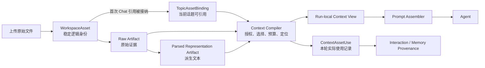

# Workspace MVP 与 Chat Attachments 初步设计

本文是面向 `v0.6.2 Chat Attachments` 的 Workspace 前置设计草案，不是已经冻结的实施 Plan，也不代表当前系统已经具备 Workspace 或附件能力。

本文要解决的问题是：在不提前实现完整 Agent Workspace、Mount、Capability、工具环境和队列管理的前提下，如何建立一个足以承载 Chat Attachment 的资源作用域和资产引用基础，并让后续 `v0.7.0 Document Ingestion` 可以复用同一套来源链。

## 1. 背景与现状

路线图已经为附件和长文档划定了顺序：

```text
Chat Attachment
  -> raw artifact
  -> parsed artifact
  -> 当前 Chat context
  -> 可选的 Interaction / Memory provenance

Document Ingestion
  -> document artifact
  -> chunk / evidence
  -> 可审核候选记忆
```

`v0.6.2` 的文件不应因为上传就直接变成正式记忆。系统需要先保留用户实际提供的原始证据，再保存解析结果，最后根据当前轮次需要编译为 Agent 上下文。大文件异步解析、文档切块和候选记忆属于后续阶段。

当前代码存在几个会阻碍该能力的作用域缺口：

- `Identity` 只有 user、agent、team 和兼容性的 session 字段，没有 Workspace 资源作用域；
- `ChatRequest`、`AgentRunContext`、`ExecutionFrame` 和 `InteractionPayload` 没有独立的 Workspace 坐标；
- `SemanticBuffer`/`TopicData` 主要按 user/topic 管理，尚无资产绑定关系；
- `BaseArtifact` 没有 Workspace 归属，而且 Artifact 引用可以携带物理 URI；
- `KoakumaAtomCache` 的核心 key 只有 alias/UUID，不能避免不同作用域之间的命中污染；
- Artifact filesystem adapter 允许同 ID 覆盖，并通过全局目录递归查找 Artifact，尚无 Workspace-aware index。

因此，Workspace MVP 的目标不是先增加一个容器类，而是冻结资源身份、访问范围、资产生命周期和引用解析契约。

## 2. 核心判断

### 2.1 Workspace 的最小定义

Workspace MVP 定义为：

> 稳定的资源命名空间、访问作用域和资产目录。

它不成为 MemoryLibrary、Alice Runtime、Tool Registry、Work Queue、预算系统和所有缓存的超级管理器。

完整 Workspace 将来可以拥有 Memory、Artifact、Agent、工具、执行环境、策略、预算、队列和审计边界；但 AE2 方向文档建议首先明确 Workspace、Mount、Capability、Run 和 Artifact 的所有权，不立即新增大量运行时类。本稿遵循这一收敛原则。

### 2.2 三种不同生命周期

Workspace、Topic Working Set 和 Run 必须分开建模：

| 层级 | 生命周期 | 主要职责 |
|:---|:---|:---|
| Workspace | 长期 | 拥有资源、定义资源命名空间和访问边界 |
| Topic Working Set | 话题级 | 记录某个话题可重复引用的资产 |
| Run / Context Frame | 单次执行 | 记录本轮实际选择和编译后的上下文 |

附件属于 Workspace，但通常通过 Topic binding 在当前话题内反复使用；属于 Workspace 不等于每轮自动注入。

## 3. 推荐的资源链路



这条链路包含四个重要区分：

1. 用户上传的逻辑资源不是 Artifact 本身；
2. 原始文件和解析文本是不同的不可变 representation；
3. 话题绑定只提供可引用性，不代表自动注入；
4. provenance 只记录本轮实际使用的 representation，不记录所有曾经绑定的资产。

## 4. 必须在 Workspace MVP 中裁定的问题

### 4.1 Workspace 身份、默认 Workspace 与兼容策略

内部资源操作必须使用稳定、非空的 `workspace_id`。第一版以 `main_workspace` 表达 AE2 主网概念，并将它定义为每个用户命名空间内的系统保留 `workspace_key`，而不是可随展示名称修改的全局主键。

推荐模型：

```text
Workspace
  workspace_id = "ws_..."                 # 服务端生成的全局稳定身份
  workspace_key = "main_workspace"        # 同一 user 下唯一的保留 key
  display_name = "Main Workspace"         # 可展示、可本地化
  workspace_kind = MAIN
  owner_user_id
  status = ACTIVE
```

`workspace_id` 与 `workspace_key` 分离，可以让不同用户都拥有自己的 `main_workspace`，同时保证 cache、event、Artifact 和后台任务使用全局稳定的资源身份。若第一版为了简化暂不生成独立 ID，也只能把 `(user_id, workspace_id="main_workspace")` 作为完整 Workspace 身份；任何 store、cache 和引用都不得单独使用裸字符串 `main_workspace`。

MVP 的默认行为是：

- 普通请求不传 Workspace 时，入口解析为当前用户的 `main_workspace`；
- 默认解析只发生一次，进入内部链路后必须显式传播 Workspace scope；
- 第一版不提供 Workspace 创建、切换和通信的前端产品能力；
- 后端仍允许测试或内部服务显式构造第二个 Workspace；
- 每次 Run 只有一个 active Workspace；
- 不实现 Mount、Bridge 或跨 Workspace fallback，跨 Workspace 读取一律拒绝。

因此，“不支持切换”只表示没有对应产品入口，不表示下游可以继续不知道当前 Workspace。两个 Workspace 的后端并存测试用于验证隔离不变量，而不是提前开放多 Workspace 产品面。

### 4.2 Identity、Team 与 Workspace 的关系

Identity、Team 与 Workspace 是相互正交的轴，不应互相替代、覆盖或嵌套：

```text
user_id       = 用户硬边界
agent_id      = 当前执行者身份
team_id       = 当前执行者所属的协作域
workspace_id  = 资产命名空间
```

这允许同一个 Agent 在不同 Run 中进入多个 Workspace，也允许一个 Workspace 接纳多个 Agent/Team 身份。Agent 不成为 Workspace 的子对象，Workspace 也不永久拥有 Agent Runtime。

推荐继续让 `Identity` 只描述执行者，并用独立的资源作用域组成访问上下文：

```text
Identity
  user_id
  agent_id
  team_id

WorkspaceScope
  workspace_id

WorkspaceAccessContext
  identity
  workspace_scope
```

该上下文是单次请求/Run 的作用域坐标，不是可绕过资源授权检查的永久 capability token。第一版不需要实现显式 `WorkspaceGrant`；可以暂定同一 user 下的 Agent 均可进入该 user 的 Workspace，但只能访问当前 active Workspace 中符合 actor visibility 的资产。未来如需限制 Agent/Team 可进入哪些 Workspace，再增加独立的多对多 grant，不改变 Identity 或资产归属模型。

需要特别区分运行时状态和持久化事实：

- “当前正在访问哪个 Workspace”是运行时状态；
- “某项资产属于哪个 Workspace”是必须持久化的资产事实；
- “哪个 Agent/Team 创建了资产”是 provenance；
- “哪个 Agent/Team 当前可以访问资产”是 authorization。

因此 MemoryAtom 等资产不能只持久化现有 Identity。它们应同时保存 `user_id + workspace_id` 的资产归属，以及 `source_agent_id/team_id` 的行为来源。创建者字段记录历史事实，不能单独代替当前访问策略。

推荐的访问判定结构为：

```text
Allowed
  = same_user
  AND same_workspace
  AND actor_visibility_policy
```

不得使用 `same_user AND (same_workspace OR same_agent OR same_team)`，否则 agent/team 条件会绕过 Workspace 的资产隔离。

当前 `MemoryVisibility.WORKSPACE` 实际通过 `team_id` 做过滤，这一历史名称会与新的 Workspace 概念冲突。Workspace MVP 必须把 Workspace 作为独立的硬过滤轴；现有 visibility 只作为进入当前 Workspace 后的 actor 域访问策略，具体兼容映射见 4.8。

### 4.3 子系统所有权

建议使用“统一地址空间，分散权威所有权”：

| 状态 | 权威所有者 | Workspace MVP 中的职责 |
|:---|:---|:---|
| Workspace registry / 默认 Workspace | System | 创建、解析、生命周期和访问上下文 |
| WorkspaceAsset / Artifact / Topic binding | Patchouli | 资产目录、来源、话题工作集和读取路由 |
| Context Compiler 输入视图 | Patchouli | 解析引用并生成本轮只读上下文 |
| Run / Frame / PendingAtom | Alice | 运行期状态，不取得长期资产所有权 |
| Chat run registry / WorkRecord | System / Work Queue | 控制状态，不属于 Workspace cache |
| Prompt rendering | Alice prompt layer | 只渲染已编译上下文，不负责 I/O 和授权 |

不建议为每个 Workspace 实例化一套完整 Alice 或 Patchouli Runtime，也不建议立即增加包办所有状态的 `WorkspaceManager`。

### 4.4 Workspace、Topic 和 Run 的边界

WorkspaceAsset、Topic 和单次 Chat Run 只通过显式引用建立关系。上传本身只创建 Workspace 资产，不创建 Topic 或 Run 关系。

需要区分四种状态事实：

| 事实 | 建立时机 | 生命周期 | 推荐载体 |
|:---|:---|:---|:---|
| 资产存在于 Workspace | 上传完成 | Workspace 级 | `WorkspaceAsset` |
| 用户为本轮选择资产 | 发送 ChatRequest | Run/Interaction 级 | `ChatRequest.asset_refs` / `RunAssetSelection` |
| 资产与 Topic 关联 | 引用首次被该 Topic 接纳 | Topic 级 | `TopicAssetBinding` |
| 内容被本轮实际使用 | Context Compiler 成功选入上下文 | Run/Interaction 级 | `ContextAssetUse` |

刚上传的资产允许不存在任何 Topic binding：

```text
WorkspaceAsset
  topic_bindings = 0
```

“未绑定”是关系缺失，不是 WorkspaceAsset 的特殊生命周期状态。同一个资产可以始终没有 Topic binding，也可以同时与多个 Topic 建立独立关系。

#### 4.4.1 新上传附件与本轮选择

上传完成时，Chat Run 通常尚未创建，因此上传接口不能直接建立服务端 Run binding。推荐由 Chat Composer 持有当前草稿选择：

```text
upload
  -> 返回 WorkspaceAssetRef
  -> Chat Composer 自动加入当前草稿的 asset_refs
  -> 用户发送 message + asset_refs
  -> ChatRequest 显式提交本轮选择
```

“新附件自动挂载本轮”是一项前端便利行为，不是服务端根据上传时间推断的隐式规则。服务端不能维护 Workspace 级 `pending_attachments`，也不能把“最近上传的附件”自动塞入下一次请求，否则多标签页、并发 Chat 或上传后切换话题会把资产挂到错误的 Run。

后续轮次同样由 `ChatRequest.asset_refs` 显式表达选择。Topic Working Set 只提供可再次选择的资产列表，不默认把所有绑定资产注入 prompt；未来若需要长期自动注入，应另行增加 `pinned` policy。

#### 4.4.2 路由、校验与 Topic binding

首轮 Chat 可能还没有真实 `topic_id`，但附件绑定总是在路由完成后发生：

```text
chat(message, asset_refs, target=NEW_TOPIC)
  -> 预校验 asset refs 的 user/workspace 归属和资源状态
  -> Gateway/Patchouli 确定唯一 Topic
  -> ensure TopicAssetBinding
  -> Context Compiler 编译本轮资产
  -> Alice 执行 Agent run
```

路由前可以验证资产是否存在、是否属于当前 user/workspace、是否已删除，以及引用格式是否合法；但不建立 Topic binding，也不读取附件正文参与路由。

TopicAssetBinding 的建立边界定义为：

> 资产引用已经通过 user/workspace 校验，并被一个已完成路由的 ChatRequest 接纳。

不必等待 Agent 成功回复，也不必等待模型实际消费内容。解析失败、模型失败或 Run 被取消后，binding 默认保留，因为它记录用户已经把该资产带入这一 Topic 的意图；真正被模型消费的内容另由 `ContextAssetUse` 表达。无效、越权、已删除或完整性校验失败的引用不能建立 binding。

Topic binding 必须幂等：

```text
UNIQUE(user_id, workspace_id, topic_id, asset_id)
```

两个并发 Chat Run 首次引用同一资产时只能产生一条 binding。同一 WorkspaceAsset 可以分别绑定多个 Topic；从某个 Topic detach 只删除对应 binding，不删除资产、Artifact 或其他 Topic 的关系。

#### 4.4.3 Run 选择与实际使用

Topic binding、用户本轮选择和模型实际使用是三种不同事实：

```text
TopicAssetBinding
  = 这个 Topic 以后可以继续选择该资产

RunAssetSelection
  = 用户本轮请求选择了该资产

ContextAssetUse
  = Context Compiler 最终使用了哪个 representation 的哪些部分
```

`RunAssetSelection` 应关联稳定的 `interaction_id` 或 Chat operation identity，而不是只依赖低层 `frame_id`。`ContextAssetUse` 记录实际 representation、Artifact、locator、内容 hash、token 数和编译状态，并作为 Interaction/Memory provenance 的输入。

如果用户选择了附件，但解析失败或预算裁剪导致内容没有进入 Agent 上下文，该资产仍可以存在于 Topic Working Set，但不能被记录为本轮回答的有效来源。

#### 4.4.4 零 binding 资产与附件路由限制

用户上传后没有发送消息，或在发送前从 Composer 移除附件，会留下零 Topic binding 的 WorkspaceAsset。这是合法资产，不是 orphan Artifact：它可以以后从 Workspace 资产选择器中再次使用，也可以由用户显式删除；不能仅因为没有 Topic binding 就立即 GC。

“绑定发生在 Topic 路由之后”成立的前提是 MVP 的 Topic 路由不依赖附件正文。对于 attachment-only Chat，第一版应要求使用当前显式 Topic，或者在没有当前 Topic 时直接创建新 Topic；MVP 不读取附件正文决定 Topic。未来若需要 attachment-aware routing，应单独设计 pre-route hint 或两阶段路由，不能让 Topic binding 与内容路由形成循环依赖。

### 4.5 WorkspaceAsset、Artifact 与 Blob 的边界

建议至少保留三种概念：

- `WorkspaceAsset`：用户可引用的稳定逻辑资源；
- `Artifact`：不可变的证据或派生结果；
- `Blob/Object`：实际文件字节或提取文本的物理内容。

关系应接近：

```text
WorkspaceAsset
  -> raw Artifact
       -> immutable Blob
  -> parsed-text Artifact
       -> immutable Blob / Text Object
  -> future chunk / evidence Artifacts
```

当前 `DocumentArtifact` 同时保存 snapshot URI 和 extracted text URI，可以作为已有基础，但不应让同一个 Artifact 在解析完成后被修改。原始文件和解析结果应是两个带 lineage 的不可变节点。

### 4.6 资产引用和寻址规则

初版应冻结以下规则：

- 文件名只是展示字段，同名文件可以并存；
- 对外使用 opaque `asset_id`，不暴露文件系统路径；
- 内部引用至少包含 `(workspace_id, asset_id)`；
- 需要可复现时，引用还应包含 `representation_id` 或版本；
- asset/artifact ID 不是授权凭证；
- 每次 resolve 都要重新验证 Workspace、Topic 和资源状态。

现有 `ArtifactRef.uri` 可以作为内部存储引用，但不应直接成为前端附件引用协议。

### 4.7 Scope 的端到端传播

Workspace 作用域至少需要经过：

```text
HTTP Request
  -> Gateway
  -> Patchouli prepare
  -> AgentRunContext
  -> ExecutionFrame
  -> MTPExecutionContext
  -> InteractionPayload
  -> Topic / Memory / Artifact
  -> background work payload
  -> RuntimeEvent
```

当前 `prepare_agent_run()` 会根据 user/agent 字段重新构造 Identity。Workspace MVP 应改为入口形成一次不可变的 `WorkspaceAccessContext`，下游传播和缩小该上下文，而不是中途重新猜测默认 Workspace。

通用 Work Queue 不必立即改变基础 `WorkItem` 结构，但所有附件相关领域 payload、ordering key 和 idempotency key 都必须包含 Workspace scope。`RuntimeEvent` 可以增加 `workspace_id` 作为观测字段，但事件本身不能承担授权职责。

### 4.8 授权、opaque ID 与 cache 命中

当前系统仍处于单用户/单 Workspace 假设，尚无完整认证和多租户隔离。Workspace MVP 可以先建立内部访问契约，但不能将 opaque ID 误写成安全边界。

资源读取必须由资源所有者根据 `WorkspaceAccessContext` 执行三阶段判断：

```text
1. MUST asset.user_id == access.identity.user_id
2. MUST asset.workspace_id == access.workspace_scope.workspace_id
3. MUST match_actor_visibility(identity, asset_policy)
```

Workspace hard filter 不受 `agent_id`、`team_id` 或 visibility 结果影响，也不允许拿到 asset/artifact ID 后跳过。第一版没有跨 Workspace 通信，因此任何 workspace mismatch 都直接拒绝。

新的 Workspace 轴会使现有 `MemoryVisibility` 出现语义冲突。推荐的目标语义是：

```text
PRIVATE    -> 仅创建 Agent
TEAM       -> team_id 匹配
WORKSPACE  -> 当前 Workspace 内的任意合法 Agent
```

现有序列化值可以在迁移期解释为：

```text
现有 PRIVATE    -> PRIVATE
现有 WORKSPACE  -> TEAM（历史兼容值，未来应改名）
现有 PUBLIC     -> WORKSPACE
```

MVP 不一定要立即修改所有枚举值，但契约必须明确：现有 `WORKSPACE=team_id` 不是新的 Workspace 隔离语义，`PUBLIC` 也不能绕过 user/workspace hard filter。

缓存 key 至少以 `(user_id, workspace_id, ...)` 开头。若缓存内容或 alias resolve 结果受 agent/team visibility 影响，还必须包含相应 actor scope，或者在每次命中后重新授权。缓存命中不能绕过资源所有者的三阶段检查。

### 4.9 幂等、并发和提交边界

推荐将以下身份分开：

- 上传幂等键：`workspace_id + actor + client_operation_id`；
- 文件完整性：raw content hash；
- 解析结果身份：`raw_hash + parser_id + parser_version + options_hash`；
- Topic binding 唯一键：`workspace_id + topic_id + asset_id`。

相同 operation 重试应返回同一个 WorkspaceAsset 和 raw Artifact。相同内容 hash 可以用于底层 Blob 去重，但不能自动合并两个用户层面的逻辑资产。

附件上传成功的必要条件是 raw Blob、raw Artifact 和 WorkspaceAsset 目录已经达到明确的提交状态。当前 Artifact 在整体系统中可以是 optional，但不能因此让附件接口在原始文件尚未可靠保存时报告成功。

### 4.10 Detach、Delete、Retention 与 Provenance Hold

至少需要区分：

- 取消本轮选择：只影响 Run；
- Topic detach：只删除 TopicAssetBinding；
- Workspace delete：资产进入 tombstone/deleted 状态；
- 物理 GC：仅在没有 Topic、Interaction、Memory provenance 等保留引用后执行。

Workspace MVP 可以暂不实现完整垃圾回收，但必须保留 soft delete 和 provenance hold 的语义。已经参与回答或记忆生成的 representation 不应因为用户后来 detach 就失去来源。

### 4.11 Context Compiler 的读取契约

当前 Patchouli 在 prepare 阶段编译 `memory_context`，Prompt Assembler 只负责将已准备内容渲染成消息。附件应复用相同分工。

Context Compiler 负责：

- 解析资产引用；
- 验证 Workspace 和 Topic 权限；
- 选择 raw 或 parsed representation；
- 应用 token/大小预算；
- 生成 locator/citation；
- 返回本轮实际使用的 Artifact refs。

Prompt Assembler 不负责文件 I/O、资源授权或解析器调用。

Workspace MVP 不必实现完整的长文档编译器，但至少应冻结以下读取契约：

```text
resolve_asset(access_context, asset_ref)
list_topic_assets(access_context, topic_id)
resolve_representation(access_context, asset_id, preference)
```

## 5. 最小数据模型草案

以下模型用于冻结概念和边界，字段可以在正式 Plan 中继续调整。

```text
Workspace
  workspace_id
  workspace_key: "main_workspace" | ...
  owner_user_id
  workspace_kind: MAIN | STANDARD
  display_name
  status
  created_at

WorkspaceScope
  workspace_id

WorkspaceAccessContext
  identity
  workspace_scope

AssetOwnership
  user_id
  workspace_id

AssetProvenance
  created_by_agent_id
  created_by_team_id?

AssetAccessPolicy
  visibility: PRIVATE | TEAM | WORKSPACE

WorkspaceAsset
  asset_id
  ownership
  provenance
  access_policy
  kind
  display_name
  media_type
  size_bytes
  content_hash
  raw_artifact_ref
  lifecycle_state
  created_at

AssetRepresentation
  representation_id
  user_id
  workspace_id
  asset_id
  artifact_ref
  kind: RAW | EXTRACTED_TEXT | ...
  derived_from_artifact_id?
  producer
  producer_version
  state

TopicAssetBinding
  user_id
  workspace_id
  topic_id
  asset_id
  bound_by
  bound_at
  first_bound_interaction_id

RunAssetSelection
  interaction_id
  run_id?
  user_id
  workspace_id
  topic_id
  asset_id
  requested_representation_id?
  selection_source: NEW_UPLOAD | TOPIC_REUSE | WORKSPACE_PICKER

ContextAssetUse
  interaction_id
  run_id?
  user_id
  workspace_id
  topic_id
  asset_id
  representation_id
  artifact_id
  content_hash
  locators
  included_tokens
  compile_status

MemoryMeta / ArtifactMeta / TopicMeta
  user_id
  workspace_id
  source_agent_id
  source_team_id?
  visibility
```

`AssetOwnership`、`AssetProvenance` 和 `AssetAccessPolicy` 表达三个不同的时间语义：归属定义资产在哪个 user/workspace 命名空间，provenance 记录历史创建者，access policy 决定当前执行者能否访问。实现时可以将这些字段平铺到现有模型，但概念上不能合并。

`RunAssetSelection` 表达用户请求选择，`ContextAssetUse` 表达系统实际送入 Agent 上下文的内容；二者不能合并。它们都应优先关联稳定的 `interaction_id`，低层 `run_id` 只作为可选运行坐标。`ContextAssetUse` 可以到 Chat Attachments 阶段再正式持久化，但它表达的 provenance 关系应在本阶段先冻结。

## 6. 初版作用域与缓存迁移方向

### 6.1 需要携带 Workspace scope 的资源

至少包括：

- Memory metadata 和 Retrieval filters；
- Artifact metadata 和 Artifact access route；
- SemanticBuffer / TopicData；
- AgentRunContext / ExecutionFrame / MTPExecutionContext；
- InteractionPayload；
- 附件领域 work payload；
- RuntimeEvent 的观测投影。

active Workspace 是请求和 Run 的运行时字段，但资产所属 Workspace 必须持久化。Memory、Artifact、WorkspaceAsset 和 Topic 的读取基线应统一为：

```text
MUST asset.user_id == access.identity.user_id
MUST asset.workspace_id == access.workspace_scope.workspace_id
MUST match_actor_visibility(...)
```

如果现有历史数据没有 Workspace 字段，应统一回填到其用户的 `main_workspace`，而不是长期保留可空字段。历史 `source_agent_id/team_id` 继续作为 provenance 和兼容访问策略输入，不能替代 Workspace 归属。

### 6.2 需要逻辑分区的缓存

候选 Workspace-partitioned cache：

- Memory alias/UUID cache；
- Workspace-sensitive Agent Profile cache；
- attachment representation/cache；
- Context Compiler 的切片或 token 估算 cache。

cache key 至少包含 `user_id + workspace_id`。对 Private/Team visibility 敏感的 alias 或 resolve 结果，还应携带 actor scope，或在命中后重新执行授权检查。

仍属于 Run、System 或 Work Queue 的状态：

- ExecutionFrame；
- PendingAtom 运行时视图；
- Chat generation registry；
- WorkRecord。

这些状态不应因为引入 Workspace 就搬进 Workspace manager。

## 7. Workspace MVP 的范围

### 7.1 本阶段目标

- 引入稳定的 Workspace/default Workspace 作用域；
- 建立 WorkspaceAccessContext；
- 建立 WorkspaceAsset 逻辑目录；
- 建立 raw Artifact/Blob 的不可变写入契约；
- 建立 TopicAssetBinding 和 asset reference；
- 让两个 Workspace 在同一进程内资源、Topic、Memory 和 cache 不串扰；
- 为 Context Compiler、parsed representation 和 provenance 预留稳定读取契约。

### 7.2 本阶段不实现

- multipart 上传界面；
- 完整 MIME/parser registry；
- PDF、DOCX、OCR 或多模态解析；
- 长文档异步任务；
- chunk、embedding、evidence 检索和候选记忆；
- Workspace Mount/Bridge；
- 父子 Workspace 和 Capability Subnet；
- 独立 Tool Registry、执行环境、预算和队列；
- 完整 RBAC、跨组织协作和多租户认证产品面；
- 为每个 Workspace 实例化一套 Alice/Patchouli Runtime。

## 8. Walking Skeleton 验收

Workspace MVP 至少应通过以下纵向场景：

1. 为同一个 user 创建 `main_workspace` 和第二个仅供后端验证的 Workspace。
2. 两个 Workspace 各自建立一个 Topic。
3. 使用同一个 Agent，在两个 Workspace 分别注册同名的纯文本 WorkspaceAsset。
4. 验证上传完成后资产的 Topic binding 数量为零。
5. Chat Composer 自动把新上传的 asset ref 加入当前草稿，但服务端不存在 Workspace 级 pending attachment。
6. ChatRequest 显式提交 asset refs，系统完成 Topic 路由后才幂等建立 TopicAssetBinding。
7. 同一 Topic 的下一轮不自动注入已绑定资产；用户重新选择后才再次 resolve 内容。
8. 验证 RunAssetSelection 与 ContextAssetUse 分离：选择但未成功编译的资产不进入回答 provenance。
9. 同一 WorkspaceAsset 在另一个 Topic 首次使用时建立第二条独立 binding。
10. 使用 Workspace A 的上下文访问 Workspace B 的 asset ID 被拒绝且不产生 binding。
11. 两边使用相同 Agent、alias、文件名和 Topic 标题时，Memory 和 cache 不串扰。
12. 两个并发 Run 首次引用同一 Topic/Asset 时只产生一条 binding。
13. 重复相同上传 operation 只产生一个逻辑资产和一个 raw Artifact。
14. Topic detach 后，WorkspaceAsset、raw Artifact 和其他 Topic binding 仍然存在。
15. 零 binding 资产不会仅因未被 Topic 使用而立即 GC。
16. 已进入 Interaction provenance 的 Artifact 不会被物理 GC。
17. 如果资产目录承诺耐久，进程重启后 WorkspaceAsset 和 raw Artifact 仍可解析。

权限和串扰矩阵至少包含：

| user | workspace | agent/team | 预期 |
|:---|:---|:---|:---|
| 相同 | 不同 | 相同 Agent | 拒绝跨 Workspace 访问 |
| 相同 | 相同 | 不同 Agent，Workspace-visible | 允许 |
| 相同 | 相同 | 不同 Agent，Private | 拒绝 |
| 相同 | 相同 | 相同 Team，Team-visible | 允许 |
| 不同 | `workspace_key` 同名 | 其他条件任意 | 用户硬边界拒绝 |
| 相同 | 不同 | 显式传入其他 Workspace 的 asset ID | 仍然拒绝，不允许 ID 绕过 scope |

缓存验证应复用同一矩阵，尤其需要证明同一个 Agent 先访问 Workspace A、再进入 Workspace B 时，不会因为 alias/UUID cache 命中而读取到 A 的记忆或资产。

核心成功条件是：

> 两个 Workspace 在同一进程运行时，Topic、Memory、Artifact、alias cache 和 asset reference 都不会发生串扰。

## 9. Roadmap 建议

建议将 `v0.6.2` 内部拆成两个前置切片：

```text
W0 Workspace Asset Foundation
  -> scope、catalog、raw artifact、binding、幂等、隔离

W1 Chat Attachments
  -> upload、文本解析、asset refs、Context Compiler、provenance

v0.7.0 Document Ingestion
  -> 长文档解析、chunk/evidence、citation、候选记忆
```

如果初版只提供 `main_workspace`，可以暂缓 Workspace 创建/切换界面和跨 Workspace 通信；但即使不开放多 Workspace 产品面，也应允许测试或内部服务显式构造第二个 Workspace，并用后端测试建立隔离不变量。

如果准备立即开放用户创建和切换多个 Workspace，则现有身份治理、Memory scope、Artifact access 和 cache isolation 必须成为 `v0.6.2` 的前置条件。

## 10. 后续升级为正式 Plan 的门槛

本稿进入 `docs/plans` 前，应补齐：

- 具体受影响模块和迁移顺序；
- 默认 Workspace 与历史数据回填方案；
- Artifact/Blob/catalog 的持久化选型；
- 上传、绑定、删除和重试的失败矩阵；
- workspace scope 的公共模型与 route 变更清单；
- 两 Workspace 隔离、cache 污染、幂等和 provenance hold 的测试计划；
- 完成后需要同步更新的当前设计文档、contracts 和 Roadmap 条目。

在这些内容冻结前，本稿只作为设计讨论和实现边界参考，不作为当前能力说明。
