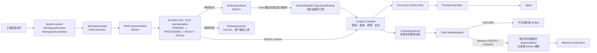

# Workspace MVP 与 Chat Attachments 初步设计

本文同时记录 `v0.6.2 W0 Workspace MVP` 的设计推导和 `W1 Chat Attachments` 对其公共契约的依赖，二者使用两份独立实施 Plan。W0 已转录为[正式 Plan](../plans/v0.6.2-workspace-mvp.md)；本文继续保存设计背景与 W1 开放问题，不代表系统已经具备 Workspace 或附件能力。

本文要解决的问题是：在不提前实现完整 Agent Workspace、Mount、Capability、工具环境和队列管理的前提下，如何建立一个足以承载 Chat Attachment 的资源作用域和资产引用基础，并让后续 `v0.7.0 Document Ingestion` 可以复用同一套来源链。

## 1. 背景与现状

路线图已经为附件和长文档划定了顺序：

```text
Chat Attachment
  -> WorkspaceAsset
  -> runtime representations
  -> 当前 Chat context
  -> 若实际参与记忆生成，再提升为 Artifact provenance

Document Ingestion
  -> document artifact
  -> chunk / evidence
  -> 可审核候选记忆
```

`v0.6.2` 的文件不应因为上传就直接变成正式记忆或 Artifact。系统先在 Workspace 的进程内工作集中保存原始内容、解析内容和 metadata，再根据当前轮次需要编译为 Agent 上下文。只有被实际使用的内容随后参与 Memory CREATE/UPDATE 时，Materialization 才把当时使用的 representation 提升为不可变 Artifact 证据。大文件异步解析、文档切块和候选记忆属于后续阶段。

当前代码存在几个会阻碍该能力的作用域缺口：

- `Identity` 只有 user、agent、team 和兼容性的 session 字段，没有 Workspace 资源作用域；
- `ChatRequest`、`AgentRunContext`、`ExecutionFrame` 和 `InteractionPayload` 没有独立的 Workspace 坐标；
- `SemanticBuffer`/`TopicData` 主要按 user/topic 管理，尚无资产绑定关系；
- `BaseArtifact` 没有 Workspace 归属，而且现有 Artifact 引用可以携带物理 URI；附件不能直接复用它作为用户选择协议；
- `KoakumaAtomCache` 的核心 key 只有 alias/UUID，不能避免不同作用域之间的命中污染；
- Artifact filesystem adapter 允许同 ID 覆盖，并通过全局目录递归查找 Artifact，尚无 Workspace-aware index。

因此，Workspace MVP 的目标不是先增加一个容器类，而是冻结资源身份、访问范围、资产生命周期和引用解析契约。

## 2. 核心判断

### 2.1 Workspace 的最小定义

Workspace MVP 定义为：

> 稳定的资源命名空间、访问作用域和资产目录。

它不成为 MemoryLibrary、Alice Runtime、Tool Registry、Work Queue、预算系统和所有缓存的超级管理器。

完整 Workspace 将来可以拥有 Memory、Artifact、Agent、工具、执行环境、策略、预算、队列和审计边界；但 AE2 方向文档建议首先明确 Workspace、Mount、Capability、Run 和 Artifact 的所有权，不立即新增大量运行时类。本稿遵循这一收敛原则。

### 2.2 三种不同生命周期

Workspace、Topic Working Set 和 Run 必须分开建模：

| 层级 | 生命周期 | 主要职责 |
|:---|:---|:---|
| Workspace | 长期 | 拥有资源、定义资源命名空间和访问边界 |
| Topic Working Set | 话题级 | 记录某个话题可重复引用的资产 |
| Run / Context Frame | 单次执行 | 记录本轮实际选择和编译后的上下文 |

附件属于 Workspace，但通常通过 Topic binding 在当前话题内反复使用；属于 Workspace 不等于每轮自动注入。

### 2.3 WorkspaceAsset 的 MVP 生命周期

Workspace 命名空间可以长期存在，但 MVP 中的 `WorkspaceAsset` 只承诺进程内生命周期。该 working set 由 System 层的进程级 Workspace 运行时资源持有，而不是由 Patchouli Runtime 或 MemoryLibrary 持有。上传成功仅表示资产及其 runtime representations 已进入当前服务进程，并在所需解析结果 READY 后可通过 ref 解析；它不表示原文件、解析结果、资产目录或引用已经跨重启持久化。

这一限制与当前 Topic/SemanticBuffer 只存在于内存中的事实一致。MVP 必须保证：

- `WorkspaceAssetRef` 在进程重启后允许失效，调用方应得到明确的 `ASSET_NOT_FOUND` 或 `ASSET_EXPIRED`，不能静默取得其他同名资产；
- 已被 Topic/Interaction 引用的 asset 和 representation，至少保持到相关 Materialization 完成；
- 零 Topic binding 的资产仍是合法的 Workspace 运行期资源，但可以随进程结束一起消失；
- PROCESSING 或 FAILED 的资产可以暂时存在于 WorkspaceAssetStore，但不能建立 Topic binding 或进入 Chat run；
- 一旦 representation 已提升为 Artifact，Artifact 按自己的持久化和不可变契约独立存在，不再依赖源 WorkspaceAsset 是否仍在内存中。

MVP 可以使用内存对象保存小型文本内容，不要求先建设 durable Blob/Object Store。进程内生命周期是明确的产品契约，不应由实现细节含糊决定。

## 3. 推荐的资源链路



这条链路包含五个重要区分：

1. 用户上传的逻辑资源不是 Artifact 本身；
2. 原始文件和解析文本是同一 WorkspaceAsset 内不同的 runtime representation；
3. 话题绑定只提供可引用性，不代表自动注入；
4. `ContextAssetUse` 只记录本轮实际进入上下文的 representation revision/hash，不记录所有曾经绑定或选择的资产；
5. WorkspaceAssetStore 是 System-owned 运行时资源，Topic binding 则跟随 Patchouli 的 SemanticBuffer；
6. Artifact 在 Materialization 边界按需创建，不是把可变的 WorkspaceAsset 原地改名或搬运。

## 4. 必须在 Workspace MVP 中裁定的问题

### 4.1 Workspace 身份、默认 Workspace 与兼容策略

Workspace 直接使用不可变的 `WorkspaceIdentity` 作为统一身份字段，不在 Workspace 聚合上分散保存三个可以互相漂移的裸字段：

```text
Workspace
  identity: WorkspaceIdentity
  display_name = "Main Workspace"
  workspace_kind = MAIN
  status = ACTIVE

WorkspaceIdentity
  owner_user_id
  workspace_key
  workspace_id
```

MVP 不启用独立的 opaque Workspace ID 生成机制，而是冻结以下不变量：

```text
WorkspaceIdentity.owner_user_id is not empty
WorkspaceIdentity.workspace_key is not empty
WorkspaceIdentity.workspace_id is not empty
WorkspaceIdentity.workspace_id == WorkspaceIdentity.workspace_key
```

因此默认 Workspace 的规范身份为：

```text
WorkspaceIdentity(
  owner_user_id = current_user_id,
  workspace_key = "main_workspace",
  workspace_id = "main_workspace",
)
```

不采用 `workspace_id=None`。否则每个 store、cache、event、work payload 和授权检查都必须重新计算 `workspace_id or workspace_key`，形成两套有效寻址字段。兼容逻辑只允许存在于最外层入口：调用方可以暂不传 Workspace，入口据此构造默认 `WorkspaceIdentity`；一旦进入业务链，`workspace_id` 必须非空，任何下游都不得再用 `workspace_key` 补救缺失 ID。

`workspace_key` 是同一 owner user 下稳定的逻辑 key，用于默认解析和未来 Workspace registry lookup；`workspace_id` 是对外协议、资源归属、cache/store/filter 使用的规范 ID。即使二者在 MVP 中等值，下游也只能使用 `workspace_id` 做资源寻址。Workspace 的完整身份是 `(owner_user_id, workspace_id)`，因此不同用户拥有同名的 `main_workspace` 不会发生冲突。

后端隔离测试使用另一组同样确定性的身份，例如：

```text
WorkspaceIdentity(
  owner_user_id = current_user_id,
  workspace_key = "isolation_workspace",
  workspace_id = "isolation_workspace",
)
```

未来启用独立 ID 时，新 Workspace 可以使用 `workspace_key="project_alpha"` 与 `workspace_id="ws_..."`，而现有 `main_workspace` 无需强制迁移。届时若允许修改 `workspace_key`，资源仍由不变的 `workspace_id` 寻址。MVP 不实现 Workspace rename，因此当前的等值约束不会造成身份漂移。

MVP 的默认行为是：

- 普通请求不传 Workspace 时，入口解析为当前用户的 `main_workspace`；
- 默认解析只发生一次，进入内部链路后必须显式传播 Workspace scope；
- 第一版不提供 Workspace 创建、切换和通信的前端产品能力；
- 后端仍允许测试或内部服务显式构造第二个 Workspace；
- 每次 Run 只有一个 active Workspace；
- 不实现 Mount、Bridge 或跨 Workspace fallback，跨 Workspace 读取一律拒绝。

因此，“不支持切换”只表示没有对应产品入口，不表示下游可以继续不知道当前 Workspace。两个 Workspace 的后端并存测试用于验证隔离不变量，而不是提前开放多 Workspace 产品面。

### 4.2 Identity、Team 与 Workspace 的关系

Identity、Team 与 Workspace 是相互正交的轴，不应互相替代、覆盖或嵌套：

```text
user_id       = 用户硬边界
agent_id      = 当前执行者身份
team_id       = 当前执行者所属的协作域
workspace_id  = 资产命名空间
```

这允许同一个 Agent 在不同 Run 中进入多个 Workspace，也允许一个 Workspace 接纳多个 Agent/Team 身份。Agent 不成为 Workspace 的子对象，Workspace 也不永久拥有 Agent Runtime。

继续让 `Identity` 只描述执行者，并用完整的 `WorkspaceIdentity` 描述资产域：

```text
Identity
  user_id
  agent_id
  team_id

WorkspaceAccessContext
  actor_identity: Identity
  workspace_identity: WorkspaceIdentity
  interaction_id
```

`interaction_id` 是一次 Chat run 的唯一关联 ID：在 WorkspaceAccessContext 冻结前由 Chat 入口生成，随后由 ChatGenerationRun、PreparedAgentRun、InteractionPayload、finalize 和相关 work payload 复用。`request_id` 仍可作为 HTTP/transport 层日志追踪字段，但不再作为 WorkspaceAccessContext 的第二个关联字段。该上下文是单次请求/Run 的作用域坐标，不是可绕过资源授权检查的永久 capability token。`WorkspaceIdentity.owner_user_id` 描述 Workspace 的所有者，`Identity.user_id` 描述当前执行者；两者相等是访问条件，不是可以互相覆盖的别名。第一版不需要实现显式 `WorkspaceGrant`；可以暂定同一 user 下的 Agent 均可进入该 user 的 Workspace，但只能访问当前 active Workspace 中符合 actor read policy 的资产。未来如需限制 Agent/Team 可进入哪些 Workspace，再增加独立的多对多 grant，不改变 Identity 或资产归属模型。

需要特别区分运行时状态和持久化事实：

- “当前正在访问哪个 Workspace”是运行时状态；
- “某项资产属于哪个 Workspace”是必须持久化的资产事实；
- “哪个 Agent/Team 创建了资产”是 provenance；
- “哪个 Agent/Team 当前可以访问资产”是 authorization。

因此 MemoryAtom 等资产不能只持久化现有 Identity。概念上它们应持有 `WorkspaceIdentity` 作为资产归属，并保存 `source_agent_id/source_team_id` 作为行为来源；存储模型可以把 ownership 平铺为 `owner_user_id + workspace_id`，同时保留必要的 `workspace_key` metadata，但不能重新引入三套独立身份来源。对 MemoryAtom，`workspace_id` 明确表示“归属于该 Workspace”，不是一条 Workspace 访问许可；未来跨 Workspace 使用应建立独立 grant/mount/ref，不能改变源 Memory 的 ownership。

AccessContext 可以同时保存 actor user 与 Workspace owner，因为它描述一次操作；MemoryAtom 是物化后的资源事实，只能承认 `workspace_identity.owner_user_id` 这一份 ownership user。`actor_identity.user_id` 不得再复制成并列的 `meta.user_id`；创建者字段记录 provenance，访问目标字段记录 authorization，二者也必须分开。

推荐的访问判定结构为：

```text
Allowed
  = actor_can_enter_workspace
  AND resource.workspace_identity == access.workspace_identity
  AND match_actor_read_policy
```

W0 中 `actor_can_enter_workspace` 暂由 actor user 与 Workspace owner 相等来满足；未来可以替换为显式 grant，但不改变资源 ownership。不得使用 `same_user AND (same_workspace OR same_agent OR same_team)`，否则 agent/team 条件会绕过 Workspace 的资产隔离。

当前 `MemoryVisibility.WORKSPACE` 实际通过 `team_id` 做过滤，这一历史名称会与新的 Workspace ownership 概念冲突。Workspace MVP 必须把 Workspace 作为独立的硬过滤轴；visibility 反转为进入 owning Workspace 后的 actor read policy，目标枚举固定为 `PUBLIC | PRIVATE | TEAM`，具体兼容映射见 4.8。

### 4.3 子系统所有权

Workspace 是共享系统中的逻辑资源作用域，不是 Gateway、Patchouli、Alice 或存储运行时的物理实例边界。MVP 不为每个 Workspace 创建独立的子系统、Runtime、MemoryLibrary、队列、总线或数据库实例，而是在同一套共享基础设施中通过显式 scope、复合资源键、过滤器和授权检查实现隔离。

推荐运行形态：

```text
HiveMemorySystem
  ├─ one GatewaySystem
  ├─ one PatchouliSystem
  │    └─ one MemoryLibrary
  ├─ one AliceSystem
  ├─ one WorkspaceRuntime（MVP 可退化为 System 直接持有 WorkspaceAssetStore）
  ├─ one Work Queue Runtime
  ├─ one RuntimeEventBus
  └─ one Workspace Resolver（MVP 确定性构造，无持久化 Registry）

每次请求
  └─ immutable WorkspaceAccessContext
       ├─ actor_identity: Identity
       └─ workspace_identity: WorkspaceIdentity
```

建议使用“统一地址空间，分散权威所有权”：

| 状态 | 权威所有者 | Workspace MVP 中的职责 |
|:---|:---|:---|
| Workspace Resolver / 默认 Workspace | System | 确定性构造身份、解析默认值并建立访问上下文 |
| WorkspaceAsset / representation / parse state / lease | System / WorkspaceRuntime | 进程内资产 working set、解析结果状态、读取授权和删除可用性真相 |
| TopicAssetBinding | Patchouli ShortTermMemoryStore / SemanticBuffer | Topic 内重复选择关系，随 Topic 的真实存在期存活 |
| RunAssetSelection / ContextAssetUse | Chat run / Interaction / LogicalBlock | 单次 Run 的选择与实际使用快照，随 Materialization payload 继续存活 |
| Artifact / Memory provenance | Patchouli / ArtifactStore | 持久化证据快照、创建与版本来源链 |
| Context Compiler 输入视图 | Chat/prepare orchestration | 通过只读 AssetReader 或冻结 snapshot 解析引用，不取得 WorkspaceAssetStore 所有权 |
| Run / Frame / PendingAtom | Alice | 运行期状态，不取得长期资产所有权 |
| Chat run registry / WorkRecord | System / Work Queue | 控制状态，不属于 Workspace cache |
| Prompt rendering | Alice prompt layer | 只渲染已编译上下文，不负责 I/O 和授权 |

共享组件与逻辑分区方式如下：

| 对象 | 是否共享单例 | Workspace 隔离方式 |
|:---|:---:|:---|
| GatewayRuntime | 是 | 请求状态携带 `WorkspaceAccessContext` |
| PatchouliRuntime | 是 | Memory/Topic/Artifact 操作强制 user + workspace filter |
| AliceRuntime | 是 | AgentRunContext、Frame 和 MTP context 携带 scope |
| MemoryLibrary | 是 | Store key、filter 和索引包含 Workspace |
| Artifact/Blob adapter | 是 | metadata/index 负责授权；Blob 可作为内部存储细节去重 |
| Work Queue Runtime | 是 | payload、idempotency、ordering 和 retry 携带 scope |
| RuntimeEventBus | 是 | event 投影可携带 Workspace，只用于观测 |
| Provider/Model/Parser registry | 是 | MVP 继续作为全局能力定义 |
| WorkspaceRuntime / WorkspaceAssetStore | 是 | 单个进程级容器，内部使用 owner user + workspace 逻辑分区 |
| cache | 共享容器 | key 包含 scope，命中后由资源所有者重新授权 |
| Run/Frame | 每次 Run 独立 | 保存冻结 scope，不成为 Workspace 长期资产 |

“不进行物理分区”是 MVP 的组合与领域契约决策，不是永久禁止存储优化。未来 adapter 可以按 Workspace 分库、分 collection 或分 shard，只要调用方仍使用相同的逻辑 scope 契约，且物理布局不会成为授权依据。

#### 4.3.1 禁止进程级当前 Workspace

任何共享 Runtime、Service、Familiar 或 Store 都不得保存可变的 `current_workspace`：

```text
PatchouliRuntime.current_workspace_id = ...  # 禁止
AliceRuntime.current_workspace_id = ...      # 禁止
```

否则两个并发 Run 会互相覆盖进程级字段。Workspace scope 必须作为不可变参数或 DTO 显式传递，并由 `ExecutionFrame` 保存当前 Run 自己的 scope。ContextVar 可以辅助日志和 trace 关联，但不能成为业务授权的唯一来源。

默认 Workspace 只能在最外层应用入口解析一次。进入链路后，任何缺少 Workspace scope 的资产操作都应失败，不能在 Gateway、Patchouli、Alice、Store 或 retry 中重新回退到 `main_workspace`。

#### 4.3.2 逻辑分区不变量

Workspace MVP 冻结以下规则：

1. 每个进程只有一套 Gateway、Patchouli、Alice、MemoryLibrary、Work Queue 和总线；
2. Workspace 不拥有子系统实例，只拥有逻辑资源；
3. 共享 Runtime 不保存可变的当前 Workspace；
4. 默认 Workspace 只在应用入口解析一次；
5. 进入业务链后传递不可变 `WorkspaceAccessContext`，不重新拼装裸身份字段；
6. 同一 Run 的 Gateway、prepare、Alice、finalize 使用同一 user/workspace scope；
7. 子 Frame、MTP 和后台 work 只能继承或缩小 scope，不能扩大或切换；
8. 所有 Workspace 资产查询硬过滤 `owner_user_id + workspace_id`；
9. cache key、幂等键、ordering key 和 retry payload 包含 Workspace scope；
10. cache 命中、Artifact 读取、MTP、retry 和 finalize 由最终资源所有者重新授权；
11. RuntimeEvent 可以记录 Workspace，但不能参与授权；
12. 未来允许存储层透明物理分片，但不得改变以上领域契约。

这与[身份隔离与执行安全治理](../governance/security/identity-and-execution-safety.md)中“request/run/frame/work item 携带不可变身份上下文与 scope”“资源所有者重验”“缓存不承载授权”的规则一致。这里的“快照”是治理层对固定身份坐标的描述，不要求另建一个与 `WorkspaceAccessContext` 重复的领域模型。Workspace MVP 需要把这些治理要求从后续目标提升为本功能的前置不变量，否则新增的资产轴会放大现有身份和缓存污染风险。

#### 4.3.3 System-owned WorkspaceRuntime

WorkspaceAsset 是用户在一次或多次 Topic/Run 中可能使用、也可能始终不使用的工作资源。它在上传和解析阶段尚未进入记忆生成链，因此不应由以 Perception、Retrieval、Generation、Lifecycle 和 MemoryLibrary 为中心的 Patchouli Runtime 持有。MVP 的权威所有者是 System runtime：`SystemAssembler._build_runtime()` 构造一个进程级、逻辑分区的 WorkspaceAssetStore，并将所需的窄接口显式注入应用服务或消费者。

推荐的轻量组合为：

```text
_RuntimeBundle
  workspace_runtime: WorkspaceRuntime

WorkspaceRuntime
  asset_store: WorkspaceAssetStore
```

如果 W0 为减少改动而暂时直接使用 `_RuntimeBundle.workspace_asset_store` 也可以接受，只要 Store 本身没有 Patchouli/Alice 依赖，且以后包入 WorkspaceRuntime 不改变公共契约。`WorkspaceRuntime` 只能有一个进程级实例，内部按 `(owner_user_id, workspace_id)` 逻辑分区；它不是“每个 Workspace 一个 Runtime”，不得保存 `current_workspace`，也不得演化为可被各层任意查询的 service locator。

Parser/Provider registry 继续作为共享能力定义；解析器通过 WorkspaceAssetStore 的命名状态迁移提交结果，而不取得 Store 所有权。AtomCache、ProfileCache 等未来可以迁入这个进程级资源边界，但不属于 W0：迁移前必须先补齐 Workspace/actor-aware cache key、命中后重验和显式依赖注入，不能用“搬了容器”代替隔离治理。

### 4.4 Workspace、Topic 和 Run 的边界

WorkspaceAsset、Topic 和单次 Chat Run 只通过显式引用建立关系。上传本身只创建 Workspace 资产，不创建 Topic 或 Run 关系。

需要区分五种状态事实：

| 事实 | 建立时机 | 生命周期 | 推荐载体 |
|:---|:---|:---|:---|
| 资产注册于 Workspace | upload operation 被接纳 | 当前进程 / Workspace 级 | `WorkspaceAsset` |
| 资产已可用于 Chat | required representation READY | 当前进程 / Workspace 级 | `WorkspaceAsset.state` |
| 用户为本轮选择资产 | 发送 ChatRequest | Run/Interaction 级 | `ChatRequest.asset_refs` / `RunAssetSelection` |
| 资产与 Topic 关联 | 引用首次被该 Topic 接纳 | Topic 级 | `TopicAssetBinding` |
| 内容被本轮实际使用 | Context Compiler 成功选入上下文 | Run/Interaction 级 | `ContextAssetUse` |

刚上传的资产允许不存在任何 Topic binding：

```text
WorkspaceAsset
  topic_bindings = 0
```

“未绑定”是关系缺失，不是 WorkspaceAsset 的特殊生命周期状态。同一个资产可以始终没有 Topic binding，也可以同时与多个 Topic 建立独立关系。

#### 4.4.1 新上传附件与本轮选择

上传完成时，Chat Run 通常尚未创建，因此上传接口不能直接建立服务端 Run binding。推荐由 Chat Composer 持有当前草稿选择：

```text
upload
  -> 返回 WorkspaceAssetRef
  -> Chat Composer 自动加入当前草稿的 asset_refs
  -> 用户发送 message + asset_refs
  -> ChatRequest 显式提交本轮选择
```

“新附件自动挂载本轮”是一项前端便利行为，不是服务端根据上传时间推断的隐式规则。服务端不能维护 Workspace 级 `pending_attachments`，也不能把“最近上传的附件”自动塞入下一次请求，否则多标签页、并发 Chat 或上传后切换话题会把资产挂到错误的 Run。

后续轮次同样由 `ChatRequest.asset_refs` 显式表达选择。Topic Working Set 只提供可再次选择的资产列表，不默认把所有绑定资产注入 prompt；未来若需要长期自动注入，应另行增加 `pinned` policy。

#### 4.4.2 路由、校验与 Topic binding

首轮 Chat 可能还没有真实 `topic_id`，但附件绑定总是在路由完成后发生：

```text
chat(message, asset_refs, target=NEW_TOPIC)
  -> 预校验 asset refs 的 user/workspace 归属和 READY 状态
  -> Gateway/Patchouli 确定唯一 Topic
  -> ensure TopicAssetBinding
  -> Context Compiler 编译本轮资产
  -> Alice 执行 Agent run
```

路由前可以验证资产是否存在、是否属于当前 user/workspace、是否已 READY、是否已删除，以及引用格式是否合法；但不建立 Topic binding，也不读取附件正文参与路由。MVP 的文档附件只有在所需 `EXTRACTED_TEXT` representation 解析成功后才能参与 Chat；PROCESSING、FAILED 或 REMOVED 资产必须返回稳定错误并拒绝本轮接纳。

TopicAssetBinding 的建立边界定义为：

> 资产引用已经通过 user/workspace 与 READY 状态校验，并被一个已完成路由的 ChatRequest 接纳。

不必等待 Agent 成功回复，也不必等待模型实际消费内容。binding 建立后，即使模型失败或 Run 被取消也默认保留，因为它记录用户已经把一个可用资产带入这一 Topic 的意图；真正被模型消费的内容另由 `ContextAssetUse` 表达。解析未完成、解析失败、越权、已删除或完整性校验失败的引用不能建立 binding。解析失败由明确状态返回给用户，MVP 不自动重试；用户再次上传时创建新的逻辑 WorkspaceAsset。

Topic binding 必须幂等：

```text
UNIQUE(owner_user_id, workspace_id, topic_id, asset_id)
```

两个并发 Chat Run 首次引用同一资产时只能产生一条 binding。同一 WorkspaceAsset 可以分别绑定多个 Topic；从某个 Topic detach 只删除对应 binding，不删除进程内资产、其他 Topic 的关系或已经独立生成的 Artifact。

MVP 中 `TopicAssetBinding` 跟随 `SemanticBuffer` 保存，由 `ShortTermMemoryStore` 通过 `ensure_asset_binding`、`detach_asset_binding` 和只读投影管理，调用方不得直接修改 buffer。binding 的生命周期跟随 Topic 是否真实存在，而不是跟随所有名为 settle 的动作：

- IDLE/LRU/SHUTDOWN settle 随 Topic pop/evict 一并清除 binding；
- manual settle 当前只 compact、不 evict，Topic 仍存在，因此 binding 保留；
- token overflow 只 compact，binding 保留；
- 显式 Topic delete/pop 清除整个 Topic working set；
- 清空 blocks 或 reset content 默认不隐式 detach，除非产品用例明确要求删除 Topic。

WorkspaceAsset 被删除时，System AssetStore 先使其不可再 resolve/bind；SemanticBuffer 中可能残留的 binding 不构成授权或可用性真相，应由应用服务幂等清理，或在读取 Topic assets 时过滤并顺手移除。

#### 4.4.3 Run 选择与实际使用

Topic binding、用户本轮选择和模型实际使用是三种不同事实：

```text
TopicAssetBinding
  = 这个 Topic 以后可以继续选择该资产

RunAssetSelection
  = 用户本轮请求选择了该资产

ContextAssetUse
  = Context Compiler 最终使用了哪个 representation 的哪些部分
```

`RunAssetSelection` 应关联稳定的 `interaction_id` 或 Chat operation identity，而不是只依赖低层 `frame_id`。`ContextAssetUse` 记录实际 representation 的 revision/hash、locator、token 数和编译状态，并作为 Materialization 的来源输入；在提升完成前它不持有 Artifact 身份。

只有 READY 资产才允许形成 `RunAssetSelection` 和 Topic binding。如果用户选择的 READY 资产因预算裁剪或编译失败没有进入 Agent 上下文，binding 可以保留，但不能形成成功的 `ContextAssetUse`，也不能被记录为本轮回答的有效来源。

TopicAssetBinding 不承担 provenance。`ContextAssetUse` 必须随对应 Interaction/LogicalBlock 被快照进 Topic Materialization payload；即使随后 Topic 被结算并 evict、binding 消失或用户删除 WorkspaceAsset，Materialization 仍通过冻结的 representation revision/hash 和有效 lease 得到本轮实际来源。

#### 4.4.4 零 binding 资产与附件路由限制

用户上传后没有发送消息，或在发送前从 Composer 移除附件，会留下零 Topic binding 的 WorkspaceAsset。这是合法的进程内资产，不是 orphan Artifact：它可以在当前进程中以后从 Workspace 资产选择器再次使用，也可以由用户显式删除；无需为了零 binding 资产建立耐久保存或 provenance hold。

“绑定发生在 Topic 路由之后”成立的前提是 MVP 的 Topic 路由不依赖附件正文。对于 attachment-only Chat，第一版应要求使用当前显式 Topic，或者在没有当前 Topic 时直接创建新 Topic；MVP 不读取附件正文决定 Topic。未来若需要 attachment-aware routing，应单独设计 pre-route hint 或两阶段路由，不能让 Topic binding 与内容路由形成循环依赖。

### 4.5 WorkspaceAsset、Artifact 与内容对象的边界

`WorkspaceAsset` 与 `Artifact` 是两套用途正交的体系：

| 概念 | 用途 | MVP 生命周期 | 用户是否直接选择 |
|:---|:---|:---|:---:|
| `WorkspaceAsset` | Workspace 中可反复引用的逻辑工作资源 | 仅当前进程 | 否 |
| `WorkspaceAssetRef` | Chat/Topic 对逻辑资产的 opaque 引用 | 随所指资产有效 | 是 |
| `AssetRepresentation` | RAW、EXTRACTED_TEXT 等运行期内容对象 | 仅当前进程 | 由编译器选择 |
| `Artifact` / `ArtifactRef` | Memory 的不可变证据、创建与版本链 | 按 ArtifactStore 契约持久化 | 否 |

`WorkspaceAsset` 内部可以同时保存原始内容对象、解析后的内容对象和 metadata。MVP 不要求这些对象先转为 Blob 或 Artifact，也不承诺在进程重启后恢复。Artifact 则是已经进入持久化记忆资产证据链的独立、append-oriented 记录，不属于 Workspace 的可选择工作集，用户不能把现有 `ArtifactRef` 当成附件再次挂载。Artifact 不在物理上从属于某一个 Memory；同一来源 Artifact 可以被一次 Materialization 生成的多个 MemoryCreation/Version Artifact 引用。

两套体系只在 Topic Materialization 边界发生单向提升：

```text
WorkspaceAssetRef
  -> ContextAssetUse(asset_id, representation_id, revision, content_hash, locators)
  -> Generation Outcome
       DISCARD
         -> 不创建外源 Artifact
       CREATE / UPDATE
         -> snapshot actually used representation
         -> DocumentArtifact / other source Artifact
         -> MemoryCreationArtifact or MemoryVersionArtifact source refs
         -> MemoryAtom
```

这里的 promotion 不是把 WorkspaceAsset 原地“转换”为 Artifact，而是根据 `ContextAssetUse` 创建一份不可变证据快照。只提升实际进入 Agent 上下文并参与该次 Memory CREATE/UPDATE 的 representation；仅上传、仅 Topic binding、仅本轮选择，或因预算/解析失败未进入上下文的内容都不生成外源 Artifact。

Materialization 必须读取 `ContextAssetUse` 记录的确定 revision/hash，不能重新解析 WorkspaceAsset 的“最新内容”。如果记录的版本已经不可用，必须明确失败或标记来源不完整，不能悄悄使用另一版本。相同 materialization operation 的 retry 必须幂等，不能为同一份来源重复生成多个 Artifact；同一次 Materialization 产生多条 Memory 时，应复用同一个已提升来源 Artifact。Artifact 创建后即使源 WorkspaceAsset 随进程结束消失，证据链仍可独立读取。

当前 Artifact 写入是 best effort。正式 Chat Attachments Plan 必须裁定外源来源提升失败时的提交语义：要么阻止依赖该来源的 Memory 写入，要么显式保存 `provenance_incomplete`；不能静默丢失来源后仍声称记忆 provenance 完整。

### 4.6 Artifact 类型、资产引用和寻址规则

Artifact 类型应由被保存内容的语义决定，而不是由“聊天附件”或“文档摄入”入口决定：

- 当前 MVP 只支持文档型附件；当其实际参与 Memory CREATE/UPDATE 时，提升为 `DocumentArtifact`；
- 不把所有未来 WorkspaceAsset 一律映射为 `DocumentArtifact`；非文档来源应使用相应 Artifact 类型；
- 不用 `unknown` 文档类型承载任意附件。长期如出现多种外源载体，可以再抽取 `ExternalSourceArtifact` 基类，MVP 不提前实现；
- Chat Attachment 与 Document Ingestion 共享 DocumentArtifact 的外源快照性质，但前者由运行期实际使用触发，后者由正式摄入与多级文档溯源触发。

建议为外源 Artifact 补充来源 metadata：

```text
origin: CHAT_ATTACHMENT | DOCUMENT_INGESTION | URL_FETCH | REPO_IMPORT
source_asset_id?
source_asset_revision?
parser_id?
parser_version?
source_content_hash
```

其中 `source_asset_id` 只用于追踪来源，不使 Artifact 依赖 WorkspaceAsset 存活。页码、标题路径、行号、quote 等 locator 长期更适合作为 Memory/Artifact 间的 `SourceEvidenceRef` 关系信息，而不是把每条引用位置都塞入完整文档 Artifact 本体；该关系模型留给 `v0.7.0` provenance contract 最终裁定。

初版引用规则为：

- 文件名只是展示字段，同名文件可以并存；
- 用户侧只使用 opaque `WorkspaceAssetRef`，不暴露文件系统路径或 `ArtifactRef.uri`；
- 内部资源键至少包含 `(owner_user_id, workspace_id, asset_id)`；用户侧 opaque ref 不直接暴露这些字段；
- `ContextAssetUse` 必须锁定 `representation_id + revision + content_hash`，以支持可复现提升；
- asset/artifact ID 都不是授权凭证；
- 每次 resolve 都要重新验证 user、Workspace、Topic 关系和资源状态；
- 已有 `ArtifactRef` 只服务 Memory provenance 和内部历史读取，不进入 Chat 附件选择协议。

### 4.7 Scope 的端到端传播

Workspace 身份域必须在 Active Chat 进入业务链前锁定。推荐顺序为：

```text
HTTP / other adapter
  -> 构造 actor Identity
  -> Workspace Resolver 解析 requested workspace 或 main_workspace 为 WorkspaceIdentity
  -> 验证 Workspace owner/status
  -> 冻结 WorkspaceAccessContext
  -> register ChatGenerationRun
  -> Gateway
  -> Patchouli prepare
  -> Alice run
  -> Patchouli finalize / cleanup
```

“锁定”表示一次 Run 的 user/agent/team/workspace 坐标不可被下游替换，不表示后续可以省略授权。`WorkspaceAccessContext` 及其嵌套的 `Identity`、`WorkspaceIdentity` 在创建后都必须保持不可变；切换 Agent、Workspace 或 Interaction 只能创建新上下文。资源所有者仍需根据原上下文重新验证 Workspace 状态和资源归属。

一次 Active Chat 使用一个且仅一个 `interaction_id` 作为 Run 关联 ID。它必须在冻结 `WorkspaceAccessContext` 之前生成，并贯穿 ChatGenerationRun、Gateway、Patchouli prepare、Alice、finalize、InteractionPayload 和后台 work。HTTP `request_id` 可以继续存在于 transport/logging 层，但不进入该上下文模型。

Active Chat 至少需要经过以下载体：

```text
WorkspaceAccessContext
  -> ChatGenerationRun
  -> GatewayExecutionState
  -> Patchouli PreparedAgentRun
  -> AgentRunContext
  -> ExecutionFrame
  -> MTPExecutionContext
  -> InteractionPayload
  -> Memory / Artifact domain work payload
  -> RuntimeEvent projection
```

各阶段要求如下：

| 阶段 | Workspace scope 职责 |
|:---|:---|
| ChatApplicationService | 生成唯一 `interaction_id`，解析默认 Workspace，创建不可变 AccessContext |
| ChatGenerationRun | 保存唯一的 AccessContext 与派生 fingerprint；从上下文读取 `interaction_id`，供 cancel/status/event 校验 |
| GatewayExecutionState | 将 AccessContext 作为初始化后不可覆盖的请求事实 |
| Patchouli prepare | 在该 scope 内路由 Topic、检索 Memory、绑定资产和编译上下文 |
| PreparedAgentRun | 冻结 prepare 结果与原始 AccessContext，供 finalize/cleanup 复用 |
| Alice AgentRunContext | 向主 Frame 提供相同 scope |
| ExecutionFrame / MTP | 完整继承相同 AccessContext；只允许缩小资源选择，不允许改写身份坐标或更换 Workspace |
| Patchouli finalize | 只消费 PreparedAgentRun 中的 scope，不能接受另一组裸身份字段 |
| background work/retry | 通过 versioned codec 完整序列化同一 AccessContext，每次 attempt 解码后重新授权 |
| RuntimeEvent | 投影 workspace_id 供观测，不作为授权输入 |

公共用例签名应优先接收完整上下文：

```text
prepare_agent_run(
  access_context,
  user_message,
  gateway_decision,
  ...
)
```

不应继续在跨子系统边界重复传递 `user_id + agent_id + workspace_id` 后由下游重新构造 Identity。当前 Active Chat 在 ChatApplicationService 中构造 Identity，随后又向 Patchouli prepare 传递裸 user/agent/session 字段；Workspace MVP 应消除这个身份漂移点。

同一 Run 必须满足：

```text
Gateway 使用的 scope
  == Patchouli prepare 读取的 scope
  == Alice/子 Frame 使用的 scope
  == Patchouli finalize 写入的 scope
  == background task 解码后的 AccessContext
```

`ChatGenerationRun` 虽然是 System 控制状态而不是 Workspace 资产，也应保存冻结 scope。cancel/status 查询不能只依赖 `generation_id`；调用者至少需要匹配 Run 的 user/workspace 边界，避免 generation ID 被另一个 Workspace 用来停止或观察运行。

子 Agent 默认继承父 Run 的 user/workspace hard boundary，只能通过经过授权的 context refs 缩小或选择资产。自然语言、alias、CALL 或默认值都不能扩大 scope。

通用 Work Queue 不必立即改变基础 `WorkItem` 结构，但所有附件、Interaction、Memory Generation 和 Lifecycle 相关领域 payload、ordering key 和 idempotency key 都必须包含 Workspace scope。由 Interaction 派生的 Task DTO 直接保存唯一的 `WorkspaceAccessContext`；versioned codec 将它完整编码到 WorkItem 独占的 payload bytes，并在每次 retry 重新解码和授权。序列化结果是边界投影，不是新的身份模型，也不能与另一组平铺 actor/workspace 字段并存。全局 maintenance 如需处理多个 Workspace，应显式逐 Workspace 执行 scoped operation，不能以无 Workspace filter 的全库扫描替代所有权检查。

`WorkspaceAccessContext` 在顶层入口创建后即不可修改：切换 Agent、Workspace 或 Interaction 都要创建新的上下文。不可变上下文只固定任务原本绑定的坐标，不缓存永久授权；Workspace 状态、grant、team membership 或资源 policy 变化后，handler 仍需在每次 attempt 使用原坐标重新授权，不能刷新 AccessContext、读取 `current_workspace` 或重新解析 `main_workspace`。

异步隔离还需要满足[数据模型可变性治理](../governance/data-model/mutability.md)的深度要求。TaskSpec 的 frozen 外壳不代表其 `GenerationRequest` 与嵌套容器递归只读；admission 后必须立即生成与调用方对象图脱钩的 payload bytes，确保调用方后续修改请求对象不会改变已入队任务。

### 4.8 授权、opaque ID 与 cache 命中

当前系统仍处于单用户/单 Workspace 假设，尚无完整认证和多租户隔离。Workspace MVP 可以先建立内部访问契约，但不能将 opaque ID 误写成安全边界。

资源读取必须由资源所有者根据 `WorkspaceAccessContext` 执行三阶段判断：

```text
1. MUST access.workspace_identity.owner_user_id == access.actor_identity.user_id
2. MUST resource.workspace_identity == access.workspace_identity
3. MUST match_actor_read_policy(access.actor_identity, asset_policy)
```

Workspace hard filter 不受 `agent_id`、`team_id` 或 visibility 结果影响，也不允许拿到 asset/artifact ID 后跳过。第一版没有跨 Workspace 通信，因此任何 workspace mismatch 都直接拒绝。

Memory dedup/merge 同样属于资源访问与 mutation：候选查询必须先受当前 Workspace hard filter 和 actor read policy 限制。即使两个 Workspace 中内容完全相同，也不能把它们合并或演化为同一个 MemoryAtom。

新的 Workspace ownership 轴会使现有 `MemoryVisibility` 出现语义冲突。设计理念是先用 ownership 决定资源空间，再用 visibility 决定该空间内部的 actor 读取范围；两者不能再用同一个枚举表达。目标语义为：

```text
PUBLIC
  -> owning Workspace 内所有已获准进入的 actor

PRIVATE
  -> owning Workspace 内 target_agent_id 匹配的 actor

TEAM
  -> owning Workspace 内 target_team_id 匹配的 actor
```

`PUBLIC` 是 workspace-local public，不是跨 Workspace 或系统全局公开。visibility 只控制 SEARCH/READ/Context use，不自动授予更新、删除、变更 policy 或转移 ownership 的能力。

provenance 字段与授权目标必须独立：`source_agent_id/source_team_id` 记录谁创建了 Memory，`target_agent_id/target_team_id` 记录当前 policy 指向谁。创建时可以将 source 默认复制为 target，但后续修改 policy 不能篡改 source。目标组合必须满足：

```text
PUBLIC  -> no target
PRIVATE -> target_agent_id only
TEAM    -> target_team_id only
```

W0/P2 未显式指定 read policy 时显式写入 `PUBLIC`，以保持当前创建行为；不能把缺字段交给反序列化默认值暗中决定。`TEAM` 在 MVP 中以 `actor_identity.team_id == target_team_id` 判定，未来多组 membership 只替换 evaluator，不改变 ownership。

现有 schema v1 序列化值在迁移期解释为：

```text
现有 PRIVATE
  -> PRIVATE(target_agent_id = source_agent_id)

现有 WORKSPACE
  -> TEAM(target_team_id = team_id)

现有 PUBLIC
  -> PUBLIC
```

映射时保留旧 `source_agent_id`，并把旧 `team_id` 投影为 v2 `source_team_id`。对旧 `WORKSPACE` 记录，历史 `team_id` 还会初始化 `target_team_id`；完成 v2 归一化后 source provenance 与 target policy 不再联动。

旧 `PRIVATE` 缺少 `source_agent_id`，或旧 `WORKSPACE` 缺少有效 `team_id` 时，adapter 不能生成默认授权 target；记录必须 fail closed 并进入迁移诊断清单。

不再引入目标 `WORKSPACE` visibility。P2 新写入必须正式使用 `MemoryAtom.schema_version = 2` 与新 policy；历史批量回填仍在 Workspace MVP 完成隔离验证后执行。兼容期必须通过命名的 v1 decoder/visibility adapter 解释旧 `WORKSPACE=team_id`，`PUBLIC` 也始终不能绕过 owner/workspace hard filter。

CREATE 与 UPDATE 都属于 v2 新写入。首次更新 v1 Memory 时，系统先通过 v1 decoder 归一化，再保留其 canonical Workspace ownership 以 v2 写回；不能把当前 updater 的 Workspace 或 actor 当成新的 owner/source。

版本分派采用 fail-closed 契约：缺少 `schema_version` 的历史记录进入 v1 decoder；版本 2 必须具有完整 WorkspaceIdentity 与合法 target 组合；未知版本拒绝进入领域模型。decoder 不能使用 active Workspace 猜测或补齐部分 ownership。

缓存 key 至少以 `(owner_user_id, workspace_id, ...)` 开头。若缓存内容或 alias resolve 结果受 agent/team visibility 影响，还必须包含相应 actor scope，或者在每次命中后重新授权。缓存命中不能绕过资源所有者的三阶段检查。

### 4.9 幂等、并发和提交边界

推荐将以下身份分开：

- 上传幂等键：`owner_user_id + workspace_id + actor + client_operation_id`；
- 内容完整性：raw content hash；
- 解析结果身份：`raw_hash + parser_id + parser_version + options_hash`；
- Topic binding 唯一键：`owner_user_id + workspace_id + topic_id + asset_id`；
- Artifact promotion 幂等键：`materialization_operation_id + representation_revision/hash + artifact_role`。

同一进程内，相同 upload operation 重试应返回同一个 WorkspaceAsset。相同内容 hash 可以用于运行期内容对象去重，但不能自动合并两个用户层面的逻辑资产，也不形成跨重启恢复承诺。

#### 4.9.1 Representation 与 Asset 两级状态机

WorkspaceAssetStore 是两级状态的唯一写入者。`AssetRepresentation` 表达具体内容对象的生成过程：

```text
PENDING -> PROCESSING -> READY
                      -> FAILED
```

- RAW representation 注册完成后可以直接是 READY；
- EXTRACTED_TEXT 初始为 PENDING，解析开始后进入 PROCESSING；
- READY 必须同时冻结 content object、content hash、producer/version 和 revision；
- FAILED 在 MVP 中为终态，只保留稳定 error code 和可向用户披露的简短说明，不保存底层异常栈；
- MVP 不实现 FAILED 到 PROCESSING 的自动 retry、retry wait、backoff 或 parser fallback；用户重新上传会创建新的逻辑 WorkspaceAsset。

`WorkspaceAsset` 表达该逻辑资源能否被用户使用：

```text
PROCESSING -> READY
           -> FAILED

PROCESSING / READY / FAILED -> REMOVED
```

MVP 的文档资产明确 `required_representation_kind=EXTRACTED_TEXT`。RAW 已 READY 不能单独令 WorkspaceAsset READY；只有 required representation READY 后，asset ref 才能进入 Chat、Topic binding 和 Context Compiler。WorkspaceAsset state 由 Store 根据 required representation 和删除标记原子维护或推导，调用方不得分别修改两份状态。

W1 的同步上传接口只有在 WorkspaceAsset 及所需 representation 已原子进入 working set 且 asset state 为 READY 时才返回可立即使用的 ref。若以后改成异步解析，可以返回 PROCESSING 状态供查询，但 ChatRequest 仍必须拒绝非 READY 资产。解析失败直接形成稳定错误并由用户决定是否重新上传，不触发后台自动重试。

删除与解析完成可能并发。解析提交必须携带预期 asset/representation revision 或 parse operation token；WorkspaceAsset 已 REMOVED 后，晚到的 READY/FAILED 回调只能被拒绝或丢弃，不能把资产复活。FAILED 资产可以保留少量状态 metadata 供用户读取错误，但大块失败内容应在没有 lease 时尽快释放，并受进程内容量限制约束。

同一 `client_operation_id` 的网络重放仍返回第一次创建的资产及其权威状态；这属于入口幂等，不是解析自动重试。用户显式重新上传必须使用新的 operation identity，并得到新的 asset ID。

Materialization promotion 是另一条提交边界。它必须以记录的 representation revision/hash 建立幂等 Artifact 快照；重试不得读取更新后的 runtime representation，也不得重复追加同义 Artifact。

### 4.10 Detach、Delete、Retention 与 Provenance Hold

至少需要区分：

- 取消本轮选择：只影响 Run；
- Topic detach：只删除 TopicAssetBinding；
- WorkspaceAsset delete：在当前进程内使资产及未被进行中 Materialization 持有的 runtime representations 不再可解析；
- 进程结束：所有未提升的 WorkspaceAsset 和 representations 都可以消失；
- Artifact retention：由持久化 provenance 自己的 append-oriented 保留策略管理。

WorkspaceAssetStore 是资产可用性的唯一真相。删除跨越 System-owned AssetStore 与 Patchouli-owned Topic binding 时不建立伪跨 Store 事务，按以下顺序收敛：

1. AssetStore 先把资产标记为 REMOVED，立即拒绝新的 resolve、bind 和 selection；
2. System 应用服务再幂等请求清理各 SemanticBuffer 中的 binding；
3. 清理失败留下的 dangling binding 不构成授权，`list_topic_assets` 必须过滤已 REMOVED/不存在的资产，并可顺手清除关系；
4. 无活跃 lease 时释放内容对象；仍被进行中 Materialization 持有时只对用户隐藏，延迟到最后一个 hold 释放后回收。

MVP 不需要跨重启 soft delete、durable tombstone 或完整垃圾回收；REMOVED 只是进程内并发控制状态。已经被 `ContextAssetUse` 锁定且 Materialization 尚未完成的 representation 不能在处理中被物理删除。若内容已提升为 Artifact，用户后来取消选择、Topic detach、删除 WorkspaceAsset 或进程结束都不能删除既有 provenance；若只参与回答而没有生成 Memory，则不因此承诺形成持久化 Artifact。

Topic delete/pop 会自然丢弃 SemanticBuffer 内的 binding，但不回收 WorkspaceAsset。已经冻结的 `ContextAssetUse` 和 lease 也不随 binding 消失；当前 Run 是否因 Topic/Asset 删除而取消，由 Chat run control 的显式策略决定，不能由 binding 是否存在隐式决定。

### 4.11 Context Compiler 的读取契约

当前 Patchouli 在 prepare 阶段编译 `memory_context`，Prompt Assembler 只负责将已准备内容渲染成消息。附件应复用“先解析为只读上下文、再渲染”的分工，但 WorkspaceAssetStore 的 System 所有权并不强制 Context Compiler 也成为 Store 或 Patchouli 的一部分。W1 可以在 Chat/prepare orchestration 中放置编译器，并向其注入窄化的 `WorkspaceAssetReader`；不得让编译器通过 HiveMemorySystem 全局查找 Store。

Context Compiler 负责：

- 解析资产引用；
- 验证 Workspace 和 Topic 权限；
- 选择 RAW 或 EXTRACTED_TEXT 等 runtime representation；
- 应用 token/大小预算；
- 生成 locator/citation；
- 返回带有 representation revision/hash 的 `ContextAssetUse`。

Prompt Assembler 不负责文件 I/O、资源授权或解析器调用。

Workspace MVP 不必实现完整的长文档编译器，但至少应冻结以下读取契约：

```text
resolve_asset(access_context, asset_ref)
list_topic_assets(access_context, topic_id)
acquire_ready_representation(access_context, asset_id, preference)
```

`acquire_ready_representation` 原子验证 owner/workspace、asset READY、representation revision/hash 和读取权限，并返回本轮稳定 snapshot/lease。Context Compiler 不能把“取最新”语义留给后续 Materialization；Patchouli promotion 若需要内容，只能消费冻结的 `ContextAssetUse` 及其窄化 snapshot resolver/lease，不能回查 TopicAssetBinding，也不能取得可变 WorkspaceAssetStore。Prompt Assembler 只消费编译后的只读内容，不接收 WorkspaceAssetStore、WorkspaceRuntime 或 ArtifactStore 句柄。

## 5. 最小数据模型草案

以下模型用于冻结概念和边界；W0 的实施字段、不变量和调整程序以[正式 Plan](../plans/v0.6.2-workspace-mvp.md)为准，W1 特有模型仍需在后续独立 Plan 中确认。

```text
Workspace
  identity: WorkspaceIdentity
  workspace_kind: MAIN | STANDARD
  display_name
  status
  created_at

WorkspaceIdentity
  owner_user_id
  workspace_key: "main_workspace" | ...
  workspace_id

WorkspaceAccessContext
  actor_identity: Identity
  workspace_identity: WorkspaceIdentity
  interaction_id

WorkspaceRuntime
  asset_store: WorkspaceAssetStore
  # one process-level instance; no current_workspace

AssetOwnership
  workspace_identity: WorkspaceIdentity

AssetProvenance
  created_by_agent_id
  created_by_team_id?

AssetAccessPolicy
  visibility: PUBLIC | PRIVATE | TEAM
  target_agent_id?
  target_team_id?

WorkspaceAsset
  asset_id
  ownership
  provenance
  access_policy
  kind
  display_name
  media_type
  size_bytes
  required_representation_kind: EXTRACTED_TEXT
  representations[]
  state: PROCESSING | READY | FAILED | REMOVED
  safe_error_code?
  safe_error_message?
  created_at

AssetRepresentation
  representation_id
  ownership
  asset_id
  kind: RAW | EXTRACTED_TEXT | ...
  revision
  content_object
  content_hash
  derived_from_representation_id?
  producer
  producer_version
  parse_operation_id?
  state: PENDING | PROCESSING | READY | FAILED

SemanticBuffer
  workspace_identity
  topic_id
  blocks[]
  topic_asset_bindings[]

TopicAssetBinding
  workspace_identity
  topic_id
  asset_id
  bound_by
  bound_at
  first_bound_interaction_id

RunAssetSelection
  interaction_id
  run_id?
  workspace_identity
  topic_id
  asset_id
  requested_representation_id?
  selection_source: NEW_UPLOAD | TOPIC_REUSE | WORKSPACE_PICKER

ContextAssetUse
  context_asset_use_id
  interaction_id
  run_id?
  workspace_identity
  topic_id
  asset_id
  representation_id
  representation_revision
  content_hash
  locators
  included_tokens
  compile_status
  representation_lease_id?

LogicalBlock / TopicMaterializeTask
  context_asset_uses[]

SourceArtifactPromotion
  materialization_operation_id
  interaction_id
  target_memory_ids[]
  context_asset_use_id
  artifact_ref
  promotion_status

MemoryAtom
  schema_version: 2
  meta
    workspace_identity: WorkspaceIdentity
    source_agent_id
    source_team_id?
    access_policy
      visibility: PUBLIC | PRIVATE | TEAM
      target_agent_id?
      target_team_id?

ArtifactMeta / TopicMeta
  workspace_identity: WorkspaceIdentity
  # storage/index adapters may flatten owner_user_id/workspace_key/workspace_id
```

`WorkspaceIdentity` 是 Workspace 聚合及其资产归属的统一值对象，应不可变、可序列化并在构造时完成非空和 MVP 等值校验。`AssetOwnership`、`AssetProvenance` 和 `AssetAccessPolicy` 表达三个不同的时间语义：归属定义资产在哪个 user/workspace 命名空间，provenance 记录历史创建者，access policy 决定当前执行者能否读取。实现时可以为了现有存储格式平铺 `owner_user_id/workspace_id/workspace_key`，但领域代码必须从同一份 `WorkspaceIdentity` 投影，不能让各字段分别成为权威来源。

MemoryAtom 在实施 P2 时正式进入 schema v2。顶层 `schema_version` 表示领域/持久化契约版本，与现有用于内容演化或乐观锁的 `meta.version` 正交，不能复用。v2 只以 `workspace_identity` 作为 ownership 权威，不同时保存含糊的 `user_id` 和另一套 owner 字段；`PUBLIC | PRIVATE | TEAM` 是 owning Workspace 内部的 read policy。`PRIVATE/TEAM` 的 target 与 source provenance 分开，避免修改访问策略时篡改创建历史。存储 adapter 负责 v2 平铺和 v1 compatibility decode，不能把兼容字段泄漏回新领域模型。

Memory Generation/Materialization 不能只靠裸 `Identity` 构造 v2：所属 TaskSpec 必须携带唯一、完整的 `WorkspaceAccessContext`，从 WorkspaceIdentity 取得 ownership、从 actor Identity 取得 provenance，并将选择后的 policy 显式写入新记录。下层 builder 可以接收从该上下文派生的窄参数，但不得建立 `WorkScopeSnapshot` 或并列 `MemoryCreationContext` 作为第二身份权威。

WorkspaceAsset 与 AssetRepresentation 状态只能通过 WorkspaceAssetStore 的命名迁移改变；asset READY 是 required representation READY 的聚合结果，而不是独立可写布尔值。FAILED 不自动回到 PROCESSING，REMOVED 不允许被晚到解析结果复活。

`TopicAssetBinding` 作为 SemanticBuffer 的子关系跟随 Topic working set；完整 owner/workspace 坐标由 buffer 与绑定写入时的 AccessContext 共同验证。`RunAssetSelection` 表达用户请求选择，`ContextAssetUse` 表达系统实际送入 Agent 上下文的内容；二者不能合并。它们都应优先关联稳定的 `interaction_id`，低层 `run_id` 只作为可选运行坐标。MVP 中它们可以随当前 Topic/Interaction 保存在进程内，但 `ContextAssetUse` 必须随 LogicalBlock/TopicMaterializeTask 至少存活到 Materialization 完成，并冻结 representation revision/hash 与对应 hold。

`SourceArtifactPromotion` 是 Materialization 的幂等结果映射，不是用户可操作资源。实现可以把它并入 generation operation record，但必须能够在 retry 时判断同一来源快照是否已经生成 Artifact。WorkspaceAsset/representation 不保存反向 `artifact_ref` 作为生命周期依赖；需要审计时从 Memory provenance 或 promotion record 读取。

## 6. 初版作用域与缓存迁移方向

### 6.1 需要携带 Workspace scope 的资源

至少包括：

- ChatRequest 入口和 ChatGenerationRun 中冻结的 WorkspaceAccessContext；
- GatewayExecutionState / Gateway context；
- PreparedAgentRun；
- Memory metadata 和 Retrieval filters；
- Artifact metadata 和 Artifact access route；
- SemanticBuffer / TopicData；
- AgentRunContext / ExecutionFrame / MTPExecutionContext；
- InteractionPayload；
- 附件、Interaction、Memory Generation 和 Lifecycle work payload；
- RuntimeEvent 的观测投影。

active Workspace 是请求和 Run 的运行时字段；资源在各自生命周期内必须保留明确的 Workspace 归属。持久化的 Memory/Artifact 将该归属写入存储，进程内的 WorkspaceAsset/Topic 将其保存在 authoritative runtime record。它们的读取基线统一为：

```text
MUST access.workspace_identity.owner_user_id == access.actor_identity.user_id
MUST resource.workspace_identity == access.workspace_identity
MUST match_actor_read_policy(access.actor_identity, ...)
```

Workspace MVP 不在系统落地前批量改写现有数据。对于尚未转换的历史记录，W0 只提供明确的 compatibility-read/filter projection：根据记录中的 `user_id` 临时构造 `WorkspaceIdentity(owner_user_id=user_id, workspace_key="main_workspace", workspace_id="main_workspace")`，并将缺失的 Workspace 归属解释为默认 Workspace；这只是存储适配器的迁移兼容，不是业务链路允许 `workspace_id or workspace_key` 的通用 fallback。历史 `meta.user_id` 在这里被解释为 legacy resource owner，而不是必须永久保留的 actor provenance。历史 `source_agent_id/team_id` 继续作为 provenance 和 v1 policy target 的迁移输入，不能替代 Workspace 归属。

跨子系统公开方法应逐步从裸 `user_id/agent_id/workspace_id` 参数迁移为完整的 `WorkspaceAccessContext`。Interaction Submission、Memory Generation 等由 Interaction 派生的 Task DTO 直接保存同一规范上下文：

```text
TaskSpec
  access_context: WorkspaceAccessContext
    actor_identity: Identity
    workspace_identity: WorkspaceIdentity
    interaction_id: str
  ...domain payload

versioned codec
  -> encode complete access_context
  -> detached WorkItem.payload bytes
  -> decode and validate per attempt
```

`WorkspaceAccessContext` 是领域中的唯一身份事实；codec 产出的 bytes 只是跨异步边界的 wire projection。handler 每次 attempt 恢复同一语义上下文，再由资源所有者按当前状态重验权限。缺字段、冲突身份投影、payload 篡改和未知 schema version 均 fail closed。

当前用例都有 Interaction 语义，因此不定义同时携带 `interaction_id?` 与 `operation_id?` 的联合 scope。以后出现真实的 operation-only work 时，应建立独立的不可变强类型，例如：

```text
WorkspaceOperationContext
  actor_identity: Identity
  workspace_identity: WorkspaceIdentity
  operation_id: str
```

通用 `WorkItem` 保持领域中立，只持有 schema version、payload bytes 和通用调度字段，不直接依赖 Workspace 模型。

#### 6.1.1 历史数据转换时机与脚本

历史数据转换是 Workspace MVP 基本落地并通过双 Workspace 隔离验收后的后置运维步骤，不属于 W0 的启动前置或主链路副作用。系统先以新模型字段运行并验证作用域正确，再提供一次性、可复跑的转换脚本。

脚本执行前的兼容查询必须满足：只有访问 `main_workspace` 且 `owner_user_id/user_id` 匹配时，查询才可以同时纳入 Workspace 字段缺失的历史记录；访问任何第二 Workspace 时都只能使用精确 `owner_user_id + workspace_id` filter，不能召回缺字段记录。P2 之后所有新 Memory 必须直接写为 schema v2 并保存 canonical WorkspaceIdentity，不继续制造历史格式或双写 `meta.user_id`。

脚本至少需要：

- 对关键模型补充 `owner_user_id`、`workspace_key`、`workspace_id` 等存储投影，并将缺失值归入对应用户的 `main_workspace`；
- 将 Memory 正式转换为 `schema_version = 2`，领域 ownership 归一为单一 `WorkspaceIdentity`；
- 将旧 `MemoryVisibility` 映射为 v2 actor read policy：旧 `PRIVATE -> PRIVATE(target_agent_id=source_agent_id)`、旧 `WORKSPACE -> TEAM(target_team_id=team_id)`、旧 `PUBLIC -> PUBLIC`；
- 对缺少 PRIVATE/TEAM target 来源或 ownership 冲突的历史记录拒绝猜测转换，并输出可定位诊断；
- 对 Memory、Artifact、Topic 以及其他已纳入 Workspace 归属的记录执行一致转换，不只转换单一存储层；
- 提供 dry-run、数量统计、冲突/歧义拒绝、幂等重跑和转换后读回校验；
- 在实际写入前提供备份或可恢复快照，并记录脚本版本、执行时间和转换摘要；
- 转换完成后再次运行只报告已完成，不重复追加枚举或覆盖已经确认的 WorkspaceIdentity。

脚本完成前，兼容读取路径必须保持可观测；脚本完成并验证后，才能在后续维护中移除历史缺字段的兼容投影。Workspace MVP Plan 只冻结兼容投影和脚本契约，不把这次数据转换本身列为实现完成条件。

### 6.2 需要逻辑分区的缓存

候选 Workspace-partitioned cache：

- Memory alias/UUID cache；
- Workspace-sensitive Agent Profile cache；
- attachment representation/cache；
- Context Compiler 的切片或 token 估算 cache。

cache key 至少包含 `owner_user_id + workspace_id`。对 Private/Team visibility 敏感的 alias 或 resolve 结果，还应携带 actor scope，或在命中后重新执行授权检查。

需要区分资源对象缓存与授权结果缓存：

```text
Memory object cache key
  = owner_user_id + workspace_id + memory_id

Alias resolution cache key
  = owner_user_id + workspace_id + alias
```

共享缓存可以保存资源对象，但 `alias -> MemoryAtom` 的命中不能直接代表当前 Agent 已获授权。若结果依赖 Private/Team visibility，cache key 还需包含 agent/team scope，或者命中后交回 Patchouli 重新执行 actor policy。失效不完整时应返回 miss，而不是复用其他 scope 的最近授权结果。

仍属于 Run、System 或 Work Queue 的状态：

- ExecutionFrame；
- PendingAtom 运行时视图；
- Chat generation registry；
- WorkRecord。

这些状态不应因为引入 Workspace 就搬进 Workspace manager。

## 7. Workspace MVP 的范围

### 7.1 本阶段目标

- 引入稳定的 Workspace/default Workspace 作用域；
- 建立 WorkspaceAccessContext；
- 由 System runtime 建立只承诺进程内生命周期、按 WorkspaceIdentity 逻辑分区的 WorkspaceAssetStore；
- 允许以极薄的单例 WorkspaceRuntime 聚合该 Store，但不建立每 Workspace 一套 Runtime；
- 建立 WorkspaceAsset 与 AssetRepresentation 两级状态机、READY-only 使用规则、revision/hash 和进程内 lease 契约；
- 在 SemanticBuffer/ShortTermMemoryStore 中建立 TopicAssetBinding 和 asset reference；
- 让两个 Workspace 在同一进程内资源、Topic、Memory 和 cache 不串扰；
- 为 Context Compiler、Materialization promotion 和 provenance 预留稳定读取契约。

### 7.2 本阶段不实现

- multipart 上传界面；
- 完整 MIME/parser registry；
- PDF、DOCX、OCR 或多模态解析；
- 解析失败后的自动 retry、backoff 或 parser fallback；
- 长文档异步任务；
- chunk、embedding、evidence 检索和候选记忆；
- WorkspaceAsset、原始附件和解析结果的跨进程持久化与重启恢复；
- WorkspaceAsset 的完整 soft delete、tombstone、保留期和 GC；
- Workspace Mount/Bridge；
- 父子 Workspace 和 Capability Subnet；
- 独立 Tool Registry、执行环境、预算和队列；
- AtomCache、ProfileCache 等现有缓存的实际迁移；
- 完整 RBAC、跨组织协作和多租户认证产品面；
- 为每个 Workspace 实例化一套 Alice/Patchouli Runtime。

## 8. Walking Skeleton 验收

### 8.1 W0 Workspace MVP

Workspace MVP 不依赖真实上传或解析器，使用测试构造的资产和显式状态迁移验证以下场景：

1. SystemAssembler 只构造一个进程级 WorkspaceRuntime/WorkspaceAssetStore；Gateway、Patchouli、Alice、MemoryLibrary、Work Queue 和总线也各只有一套共享实例。
2. 为同一个 user 构造 `main_workspace` 和第二个仅供后端验证的 Workspace，并在两边各建立一个 Topic。
3. 同一个 Agent 在两个 Workspace 注册同名纯文本 WorkspaceAsset，Store key、列表、resolve 和删除均不串扰。
4. 新资产以 PROCESSING 开始；RAW 可以 READY，但 required EXTRACTED_TEXT 未 READY 时 asset 仍不可用。
5. representation 按 PENDING -> PROCESSING -> READY/FAILED 单向迁移；required representation READY 原子推动 asset READY，FAILED 则推动 asset FAILED。
6. PROCESSING、FAILED、REMOVED 和跨 Workspace asset ref 均不能建立 TopicAssetBinding、RunAssetSelection 或 representation lease。
7. READY asset 在 Topic 路由完成后才能通过 ShortTermMemoryStore 幂等写入当前 SemanticBuffer；两个并发首次引用只产生一条 binding。
8. manual settle 和 token-overflow compact 保留仍存在 Topic 的 binding；IDLE/LRU/SHUTDOWN evict 及显式 Topic delete/pop 自动清除该 buffer 的 binding。
9. Topic detach 只删除对应 binding，不删除 WorkspaceAsset、其他 Topic binding 或既有 Artifact；零 binding 资产仍是合法进程内资源。
10. WorkspaceAsset delete 先令资产 REMOVED 并拒绝新访问，再幂等清理 binding；残留 dangling binding 在读取时被过滤，不能恢复可用性。
11. 删除与解析完成并发时，晚到 parse callback 不能把 REMOVED 资产复活；FAILED 不自动回到 PROCESSING。
12. 已取得 lease 的 representation 在进行中 Materialization hold 结束前不会物理回收，但资产删除后不接受新的 resolve/bind。
13. WorkspaceAssetRef 在进程重启后允许明确失效，不能解析到同名或复用 ID 的其他资产。
14. 两个 Workspace 的并发 Chat 在 Gateway、prepare、Alice、finalize、子 Frame、MTP、cancel/status 和 background work 中始终保持各自冻结的 AccessContext，不出现 `current_workspace` 覆盖或默认回退。
15. 两边使用相同 Agent、alias、文件名和 Topic 标题时，Memory、Artifact、Topic 和 cache 不串扰；任意深层资产操作缺少 Workspace scope 时显式失败。
16. 脚本执行前，历史缺 Workspace 字段的记录只在对应用户的 `main_workspace` 兼容查询中可见，在第二 Workspace 中不可见；所有新 Memory 都是 schema v2，只包含规范 WorkspaceIdentity ownership，并使用 PUBLIC/PRIVATE/TEAM read policy。
17. 缺少 schema version 的记录只通过 v1 decoder 读取，未知版本和部分 Workspace 投影 fail closed；新写入不会双写 legacy `meta.user_id`。
18. `PUBLIC` 不能跨 Workspace，`PRIVATE` 只命中 target Agent，`TEAM` 只命中 target Team；修改 policy 不会改写 source provenance。

### 8.2 W1 Chat Attachments 集成验收

W1 在 W0 通过后再验证真实附件链路：

1. 上传完成且 required representation READY 后才返回可用于 Chat 的 ref；解析失败返回稳定错误且不自动重试，用户重新上传得到新 asset ID。
2. 相同 client upload operation 的网络重放返回同一逻辑资产及其权威状态，不在上传路径创建 Artifact。
3. Chat Composer 自动把新上传 ref 加入当前草稿，但服务端不存在 Workspace 级 pending attachment；ChatRequest 显式提交本轮 asset refs。
4. Topic binding 只提供后续重复选择，不自动把所有绑定资产注入下一轮；RunAssetSelection 与 ContextAssetUse 保持分离。
5. 选择但未成功编译的 READY 资产可以保留 binding，但不形成成功 ContextAssetUse，也不被声明为回答来源。
6. ContextAssetUse 锁定 representation revision/hash 与 hold，并随 Interaction/LogicalBlock 进入 TopicMaterializeTask；Topic/binding 随后消失不影响已接纳的 Materialization。
7. Generation DISCARD 不生成外源 Artifact；Memory CREATE/UPDATE 只提升实际使用的文档 representation 为 DocumentArtifact。
8. 同一 materialization retry 不重复创建来源 Artifact；promotion 完成后，源 WorkspaceAsset 消失不影响 Artifact 与 Memory provenance。

权限和串扰矩阵至少包含：

| user | workspace | agent/team | 预期 |
|:---|:---|:---|:---|
| 相同 | 不同 | 相同 Agent | 拒绝跨 Workspace 访问 |
| 相同 | 相同 | 不同 Agent，`PUBLIC` | 允许 |
| 相同 | 相同 | 与 target 不同的 Agent，`PRIVATE` | 拒绝 |
| 相同 | 相同 | 与 target 相同的 Agent，`PRIVATE` | 允许 |
| 相同 | 相同 | 与 target 相同的 Team，`TEAM` | 允许 |
| 相同 | 相同 | 与 target 不同的 Team，`TEAM` | 拒绝 |
| 不同 | `workspace_key` 同名 | 其他条件任意 | 用户硬边界拒绝 |
| 相同 | 不同 | 显式传入其他 Workspace 的 asset ID | 仍然拒绝，不允许 ID 绕过 scope |

缓存验证应复用同一矩阵，尤其需要证明同一个 Agent 先访问 Workspace A、再进入 Workspace B 时，不会因为 alias/UUID cache 命中而读取到 A 的记忆或资产。

核心成功条件是：

> 两个 Workspace 通过同一套单例子系统和 System-owned WorkspaceAssetStore 并发运行时，Active Chat、Topic、Memory、Artifact、alias cache、background work 和 asset reference 都不会发生串扰；Topic binding 跟随 SemanticBuffer，ContextAssetUse 跟随 Run/Materialization，而被提升的 Artifact 独立遵循持久化 provenance 契约。

## 9. Roadmap 建议

Workspace MVP 与 Chat Attachments 应形成两份具有独立目标、非目标、迁移和验收出口的开发 Plan，而不是一份 Plan 内两个相互牵连的实现切片。两者构成严格的前置依赖：Workspace MVP 先建立资源身份、作用域传播、逻辑隔离和进程内资产基础；Chat Attachments 只能消费已经完成验收的 Workspace 公共契约。

```text
Plan W0: Workspace MVP
  -> scope、Memory schema v2 ownership/read policy、System-owned in-process working set、两级状态机、SemanticBuffer binding、lease、幂等、隔离
  -> 独立完成并通过双 Workspace 验收

Plan W1: Chat Attachments
  -> hard dependency: Workspace MVP completed
  -> upload、文本解析、asset refs、Context Compiler、Materialization promotion

v0.7.0 Document Ingestion
  -> 长文档解析、chunk/evidence、citation、候选记忆
```

如果初版只提供 `main_workspace`，可以暂缓 Workspace 创建/切换界面和跨 Workspace 通信；但即使不开放多 Workspace 产品面，也应允许测试或内部服务显式构造第二个 Workspace，并用后端测试建立隔离不变量。

如果准备立即开放用户创建和切换多个 Workspace，则现有身份治理、Memory scope、Artifact access 和 cache isolation 必须成为 `v0.6.2` 的前置条件。

## 10. 后续升级为正式 Plan 的门槛

### 10.1 Workspace MVP Plan

W0 已转录为 [v0.6.2 W0 Workspace MVP 正式 Plan](../plans/v0.6.2-workspace-mvp.md)。该 Plan 已补齐具体代码落点、P0-P7 迁移顺序、默认 `main_workspace` 解析、AccessContext 传播、Memory/Artifact/Topic/cache/work scope、Memory schema v2 的唯一 Workspace ownership 与 PUBLIC/PRIVATE/TEAM actor read policy、System-owned WorkspaceAssetStore、两级状态机、SemanticBuffer binding、删除/lease 矩阵、历史兼容读取、双 Workspace 测试和发布回滚边界。

正式 Plan 只覆盖 Workspace MVP，不包含独立 ID 生成、Workspace Registry、历史数据批量转换执行、附件上传、真实解析、Context Compiler、cache 所有权迁移或 Artifact promotion。W0 通过验收后，再单独建立历史数据转换脚本的执行说明和回滚步骤；W1 Chat Attachments 也继续使用独立 Plan。

### 10.2 Chat Attachments Plan

Chat Attachments 使用独立 Plan，并把“Workspace MVP 已完成且公共契约稳定”列为硬前置。以下问题不阻塞 Workspace MVP Plan，但必须在 Chat Attachments Plan 中冻结：

- 上传 API、MIME/编码限制、解析器和内存资源预算；
- 同步上传或异步 PROCESSING 查询协议，以及用户重新上传时的错误披露；
- `ChatRequest.asset_refs`、Composer 默认选择和 Topic 复用协议；
- `ContextAssetUse` 如何随 Interaction/LogicalBlock 进入 Topic Materialization；
- Materialization promotion 的内容粒度、幂等和跨 Memory 复用；
- DocumentArtifact 原文/解析内容的耐久快照载体与来源 metadata；
- Artifact promotion 失败时阻止 Memory 写入或显式 `provenance_incomplete` 的一致性策略；
- 附件选择、编译、预算裁剪、解析失败、删除和重试的完整失败矩阵。

建议治理文档采用以下表达：

```text
AccessContext
  -> actor Identity
       -> user_id
       -> agent_id
       -> team_id
  -> WorkspaceIdentity
       -> owner_user_id
       -> workspace_key
       -> workspace_id
  -> interaction_id
```

这不是推翻已有身份治理，而是把其中“不可变身份上下文和 scope”原则具体化：Identity 描述执行者，WorkspaceIdentity 描述资产域，AccessContext 在一次 request/run 中冻结两者。所谓跨边界“快照”指对这份 AccessContext 的版本化序列化投影，不是另一套可独立演化的身份领域对象。

在这些内容冻结前，本稿只作为设计讨论和实现边界参考，不作为当前能力说明。
