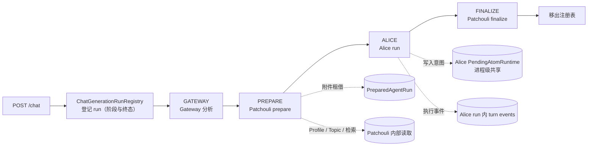
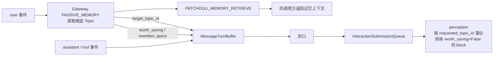
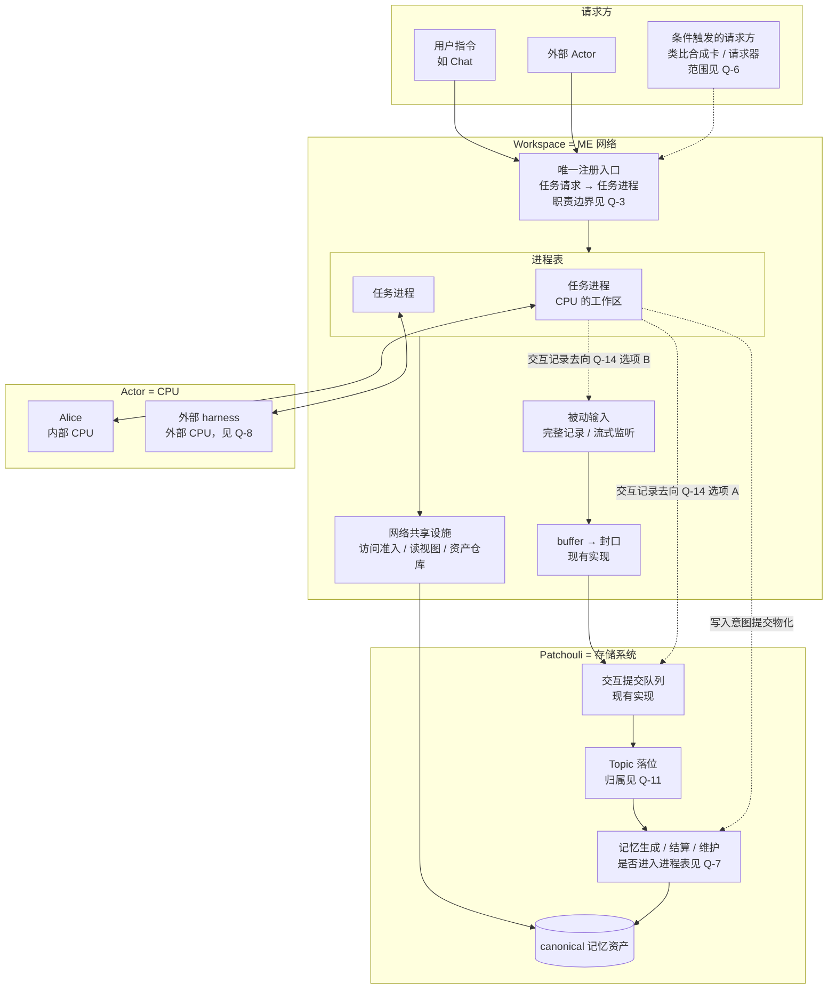
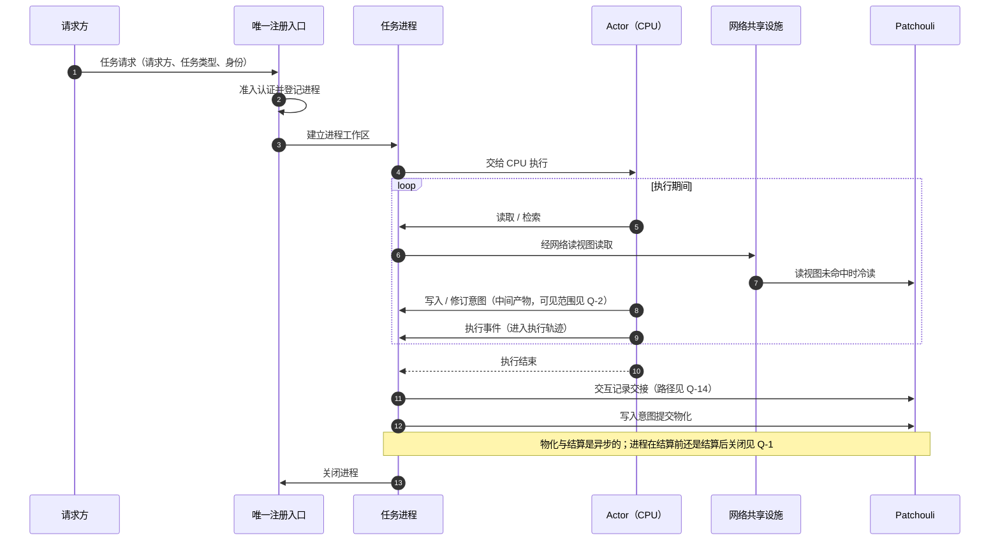
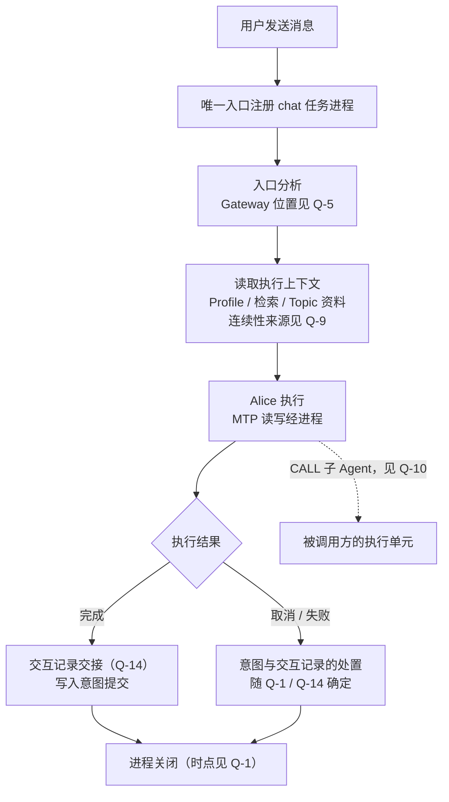
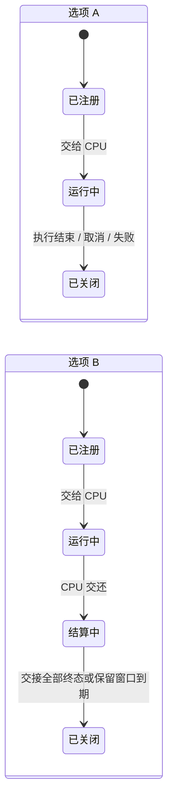
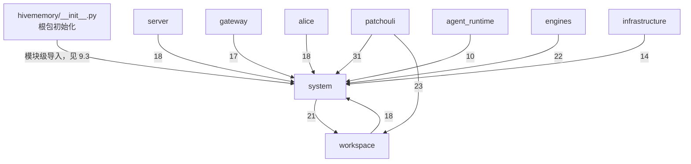
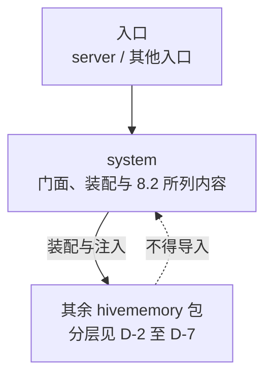
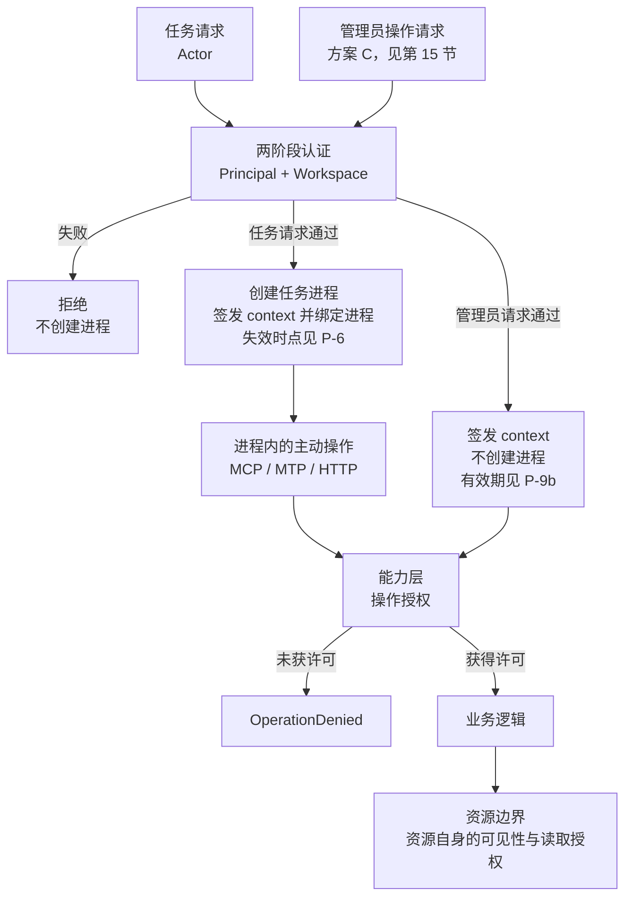
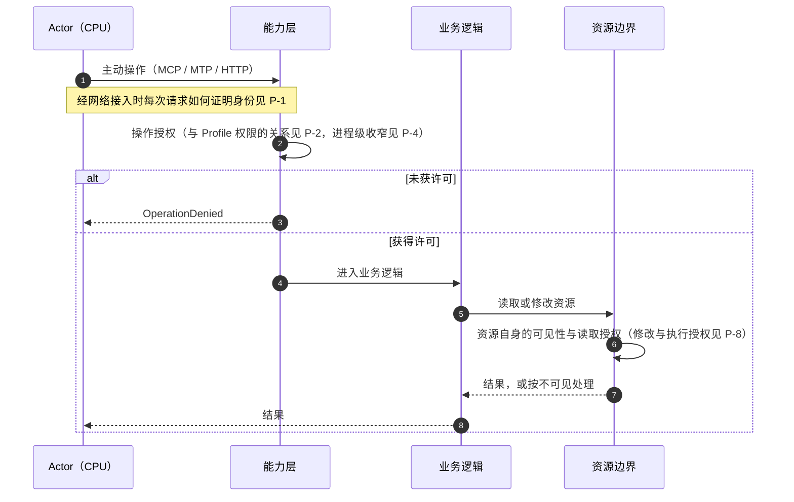

# Workspace 网络与任务进程架构

**文档状态**：Idea，未形成实施承诺
**覆盖范围**：第一部分——主动任务进程与被动输入；第二部分——system 包的边界；第三部分——认证与授权流程
**记录日期**：2026-09-26

## 0. 文档性质

本文记录 2026-09-26 关于 v0.7.0 方向重估的讨论结果，用于在进入任何 Plan 之前整理新架构的运行流程、包边界、权限流程与待决问题。

| 部分 | 前提（owner 提出） | 现状事实 | 图 | 已决定事项 | 待决问题 |
|:---|:---|:---|:---|:---|:---|
| 第一部分：主动任务进程与被动输入 | 第 2 节 | 第 3 节 | 第 4 节 | 无 | 第 5、6 节 |
| 第二部分：system 包的边界 | 第 8 节 | 第 9 节 | 第 9、11 节 | 第 11.0 节 | 第 10、11 节 |
| 第三部分：认证与授权流程 | 第 12 节 | 第 13 节 | 第 14 节 | 第 15 节 | 第 16 节 |

- **前提**是 owner 在讨论中提出的出发点，不表示已经实现或已经排期；
- **现状事实**对照当前代码核对，基于分支 `feat/workspace-runtime-and-capability` 在 2026-09-26 的工作区状态；
- 流程图只画出前提或已决定事项已经确定的部分，以及现状；凡是依赖待决问题的内容都标注问题编号；
- **已决定事项**记录 owner 在讨论中明确作出的选择；
- **待决问题**只列出选项及其影响，本文不替 owner 作出选择，选项顺序不代表倾向。

本文不修改任何当前事实文档，也不改变现有 v0.7.0 计划的状态；两者的关系见第 7 节与 M-6。

## 1. 背景

v0.7.0 计划 A 按组件与机制横向拆分（访问 → 缓存 → Session → Pending → API 收敛 → Actor 适配），每个子计划只改动各条运行流程的一小段，中间态依靠委托、re-export 与兼容入口维持。A2 实施过程中暴露出的现象（2026-09-26 工作区核对）：

- 读取记忆存在多条互不相通的路径：新的 workspace 读取能力（resolver 与缓存）已装配，但尚无生产调用方，只在测试中使用；HTTP 管理面经管理路由直读记忆库；Chat 在 Patchouli prepare 内部读取；Alice MTP 经自身 `RuntimeAliasResolver` 与缓存；Alice CALL 的 Profile 经自身解析器与缓存；Passive 直接调用检索路由。进程内同时存在两套原子缓存、两套 Profile 缓存与两套解析器；
- A1 的统一认证网关已装配，但没有生产入口调用；生产路径均走不带访问上下文的兼容分支，逐次行为授权在生产中实际未执行；
- `PatchouliService.prepare_agent_run` / `finalize_agent_run` 实际承担 Alice 会话的编排（Profile、Topic、检索与编译、附件租借与编译、组装 `AgentRunContext` 与 `StreamPrelude`、交互提交与物化派发），而计划把这部分职责退出排在 A5/A6；
- 包依赖与声明方向不一致：子系统、engines 与 infrastructure 对 `hivememory.system.*` 的导入约 130 处，`workspace` 与 `system` 相互导入，Patchouli 导入 `workspace.access` 23 处。

讨论由此转向：先从全系统运行流程重新定义架构，再决定组件归属。讨论中曾提出以“Actor Session”作为 Workspace 运行时的核心单位，该提法已由本文的任务进程模型取代。

## 2. 前提（owner 提出）

### 2.1 类比映射

| AE2 | HiveMemory |
|:---|:---|
| ME 网络 | Workspace |
| 存储系统 | Patchouli |
| 合成 CPU | 任意 Actor（Alice、外部 harness 等） |
| 合成任务 / 合成进程 | 一次任务请求对应的任务进程 |
| 合成卡、请求器等自动下单方 | 满足条件时创建任务的被动请求方 |
| Import Bus（只向网络输入） | 被动输入（Passive） |

### 2.2 主动任务：任务进程

1. 运行一个任务，需要为它保留一个“合成进程”；CPU 在进程内工作。
2. CPU 必须在 Workspace 的一个集中区域里工作，但这件事不由单一的 runtime 环境承担。原先把 Workspace runtime 当作 CPU 真实工作区的观念是半对半错。
3. 任意任务请求从**唯一入口**注册为一个进程，直到任务结束进程才关闭。这是新架构下 Workspace 网络的核心运作逻辑。
4. 请求方不只有用户主动下单；满足指定条件的被动请求方（类比合成卡、ME 请求器）也可以向网络创建任务。
5. 现有实现中与此最接近的是 chat application service 的 run 注册表：用户发出指令后，注册一个独立的 chat generation run。

### 2.3 被动输入：Passive

1. 现有 Passive 虽标为 passive，却在用户输入后主动提供记忆，本质上是主动读取的一种触发方式，边界不清。
2. 新架构下 Actor 可以任意替换，Passive 退化为：被动接收信息并转为记忆资产，**与记忆系统零主动交互**。
3. 两种接收方式：
   - 直接接收一份完整的交互记录；
   - 流式监听一个交互。
4. 两种方式最终通过同一个 buffer 与提交路径（现有实现）进入记忆生成。具体实现细节暂不讨论。

## 3. 现状事实（代码核对）

### 3.1 Chat run 注册表

[`ChatGenerationRunRegistry`](../../src/hivememory/system/runtime/control.py) 以 `interaction_id` 为键登记 run，提供 stop/cancel/status，并按 Workspace 校验控制请求。

- 阶段枚举把 chat 编排写死：`CREATED → GATEWAY → PREPARE → ALICE → FINALIZE → TERMINAL`；
- 注册表本身不持有工作状态：附件租借在 Patchouli prepare 返回的 `PreparedAgentRun` 中，写入意图在 Alice 的 `PendingAtomRuntime` 中，执行事件在 Alice run 中；
- 注册与编排都在 [`chat_service.py`](../../src/hivememory/system/application/chat_service.py) 内完成；finalize 结束后 run 从注册表移除。

### 3.2 写入意图的现有寿命

- 每个 AliceRuntime 只创建一个 `PendingAtomRuntime` 实例（[`alice/runtime/core.py`](../../src/hivememory/alice/runtime/core.py)），主帧与子帧共享；
- 任何一个根 run 以 COMPLETED 收尾时，[`AgentRuntime.finalize_run`](../../src/hivememory/agent_runtime/runtime.py) 都会调用 `evict_by_run`：把**其他** run 中已结算、失败或取消的意图标为 EXPIRED，并删除上一次已标为 EXPIRED 的意图；非 COMPLETED 的 run 调用 `cancel_run`；
- 因此一条已结算意图还能保留多久，取决于其后有多少个根 run 完成，其中也包括其他用户的 run。意图在事实上比产生它的 run 活得更久，但没有明确的持有者与保留期限。

### 3.3 Passive 的现有行为

在 [`PassiveMessageIngressor`](../../src/hivememory/system/services/passive/ingressor.py) 中，user 事件先把上一轮交接到队列，再调用 memory context provider：经 Gateway `PASSIVE_MEMORY` 模式分析，再调用 `PATCHOULI_MEMORY_RETRIEVE` 检索，并把检索结果返回给调用方。

Passive 对 Gateway 的依赖不止于检索：

- **Topic 落位**：[`MessageTurnBuffer`](../../src/hivememory/system/services/passive/turn_buffer.py) 保存 Gateway 决策，提交时以 `gateway_decision.target_topic_id` 作为 `requested_topic_id`。Gateway 做话题路由时会读取 Patchouli 的候选话题；
- **价值信号**：`rewritten_query` 与 `worth_saving` 取自 Gateway 决策写入 `InteractionPayload`；perception 冻结生成材料时排除 `worth_saving=False` 的 block（[`engines/perception/models.py`](../../src/hivememory/engines/perception/models.py)）。

### 3.4 统一的交互提交队列

自 v0.6.1 起，Active finalize 与 Passive 共用 [`InteractionSubmissionQueue`](../../src/hivememory/patchouli/control/interaction_submission.py)。Active 一侧以同步的 applied gate 作为继续物化等后续副作用的边界。

### 3.5 记忆库内部工作

记忆生成（独立业务 lane）、Topic 的空闲/LRU 结算，以及在全局维护调度器上注册的维护任务，目前都在 Patchouli 或 System 调度设施内部运行，不由任何 Actor 执行。

## 4. 流程图

### 4.1 全局拓扑

虚线表示依赖待决问题的连接。

### 4.2 任务进程的生命周期（前提部分）

前提只确定“从唯一入口注册、任务结束后关闭”。“任务结束”如何判定属于 Q-1，两种选项的状态图见 Q-1。

### 4.3 主动任务进程的通用流程

### 4.4 以 Chat 为例的任务类型

骨架的形态见 Q-4，Gateway 的位置见 Q-5，连续性来源见 Q-9。

### 4.5 被动输入流程

## 5. 待决问题：任务进程与被动输入

每个问题只列出选项及其影响，不作选择；选项顺序不代表倾向。

### Q-1 进程何时关闭

**背景**：AE2 中合成任务结束即产物回到网络存储，是同步、可确认的。HiveMemory 中交互要等 applied 才进入 Topic，写入意图的物化可能需要数十秒以上，结果也可能被丢弃。现状下意图的寿命见 3.2。

| 选项 | 内容 | 影响 |
|:---|:---|:---|
| A | 执行结束即关闭：Actor 执行完毕、交接已提交后关闭进程 | 结算发生在进程关闭之后；尚未结算的意图需要进程之外的持有者，其保留期限需另行定义 |
| B | 两阶段关闭：运行中 → 结算中 → 关闭。结算中的进程已不占用 CPU，仍留在进程表中；在所有交接到达终态或保留窗口到期后关闭 | 意图在关闭前归该进程；进程表中存在不占用 CPU 的进程，需要定义保留窗口、容量与停机时的处理 |

### Q-2 写入意图（中间产物）的可见范围

**背景**：AE2 中合成 CPU 存储的中间材料不出现在网络存储视图中。现状下意图在同一 AliceRuntime 内共享，可见性按 `identity_scope` 相等判断。原 A4 计划的目标之一是外部 Actor 与后续 run 都能读回意图。

| 选项 | 内容 | 影响 |
|:---|:---|:---|
| A | 仅本进程可见（以及其子执行单元，取决于 Q-10）；结算后以正式记忆出现在网络中 | 后续任务在结算前读不到上一个任务的意图别名，与现状在同一 AliceRuntime 内可读不同 |
| B | 本进程及显式声明的前驱进程链可见 | 需要定义前驱的声明方式、校验与链长 |
| C | 在 Workspace 内按 policy 可见（原 A4 方向） | 意图需要 Workspace 级的登记与可见性策略，与“中间产物归进程”的类比不同 |

### Q-3 唯一注册入口的职责边界

**背景**：现有注册表把 chat 阶段写死在枚举中，且不持有工作状态（3.1）。

| 选项 | 内容 | 影响 |
|:---|:---|:---|
| A | 入口只负责注册与通用生命周期：进程标识、准入认证、请求方、状态、取消、停机收尾；执行步骤由各任务类型定义 | 需要任务类型的登记与分派机制；入口不认识具体流程 |
| B | 入口同时承担各任务类型的编排 | 入口需要认识全部任务类型，新增任务类型需要改动入口 |
| C | 其他划分 | —— |

**子问题 Q-3a**：哪些现有工作状态进入进程工作区。候选包括写入意图、附件租借、执行轨迹、访问上下文；每一项都可以选择进入进程，或留在网络共享设施 / 其他位置。

**子问题 Q-3b**：唯一入口指唯一的注册点，还是同时要求唯一的传输入口（HTTP、外部协议、触发器是否都经同一个对外端点）。

### Q-4 “合成树”在 HiveMemory 中的形态

**背景**：AE2 的合成计划由样板确定性推导；Agent 任务是在线的“生成—行动—观察”循环（见 [AE2 类比 §1](./ae2-hivememory-architecture-analogy.md#1-结论摘要)）。ROADMAP 中通用 workflow / DAG 为 Unscheduled。

| 选项 | 内容 | 影响 |
|:---|:---|:---|
| A | 任务类型只定义固定骨架（如 chat：分析 → 读上下文 → 执行 → 交接），骨架内部由 Actor 在线决定 | 不需要计划表示与规划器；骨架随任务类型维护 |
| B | 进程启动时计算显式执行计划（任务图），CPU 按计划执行 | 需要计划表示、规划器与计划失败语义，接近 AE2 类比中的 Job Graph |
| C | 按任务类型选择 A 或 B | 两套机制并存 |

### Q-5 Gateway 在新架构中的位置

**背景**：Gateway 现有 `ACTIVE_CHAT`（命令、查询分析、检索计划、话题路由）与 `PASSIVE_MEMORY`（分析、话题路由、价值信号）两种模式。

| 选项 | 内容 | 影响 |
|:---|:---|:---|
| A | 作为特定任务类型（如 chat）在进程内的入口分析步骤 | 其他任务类型不经 Gateway |
| B | 作为唯一注册入口的通用前置步骤，对所有任务请求执行 | 所有任务类型共享入口分析，Gateway 需能区分任务类型 |
| C | 其他 | —— |

**子问题 Q-5a**：Gateway 命令（如 `/compact` 一类）是注册为任务进程，还是作为直接的网络操作执行而不建立进程。

**子问题 Q-5b**：`PASSIVE_MEMORY` 模式的去留，取决于 Q-11 与 Q-12。

### Q-6 触发型请求方的范围

**背景**：前提 2.2 第 4 条允许条件触发的请求方。VISION 阶段 E 把“记忆事件触发 Agent 唤醒”放在前序阶段取得证据之后。

| 选项 | 内容 | 影响 |
|:---|:---|:---|
| A | 当前阶段只在注册请求中保留请求方类型，不实现触发条件与调度 | 入口形状兼容触发方，不交付触发能力 |
| B | 实现一种最小触发机制 | 需要定义触发条件、去重、失败与取消语义 |
| C | 当前阶段不考虑触发型请求方 | 入口形状以后可能需要调整 |

### Q-7 记忆库内部工作与进程表

**背景**：记忆生成、Topic 结算与维护任务目前在 Patchouli 或调度设施内部运行，不由 Actor 执行（3.5）。在 AE2 中，存储系统的存取不经过合成 CPU。

| 选项 | 内容 | 影响 |
|:---|:---|:---|
| A | 不进入进程表，保留在 Patchouli 内部队列与维护调度 | 进程表只包含由 Actor 执行的任务 |
| B | 全部进入统一进程表 | 进程表成为全局任务表，承担调度职责 |
| C | 部分进入（例如由模型驱动的生成任务进入，纯维护不进入） | 需要明确划分标准 |

### Q-8 外部 CPU 的进程

**背景**：Alice 在进程内运行，注册表能取消它，也知道它何时结束。外部 harness 不受网络控制，更接近 AE2 中“处理样板 → 外部机器”：网络送出材料，等待产物回流。

- **Q-8a 回收方式**：请求方显式关闭 / TTL / 心跳 / 组合。
- **Q-8b 取消语义**：网络对外部 CPU 的取消能做到什么程度（例如吊销访问、丢弃未提交的意图、通知外部方），各项分别是否纳入。
- **Q-8c 粒度**：外部 harness 的一轮对应一个进程 / 一个外部会话对应一个进程 / 由接入适配层决定。

### Q-9 对话连续性的承载

**背景**：进程按任务划分后，多轮对话的连续性不在单个进程内。现状下 chat 的连续性来自 Gateway 的话题路由与 Topic 工作集；`ChatRequest.session_id` 只是兼容字段；原 A3 计划设计了 `ConversationSession` 记录。

| 选项 | 内容 | 影响 |
|:---|:---|:---|
| A | 仅依靠 Topic（记忆库侧） | 不新增会话对象；外部会话标识到 Topic 的映射需另行处理 |
| B | 保留独立的会话记录（作为数据记录，不是运行时容器） | 需要定义会话记录的归属、保留与读取 |
| C | 由进程链（进程声明前驱）承载 | 与 Q-2 选项 B 相关 |
| D | 以上组合 | —— |

### Q-10 CALL 子 Agent

**背景**：被调用方有不同的 agent_id、Profile 与 MTP 权限。现状下子帧与主帧共享 `PendingAtomRuntime`，子帧写入主帧可见；现有规则是 CALL 只能从根 frame 发起。

| 选项 | 内容 | 影响 |
|:---|:---|:---|
| A | 子进程：带被调用方身份与访问上下文、父进程链接 | 需要定义父子间意图可见性，以及“只有顶层进程可派生子进程”等规则 |
| B | 共用父进程，以 frame 区分 | 父进程的访问上下文需要容纳多个身份与权限 |
| C | 其他 | —— |

### Q-11 被动交互的 Topic 落位

**背景**：现状由 Gateway 决策给出目标 Topic，Gateway 路由时读取候选话题（3.3）。

| 选项 | 内容 | 影响 |
|:---|:---|:---|
| A | 记忆库在接收时自行落位 | 需要在记忆库侧提供落位能力；`PASSIVE_MEMORY` 模式可以移除 |
| B | 被动交互仍经 Gateway 路由 | 输入链仍会读取候选话题，与“零主动交互”的前提需要重新界定 |
| C | 由输入方显式指定或提示，记忆库校验 | 外部来源需要掌握 Topic 信息 |

### Q-12 被动交互的价值信号（worth_saving）

**背景**：现状由 Gateway 给出，perception 据此排除 block（3.3）。ROADMAP 的“记忆价值策略重设计”要求入口信号不能替代 Patchouli 的最终决定。

| 选项 | 内容 | 影响 |
|:---|:---|:---|
| A | 被动交互不提供该信号，按现有语义视为保留 | 进入生成的材料可能增加 |
| B | 记忆库在接收或感知阶段自行评估 | 需要记忆库侧的评估能力及其成本 |
| C | 输入方可选提供提示，记忆库决定是否采纳 | 需要定义提示的来源与可信度 |

### Q-13 “完整交互记录”接收方式的范围

**背景**：ROADMAP v0.7.2 的历史对话导入有独立语义：历史发生时间、批次、去重，不重放进当前活跃话题。

| 选项 | 内容 | 影响 |
|:---|:---|:---|
| A | 只接收实时或刚结束的交互；历史导入另设通道 | 两条通道语义分开 |
| B | 同时作为历史导入入口 | 需要在该接收方式中承载历史时间、批次、去重与不重放等语义 |

### Q-14 主动进程的交互记录去向

**背景**：Active finalize 与 Passive 已共用同一提交队列，Active 有 applied gate（3.4）。原 A3/A4 设计中，写入意图的物化需要读取本轮交互所在 Topic 的资料。

| 选项 | 内容 | 影响 |
|:---|:---|:---|
| A | 进程自行封口并提交交互记录（与现有 finalize 形态相同） | 外部 harness 若同时被动上报对话又开主动进程，需要规则避免同一交互被记录两次 |
| B | 进程把执行轨迹作为一份完整交互记录交给被动输入通道；进程自身只读取与提交写入意图 | 被动输入通道需要向提交方返回可等待的 applied 回执；Alice 与外部 harness 在记录侧成为同类来源 |

## 6. 待决问题：迁移与现有工作（来自前序讨论）

| 编号 | 问题 | 选项 |
|:---|:---|:---|
| M-1 | 迁移的切分方式 | 按流程纵切（一条流程整体切换并删除其旧路径） / 按组件横切（现 A 系列方式） / 其他 |
| M-2 | 包边界调整（第二部分 D-1 至 D-9）相对流程迁移的先后 | 先于流程迁移 / 与流程迁移同步进行 / 其他 |
| M-3 | 第一条迁移到新架构的流程 | 外部 Actor 闭环 / Chat（Alice） / Passive / 其他 |
| M-4 | 迁移期间的兼容范围 | 只保证数据兼容 / 保留代码层兼容窗口 / 按接口逐项决定 |
| M-5 | v0.7.0 的范围 | 维持原范围 / 按新架构重新划定 / 拆分到多个版本 |
| M-6 | 现有 v0.7.0 计划文档（协调入口、边界宪章、WRX-0 清单、A2–A6、计划 B）的处理 | 继续执行 / 由新架构文档替代后归档 / 部分承接后归档 |
| M-7 | 当前分支未提交的 A2-1 改动（2026-09-26 unit + integration：2518 passed，2 skipped） | 提交为检查点 / 暂存不提交 / 回退 / 部分保留 |

## 7. 与既有文档的对应关系

下表只列出概念上的对应，不表示承接关系已经确定（见 M-6）。

| 本文元素 | 既有文档中的相关内容 |
|:---|:---|
| 唯一注册入口、进程生命周期 | 现有 chat run 注册表；[Chat Run 生命周期后续候选](./chat-run-lifecycle-follow-ups.md) |
| 进程中的写入意图 | [A4 共享 Pending](../plans/v0.7.0-a4-pending-memory-intents.md)；[边界宪章 §6.2](../plans/v0.7.0-plan-a-boundary-charter.md#62-pending最重论证) |
| 网络共享读视图 | [A2 读取能力面与派生缓存](../plans/v0.7.0-a2-workspace-resource-reads-and-caches.md) |
| 对话连续性（Q-9） | [A3 Conversation Session](../plans/v0.7.0-a3-conversation-session-and-topic-projection.md) |
| 被动输入 | [Passive Ingress 当前设计](../system/passive-ingress.md)；[计划 B](../plans/v0.7.0-external-memory-service-and-actor-interaction.md) |
| 访问准入 | [Workspace 架构](../architecture/workspace.md)第 4 节；[A1（归档）](../archive/plans/v0.7.0-a1-workspace-access-boundary.md) |
| CPU / 进程 / 子网类比 | [AE2 与 HiveMemory 的架构同构性](./ae2-hivememory-architecture-analogy.md) |
| 独立工作契约、事件协作纪律、断开测试 | [边界宪章 §4](../plans/v0.7.0-plan-a-boundary-charter.md#4-独立工作契约) |

## 8. 第二部分前提（owner 提出）

### 8.1 问题

1. 旧流程下，system 的 server-application 层是系统唯一的对外交互能力提供者。
2. 新架构下，核心的通用交互主体落在 workspace 上：外部 Actor、Alice 和管理员用户都应当通过与 workspace 交互获得系统的能力。
3. system 依旧是最顶层的搭建者，workspace 作为被装配的一部分包括在 system 内。
4. 现有分割不支持将两者分离：
   - access 网关建立在 system 的边界上；
   - 所有 runtime 基础设施（bus、scheduler 等）都位于 system 中；
   - 两边各自依赖对方的内容，始终相互导入。

### 8.2 留在 system 的内容

把 system 中所有有争议的内容搬走后，剩下的是：

1. 顶层系统门面与装配，这是 system 包本身应当具有的能力；
2. `model_registry` 与 `provider_registry` 两个注册表，以及针对外部 Actor 信息的注册表；
3. 系统配置 config；
4. attachment 的实现；
5. passive 的实现。

这些内容均与新的交互架构流程无关，因此得以保留在 system 层面。

### 8.3 迁出内容的去处

- 迁出的内容不会自动落入 workspace；
- 通用基础设施组件的实现曾考虑放入 infrastructure 层，但 infrastructure 更贴近真实服务的适配。

### 8.4 本部分要回答的问题

在完成新的架构流程之前，至少要解决“如何得到一个真正的 system 包”，或者决定“system 包是什么”。

## 9. 第二部分现状事实（代码核对）

### 9.1 各包对 system 的导入

统计口径为 import 语句数，包括函数内导入与 `TYPE_CHECKING` 导入。

- workspace → system（18）：config 4、runtime.bus 5、contracts.routes 5、services.attachments 2、runtime.workspace 1、runtime.serial_gate 1；
- system → workspace（21）：assembler 9、system.py 6、A2 迁移期保留在 `system/application` 的转发模块 5、access.gateway 1；
- `system/__init__.py` 为避免 system → assembler → workspace.capability → system 的循环导入，把 `HiveMemorySystem` 改为惰性导出（A2 §8 D-2 的过渡处理）。

### 9.2 system 各子模块的外部依赖方

| system 子模块 | system 之外的依赖方（import 语句数） | 性质 |
|:---|:---|:---|
| `config` | engines 22、infrastructure 11、patchouli 5、workspace 4、agent_runtime 4、gateway 4、server 3、alice 2、根包 1 | 组件配置模型与根加载器 |
| `runtime.bus` | workspace 5、gateway 4、patchouli 3、alice 3、agent_runtime 2 | 进程内通信 |
| `runtime.events` | patchouli 5、gateway 5、alice 1 | 观测事件机制 |
| `runtime.publisher` / `runtime.operations` | patchouli 2、alice 2 / patchouli 1 | 观测事件机制 |
| `contracts.runtime_events` | server 2、gateway 2、patchouli 1、alice 1 | 观测事件模型 |
| `contracts.routes` | workspace 5、alice 3、agent_runtime 2 | 跨子系统契约常量 |
| `contracts.route_names` / `contracts.subsystem` / `contracts.events` | patchouli、gateway、alice 各 1 / 同左 / patchouli 1、alice 1 | 跨子系统契约常量 |
| `runtime.work_queue` | patchouli 6、infrastructure 3 | 任务队列机制与端口 |
| `runtime.scheduler` | patchouli 2 | 周期调度 |
| `runtime.serial_gate` | workspace 1 | 并发原语 |
| `runtime.workspace` | patchouli 3、workspace 1 | WorkspaceAssetStore 与端口 |
| `model_registry` | alice 3、agent_runtime 2、server 2 | 模型登记 |
| `provider_registry` | server 2 | Provider 登记 |
| `services.attachments` | server 2、workspace 2 | 附件解析与上传 |
| `services.passive` | server 1、根包 1 | 被动输入 |
| `access` | 无，仅由 assembler 装配 | 认证网关与接入登记 |
| `runtime.control` | 无，仅由 chat_service 使用 | chat run 注册表 |
| `application.chat_service` / `application.passive_ingress_service` / 门面 | 仅 server | 入口与门面 |

### 9.3 根包初始化

[`src/hivememory/__init__.py`](../../src/hivememory/__init__.py) 在模块级导入 core.models、system.config、infrastructure（llm、embedding、rerank、storage）、utils、system.services.passive、engines（generation、retrieval、lifecycle、perception）、core.protocol 与 server.models。

Python 导入任何 `hivememory.x` 之前都会先执行根包初始化。实测：只执行 `import hivememory.core.models`，就会加载 51 个 `hivememory.system` 模块，以及 patchouli、server、engines、infrastructure 等包。同理，导入 `hivememory.system.x` 之前会先执行 `system/__init__.py`。

### 9.4 配置的组成

`HiveMemoryConfig`（[`system/config/__init__.py`](../../src/hivememory/system/config/__init__.py)）聚合 15 个配置段：system、logging、scheduler、runtime_events、i18n、shared、gateway、passive_ingress、memory_compiler、patchouli、alice、attachment_parser、attachment_compiler、access、workspace。

- 各组件的配置模型（如检索、生成、生命周期、LLM、embedding、Qdrant 配置）都定义在 `system/config/` 下，由 engines、infrastructure 与各子系统直接导入（见 9.2）；
- YAML、`.env` 与环境变量的加载也在同一个包中；
- `model_registry` 与 `provider_registry` 依赖 `config.shared` 中的 `LLMConfig` 与 `ProviderCredentials`。

### 9.5 infrastructure 的现状

- 内容：LLM、embedding、rerank、Qdrant 存储、日志处理器、websocket 管理、速率限制、内存版 work store，以及 trace context；
- [`infrastructure/work_queue/in_memory_store.py`](../../src/hivememory/infrastructure/work_queue/in_memory_store.py) 实现的是 `system/runtime/work_queue` 定义的端口，并导入其模型、策略与异常；
- [`infrastructure/trace_context.py`](../../src/hivememory/infrastructure/trace_context.py) 是追踪上下文机制，被 `system/runtime/events.py` 与 `system/application/chat_service.py` 导入；
- infrastructure 导入 `system.config` 11 次。

### 9.6 8.2 所列内容的现有依赖

- **注册表**：`ModelRegistry` 被 `alice/system.py`、`alice/runtime/core.py`、`agent_runtime/runtime.py` 导入；`ModelNotFoundError` 被 `agent_runtime/runtime.py` 与 `alice/orchestration/sub_agent/call_response.py` 导入；`provider_registry` 只被 server 使用。外部 Actor 接入登记（`system/access/registry.py`）只被同包的认证网关使用。
- **config**：见 9.2 与 9.4。
- **attachment**：代码中是两部分。
  - `system/services/attachments`：解析器、上传、解析服务，被 server 与 `workspace/capability/assets.py` 使用；
  - `system/runtime/workspace`：WorkspaceAssetStore 与读取、命令端口，被 `patchouli/service.py`、`patchouli/system.py`、`patchouli/services/memory_generation.py` 与 workspace 使用。
- **passive**：`system/services/passive` 被 server 与根包导入；它向下依赖 `patchouli.control.interaction_submission`，以及用于渲染记忆上下文的 `engines.memory_compiler`。

### 9.7 其他相关事实

- A1 的认证网关（`system/access/gateway.py`）已装配，但没有生产入口调用（见第 1 节）。
- 以 `Runtime` 结尾的类名已有：`AliceRuntime`、`AgentRuntime`、`KoakumaRuntime`、`PendingAtomRuntime`、`PatchouliRuntime`、`GatewayRuntime`、`WorkspaceRuntime`、`WorkQueueRuntime`；此外还有 `system/runtime` 子包。
- 第一部分 4.1 的全局拓扑把被动输入画在 Workspace 网络内部，而 8.2 把 passive 列为留在 system 的内容，两处不一致（见 D-8）。

## 10. 第二部分：待安置内容清单

下表列出不在 8.2 保留范围内、需要决定去处的内容。“讨论中出现的候选去处”只记录讨论中提到过的方向，均未决定，也不排除其他去处。

| 内容 | 现位置 | 讨论中出现的候选去处 |
|:---|:---|:---|
| 总线（AsyncSystemBus、GlobalSystemBus） | `system/runtime/bus` | 独立的运行时机制层 / infrastructure / core / 留在 system |
| 周期调度 | `system/runtime/scheduler` | 同上 |
| 任务队列机制与端口 | `system/runtime/work_queue` | 同上（内存版 store 现位于 infrastructure） |
| 观测事件机制（events、publisher、operations） | `system/runtime` | 同上 |
| 串行门 | `system/runtime/serial_gate.py` | 同上 |
| 追踪上下文 | `infrastructure/trace_context.py` | 独立的运行时机制层 / 留在 infrastructure |
| 跨子系统契约常量（route_names、routes、events、subsystem）与 RuntimeEvent 模型 | `system/contracts` | core / 独立的运行时机制层 / 留在 system |
| 组件配置模型 | `system/config` | 各归属组件 / 中立的配置模型包 / 留在 system |
| 认证网关与 CallerPrincipal | `system/access` | workspace / 留在 system |
| chat run 注册表 | `system/runtime/control.py` | workspace（演化为进程表） / 留在 system |
| chat 编排 | `system/application/chat_service.py` | workspace / alice / 独立的任务类型包 / 留在 system |
| WorkspaceAssetStore 与端口 | `system/runtime/workspace` | workspace / 留在 system |
| readiness | `system/application/readiness_service.py` | 随门面留在 system / 其他 |
| A2 迁移期转发模块 | `system/application/{agent,memory,memory_task,topic,workspace_asset}_service.py` | 取决于 M-7 |

## 11. 第二部分待决问题

### 11.0 已决定事项（owner 于 2026-09-26 批准，已在分支实施）

以下决定覆盖本节原列问题；第 9 节的现状事实描述的是实施前的状态。

| 问题 | 决定 |
|:---|:---|
| D-1 / D-1a | system 是依赖图顶点：除入口（server）外无包导入 system；根包只导入版本号。由 `tests/unit/architecture/test_package_layers.py` 守护 |
| D-2 | 新建 `components` 包（L1）：总线、调度器、work queue、运行时事件、串行门、trace context |
| D-3 | 契约常量与 RuntimeEvent 模型进入 `core.contracts` |
| D-4 | 新建顶层 `config` 包（L0），按子系统与高聚合组件组织配置段（`shared` / `patchouli` / `gateway` / `alice` / `memory_compiler` / `attachments` / `workspace` / `runtime` / `passive` / `access`），根配置与加载位于 `config.app`，只供 system 与 server 导入（分层测试守护）；子系统构造函数只接收自己的配置段。曾先按“配置模型随归属组件分散”实施，因同一配置段被拆进多个包而改为本方案 |
| D-5 | 下层定义端口、system 实现并注入：`core.access.PrincipalAuthenticator`、`agent_runtime.model_resolution.ModelResolver`（`ModelNotFoundError` 移至 core）；Patchouli 经 `core.access.WorkspaceAccessVerifier` 消费行为检查 |
| D-6 | 认证网关拆分：两步编排位于 `workspace.authentication`，Principal authentication 由 `system.access.SystemPrincipalAuthenticator` 实现 |
| D-7 | 解析器移至 `infrastructure.attachments`；AssetStore、解析交接与上传移至 `workspace.assets`；资产端口移至 `core.ports` |
| D-8 | passive 留在 system，作为 system 级服务 |
| D-9 | chat 编排与 chat run 注册表暂置 `alice.application`（待 Q-3 决定最终归属） |

实施中的两处偏差：

- 8.2 / D-8 讨论中提到的“来源 → 目标 Workspace”登记表未实施：它改变 ingest 行为，空配置时会使现有被动接入失效，需单独决定配置形态与缺省行为；D-8a 仍待决；
- engines 对 patchouli.memory_library、gateway.commands、agent_runtime.aliases 的 13 处既有向上导入未在本次处理，作为已知例外登记在分层测试中。

每个问题只列出选项及其影响，不作选择；选项顺序不代表倾向。

### D-1 system 的定义

| 选项 | 内容 | 影响 |
|:---|:---|:---|
| A | system 是依赖图的顶点：除入口（server 及其他入口）外，没有任何 hivememory 包导入 system；以导入边界测试守护 | 8.2 中被下层使用的内容需按 D-4、D-5 处理；受 D-1a 约束 |
| B | system 是顶层装配者，但允许下层导入其中划定的部分（如配置、登记表），维护允许清单 | 保留部分向上依赖，需要持续维护允许清单（类似 A2 §8 D-2 的分层白名单） |
| C | 其他定义 | —— |

选项 A 下的依赖约束如下，其余各层如何划分取决于 D-2 至 D-7：

**D-1a 根包初始化**：根包在模块级导入了 system、engines、infrastructure 与 server.models（9.3）。

| 选项 | 内容 | 影响 |
|:---|:---|:---|
| A | 根包只保留最小导出（如版本），不在模块级导入子包 | 现有 `from hivememory import ...` 的用法需要改写 |
| B | 保留公共导出，改为惰性导出 | 导出清单继续由根包维护 |
| C | 保持现状 | 静态导入规则仍可检查，但运行时导入任何包都会连带加载 system |

### D-2 运行时机制的归属

对象：总线、周期调度、任务队列机制与端口、观测事件机制、串行门。

| 选项 | 内容 | 影响 |
|:---|:---|:---|
| A | 新建独立的运行时机制层，位于各子系统之下 | 新增一个包及其导入规则；infrastructure 中的内存版 store 继续作为该层端口的适配器 |
| B | 放入 infrastructure | infrastructure 同时包含外部服务适配器与进程内机制 |
| C | 放入 core | core 从依赖中立的模型与契约扩展为包含运行时机制 |
| D | 留在 system | 与 D-1 选项 A 冲突 |

- **D-2a 命名**：若选 A，新包的名称。现有命名中已大量使用 `Runtime`（9.7）。
- **D-2b 追踪上下文**：`infrastructure/trace_context.py` 是否随之迁入。
- **D-2c 范围**：上述对象是否全部纳入，或部分另行安置。

### D-3 跨子系统契约常量的归属

对象：route_names、routes、events、subsystem 与 RuntimeEvent 模型。

| 选项 | 内容 | 影响 |
|:---|:---|:---|
| A | core | 与 AGENTS.md 对 Core/Contracts 的职责描述（route/event 常量）一致 |
| B | 运行时机制层（取决于 D-2） | 契约常量与承载它们的机制放在一起 |
| C | 留在 system | 与 D-1 选项 A 冲突 |

### D-4 配置的拆分

前提 8.2 把 config 留在 system。组件配置模型目前被下层直接导入（9.2、9.4）。

| 选项 | 内容 | 影响 |
|:---|:---|:---|
| A | 根加载与聚合留在 system；组件配置模型随各归属组件定义，`HiveMemoryConfig` 聚合它们 | 配置模型分散到各包；system 的聚合器导入各组件 |
| B | 根加载与聚合留在 system；组件配置模型集中到一个位于下层的中立包 | 配置模型集中维护，与组件分离 |
| C | 全部留在 system | 与 D-1 选项 A 冲突 |

### D-5 留在 system 但被下层使用的内容

对象：`ModelRegistry` 与 `ModelNotFoundError`（被 alice、agent_runtime 使用）、附件解析与上传（被 workspace 上传能力使用）、外部 Actor 接入登记（被认证网关使用，视 D-6 而定）。

| 选项 | 内容 | 影响 |
|:---|:---|:---|
| A | 下层定义端口协议与错误类型，system 实现并在装配时注入 | 每项需要一个端口定义；使用方不直接依赖 system |
| B | 把这些内容下移到被使用的层 | 与 8.2 的保留清单不一致，需要调整前提 |
| C | 逐项分别决定 | —— |

### D-6 认证网关的归属

对象：`system/access/gateway.py` 与 `CallerPrincipal`。前提 8.1 第 2 条要求外部 Actor、Alice、管理员用户都通过 workspace 获得能力。

| 选项 | 内容 | 影响 |
|:---|:---|:---|
| A | workspace，由唯一注册入口承担认证 | 接入登记数据由 system 提供（见 D-5）；与第一部分 Q-3 相关 |
| B | 留在 system | workspace 需要经 system 取得认证结果，与 D-1 选项 A 的方向需要协调 |
| C | 其他 | —— |

### D-7 附件的拆分与去处

附件在代码中是两部分（9.6）。

- **D-7a 解析与上传**：system（8.2 的保留范围） / infrastructure / engines / workspace。若留在 system，workspace 的上传能力如何使用它见 D-5。
- **D-7b WorkspaceAssetStore 与端口**：workspace（第一部分中的网络共享设施） / 留在 system / 其他。与第一部分 Q-3a（附件租借是否归进程）相关。

### D-8 passive 的定位

| 选项 | 内容 | 影响 |
|:---|:---|:---|
| A | system 级服务 | 与 8.2 一致；需要修改第一部分 4.1 的全局拓扑图 |
| B | Workspace 网络内的输入设施 | 与第一部分 4.1 一致；需要调整 8.2 的保留清单 |

**D-8a passive 的接入认证**：被动输入需要确定目标 Workspace 与来源。它经统一认证网关 / 使用独立的来源登记 / 其他。

### D-9 chat 编排与 chat run 注册表的去处

- **D-9a chat run 注册表**（`system/runtime/control.py`）：workspace（演化为第一部分的进程表） / 留在 system / 其他。
- **D-9b chat 编排**（`system/application/chat_service.py`，即 chat 任务类型的执行步骤）：workspace / alice / 独立的任务类型包 / 留在 system。

两者与第一部分 Q-3、Q-5 相关。

### 11.1 与第一部分问题的关联

| 本部分问题 | 结论是否依赖第一部分的问题 |
|:---|:---|
| D-1、D-1a、D-2、D-3、D-4、D-5 | 不依赖 |
| D-6 | 依赖 Q-3（唯一注册入口的职责边界） |
| D-7b | 依赖 Q-3a（哪些工作状态进入进程工作区） |
| D-8 | 与第一部分 4.1 的拓扑图相互影响 |
| D-9 | 依赖 Q-3、Q-5 |

### 11.2 相关文档

- [AGENTS.md](../../AGENTS.md) 第 3 节：当前所有权表与依赖方向；
- [系统边界与所有权](../architecture/boundaries.md)第 9 节：当前允许的调用方向；
- [System 组合根](../system/composition.md)；
- [A2 §8 D-2](../plans/v0.7.0-a2-workspace-resource-reads-and-caches.md#81-owner-裁定)：workspace 包的分层导入白名单（过渡形态）。

## 12. 第三部分前提（owner 提出）

1. 前两部分的架构流向问题解决后，workspace 将成为唯一的集中交互能力提供者，system 的 server 层也只是它的消费者。
2. 借由唯一的任务请求注册入口进行两阶段身份认证：
   - **Principal authentication**：请求方身份是否合法注册在系统内；
   - **Workspace authentication**：当前 actor 是否有权限在这个 workspace 中工作。
3. 未通过两阶段认证的请求，不创建任务进程。
4. 进程内，actor 的任何主动操作请求（MCP、MTP、HTTP 请求）都导向 workspace 的能力层；能力层是 actor 唯一可见的 API 接口。
5. 能力层进行统一的操作权限授权（Operation Authorization），通过后才进入业务逻辑。
6. 资源自身的可见性授权与读取权限，仍留在资源读取边界上各自进行，因为任意资源在运行时可能来回变动所处位置，并被缓存。
7. system 管理员操作与普通 agent actor 性质不同：只有操作请求，没有完整的任务进程周期。这是把 system 操作也兼并为 CPU 的一种所带来的代价。
8. 至此，以 A1 为代表的 workspace 权限体系在新架构下的流程已经理顺。

## 13. 第三部分现状事实（代码核对）

### 13.1 A1 的认证与授权组件

| 组件 | 位置 | 现有行为 |
|:---|:---|:---|
| 统一认证网关 | [`system/access/gateway.py`](../../src/hivememory/system/access/gateway.py) 的 `ActorAuthenticationGateway.authenticate` | 第一步 Principal authentication：查 System 接入登记（未登记与已禁用统一拒绝）、匹配 adapter、按可选的 `allowed_user_ids` 收紧；第二步委托 guard 做 Workspace 准入。两步都通过才签发 context，失败为 `AdmissionDeniedError` |
| Workspace guard | [`workspace/access.py`](../../src/hivememory/workspace/access.py) 的 `WorkspaceAccessGuard` | `_admit` 签发 context；`authorize_operation` 每次调用都重新查询访问记录再检查白名单，缺少许可为 `OperationDeniedError`；`verify_context` 只校验签发、有效期与准入 |
| 访问上下文 | `WorkspaceAccessContext` | 不可变，只携带 `IdentityScope`；签发记录以弱引用保存；有效期由 `context_ttl_seconds` 决定，默认 None；不作为可序列化的远端凭据 |
| 两类登记 | [`system/access/registry.py`](../../src/hivememory/system/access/registry.py)、[`workspace/registry.py`](../../src/hivememory/workspace/registry.py) | 启动时从配置装载，运行中不可变，修改需要重启；Workspace 访问记录按 (owner, workspace, user, agent) 登记，W0 基线要求 user 等于 owner |

- `configs/config.yaml` 没有 access 配置段，按设计 fail closed；认证网关没有生产入口调用（第 1 节），生产路径都走不带 context 的兼容分支。
- Principal authentication 只检查“声称的 principal 是否已登记、adapter 是否匹配”。principal 的身份证明由 adapter 依据接入证据构造，目前没有 adapter 实现证明；HTTP 入口的身份取自请求头 `x-user-id` / `x-workspace-id`。

### 13.2 operation 目录

`WorkspaceOperation` 共 11 项：`resource.read`、`resource.search`、`profile.read`、`asset.acquire`、`interaction.submit`、`memory_intent.submit`、`task.observe`、`management.memory`、`management.task`、`management.topic`、`management.asset`。其中没有代码执行、工具调用、CALL 或“创建任务”类操作。

### 13.3 Agent Profile 的 MTP 权限

`AgentProfile`（[`core/models/agent.py`](../../src/hivememory/core/models/agent.py)）有 `allowed_mtp_verbs` 与 `allowed_sys_tools` 两个字段，由 `KoakumaRuntime._check_verb_permission`（[`agent_runtime/mtp/runtime.py`](../../src/hivememory/agent_runtime/mtp/runtime.py)）与文件读写、REPL 等系统工具在执行时检查。Profile 以 `AGENT_PROFILE` 类型的记忆原子存储；`management.memory` 包含对 Profile 原子的管理写入。

### 13.4 资源级授权

- `MemoryAccessPolicy` 只表达读取：visibility（PUBLIC / PRIVATE / TEAM）与 target，保留的 `system` 不能作为 target。没有资源级的修改或执行权限。
- 授权谓词位于 [`core/memory_access.py`](../../src/hivememory/core/memory_access.py)；workspace resolver 在交付前、记忆库在冷读时各自应用，缓存不保存授权结论。
- 管理读取按 owner-management 语义，不做 Actor 可见性过滤，只校验 Workspace 归属。

### 13.5 进程控制与管理员身份

- `ChatGenerationRunRegistry` 的 get / cancel / status 只比较 Workspace 身份：同一 Workspace 下任何请求都能查询或停止其他请求方的 run。
- `SYSTEM_AGENT_ID = "system"`（`core/constants.py`）表示“没有具体 Agent 作为操作来源主体”，不承担权限绕过语义；管理 HTTP 路由目前不传 access。

## 14. 第三部分流程图

### 14.1 两类请求的认证与授权路径

管理员操作的路径依据第 15 节的已决定事项。

### 14.2 任务进程内一次操作的授权顺序

## 15. 第三部分已决定事项

### 15.1 管理员操作采用方案 C

讨论中列出的四种做法：

| 做法 | 内容 |
|:---|:---|
| A | 进程表中维护一个始终开启的进程，专门用于管理员操作 |
| B | 每个操作请求包裹在一个随请求结束的任务进程中 |
| C | 不建进程的直接通道：经同一认证网关做两阶段认证并签发 context，能力层照常做操作授权，不创建任务进程 |
| D | 按管理会话建进程：打开管理界面时创建，空闲超时或退出时关闭 |

**决定**：管理员操作采用方案 C（owner，2026-09-26）。

讨论中的分析（仅作背景记录）：

- 方案 A、B、D 与 C 的分歧，取决于“进程”指“由 CPU 执行的一个任务”，还是“任何经过认证的交互”；方案 C 与前一种定义对应。
- AE2 中，玩家在 ME 终端里直接存取物品不经过合成 CPU，但权限仍由安全终端控制，分为存入、取出、合成、建造、安全管理五项。

### 15.2 该决定带来的约束

- 第一部分前提“任意任务请求从唯一入口注册为一个进程”之外，存在一类不注册进程的请求；这一类的范围见 P-9a。
- 能力层需要同时处理绑定进程的 context 与直接通道的 context（P-9c）。
- 直接通道的请求用不到写入意图、附件租借等进程内资源。现有管理操作经记忆库管理路由直接执行，不使用这些资源。

## 16. 第三部分待决问题

每个问题只列出选项及其影响，不作选择；选项顺序不代表倾向。

### P-1 经网络接入的 Actor，每次请求如何证明身份

**背景**：进程内的 CPU 以内存对象携带 context；A1 的 context 不作为远端凭据；principal 的身份证明目前没有实现（13.1）。

- **P-1a 每次请求的身份证明**：

  | 选项 | 内容 | 影响 |
  |:---|:---|:---|
  | A | 每次请求携带传输层凭据，重新校验 principal | 每次请求都经过 principal 校验 |
  | B | 注册时换发进程级令牌，每次请求校验令牌 | 需要定义令牌的签发、绑定、过期与吊销；令牌泄露即可冒用该进程 |
  | C | 其他 | —— |

- **P-1b 请求与进程的归属校验**：请求的 principal 必须与进程注册时的 principal 一致 / 其他规则。
- **P-1c principal 身份证明的实现位置**：由各 adapter 实现 / 由统一认证网关实现 / 其他。

### P-2 A1 白名单与 Agent Profile MTP 权限的关系

**背景**：两套权限并存（13.2、13.3）。

| 选项 | 内容 | 影响 |
|:---|:---|:---|
| A | 能力层只查 A1 白名单，Profile 权限留在 MTP 适配层检查 | 两处检查；不经 MTP 的 Actor 不受 Profile 权限约束 |
| B | 能力层对两者取交集 | 能力层需要读取 Actor 的 Profile；Profile 成为授权输入，持有 `management.memory` 即可影响授权 |
| C | 合并为一套权限模型 | 需要统一 operation 与 MTP 动词、系统工具的粒度 |

### P-3 能力层是否覆盖执行类操作

**背景**：operation 目录中没有代码执行、工具调用或 CALL（13.2）。

| 选项 | 内容 | 影响 |
|:---|:---|:---|
| A | 覆盖：RUN、CALL、系统工具也作为能力层操作，纳入 operation 目录 | operation 目录扩展；与 v0.7.1 执行基座的边界需要一并确定 |
| B | 不覆盖：能力层只负责记忆与资源，执行类操作留在各 Actor 的执行环境 | 前提 12 第 4 条“唯一可见 API”需要限定为资源操作 |
| C | 部分覆盖 | 需要划分标准 |

### P-4 进程级权限收窄与创建进程的授权

- **P-4a 进程能否持有白名单的子集**：
  - 支持：注册时声明所需操作集合，入口校验它是白名单子集，能力层按进程的集合授权；
  - 不支持：进程一律继承 Actor 在该 Workspace 的白名单。
- **P-4b 创建任务进程是否需要单独授权**：
  - 新增“创建任务”类 operation，可按任务类型细分；
  - 通过两阶段认证即可创建任意类型的任务进程；
  - 其他。

### P-5 CALL 与触发器的认证

- **P-5a CALL 子执行单元**：以被调用方身份重新做 Workspace authentication（principal 继承自父进程） / 沿用父进程的认证结果（子执行单元使用父 Actor 的白名单，而不是被调用方的访问记录） / 其他。与 Q-10 相关。
- **P-5b 触发器的 principal**：触发器的登记者 / 系统内置 principal / 其他。与 Q-6 相关。
- **P-5c 触发器的准入检查时点**：登记触发器时 / 每次触发时 / 两者都查。

### P-6 进程绑定 context 的失效时点

| 选项 | 内容 | 影响 |
|:---|:---|:---|
| A | 进程关闭时 | 若 Q-1 选两阶段关闭，结算期间 context 仍然有效 |
| B | CPU 交还时 | 结算期间进程仍在，但 context 已失效，结算相关的内部处理不能依赖该 context |
| C | 另设 TTL，与进程寿命取较早者 | 长任务需要续期机制 |

### P-7 进程控制操作的授权主体

**背景**：现状只比较 Workspace（13.5）。

选项：仅进程的注册 principal / 注册 principal 与管理员 / Workspace 内任何获准者（现状） / 其他。控制操作是否经直接通道见 P-9a。

### P-8 资源边界是否增加修改与执行授权

**背景**：`MemoryAccessPolicy` 只表达读取（13.4）。

| 选项 | 内容 | 影响 |
|:---|:---|:---|
| A | 增加：资源策略扩展到修改与执行 | 需要扩展 `MemoryAccessPolicy` 或新增策略模型，并确定默认值与存量迁移 |
| B | 不增加 | 修改权限只由 operation 与读取可见性共同约束 |
| C | 只对部分资源类型增加 | 需要划分资源类型 |

### P-9 方案 C 的后续问题

- **P-9a 直接通道的适用范围**：除管理员操作外，以下请求是否也经直接通道：进程控制与状态查询、任务观察、Passive 输入（与 D-8a 相关）、其他。逐项决定。
- **P-9b 直接通道 context 的有效期**：随单次请求 / 固定 TTL / 其他。
- **P-9c 两类 context 的区分与可用操作**：能力层如何区分绑定进程的 context 与直接通道的 context；直接通道允许调用哪些 operation：仅 `management.*` / `management.*` 加部分读取类操作 / 按访问登记决定 / 其他。
- **P-9d 进程的定义**：是否据此把“进程 = 由 CPU 执行的一个任务”确立为第一部分的前提定义。
- **P-9e 管理员在访问登记中的表示**：以保留的 `system` agent 标记登记 / 设独立的管理员 actor 标识 / 其他。现状见 13.5。

### 16.1 与前两部分问题的关联

| 本部分问题 | 相关问题 |
|:---|:---|
| P-1 | 计划 B 的外部协议；D-6（认证网关的归属） |
| P-2、P-3 | v0.7.1 执行基座 |
| P-4b、P-7 | Q-3（唯一注册入口的职责边界） |
| P-5a | Q-10 |
| P-5b、P-5c | Q-6 |
| P-6 | Q-1 |
| P-9a | D-8a；第一部分前提 2.2 第 3 条 |
| P-9d | 第一部分前提 2.2 |

## 17. 后续

- 新架构的后续部分尚待讨论，届时补充到本文或新的 Idea 中；
- 第 5、6、11、16 节的问题逐项由 owner 决定后，在对应位置记录结论与理由；已作出的决定记录在第 15 节；
- 进入 Plan 前还需满足 [Ideas 升级规则](./README.md#升级规则)：明确目标与非目标、受影响的所有权与契约、迁移与回滚考虑，并绑定版本。
