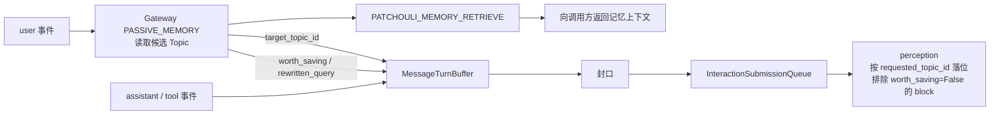
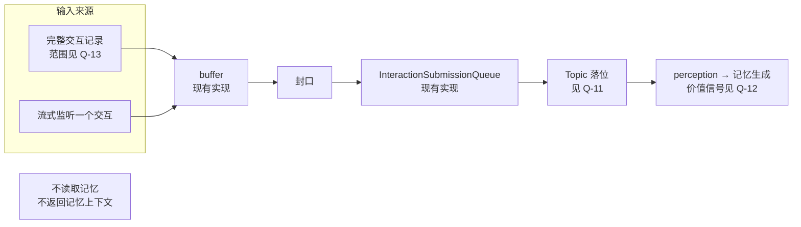
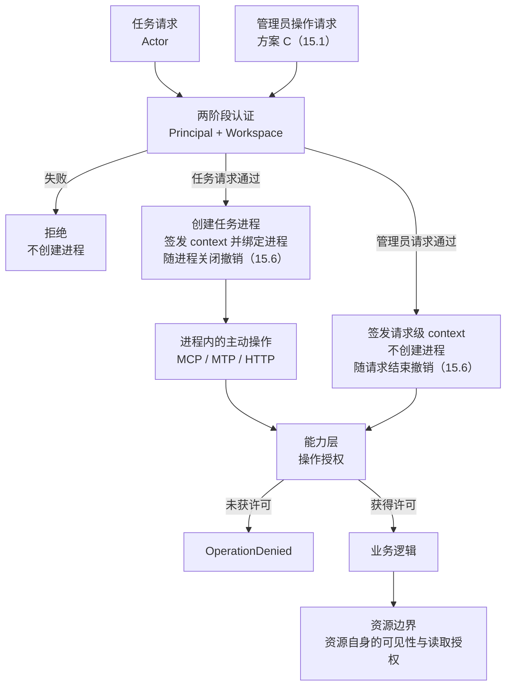
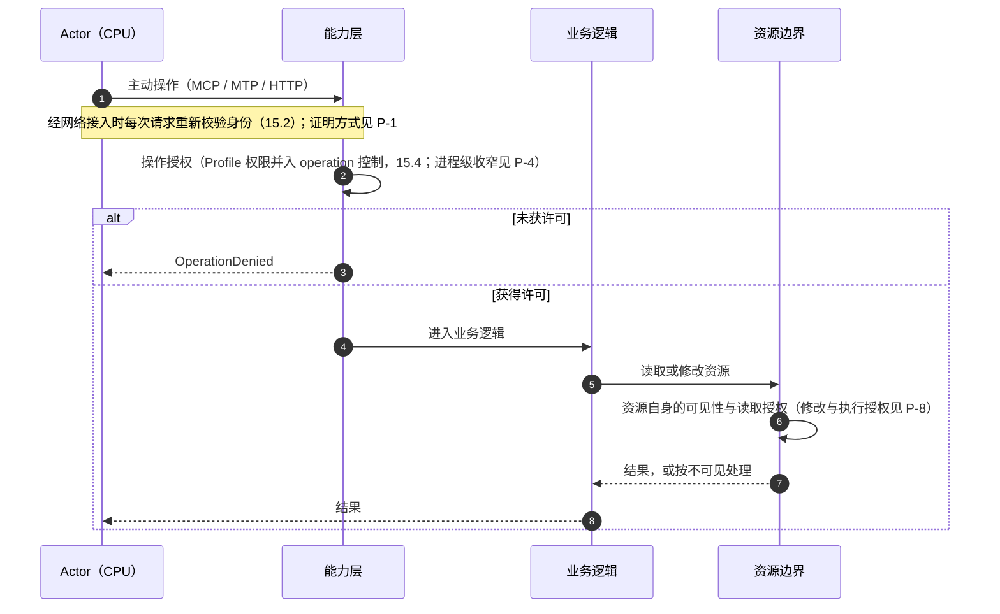

# Workspace 网络与任务进程架构

**文档状态**：Idea，未形成实施承诺
**覆盖范围**：第一部分——网络拓扑、迁移与 Import Bus（任务进程与注册入口已拆出为独立 Idea）；第二部分——system 包的边界；第三部分——认证与授权流程
**记录日期**：2026-09-26；2026-10-04 按“已完成 / 未完成”重新整理

## 0. 文档性质

本文记录 2026-09-26 起关于 v0.7.0 方向重估的讨论结果，用于在进入 Plan 之前整理新架构的运行流程、包边界、权限流程与问题。

| 部分 | 前提（owner 提出） | 现状事实 | 图 | 已完成的问题 | 未完成的问题 |
|:---|:---|:---|:---|:---|:---|
| 第一部分：网络拓扑、迁移与 Import Bus | 第 2 节 | 第 3 节 | 第 4 节 | 第 5 节 | 第 6 节 |
| 第二部分：system 包的边界 | 第 8 节 | 已删除（实施前状态） | —— | 第 9 节 | 第 10 节 |
| 第三部分：认证与授权流程 | 第 12 节 | 第 13 节 | 第 14 节 | 第 15 节 | 第 16 节 |

- **前提**是 owner 在讨论中提出的出发点，不表示已经实现或已经排期；
- **现状事实**对照代码核对，各节注明核对日期；
- **流程图**只画出前提或已完成的问题已经确定的部分，以及现状；依赖未完成问题的内容标注问题编号；
- **已完成的问题**是 owner 已作出决定的问题，按“问题—实际设计或实现”叙述，每个问题开头注明决定日期与实施状态；“已完成”指设计已定，实施状态单独写明（已实施、部分实施或归属某个尚未开始的方向）；
- **未完成的问题**只列出选项及其影响，本文不替 owner 作出选择，选项顺序不代表倾向；
- 任务进程表与唯一注册入口的前提、现状、流程图与问题 Q-1–Q-10、Q-14 已于 2026-09-27 拆出至[任务进程表与任务请求唯一注册入口](./task-process-table-and-registration-entry.md)，问题编号不变；本文其余部分提到这些编号时均指该文档；
- **术语**（owner，2026-09-27）：“被动（Passive）”一词保留给被动请求体系，即由条件触发创建任务进程的请求（[任务进程 Idea](./task-process-table-and-registration-entry.md)第 1.1 节）。原先称为“被动输入”的输入链路在本文称 **Import Bus**，最终名称未定，功能可能逐步倾向对话导入；代码标识符与事实文档中的现有名称（Passive Ingress、`PassiveIngressService`、Gateway `PASSIVE_MEMORY`）描述现状，保持不变。

本文不修改任何当前事实文档。现有 v0.7.0 计划与本文的概念对应见第 7 节。

**2026-10-04 的整理**：问题编号（M、D、P、Q、E 系列）不变。原先按日期记录的决定（原 6.1、原 15.1–15.7）改为按问题叙述；部分决定、部分未决的问题（P-1、P-4、P-7、P-9、P-10）拆成两半，已决定的部分进入“已完成的问题”，剩余部分留在“未完成的问题”；第三部分的现状事实按 A1 返工之后的代码重新核对。整理前的最后版本见 commit `2daa332`。已归档的计划仍引用原小节号，对照如下：

| 原小节 | 现在的位置 |
|:---|:---|
| 5（Import Bus 待决问题） | 6.2 |
| 6（迁移问题表）、6.1（已决定事项） | 第 5 节；M-4 见 6.1 |
| 10 中的 D-9 | 第 9 节 |
| 13.1–13.7 | 第 13 节（重新核对） |
| 15.1、15.2 | 15.1 |
| 15.3 | 15.1（管理员直接通道的定位）、15.2（P-1a） |
| 15.4 | 15.4（P-2、P-10）、15.6（P-6）、15.9（P-4b）、15.10（P-7 取消） |
| 15.5 | 15.3（System 层面的 API）、15.5（Alice 的能力层调用迁移）、15.8（放行分支）、15.1（HTTP 入口的接入）、15.6（访问登记、不建进程的访问）、15.10（memory-tasks 路由、取消不新增 operation）、15.4（Profile 权限的归属） |
| 15.6 | 15.6（去掉固定有效期、两个登记文件）、15.8（阶段检查、两个提交路由） |
| 15.7 | 15.7 |
| 16 中已决定的子问题 | P-1a → 15.2；P-2、P-10 → 15.4；P-4b → 15.9；P-6 → 15.6；P-7（取消）→ 15.10；P-9b → 15.6；P-9c（部分）→ 15.7、15.10；P-9e → 15.1；P-9g → 15.7 |

## 1. 背景

v0.7.0 计划 A 按组件与机制横向拆分（访问 → 缓存 → Session → Pending → API 收敛 → Actor 适配），每个子计划只改动各条运行流程的一小段，中间态依靠委托、re-export 与兼容入口维持。A2 实施过程中暴露出的现象（2026-09-26 工作区核对）：

- 读取记忆存在多条互不相通的路径：新的 workspace 读取能力（resolver 与缓存）已装配，但尚无生产调用方，只在测试中使用；HTTP 管理面经管理路由直读记忆库；Chat 在 Patchouli prepare 内部读取；Alice MTP 经自身 `RuntimeAliasResolver` 与缓存；Alice CALL 的 Profile 经自身解析器与缓存；Passive 直接调用检索路由。进程内同时存在两套原子缓存、两套 Profile 缓存与两套解析器；
- A1 的统一认证网关已装配，但没有生产入口调用；生产路径均走不带访问上下文的兼容分支，逐次行为授权在生产中实际未执行；
- `PatchouliService.prepare_agent_run` / `finalize_agent_run` 实际承担 Alice 会话的编排（Profile、Topic、检索与编译、附件租借与编译、组装 `AgentRunContext` 与 `StreamPrelude`、交互提交与物化派发），而计划把这部分职责退出排在 A5/A6；
- 包依赖与声明方向不一致：子系统、engines 与 infrastructure 对 `hivememory.system.*` 的导入约 130 处，`workspace` 与 `system` 相互导入，Patchouli 导入 `workspace.access` 23 处（已由第二部分处理，见第 9 节）。

讨论由此转向：先从全系统运行流程重新定义架构，再决定组件归属。讨论中曾提出以“Actor Session”作为 Workspace 运行时的核心单位，该提法已由本文的任务进程模型取代。

## 2. 前提（owner 提出）

### 2.1 类比映射

| AE2 | HiveMemory |
|:---|:---|
| ME 网络 | Workspace |
| 存储系统 | Patchouli |
| 合成 CPU | 任意 Actor（Alice、外部 harness 等） |
| 合成任务 / 合成进程 | 一次任务请求对应的任务进程 |
| 玩家在合成终端下单 | 主动请求：用户的指令即时驱动任务进程 |
| 合成卡、请求器等自动下单方 | 被动请求：条件满足时创建任务进程（定时任务、队列任务等） |
| 玩家在 ME 终端直接存取 | 管理员直接通道：不是请求，直接执行 operation，不建进程（15.1） |
| Import Bus（只向网络输入） | Import Bus（现有 Passive Ingress 链路），已排除在现有系统之外（5.8） |

请求方只有主动请求与被动请求两类；区分标准与不属于请求方的对象见[任务进程 Idea](./task-process-table-and-registration-entry.md)第 1.1 节。

### 2.2 主动任务：任务进程

本节前提已移至[任务进程 Idea](./task-process-table-and-registration-entry.md)第 1 节：任意任务请求从唯一入口注册为一个进程，直到任务结束才关闭。

### 2.3 Import Bus（原“被动输入”）

1. 现有 Passive Ingress 虽标为 passive，却在用户输入后主动提供记忆，本质上是主动读取的一种触发方式，边界不清。
2. 新架构下 Actor 可以任意替换，Import Bus 退化为：接收信息并转为记忆资产，**与记忆系统零主动交互**。
3. 两种接收方式：
   - 直接接收一份完整的交互记录；
   - 流式监听一个交互。
4. 两种方式最终通过同一个 buffer 与提交路径（现有实现）进入记忆生成。具体实现细节暂不讨论。
5. （2026-09-27）Import Bus 不在核心全局拓扑上：它从全局拓扑中断开，逐步演进为独立功能，不在 v0.7.0 计划内；2026-09-28 进一步明确：现在不考虑 Import Bus 带来的任何效果，将其排除在现有系统之外（5.8）。
6. （2026-09-27）owner 指出，外部 Actor 的 plugin 模式很像一直以来的 Passive Ingress 模式；两种接入模式见[外部 Actor Idea](./external-actor-registration-and-runtime-access.md#11-两种接入模式owner2026-09-27) 1.1。

## 3. 现状事实（代码核对）

3.1（Chat run 注册表）、3.2（写入意图的现有寿命）与 3.5（记忆库内部工作）已移至[任务进程 Idea](./task-process-table-and-registration-entry.md)第 2 节。

### 3.3 Passive Ingress 的现有行为

在 [`PassiveMessageIngressor`](../../src/hivememory/system/services/passive/ingressor.py) 中，user 事件先把上一轮交接到队列，再调用 memory context provider：经 Gateway `PASSIVE_MEMORY` 模式分析，再调用 `PATCHOULI_MEMORY_RETRIEVE` 检索，并把检索结果返回给调用方。

Passive 对 Gateway 的依赖不止于检索：

- **Topic 落位**：[`MessageTurnBuffer`](../../src/hivememory/system/services/passive/turn_buffer.py) 保存 Gateway 决策，提交时以 `gateway_decision.target_topic_id` 作为 `requested_topic_id`。Gateway 做话题路由时会读取 Patchouli 的候选话题；
- **价值信号**：`rewritten_query` 与 `worth_saving` 取自 Gateway 决策写入 `InteractionPayload`；perception 冻结生成材料时排除 `worth_saving=False` 的 block（[`engines/perception/models.py`](../../src/hivememory/engines/perception/models.py)）。

### 3.4 统一的交互提交队列

自 v0.6.1 起，Active finalize 与 Passive Ingress 共用 [`InteractionSubmissionQueue`](../../src/hivememory/patchouli/control/interaction_submission.py)。Active 一侧以同步的 applied gate 作为继续物化等后续副作用的边界。

## 4. 流程图

### 4.1 全局拓扑

按请求方的分类绘制（5.7）：请求方只分主动请求与被动请求，执行者（CPU）单独成栏；Import Bus 不在核心全局拓扑上，已从本图断开（5.8）。虚线表示依赖未完成问题或不在 v0.7.0 范围的连接。图中 Q-3、Q-6、Q-7、Q-14 位于[任务进程 Idea](./task-process-table-and-registration-entry.md)。

- 外部 harness 有两种接入模式（[外部 Actor Idea](./external-actor-registration-and-runtime-access.md#11-两种接入模式owner2026-09-27) 1.1）。controller 模式下，用户在 HiveMemory 的入口选择外部 harness 作为 actor，请求经注册入口登记为任务进程，外部 harness 是进程中的 CPU；plugin 模式下，对话由外部 harness 管理，不经注册入口，harness 以不建进程的方式经能力层访问，形状与管理员直接通道相同。
- Import Bus（现有 Passive Ingress 链路）在现有代码中仍经交互提交队列进入记忆生成（3.3、3.4、4.5）；它不属于核心全局拓扑，已排除在现有系统之外（5.8）。任务进程的交互记录由进程自行提交（任务进程 Idea Q-14）；写入意图在 workspace 登记后提交给记忆库，与进程解耦（写入意图迁移 Idea 0.1）。

4.2–4.4（任务进程的生命周期、通用流程与 chat 任务类型）已移至[任务进程 Idea](./task-process-table-and-registration-entry.md)第 3 节。

### 4.5 Import Bus 流程

Import Bus 不在核心全局拓扑上，不在 v0.7.0 范围（5.8）。

## 5. 第一部分已完成的问题

### 5.1 M-1 迁移的切分方式

**状态**：已完成。2026-09-27 决定；v0.7.0 的各方向按此实施。

**问题**：v0.7.0 计划 A 按组件与机制横向切分，每个子计划只改动各条运行流程的一小段，中间态依靠委托、re-export 与兼容入口维持（第 1 节）。迁移应当继续横切，还是改为其他切分方式？

**设计**：按流程纵切，把链路按预想的功能逐步迁移与改造。理由（owner）：A 系列按组件横切的方式已经证明不可靠，容易严重脱离实际情况而作理想设计；直接按功能逐条迁移链路，更容易得到实际成果。

### 5.2 M-2 包边界调整相对流程迁移的先后

**状态**：已完成。2026-09-26 决定；已实施（第二部分）。

**问题**：第二部分的包边界调整（D-1–D-9）与流程迁移哪个先做？

**设计**：包边界调整先于流程迁移完成，即第二部分的实施（第 9 节）。

### 5.3 M-3 第一条迁移的流程

**状态**：已完成。2026-09-27 决定；已实施（任务进程表方向的五个批次，见[任务进程 Idea](./task-process-table-and-registration-entry.md)第 0 节）。

**问题**：按流程纵切之后，第一条迁移到新架构的流程是哪一条？

**设计**：Alice 的 chat 链路。理由（owner）：外部 Actor 的适配已顺延（5.4）；Patchouli 与 Alice 的深层耦合本身由 chat 链路带来（第 1 节背景第 3 条），只要初步解决这个问题，v0.7.0 的 workspace 架构就更容易建立。

### 5.4 M-5 v0.7.0 的范围与版本目标

**状态**：已完成。范围于 2026-09-27 决定，版本目标于 2026-09-28 决定；版本目标第 1、2、4 条已达成，第 3 条剩 Patchouli cleanup 路由（随 Topic 按需创建移除）。

**问题**：v0.7.0 要做到什么程度？如何区分真正的解耦与“只是把 chat 链路从 system 层搬了个地方”？

**设计**：保持规划中的方向，至少完全完成项目向新架构的演进，使 workspace 体系在项目架构中稳定存在。

| 事项 | 决定 |
|:---|:---|
| 验收口径 | 验证 Alice 能在新架构下跑通，证明各流程协作无误，使之后的 adapter 不需要再大改系统拓扑结构；v0.7.0 不对外部 Actor 所需的基建作承诺 |
| 外部 Actor 的真实接入 | 真正的 adapter 接口与外部服务身份等（原计划 B 的内容）不在 v0.7.0：controller 模式在 v0.7.1，plugin 模式在其后的 v0.7.x，见[外部 Actor Idea](./external-actor-registration-and-runtime-access.md#11-两种接入模式owner2026-09-27) |
| 任务进程表与唯一注册入口 | v0.7.0 的首个方向，见[任务进程 Idea](./task-process-table-and-registration-entry.md)；v0.7.0 内的批次已全部实施 |
| 外部会话消息的接收与 Topic 投影 | 在 v0.7.0 内完成，Alice 作为第一个使用者，见[外部会话与 Topic 投影](./external-session-and-topic-projection.md) |
| A1 返工 | 在任务进程表计划完成、已有稳定入口之后接入；已于 2026-10-04 实施归档（[A1 访问边界返工](../archive/plans/v0.7.0-a1-access-boundary-rework.md)） |
| 写入意图（PendingAtom）体系的迁移 | 2026-09-28 决定纳入 v0.7.0，分两步实施，见[写入意图迁移 Idea](./pending-intent-migration.md#01-owner-的决定2026-09-28) 0.1 |
| Import Bus | 不在 v0.7.0，见 5.8 |

**版本目标**（2026-09-28）：

1. Patchouli 的公开路由既不产出、也不接收 Alice 专属的类型，包括 `AgentRunContext`、`StreamPrelude`、`AgentRunResult` 与编译好的记忆文本；
2. 一个非 Alice 的 CPU（测试中的替身即可）能跑完整个任务进程，不需要改动进程与入口的代码；
3. 取消与清理都经过进程容器：进程关闭时释放已登记的资源，取代 Patchouli 的清理路由与 chat 编排中的补偿；每个阶段的取消都能通过容器接口测试；
4. 命令、主动请求与被动请求经同一入口注册（被动请求的实现范围见任务进程 Idea Q-6）。

这四条用来区分真正的解耦与“只是把 chat 链路从 system 层搬了个地方”：四个阶段的顺序是任务的自然顺序，不需要改变；应当改变的是阶段之间的状态由谁持有、每个交界处传递什么，以及执行阶段能否由任意 CPU 承担。各条的达成情况见[任务进程 Idea](./task-process-table-and-registration-entry.md#12-任务进程的结构owner2026-09-28) 1.2。

### 5.5 M-6 现有 v0.7.0 计划文档的处置

**状态**：已完成。2026-09-27 决定；已执行。

**问题**：v0.7.0 原有的协调入口、边界宪章、WRX-0 清单、A2–A6 与计划 B 都按组件横切写成，在新架构下如何处置？

**设计**：

| 文档 | 处置 |
|:---|:---|
| A2（未完成部分）、A5、A6、WRX-0 清单 | 作废，直接删除；删除前最后版本见 commit `dda9d9d` |
| A3、A4 | 方向保留，不再按编号看待：A3 对应“Topic 体系不能接收外部 Actor 的会话消息”，A4 对应“PendingAtom 体系的迁移”。两者删除计划安排内容后，设计完整退回 Idea：[外部会话消息的接收与 Topic 投影](./external-session-and-topic-projection.md)、[写入意图（PendingAtom）体系的迁移](./pending-intent-migration.md) |
| 任务进程表与任务请求唯一注册入口 | 当时唯一的有效计划方向；设计讨论集中在独立的[任务进程 Idea](./task-process-table-and-registration-entry.md) |
| 协调入口 | 删除；版本内计划导航由 [Plans 索引](../plans/README.md)承担，不含设计决策；ROADMAP 的 v0.7.0 部分缩为摘要 |
| 边界宪章 | 拆分后删除：原则层（归属判据、记忆库一侧的独立工作契约、证伪条件）成为 [ADR-0006](../architecture/decisions/0006-memory-library-custody-criteria-and-independence-contract.md)；裁定层退回 Idea（本文 7.1、写入意图体系迁移第 4.2 节、外部会话与 Topic 投影第 2.1 节）；过程记录不再保留 |
| 计划 B | 作为计划作废：Passive 的设计已经更新，内容也大多过时。它的核心问题——外部 Actor 的信息如何注册进系统、运行时如何访问系统（adapter 接口设计）——退回 Idea：[外部 Actor 的接入登记与运行时访问](./external-actor-registration-and-runtime-access.md) |

同时决定：

- **workspace 包的现有实现**（A2 已实施部分：`workspace/cache/`、`workspace/resolution/`、`workspace/runtime.py` 与能力层的读取方法）不承诺其实现正确，也不作为任务进程表计划的前提，在该计划制定时重新调查；2026-09-28 的调查结论与 workspace 的子包划分见第 9 节 D-9；
- **A1 返工**（operation 检查迁移、迁移期兼容分支退出、生产入口接入认证网关）不阻塞任务进程表计划，排期见 5.4；
- **ADR-0004 与 ADR-0005** 标记为失效（`deprecated`），没有替代 ADR。

### 5.6 M-7 当前分支未提交的 A2-1 改动

**状态**：已完成。2026-09-26 决定；已执行。

**问题**：讨论开始时分支上有未提交的 A2-1 改动（2026-09-26 unit + integration：2518 passed，2 skipped），方向重估后如何处理？

**设计**：作为检查点提交，随 PR #103 合并。

### 5.7 请求方的分类与全局拓扑

**状态**：已完成。2026-09-27 决定；注册入口目前只接收主动请求，被动请求这一阶段不考虑（任务进程 Idea Q-6）。

**问题**：最初的全局拓扑把 Passive Ingress 当作与主动链路并列的“被动输入”，请求方、执行者与输入链路混在一起；全局拓扑与第二部分 D-8（passive 留在 system）的一致性也待决。

**设计**：

- 请求方只有主动请求与被动请求两类，“被动（Passive）”一词保留给被动请求体系；定义、区分标准以及不属于请求方的对象（CALL 子执行单元、管理员直接通道、Patchouli 记忆任务）见[任务进程 Idea](./task-process-table-and-registration-entry.md)第 1.1 节；
- 执行者（CPU）与请求方是两个维度，4.1 按此重画；
- 全局拓扑与 D-8 的一致性随 Import Bus 从核心全局拓扑断开而消解（5.8）。

### 5.8 Import Bus 移出现有系统

**状态**：已完成。2026-09-27、2026-09-28 决定。代码中的 Passive Ingress 链路保持现状（3.3），它在代码层面如何处理随 Import Bus 的独立演进决定（6.2）。

**问题**：Import Bus（现有 Passive Ingress 链路）在新架构中处于什么位置？它是否在 v0.7.0 范围内？

**设计**：

- （2026-09-27）Import Bus 不在核心全局拓扑上，现在从全局拓扑中断开；逐步演进为独立功能，不在 v0.7.0 计划内。Import Bus 的问题（Q-11–Q-13，6.2）与 passive 的接入认证（D-8a，第 10 节）随之移出 v0.7.0；
- （2026-09-28）现在不考虑 Import Bus 带来的任何效果，将其排除在现有系统之外；任务进程 Idea Q-14 中经 Import Bus 提交交互记录的方案因此不成立。

### 5.9 同期作出、记录在其他文档的决定

以下决定与第一部分同期作出，完整记录在对应文档：

| 决定 | 日期 | 记录位置 |
|:---|:---|:---|
| 会话模型与 Topic 池：前台对话回归常规 Agent 软件的 session 概念，保留新建、恢复、压缩三个会话操作，压缩由 CPU 负责；Topic 不绑定 Session，workspace 共享一个 Topic 池；Gateway 的话题路由只服务于后台的 Topic 路由。前端改造与新建、恢复在 v0.7.0，Alice 的压缩约在 v0.7.1 | 2026-09-28 | [外部会话与 Topic 投影 Idea](./external-session-and-topic-projection.md#01-会话模型与-topic-池owner2026-09-28) 0.1 |
| 写入意图：登记位于 workspace，与任务进程和记忆生成两侧都解耦，经能力层实时提交；取消与失败不再丢弃已提交的写入意图；PendingAtom 在落库前对全 workspace 可回读；放在外部会话改造之前或之后都可以 | 2026-09-28 | [写入意图迁移 Idea](./pending-intent-migration.md#01-owner-的决定2026-09-28) 0.1；任务进程 Idea Q-1、Q-2 |
| 任务进程的结构：进程创建时机、四阶段通用骨架、进程记录与工作集、prepare 的拆分、附件与 Topic 的去向 | 2026-09-28 | [任务进程 Idea](./task-process-table-and-registration-entry.md#12-任务进程的结构owner2026-09-28) 1.2 |
| P-1a：注册前经认证网关验证身份，此后每次请求都重新校验 | 2026-09-27 | 15.2 |
| E-1：接入登记维持启动时从配置装载；运行时登记与其他配置文件的热更新由未来单独的计划实现 | 2026-09-27 | [外部 Actor Idea](./external-actor-registration-and-runtime-access.md#e-1-接入登记的来源与生效时点) |
| 外部 Actor 的形态：分为 plugin 与 controller 两种接入模式，先做 controller 模式（v0.7.1 的首个真实外部 harness 接入），plugin 模式在其后的 v0.7.x；Q-8、E-4、P-5b 以及请求方类型与认证 principal 的关系按两种模式归属 | 2026-09-27 | [外部 Actor Idea](./external-actor-registration-and-runtime-access.md#11-两种接入模式owner2026-09-27) 1.1 |

## 6. 第一部分未完成的问题

每个问题只列出选项及其影响，不作选择；选项顺序不代表倾向。

### 6.1 M-4 迁移期间的兼容范围

**背景**：已实施的各批次按各自计划处理兼容，例如 `generation_id` 一次性改为 `process_id`，不保留兼容投影（任务进程 Idea Q-16）；尚未形成统一规则。

选项：只保证数据兼容 / 保留代码层兼容窗口 / 按接口逐项决定。

### 6.2 Import Bus 的问题（不在 v0.7.0）

Import Bus 已排除在现有系统之外（5.8），本节问题随其独立演进处理。

#### Q-11 Import Bus 交互的 Topic 落位

**背景**：现状由 Gateway 决策给出目标 Topic，Gateway 路由时读取候选话题（3.3）。

| 选项 | 内容 | 影响 |
|:---|:---|:---|
| A | 记忆库在接收时自行落位 | 需要在记忆库侧提供落位能力；`PASSIVE_MEMORY` 模式可以移除 |
| B | Import Bus 交互仍经 Gateway 路由 | 输入链仍会读取候选话题，与“零主动交互”的前提需要重新界定 |
| C | 由输入方显式指定或提示，记忆库校验 | 外部来源需要掌握 Topic 信息 |

#### Q-12 Import Bus 交互的价值信号（worth_saving）

**背景**：现状由 Gateway 给出，perception 据此排除 block（3.3）。ROADMAP 的“记忆价值策略重设计”要求入口信号不能替代 Patchouli 的最终决定。

| 选项 | 内容 | 影响 |
|:---|:---|:---|
| A | Import Bus 交互不提供该信号，按现有语义视为保留 | 进入生成的材料可能增加 |
| B | 记忆库在接收或感知阶段自行评估 | 需要记忆库侧的评估能力及其成本 |
| C | 输入方可选提供提示，记忆库决定是否采纳 | 需要定义提示的来源与可信度 |

#### Q-13 “完整交互记录”接收方式的范围

**背景**：ROADMAP v0.7.2 的历史对话导入有独立语义：历史发生时间、批次、去重，不重放进当前活跃话题。

| 选项 | 内容 | 影响 |
|:---|:---|:---|
| A | 只接收实时或刚结束的交互；历史导入另设通道 | 两条通道语义分开 |
| B | 同时作为历史导入入口 | 需要在该接收方式中承载历史时间、批次、去重与不重放等语义 |

### 6.3 第 7.1 节候选裁定的开放细则

第 7.1 节的候选裁定整体仍是候选设计；其中以下细则尚未讨论出选项：

- D2 纪律的验收标准；D3 中 lifecycle 类展示性信号走 advisory 事件 best-effort 刷新，还是完全不投递；
- 负缓存是否启用，以及容量、TTL、close 时在途请求的行为；
- 两个事件族的事件名、载荷与发布/订阅纪律如何登记入公共事件契约。

canonical 变更事件与 workspace 读取缓存的失效直接相关，是 Alice 的能力层调用迁移的前置条件（15.5）。

## 7. 与既有文档的对应关系

下表只列出概念上的对应。

| 本文元素 | 既有文档中的相关内容 |
|:---|:---|
| 唯一注册入口、进程生命周期 | [任务进程 Idea](./task-process-table-and-registration-entry.md)；[System 应用服务](../system/application-services.md)第 3、4 节；[Chat Run 生命周期后续候选](./chat-run-lifecycle-follow-ups.md) |
| 进程中的写入意图 | [写入意图体系迁移](./pending-intent-migration.md)（原 A4，含原宪章 §6.2 的归属论证） |
| 网络共享读视图 | A2 读取能力面与派生缓存（已删除，最后版本见 commit `dda9d9d`）；workspace 包的现有读取实现保留为 Alice 读取实现的迁移目标，见第 9 节 D-9 |
| 对话连续性（Q-9） | [外部会话与 Topic 投影](./external-session-and-topic-projection.md)（原 A3） |
| Import Bus | [Passive Ingress 当前设计](../system/passive-ingress.md) |
| 外部 Actor 的接入与运行时访问 | [外部 Actor 的接入登记与运行时访问](./external-actor-registration-and-runtime-access.md)（原计划 B） |
| 访问准入与操作授权 | [Workspace 架构](../architecture/workspace.md)第 4 节；[身份与访问体系 Idea](./identity-and-access-model.md) |
| CPU / 进程 / 子网类比 | [AE2 与 HiveMemory 的架构同构性](./ae2-hivememory-architecture-analogy.md) |
| 独立工作契约、事件协作纪律、断开测试 | [ADR-0006](../architecture/decisions/0006-memory-library-custody-criteria-and-independence-contract.md)（记忆库一侧）；本文 7.1（库外一侧与事件协作） |

### 7.1 移入的候选裁定：库外状态与网络共享设施（原边界宪章）

本节来自 v0.7.0 边界宪章的裁定层，于 2026-09-27 宪章拆分时移入。宪章的归属判据与记忆库一侧的独立工作契约已成为 [ADR-0006](../architecture/decisions/0006-memory-library-custody-criteria-and-independence-contract.md)；修订日志、回溯验证、可逆性押注与联动修订清单等过程记录不再保留，宪章删除前的最后版本见 commit `dda9d9d`。写入意图归属的论证移入[写入意图体系迁移](./pending-intent-migration.md)，Session 与 Topic 的切分移入[外部会话与 Topic 投影](./external-session-and-topic-projection.md)。

这些裁定写于任务进程模型提出之前，把库外状态统一判给“workspace runtime”。2026-09-28 按[任务进程 Idea](./task-process-table-and-registration-entry.md)的 Q-2、Q-3a 与第 9 节 D-9 决定：原判给“workspace runtime”的各项位于 workspace 的共享设施，不进入任务进程。7.1.2–7.1.8 的其余内容（独立工作义务、事件协作、读取边界、缓存、能力面入口、断开测试）仍是候选设计，保留原裁定的表述。

#### 7.1.1 候选归属表

记忆库一侧的各行与 ADR-0006 一致；其余各行是原宪章的裁定。2026-09-28 按第 9 节 D-9 决定：ConversationSession、Atom cache / Profile 解析缓存、alias resolver 各行均位于 workspace 的共享设施。其中 pending registry 一行已于 2026-09-28 决定：登记位于 workspace，生命周期与任务进程解耦，经物化过线、结算以全局事件回流（[写入意图迁移 Idea](./pending-intent-migration.md#01-owner-的决定2026-09-28) 0.1）。

| 状态/能力 | 原裁定的持有者 | 过线动作 | 依据 |
|:---|:---|:---|:---|
| canonical MemoryAtom、meta.version、完整版本历史 | Patchouli | —（库内） | 已接收资产 |
| 四类 Artifact（interaction/document/creation/version） | Patchouli | — | 已接收证据 |
| Topic/短期库（已提交素材） | Patchouli | 封口 + 提交（过线入） | 已接收素材；短期库的管辖权语义见外部会话 Idea |
| generation/lifecycle/检索/去重/合并算法 | Patchouli | — | 流水线本体 |
| Profile 解析能力（builtin 规则、from_atom） | Patchouli | Profile 解析调用 | 库既有能力，不增不减 |
| ConversationSession + 封口交互记录 | workspace runtime | 提交（过线出） | Actor 真实工作记录（未过线部分） |
| pending registry（intent 身份/alias/内容/状态/settlement 关联） | workspace runtime | 物化 + settlement 回流 | 未接收的要约，论证见写入意图 Idea |
| Atom cache / Profile 解析缓存 | workspace runtime | 失效事件（入向，D1–D3） | Actor 读加速，可丢弃的派生 |
| alias resolver / workspace memory read 能力 | workspace runtime | L2 冷读调用 | 编排层不住在被编排者体内 |
| Profile 读取 resolver（解析结果缓存、交付授权） | workspace runtime | `GET_AGENT_PROFILE`（出向；backing 附带 policy 依据，不触 AtomCache） | AgentProfile 自持 agent_id；可见性不进模型，policy 依据随缓存项 |
| 逐次行为授权（operation 检查） | workspace 能力边界 | — | 绑定交付边界，随能力走而不随存储走 |
| WorkspaceAssetStore / lease facade | workspace runtime | — | 既有事实 |
| run/frame/MTP/prompt 组装/执行配置 | Actor（Alice 等） | — | 执行状态，不是资源状态 |
| 会话/意图/缓存的持久化 | 无（进程内） | — | 维持现状，跨重启另行规划 |
| bus/queue/scheduler/registry/EventBus | 共享基础设施 | — | 不拥有领域状态 |

#### 7.1.2 库外一侧的独立工作义务

库不可达时必须全部成立：

1. 认证交接后的能力面照常接纳 Actor；
2. Session 生命周期照常（open/paused/closed、有序交互引用、封口内容保留窗口）；
3. 写入意图登记照常并返回登记收据；物化提交显式失败且保留可重试收据（登记与物化提交是两个业务阶段；物化提交没有独立队列，排队只发生在库侧 generation task 队列，属于库接收之后的库内事实）；
4. L0（registry 本地查表）与 L1（cache）解析及交付边界授权照常执行；
5. WorkspaceAsset facade 照常；
6. 降级显式：L2 冷读返回明确错误，不以过期条目伪装新鲜成功；settlement 暂停期间写入意图保持 in-flight/等待语义；缓存内容只反映最近一次成功同步之前的状态，且不宣称更新。

原裁定的持有清单：ConversationSession 与封口交互记录、pending registry、Atom cache 与 Profile 解析缓存、alias resolver 与 profile 读取 resolver（二者构成 memory read 能力边界）、逐次行为授权执行点、WorkspaceAssetStore 与 lease facade。

禁止：解释记忆领域语义（内容合并、类型行为、版本推进、检索排序、去重决策）；在库不参与的情况下制造或伪装 canonical 事实；缓存任何 Actor 的授权结论；把库的 backing 路由包装为 Actor 面向入口来绕过能力边界。

#### 7.1.3 过线契约与事件协作

**库外 → Patchouli**（全部是既有路由语义，不新增领域逻辑）：封口交互提交；materialize task 提交；canonical 点读/alias 批读；语义检索；Profile 定义解析。

**Patchouli → 库外**：事件协作，承载于全局系统总线的 `publish`，分两个事件族。两者均尚未实现，也未登记入公共事件契约。

1. **settlement 事件**（复用既有 `pending_atom_settler`/bridge 投递链）：intent 终态回写的加速通道。事件是加速，不是真相：通知事件只作观测，不能作为唯一的终态真相，结算须可从权威任务/领域结果核对；registry 必须保留以 intent_id 锚定的权威对账路径，在状态可疑或滞后时按 intent 查询 generation 的权威结果。
2. **canonical 变更事件**：`MidTermMemoryStore` 各变更方法（upsert/patch/delete）的提交调用完成时（`finally`，无论提交成败：evict-only 语义下失败提交的空失效无害，且能覆盖主库成功而 secondary 失败的半成功场景）发布领域事实（`workspace + memory_id + operation + patch 路径`）。发布由注入 store 的 `MemoryChangePublisher`（`patchouli/control`，持总线，随 runtime 装配，与 PendingAtomSettler 同模式）内联承载；订阅者据此决定失效哪些条目与索引并推进 epoch，失效范围（含被释放的旧 alias）由订阅者按自身的正反索引推导。库只声明事实，不计算缓存影响；store 不依赖总线，只依赖注入的发布协议。

两个事件族都是 `GlobalSystemBus` 上的公共事件族，不是 RuntimeEvent，AGENTS.md 对 RuntimeEvent 的观测性条款不适用。

发布与订阅以三条纪律（D1–D3）保证正确性。依据：`AsyncSystemBus.publish` 内联、顺序 await 全部订阅者后才返回，订阅者异常被吞并只记日志；因此内联发布在时序上等价于同步失效调用，但失败语义必须由纪律补齐。

- **D1 内联发布**：canonical 变更与 settlement 事件必须 `await publish`，禁止 `create_task` 或其他延后投递；一旦 fire-and-forget，“提交后、送达前”的过期命中窗口立即回归。
- **D2 失效优先的订阅者**：canonical 变更订阅者的第一步无条件执行受影响条目的 evict 与 epoch 推进（纯内存、不可失败），之后才做任何可能失败的细节工作；handler 内的任何异常都发生在条目已失效之后，失败不可能留下过期命中。
- **D3 只失效、不携值**：订阅者不回放事件携带的值。mutation 没有全序（lifecycle patch 不推进 `meta.version`），乱序回放会用旧副本覆盖新状态；回填一律交给带 epoch 守护的冷读。

方向约束：库对缓存的唯一接触是出向事件；库外对 canonical 数据的唯一获取是冷读路由，双向都不得出现旁路。写入路径会等待订阅者执行完（内联 publish 的时序耦合），但写入的成功不依赖订阅者结果：以等待换正确性，是这一契约的明确取舍。

#### 7.1.4 读取能力的双向边界

该边界要保护的对象是“不出现第二个记忆库”。

| resolver 可以 | resolver 禁止 |
|:---|:---|
| 引用归一化；L0/L1/L2 定位；写入意图中立结果的引用级跟随（含 settlement 指向的 canonical ref） | 检索排序、dense/sparse 算法、去重决策 |
| 按原子自身的 policy 做逐次授权判定（纯谓词，与库共享同一份 core 实现；policy 字段的当前性由失效事件协作与 D1–D3 保证） | 任何内容语义解释、编译、记忆类型行为 |
| epoch 守护的回填、single-flight 合并、负缓存规则执行 | 任何写路径；缓存授权结论 |
| 完整原子 copy-on-read 交付 | 持有 canonical 状态，或绕过失效事件自造当前性 |

配套约束：授权谓词已上收 [`core/memory_access.py`](../../src/hivememory/core/memory_access.py)（`engines/retrieval/policy.py` 保留兼容转发），resolver 不得导入 Patchouli 的 engines 包；`patchouli.public.memory.*` 是 backing 契约，直连仍安全（库侧校验独立成立），但没有缓存，也不是 Actor 面向入口；管理读取直连库的管理路由，不经 resolver。

#### 7.1.5 缓存

原裁定：缓存归 workspace runtime；唯一读者是 resolver；库的唯一接触是出向失效事件。依据：迁移前由 Alice 持有；为 Actor 读加速而存在，是可丢弃的派生；库的读路径因此回到 storage-shaped，不成为依赖缓存的读取器。缓存的行为契约（资源 key、完整原子 copy-on-read、不缓存授权结论、epoch、负缓存规则、close、容量与观测）以 resolver 为唯一消费者；语义检索仍执行检索并可协作预热，缓存不替代搜索。

#### 7.1.6 能力面入口

原裁定（2026-09-25）：workspace 能力面的入口形状是 **in-process 的 workspace server API，不新开总线路由**。Actor 是 client，经 adapter（HTTP、MTP、MCP 与外部传输）归一化后调用能力面；能力面为实现真实功能，作为 client 调用 Patchouli 的 backing API，形成第二层 client-server，即 7.1.3 的过线契约。总线只承载库外到 Patchouli 的 backing 调用与失效事件。

能力层由原 `system/application` 的资源能力部分改造而成，不新建中间层：拥有平面状态（resolver、双缓存、边界授权、lease）或组合多个领域步骤的方法构成能力实现；向单个 backing 领域操作的无状态委托可以保持薄转发，条件是转发前已在能力边界完成 operation 授权，且转发目标是一个完整的领域操作而不是裸机制（如 `patch_payload`）。现状：资源能力位于 `workspace/capability`，任务进程的编排位于 `workspace/process`（第 9 节 D-9）。

adapter 的五条判据见[外部 Actor Idea](./external-actor-registration-and-runtime-access.md) 3.4；operation 授权的检查点迁移见 [A1 访问边界返工](../archive/plans/v0.7.0-a1-access-boundary-rework.md)与第三部分前提第 5 条。

#### 7.1.7 库外模式的断开测试

记忆库一侧的库模式测试见 ADR-0006。原宪章中库外一侧的测试：

- **作业模式测试（integration）**：注入库路由不可达，断言 session 创建、交互封口登记、写入意图登记、L1 命中读取、资产获取全部成功；L2 冷读与物化提交显式失败且登记收据保留（凭 intent identity 可重试）；全过程不出现静默的过期成功；
- **纯 Actor 测试**：Alice 在不含自有 resolver、cache、pending registry 的装配下完成一次 run，读路径全部经能力边界；
- **订阅者纪律测试（unit/integration）**：对 canonical 变更订阅者构造“evict 之后失败”的注入场景，断言条目与 epoch 已失效、后续读取不命中过期值（D2），且发布方调用正常返回、canonical 提交不受影响；另断言 canonical 变更的发布是内联 await，不存在延后投递路径（D1）。

作业模式测试不得通过 mock 库内部状态来通过，只允许注入不可达；“正常工作”的含义是降级存活，不是全功能。

#### 7.1.8 失效条件与开放细则

原宪章中针对事件协作的失效条件：

- 事件协作无法在没有订阅者的库组合中以空投成立，或 D1 内联发布纪律无法在写入路径中维持；
- 订阅者无法按 D2 失效优先的纪律实现，即存在 handler 失败后留下过期命中的路径。

仍开放的细则见 6.3。

## 8. 第二部分：问题（owner 提出，2026-09-26）

新架构下，外部 Actor、Alice 与管理员用户都应当通过 workspace 获得系统能力，而 system 仍是最顶层的搭建者。旧的包分割不支持两者分离：access 网关建在 system 的边界上，总线、调度器等运行时基础设施都位于 system 中，system 与 workspace 互相导入，下层包大量导入 `system.config`。本部分要回答“system 包是什么”，并为 system 中有争议的内容找到去处。

D-1–D-8 于 2026-09-26 决定并实施，D-9 于 2026-09-28 决定并随任务进程表第一批实施，结果已进入事实文档（第 9 节）；实施前的现状事实、待安置内容清单与各问题的选项表已删除，最后版本见 commit `dda9d9d`。其余问题见第 10 节。

## 9. 第二部分已完成的问题

| 问题 | 设计 | 当前事实 |
|:---|:---|:---|
| D-1 system 的定义 | system 是依赖图顶点，除入口（server）外无包导入 system；包按 L0–L5 分层，由 `tests/unit/architecture/test_package_layers.py` 守护 | [系统架构概览](../architecture/overview.md)第 3 节；[AGENTS.md](../../AGENTS.md) 第 3 节 |
| D-1a 根包初始化 | 根包只导入版本号 | 同上（分层测试守护） |
| D-2 运行时机制的归属 | 新建 `components` 包（L1）：总线、调度器、work queue、运行时事件、串行门与 trace context | [Components](../components/README.md) |
| D-3 契约常量的归属 | route/event 常量、子系统契约与 RuntimeEvent 模型进入 `core.contracts` | [子系统公共契约](../contracts/subsystem-contracts.md)；[公开路由与事件](../contracts/routes-and-events.md) |
| D-4 配置的拆分 | 顶层 `config` 包（L0）按子系统与高聚合组件组织配置段，根配置与加载位于 `config.app`，只供 system 与 server 导入；子系统构造函数只接收自己的配置段。曾先按“配置模型随归属组件分散”实施，因同一配置段被拆进多个包而改为本方案 | [System 配置与注册表](../system/configuration.md) |
| D-5 留在 system 但被下层使用的内容 | 下层定义端口，system 实现并注入：`core.access.PrincipalAuthenticator`、`agent_runtime.model_resolution.ModelResolver`（`ModelNotFoundError` 移至 core）。原先 Patchouli 经 `core.access.WorkspaceAccessVerifier` 消费行为检查，2026-10-04 随身份与访问体系第一批删除，Patchouli 只接收 `IdentityScope` | [System 组合根](../system/composition.md) |
| D-6 认证网关的归属 | 两步编排位于 `workspace.authentication`，Principal authentication 由 `system.access.SystemPrincipalAuthenticator` 实现；第 2、3 阶段后来按身份与访问体系 Idea I-10 分为 `WorkspaceAuthenticator` 与 `WorkspaceOperationAuthorizer` | [Workspace 架构](../architecture/workspace.md)第 4 节 |
| D-7 附件的拆分与去处 | 解析器移至 `infrastructure.attachments`；AssetStore、解析交接与上传移至 `workspace.assets`；资产端口移至 `core.ports` | [Chat 附件链路](../system/attachments.md)；[Workspace 架构](../architecture/workspace.md) |
| D-8 passive 的定位 | 留在 system，作为 system 级服务 | [被动摄入](../system/passive-ingress.md) |
| D-9 chat 编排与 chat run 注册表 | 均放在 workspace，按子包细分；见下文 | [System 应用服务](../system/application-services.md) |

### D-9 chat 编排与 chat run 注册表的最终归属

**状态**：已完成。2026-09-28 决定；已实施：任务进程表第一批迁入 [`workspace/process/`](../../src/hivememory/workspace/process/)（[已归档计划](../archive/plans/v0.7.0-task-process-table.md)），`workspace.contracts` 随第二批建立。

**问题**：两者在包分层重构时暂置于 `alice.application`（`chat_control.py`、`chat_service.py`）。D-9a：chat run 注册表放在 workspace（演化为[任务进程 Idea](./task-process-table-and-registration-entry.md)的进程表）、保留在 `alice.application`，还是其他位置？D-9b：chat 编排放在 workspace、alice、独立的任务类型包、system，还是其他位置？

**设计**：同日的任务进程结构（任务进程 Idea 1.2）决定 chat run 注册表演化为进程表，`ChatGenerationRun` 演化为进程记录；不存在任务类型，chat 编排即 controller 模式下的四阶段通用骨架。进程表等内容理论上应当放在 workspace 中；鉴于体量较大，在 workspace 内部细分子包（D-9a、D-9b 均为 workspace）：

| 子包（示意） | 角色（AE2 类比） | 内容 | 可以依赖 | 实施时的落位 |
|:---|:---|:---|:---|:---|
| `contracts` | 对外接口 | CPU 端口、能力层协议、`process_id` 等进程公共模型 | 只依赖 L0–L2 | `workspace/contracts/` |
| 共享设施 | 存储系统之外的网络设施 | 资产仓库、写入意图登记、ConversationSession、读取视图 | contracts | `workspace/assets/`、`workspace/cache/`、`workspace/resolution/`；写入意图登记与 ConversationSession 尚未迁入 |
| `access` | 安全终端 | 认证网关、认证者与操作授权者、访问登记 | contracts | `workspace/authentication.py`、`workspace/authorization.py`、`workspace/registry.py`（模块，未建子包） |
| `capability` | 终端与接口 | Actor 唯一可见的 API，负责 operation 授权 | access、共享设施、contracts | `workspace/capability/` |
| `process` | 合成 CPU 的调度 | 注册入口、进程表、进程容器、四阶段骨架、CPU 分配 | capability、access、共享设施、contracts | `workspace/process/` |

- **依赖方向**：process → capability → access 或共享设施 → contracts。能力层与共享设施不得依赖 process：plugin 模式与管理员直接通道都要在不建进程的情况下使用能力层。现状（2026-10-04 核对）：代码符合这一方向；`tests/unit/architecture/test_access_boundaries.py` 守护操作授权者不导入 process 与 capability，“能力层与共享设施不导入 process”这条规则尚未加入测试。
- **暂不拆成多个顶层包**：process 与 capability 属于同一子系统、生命周期相同；拆成独立的 L3 包后两者只能经 contracts 交互，需要多定义一批端口，而 workspace 内部的方向规则能提供同样的约束。
- **`workspace.contracts`**：其他 L3 子系统只能导入 workspace 的 `contracts` 子包。Alice 作为 CPU 既要实现 CPU 端口，又要调用能力层，因此需要这个子包；端口由 workspace 定义、Alice 实现，workspace 不导入 Alice（与 D-5 的做法一致，也是 v0.7.0 版本目标第 2 条的前提）。
- **ConversationSession** 放在共享设施：它跨进程存在，不属于某个进程的工作集；按 ADR-0006 也不属于记忆库。
- **读取视图**：Alice 的 `RuntimeAliasResolver`、alias 缓存与 Profile 缓存本来就要迁移到 workspace，只是上一轮计划回档重构后没有删除和迁移完整。workspace 现有的读取视图（`cache/`、`resolution/`、`runtime.py`）保留，作为这套迁移的目标；迁移完成后 Alice 不再持有自己的读取缓存与 resolver（随 Alice 的能力层调用迁移，15.5）。

重新调查的其余结论（分析，2026-09-28 核对）：

- workspace 当时约 3,240 行：接入与准入 389 行、能力层 850 行、资产 1,053 行、读取视图 913 行；进程相关内容、写入意图登记、ConversationSession、CPU 端口与能力层扩展迁入后，合计将超过 5,000 行；
- 能力层的 `read`、`retrieve_by_aliases`、`retrieve`、`get_agent_profile` 与读取视图没有生产调用方；Alice 的 MTP 读取改经能力层之后，它们成为生产读取路径；
- `engines/memory_compiler` 对 `agent_runtime.aliases` 的导入是分层测试登记的已知例外；Alice 的 alias 体系迁出之后，这一例外需要随之处理；
- 命名冲突：`workspace/runtime.py` 的 `WorkspaceRuntime` 实为读取缓存的聚合，`workspace/registry.py` 是访问登记；进程表迁入后，“runtime”与“registry”都会产生歧义，需要改名。

## 10. 第二部分未完成的问题

每个问题只列出选项及其影响，不作选择；选项顺序不代表倾向。

### D-8a passive 的接入认证与目标 Workspace

Import Bus 已排除在现有系统之外（5.8），本问题随其独立演进处理。

**背景**：passive 作为 system 级服务留在 system（D-8）。`PassiveIngressService.ingest_event()` 为当前用户解析默认的 `main_workspace` 作为目标 Workspace，ingest 入口不经统一认证网关（A1 返工后仍是唯一的例外，[Workspace 架构](../architecture/workspace.md)第 3.2 节）。讨论中提到的“来源 → 目标 Workspace”登记表没有实施：它会改变 ingest 的行为，在空配置下使现有被动接入失效，需要单独决定配置形态与缺省行为。

| 选项 | 内容 | 影响 |
|:---|:---|:---|
| A | 经统一认证网关 | 输入来源需要作为 principal 登记，并确定 Workspace 准入与所需 operation |
| B | 使用独立的来源登记（来源 → 目标 Workspace） | 需要决定配置形态，以及空配置时的缺省行为 |
| C | 其他 | —— |

### engines 的既有向上导入

**背景**：分层实施时未处理 engines 对上层的既有导入，现有 12 处（2026-10-04 核对），作为已知例外登记在分层测试的 `KNOWN_UPWARD_IMPORTS` 中（测试要求实际导入与登记完全一致），[AGENTS.md](../../AGENTS.md) 规定不得新增：

- `engines/artifacts`、`generation`、`lifecycle`、`retrieval` 共 9 处导入 `patchouli.memory_library`（主要是 `stores`）；
- `engines/gateway` 1 处导入 `gateway.commands`；
- `engines/memory_compiler` 2 处导入 `agent_runtime.aliases`。

| 选项 | 内容 | 影响 |
|:---|:---|:---|
| A | 把被导入的模型或协议下移到 L0/L1 | 需要区分哪些是存储实现、哪些是可以下移的协议与模型 |
| B | 把相关 engines 模块上移到对应子系统 | engines 不再承载这些算法；子系统内部职责变重 |
| C | 由 engines 定义端口，子系统实现并注入 | 每处需要一个端口定义 |
| D | 保持登记例外 | 分层规则长期存在例外 |

### core 的内容整理

**背景**：owner 在决定 D-4 时指出（2026-09-26），core 不应成为“因为要共用就往里塞”的地方，而它的内容尚未整理。现状（2026-09-27 核对）：

- core 位于 L0，约 5600 行，分为以下几组：

  | 组 | 内容 | 导入它的包 |
  |:---|:---|:---|
  | `models/` | Memory、Artifact、Topic、交互事件、Pending、AgentProfile、身份、Workspace、WorkspaceAsset、来源、投影、查询过滤、附件编译等 15 个模块 | 10 个包 |
  | `protocol/` | Gateway 协议模型与 `InteractionPayload` 等跨边界载荷 | 8 个包 |
  | `contracts/` | route/event 常量、子系统协议与 RuntimeEvent 模型（D-3 迁入） | 8 个包 |
  | `mtp/` | MTP 的模型、解析器、格式化器、trace reducer 与异常 | 7 个包 |
  | `errors.py` | `WorkspaceDomainError` 系列（Asset、访问、资源、alias 冲突）、`InvalidMemoryFieldError` 与 `ModelNotFoundError` | 8 个包 |
  | `memory_access.py` | Memory 授权谓词（A2 期间从 `engines/retrieval/policy.py` 上收） | 4 个包 |
  | `access.py` | 访问值类型与端口协议（D-5、D-6 迁入） | patchouli、system、workspace |
  | `ports/` | WorkspaceAsset 端口（D-7 迁入） | patchouli、workspace |
  | `constants.py` | 全局常量 | 5 个包 |

- PR #103 新增了 `access.py`、`contracts/`、`memory_access.py`、`ports/`、`models/query.py` 与 `models/attachment_compile.py`，并向 `errors.py` 增加了错误类型；这些内容大多是因为下层也需要使用而移入 core。
- 数据模型与常量之外，core 也包含行为性代码：MTP 解析器与格式化器、`models/interaction.py` 中的 `ActionReducer` 与 `TraceReducer`、授权谓词。
- `protocol/`、`contracts/`、`mtp/` 三组都承载跨边界定义，命名与分工没有明确区分。

- **C-1 收录标准**：只收依赖中立的数据模型、常量、错误与端口协议，行为性代码迁出 / 也允许无状态的纯函数与解析器（如 MTP 解析、reducer、授权谓词） / 其他。
- **C-2 子包划分**：按内容性质划分（模型 / 契约与协议 / 端口 / 错误） / 按所属领域划分（memory、workspace、interaction、mtp 等） / 其他。无论哪种划分，都会改动大量导入路径（`models` 被 10 个包导入）。
- **C-3 只被少数包使用的内容**（如 `access.py`、`ports/`）：留在 core / 移到提供方子系统的 `contracts` 子包（L3 子系统之间只允许导入对方的 `contracts`） / 其他。

## 11. 第二部分：关联与相关文档

| 未完成的问题 | 相关问题 |
|:---|:---|
| D-8a | [外部 Actor Idea](./external-actor-registration-and-runtime-access.md) E-1；P-9a；Q-11–Q-13 |
| engines 的既有向上导入 | core 的内容整理（其选项 A 会把更多内容下移到 L0）；Alice 的 alias 体系迁出（D-9） |
| core 的内容整理 | engines 的既有向上导入 |

相关事实文档：[AGENTS.md](../../AGENTS.md) 第 3 节（分层与所有权）、[系统架构概览](../architecture/overview.md)第 3 节、[系统边界与所有权](../architecture/boundaries.md)、[System](../system/README.md)、[Components](../components/README.md)、[Workspace 架构](../architecture/workspace.md)。

## 12. 第三部分前提（owner 提出）

> 2026-10-03：认证与授权流程中流动的身份数据（actor 身份、访问 context、`IdentityScope` 与资源身份；2026-10-04 起资源一侧改为资源归属，见该 Idea I-6）独立为[身份与访问体系 Idea](./identity-and-access-model.md)。本部分继续讨论流程本身；两者冲突时，身份数据的界定以该 Idea 为准。

1. 前两部分的架构流向问题解决后，workspace 将成为唯一的集中交互能力提供者，system 的 server 层也只是它的消费者。System 层面的 API 除外，见 15.3。
2. 借由唯一的任务请求注册入口进行两阶段身份认证：
   - **Principal authentication**：请求方身份是否合法注册在系统内；
   - **Workspace authentication**：当前 actor 是否有权限在这个 workspace 中工作。
3. 未通过两阶段认证的请求，不创建任务进程。
4. 进程内，actor 的任何主动操作请求（MCP、MTP、HTTP 请求）都导向 workspace 的能力层；能力层是 actor 唯一可见的 API 接口。
5. 能力层进行统一的操作权限授权（Operation Authorization），通过后才进入业务逻辑。
6. 资源自身的可见性授权与读取权限，仍留在资源读取边界上各自进行，因为任意资源在运行时可能来回变动所处位置，并被缓存。
7. 管理员操作也作为 CPU 的一种接入。管理员操作指用户从 server 直接发起、没有具体 Agent 的操作。它和 actor 发出的请求一样调用 workspace 能力层，经过同一套操作授权与业务逻辑，响应路径相同，因此不为管理员另设一套 API。代价是它与普通 agent actor 性质不同：只有操作请求，没有完整的任务进程周期。
   - 这里的“CPU”指能力层的调用方，即[外部 Actor Idea](./external-actor-registration-and-runtime-access.md#12-harness-登记的两个侧面owner2026-09-30) 1.2 中的接入侧面；它与任务进程经 CPU 端口驱动的执行侧面无关。管理员与 plugin 模式的 harness 只有接入侧面，Alice 两个侧面都有。
   - 2026-10-03 注：本条统一的是接入路径，不是用例清单。管理员与 agent 对部分读取期望的行为不同，读取按视角区分，见 15.7。
8. 至此，以 A1 为代表的 workspace 权限体系在新架构下的流程已经理顺。

## 13. 第三部分现状事实（代码核对，2026-10-04，A1 返工之后）

认证与授权的当前事实见 [Workspace 架构](../architecture/workspace.md)第 3.2 节（请求身份的解析）与第 4 节（两阶段认证与两阶段授权、密封的访问 context、操作目录与授权点），注册入口与进程控制见 [System 应用服务](../system/application-services.md)第 4 节。本节只记录与第 16 节未完成问题相关的现状；A1 返工之前的快照已删除，最后版本见 commit `2daa332`。

### 13.1 operation 目录

`WorkspaceOperation`（`core/access.py`）共 11 项：`resource.read`、`resource.search`、`profile.read`、`asset.acquire`、`interaction.submit`、`memory_intent.submit`、`task.observe`、`management.memory`、`management.task`、`management.topic`、`management.asset`。其中没有代码执行、工具调用、CALL 或“创建任务”类操作。

默认登记（`configs/workspace_actors.yaml`）：用户级记录持有 `resource.read`、`resource.search`、`profile.read`、`asset.acquire`、`interaction.submit`；`system` 记录持有四项 `management.*` 与 `task.observe`。

### 13.2 Agent Profile 的 MTP 权限

`AgentProfile`（[`core/models/agent.py`](../../src/hivememory/core/models/agent.py)）有 `allowed_mtp_verbs` 与 `allowed_sys_tools` 两个字段：MTP 动词由 `FrameExecutionPolicy.from_profile`（[`agent_runtime/policy.py`](../../src/hivememory/agent_runtime/policy.py)）在 frame 执行时检查；系统工具按 Profile 在提示词组装时筛选（`prompts/assembler.py`）。Profile 以 `AGENT_PROFILE` 类型的记忆原子存储；`management.memory` 包含对 Profile 原子的管理写入。

### 13.3 资源级授权

- `MemoryAccessPolicy` 只表达读取：visibility（PUBLIC / PRIVATE / TEAM）与 target，保留的 `system` 不能作为 target。没有资源级的修改或执行权限。
- 授权谓词位于 [`core/memory_access.py`](../../src/hivememory/core/memory_access.py)；workspace resolver 在交付前、记忆库在冷读时各自应用，缓存不保存授权结论。
- 管理读取按 owner-management 语义，不做 Actor 可见性过滤，只校验 Workspace 归属。

### 13.4 HTTP 入口的请求分类

| 类别 | 路由 | 去向与身份 |
|:---|:---|:---|
| 任务请求 | `POST /chat` | 唯一创建任务进程的入口；注册入口完成两阶段认证；必须显式给出具体 `agent_id`，`system` 被拒绝 |
| 管理员操作 | memories、topics、agents、workspace assets、memory-tasks | 按请求经认证网关取得请求级 context（actor 为 `system`），调用能力层（[`workspace/capability/`](../../src/hivememory/workspace/capability/)） |
| 进程控制 | `POST /chat/stop` | 请求级 context 加 `process_id`，经进程控制授权比对请求方与进程记录的驻留坐标 |
| System 层面 | models、providers、config、runtime-events、logs | 直接调用 System 的注册表、门面或 server 的日志广播，不经 workspace（15.3） |
| Import Bus | `/ingest` | 不经认证网关，直接组装 `IdentityScope`（D-8a；Import Bus 不在 v0.7.0） |

代码中没有独立的管理员角色。`SYSTEM_AGENT_ID = "system"`（`core/constants.py`）表示“没有具体 Agent 作为操作来源主体”，不承担权限绕过语义。进程状态查询与取消使用同一条进程控制授权。

### 13.5 Alice 的 MTP 调用路径

- Alice 的 MTP 读取（语义检索、alias 批读）、Profile 解析与引用记录，经 Alice 本地总线代理（[`alice/runtime/bridge.py`](../../src/hivememory/alice/runtime/bridge.py)）直接请求 Patchouli 的公开路由（`retrieve`、`retrieve_by_aliases`、`get_agent_profile`、`record_memory_citation`），不经能力层，也没有 operation 授权。调用方是 [`agent_runtime/mtp/runtime.py`](../../src/hivememory/agent_runtime/mtp/runtime.py) 与 [`agent_runtime/aliases/resolver.py`](../../src/hivememory/agent_runtime/aliases/resolver.py)。
- 这些调用携带的 `IdentityScope` 来自 CPU 输入清单，由操作授权者的过渡方法 `cpu_execution_identity` 组装，只做目标 workspace 与 owner 检查（身份与访问体系 Idea I-9）。
- 能力层的 actor 可见读取（`read`、`retrieve_by_aliases`、`retrieve`、`get_agent_profile`）没有生产调用方；能力层没有引用记录的方法。

### 13.6 能力层的两族读取与 workspace 读取缓存

| | actor 可见读取 | 管理读取 |
|:---|:---|:---|
| 能力层方法 | `MemoryApplicationService` 的 `read`、`retrieve_by_aliases`、`retrieve`；`AgentApplicationService.get_agent_profile` | `MemoryApplicationService` 的 `get_memory`、`list_memories`；`AgentApplicationService.list_agent_profiles`；`TopicApplicationService.list_active_topics` |
| operation | `resource.read`、`resource.search`、`profile.read` | `management.memory`、`management.topic` |
| 可见性 | 按原子的 `MemoryAccessPolicy` 对当前 Actor 授权，不可见与不存在都按不存在处理 | owner 管理语义：整个 workspace 可见，只校验 Workspace 归属（13.3） |
| 读取路径 | workspace resolver（[`workspace/resolution/`](../../src/hivememory/workspace/resolution/)）：L0 pending（未接入）、L1 `AtomCache`、L2 冷读并回填 | 经 Patchouli 公开路由直接读取，不经缓存 |
| 记忆不存在时 | `read` 返回 `None` | `get_memory` 抛出 `MemoryNotFoundError` |
| 生产调用方 | 无；Alice 仍直接调用 Patchouli（13.5） | HTTP 管理路由（13.4） |

- `AtomCache`（[`workspace/cache/atom.py`](../../src/hivememory/workspace/cache/atom.py)）是进程级的全局 LRU，不按 workspace 分配额度；它只缓存完整原子，每次交付都按原子 policy 重新授权，不缓存授权结论。
- workspace 读取缓存的失效机制尚未接上：`AtomCache.evict`、`ProfileCache.evict_source` 与失效代次的 `WorkspaceEpoch.advance` 都没有调用方。
- 管理读取顺带的活力刷新使用 `persist=False`，只更新返回的副本，不写回中期库。
- 任务进程的 Gateway 阶段与结算后的话题池读取以 `resource.read` 做阶段授权，直接调用 Patchouli 的公开路由，不经能力层的话题服务。

## 14. 第三部分流程图

### 14.1 两类请求的认证与授权路径

Alice 的 MTP 调用目前不经能力层（13.5），图中“进程内的主动操作 → 能力层”是 Alice 的能力层调用迁移（15.5）完成后的形态。

### 14.2 任务进程内一次操作的授权顺序

## 15. 第三部分已完成的问题

### 15.1 管理员操作的接入方式（方案 C）

**状态**：已完成。2026-09-26 决定，2026-09-27、2026-10-02 补充；已实施（A1 返工）。

**问题**：前提第 7 条已经确定管理员操作与 actor 的请求共用能力层。剩下的问题是：管理员的一次操作是否也要创建任务进程？管理员在访问登记中如何表示（P-9e）？HTTP 入口以什么身份接入？

**设计**：

- **不建进程的直接通道**（2026-09-26）：经同一认证网关做两阶段认证并取得 context，能力层照常做操作授权，不创建任务进程。
- **定位**（2026-09-27）：管理员直接通道不是请求；它的性质更接近 CPU（即能力层的调用方，前提第 7 条），直接执行 operation，不经注册入口、不建进程。请求方的分类见[任务进程 Idea](./task-process-table-and-registration-entry.md)第 1.1 节。
- **HTTP 入口的接入**（2026-10-02）：HTTP 入口与对应的 server 作为 system actor 的 adapter 接入系统，登记 principal。
- **P-9e 管理员在访问登记中的表示**（2026-10-02）：以保留的 `system` 单独登记，用户级记录不覆盖它（15.6）。`system` 只表示“没有具体 Agent 作为操作来源主体”，不承担权限绕过语义。
- **带来的约束**：任务进程 Idea 的前提“任意任务请求从唯一入口注册为一个进程”之外，存在一类不注册进程的访问，范围见 P-9a；能力层需要同时处理绑定进程的 context 与请求级 context，区分方式见 P-9c；直接通道用不到写入意图、附件租借等进程内资源。

**取舍**：讨论中列出的另外三种做法：进程表中维护一个始终开启的进程，专门用于管理员操作；每个操作请求包裹在一个随请求结束的任务进程中；按管理会话建进程，打开管理界面时创建，空闲超时或退出时关闭。这些做法与方案 C 的分歧，取决于“进程”指“由 CPU 执行的一个任务”，还是“任何经过认证的交互”；方案 C 与前一种定义对应（是否把它确立为任务进程 Idea 的前提定义，见 P-9d）。AE2 中，玩家在 ME 终端里直接存取物品不经过合成 CPU，但权限仍由安全终端控制，分为存入、取出、合成、建造、安全管理五项。

### 15.2 每次请求重新校验身份（P-1a）

**状态**：已完成。2026-09-27 决定；HTTP 入口已实施（每个请求经认证网关）；经网络接入的外部 Actor 随其接入实施。P-1b、P-1c 见第 16 节。

**问题**：进程内的 CPU 以内存对象携带 context，context 不作为远端凭据；principal 的身份证明还没有实现。经网络接入的 Actor 每次请求如何证明身份？

**设计**：注册前经认证网关验证身份，未通过不予注册；此后每次请求都必须重新校验身份，不以注册时的认证结果代替，即每次请求携带传输层凭据、重新校验 principal 的方向。

**取舍**：另一种做法是注册时换发进程级令牌、每次请求校验令牌，它需要定义令牌的签发、绑定、过期与吊销，令牌泄露即可冒用该进程。

### 15.3 System 层面的 API 不经 workspace

**状态**：已完成。2026-10-02 决定；已实施。

**问题**：前提第 1 条说 server 只是 workspace 的消费者；但模型、Provider、配置、运行时事件与日志等 API 与 workspace 无关，它们是否也要经能力层与操作授权？

**设计**：这些 API 属于 System 层面，直接经 server 进入 System，不经能力层，也不在两阶段认证与操作授权的范围内。前提第 1 条只适用于与 workspace 相关的请求。

### 15.4 Agent Profile 的权限并入 operation 控制（P-2、P-10）

**状态**：已完成。2026-09-28 决定，2026-10-02 确定归属；随 Alice 的能力层调用迁移实施，尚未实施。P-10a 见第 16 节。

**问题**：两套权限并存：A1 的 operation 白名单与 Agent Profile 的 `allowed_mtp_verbs`、`allowed_sys_tools`（13.2）。后者的语义绑定 MTP 与系统工具体系，对不经 MTP 的外部 Actor（MCP、外部协议）没有定义含义（P-10，原记录于 AgentProfile 模型演进 Todo，2026-09-27 归档）。

**设计**：Profile 的两个 allow 字段演变为 workspace 能力层的 operation 控制，对所有 CPU 生效，合并为一套权限模型。

- 需要统一 operation 与 MTP 动词、系统工具的粒度；
- 授权依据来自能力层的 operation 控制，而不是 Profile 原子；持有 `management.memory` 不再能借修改 Profile 影响授权；
- 执行类操作（RUN、CALL、系统工具）的授权进入 operation 目录；执行本身是否经能力层、与 v0.7.1 执行基座的边界，见 P-3；
- 归属（2026-10-02）：属于 Alice 的能力层调用迁移计划（15.5），不在 A1 返工内。

**取舍**：能力层只查白名单、Profile 权限留在 MTP 适配层，会形成两处检查，不经 MTP 的 Actor 不受 Profile 权限约束；能力层对两者取交集，会让 Profile 成为授权输入，持有 `management.memory` 即可影响授权。

### 15.5 Alice 的能力层调用迁移

**状态**：已完成（方向与排期）。2026-10-02 决定；单独建立计划，尚未开始；前驱 A1 返工已完成。

**问题**：前提第 4 条要求 actor 的主动操作都导向能力层，Alice 还没有做到（13.5）。MTP 与能力层的参数信息不对等：MTP 的调用只带 `IdentityScope`，能力层要求访问 context，而生产入口要到 A1 返工才从认证网关取得 context。

**设计**：让 Alice 的 MTP 调用改经 workspace 能力层；这项迁移依赖 A1 访问边界的重新建立，单独建立计划，排在 A1 返工之后。

迁移涉及的内容（分析，汇总自本文与相关 Idea）：

- Alice 直接调用的四个方法（`retrieve`、`retrieve_by_aliases`、`get_agent_profile`、`record_memory_citation`）改经能力层，能力层需要补上引用记录的方法；
- Profile 权限并入 operation 控制（15.4）；
- CPU 过渡身份 `cpu_execution_identity` 随之删除（[身份与访问体系 Idea](./identity-and-access-model.md) I-9）；
- 任务进程的 Profile 解析改经能力层（任务进程 Idea 1.2）；
- Alice 自有的 resolver 与读取缓存迁出（D-9）；
- 两种读取视角的入口形式（P-9f）在 actor 可见读取接入生产时需要确定。

前置条件（分析，2026-10-03）：workspace 读取缓存的失效机制需要先接上（13.6，6.3）。否则 actor 可见读取接入生产后，管理写入之后 agent 会从缓存读到旧内容。

### 15.6 访问登记与 context 的生命周期

**状态**：已完成。2026-09-28（P-6）、2026-10-02、2026-10-03 决定；已实施（A1 返工）。

**问题**：绑定进程的 context 何时失效（P-6）？不建进程的 context 有效期多长（P-9b）？A1 的固定有效期 `context_ttl_seconds` 是否保留？访问登记放在哪里，如何覆盖同一用户的所有 Agent？

**设计**：

- **P-6 进程绑定 context 的失效时点**（2026-09-28）：进程收尾时还需要使用身份信息，因此 context 与进程完全绑定，随进程关闭失效。进程在交互被提交队列接纳后关闭（任务进程 Idea Q-1），不存在结算期。
- **P-9b 不建进程的访问**（2026-10-02）：一次请求一个 context，请求结束即撤销。
- **去掉固定有效期**（2026-10-03）：两种 context 都有明确的失效时点，因此不再保留 `context_ttl_seconds`。plugin 模式需要长连接时，再随其设计决定是否需要有效期。
- **用户级记录**（2026-10-02）：v0.7.0 允许登记一条覆盖该用户所有具体 Agent 的用户级记录；它不覆盖 `system`，`system` 单独登记，只持有管理操作（15.1、15.7）。
- **两个登记文件**（2026-10-02，2026-10-03 细化）：`principals` 与 `workspace_actors` 各用一个配置文件，分别对应 System 与 workspace 两个配置所有者，不再放在 `config.yaml`（[外部 Actor Idea](./external-actor-registration-and-runtime-access.md#e-1-接入登记的来源与生效时点) E-1 的补充）；harness 登记的执行侧面在 principals 文件中留出位置。

**取舍**（P-6）：在 CPU 交还时失效，结算相关的内部处理就不能依赖 context；另设 TTL、与进程寿命取较早者，长任务需要续期机制。

**实现**：[Workspace 架构](../architecture/workspace.md)第 4.2、4.3 节；[System 配置](../system/configuration.md)第 1.1 节。

### 15.7 读取按视角区分

**状态**：已完成。2026-10-03 决定；管理读取不进入缓存、`system` 不持有 actor 可见的读取 operation、管理员话题列表绑定 `management.topic` 已实施；actor 可见读取尚无生产调用方（13.6）。入口形式见 P-9f。

**问题**（owner 提出）：HTTP 入口作为 system actor 接入，统一了认证一侧的行为；但 system actor 期望的行为有时与普通 agent actor 不同。例如读取记忆时，workspace 一侧走三级命中，system actor 并不需要，直接从中期记忆库查询即可；如果让 system actor 复用三级命中的读取，它读到的记忆会进入缓存，用户在系统里查看记忆就会反过来影响 agent 的读取。由于 `AtomCache` 是进程级的全局 LRU，用户浏览记忆还会把 agent 的工作集挤出缓存。

**设计**：

- **前提第 7 条统一的是接入路径，不是用例清单。** 管理员与 actor 经同一个认证网关、同一套操作授权、同一个能力层，没有放行分支，也没有绕过 workspace 的入口；但同一个资源动作不一定只有一个方法。
- **读取按视角区分：**

  | 视角 | 回答的问题 | 可见性 | 读取路径 |
  |:---|:---|:---|:---|
  | agent 视角（actor 可见读取） | 这个 agent 能看到什么 | 按 Agent policy 过滤，逐次交付授权 | workspace 工作集缓存（三级命中） |
  | owner 视角（管理读取） | 我的 workspace 里有什么 | 整个 workspace 可见 | 直接读取中期库，不进入缓存 |

  因此部分读取需要两个入口（例如 `read` 与 `get_memory`）。这是两种视角的固有差异，不是重复实现：同一个方法要表现出两种视角，就必须在某处把视角作为输入传入。
- **视角由 operation 表达，不按 actor 类型分支。** 读取方法内不判断调用方是否为 `system`：按身份类型分支，与 A1 把 owner 规则写进身份类型是同一类问题（[身份与访问体系 Idea](./identity-and-access-model.md) 不变量 6）；`system` 不承担权限绕过语义；同一个用户也可能需要 agent 视角，例如排查某个 agent 能看到什么，那是以具体 Agent 进行的 actor 可见读取。
- **workspace 读取缓存只由 actor 可见读取回填**，管理读取不回填。
- **`system` 不持有 actor 可见的读取 operation**（2026-10-03，P-9c 的一部分）：`system` 的默认白名单去掉 `resource.read`；管理员的直接通道只持有 `management.*` 与 `task.observe`，由白名单保证管理员不会走到带缓存的读取，而不是依赖管理路由不调用这些方法。
- **P-9g 管理员话题列表的 operation**（2026-10-03）：管理员的话题列表暂时映射到 `management.topic`；operation 目录中“Topic 快照读取绑定 `resource.read`、不借 `management.topic` 放行”的约定相应改为：actor 的话题读取绑定 `resource.read`，管理视角的话题列表绑定 `management.topic`。（另两种做法：新增管理视角的读取 operation，需要同步维护目录、配置与测试；保留 `resource.read`，随 `system` 去掉它而排除。）

### 15.8 任务进程的阶段授权与两个提交路由

**状态**：已完成。2026-10-02、2026-10-03 决定，2026-10-03 随身份与访问体系第一批修订；阶段授权已实施，两个提交路由的检查随能力层出现对应方法时实施。

**问题**：A1 交付时，Patchouli 的公开方法在缺少 access 时直接相信传入的 `IdentityScope`（“放行分支”）。任务进程的阶段调用（Gateway 读取话题、prepare、Profile 解析、附件租借、finalize、话题池列表）由谁做 operation 检查？`interaction.submit` 与 `memory_intent.submit` 两个提交路由没有能力层方法，检查放在哪里？

**设计**：

- **阶段调用的 operation 检查放在进程内**（2026-10-03）：阶段调用是进程自己的编排，不是 actor 的主动操作，不在前提第 4 条的范围内。检查由进程在调用前进行，以任务注册时通过认证的 workspace 为目标，使用同一个操作授权者与同一份访问登记的白名单。实现上由执行器 `TaskProcessRunner` 与 `CPUAllocator` 执行（[System 应用服务](../system/application-services.md)第 3.1 节）。
- **资源 owner 只接收 `IdentityScope`**（身份与访问体系 Idea 第一批）：Patchouli 与 Gateway 不再接收访问 context，因此 Patchouli 一侧不存在放行分支。Alice 绕过能力层的问题由 Alice 的能力层调用迁移解决（15.5）。
- **两个提交路由**的 operation 检查在能力层出现对应方法时进行；它们目前没有生产调用方。

**演进**：2026-10-02 曾决定“放行分支分两步去掉”：A1 返工去掉 HTTP 入口与任务进程所调用方法的放行分支，Alice MTP 仍在调用的四个方法的放行分支留给 Alice 的能力层调用迁移。2026-10-03 曾决定“两个提交路由的检查暂留在 Patchouli”。资源 owner 不再接收访问 context 后，两项都失去前提，按上述设计执行。

### 15.9 不开放创建任务进程（P-4b）

**状态**：已完成。2026-09-28 决定；无需实施（operation 目录不含“创建任务”类操作）。P-4a 见第 16 节。

**问题**：创建任务进程是否需要单独授权：新增“创建任务”类 operation（可以按任务类型细分），还是通过两阶段认证即可创建任务进程？

**设计**：开放创建任务进程太过复杂；现有规划中只有两种请求方式，即主动请求与被动请求（任务进程 Idea 1.1），通过两阶段认证即可注册。不新增“创建任务”类 operation；被动请求的认证见 P-5b、P-5c。

### 15.10 进程控制：取消与记忆任务路由

**状态**：已完成。2026-09-28（P-7 取消）、2026-10-02 决定；已实施（A1 返工）。其余进程控制操作见第 16 节 P-7。

**问题**：A1 交付时，进程表的查询与取消只比较 Workspace 身份，同一 Workspace 下任何请求都能查询或停止其他请求方的进程；memory-tasks 路由不带身份。谁有权取消任务进程？取消是否需要新的 operation？

**设计**：

- **P-7（取消）**（2026-09-28）：只有用户有权取消任务进程，入口是唯一的 HTTP server 入口；取消请求必须带明确的 `process_id`；只有 Gateway 与 Actor 执行两个阶段可以取消（[任务进程 Idea](./task-process-table-and-registration-entry.md#q-15-各阶段取消策略的声明方式) Q-15、Q-16）。
- **取消不新增 operation**（2026-10-02，P-9c 的一部分）：维持进程服务的 owner 与 workspace 校验。A1 返工中实现为进程控制授权：由操作授权者比对请求方 context 与进程记录 context 的驻留坐标，不匹配时与不存在一样返回 `not_found`；持有进程句柄的入口是进程生命周期的所有者，取消时不经进程控制授权（身份与访问体系 Idea I-8）。
- **memory-tasks 路由**（2026-10-02，P-9c 的一部分）：补上身份，按 `task.observe` / `management.task` 授权。

## 16. 第三部分未完成的问题

每个问题只列出选项及其影响，不作选择；选项顺序不代表倾向。已完成的子问题只在开头指明位置。

### P-1 经网络接入的 Actor，每次请求如何证明身份

P-1a（每次请求重新校验身份）已完成，见 15.2。

**背景**：principal 的身份证明还没有实现：Principal authentication 只检查“声称的 principal 是否已登记、adapter 是否匹配”，HTTP 入口的身份取自请求头 `x-user-id` / `x-workspace-id`（[Workspace 架构](../architecture/workspace.md)第 10 节）。访问 context 暂时保存签发时的 principal（身份与访问体系 Idea I-2）。

- **P-1b 请求与进程的归属校验**：请求的 principal 必须与进程注册时的 principal 一致 / 其他规则。
- **P-1c principal 身份证明的实现位置**：由各 adapter 实现 / 由统一认证网关实现 / 其他。外部服务身份随外部 Actor 的真实接入顺延至 v0.7.1（5.4）。

### P-3 能力层是否覆盖执行本身

**背景**：operation 目录中没有代码执行、工具调用或 CALL（13.1）；15.4 已决定执行类操作（RUN、CALL、系统工具）的授权进入 operation 目录。剩下的问题是执行本身是否经能力层。

| 选项 | 内容 | 影响 |
|:---|:---|:---|
| A | 覆盖：RUN、CALL、系统工具的执行也经能力层 | 能力层承担执行入口；与 v0.7.1 执行基座的边界需要一并确定 |
| B | 不覆盖：能力层只负责授权与资源，执行留在各 Actor 的执行环境 | 前提第 4 条“唯一可见 API”需要限定为资源操作与授权 |
| C | 部分覆盖 | 需要划分标准 |

### P-4 进程级权限收窄与创建进程的授权

P-4b（不开放创建任务进程）已完成，见 15.9。

- **P-4a 进程能否持有白名单的子集**：
  - 支持：注册时声明所需操作集合，入口校验它是白名单子集，能力层按进程的集合授权；访问 context 需要携带本次运行的 operation 上限（身份与访问体系 Idea 第 5 节）；
  - 不支持：进程一律继承 Actor 在该 Workspace 的白名单（现状）。

### P-5 CALL 与触发器的认证

- **P-5a CALL 子执行单元**：以被调用方身份重新做 Workspace authentication（principal 继承自父进程） / 沿用父进程的认证结果（子执行单元使用父 Actor 的白名单，而不是被调用方的访问记录） / 其他。与任务进程 Idea Q-10 相关：子执行单元在父进程内执行，父进程的访问上下文需要容纳被调用方的身份与权限。
- **P-5b 触发器的 principal**：触发器的登记者 / 系统内置 principal / 其他。owner 倾向（2026-09-27）：principal 应由登记的 Agent 反推；该问题关联外部 Actor 的形态，单独审议。按两种接入模式，被动请求只存在于 controller 模式（外部 Actor Idea 1.1）。与任务进程 Idea Q-6 相关（被动请求这一阶段不考虑）。
- **P-5c 触发器的准入检查时点**：登记触发器时 / 每次触发时 / 两者都查。

### P-7 进程控制操作的授权主体

取消已完成，见 15.10。

**背景**：除取消外的进程控制操作（如状态查询）的授权主体尚未决定。现状：状态查询使用与取消相同的进程控制授权，比对请求方与进程记录的驻留坐标（13.4）；访问 context 保存了签发时的 principal（I-2）。

选项：仅进程的注册 principal / 注册 principal 与管理员 / Workspace 内任何获准者（现状） / 其他。控制操作是否经直接通道见 P-9a。

### P-8 资源边界是否增加修改与执行授权

**背景**：`MemoryAccessPolicy` 只表达读取（13.3）。

| 选项 | 内容 | 影响 |
|:---|:---|:---|
| A | 增加：资源策略扩展到修改与执行 | 需要扩展 `MemoryAccessPolicy` 或新增策略模型，并确定默认值与存量迁移 |
| B | 不增加 | 修改权限只由 operation 与读取可见性共同约束 |
| C | 只对部分资源类型增加 | 需要划分资源类型 |

### P-9 管理员直接通道（方案 C）的后续问题

已完成的子问题：P-9b（随单次请求）见 15.6，P-9e（`system` 单独登记）见 15.1，P-9g（管理员话题列表）见 15.7；P-9c 中的 `system` 白名单、memory-tasks 路由与取消见 15.7、15.10。System 层面的 API 不经 workspace（15.3），不在本问题范围内。

- **P-9a 直接通道的适用范围**：除管理员操作外，以下请求是否也经直接通道：进程控制与状态查询、任务观察、Import Bus 输入（与 D-8a 相关；Import Bus 不在 v0.7.0）、其他。逐项决定。
  - 分析（2026-10-02）：这些请求都不会创建进程（前提第 3 条、P-4b）。逐项要回答的是：是否经认证网关取得 context，以及可以调用哪些 operation。现状：进程控制与任务观察已经以请求级 context 进入（13.4），取消不是能力层的 operation。
- **P-9c（剩余）能力层如何区分两类 context**：绑定进程的 context 与请求级 context 是否需要在授权时区分，以及如何区分。
  - 现状：区分实际依靠 actor，即 `system` 记录与用户级记录分开登记；context 中写入了运行绑定（运行类型与标识），但操作授权不读取它。
  - 选项：维持按访问登记区分（现状） / 操作授权按运行类型限制可用的 operation / 其他。
- **P-9d 进程的定义**：是否据此把“进程 = 由 CPU 执行的一个任务”确立为任务进程 Idea 的前提定义（15.1 的取舍）。
- **P-9f 两种读取视角的入口形式**（2026-10-03，由 15.7 引出）：两个入口，视角体现在方法名与 operation 上（现状） / 一个入口加显式视角参数，例如 `read(memory_id, view=AGENT | OWNER)`，视角映射到 operation / 一个入口，按调用方持有的权限决定视角 / 其他。
  - 影响：
    - 两个入口：入口成对出现；需要共享底层读取机制、统一返回约定，并在文档中成对列出。
    - 视角参数：对外只有一个接口；但参数会改变可见性、是否进缓存与返回约定，需要严格的测试。
    - 按权限决定：持有管理权限的 agent 在日常读取中会越过自身 policy（代理混淆）；同一调用的结果取决于调用方的白名单，难以测试与推断。
  - 分析（2026-10-03）：
    - 成对的读取目前只有记忆点读（`read` 与 `get_memory`）。条件列出与语义检索（`list_memories` 与 `retrieve`）、Profile 的管理列表与 agent 解析，用途不同；写入只有管理一族。无论选哪种形式，两种视角的差别都应收敛为两个开关：可见性规则，以及是否参与缓存。
    - 两者的返回约定不一致：记忆不存在时，`read` 返回 `None`，`get_memory` 抛出 `MemoryNotFoundError`（13.6）。
    - “[Memory Garden 接入真实语义检索](../todo/frontend-memory-semantic-search.md)”Todo 按 15.7 属于 owner 视角：检索结果不进入缓存，也不做 Agent policy 过滤，因此不应直接复用能力层的 `retrieve`。

plugin 模式下外部 harness 的访问同样不建进程（[外部 Actor Idea](./external-actor-registration-and-runtime-access.md#11-两种接入模式owner2026-09-27) 1.1），P-9a 与 P-9c 需要一并考虑这类访问。

### P-10 Agent Profile 的能力描述是否与 MTP 解耦

P-10（Profile 的能力字段并入能力层的 operation 控制）已完成，见 15.4。

- **P-10a 外部 Actor 应用 Profile 的结果是否需要字段或伴随契约承载**（已应用、部分支持、拒绝）：需要 / 不需要 / 其他。

### 与前两部分问题的关联

表中 Q-1–Q-10 位于[任务进程 Idea](./task-process-table-and-registration-entry.md)。

| 本部分问题 | 相关问题 |
|:---|:---|
| P-1 | [外部 Actor Idea](./external-actor-registration-and-runtime-access.md) E-2；D-6（认证网关的归属） |
| P-3、P-10a | v0.7.1 执行基座；Q-8（外部 CPU 的进程） |
| P-4a、P-7 | Q-3（唯一注册入口的职责边界） |
| P-5a | Q-10 |
| P-5b、P-5c | Q-6 |
| P-9a | D-8a；任务进程 Idea 前提第 3 条；[外部 Actor Idea](./external-actor-registration-and-runtime-access.md) 1.1（plugin 模式） |
| P-9c、P-9f | Alice 的能力层调用迁移（actor 可见读取接入生产，15.5）；[Memory Garden 接入真实语义检索](../todo/frontend-memory-semantic-search.md) |
| P-9d | 任务进程 Idea 前提 |

## 17. 后续

- 新架构的后续部分尚待讨论，届时补充到本文或新的 Idea 中；
- 第 6、10、16 节的问题逐项由 owner 决定后，按“问题—实际设计”移入第 5、9、15 节，并注明决定日期与实施状态；
- 进入 Plan 前还需满足 [Ideas 升级规则](./README.md#升级规则)：明确目标与非目标、受影响的所有权与契约、迁移与回滚考虑，并绑定版本。
