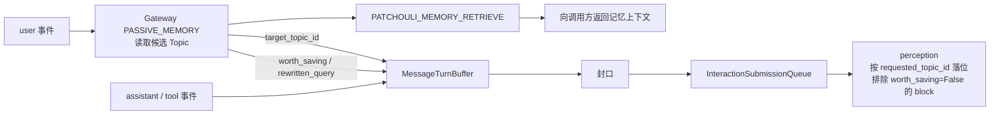
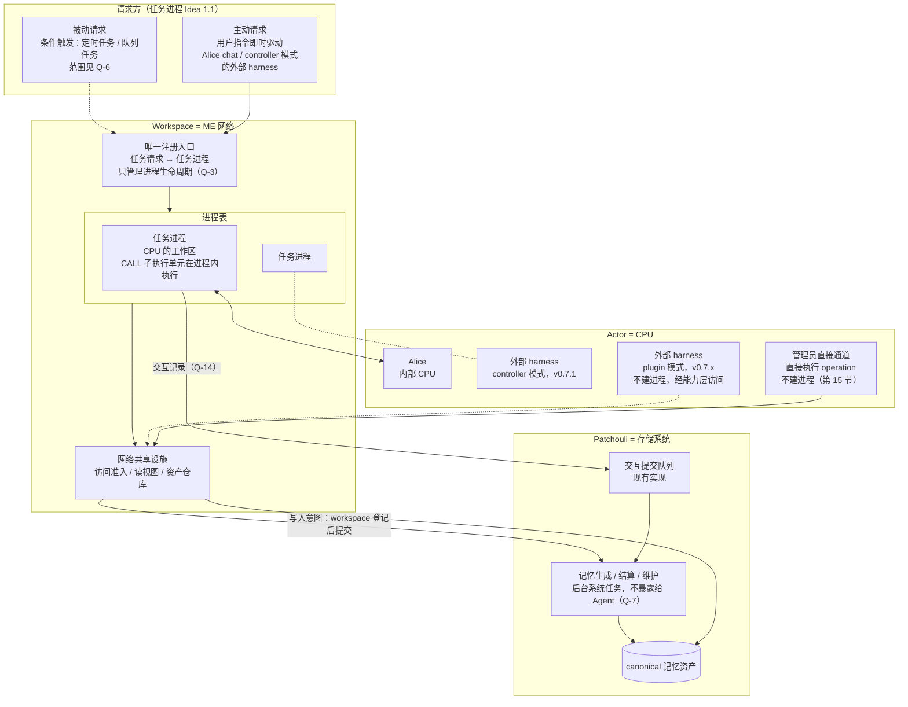
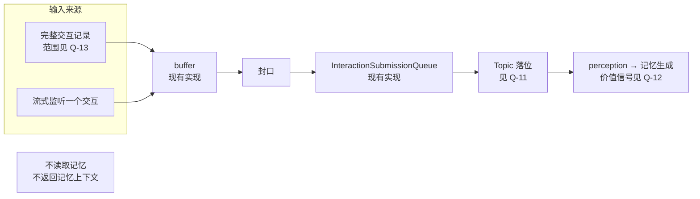
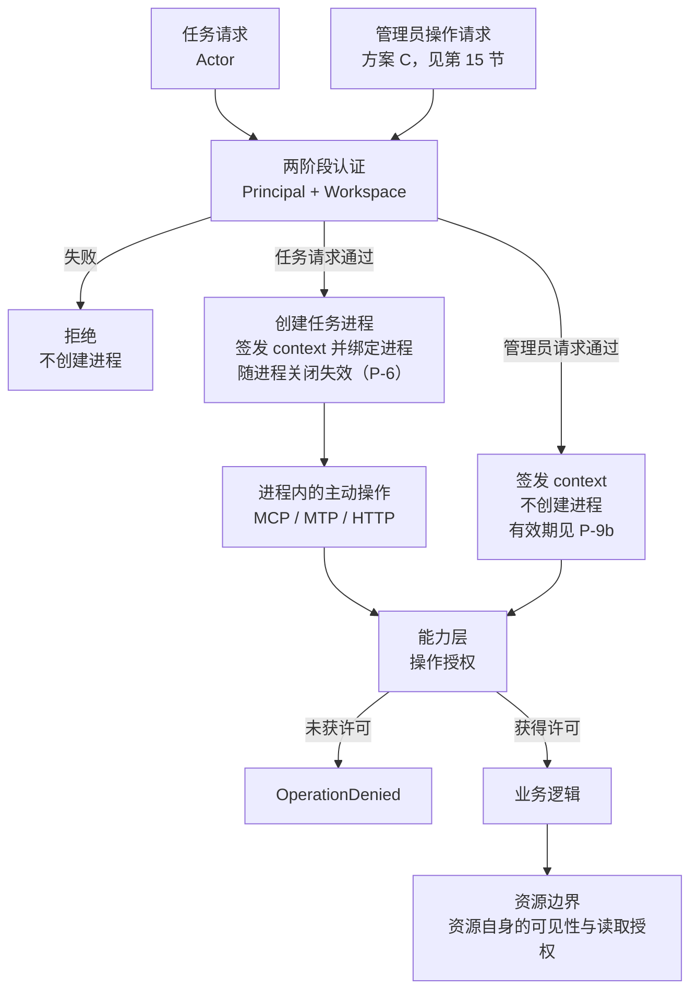
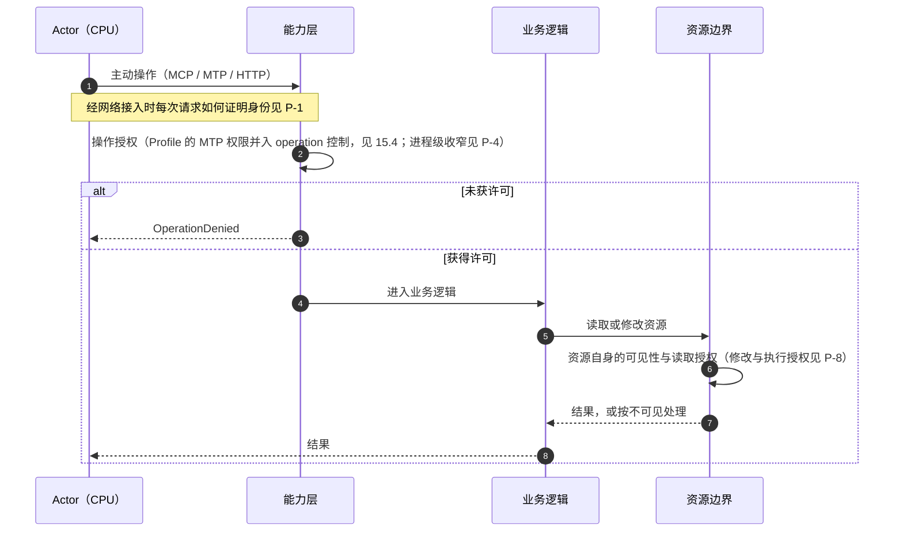

# Workspace 网络与任务进程架构

**文档状态**：Idea，未形成实施承诺
**覆盖范围**：第一部分——网络拓扑与 Import Bus（任务进程与注册入口已拆出为独立 Idea）；第二部分——system 包的边界；第三部分——认证与授权流程
**记录日期**：2026-09-26

## 0. 文档性质

本文记录 2026-09-26 关于 v0.7.0 方向重估的讨论结果，用于在进入任何 Plan 之前整理新架构的运行流程、包边界、权限流程与待决问题。

| 部分 | 前提（owner 提出） | 现状事实 | 图 | 已决定事项 | 待决问题 |
|:---|:---|:---|:---|:---|:---|
| 第一部分：网络拓扑与 Import Bus | 第 2 节 | 第 3 节 | 第 4 节 | 第 6.1 节 | 第 5、6 节 |
| 第二部分：system 包的边界 | 第 8 节 | 已删除（实施前状态） | —— | 第 9 节 | 第 10 节 |
| 第三部分：认证与授权流程 | 第 12 节 | 第 13 节 | 第 14 节 | 第 15 节 | 第 16 节 |

- **前提**是 owner 在讨论中提出的出发点，不表示已经实现或已经排期；
- **现状事实**对照当前代码核对，基于分支 `feat/workspace-runtime-and-capability` 在 2026-09-26 的工作区状态；第二部分实施后，第三部分 13.1 中移动过的路径已于 2026-09-27 更新；
- 流程图只画出前提或已决定事项已经确定的部分，以及现状；凡是依赖待决问题的内容都标注问题编号；
- **已决定事项**记录 owner 在讨论中明确作出的选择；
- **待决问题**只列出选项及其影响，本文不替 owner 作出选择，选项顺序不代表倾向；
- 任务进程表与唯一注册入口的前提、现状、流程图与问题 Q-1–Q-10、Q-14 已于 2026-09-27 拆出至[任务进程表与任务请求唯一注册入口](./task-process-table-and-registration-entry.md)，问题编号不变；本文其余部分提到这些编号时均指该文档。
- **术语**（owner，2026-09-27）：“被动（Passive）”一词保留给被动请求体系，即由条件触发创建任务进程的请求（[任务进程 Idea](./task-process-table-and-registration-entry.md)第 1.1 节）。原先称为“被动输入”的输入链路在本文称 **Import Bus**，最终名称未定，功能可能逐步倾向对话导入；代码标识符与事实文档中的现有名称（Passive Ingress、`PassiveIngressService`、Gateway `PASSIVE_MEMORY`）描述现状，保持不变。

本文不修改任何当前事实文档。现有 v0.7.0 计划与本文的概念对应见第 7 节，owner 对这些计划已作出的处置见第 6.1 节。

## 1. 背景

v0.7.0 计划 A 按组件与机制横向拆分（访问 → 缓存 → Session → Pending → API 收敛 → Actor 适配），每个子计划只改动各条运行流程的一小段，中间态依靠委托、re-export 与兼容入口维持。A2 实施过程中暴露出的现象（2026-09-26 工作区核对）：

- 读取记忆存在多条互不相通的路径：新的 workspace 读取能力（resolver 与缓存）已装配，但尚无生产调用方，只在测试中使用；HTTP 管理面经管理路由直读记忆库；Chat 在 Patchouli prepare 内部读取；Alice MTP 经自身 `RuntimeAliasResolver` 与缓存；Alice CALL 的 Profile 经自身解析器与缓存；Passive 直接调用检索路由。进程内同时存在两套原子缓存、两套 Profile 缓存与两套解析器；
- A1 的统一认证网关已装配，但没有生产入口调用；生产路径均走不带访问上下文的兼容分支，逐次行为授权在生产中实际未执行；
- `PatchouliService.prepare_agent_run` / `finalize_agent_run` 实际承担 Alice 会话的编排（Profile、Topic、检索与编译、附件租借与编译、组装 `AgentRunContext` 与 `StreamPrelude`、交互提交与物化派发），而计划把这部分职责退出排在 A5/A6；
- 包依赖与声明方向不一致：子系统、engines 与 infrastructure 对 `hivememory.system.*` 的导入约 130 处，`workspace` 与 `system` 相互导入，Patchouli 导入 `workspace.access` 23 处（已由第二部分的决定处理，见第 9 节）。

讨论由此转向：先从全系统运行流程重新定义架构，再决定组件归属。讨论中曾提出以“Actor Session”作为 Workspace 运行时的核心单位，该提法已由本文的任务进程模型取代。

## 2. 前提（owner 提出）

### 2.1 类比映射

| AE2 | HiveMemory |
|:---|:---|
| ME 网络 | Workspace |
| 存储系统 | Patchouli |
| 合成 CPU | 任意 Actor（Alice、外部 harness 等） |
| 合成任务 / 合成进程 | 一次任务请求对应的任务进程 |
| 玩家在合成终端下单 | 主动请求：用户的指令即时驱动任务进程 |
| 合成卡、请求器等自动下单方 | 被动请求：条件满足时创建任务进程（定时任务、队列任务等） |
| 玩家在 ME 终端直接存取 | 管理员直接通道：不是请求，直接执行 operation，不建进程（第 15 节） |
| Import Bus（只向网络输入） | Import Bus（现有 Passive Ingress 链路），已从核心全局拓扑断开（6.1） |

请求方只有主动请求与被动请求两类；区分标准与不属于请求方的对象见[任务进程 Idea](./task-process-table-and-registration-entry.md)第 1.1 节。

### 2.2 主动任务：任务进程

本节前提已移至[任务进程 Idea](./task-process-table-and-registration-entry.md)第 1 节：任意任务请求从唯一入口注册为一个进程，直到任务结束才关闭。

### 2.3 Import Bus（原“被动输入”）

1. 现有 Passive Ingress 虽标为 passive，却在用户输入后主动提供记忆，本质上是主动读取的一种触发方式，边界不清。
2. 新架构下 Actor 可以任意替换，Import Bus 退化为：接收信息并转为记忆资产，**与记忆系统零主动交互**。
3. 两种接收方式：
   - 直接接收一份完整的交互记录；
   - 流式监听一个交互。
4. 两种方式最终通过同一个 buffer 与提交路径（现有实现）进入记忆生成。具体实现细节暂不讨论。
5. （2026-09-27）Import Bus 不在核心全局拓扑上：它从全局拓扑中断开，逐步演进为独立功能，不在 v0.7.0 计划内（6.1）。2026-09-28 进一步明确：现在不考虑 Import Bus 带来的任何效果，将其排除在现有系统之外。
6. （2026-09-27）owner 指出，外部 Actor 的 plugin 模式很像一直以来的 Passive Ingress 模式；两种接入模式见[外部 Actor Idea](./external-actor-registration-and-runtime-access.md#11-两种接入模式owner2026-09-27) 1.1。

## 3. 现状事实（代码核对）

3.1（Chat run 注册表）、3.2（写入意图的现有寿命）与 3.5（记忆库内部工作）已移至[任务进程 Idea](./task-process-table-and-registration-entry.md)第 2 节，并按 2026-09-27 的代码重新核对。

### 3.3 Passive Ingress 的现有行为

在 [`PassiveMessageIngressor`](../../src/hivememory/system/services/passive/ingressor.py) 中，user 事件先把上一轮交接到队列，再调用 memory context provider：经 Gateway `PASSIVE_MEMORY` 模式分析，再调用 `PATCHOULI_MEMORY_RETRIEVE` 检索，并把检索结果返回给调用方。

Passive 对 Gateway 的依赖不止于检索：

- **Topic 落位**：[`MessageTurnBuffer`](../../src/hivememory/system/services/passive/turn_buffer.py) 保存 Gateway 决策，提交时以 `gateway_decision.target_topic_id` 作为 `requested_topic_id`。Gateway 做话题路由时会读取 Patchouli 的候选话题；
- **价值信号**：`rewritten_query` 与 `worth_saving` 取自 Gateway 决策写入 `InteractionPayload`；perception 冻结生成材料时排除 `worth_saving=False` 的 block（[`engines/perception/models.py`](../../src/hivememory/engines/perception/models.py)）。

### 3.4 统一的交互提交队列

自 v0.6.1 起，Active finalize 与 Passive Ingress 共用 [`InteractionSubmissionQueue`](../../src/hivememory/patchouli/control/interaction_submission.py)。Active 一侧以同步的 applied gate 作为继续物化等后续副作用的边界。

## 4. 流程图

### 4.1 全局拓扑

2026-09-27 按请求方的分类重画（6.1）：请求方只分主动请求与被动请求，执行者（CPU）单独成栏；Import Bus 不在核心全局拓扑上，已从本图断开。虚线表示依赖待决问题或不在 v0.7.0 范围的连接。图中 Q-3、Q-6、Q-7、Q-14 位于[任务进程 Idea](./task-process-table-and-registration-entry.md)。

- 外部 harness 有两种接入模式（[外部 Actor Idea](./external-actor-registration-and-runtime-access.md#11-两种接入模式owner2026-09-27) 1.1）。controller 模式下，用户在 HiveMemory 的入口选择外部 harness 作为 actor，请求经注册入口登记为任务进程，外部 harness 是进程中的 CPU；plugin 模式下，对话由外部 harness 管理，不经注册入口，harness 以不建进程的方式经能力层访问，形状与管理员直接通道相同。
- Import Bus（现有 Passive Ingress 链路）在现有代码中仍经交互提交队列进入记忆生成（3.3、3.4、4.5）；它不属于核心全局拓扑，按 6.1 排除在现有系统之外，代码层面如何处理尚未决定。任务进程的交互记录由进程自行提交（任务进程 Idea Q-14 选项 A）；写入意图在 workspace 登记后提交给记忆库，与进程解耦（写入意图迁移 Idea 0.1）。

4.2–4.4（任务进程的生命周期、通用流程与 chat 任务类型）已移至[任务进程 Idea](./task-process-table-and-registration-entry.md)第 3 节。

### 4.5 Import Bus 流程

Import Bus 不在核心全局拓扑上，不在 v0.7.0 范围（6.1）。

## 5. 待决问题：Import Bus

Q-1–Q-10 与 Q-14 已移至[任务进程 Idea](./task-process-table-and-registration-entry.md)第 4 节。

Import Bus 不在 v0.7.0 范围（6.1），本节问题随其独立演进处理。

每个问题只列出选项及其影响，不作选择；选项顺序不代表倾向。

### Q-11 Import Bus 交互的 Topic 落位

**背景**：现状由 Gateway 决策给出目标 Topic，Gateway 路由时读取候选话题（3.3）。

| 选项 | 内容 | 影响 |
|:---|:---|:---|
| A | 记忆库在接收时自行落位 | 需要在记忆库侧提供落位能力；`PASSIVE_MEMORY` 模式可以移除 |
| B | Import Bus 交互仍经 Gateway 路由 | 输入链仍会读取候选话题，与“零主动交互”的前提需要重新界定 |
| C | 由输入方显式指定或提示，记忆库校验 | 外部来源需要掌握 Topic 信息 |

### Q-12 Import Bus 交互的价值信号（worth_saving）

**背景**：现状由 Gateway 给出，perception 据此排除 block（3.3）。ROADMAP 的“记忆价值策略重设计”要求入口信号不能替代 Patchouli 的最终决定。

| 选项 | 内容 | 影响 |
|:---|:---|:---|
| A | Import Bus 交互不提供该信号，按现有语义视为保留 | 进入生成的材料可能增加 |
| B | 记忆库在接收或感知阶段自行评估 | 需要记忆库侧的评估能力及其成本 |
| C | 输入方可选提供提示，记忆库决定是否采纳 | 需要定义提示的来源与可信度 |

### Q-13 “完整交互记录”接收方式的范围

**背景**：ROADMAP v0.7.2 的历史对话导入有独立语义：历史发生时间、批次、去重，不重放进当前活跃话题。

| 选项 | 内容 | 影响 |
|:---|:---|:---|
| A | 只接收实时或刚结束的交互；历史导入另设通道 | 两条通道语义分开 |
| B | 同时作为历史导入入口 | 需要在该接收方式中承载历史时间、批次、去重与不重放等语义 |

## 6. 待决问题：迁移与现有工作（来自前序讨论）

| 编号 | 问题 | 选项 |
|:---|:---|:---|
| M-1 | 迁移的切分方式 | 已决定，见 6.1 |
| M-2 | 包边界调整（第二部分 D-1 至 D-9）相对流程迁移的先后 | 已决定，见 6.1 |
| M-3 | 第一条迁移到新架构的流程 | 已决定，见 6.1 |
| M-4 | 迁移期间的兼容范围 | 只保证数据兼容 / 保留代码层兼容窗口 / 按接口逐项决定 |
| M-5 | v0.7.0 的范围 | 已决定，见 6.1 |
| M-6 | 现有 v0.7.0 计划文档（协调入口、边界宪章、WRX-0 清单、A2–A6、计划 B）的处理 | 已决定，见 6.1 |
| M-7 | 当前分支未提交的 A2-1 改动（2026-09-26 unit + integration：2518 passed，2 skipped） | 已决定，见 6.1 |

### 6.1 已决定事项

2026-09-26：

- **M-2**：包边界调整先于流程迁移完成（即第二部分的实施）；
- **M-7**：A2-1 改动作为检查点提交，随 PR #103 合并。

2026-09-27（同日两次）：

**M-6**：

| 文档 | 处置 |
|:---|:---|
| A2（未完成部分）、A5、A6、WRX-0 清单 | 作废，直接删除；删除前最后版本见 commit `dda9d9d` |
| A3、A4 | 方向保留，不再按编号看待：A3 对应“Topic 体系不能接收外部 Actor 的会话消息”，A4 对应“PendingAtom 体系的迁移”。两者删除计划安排内容后，设计完整退回 Idea：[外部会话消息的接收与 Topic 投影](./external-session-and-topic-projection.md)、[写入意图（PendingAtom）体系的迁移](./pending-intent-migration.md) |
| 任务进程表与任务请求唯一注册入口 | 当前唯一的有效计划方向；设计讨论集中在独立的 [任务进程 Idea](./task-process-table-and-registration-entry.md) |
| 协调入口 | 删除；版本内计划导航由 [Plans 索引](../plans/README.md)承担，不含设计决策；ROADMAP 的 v0.7.0 部分缩为摘要 |
| 边界宪章 | 拆分后删除：原则层（归属判据、记忆库一侧的独立工作契约、证伪条件）成为 [ADR-0006](../architecture/decisions/0006-memory-library-custody-criteria-and-independence-contract.md)；裁定层退回 Idea（本文 7.1、写入意图体系迁移第 4.2 节、外部会话与 Topic 投影第 2.1 节）；过程记录不再保留 |
| 计划 B | 作为计划作废：Passive 的设计已经更新，内容也大多过时。它的核心问题——外部 Actor 的信息如何注册进系统、运行时如何访问系统（adapter 接口设计）——退回 Idea：[外部 Actor 的接入登记与运行时访问](./external-actor-registration-and-runtime-access.md) |

与上述处置相关的另外三项决定：

- **workspace 包的现有实现**（A2 已实施部分：`workspace/cache/`、`workspace/resolution/`、`workspace/runtime.py` 与能力层的读取方法）：不承诺其实现正确，也不作为任务进程表计划的前提；该计划制定时重新调查，再决定保留、改造或删除。2026-09-28 的调查结论与 workspace 的子包划分见第 10 节 D-9；
- **A1 返工**（operation 检查迁移、迁移期兼容分支退出、生产入口接入认证网关）：未排期，不阻塞任务进程表计划，见 [A1 访问边界返工](../todo/a1-access-boundary-rework.md)；同日第三次决定改为在任务进程表计划完成后接入（见下文 M-5）；
- **ADR-0004 与 ADR-0005**：标记为失效（`deprecated`），没有替代 ADR。

2026-09-27（第三次）：

**M-1 迁移的切分方式**：按流程纵切，把链路按预想的功能逐步迁移与改造。理由（owner）：A 系列按组件横切的方式已经证明不可靠，容易严重脱离实际情况而作理想设计；直接按功能逐条迁移链路，更容易得到实际成果。

**M-3 第一条迁移的流程**：Alice 的 chat 链路。理由（owner）：外部 Actor 的适配已顺延（见 M-5）；Patchouli 与 Alice 的深层耦合本身由 chat 链路带来（第 1 节背景第 3 条），只要初步解决这个问题，v0.7.0 的 workspace 架构就更容易建立。

**M-5 v0.7.0 的范围**：保持规划中的方向，至少完全完成项目向新架构的演进，使 workspace 体系在项目架构中稳定存在。

| 事项 | 决定 |
|:---|:---|
| 验收口径 | 验证 Alice 能在新架构下跑通，证明各流程协作无误，使之后的 adapter 不需要再大改系统拓扑结构；v0.7.0 不对外部 Actor 所需的基建作承诺 |
| 外部 Actor 的真实接入 | 真正的 adapter 接口与外部服务身份等（原计划 B 的内容）不在 v0.7.0：controller 模式在 v0.7.1，plugin 模式在其后的 v0.7.x，见[外部 Actor Idea](./external-actor-registration-and-runtime-access.md#11-两种接入模式owner2026-09-27) |
| 任务进程表与唯一注册入口 | v0.7.0 的首个方向，见[任务进程 Idea](./task-process-table-and-registration-entry.md) |
| 外部会话消息的接收与 Topic 投影 | 在 v0.7.0 内完成，Alice 作为第一个使用者，见[外部会话与 Topic 投影](./external-session-and-topic-projection.md) |
| A1 返工 | 在任务进程表计划完成、已有稳定入口之后接入，见 [A1 访问边界返工](../todo/a1-access-boundary-rework.md) |
| Import Bus（现有 Passive Ingress 链路） | 不在核心全局拓扑上，现在从全局拓扑中断开；逐步演进为独立功能，不在 v0.7.0 计划内。第 5 节 Q-11–Q-13 与第 10 节 D-8a 随之移出 v0.7.0 |
| 写入意图（PendingAtom）体系的迁移、workspace 包的重新调查 | 本次未涉及，维持原状态：前者方向保留、未排序；后者在任务进程表计划制定时进行。2026-09-28 决定写入意图迁移纳入 v0.7.0，分两步实施，见[写入意图迁移 Idea](./pending-intent-migration.md#01-owner-的决定2026-09-28) 0.1 |

同日作出的相关决定：

- **P-1a**：注册前经认证网关验证身份，未通过不予注册；此后每次请求都必须重新校验，见 15.3；
- **E-1**：接入登记维持启动时从配置装载；运行时登记与其他配置文件的热更新一并由未来单独的计划实现，见[外部 Actor Idea](./external-actor-registration-and-runtime-access.md#e-1-接入登记的来源与生效时点)；
- **外部 Actor 形态**：Q-8（外部 CPU 的进程）、E-4（结果观察）、P-5b（被动请求的 principal）以及外部 Actor 对话中请求方类型与认证 principal 的关系，都关联外部 Actor 的形态并严重影响实现，单独审议。同日审议结果：外部 Actor 分为 plugin 与 controller 两种接入模式，先做 controller 模式，作为 v0.7.1 的首个真实外部 harness 接入；plugin 模式在 v0.7.1 之后的 v0.7.x 完善。各问题在两种模式下的归属见[外部 Actor Idea](./external-actor-registration-and-runtime-access.md#11-两种接入模式owner2026-09-27) 1.1；
- **全局拓扑与 D-8 的一致性**（原第 10 节待决问题）：随 Import Bus 从核心全局拓扑断开而消解，4.1 已重画；
- **请求方的分类**（修正 4.1 全局拓扑）：请求方只有主动请求与被动请求两类，“被动（Passive）”一词保留给被动请求体系；定义、区分标准以及不属于请求方的对象（CALL 子执行单元、管理员直接通道、Patchouli 记忆任务）见[任务进程 Idea](./task-process-table-and-registration-entry.md)第 1.1 节。

2026-09-28：

**M-5 的版本目标**：以下四条是 v0.7.0 的版本目标（owner）：

1. Patchouli 的公开路由既不产出、也不接收 Alice 专属的类型，包括 `AgentRunContext`、`StreamPrelude`、`AgentRunResult` 与编译好的记忆文本；
2. 一个非 Alice 的 CPU（测试中的替身即可）能跑完整个任务进程，不需要改动进程与入口的代码；
3. 取消与清理都经过进程容器：进程关闭时释放已登记的资源，取代 Patchouli 的清理路由与 chat 编排中的补偿；每个阶段的取消都能通过容器接口测试；
4. 命令、主动请求与被动请求经同一入口注册（被动请求的实现范围见任务进程 Idea Q-6）。

这四条用来区分真正的解耦与“只是把 chat 链路从 system 层搬了个地方”：四个阶段的顺序是任务的自然顺序，不需要改变；应当改变的是阶段之间的状态由谁持有、每个交界处传递什么，以及执行阶段能否由任意 CPU 承担。

**会话模型与 Topic 池**：前台对话回归常规 Agent 软件的 session 概念，保留新建、恢复、压缩三个会话操作，压缩由 CPU 负责；Topic 不绑定 Session，workspace 共享一个 Topic 池；Gateway 的会话提示后放，现在 Gateway 的话题路由只服务于后台的 Topic 路由。前端改造与新建、恢复两个操作在 v0.7.0 完成，Alice 的压缩约在 v0.7.1 完成。详见[外部会话与 Topic 投影 Idea](./external-session-and-topic-projection.md#01-会话模型与-topic-池owner2026-09-28) 0.1。

**Import Bus**：现在不考虑 Import Bus 带来的任何效果，将其排除在现有系统之外；任务进程 Idea Q-14 的选项 B 因此不成立。

**写入意图**：写入意图迁移纳入 v0.7.0，放在外部会话与 Topic 投影改造之前或之后都可以；登记位于 workspace，与任务进程和记忆生成两侧都解耦，经能力层实时提交；取消与失败不再丢弃已提交的写入意图；PendingAtom 在落库前对全 workspace 可回读。详见[写入意图迁移 Idea](./pending-intent-migration.md#01-owner-的决定2026-09-28) 0.1 与任务进程 Idea Q-1、Q-2。

同日决定的任务进程结构（进程创建时机、四阶段通用骨架、进程记录与工作集、prepare 的拆分、附件与 Topic 的去向）见[任务进程 Idea](./task-process-table-and-registration-entry.md#12-任务进程的结构owner2026-09-28) 1.2；Agent Profile 权限的决定见 15.4。

## 7. 与既有文档的对应关系

下表只列出概念上的对应，不表示承接关系已经确定（见 M-6）。

| 本文元素 | 既有文档中的相关内容 |
|:---|:---|
| 唯一注册入口、进程生命周期 | [任务进程 Idea](./task-process-table-and-registration-entry.md)；现有 chat run 注册表；[Chat Run 生命周期后续候选](./chat-run-lifecycle-follow-ups.md) |
| 进程中的写入意图 | [写入意图体系迁移](./pending-intent-migration.md)（原 A4，含原宪章 §6.2 的归属论证） |
| 网络共享读视图 | A2 读取能力面与派生缓存（已删除，最后版本见 commit `dda9d9d`）；workspace 包的现有读取实现保留为 Alice 读取实现的迁移目标，见第 10 节 D-9 |
| 对话连续性（Q-9） | [外部会话与 Topic 投影](./external-session-and-topic-projection.md)（原 A3） |
| Import Bus | [Passive Ingress 当前设计](../system/passive-ingress.md) |
| 外部 Actor 的接入与运行时访问 | [外部 Actor 的接入登记与运行时访问](./external-actor-registration-and-runtime-access.md)（原计划 B） |
| 访问准入 | [Workspace 架构](../architecture/workspace.md)第 4 节；[A1（归档）](../archive/plans/v0.7.0-a1-workspace-access-boundary.md) |
| CPU / 进程 / 子网类比 | [AE2 与 HiveMemory 的架构同构性](./ae2-hivememory-architecture-analogy.md) |
| 独立工作契约、事件协作纪律、断开测试 | [ADR-0006](../architecture/decisions/0006-memory-library-custody-criteria-and-independence-contract.md)（记忆库一侧）；本文 7.1（库外一侧与事件协作） |

### 7.1 移入的候选裁定：库外状态与网络共享设施（原边界宪章）

本节来自 v0.7.0 边界宪章的裁定层，于 2026-09-27 宪章拆分时移入。宪章的归属判据与记忆库一侧的独立工作契约已成为 [ADR-0006](../architecture/decisions/0006-memory-library-custody-criteria-and-independence-contract.md)；修订日志、回溯验证、可逆性押注与联动修订清单等过程记录不再保留，宪章删除前的最后版本见 commit `dda9d9d`。写入意图归属的论证移入[写入意图体系迁移](./pending-intent-migration.md)，Session 与 Topic 的切分移入[外部会话与 Topic 投影](./external-session-and-topic-projection.md)。

这些裁定写于任务进程模型提出之前，把库外状态统一判给“workspace runtime”。2026-09-28 按[任务进程 Idea](./task-process-table-and-registration-entry.md)的 Q-2、Q-3a 与第 10 节 D-9 决定：原判给“workspace runtime”的各项位于 workspace 的共享设施，不进入任务进程。7.1.2–7.1.8 的其余内容（独立工作义务、事件协作、读取边界、缓存、能力面入口、断开测试）仍是候选设计，保留原裁定的表述。

#### 7.1.1 候选归属表

记忆库一侧的各行与 ADR-0006 一致；其余各行是原宪章的裁定。2026-09-28 按第 10 节 D-9 决定：ConversationSession、Atom cache / Profile 解析缓存、alias resolver 各行均位于 workspace 的共享设施。其中 pending registry 一行已于 2026-09-28 决定：登记位于 workspace，生命周期与任务进程解耦，经物化过线、结算以全局事件回流（[写入意图迁移 Idea](./pending-intent-migration.md#01-owner-的决定2026-09-28) 0.1）。

| 状态/能力 | 原裁定的持有者 | 过线动作 | 依据 |
|:---|:---|:---|:---|
| canonical MemoryAtom、meta.version、完整版本历史 | Patchouli | —（库内） | 已接收资产 |
| 四类 Artifact（interaction/document/creation/version） | Patchouli | — | 已接收证据 |
| Topic/短期库（已提交素材） | Patchouli | 封口 + 提交（过线入） | 已接收素材；短期库的管辖权语义见外部会话 Idea |
| generation/lifecycle/检索/去重/合并算法 | Patchouli | — | 流水线本体 |
| Profile 解析能力（builtin 规则、from_atom） | Patchouli | Profile 解析调用 | 库既有能力，不增不减 |
| ConversationSession + 封口交互记录 | workspace runtime | 提交（过线出） | Actor 真实工作记录（未过线部分） |
| pending registry（intent 身份/alias/内容/状态/settlement 关联） | workspace runtime | 物化 + settlement 回流 | 未接收的要约，论证见写入意图 Idea |
| Atom cache / Profile 解析缓存 | workspace runtime | 失效事件（入向，D1–D3） | Actor 读加速，可丢弃的派生 |
| alias resolver / workspace memory read 能力 | workspace runtime | L2 冷读调用 | 编排层不住在被编排者体内 |
| Profile 读取 resolver（解析结果缓存、交付授权） | workspace runtime | `GET_AGENT_PROFILE`（出向；backing 附带 policy 依据，不触 AtomCache） | AgentProfile 自持 agent_id；可见性不进模型，policy 依据随缓存项 |
| 逐次行为授权（operation 检查） | workspace 能力边界 | — | 绑定交付边界，随能力走而不随存储走 |
| WorkspaceAssetStore / lease facade | workspace runtime | — | 既有事实 |
| run/frame/MTP/prompt 组装/执行配置 | Actor（Alice 等） | — | 执行状态，不是资源状态 |
| 会话/意图/缓存的持久化 | 无（进程内） | — | 维持现状，跨重启另行规划 |
| bus/queue/scheduler/registry/EventBus | 共享基础设施 | — | 不拥有领域状态 |

#### 7.1.2 库外一侧的独立工作义务

库不可达时必须全部成立：

1. 认证交接后的能力面照常接纳 Actor；
2. Session 生命周期照常（open/paused/closed、有序交互引用、封口内容保留窗口）；
3. 写入意图登记照常并返回登记收据；物化提交显式失败且保留可重试收据（登记与物化提交是两个业务阶段；物化提交没有独立队列，排队只发生在库侧 generation task 队列，属于库接收之后的库内事实）；
4. L0（registry 本地查表）与 L1（cache）解析及交付边界授权照常执行；
5. WorkspaceAsset facade 照常；
6. 降级显式：L2 冷读返回明确错误，不以过期条目伪装新鲜成功；settlement 暂停期间写入意图保持 in-flight/等待语义；缓存内容只反映最近一次成功同步之前的状态，且不宣称更新。

原裁定的持有清单：ConversationSession 与封口交互记录、pending registry、Atom cache 与 Profile 解析缓存、alias resolver 与 profile 读取 resolver（二者构成 memory read 能力边界）、逐次行为授权执行点、WorkspaceAssetStore 与 lease facade。

禁止：解释记忆领域语义（内容合并、类型行为、版本推进、检索排序、去重决策）；在库不参与的情况下制造或伪装 canonical 事实；缓存任何 Actor 的授权结论；把库的 backing 路由包装为 Actor 面向入口来绕过能力边界。

#### 7.1.3 过线契约与事件协作

**库外 → Patchouli**（全部是既有路由语义，不新增领域逻辑）：封口交互提交；materialize task 提交；canonical 点读/alias 批读；语义检索；Profile 定义解析。

**Patchouli → 库外**：事件协作，承载于全局系统总线的 `publish`，分两个事件族。两者均尚未实现，也未登记入公共事件契约。

1. **settlement 事件**（复用既有 `pending_atom_settler`/bridge 投递链）：intent 终态回写的加速通道。事件是加速，不是真相：通知事件只作观测，不能作为唯一的终态真相，结算须可从权威任务/领域结果核对；registry 必须保留以 intent_id 锚定的权威对账路径，在状态可疑或滞后时按 intent 查询 generation 的权威结果。
2. **canonical 变更事件**：`MidTermMemoryStore` 各变更方法（upsert/patch/delete）的提交调用完成时（`finally`，无论提交成败：evict-only 语义下失败提交的空失效无害，且能覆盖主库成功而 secondary 失败的半成功场景）发布领域事实（`workspace + memory_id + operation + patch 路径`）。发布由注入 store 的 `MemoryChangePublisher`（`patchouli/control`，持总线，随 runtime 装配，与 PendingAtomSettler 同模式）内联承载；订阅者据此决定失效哪些条目与索引并推进 epoch，失效范围（含被释放的旧 alias）由订阅者按自身的正反索引推导。库只声明事实，不计算缓存影响；store 不依赖总线，只依赖注入的发布协议。

两个事件族都是 `GlobalSystemBus` 上的公共事件族，不是 RuntimeEvent，AGENTS.md 对 RuntimeEvent 的观测性条款不适用。

发布与订阅以三条纪律（D1–D3）保证正确性。依据：`AsyncSystemBus.publish` 内联、顺序 await 全部订阅者后才返回，订阅者异常被吞并只记日志；因此内联发布在时序上等价于同步失效调用，但失败语义必须由纪律补齐。

- **D1 内联发布**：canonical 变更与 settlement 事件必须 `await publish`，禁止 `create_task` 或其他延后投递；一旦 fire-and-forget，“提交后、送达前”的过期命中窗口立即回归。
- **D2 失效优先的订阅者**：canonical 变更订阅者的第一步无条件执行受影响条目的 evict 与 epoch 推进（纯内存、不可失败），之后才做任何可能失败的细节工作；handler 内的任何异常都发生在条目已失效之后，失败不可能留下过期命中。
- **D3 只失效、不携值**：订阅者不回放事件携带的值。mutation 没有全序（lifecycle patch 不推进 `meta.version`），乱序回放会用旧副本覆盖新状态；回填一律交给带 epoch 守护的冷读。

方向约束：库对缓存的唯一接触是出向事件；库外对 canonical 数据的唯一获取是冷读路由，双向都不得出现旁路。写入路径会等待订阅者执行完（内联 publish 的时序耦合），但写入的成功不依赖订阅者结果：以等待换正确性，是这一契约的明确取舍。

#### 7.1.4 读取能力的双向边界

该边界要保护的对象是“不出现第二个记忆库”。

| resolver 可以 | resolver 禁止 |
|:---|:---|
| 引用归一化；L0/L1/L2 定位；写入意图中立结果的引用级跟随（含 settlement 指向的 canonical ref） | 检索排序、dense/sparse 算法、去重决策 |
| 按原子自身的 policy 做逐次授权判定（纯谓词，与库共享同一份 core 实现；policy 字段的当前性由失效事件协作与 D1–D3 保证） | 任何内容语义解释、编译、记忆类型行为 |
| epoch 守护的回填、single-flight 合并、负缓存规则执行 | 任何写路径；缓存授权结论 |
| 完整原子 copy-on-read 交付 | 持有 canonical 状态，或绕过失效事件自造当前性 |

配套约束：授权谓词已上收 [`core/memory_access.py`](../../src/hivememory/core/memory_access.py)（`engines/retrieval/policy.py` 保留兼容转发），resolver 不得导入 Patchouli 的 engines 包；`patchouli.public.memory.*` 是 backing 契约，直连仍安全（库侧校验独立成立），但没有缓存，也不是 Actor 面向入口；管理读取直连库的管理路由，不经 resolver。

#### 7.1.5 缓存

原裁定：缓存归 workspace runtime；唯一读者是 resolver；库的唯一接触是出向失效事件。依据：迁移前由 Alice 持有；为 Actor 读加速而存在，是可丢弃的派生；库的读路径因此回到 storage-shaped，不成为依赖缓存的读取器。缓存的行为契约（资源 key、完整原子 copy-on-read、不缓存授权结论、epoch、负缓存规则、close、容量与观测）以 resolver 为唯一消费者；语义检索仍执行检索并可协作预热，缓存不替代搜索。

#### 7.1.6 能力面入口

原裁定（2026-09-25）：workspace 能力面的入口形状是 **in-process 的 workspace server API，不新开总线路由**。Actor 是 client，经 adapter（HTTP、MTP、MCP 与外部传输）归一化后调用能力面；能力面为实现真实功能，作为 client 调用 Patchouli 的 backing API，形成第二层 client-server，即 7.1.3 的过线契约。总线只承载库外到 Patchouli 的 backing 调用与失效事件。

能力层由原 `system/application` 的资源能力部分改造而成，不新建中间层：拥有平面状态（resolver、双缓存、边界授权、lease）或组合多个领域步骤的方法构成能力实现；向单个 backing 领域操作的无状态委托可以保持薄转发，条件是转发前已在能力边界完成 operation 授权，且转发目标是一个完整的领域操作而不是裸机制（如 `patch_payload`）。现状：资源能力位于 `workspace/capability`，chat 编排暂置 `alice.application`（第 9 节 D-9）；2026-09-28 决定 chat 编排迁入 workspace 的 `process` 子包（第 10 节 D-9）。

adapter 的五条判据见[外部 Actor Idea](./external-actor-registration-and-runtime-access.md) 3.4；operation 授权的检查点迁移见 [A1 访问边界返工](../todo/a1-access-boundary-rework.md)与第三部分前提第 5 条。

#### 7.1.7 库外模式的断开测试

记忆库一侧的库模式测试见 ADR-0006。原宪章中库外一侧的测试：

- **作业模式测试（integration）**：注入库路由不可达，断言 session 创建、交互封口登记、写入意图登记、L1 命中读取、资产获取全部成功；L2 冷读与物化提交显式失败且登记收据保留（凭 intent identity 可重试）；全过程不出现静默的过期成功；
- **纯 Actor 测试**：Alice 在不含自有 resolver、cache、pending registry 的装配下完成一次 run，读路径全部经能力边界；
- **订阅者纪律测试（unit/integration）**：对 canonical 变更订阅者构造“evict 之后失败”的注入场景，断言条目与 epoch 已失效、后续读取不命中过期值（D2），且发布方调用正常返回、canonical 提交不受影响；另断言 canonical 变更的发布是内联 await，不存在延后投递路径（D1）。

作业模式测试不得通过 mock 库内部状态来通过，只允许注入不可达；“正常工作”的含义是降级存活，不是全功能。

#### 7.1.8 失效条件与开放细则

原宪章中针对事件协作的失效条件：

- 事件协作无法在没有订阅者的库组合中以空投成立，或 D1 内联发布纪律无法在写入路径中维持；
- 订阅者无法按 D2 失效优先的纪律实现，即存在 handler 失败后留下过期命中的路径。

仍开放的细则：

- D2 纪律的验收标准；D3 中 lifecycle 类展示性信号走 advisory 事件 best-effort 刷新，还是完全不投递；
- 负缓存是否启用，以及容量、TTL、close 时在途请求的行为；
- 两个事件族的事件名、载荷与发布/订阅纪律如何登记入公共事件契约。

## 8. 第二部分：问题（owner 提出，2026-09-26）

新架构下，外部 Actor、Alice 与管理员用户都应当通过 workspace 获得系统能力，而 system 仍是最顶层的搭建者。旧的包分割不支持两者分离：access 网关建在 system 的边界上，总线、调度器等运行时基础设施都位于 system 中，system 与 workspace 互相导入，下层包大量导入 `system.config`。本部分要回答“system 包是什么”，并为 system 中有争议的内容找到去处。

本部分的问题已于 2026-09-26 决定并实施，结果已进入事实文档。实施前的现状事实、待安置内容清单与各问题的选项表已从本文删除，最后版本见 commit `dda9d9d`。

## 9. 第二部分：已决定并实施的事项

| 问题 | 决定 | 当前事实 |
|:---|:---|:---|
| D-1 system 的定义 | system 是依赖图顶点，除入口（server）外无包导入 system；包按 L0–L5 分层，由 `tests/unit/architecture/test_package_layers.py` 守护 | [系统架构概览](../architecture/overview.md)第 3 节；[AGENTS.md](../../AGENTS.md) 第 3 节 |
| D-1a 根包初始化 | 根包只导入版本号 | 同上（分层测试守护） |
| D-2 运行时机制的归属 | 新建 `components` 包（L1）：总线、调度器、work queue、运行时事件、串行门与 trace context | [Components](../components/README.md) |
| D-3 契约常量的归属 | route/event 常量、子系统契约与 RuntimeEvent 模型进入 `core.contracts` | [子系统公共契约](../contracts/subsystem-contracts.md)；[公开路由与事件](../contracts/routes-and-events.md) |
| D-4 配置的拆分 | 顶层 `config` 包（L0）按子系统与高聚合组件组织配置段，根配置与加载位于 `config.app`，只供 system 与 server 导入；子系统构造函数只接收自己的配置段。曾先按“配置模型随归属组件分散”实施，因同一配置段被拆进多个包而改为本方案 | [System 配置与注册表](../system/configuration.md) |
| D-5 留在 system 但被下层使用的内容 | 下层定义端口，system 实现并注入：`core.access.PrincipalAuthenticator`、`agent_runtime.model_resolution.ModelResolver`（`ModelNotFoundError` 移至 core）；Patchouli 经 `core.access.WorkspaceAccessVerifier` 消费行为检查 | [System 组合根](../system/composition.md) |
| D-6 认证网关的归属 | 两步编排位于 `workspace.authentication`，Principal authentication 由 `system.access.SystemPrincipalAuthenticator` 实现 | [Workspace 架构](../architecture/workspace.md)第 4 节 |
| D-7 附件的拆分与去处 | 解析器移至 `infrastructure.attachments`；AssetStore、解析交接与上传移至 `workspace.assets`；资产端口移至 `core.ports` | [Chat 附件链路](../system/attachments.md)；[Workspace 架构](../architecture/workspace.md) |
| D-8 passive 的定位 | 留在 system，作为 system 级服务 | [被动摄入](../system/passive-ingress.md) |
| D-9 chat 编排与 chat run 注册表 | 暂置 `alice.application`；最终归属见第 10 节 | [System 应用服务](../system/application-services.md) |

## 10. 第二部分：未解决的问题

每个问题只列出选项及其影响，不作选择；选项顺序不代表倾向。D-9 已于 2026-09-28 决定，保留在本节以便对照选项。

### D-8a passive 的接入认证与目标 Workspace

Import Bus 不在 v0.7.0 范围（6.1），本问题随其独立演进处理。

**背景**：passive 作为 system 级服务留在 system（D-8）。当前 `PassiveIngressService.ingest_event()` 为当前用户解析默认的 `main_workspace` 作为目标 Workspace，ingest 入口不经统一认证网关。讨论中提到的“来源 → 目标 Workspace”登记表没有实施：它会改变 ingest 的行为，在空配置下使现有被动接入失效，需要单独决定配置形态与缺省行为。

| 选项 | 内容 | 影响 |
|:---|:---|:---|
| A | 经统一认证网关 | 输入来源需要作为 principal 登记，并确定 Workspace 准入与所需 operation |
| B | 使用独立的来源登记（来源 → 目标 Workspace） | 需要决定配置形态，以及空配置时的缺省行为 |
| C | 其他 | —— |

### D-9 chat 编排与 chat run 注册表的最终归属

**背景**：两者暂置于 `alice.application`（[`chat_control.py`](../../src/hivememory/alice/application/chat_control.py)、[`chat_service.py`](../../src/hivememory/alice/application/chat_service.py)）。

- **D-9a chat run 注册表**：workspace（演化为[任务进程 Idea](./task-process-table-and-registration-entry.md)的进程表） / 保留在 `alice.application` / 其他。
- **D-9b chat 编排**（chat 任务类型的执行步骤）：workspace / alice（保留现状） / 独立的任务类型包 / system / 其他。

2026-09-28 的相关决定（[任务进程 Idea](./task-process-table-and-registration-entry.md#12-任务进程的结构owner2026-09-28) 1.2）：chat run 注册表演化为进程表，`ChatGenerationRun` 演化为进程记录；不存在任务类型，chat 编排即 controller 模式下的四阶段通用骨架。

**owner 决定（2026-09-28）**：进程表等内容理论上应当放在 workspace 中；鉴于体量较大，暂时按下表在 workspace 内部细分子包（D-9a、D-9b 均为 workspace）。子包名是示意，最终命名在实施时确定。

| 子包 | 角色（AE2 类比） | 内容 | 可以依赖 |
|:---|:---|:---|:---|
| `contracts` | 对外接口 | CPU 端口、能力层协议、`process_id` 等进程公共模型 | 只依赖 L0–L2 |
| 共享设施 | 存储系统之外的网络设施 | 资产仓库、写入意图登记、ConversationSession、读取视图 | contracts |
| `access` | 安全终端 | 认证网关、guard、访问登记 | contracts |
| `capability` | 终端与接口 | Actor 唯一可见的 API，负责 operation 授权 | access、共享设施、contracts |
| `process` | 合成 CPU 的调度 | 进程表、进程容器、四阶段骨架、CPU 分配 | capability、access、共享设施、contracts |

- **依赖方向**：process → capability → access 或共享设施 → contracts。能力层与共享设施不得依赖 process：plugin 模式与管理员直接通道都要在不建进程的情况下使用能力层。方向规则加入 `tests/unit/architecture/test_package_layers.py`，由测试守护。
- **暂不拆成多个顶层包**：process 与 capability 属于同一子系统、生命周期相同；拆成独立的 L3 包后两者只能经 contracts 交互，需要多定义一批端口，而 workspace 内部的方向规则能提供同样的约束。
- **`workspace.contracts`**：workspace 目前没有 `contracts` 子包，其他 L3 子系统无法导入它。Alice 作为 CPU 既要实现 CPU 端口，又要调用能力层，因此需要建立这个子包；端口由 workspace 定义、Alice 实现，workspace 不导入 Alice（与 D-5 的做法一致，也是 v0.7.0 版本目标第 2 条的前提）。
- **ConversationSession** 放在共享设施：它跨进程存在，不属于某个进程的工作集；按 ADR-0006 也不属于记忆库。
- **读取视图**：Alice 的 `RuntimeAliasResolver`、alias 缓存与 Profile 缓存本来就要迁移到 workspace，只是上一轮计划回档重构后没有删除和迁移完整。workspace 现有的读取视图（`cache/`、`resolution/`、`runtime.py`）保留，作为这套迁移的目标；迁移完成后 Alice 不再持有自己的读取缓存与 resolver。

重新调查的其余结论（分析，2026-09-28 核对）：

- workspace 现有约 3,240 行：接入与准入 389 行、能力层 850 行、资产 1,053 行、读取视图 913 行；进程相关内容（`alice.application` 的 chat_control 与 chat_service，1,117 行）、写入意图登记（`agent_runtime/pending_atom`，522 行）、ConversationSession、CPU 端口与能力层扩展迁入后，合计将超过 5,000 行；
- 能力层的 `read`、`retrieve_by_aliases`、`retrieve`、`get_agent_profile` 与读取视图目前都没有生产调用方；Alice 的 MTP 读取改经能力层之后，它们成为生产读取路径；
- `engines/memory_compiler` 对 `agent_runtime.aliases` 的导入是分层测试登记的已知例外；Alice 的 alias 体系迁出、编译移到 CPU 一侧（任务进程 Idea 1.2）之后，这一例外需要随之处理；
- 命名冲突：`workspace/runtime.py` 的 `WorkspaceRuntime` 实为读取缓存的聚合，`workspace/registry.py` 是访问登记；进程表迁入后，“runtime”与“registry”都会产生歧义，需要改名。

### engines 的既有向上导入

**背景**：分层实施时未处理 engines 对上层的 13 处既有导入，作为已知例外登记在分层测试的 `KNOWN_UPWARD_IMPORTS` 中（测试要求实际导入与登记完全一致），[AGENTS.md](../../AGENTS.md) 规定不得新增：

- `engines/artifacts`、`generation`、`lifecycle`、`retrieval` 共 9 处导入 `patchouli.memory_library`（主要是 `stores`）；
- `engines/gateway` 2 处导入 `gateway.commands`；
- `engines/memory_compiler` 2 处导入 `agent_runtime.aliases`。

| 选项 | 内容 | 影响 |
|:---|:---|:---|
| A | 把被导入的模型或协议下移到 L0/L1 | 需要区分哪些是存储实现、哪些是可以下移的协议与模型 |
| B | 把相关 engines 模块上移到对应子系统 | engines 不再承载这些算法；子系统内部职责变重 |
| C | 由 engines 定义端口，子系统实现并注入 | 每处需要一个端口定义 |
| D | 保持登记例外 | 分层规则长期存在例外 |

### core 的内容整理

**背景**：owner 在决定 D-4 时指出（2026-09-26），core 不应成为“因为要共用就往里塞”的地方，而它的内容尚未整理。现状（2026-09-27 核对）：

- core 位于 L0，约 5600 行，分为以下几组：

  | 组 | 内容 | 导入它的包 |
  |:---|:---|:---|
  | `models/` | Memory、Artifact、Topic、交互事件、Pending、AgentProfile、身份、Workspace、WorkspaceAsset、来源、投影、查询过滤、附件编译等 15 个模块 | 10 个包 |
  | `protocol/` | Gateway 协议模型与 `InteractionPayload` 等跨边界载荷 | 8 个包 |
  | `contracts/` | route/event 常量、子系统协议与 RuntimeEvent 模型（D-3 迁入） | 8 个包 |
  | `mtp/` | MTP 的模型、解析器、格式化器、trace reducer 与异常 | 7 个包 |
  | `errors.py` | `WorkspaceDomainError` 系列（Asset、访问、资源、alias 冲突）、`InvalidMemoryFieldError` 与 `ModelNotFoundError` | 8 个包 |
  | `memory_access.py` | Memory 授权谓词（A2 期间从 `engines/retrieval/policy.py` 上收） | 4 个包 |
  | `access.py` | 访问值类型与端口协议（D-5、D-6 迁入） | patchouli、system、workspace |
  | `ports/` | WorkspaceAsset 端口（D-7 迁入） | patchouli、workspace |
  | `constants.py` | 全局常量 | 5 个包 |

- PR #103 新增了 `access.py`、`contracts/`、`memory_access.py`、`ports/`、`models/query.py` 与 `models/attachment_compile.py`，并向 `errors.py` 增加了错误类型；这些内容大多是因为下层也需要使用而移入 core。
- 数据模型与常量之外，core 也包含行为性代码：MTP 解析器与格式化器、`models/interaction.py` 中的 `ActionReducer` 与 `TraceReducer`、授权谓词。
- `protocol/`、`contracts/`、`mtp/` 三组都承载跨边界定义，命名与分工没有明确区分。

- **C-1 收录标准**：只收依赖中立的数据模型、常量、错误与端口协议，行为性代码迁出 / 也允许无状态的纯函数与解析器（如 MTP 解析、reducer、授权谓词） / 其他。
- **C-2 子包划分**：按内容性质划分（模型 / 契约与协议 / 端口 / 错误） / 按所属领域划分（memory、workspace、interaction、mtp 等） / 其他。无论哪种划分，都会改动大量导入路径（`models` 被 10 个包导入）。
- **C-3 只被少数包使用的内容**（如 `access.py`、`ports/`）：留在 core / 移到提供方子系统的 `contracts` 子包（L3 子系统之间只允许导入对方的 `contracts`） / 其他。

## 11. 第二部分：关联与相关文档

| 未解决的问题 | 相关问题 |
|:---|:---|
| D-8a | [外部 Actor Idea](./external-actor-registration-and-runtime-access.md) E-1；P-9a；Q-11–Q-13 |
| D-9 | [任务进程 Idea](./task-process-table-and-registration-entry.md) Q-3、Q-5；已决定 workspace 的子包划分 |
| core 的内容整理 | engines 的既有向上导入（其选项 A 会把更多内容下移到 L0） |

相关事实文档：[AGENTS.md](../../AGENTS.md) 第 3 节（分层与所有权）、[系统架构概览](../architecture/overview.md)第 3 节、[系统边界与所有权](../architecture/boundaries.md)、[System](../system/README.md)、[Components](../components/README.md)、[Workspace 架构](../architecture/workspace.md)。

## 12. 第三部分前提（owner 提出）

1. 前两部分的架构流向问题解决后，workspace 将成为唯一的集中交互能力提供者，system 的 server 层也只是它的消费者。
2. 借由唯一的任务请求注册入口进行两阶段身份认证：
   - **Principal authentication**：请求方身份是否合法注册在系统内；
   - **Workspace authentication**：当前 actor 是否有权限在这个 workspace 中工作。
3. 未通过两阶段认证的请求，不创建任务进程。
4. 进程内，actor 的任何主动操作请求（MCP、MTP、HTTP 请求）都导向 workspace 的能力层；能力层是 actor 唯一可见的 API 接口。
5. 能力层进行统一的操作权限授权（Operation Authorization），通过后才进入业务逻辑。
6. 资源自身的可见性授权与读取权限，仍留在资源读取边界上各自进行，因为任意资源在运行时可能来回变动所处位置，并被缓存。
7. system 管理员操作与普通 agent actor 性质不同：只有操作请求，没有完整的任务进程周期。这是把 system 操作也兼并为 CPU 的一种所带来的代价。
8. 至此，以 A1 为代表的 workspace 权限体系在新架构下的流程已经理顺。

## 13. 第三部分现状事实（代码核对）

### 13.1 A1 的认证与授权组件

| 组件 | 位置 | 现有行为 |
|:---|:---|:---|
| 统一认证网关 | [`workspace/authentication.py`](../../src/hivememory/workspace/authentication.py) 的 `ActorAuthenticationGateway.authenticate`（Principal authentication 经 `core.access.PrincipalAuthenticator` 端口委托 `system/access/` 的 `SystemPrincipalAuthenticator`） | 第一步 Principal authentication：查 System 接入登记（未登记与已禁用统一拒绝）、匹配 adapter、按可选的 `allowed_user_ids` 收紧；第二步委托 guard 做 Workspace 准入。两步都通过才签发 context，失败为 `AdmissionDeniedError` |
| Workspace guard | [`workspace/access.py`](../../src/hivememory/workspace/access.py) 的 `WorkspaceAccessGuard` | `_admit` 签发 context；`authorize_operation` 每次调用都重新查询访问记录再检查白名单，缺少许可为 `OperationDeniedError`；`verify_context` 只校验签发、有效期与准入 |
| 访问上下文 | `WorkspaceAccessContext` | 不可变，只携带 `IdentityScope`；签发记录以弱引用保存；有效期由 `context_ttl_seconds` 决定，默认 None；不作为可序列化的远端凭据 |
| 两类登记 | [`system/access/registry.py`](../../src/hivememory/system/access/registry.py)、[`workspace/registry.py`](../../src/hivememory/workspace/registry.py) | 启动时从配置装载，运行中不可变，修改需要重启；Workspace 访问记录按 (owner, workspace, user, agent) 登记，W0 基线要求 user 等于 owner |

- `configs/config.yaml` 没有 access 配置段，按设计 fail closed；认证网关没有生产入口调用（第 1 节），生产路径都走不带 context 的兼容分支。
- Principal authentication 只检查“声称的 principal 是否已登记、adapter 是否匹配”。principal 的身份证明由 adapter 依据接入证据构造，目前没有 adapter 实现证明；HTTP 入口的身份取自请求头 `x-user-id` / `x-workspace-id`。

### 13.2 operation 目录

`WorkspaceOperation` 共 11 项：`resource.read`、`resource.search`、`profile.read`、`asset.acquire`、`interaction.submit`、`memory_intent.submit`、`task.observe`、`management.memory`、`management.task`、`management.topic`、`management.asset`。其中没有代码执行、工具调用、CALL 或“创建任务”类操作。

### 13.3 Agent Profile 的 MTP 权限

`AgentProfile`（[`core/models/agent.py`](../../src/hivememory/core/models/agent.py)）有 `allowed_mtp_verbs` 与 `allowed_sys_tools` 两个字段，由 `KoakumaRuntime._check_verb_permission`（[`agent_runtime/mtp/runtime.py`](../../src/hivememory/agent_runtime/mtp/runtime.py)）与文件读写、REPL 等系统工具在执行时检查。Profile 以 `AGENT_PROFILE` 类型的记忆原子存储；`management.memory` 包含对 Profile 原子的管理写入。

### 13.4 资源级授权

- `MemoryAccessPolicy` 只表达读取：visibility（PUBLIC / PRIVATE / TEAM）与 target，保留的 `system` 不能作为 target。没有资源级的修改或执行权限。
- 授权谓词位于 [`core/memory_access.py`](../../src/hivememory/core/memory_access.py)；workspace resolver 在交付前、记忆库在冷读时各自应用，缓存不保存授权结论。
- 管理读取按 owner-management 语义，不做 Actor 可见性过滤，只校验 Workspace 归属。

### 13.5 进程控制与管理员身份

- `ChatGenerationRunRegistry` 的 get / cancel / status 只比较 Workspace 身份：同一 Workspace 下任何请求都能查询或停止其他请求方的 run。
- `SYSTEM_AGENT_ID = "system"`（`core/constants.py`）表示“没有具体 Agent 作为操作来源主体”，不承担权限绕过语义；管理 HTTP 路由目前不传 access。

## 14. 第三部分流程图

### 14.1 两类请求的认证与授权路径

管理员操作的路径依据第 15 节的已决定事项。

### 14.2 任务进程内一次操作的授权顺序

## 15. 第三部分已决定事项

### 15.1 管理员操作采用方案 C

讨论中列出的四种做法：

| 做法 | 内容 |
|:---|:---|
| A | 进程表中维护一个始终开启的进程，专门用于管理员操作 |
| B | 每个操作请求包裹在一个随请求结束的任务进程中 |
| C | 不建进程的直接通道：经同一认证网关做两阶段认证并签发 context，能力层照常做操作授权，不创建任务进程 |
| D | 按管理会话建进程：打开管理界面时创建，空闲超时或退出时关闭 |

**决定**：管理员操作采用方案 C（owner，2026-09-26）。

讨论中的分析（仅作背景记录）：

- 方案 A、B、D 与 C 的分歧，取决于“进程”指“由 CPU 执行的一个任务”，还是“任何经过认证的交互”；方案 C 与前一种定义对应。
- AE2 中，玩家在 ME 终端里直接存取物品不经过合成 CPU，但权限仍由安全终端控制，分为存入、取出、合成、建造、安全管理五项。

### 15.2 该决定带来的约束

- 任务进程 Idea 的前提“任意任务请求从唯一入口注册为一个进程”之外，存在一类不注册进程的请求；这一类的范围见 P-9a。
- 能力层需要同时处理绑定进程的 context 与直接通道的 context（P-9c）。
- 直接通道的请求用不到写入意图、附件租借等进程内资源。现有管理操作经记忆库管理路由直接执行，不使用这些资源。

### 15.3 2026-09-27 的决定

- **管理员直接通道的定位**：管理员直接通道不是请求；它的性质更接近 CPU，直接执行 operation，不经注册入口、不建进程。请求方的分类见[任务进程 Idea](./task-process-table-and-registration-entry.md)第 1.1 节。
- **P-1a 每次请求的身份证明**：注册前经认证网关验证身份，未通过不予注册；此后每次请求都必须重新校验身份，不以注册时的认证结果代替（选项 A 的方向）。

### 15.4 2026-09-28 的决定

- **P-2 与 P-10**：Agent Profile 的 `allowed_mtp_verbs` 与 `allowed_sys_tools` 演变为 workspace 能力层的 operation 控制，对所有 CPU 生效（P-2 选项 C 的方向，P-10 选项 C）。
  - 由此需要统一 operation 与 MTP 动词、系统工具的粒度（P-2 选项 C 的影响）；
  - 授权依据来自能力层的 operation 控制，而不是 Profile 原子，持有 `management.memory` 不再能借修改 Profile 影响授权；
  - 执行类操作（RUN、CALL、系统工具）的授权进入 operation 目录；执行本身是否经能力层、与 v0.7.1 执行基座的边界，仍由 P-3 决定。
- **P-6**：进程收尾时还需要使用身份信息，因此 context 与进程完全绑定，随进程生命周期一起结束（选项 A）。进程在交互被提交队列接纳后关闭（任务进程 Idea Q-1），不存在结算期。
- **P-4b**：开放创建任务进程太过复杂；现有规划中只有两种请求方式，即主动请求与被动请求（任务进程 Idea 1.1）。因此不新增“创建任务”类 operation；被动请求的认证见 P-5b、P-5c。
- **P-7（取消）**：只有用户有权取消任务进程，入口是唯一的 HTTP server 入口；取消请求必须带明确的 `process_id`，只有 Gateway 与 Actor 执行两个阶段可以取消（[任务进程 Idea](./task-process-table-and-registration-entry.md#q-15-各阶段取消策略的声明方式) Q-15、Q-16）。其余进程控制操作（如状态查询）的授权主体未涉及。
- 以上决定与任务进程结构一同作出，见[任务进程 Idea](./task-process-table-and-registration-entry.md#12-任务进程的结构owner2026-09-28) 1.2。

## 16. 第三部分待决问题

每个问题只列出选项及其影响，不作选择；选项顺序不代表倾向。

### P-1 经网络接入的 Actor，每次请求如何证明身份

**背景**：进程内的 CPU 以内存对象携带 context；A1 的 context 不作为远端凭据；principal 的身份证明目前没有实现（13.1）。

- **P-1a 每次请求的身份证明**：

  | 选项 | 内容 | 影响 |
  |:---|:---|:---|
  | A | 每次请求携带传输层凭据，重新校验 principal | 每次请求都经过 principal 校验 |
  | B | 注册时换发进程级令牌，每次请求校验令牌 | 需要定义令牌的签发、绑定、过期与吊销；令牌泄露即可冒用该进程 |
  | C | 其他 | —— |

  **已决定（2026-09-27）**：见 15.3。

- **P-1b 请求与进程的归属校验**：请求的 principal 必须与进程注册时的 principal 一致 / 其他规则。
- **P-1c principal 身份证明的实现位置**：由各 adapter 实现 / 由统一认证网关实现 / 其他。外部服务身份随外部 Actor 的真实接入顺延至 v0.7.1（6.1）。

### P-2 A1 白名单与 Agent Profile MTP 权限的关系

**背景**：两套权限并存（13.2、13.3）。

| 选项 | 内容 | 影响 |
|:---|:---|:---|
| A | 能力层只查 A1 白名单，Profile 权限留在 MTP 适配层检查 | 两处检查；不经 MTP 的 Actor 不受 Profile 权限约束 |
| B | 能力层对两者取交集 | 能力层需要读取 Actor 的 Profile；Profile 成为授权输入，持有 `management.memory` 即可影响授权 |
| C | 合并为一套权限模型 | 需要统一 operation 与 MTP 动词、系统工具的粒度 |

**已决定（2026-09-28）**：见 15.4。

### P-3 能力层是否覆盖执行类操作

**背景**：operation 目录中没有代码执行、工具调用或 CALL（13.2）。

| 选项 | 内容 | 影响 |
|:---|:---|:---|
| A | 覆盖：RUN、CALL、系统工具也作为能力层操作，纳入 operation 目录 | operation 目录扩展；与 v0.7.1 执行基座的边界需要一并确定 |
| B | 不覆盖：能力层只负责记忆与资源，执行类操作留在各 Actor 的执行环境 | 前提 12 第 4 条“唯一可见 API”需要限定为资源操作 |
| C | 部分覆盖 | 需要划分标准 |

2026-09-28：按 15.4，执行类操作的授权已进入 operation 目录；本问题剩下执行本身是否经能力层。

### P-4 进程级权限收窄与创建进程的授权

- **P-4a 进程能否持有白名单的子集**：
  - 支持：注册时声明所需操作集合，入口校验它是白名单子集，能力层按进程的集合授权；
  - 不支持：进程一律继承 Actor 在该 Workspace 的白名单。
- **P-4b 创建任务进程是否需要单独授权**：
  - 新增“创建任务”类 operation，可按任务类型细分；
  - 通过两阶段认证即可创建任意类型的任务进程；
  - 其他。

  **已决定（2026-09-28）**：见 15.4。P-4a 仍待决。

### P-5 CALL 与触发器的认证

- **P-5a CALL 子执行单元**：以被调用方身份重新做 Workspace authentication（principal 继承自父进程） / 沿用父进程的认证结果（子执行单元使用父 Actor 的白名单，而不是被调用方的访问记录） / 其他。与 Q-10 相关。
- **P-5b 触发器的 principal**：触发器的登记者 / 系统内置 principal / 其他。与 Q-6 相关。owner 倾向（2026-09-27）：principal 应由登记的 Agent 反推；该问题关联外部 Actor 的形态，单独审议（6.1）。按同日审议的两种接入模式，被动请求只存在于 controller 模式（外部 Actor Idea 1.1）；本问题仍待决。
- **P-5c 触发器的准入检查时点**：登记触发器时 / 每次触发时 / 两者都查。

### P-6 进程绑定 context 的失效时点

| 选项 | 内容 | 影响 |
|:---|:---|:---|
| A | 进程关闭时 | 若 Q-1 选两阶段关闭，结算期间 context 仍然有效 |
| B | CPU 交还时 | 结算期间进程仍在，但 context 已失效，结算相关的内部处理不能依赖该 context |
| C | 另设 TTL，与进程寿命取较早者 | 长任务需要续期机制 |

**已决定（2026-09-28）**：选项 A，见 15.4。

### P-7 进程控制操作的授权主体

**背景**：现状只比较 Workspace（13.5）。

选项：仅进程的注册 principal / 注册 principal 与管理员 / Workspace 内任何获准者（现状） / 其他。控制操作是否经直接通道见 P-9a。

**已决定（2026-09-28）**：取消只由用户经唯一的 HTTP server 入口发起，见 15.4；其余控制操作仍待决。

### P-8 资源边界是否增加修改与执行授权

**背景**：`MemoryAccessPolicy` 只表达读取（13.4）。

| 选项 | 内容 | 影响 |
|:---|:---|:---|
| A | 增加：资源策略扩展到修改与执行 | 需要扩展 `MemoryAccessPolicy` 或新增策略模型，并确定默认值与存量迁移 |
| B | 不增加 | 修改权限只由 operation 与读取可见性共同约束 |
| C | 只对部分资源类型增加 | 需要划分资源类型 |

### P-9 方案 C 的后续问题

- **P-9a 直接通道的适用范围**：除管理员操作外，以下请求是否也经直接通道：进程控制与状态查询、任务观察、Import Bus 输入（与 D-8a 相关）、其他。逐项决定。
- **P-9b 直接通道 context 的有效期**：随单次请求 / 固定 TTL / 其他。
- **P-9c 两类 context 的区分与可用操作**：能力层如何区分绑定进程的 context 与直接通道的 context；直接通道允许调用哪些 operation：仅 `management.*` / `management.*` 加部分读取类操作 / 按访问登记决定 / 其他。
- **P-9d 进程的定义**：是否据此把“进程 = 由 CPU 执行的一个任务”确立为任务进程 Idea 的前提定义。
- **P-9e 管理员在访问登记中的表示**：以保留的 `system` agent 标记登记 / 设独立的管理员 actor 标识 / 其他。现状见 13.5。

plugin 模式下外部 harness 的访问同样不建进程（[外部 Actor Idea](./external-actor-registration-and-runtime-access.md#11-两种接入模式owner2026-09-27) 1.1），P-9a 与 P-9c 需要一并考虑这类访问。

### P-10 Agent Profile 的能力描述是否与 MTP 解耦

**背景**：`AgentProfile` 的 `allowed_mtp_verbs` 与 `allowed_sys_tools`（13.3）语义绑定 MTP 与系统工具体系，对不经 MTP 的外部 Actor（MCP、外部协议）没有定义含义；外部 Actor 应用 Profile 的结果（已应用、部分支持、拒绝）也没有字段或伴随契约承载。该问题原记录于 AgentProfile 模型演进 Todo（2026-09-27 归档）。

| 选项 | 内容 | 影响 |
|:---|:---|:---|
| A | 保持 MTP 专属：Profile 的能力字段只约束经 MTP 执行的 Actor | 外部 Actor 的能力约束需另行定义，或不受 Profile 约束 |
| B | 泛化为与 harness 无关的能力/限制描述，由各适配层映射到自身体系 | 需要定义中立描述的粒度与各适配层的映射；存量 Profile 需要迁移 |
| C | 与 P-2 选项 C 一并处理，并入统一权限模型 | 取决于 P-2 的决定 |

**子问题 P-10a**：外部 Actor 应用 Profile 的结果是否需要字段或伴随契约承载：需要 / 不需要 / 其他。

**已决定（2026-09-28）**：P-10 见 15.4；P-10a 仍待决。

### 16.1 与前两部分问题的关联

表中 Q-1–Q-10 位于[任务进程 Idea](./task-process-table-and-registration-entry.md)。

| 本部分问题 | 相关问题 |
|:---|:---|
| P-1 | [外部 Actor Idea](./external-actor-registration-and-runtime-access.md) E-2；D-6（认证网关的归属） |
| P-2、P-3 | v0.7.1 执行基座 |
| P-4b、P-7 | Q-3（唯一注册入口的职责边界） |
| P-5a | Q-10 |
| P-5b、P-5c | Q-6 |
| P-6 | Q-1 |
| P-9a | D-8a；任务进程 Idea 前提第 3 条；[外部 Actor Idea](./external-actor-registration-and-runtime-access.md) 1.1（plugin 模式） |
| P-9d | 任务进程 Idea 前提 |
| P-10 | P-2；Q-8（外部 CPU 的进程） |

## 17. 后续

- 新架构的后续部分尚待讨论，届时补充到本文或新的 Idea 中；
- 第 5、6、11、16 节的问题逐项由 owner 决定后，在对应位置记录结论与理由；已作出的决定记录在第 15 节；
- 进入 Plan 前还需满足 [Ideas 升级规则](./README.md#升级规则)：明确目标与非目标、受影响的所有权与契约、迁移与回滚考虑，并绑定版本。
