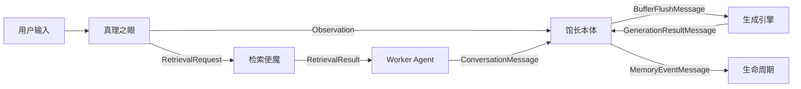

# HiveMemory 数据模型重构建议

**版本**: 1.0
**日期**: 2026-01-21
**作者**: HiveMemory Team
**状态**: 草案

---

## 1. 概述

本文档基于 `SystemArchitecture_v2.0.md` 和 `InternalProtocol_v2.0.md` 架构规划，对当前项目中的数据模型进行全面调研与分析，提出模块内部与模块间通信的数据模型改进建议。

### 1.1 调研范围

| 模块 | 模型文件 | 状态 |
|:---|:---|:---|
| **Gateway** | `engines/gateway/models.py` | 已实现，与协议基本一致 |
| **Perception** | `engines/perception/models.py` | 需优化 |
| **Generation** | `engines/generation/models.py` | 需补充 |
| **Retrieval** | `engines/retrieval/models.py` | 需整合 |
| **Lifecycle** | `engines/lifecycle/models.py` | 需扩展 |
| **Core** | `core/models.py` | 需精简 |
| **Config** | `patchouli/config.py` | 需整理 |

### 1.2 发现的主要问题

1. **模型冗余**: `ConversationMessage` 在多个模块中重复定义
2. **职责不清**: 数据模型包含过多业务逻辑（渲染、转换等）
3. **命名模糊**: 部分模型名称无法反映其真实职责
4. **协议偏离**: 部分模型与 `InternalProtocol_v2.0.md` 定义不一致
5. **缺少统一通信协议**: 模块间通信缺少标准化的消息封装

---

## 2. 各模块内部数据模型修改建议

### 2.2 Perception 模块

**当前文件**: `engines/perception/models.py`

#### 问题分析

**问题1**: `LogicalBlock` 包含 Gateway 相关字段，但结构不够清晰

```python
# 当前定义 - 字段分散
class LogicalBlock(BaseModel):
    user_block: Optional[StreamMessage] = None
    execution_chain: List[Triplet] = Field(default_factory=list)
    response_block: Optional[StreamMessage] = None
    # v2.0 新增字段混在后面
    rewritten_query: Optional[str] = None
    turn_id: Optional[str] = None
    gateway_intent: Optional[str] = None
    worth_saving: Optional[bool] = None
```

**问题2**: `StreamMessage.to_conversation_message()` 包含角色映射业务逻辑

```python
# 业务逻辑混入数据模型
def _get_role(self) -> str:
    mapping = { ... }  # 这应该是配置或服务层逻辑
```

#### 改进建议

```python
# 建议：将 Gateway 相关字段内聚为一个嵌套模型
class GatewayMetadata(BaseModel):
    """
    Gateway 元数据 - 由 Eye 填充，Core 消费

    遵循 InternalProtocol_v2.0.md 第 3 节
    """
    rewritten_query: Optional[str] = None
    turn_id: Optional[str] = None
    intent: Optional[GatewayIntent] = None
    should_preserve: Optional[bool] = None


class LogicalBlock(BaseModel):
    """
    逻辑原子块 - 语义流感知层的最小处理单元

    结构：
        1. gateway_meta: Gateway 解析结果（可选）
        2. user_block: 用户意图（必须）
        3. execution_chain: 执行链（可选）
        4. response_block: 最终响应（必须）
    """
    # 新增：内聚的 Gateway 元数据
    gateway_meta: Optional[GatewayMetadata] = None

    user_block: Optional[StreamMessage] = None
    execution_chain: List[Triplet] = Field(default_factory=list)
    response_block: Optional[StreamMessage] = None

    # 辅助方法保持不变
    @property
    def anchor_text(self) -> str:
        if self.gateway_meta and self.gateway_meta.rewritten_query:
            return self.gateway_meta.rewritten_query
        return self.user_block.content if self.user_block else ""
```

**问题3 建议**: 将角色映射逻辑抽取到独立的转换服务

```python
# 新文件: perception/converters.py
class MessageConverter:
    """消息转换服务 - 纯函数，无状态"""

    _ROLE_MAPPING = {
        StreamMessageType.USER_QUERY: "user",
        StreamMessageType.ASSISTANT_MESSAGE: "assistant",
        # ...
    }

    @classmethod
    def to_conversation_message(
        cls,
        stream_msg: StreamMessage,
        user_id: str,
        agent_id: str,
        session_id: str,
    ) -> ConversationMessage:
        """转换 StreamMessage 为 ConversationMessage"""
        return ConversationMessage(
            role=cls._ROLE_MAPPING.get(stream_msg.message_type, "assistant"),
            content=stream_msg.content,
            user_id=user_id,
            agent_id=agent_id,
            session_id=session_id,
            timestamp=datetime.fromtimestamp(stream_msg.timestamp),
        )
```

---

### 2.3 Generation 模型

**当前文件**: `engines/generation/models.py`

#### 问题分析

**问题1**: 模型过于简单，缺少记忆生成的中间状态

```python
# 当前只有 Draft 和 Decision，缺少中间产物
class ExtractedMemoryDraft(BaseModel):
    title: str
    summary: str
    # ...
```

**问题2**: 缺少 Flush 事件的标准模型（当前在 `librarian_core.py` 中定义）

```python
# 当前：FlushEvent 在 librarian_core.py 中定义为 dataclass
@dataclass
class FlushEvent:
    messages: List[ConversationMessage]
    reason: FlushReason
    memories: List[MemoryAtom]
    timestamp: float
```

#### 改进建议

```python
# 新增：记忆生成的中间产物模型
class MemoryGenerationContext(BaseModel):
    """
    记忆生成上下文 - 完整的生成流程状态

    用于追踪从原始对话到记忆原子的完整转换过程
    """
    # 输入
    source_messages: List[ConversationMessage]
    flush_reason: FlushReason

    # 中间状态
    drafts: List[ExtractedMemoryDraft] = Field(default_factory=list)
    duplicate_checks: List[str] = Field(default_factory=list)  # 检查的记忆ID

    # 输出
    created_memories: List[MemoryAtom] = Field(default_factory=list)
    updated_memories: List[MemoryAtom] = Field(default_factory=list)
    skipped_memories: List[str] = Field(default_factory=list)  # 跳过的原因

    # 元信息
    processing_time_ms: float = 0.0
    llm_calls: int = 0


# 将 FlushEvent 从 dataclass 迁移到 Pydantic
class FlushEvent(BaseModel):
    """
    Flush 事件 - 感知层到生成层的标准通信协议

    遵循 InternalProtocol_v2.0.md 第 5 节（幂等与一致性）
    """
    event_id: str = Field(default_factory=lambda: str(uuid4()))

    # 输入来源
    buffer_key: str  # 格式: "{user_id}:{agent_id}:{session_id}"
    messages: List[ConversationMessage]

    # 触发信息
    reason: FlushReason
    timestamp: datetime = Field(default_factory=datetime.now)

    # 幂等键（用于去重）
    idempotency_key: Optional[str] = None  # conversation_id:turn_id

    # Gateway 元数据（如果有）
    gateway_context: Optional[Dict[str, Any]] = None


# 新增：生成结果模型
class GenerationResult(BaseModel):
    """
    记忆生成结果 - 编排器返回的标准结构

    用于 LibrarianCore 处理 FlushEvent 后返回
    """
    event_id: str

    # 操作结果
    created: List[MemoryAtom] = Field(default_factory=list)
    updated: List[MemoryAtom] = Field(default_factory=list)
    touched: List[UUID] = Field(default_factory=list)  # 仅更新访问时间
    discarded: List[str] = Field(default_factory=list)  # 丢弃的理由

    # 统计
    total_drafts: int = 0
    processing_time_ms: float = 0.0

    @property
    def has_changes(self) -> bool:
        """是否有实质性变更"""
        return len(self.created) > 0 or len(self.updated) > 0
```

---

### 2.5 Core 模型

**当前文件**: `core/models.py`

#### 问题分析

**问题2**: `IndexLayer.get_embedding_text()` 和 `get_sparse_context()` 混合了数据定义和转换逻辑

#### 改进建议

```python
# 新文件: core/converters.py 或 infrastructure/embedding/text_builder.py

class MemoryTextBuilder:
    """
    记忆文本构建器 - 负责 MemoryAtom 到各种文本格式的转换

    职责：
    - 构建 Embedding 文本
    - 构建稀疏向量上下文
    - 构建 Prompt 注入文本
    """

    @staticmethod
    def build_embedding_text(memory: MemoryAtom) -> str:
        """构建用于 Embedding 的文本"""
        return (
            f"Title: {memory.index.title}\n"
            f"Type: {memory.index.memory_type.value}\n"
            f"Tags: {', '.join(memory.index.tags)}\n"
            f"Summary: {memory.index.summary}"
        )

    @staticmethod
    def build_sparse_context(memory: MemoryAtom) -> str:
        """构建稀疏向量上下文"""
        tags_string = " ".join(memory.index.tags)
        return (
            f"{memory.index.title} {memory.index.title} "
            f"{tags_string} {tags_string} "
            f"{memory.index.summary}"
        )

    @staticmethod
    def build_context_prompt(
        memory: MemoryAtom,
        format: RenderFormat = RenderFormat.XML,
        language: Language = Language.ENGLISH,
    ) -> str:
        """构建 Prompt 注入文本"""
        # 原来的 render_for_context 逻辑
        ...


# 精简后的 MemoryAtom
class MemoryAtom(BaseModel):
    """
    记忆原子 - 纯数据模型，无业务逻辑
    """
    id: UUID
    meta: MetaData
    index: IndexLayer
    payload: PayloadLayer
    relations: RelationLayer = Field(default_factory=RelationLayer)

    # 仅保留数据转换方法
    def to_qdrant_payload(self) -> Dict[str, Any]:
        """转换为 Qdrant Payload"""
        return {...}
```

---

## 3. 模块间通信协议建议

### 3.1 统一通信消息模型

**新增文件**: `core/protocols.py`

```python
"""
HiveMemory 模块间通信协议模型

基于 InternalProtocol_v2.0.md 定义，作为所有模块间通信的统一协议
"""

from enum import Enum
from typing import Optional, Dict, Any, List
from pydantic import BaseModel, Field
from datetime import datetime


class MessageType(str, Enum):
    """消息类型"""
    # Hot Path 消息
    RETRIEVAL_REQUEST = "retrieval_request"  # Eye -> Retrieval
    RETRIEVAL_RESULT = "retrieval_result"    # Retrieval -> Worker

    # Cold Path 消息
    OBSERVATION = "observation"              # Eye -> Core
    BUFFER_FLUSH = "buffer_flush"            # Core 内部 Generation
    GENERATION_RESULT = "generation_result"  # Generation -> Core

    # 生命周期消息
    MEMORY_EVENT = "memory_event"            # 任意 -> Lifecycle


class ProtocolMessage(BaseModel):
    """
    协议消息基类 - 所有模块间通信消息的统一封装

    特性：
    - 包含追踪信息（trace_id, span_id）
    - 包含时间戳
    - 支持类型检查
    """
    # 消息标识
    msg_type: MessageType
    msg_id: str = Field(default_factory=lambda: str(uuid4()))

    # 追踪信息
    trace_id: Optional[str] = None  # 全局追踪ID
    parent_span_id: Optional[str] = None  # 父级span

    # 时间信息
    timestamp: datetime = Field(default_factory=datetime.now)
    processing_time_ms: float = 0.0

    # 上下文信息
    context: Dict[str, Any] = Field(default_factory=dict)


# ========== Hot Path 协议 ==========

class RetrievalRequest(ProtocolMessage):
    """检索请求消息 - Eye/System -> RetrievalFamiliar"""
    msg_type: MessageType = MessageType.RETRIEVAL_REQUEST

    semantic_query: str
    keywords: List[str]
    filters: Dict[str, Any]
    top_k: int = 5
    user_id: str


class RetrievalResult(ProtocolMessage):
    """检索结果消息 - RetrievalFamiliar -> Worker"""
    msg_type: MessageType = MessageType.RETRIEVAL_RESULT

    memories: List[MemoryAtom]
    rendered_context: str
    memories_count: int


# ========== Cold Path 协议 ==========

class Observation(ProtocolMessage):
    """
    感知信号消息 - Eye -> LibrarianCore

    这是连接 Hot Path 和 Cold Path 的关键消息
    """
    msg_type: MessageType = MessageType.PERCEPTION_SIGNAL

    # 语义锚点
    anchor: str  # rewritten_query
    raw_message: str

    # 会话信息
    user_id: str
    agent_id: str
    session_id: str
    turn_id: Optional[str] = None


class BufferFlushMessage(ProtocolMessage):
    """
    Buffer Flush 消息 - Perception Layer -> Generation Orchestrator

    遵循 InternalProtocol_v2.0.md 第 5 节（幂等与一致性）
    """
    msg_type: MessageType = MessageType.BUFFER_FLUSH

    # 幂等键
    idempotency_key: str  # conversation_id:turn_id

    # 数据
    messages: List[ConversationMessage]
    flush_reason: FlushReason

    # Gateway 上下文（如果有）
    gateway_context: Optional[Dict[str, Any]] = None


class GenerationResultMessage(ProtocolMessage):
    """
    生成结果消息 - Generation Orchestrator -> LibrarianCore
    """
    msg_type: MessageType = MessageType.GENERATION_RESULT

    # 关联
    event_id: str  # 对应的 flush event ID

    # 结果
    created: List[MemoryAtom]
    updated: List[MemoryAtom]
    touched: List[str]  # memory IDs
    discarded: List[str]  # reasons

    # 统计
    total_drafts: int
    processing_time_ms: float
```

### 3.2 数据流向与模型映射

根据 `SystemArchitecture_v2.0.md` 的三位一体架构：



---

## 4. 迁移路径建议

### 阶段 1: 基础模型重构（低风险）

1. **创建 `engines/protocol/models.py`**
   - 定义统一的协议消息模型
   - 不修改现有代码，仅新增

2. **提取转换逻辑**
   - 创建 `core/converters.py`
   - 将 `MemoryAtom.render_for_context()` 迁移为 `MemoryTextBuilder`
   - 保留原方法作为委托（deprecated）

### 阶段 2: 模块内部优化（中风险）

1. **Gateway 模型**
   - `ContentPayload` → `SearchPayload`（保留别名）
   - `MemorySignal` → `PreservationDecision`（保留别名）

2. **Perception 模型**
   - 引入 `GatewayMetadata` 内聚 Gateway 字段
   - 将 `StreamMessage` 转换逻辑抽取到 `MessageConverter`

3. **Generation 模型**
   - 新增 `MemoryGenerationContext`
   - 将 `FlushEvent` 从 `librarian_core.py` 迁移到 `models.py`
   - 新增 `GenerationResult`

### 阶段 3: 协议统一（高风险）

1. **Retrieval 模块**
   - 直接复用 `SearchPayload`
   - 抽取 `FilterConverter`

2. **模块间通信**
   - 逐步使用 `ProtocolMessage` 封装
   - 更新 `PatchouliSystem` 使用新的协议

### 阶段 4: 清理与验证

1. 移除所有 deprecated 别名
2. 更新测试用例
3. 更新文档

---

## 5. 附录

### 5.1 当前模型依赖关系

```
core/models.py (MemoryAtom)
    ├── MetaData
    ├── IndexLayer
    ├── PayloadLayer
    │   └── Artifacts
    └── RelationLayer

engines/gateway/models.py
    ├── GatewayIntent (enum)
    ├── ContentPayload → 建议改名: SearchPayload
    ├── MemorySignal → 建议改名: PreservationDecision
    └── GatewayResult

engines/perception/models.py
    ├── StreamMessageType (enum)
    ├── StreamMessage
    ├── Triplet
    ├── LogicalBlock (包含 Gateway 字段)
    ├── BufferState (enum)
    ├── SemanticBuffer
    └── SimpleBuffer

engines/generation/models.py
    ├── ConversationMessage ← 重复定义!
    ├── ExtractedMemoryDraft
    └── DuplicateDecision (enum)

engines/retrieval/models.py
    ├── QueryFilters
    ├── RetrievalQuery ← 与 SearchPayload 重复
    ├── SearchResult
    ├── SearchResults
    ├── RenderFormat (enum)
    └── RetrievalResult

engines/lifecycle/models.py
    ├── EventType (enum)
    ├── ReinforcementResult
    ├── MemoryEvent
    ├── ArchiveStatus (enum)
    └── ArchiveRecord
```

### 5.2 待讨论的问题

1. **ConversationMessage 重复定义**
   - 当前在 `generation/models.py` 中定义
   - 被多个模块引用
   - 建议: 移至 `core/models.py` 或新建 `engines/protocol/common.py`

2. **FlushReason 位置**
   - 当前在 `core/models.py` 中定义
   - 仅被 Perception 模块使用
   - 建议: 移至 `engines/perception/models.py`

3. **枚举类型集中管理**
   - 建议将所有枚举集中到一个文件
   - 或按模块分组到各自的 `enums.py`

---

**文档结束**
