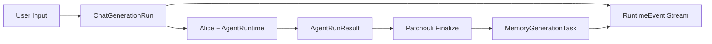

# v0.4.0 Runtime Control 涓庣郴缁熶簨浠惰娴嬪疄鐜拌鍒?

**鏂囨。鐘舵€?*: Draft
**閫傜敤鑼冨洿**: `system/application/chat_service.py`銆乣server/routers/chat.py`銆乣agent_runtime/`銆乣alice/runtime/`銆乣patchouli/service.py`銆乣patchouli/services/librarian.py`銆乣infrastructure/trace_context.py`銆乣infrastructure/log_handler.py`銆佸墠绔?chat/kernel runtime 闈㈡澘
**鏍稿績鐩爣**: v0.4.0 涓嶇户缁墿灞曞鏉傛櫤鑳戒綋鑳藉姏锛岃€屾槸琛ラ綈杩愯鏃舵帶鍒堕潰銆傞噸鐐逛氦浠樼鍒扮鍙栨秷璇箟銆佷富鍔ㄨ蹇嗙敓鎴愮殑鐙珛瑙傛祴涓庢帶鍒躲€佺郴缁熶簨浠舵祦 v1锛屼负鍚庣画 Gateway 涓婄Щ銆丮TP RUN銆佸鏅鸿兘浣?Phase 3 鎻愪緵鍙帶銆佸彲杩借釜銆佸彲鎭㈠鐨勮繍琛屾椂鍩虹銆?

---

## 1. 鐗堟湰瀹氫綅

v0.3.0 宸茬粡瀹屾垚浜嗚緝澶ц妯＄殑杩愯鏃惰竟鐣屾暣鐞嗭細

- `agent_runtime/` 宸叉垚涓哄崟 Agent 鎵ц寮曟搸鐨勭墿鐞嗚浇浣撱€?
- `AgentLoopExecutor` 宸叉敹鏁涗负鏇寸函绮圭殑 generate -> MTP -> return/suspend 寰幆銆?
- `AgentOrchestrator` 宸叉壙鎷?CALL銆佸瓙 Agent銆両PC 鍥炲～銆佺粨鏋滅粍瑁呯瓑缂栨帓鑱岃矗銆?
- `PendingAtomMaterializeTask` 宸蹭粠 Agent run 缁撴灉娴佸叆 Patchouli finalize锛屽啀瑙﹀彂涓诲姩璁板繂鐢熸垚銆?
- 鍓嶇 SSE 瀵硅瘽銆佸悗绔?`generation_id`銆乣cancel_event`銆佹棩蹇?trace grouping 宸插叿澶囧熀纭€褰㈡€併€?

浣嗚繖浜涜兘鍔涚幇鍦ㄤ粛鏈変竴涓叡鍚岄棶棰橈細**杩愯鏃剁姸鎬佽繕娌℃湁鎴愪负涓€绛夊叕姘?*銆傚彇娑堛€佸悗鍙拌蹇嗙敓鎴愩€佺郴缁熶簨浠躲€佹棩蹇楀睍绀恒€丼SE 鏂繛銆乫inalize 绛栫暐涔嬮棿缂哄皯缁熶竴濂戠害銆?

鍥犳 v0.4.0 鐨勪富棰樹笉鏄€滃鍔犳洿澶氭櫤鑳借涓衡€濓紝鑰屾槸锛?

> 灏嗕竴娆＄敤鎴蜂氦浜掑強鍏舵淳鐢熺殑璁板繂鐢熸垚浠诲姟锛屽缓妯′负鍙彇娑堛€佸彲瑙傛祴銆佸彲瀹¤銆佸彲娓呯悊鐨?runtime run/job銆?

鍚庣画鐗堟湰渚濊禆鍏崇郴锛?

| 鍚庣画鑳藉姏 | 涓轰粈涔堜緷璧?v0.4.0 |
| :--- | :--- |
| Gateway 涓婄Щ涓庡鍚堟剰鍥炬媶鍒?| 涓€涓緭鍏ュ彲鑳芥媶鎴愬涓笅娓镐换鍔★紝蹇呴』鍏堟湁缁熶竴 task/run 瑙傛祴涓庡彇娑堣涔?|
| MTP RUN executable asset | 鍙墽琛岃祫浜у繀椤昏兘琚腑鏂€佸璁°€佽拷韪潵婧?|
| Alice Phase 3 澶氭櫤鑳戒綋缂栨帓 | 澶?Agent 骞跺彂浼氭斁澶?cancel/trace/finalize 鐨勪笉涓€鑷?|
| 璁板繂鍒嗚涓庡悎骞?| 鐢熷懡鍛ㄦ湡浜嬩欢蹇呴』鍙拷韪紝鍚﹀垯闅句互鍥炴粴涓庤В閲?|

---

## 2. 鏈湡鐩爣涓庨潪鐩爣

### 2.1 鐩爣

1. **瀹屾暣鍙栨秷璇箟**
   - 鍓嶇 Stop銆丼SE 瀹㈡埛绔?abort銆佹祻瑙堝櫒鏂繛銆佸悗绔?`/chat/stop` 閮芥敹鏁涘埌鍚屼竴涓彇娑堟帶鍒堕潰銆?
   - 鍙栨秷淇″彿蹇呴』绌块€?ChatApplicationService銆丄lice Orchestrator銆丄gentLoopExecutor銆乄orkerAgent銆乻ub-agent frame銆丮TP 鎵ц杈圭晫銆丳atchouli finalize 绛栫暐銆?
   - 琚彇娑堢殑 run 涓嶅簲缁х画浜х敓璇鎬х殑鏈€缁堝洖绛旀垨榛樿瑙﹀彂闀挎湡璁板繂鐢熸垚銆?

2. **涓诲姩璁板繂鐢熸垚鐙珛杩愯鏃?*
   - `run_active_generation()` 浠?finalize 鐨勭洿鎺ヨ繃绋嬭皟鐢紝鍗囩骇涓哄彲瑙傛祴鐨?memory generation job銆?
   - 鍓嶇澧炲姞鐙珛绐楀彛灞曠ず鍚庡彴璁板繂鐢熸垚鐘舵€併€佷换鍔″垪琛ㄣ€乼race銆侀敊璇笌浜х墿銆?
   - 鏀寔鍗曠嫭鍙栨秷 memory generation job锛屼笉褰卞搷宸茬粡瀹屾垚鐨勫璇濆洖绛斻€?

3. **绯荤粺浜嬩欢瑙傛祴娴?v1**
   - 浠庘€滄崟鑾?logging namespace 骞跺睍绀衡€濆崌绾т负鈥滄棩蹇?+ domain event 鍙岄€氶亾鈥濄€?
   - 鏃ュ織缁х画鐢ㄤ簬璋冭瘯鏂囨湰锛宒omain event 鐢ㄤ簬鍓嶇鍙潬娓叉煋杩愯鏃剁姸鎬併€?
   - 淇鐢熶骇鐜涓嬭娴嬮潰鏉垮彲鑳芥棤娉曟樉绀虹殑闂銆?

4. **鍙獙璇佺殑杩愯鏃跺绾?*
   - 涓?cancel銆乵emory job銆乪vent stream 澧炲姞鍗曞厓娴嬭瘯銆侀泦鎴愭祴璇曞拰鍓嶇鐘舵€佹祴璇曘€?
   - 寤虹珛 v0.4.0 鐨勯獙鏀舵竻鍗曪紝閬垮厤鍙畬鎴愬眬閮ㄥ仠姝㈡寜閽€?

### 2.2 闈炵洰鏍?

鏈湡涓嶅仛浠ヤ笅宸ヤ綔锛?

- 涓嶄笂绉?TheEye/Gateway 鍒?System 绾с€?
- 涓嶅疄鐜板鍚堟剰鍥捐瘑鍒笌浠诲姟鎷嗗垎銆?
- 涓嶅疄鐜?MTP READ/RUN 鐗规畩缂栬瘧銆?
- 涓嶅疄鐜版柊鐨勫鏅鸿兘浣撶紪鎺掔瓥鐣ャ€?
- 涓嶅疄鐜拌蹇嗗垎瑁?鍚堝苟銆?
- 涓嶉噸鍐欑幇鏈夋棩蹇楃郴缁燂紱鏈湡鏄湪鏃ュ織閫氶亾鏃佸缓绔?domain event contract銆?

---

## 3. 褰撳墠鐜扮姸涓庨棶棰樻竻鍗?

### 3.1 宸插瓨鍦ㄧ殑鍙栨秷鑳藉姏

褰撳墠閾捐矾宸茬粡鍏峰鍩虹鍙栨秷淇″彿锛?

- `ChatApplicationService.chat_stream()` 鍒涘缓 `generation_id` 涓?`asyncio.Event`锛屽苟瀛樺叆 `_generation_events`銆?
- 鍓嶇 `stopStreaming()` 璋冪敤 `/api/v1/chat/stop` 鍚庝腑鏂?SSE client銆?
- `AgentLoopExecutor.execute_frame()` 鍦ㄥ惊鐜《閮ㄦ鏌?`cancel_event`銆?
- `WorkerAgentService.generate_stream()` 鍦ㄦ祦寮?chunk 杩唬涓鏌?`cancel_event`銆?
- Alice service/orchestrator 鐨勮嫢骞插叆鍙ｅ凡缁忔帴鏀?`cancel_event`銆?

杩欒鏄?v0.4.0 涓嶉渶瑕佷粠闆跺缓绔嬪彇娑堬紝鑰屾槸瑕佹妸鈥滃眬閮ㄤ腑鏂€濇彁鍗囦负鈥滅郴缁熻涔夆€濄€?

### 3.2 鍙栨秷閾捐矾缂哄彛

闇€瑕侀噸鐐硅ˉ榻愶細

| 缂哄彛 | 椋庨櫓 |
| :--- | :--- |
| SSE 瀹㈡埛绔柇杩炴病鏈夋樉寮忔槧灏勪负鍚庣 cancel | 鐢ㄦ埛鍏抽棴椤甸潰鍚庡悗绔彲鑳界户缁窇 Agent 鍜岃蹇嗙敓鎴?|
| 闈炴祦寮?chat 璺緞娌℃湁鍚岀瓑鍙栨秷鑳藉姏 | API 琛屼负涓嶄竴鑷?|
| 瀛?Agent / CALL 璺緞 cancel 浼犻€掗渶瑕侀€愭纭 | Stop 鍙兘鍙兘鍋滀富 frame锛屽瓙 frame 缁х画杩愯 |
| MTP 鎵ц鏈熼棿 cancel 妫€鏌ヤ笉鎴愪綋绯?| 宸ュ叿璋冪敤鎴栭暱姝ラ鍙兘寤惰繜鍝嶅簲鍙栨秷 |
| cancel 鍚庝粛鍙兘杩涘叆 finalize | 鍙兘鎶?partial output 鍜?pending atom 璇啓鍏ラ暱鏈熻蹇?|
| PendingAtom 缂哄皯 cancelled settlement | 鍓嶇/鍚庣鏃犳硶瑙ｉ噴 draft atom 涓轰粈涔堟病鏈夎惤搴?|
| SSE done 浜嬩欢鍙甫 `stopped` 甯冨皵鍊?| 鍓嶇缂哄皯绋冲畾鐘舵€佹満 |
| `_generation_events` 鏃犳竻鐞嗘満鍒?| 姝ｅ父瀹屾垚璺緞涓?dict 姘镐笉娓呯┖锛岄暱鏃堕棿杩愯鍚庡唴瀛樻硠婕?|
| Orchestrator/AgentLoopExecutor 鐨?`finally` 鍧楀湪姝ｅ父瀹屾垚鏃朵篃浼?set `cancel_event` | 姹℃煋澶栭儴浼犲叆鐨勫叡浜?cancel token锛屾甯稿畬鎴愯璇涓哄彇娑?|

### 3.3 涓诲姩璁板繂鐢熸垚鐜扮姸

v0.3.0 鍚庯紝涓诲姩璁板繂鐢熸垚宸茬粡浠庢棫 perception buffer 缁撶畻閾捐矾涓娊鍑猴細

1. Agent run 鏈熼棿浜х敓 pending atom materialize tasks銆?
2. `AgentOrchestrator` 缁勮 `AgentRunResult.materialize_tasks`銆?
3. `PatchouliService.finalize_agent_run()` 鍏堟彁浜ゆ湰杞?interaction锛屽啀璋冪敤 `LibrarianCore.run_active_generation()`銆?
4. `run_active_generation()` 鎸?task 璋冪敤 generation engine mode b/c锛屽苟鍙戝竷 pending atom settled/failed 浜嬩欢銆?

杩欎釜鏂瑰悜鏄纭殑锛屼絾褰撳墠浠嶆槸 finalize 鐨勭洿鎺ュ瓙杩囩▼銆傜敤鎴峰湪鍓嶇鐪嬪埌鐨勬槸鈥滃璇濈敓鎴愮粨鏉?鍋滄鈥濓紝鐪嬩笉鍒板悗鍙?memory generation 鐨勭嫭绔嬬姸鎬侊紝涔熶笉鑳藉崟鐙彇娑堛€?

### 3.4 瑙傛祴鐜扮姸

褰撳墠瑙傛祴闈富瑕佷緷璧栵細

- `trace_context.py` 閫氳繃 `contextvars` 娉ㄥ叆 `trace_id`銆乣span_name`銆乣task_type`銆?
- `WebSocketLogHandler` 鎸?namespace 鎹曡幏 logging record 骞惰浆鍙戝墠绔€?
- 鍓嶇 kernel store 鎸?`trace_id/span_name` 鍒嗙粍灞曠ず銆?

杩欏鏈哄埗閫傚悎璋冭瘯鏃ュ織锛屼絾涓嶉€傚悎鎵挎媴杩愯鏃剁姸鎬佸崗璁細

- 鏃ュ織鏂囨湰涓嶆槸绋冲畾 API銆?
- 鐢熶骇鐜 namespace銆乄ebSocket URL銆亀ebsocket disabled 鏃跺彲鑳藉鑷村睍绀虹己澶便€?
- 鍓嶇瑕佷粠鏃ュ織鎺ㄦ柇鈥滀换鍔″紑濮?缁撴潫/鍙栨秷/澶辫触鈥濓紝瀹规槗鑴嗗急銆?
- 鍚庡彴璁板繂鐢熸垚銆乸ending atom settlement銆乧ancel result 绛夌姸鎬佸簲璇ユ槸 domain event锛岃€屼笉鏄棩蹇楀壇浜у搧銆?

---

## 4. 鐩爣鏋舵瀯

### 4.1 涓夌被杩愯鏃跺璞?

v0.4.0 寮曞叆涓変釜娓呮櫚姒傚康锛?

| 瀵硅薄 | 鍚箟 | 鐢熷懡鍛ㄦ湡 |
| :--- | :--- | :--- |
| `ChatGenerationRun` | 涓€娆＄敤鎴疯緭鍏ヨЕ鍙戠殑鍓嶅彴 Agent 瀵硅瘽鐢熸垚 | SSE generation_id 鍒涘缓 -> Agent run -> finalize/skip finalize -> done |
| `MemoryGenerationTask` | 涓€缁?pending atom materialize tasks 瑙﹀彂鐨勫悗鍙拌蹇嗙敓鎴?| finalize 娲剧敓 -> generation mode b/c -> settled/failed/cancelled |
| `RuntimeEvent` | 闈㈠悜鍓嶇鍜岃皟璇曠郴缁熺殑绋冲畾鐘舵€佷簨浠?| run/job 鐢熷懡鍛ㄦ湡鍐呮寔缁彂甯?|

涓夎€呭叧绯伙細



### 4.2 鐘舵€佹灇涓?

#### ChatGenerationRunStatus

```python
class ChatGenerationRunStatus(str, Enum):
    CREATED = "created"
    PREPARING = "preparing"
    STREAMING = "streaming"
    FINALIZING = "finalizing"
    COMPLETED = "completed"
    CANCELLING = "cancelling"
    CANCELLED = "cancelled"
    FAILED = "failed"
```

#### MemoryGenerationTaskStatus

```python
class MemoryGenerationTaskStatus(str, Enum):
    QUEUED = "queued"
    RUNNING = "running"
    CANCELLING = "cancelling"
    CANCELLED = "cancelled"
    COMPLETED = "completed"
    PARTIAL_FAILED = "partial_failed"
    FAILED = "failed"
```

### 4.3 鍙栨秷灞傜骇

鍙栨秷蹇呴』鍖哄垎涓や釜灞傜骇锛?

| 鍙栨秷瀵硅薄 | 鍏ュ彛 | 鏁堟灉 |
| :--- | :--- | :--- |
| Chat generation cancel | `/chat/stop`銆丼SE disconnect銆佸墠绔?stop | 鍋滄涓诲璇?Agent run锛涢粯璁よ烦杩囨垨闄嶇骇 finalize锛涗笉鍐嶆淳鐢熸柊鐨?memory task |
| Memory generation cancel | 鏂板 memory task cancel API | 鍋滄鍚庡彴璁板繂鐢熸垚锛涗笉淇敼宸插畬鎴愮殑瀵硅瘽鍥炵瓟锛涙湭钀藉簱 pending atom 鏍囪 cancelled |

鍘熷垯锛?

- 鍙栨秷鍓嶅彴 chat run 涓嶅簲璇潃鍏跺畠宸插瓨鍦ㄧ殑鍚庡彴 memory tasks锛岄櫎闈炶繖浜?jobs 鐢辫 run 娲剧敓涓斿皻鏈紑濮嬶紝骞朵笖绛栫暐鏄庣‘涓?cascade銆?
- 鍙栨秷 memory task 涓嶅簲褰卞搷宸插畬鎴愮殑 assistant message銆?
- 鍚屼竴涓?cancel API 蹇呴』骞傜瓑锛氶噸澶嶅彇娑堣繑鍥炲綋鍓嶇姸鎬侊紝涓嶆姤閿欍€?

---

## 5. 鍚庣瀹炵幇瑙勫垝

### 5.1 Runtime Control Registry

鏂板杩愯鏃舵帶鍒舵敞鍐岃〃锛屽缓璁斁缃湪 `system/runtime/control.py` 鎴?`system/application/runtime_control.py`銆?

鑱岃矗锛?

- 淇濆瓨 active chat runs 涓?memory tasks銆?
- 绠＄悊 `asyncio.Event` cancel token銆?
- 鎻愪緵娉ㄥ唽銆佹煡璇€佸彇娑堛€佸畬鎴愩€佹竻鐞嗘帴鍙ｃ€?
- 鏀寔鎸?`trace_id`銆乣generation_id`銆乣task_id` 鏌ヨ銆?

绀轰緥鎺ュ彛锛?

```python
class RuntimeControlRegistry:
    def register_chat_run(self, run: ChatGenerationRun) -> None: ...
    def get_chat_run(self, generation_id: str) -> ChatGenerationRun | None: ...
    def cancel_chat_run(self, generation_id: str, reason: str) -> CancelResult: ...
    def complete_chat_run(self, generation_id: str, status: ChatGenerationRunStatus) -> None: ...

    def register_memory_task(self, job: MemoryGenerationTask) -> None: ...
    def get_memory_task(self, task_id: str) -> MemoryGenerationTask | None: ...
    def cancel_memory_task(self, task_id: str, reason: str) -> CancelResult: ...
    def list_memory_tasks(self, status: str | None = None) -> list[MemoryGenerationTask]: ...
```

绗竴闃舵鍙互鍏堜繚鎸佽繘绋嬪唴鍐呭瓨瀹炵幇銆傚悗缁嫢闇€瑕佽法杩涚▼鎭㈠锛屽啀鎸佷箙鍖栧埌 storage銆?

**瀹炵幇娉ㄦ剰**锛歊egistry 蹇呴』閫氳繃渚濊禆娉ㄥ叆鎸傚埌搴旂敤鐢熷懡鍛ㄦ湡涓婏紙濡?FastAPI 鐨?`lifespan` 鎴?DI 瀹瑰櫒锛夛紝鑰屼笉鑳戒綔涓烘ā鍧楃骇鍗曚緥锛坄_generation_events` 鐨勫綋鍓嶆ā寮忥級銆傛ā鍧楃骇鍗曚緥浼氬鑷存祴璇曢棿鐘舵€佹硠婕忥紝鏃犳硶闅旂銆?

### 5.2 ChatApplicationService 鏀归€?

`ChatApplicationService.chat_stream()` 闇€瑕佷粠鈥滃眬閮?dict 淇濆瓨 cancel_event鈥濆崌绾т负 run lifecycle owner銆?

鏀归€犵偣锛?

1. 鍒涘缓 `ChatGenerationRun`銆?
2. 鍙戝竷 `chat.run.created`銆?
3. prepare 鍓嶈繘鍏?`PREPARING`銆?
4. Alice stream 鍓嶈繘鍏?`STREAMING`銆?
5. 鎹曡幏 cancel 鐘舵€佸苟鍋滄缁х画鎺ㄨ繘銆?
6. 鏍规嵁 run status 鍐冲畾鏄惁 finalize銆?
7. 鏈€缁堝彂甯?`chat.run.completed` / `chat.run.cancelled` / `chat.run.failed`銆?
8. 娓呯悊 registry 涓殑 active run銆?

浼唬鐮侊細

```python
run = registry.create_chat_run(...)
await events.publish("chat.run.created", run.to_event())

try:
    await run.set_status(PREPARING)
    prepared = await bus.request(PATCHOULI_PREPARE_AGENT_RUN, ...)

    if run.cancelled:
        return cancelled_done()

    await run.set_status(STREAMING)
    loop_result = await bus.request(ALICE_RUN_AGENT_STREAM, cancel_event=run.cancel_event, ...)

    if loop_result.cancelled or run.cancelled:
        await maybe_record_cancelled_transcript(...)
        return cancelled_done()

    await run.set_status(FINALIZING)
    finalize_result = await bus.request(PATCHOULI_FINALIZE_AGENT_RUN, ...)
    return completed_done(finalize_result)
finally:
    registry.close_chat_run(run.generation_id)
```

### 5.3 SSE 鏂繛鏄犲皠涓?cancel

`server/routers/chat.py` 鐨?`event_generator()` 闇€瑕佹鏌?request disconnect銆?

瑕佹眰锛?

- 瀹㈡埛绔柇杩炴椂璋冪敤 `cancel_chat_run(generation_id, reason="client_disconnected")`銆?
- 濡傛灉鏂繛鍙戠敓鍦?generation_id 鍙戠粰鍓嶇涔嬪墠锛屼篃蹇呴』鑳藉彇娑堝綋鍓?run銆?
- route 灞備笉瑕佸悶鎺?`CancelledError` 鍚庤鍚庡彴浠诲姟缁х画璺戙€?

寤鸿锛?

- `chat_stream()` 鎺ユ敹涓€涓?`is_disconnected` callback锛屾垨 route 灞?wrap async iterator銆?
- `ChatApplicationService` 鍐呴儴鎸佹湁 run 鍚庯紝route 灞傚彲浠ラ€氳繃 run handle 鍙栨秷銆?
- 濡傛灉瀹炵幇澶嶆潅锛屽厛鍦?service 鐨?async generator 姣忔 yield 鍓嶅悗妫€鏌?`await request.is_disconnected()`銆?

### 5.4 AgentRuntime / Alice cancel contract

闇€瑕侀€愬眰纭骞惰ˉ榻?`cancel_event`锛?

| 灞?| 瑕佹眰 |
| :--- | :--- |
| `AliceService.run_agent_stream` | 蹇呴』灏?cancel_event 浼犲叆 orchestrator |
| `AgentOrchestrator.run_agent_stream` | 涓?frame銆乻ub frame銆丆ALL resume 鍧囦紶閫掑悓涓€涓?token |
| `_handle_suspend` / sub-agent execution | 瀛?Agent 鎵ц蹇呴』鍝嶅簲鍚屼竴涓?token |
| `AgentRuntime.run_frame_emitting` | 鎺ユ敹骞惰浆鍙戠粰 `AgentLoopExecutor` |
| `AgentLoopExecutor.execute_frame` | 姣忚疆 generate 鍓嶃€丮TP 鍓嶅悗銆丼USPEND 杩斿洖鍓嶆鏌?|
| `WorkerAgentService.generate_stream` | chunk 杩唬涓鏌ワ紝鍙栨秷鏃惰繑鍥?cancelled finish reason |
| `MTPRuntime.intercept_and_execute` | 闀胯€楁椂宸ュ叿鎵ц鍓嶅悗妫€鏌ワ紱鏃犳硶鎶㈠崰鐨勫伐鍏疯嚦灏戝湪杩斿洖鍚庣珛鍗冲仠姝㈠悗缁?loop |

鏂板绾﹀畾锛?

```python
class AgentRunResult(BaseModel):
    status: AgentRunStatus
    final_text: str = ""
    cancelled_reason: str | None = None
    materialize_tasks: list[PendingAtomMaterializeTask] = []
```

鍙栨秷鏃讹細

- `status = CANCELLED`
- `materialize_tasks` 淇濈暀鍘熷鍒楄〃锛屼絾姣忎釜 task 鎼哄甫 `cancelled` settlement intent锛屼笉寰楅粯璁よЕ鍙?generation銆傝繖鏍峰墠绔?Memory Runtime Window 鑳芥纭睍绀?杩欐壒 atoms 鍥犲彇娑堣€屾湭钀藉簱"锛岃€屼笉鏄嚟绌烘秷澶便€?
- `final_text` 鍙互淇濈暀 partial text 缁?UI锛屼絾涓嶅緱浣滀负瀹屾暣 assistant answer 杩涘叆闀挎湡璁板繂銆?

### 5.5 Finalize 绛栫暐

v0.4.0 蹇呴』鏄庣‘ finalize 鏄惁鎵ц銆?

鎺ㄨ崘绛栫暐锛?

| 鍦烘櫙 | submit_interaction | run_active_generation | 璇存槑 |
| :--- | :---: | :---: | :--- |
| 姝ｅ父瀹屾垚 | 鏄?| 鏄?| 褰撳墠琛屼负 |
| 鐢ㄦ埛鍙栨秷锛屾湭浜х敓 assistant partial | 鍚?| 鍚?| 涓嶄骇鐢熼暱鏈熻蹇?|
| 鐢ㄦ埛鍙栨秷锛屽凡鏈?partial output | 鍙厤缃紝榛樿鍚?| 鍚?| 閬垮厤 partial 姹℃煋璁板繂 |
| Agent 宸插畬鎴愶紝finalize 鏈熼棿鍙栨秷 | 鏄?| 鍙栨秷/璺宠繃鏈紑濮?memory task | 瀵硅瘽鍙繚鐣欙紝璁板繂鐢熸垚鍙嫭绔嬪彇娑?|
| memory task 鍗曠嫭鍙栨秷 | 涓嶅奖鍝?| 鍋滄璇?job | pending atom 鏍囪 cancelled |

绗竴鐗堝缓璁厤缃」锛?

```yaml
runtime:
  cancellation:
    persist_cancelled_transcript: true
    cancelled_transcript_as_memory_source: false
    cascade_cancel_pending_memory_tasks: true
```

`persist_cancelled_transcript` 鍙〃绀轰繚鐣?raw transcript 鎴栬皟璇?artifact锛屼笉琛ㄧず鍐欓暱鏈熻蹇嗐€?

### 5.6 MemoryGenerationTask

`PatchouliService.finalize_agent_run()` 涓嶅啀鐩存帴鎶?`materialize_tasks` 浜ょ粰 `run_active_generation()` 骞堕樆濉炲埌缁撴潫锛岃€屾槸鍒涘缓 job銆?

绗竴闃舵鍙互鍏堝悓姝ユ墽琛?job锛屼絾蹇呴』宸茬粡鍏峰 job 鐘舵€佷笌 cancel token锛?

```python
job = MemoryGenerationTask(
    task_id=...,
    source_generation_id=...,
    trace_id=...,
    tasks=loop_result.materialize_tasks,
    status=QUEUED,
    cancel_event=asyncio.Event(),
)
registry.register_memory_task(job)
await memory_task_runner.run(job)
```

绗簩闃舵鍐嶆妸 job runner 鏀规垚鍚庡彴 task / queue銆?

`LibrarianCore.run_active_generation()` 鏀归€犺姹傦細

- 鎺ユ敹 `task_id`銆乣cancel_event`銆乣source_generation_id`銆?
- 姣忎釜 task 寮€濮嬪墠妫€鏌?cancel銆?
- 姣忎釜 atom settled/failed/cancelled 鍙戝竷 RuntimeEvent銆?
- 鍙栨秷鏃跺鏈鐞?tasks 浜х敓 cancelled settlement event銆?
- 涓嶅啀鍙潬 logging 琛ㄨ揪杩涘害銆?

### 5.7 Memory task API

鏂板鍚庣 API锛?

| API | 鏂规硶 | 璇存槑 |
| :--- | :--- | :--- |
| `/api/v1/memory-tasks` | GET | 鍒楀嚭鏈€杩?娲昏穬 memory generation jobs |
| `/api/v1/memory-tasks/{task_id}` | GET | 鏌ヨ job 璇︽儏 |
| `/api/v1/memory-tasks/{task_id}/cancel` | POST | 鍙栨秷鎸囧畾 job |

濡傛灉鏆備笉鏂板 router锛屼篃鍙厛鎸傚湪鐜版湁 memory/kernel API 涓嬶紝浣嗗懡鍚嶄笂搴斾繚鐣?`job` 姒傚康銆?

---

## 6. 绯荤粺浜嬩欢娴?v1

### 6.1 浜嬩欢涓庢棩蹇楀垎灞?

v0.4.0 鍚庡墠绔繍琛屾椂鐘舵€佸繀椤讳緷璧?RuntimeEvent锛岃€屼笉鏄В鏋愭棩蹇椼€?

| 閫氶亾 | 鐢ㄩ€?| 绋冲畾鎬?|
| :--- | :--- | :--- |
| RuntimeEvent | run/job 鐢熷懡鍛ㄦ湡銆佺姸鎬佹満銆佽繘搴︺€佸彇娑堛€佸け璐ャ€佷骇鐗╁紩鐢?| 绋冲畾 API |
| Log stream | 浜虹被璋冭瘯鏂囨湰銆佸紓甯稿爢鏍堛€佺粍浠跺唴閮ㄧ粏鑺?| 闈炵ǔ瀹?API |

鏃ュ織鍙互鎼哄甫 `trace_id`锛屼絾涓嶅啀鎵挎媴鈥滀换鍔℃槸鍚﹀畬鎴愨€濈殑鍞竴浜嬪疄鏉ユ簮銆?

### 6.2 RuntimeEvent 鏁版嵁缁撴瀯

寤鸿鏂板 `system/contracts/runtime_events.py`銆?

```python
class RuntimeEventType(str, Enum):
    CHAT_RUN_CREATED = "chat.run.created"
    CHAT_RUN_STATUS = "chat.run.status"
    CHAT_RUN_CANCEL_REQUESTED = "chat.run.cancel_requested"
    CHAT_RUN_CANCELLED = "chat.run.cancelled"
    CHAT_RUN_COMPLETED = "chat.run.completed"
    CHAT_RUN_FAILED = "chat.run.failed"

    AGENT_FRAME_STARTED = "agent.frame.started"
    AGENT_FRAME_SUSPENDED = "agent.frame.suspended"
    AGENT_FRAME_COMPLETED = "agent.frame.completed"
    AGENT_FRAME_CANCELLED = "agent.frame.cancelled"

    MEMORY_JOB_CREATED = "memory.task.created"
    MEMORY_JOB_STATUS = "memory.task.status"
    MEMORY_JOB_CANCEL_REQUESTED = "memory.task.cancel_requested"
    MEMORY_JOB_CANCELLED = "memory.task.cancelled"
    MEMORY_JOB_COMPLETED = "memory.task.completed"
    MEMORY_JOB_FAILED = "memory.task.failed"

    MEMORY_ATOM_SETTLED = "memory.atom.settled"
    MEMORY_ATOM_FAILED = "memory.atom.failed"
    MEMORY_ATOM_CANCELLED = "memory.atom.cancelled"
```

缁熶竴 payload锛?

```python
class RuntimeEvent(BaseModel):
    event_id: str
    event_type: RuntimeEventType
    timestamp: datetime
    trace_id: str
    span_name: str | None = None
    task_type: Literal["foreground", "background"]

    generation_id: str | None = None
    task_id: str | None = None
    agent_id: str | None = None
    frame_id: str | None = None
    topic_id: str | None = None
    atom_id: str | None = None

    status: str | None = None
    reason: str | None = None
    message: str | None = None
    data: dict[str, Any] = Field(default_factory=dict)
```

### 6.3 浜嬩欢鍙戝竷鏂瑰紡

浼樺厛澶嶇敤 `GlobalSystemBus.publish()`銆?

寤鸿鏂板鍏ㄥ眬浜嬩欢鍚嶏細

```python
class GlobalEvents:
    RUNTIME_EVENT = "system.runtime.event"
```

鎵€鏈?domain event 缁熶竴 publish 鍒?`system.runtime.event`锛屽墠绔?WebSocket/SSE gateway 鍙闃呰繖涓€绫伙紝鍐嶆寜 `event_type` 鍒嗗彂銆?

杩欐瘮涓烘瘡涓?event type 鍗曠嫭寮€ bus subscription 鏇撮€傚悎鍓嶇娴佸紡娑堣垂銆?

### 6.4 鍓嶇璁㈤槄鏂瑰紡

褰撳墠宸叉湁 WebSocket log stream銆倂0.4.0 鏈変袱涓€夋嫨锛?

1. **鎵╁睍鐜版湁 WebSocket**锛氬湪 message 涓鍔?`kind: "log" | "event"`銆?
2. **鏂板 RuntimeEvent WebSocket/SSE**锛氭棩蹇楀拰浜嬩欢瀹屽叏鍒嗙銆?

**閮ㄧ讲鍋囪**锛氶」鐩綋鍓嶅強浠婂悗杈冮暱鏃堕棿鍐呬负鍗曠敤鎴锋湰鍦伴儴缃诧紝WebSocket 骞挎挱涓嶉渶瑕?per-client 杩囨护銆傝嫢鏈潵寮曞叆澶氱敤鎴锋垨澶?tab 闅旂鍦烘櫙锛屽啀鎸?`session_id` / `generation_id` 澧炲姞杩囨护灞傘€?

鎺ㄨ崘绗竴闃舵閲囩敤鏂规 1锛岄檷浣庤繛鎺ユ暟閲忎笌鍓嶇鎺ュ叆鎴愭湰锛涗絾鍓嶇 store 鍐呴儴蹇呴』鍒嗕负 `logs` 涓?`runtimeEvents` 涓や釜 reducer銆?

娑堟伅鏍煎紡锛?

```json
{
  "kind": "event",
  "event": {
    "event_id": "evt_...",
    "event_type": "memory.task.status",
    "trace_id": "stream_...",
    "task_type": "background",
    "task_id": "memjob_...",
    "status": "running",
    "message": "Generating memory atom 1/3"
  }
}
```

### 6.5 鐢熶骇鐜瑙傛祴淇

鏈湡蹇呴』瑙ｅ喅锛?

- WebSocket URL 涓嶅簲纭紪鐮佸紑鍙戠鍙ｃ€?
- 鐢熶骇鏋勫缓搴斿熀浜庡綋鍓?origin 鎴栧悗绔厤缃敓鎴?WS endpoint銆?
- websocket disabled 鏃跺悗绔笉搴?500锛屽簲杩斿洖鏄庣‘鐘舵€佹垨鍓嶇灞曠ず disabled銆?
- 鍓嶇 connection state 蹇呴』鍙锛歚connecting`銆乣connected`銆乣disconnected`銆乣disabled`銆乣error`銆?
- 鏃ュ織 namespace 閰嶇疆閿欒涓嶅簲褰卞搷 RuntimeEvent 灞曠ず銆?

---

## 7. 鍓嶇瀹炵幇瑙勫垝

### 7.1 Chat stop 鐘舵€佹満

鍓嶇 `chatStore` 闇€瑕佷粠 `isStreaming: boolean` 鎵╁睍涓鸿繍琛岀姸鎬侊細

```ts
type ChatRunStatus =
  | 'idle'
  | 'preparing'
  | 'streaming'
  | 'cancelling'
  | 'cancelled'
  | 'finalizing'
  | 'completed'
  | 'failed'
```

Stop 鎸夐挳琛屼负锛?

- `streaming` / `preparing` / `finalizing` 鏃跺彲鐐瑰嚮銆?
- 鐐瑰嚮鍚庣珛鍗宠繘鍏?`cancelling`锛屾寜閽?disabled 鎴栨樉绀哄彇娑堜腑銆?
- 鏀跺埌 `chat.run.cancelled` 鍚庤繘鍏?`cancelled`銆?
- 濡傛灉鍚庣杩斿洖 run 宸插畬鎴愶紝鍒欒繘鍏?`completed`锛屼笉鏄剧ず閿欒銆?

### 7.2 Memory Runtime Window

鏂板涓€涓墠绔獥鍙ｆ垨 KernelTerminal 鍐呯殑鐙珛 tab锛歚Memory Runtime`銆?

鏈€灏忓睍绀猴細

- active memory tasks 鍒楄〃銆?
- job 鐘舵€侊細queued/running/cancelling/cancelled/completed/failed銆?
- 鏉ユ簮锛歴ource generation id銆乼race id銆乼opic id銆乸ending aliases銆?
- 杩涘害锛氬凡澶勭悊 tasks / 鎬?tasks銆?
- 姣忎釜 task 鐨?settled/failed/cancelled 缁撴灉銆?
- 鍗?job Cancel 鎸夐挳銆?

涓嶈姹傛湰鏈熷仛澶嶆潅鍙鍖栵紝浣嗚璁╃敤鎴锋槑纭煡閬擄細

> 瀵硅瘽鐢熸垚缁撴潫鍚庯紝鍚庡彴鏄惁浠嶅湪鐢熸垚璁板繂锛涘鏋滆繕鍦ㄧ敓鎴愶紝鏄摢涓€鎵逛换鍔★紱鑳藉惁鍋滄銆?

### 7.3 KernelTerminal 璋冩暣

鐜版湁 KernelTerminal 缁х画灞曠ず鏃ュ織锛屼絾澧炲姞 Runtime Events 瑙嗗浘鎴栨贩鍚堣鍥撅細

- Logs锛氭寜 trace/span 灞曠ず鏂囨湰鏃ュ織銆?
- Events锛氭寜 run/job 灞曠ず缁撴瀯鍖栫姸鎬併€?
- 瀵瑰悓涓€ `trace_id`锛屽厑璁镐粠 event 璺宠浆鍒?logs銆?

### 7.4 SSE 浜嬩欢鍏煎

褰撳墠 chat SSE 浠嶄繚鐣欙細

- `generation_id`
- `token` / message chunk
- `done`
- `error`

鏂板鎴栨墿灞曪細

```json
{
  "event": "run_status",
  "data": {
    "generation_id": "...",
    "status": "cancelling"
  }
}
```

`done` 浜嬩欢閲囩敤涓ゆ鍙戦€侊紙鏂规 B锛夛細

**绗竴姝?*锛欰gent run 缁撴潫銆佽繘鍏?finalize 鏃讹紝鍙戝嚭 `status=finalizing`锛?

```json
{
  "event": "run_status",
  "data": {
    "generation_id": "...",
    "status": "finalizing"
  }
}
```

**绗簩姝?*锛歠inalize 瀹屾垚銆乵emory job 鍒涘缓骞舵敞鍐屽悗锛屽彂鍑烘渶缁?`done` 浜嬩欢锛?

```json
{
  "generation_id": "...",
  "status": "completed",
  "stopped": false,
  "reason": null,
  "memory_task_ids": ["memjob_..."]
}
```

鍙栨秷璺緞涓嬬殑 `done`锛?

```json
{
  "generation_id": "...",
  "status": "cancelled",
  "stopped": true,
  "reason": "user_requested",
  "memory_task_ids": []
}
```

杩欐牱 `done` 涓殑 `memory_task_ids` 鏄湡瀹炲彲鐢ㄧ殑 job id锛岃€屼笉鏄┖鍒楄〃鎴栧皻鏈瓨鍦ㄧ殑 id銆?

---

## 8. 鍒嗛樁娈靛疄鏂借鍒?

### Phase 1: Cancel contract hardening

鐩爣锛氬墠鍙?chat generation 鑳藉彲闈犲仠姝€?

浠诲姟锛?

1. 寮曞叆 `ChatGenerationRunStatus` / `AgentRunStatus` 鐨?cancelled 鐘舵€併€?
2. 灏?`_generation_events` 鏇挎崲鎴栧寘瑁逛负 `RuntimeControlRegistry`銆?
3. `/chat/stop` 鏀逛负骞傜瓑 cancel result銆?
4. SSE disconnect 鏄犲皠涓?cancel銆?
5. 纭 cancel_event 璐┛ Alice orchestrator 涓?瀛?frame銆?
6. Worker stream cancelled finish reason 缁熶竴涓婃姏涓?AgentRunResult cancelled銆?
7. cancel 鍚庨粯璁よ烦杩?`run_active_generation()`銆?
8. SSE done 杩斿洖绋冲畾 `status/reason/stopped`銆?

楠屾敹锛?

- 鐢熸垚涓偣鍑?Stop锛屽悗绔?LLM stream 鍋滄銆?
- sub-agent CALL 涓偣鍑?Stop锛屼富/瀛?frame 閮藉仠姝€?
- Stop 鍚庝笉浜х敓鏂扮殑 memory atom銆?
- 閲嶅 Stop 涓嶆姤閿欍€?
- 鍏抽棴娴忚鍣ㄨ繛鎺ュ悗鍚庣涓嶇户缁窇璇?generation銆?

### Phase 2: MemoryGenerationTask runtime

鐩爣锛氫富鍔ㄨ蹇嗙敓鎴愬彲瑙併€佸彲鍙栨秷锛屼笖瀵硅瘽瀹屾垚鍚庣珛鍗宠繑鍥?done锛岃蹇嗗湪鍚庡彴鐙珛杩愯銆?

**瀹炵幇璇存槑**锛歫ob 鍖呰涓庡紓姝ュ悗鍙版墽琛屽繀椤诲悓姝ュ畬鎴愶紝涓嶆媶涓ゆ銆傚師鍥狅細鍚屾绛夊緟 job 瀹屾垚鍐嶅彂 done 浼氬鑷村墠绔?Memory Runtime Window 鎵撳紑鏃?job 宸茬粨鏉燂紝cancel 鎸夐挳鏃犲疄闄呮剰涔夛紝Phase 2 鐨勬牳蹇冪敤鎴蜂环鍊硷紙"瀵硅瘽宸插畬鎴愶紝璁板繂鍦ㄥ悗鍙?锛夋棤娉曚綋鐜般€俙asyncio.create_task()` 鏈韩骞朵笉澶嶆潅锛宩ob 瀵硅薄涓?cancel 璇箟鎵嶆槸鐪熸鐨勮璁″伐浣滐紝鏃犺鍚屾寮傛閮介渶瑕佸畬鎴愩€傚悗鍙?task 鐨勫紓甯稿繀椤诲湪 done callback 涓崟鑾峰苟鍙戝嚭 `memory.task.failed` 浜嬩欢銆?

浠诲姟锛?

1. 瀹氫箟 `MemoryGenerationTask` 妯″瀷銆?
2. `finalize_agent_run()` 鍒涘缓 job 骞舵敞鍐岋紝`asyncio.create_task()` 鍚姩鍚庡彴鎵ц锛岄殢鍗宠繑鍥烇紙涓?await锛夈€?
3. `run_active_generation()` 鎺ユ敹 job context 涓?cancel_event锛涙瘡涓?task 寮€濮嬪墠妫€鏌?cancel锛涘紓甯搁€氳繃 `memory.task.failed` 浜嬩欢涓婃姤銆?
4. 澧炲姞 memory task list/detail/cancel API銆?
5. 瀵规瘡涓?materialize task 鍙戝竷 status/settled/failed/cancelled event銆?
6. 鍓嶇鏂板 Memory Runtime window銆?

楠屾敹锛?

- 涓€娆?MTP WRITE/UPDATE 鍚庯紝鍓嶇鑳界湅鍒?memory task銆?
- memory task 杩涜涓彲鍗曠嫭 cancel銆?
- cancel memory task 涓嶅奖鍝嶅凡瀹屾垚 assistant message銆?
- 鏈鐞?pending atoms 鏈?cancelled 鐘舵€佹垨 cancelled event銆?

### Phase 3: RuntimeEvent stream v1

鐩爣锛氬墠绔繍琛屾椂鐘舵€佷笉鍐嶄緷璧栨棩蹇楁枃鏈帹鏂€?

浠诲姟锛?

1. 鏂板 `RuntimeEvent` contract銆?
2. 鏂板 `GlobalEvents.RUNTIME_EVENT`銆?
3. Chat run銆丄gent frame銆丮emory job 鍙戝竷鏍稿績浜嬩欢銆?
4. WebSocket manager 鏀寔 `kind=event` 娑堟伅銆?
5. 鍓嶇 kernel store 鍒嗙 logs/events銆?
6. 淇鐢熶骇 WebSocket 杩炴帴鍜?disabled 鐘舵€佸鐞嗐€?

楠屾敹锛?

- 鍏抽棴鏃ュ織 namespace锛屽墠绔粛鑳藉睍绀?chat run 鍜?memory task 鐘舵€併€?
- 鍚庣 websocket disabled 鏃跺墠绔樉绀?disabled锛岃€屼笉鏄┖鐧芥垨鏃犻檺閲嶈繛銆?
- 鐢熶骇鏋勫缓浣跨敤姝ｇ‘ WS URL銆?

### Phase 4: Tests and release hardening

鐩爣锛氭妸 v0.4.0 琛屼负鍥哄寲涓哄洖褰掑熀绾裤€?

浠诲姟锛?

1. 鍗曞厓娴嬭瘯 cancel registry銆?
2. 鍗曞厓娴嬭瘯 AgentLoop cancel銆?
3. 闆嗘垚娴嬭瘯 chat stream stop銆?
4. 闆嗘垚娴嬭瘯 sub-agent cancel銆?
5. 闆嗘垚娴嬭瘯 finalize skip memory generation銆?
6. 闆嗘垚娴嬭瘯 memory task cancel銆?
7. 鍓嶇 store reducer 娴嬭瘯銆?
8. 鏂囨。鏇存柊 `ROADMAP.md` / `TODO.md` 涓?v0.4.0 鐘舵€併€?

---

## 9. 娴嬭瘯鐭╅樀

| 娴嬭瘯 | 绫诲瀷 | 鏈熸湜 |
| :--- | :--- | :--- |
| stop before first token | integration | run -> cancelled锛宯o memory task |
| stop during worker stream | integration | worker returns cancelled锛孲SE done status cancelled |
| stop during MTP execution | unit/integration | MTP 鍚庣画 loop 涓嶇户缁紝run cancelled |
| stop during CALL sub-agent | integration | main/sub frame 閮?cancelled |
| client disconnect | integration | service cancel_event set锛宎ctive run 娓呯悊 |
| repeated stop | unit | 骞傜瓑杩斿洖 cancelled/cancelling |
| cancelled run finalize | integration | 榛樿涓嶈皟鐢?active generation |
| memory task cancel queued | unit | job cancelled锛宼asks cancelled |
| memory task cancel running | integration | 褰撳墠 task 鍚庡仠姝紝鍓╀綑 tasks cancelled |
| runtime event stream without logs | frontend/integration | 鍓嶇浠嶅睍绀虹姸鎬?|
| websocket disabled | frontend/integration | 鍓嶇鏄剧ず disabled |

---

## 10. 鍏煎鎬т笌杩佺Щ绛栫暐

### 10.1 API 鍏煎

- `/api/v1/chat/stop` 淇濈暀銆?
- 璇锋眰鍙傛暟 `generation_id` 淇濈暀銆?
- 鍝嶅簲浠庣畝鍗?bool 鎵╁睍涓虹粨鏋勫寲缁撴灉锛?

```json
{
  "generation_id": "...",
  "cancelled": true,
  "status": "cancelling",
  "reason": "user_requested"
}
```

鍓嶇鍙吋瀹规棫瀛楁 `cancelled`銆?

### 10.2 SSE 鍏煎

鍘熸湁 token 娴佷笉鍙樸€傛柊澧炰簨浠朵笉搴旂牬鍧忔棫鍓嶇锛涙棫鍓嶇蹇界暐鏈煡浜嬩欢鍗冲彲銆?

### 10.3 鏃ュ織鍏煎

淇濈暀 `WebSocketLogHandler`銆俁untimeEvent 鏄柊澧炰簨瀹為€氶亾锛屼笉鍒犻櫎鏃ュ織閫氶亾銆?

### 10.4 閰嶇疆鍏煎

鏂板閰嶇疆蹇呴』鏈変繚瀹堥粯璁ゅ€硷細

- 榛樿鍚敤 chat cancel銆?
- 榛樿鍚敤 runtime event stream銆?
- 榛樿鍙栨秷 run 鍚庝笉鐢熸垚闀挎湡璁板繂銆?
- 榛樿淇濈暀鏃ュ織閫氶亾銆?

---

## 11. 椋庨櫓涓庡喅绛栫偣

### 11.1 鏄惁寮傛鍚庡彴鎵ц memory task

鏈湡鎺ㄨ崘涓ゆ璧帮細

1. 鍏堟妸 memory generation 鍖呮垚 job锛屼絾浠嶅彲鍚屾绛夊緟鎵ц瀹屾垚銆?
2. 鍐嶅垏鍒板悗鍙?task/queue銆?

鍘熷洜锛歫ob 鐘舵€佷笌 cancel contract 鏄繀椤荤殑锛涙槸鍚﹀悗鍙板紓姝ユ槸鎵ц绛栫暐銆傚厛鎷嗗绾︼紝鍐嶆敼璋冨害锛岄闄╂洿浣庛€?

### 11.2 宸茬粡 partial 杈撳嚭鐨?cancelled run 鏄惁淇濆瓨

寤鸿锛?

- raw transcript 鍙繚瀛橈紝鐢ㄤ簬璋冭瘯鍜屽悗缁暟鎹紑鍙戙€?
- 榛樿涓嶄綔涓洪暱鏈熻蹇嗙敓鎴愭潵婧愩€?
- UI 涓婃爣璁颁负 cancelled partial锛岃€屼笉鏄?assistant 瀹屾暣鍥炵瓟銆?

### 11.3 MTP 宸ュ叿璋冪敤鑳藉惁寮烘姠鍗?

Python async 鏃犳硶鍙潬寮烘潃浠绘剰鍚屾宸ュ叿銆倂0.4.0 鐨勬渶浣庤姹傛槸锛?

- 杩涘叆宸ュ叿鍓嶆鏌?cancel銆?
- 宸ュ叿杩斿洖鍚庣珛鍗虫鏌?cancel銆?
- 瀵规敮鎸?async/cancellable 鐨勫伐鍏蜂紶鍏?cancel token銆?
- 瀵逛笉鍙姠鍗犲伐鍏峰湪鏂囨。涓爣璁颁负 non-preemptive銆?

鍚庣画 MTP RUN sandbox 鍐嶈В鍐虫洿寮虹殑鎵ц涓柇銆?

### 11.4 RuntimeEvent 鏄惁鎸佷箙鍖?

v0.4.0 榛樿涓嶈姹傛寔涔呭寲鎵€鏈変簨浠躲€傚彧瑕佹眰锛?

- active run/job 鍦ㄥ唴瀛樺彲鏌ヨ銆?
- 鏈€杩?N 鏉′簨浠跺彲鍦ㄥ墠绔細璇濆唴灞曠ず銆?
- 閿欒鍜屾渶缁堢姸鎬佸啓鏃ュ織銆?

鍚庣画濡傚紩鍏?run history锛屽啀鎸佷箙鍖?event log銆?

---

## 12. v0.4.0 Done Definition

v0.4.0 鍙互鍙戝竷鐨勬渶浣庢爣鍑嗭細

1. 鍓嶇 Stop 鑳藉彲闈犲仠姝富瀵硅瘽鐢熸垚銆?
2. SSE 鏂繛鑳借Е鍙戝悗绔彇娑堛€?
3. cancel 淇″彿璐┛涓?Agent銆佸瓙 Agent銆亀orker stream銆?
4. cancelled run 榛樿涓嶄細瑙﹀彂闀挎湡璁板繂鐢熸垚銆?
5. 涓诲姩璁板繂鐢熸垚鏈夌嫭绔?job id銆佺姸鎬併€佸墠绔獥鍙ｃ€?
6. memory task 鍙互鍗曠嫭鍙栨秷銆?
7. RuntimeEvent stream 鍙┍鍔ㄥ墠绔姸鎬佸睍绀猴紝涓嶄緷璧栨棩蹇楁枃鏈€?
8. 鐢熶骇鐜瑙傛祴闈㈡澘杩炴帴鐘舵€佹槑纭紝涓嶅啀闈欓粯绌虹櫧銆?
9. 鍏抽敭 cancel/memory task/event 琛屼负鏈夎嚜鍔ㄥ寲娴嬭瘯銆?
10. 鏂囨。鍚屾鏇存柊 roadmap/todo锛屾爣璁?v0.4.0 鐨勮竟鐣屼笌闈炵洰鏍囥€?

---
