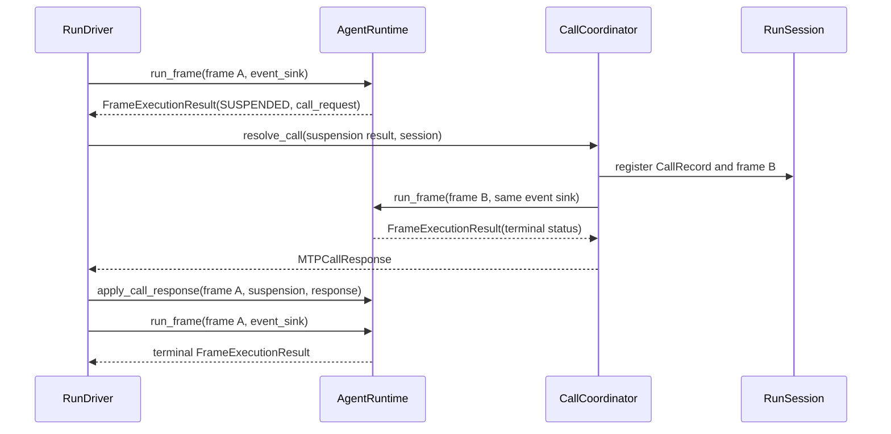

# Alice Agent Runtime 控制流重构计划

本文整理当前 Agent loop、主/子 frame 与 CALL 指令控制流程的后续重构方向。核心判断是：现有统一 `AgentRuntime` 门面应当保留，但它必须继续是一台与 Agent 拓扑无关的单 frame 执行引擎；多 Agent 调用关系、目标选择、frame 派生和恢复顺序应由 Alice 编排层拥有。

这不是为了立即实现更复杂的多 Agent 系统，而是先让当前单层串行 CALL 拥有一条容易阅读、能够测试且可以安全演进的控制路径。未来扩展性通过稳定边界、显式状态与 run-local 所有权获得，不通过提前实现 DAG、并行 fan-out 或通用工作流引擎获得。

## 1. 设计结论

### 1.1 保留统一的 AgentRuntime

`AgentRuntime` 继续封装所有 Agent 共用的底层执行能力：

- `AgentLoopExecutor` 与 `WorkerAgentService`；
- `MTPExecutor`；
- `PendingAtomRuntime`；
- 模型解析、执行配置和 frame 级资源收尾；
- 对 frame history、`TurnEvent` 和 CALL response 的一致回填。

统一门面不等于把所有逻辑放进一个大类。`AgentRuntime` 可以在内部组合上述服务，但对 Alice 只暴露少量稳定的执行接口，Alice 不直接旁路访问 loop、PendingAtom store 或 MTP formatter 的内部状态。

### 1.2 AgentRuntime 不知道 main/child

`AgentRuntime` 的输入始终是一个普通 `ExecutionFrame`。它不得：

- 提供 `create_child_frame()`、`fork_sub_frame()` 或 `finalize_child_frame()`；
- 解析目标 Agent、创建父子关系或决定下一个应运行的 frame；
- 根据 `is_sub_frame()`、`parent_frame_id` 或 `depth` 选择不同控制流；
- 递归执行另一个 Agent；
- 持有 frame stack 或任何跨 run 的调用拓扑。

frame 可以携带 run/frame/action 等关联元数据，Runtime 也可以把它们原样传给 MTP 和事件层，但不能据此解释“这是主 Agent”或“这是子 Agent”。当前依赖 `depth` 控制 CALL 权限的逻辑，后续应逐步投影为显式 `FrameExecutionPolicy` 或 permitted verbs；Runtime 消费能力约束，不解释约束来自哪种拓扑。

### 1.3 “运行到底”的准确含义

一个 frame 有两类停止边界：

1. 自然终态：`COMPLETED`、`CANCELLED`、`FAILED` 或 `BUDGET_EXHAUSTED`；
2. 当前 frame 无法独立继续的外部 effect：例如 CALL 已被解析并进入 `SUSPENDED`，但目标 Agent 的选择和执行属于 Alice。

因此 `AgentRuntime.run_frame(frame)` 的“到底”应定义为：运行到自然终态，或运行到必须由外部解析的 CALL 边界。`SUSPENDED` 不是成功终态，也不是 Runtime 对 child frame 的认知；它只是“当前 PCB 需要一个外部结果才能继续”的显式返回。

### 1.4 共享能力不等于共享控制状态

`MTPExecutor`、`PendingAtomRuntime`、WorkerAgent、模型注册表和只读 cache 可以由统一 Runtime 复用。以下状态必须属于一次 run，而不能挂在 AliceRuntime 或 AgentRuntime 单例上：

- 活跃 frame registry 与调用记录；
- 当前 CALL suspension 及其 response 状态；
- cancel token；
- run 总预算和并发额度；
- frame 恢复关系与 action id 校验；
- 临时错误和清理进度。

当前 `FrameScheduler._frame_stack` 是 AliceRuntime 级共享列表，并发 run 可以交错 push/pop，是需要优先消除的正确性风险。

同样不能把取消令牌写入共享 `MTPExecutor` 或 Koakuma 实例字段。取消是一次 `run_frame()` 调用的 execution control，必须随本次 MTP 调用显式传递；共享 MTP 能力不得保存“当前 run 的 cancel event”。

## 2. 当前控制流程

### 2.1 非流式路径

当前非流式控制权主要由 `AgentOrchestrator.run_agent()` 持有：

```text
AgentOrchestrator.run_agent
  -> FrameScheduler.create_main_frame
  -> AgentRuntime.run_frame(main_frame)
       -> AgentLoopExecutor.execute_frame
            -> generate
            -> execute MTP
            -> CALL returns SUSPENDED
  -> AgentOrchestrator._handle_suspend
       -> append CALL history
       -> FrameScheduler.suspend_frame(main_frame)
       -> resolve profile and context refs
       -> FrameScheduler.fork_sub_frame
       -> AgentRuntime.run_frame(sub_frame)
       -> map child outcome to CALL response
       -> harvest aliases
       -> FrameScheduler.resume_frame
       -> append response and tool_result to main_frame
  -> AgentRuntime.run_frame(main_frame) again
  -> assemble AgentRunResult
```

这条路径已经具备正确的大方向：loop 遇到 CALL 会把控制权交还 Alice，子 frame 也通过相同 `AgentRuntime` 执行。主要问题是 `_handle_suspend()` 同时承担了 profile/context 解析、frame 调度、子 frame 执行、异常映射、PendingAtom 收割、MTP 格式化、历史回填和流式事件组装，形成一个难以单独理解和验证的 CALL transaction。

### 2.2 流式路径

流式路径使用了不同的控制模型：

```text
AgentOrchestrator.run_agent_stream
  -> AgentRuntime.run_frame_stream
       -> AgentLoopExecutor.execute_frame_stream
            -> AgentLoopExecutor.execute_frame
            -> on_suspend callback
                 -> AgentOrchestrator._handle_suspend
                      -> AgentRuntime.run_frame_emitting(sub_frame)
            -> loop re-enters main_frame internally
       -> on_terminal callback
  -> assemble done event
```

这形成了控制反转：

```text
Orchestrator -> Runtime -> Loop -> callback -> Orchestrator -> Runtime(child)
```

非流式由 Orchestrator 循环驱动，流式却由 Loop 内部循环并回调 Orchestrator。相同业务拥有两套控制结构，是目前阅读困难和回归风险的主要来源。`run_frame()`、`run_frame_stream()`、`run_frame_emitting()` 三个接口也把“执行语义”和“事件如何被消费”混在了一起。

### 2.3 当前组件与目标组件的对应关系

| 当前组件或逻辑 | 当前问题 | 目标归属 |
|:---|:---|:---|
| `AgentRuntime.run_frame*()` 三套入口 | 流式与非流式控制语义不同 | 一个 `AgentRuntime.run_frame(frame, event_sink, cancel_event)` |
| `AgentLoopExecutor.execute_frame()` | 生成、MTP、journal、终态和事件投影集中在长方法中 | 仍属 Runtime，但拆成同一 loop 内部的明确阶段 |
| `execute_frame_stream(on_suspend, on_terminal)` | Loop 反向调用编排 | 删除业务回调；每次 `run_frame` 直接返回 `FrameExecutionResult` |
| `AgentOrchestrator.run_agent*()` | 两套驱动结构 | 一个共享 `RunDriver`，外层仅决定如何消费事件 |
| `AgentOrchestrator._handle_suspend()` | 承担整个 CALL transaction | 提取 `CallCoordinator` |
| `FrameScheduler` | 创建 frame 与共享 stack 混合 | 无状态 `FrameFactory` + run-local `RunSession` |
| `AgentProfileResolver` / `RuntimeAliasResolver` | 被大方法直接拼装 | 作为 `CallCoordinator` 的协作者 |
| MTP formatter 与 history 回填 | 编排直接操作 Runtime 执行事实 | `AgentRuntime.apply_call_response()` |
| PendingAtom harvest/cleanup | Runtime 和 Orchestrator 都接触内部状态 | Runtime 暴露 frame/run 级通用 products 与收尾接口，并保留本地成功 run epoch 回收语义 |

## 3. 目标控制模型

### 3.1 核心返回类型

`FrameExecutionResult` 保持为唯一的具体返回模型，并直接承载本计划中所说的“frame outcome”语义；`FrameOutcome` 不另行落地为类型、基类或数据模型。当前的 status 判别字段和已有 suspension 信息已经足够表达本次重构所需的所有结果：

```python
@dataclass
class FrameExecutionResult:
    status: FrameExecutionStatus

    # 仅 status == SUSPENDED：
    call_request: MTPCallRequest | None = None
    suspend_assistant_text: str | None = None
    suspend_action_id: str | None = None

    # 仅 status == FAILED：
    error: Exception | None = None
```

`FrameExecutionStatus` 已经具备五种状态；`call_request` 和 `suspend_action_id` 已经是当前 CALL 外部 effect 的稳定描述。本计划不重命名、不替换或复制这个模型，只收紧其字段有效性和使用位置。未来出现第二类确实需要外部解析的 effect 时，再按实际协议扩展 result payload；不预先引入 `ExternalEffect`、`CallEffect` 或 effect registry。

必须保持以下不变量：

- 只有 `COMPLETED` 是 frame 成功；
- `SUSPENDED` 必须携带可稳定定位的 effect/action id；
- result 只描述本次 `run_frame()` 为什么停止；
- 可恢复执行状态仍以同一个 `ExecutionFrame.progress` 为唯一 PCB；
- result 不携带或解释 child frame。

### 3.2 AgentRuntime 接口

目标接口保持小而通用：

```python
class AgentRuntime:
    async def run_frame(
        self,
        frame: ExecutionFrame,
        *,
        generation_options: dict[str, Any] | None = None,
        event_sink: FrameEventSink,
        cancel_event: asyncio.Event | None = None,
    ) -> FrameExecutionResult: ...

    def apply_call_response(
        self,
        frame: ExecutionFrame,
        suspension: FrameExecutionResult,
        response: MTPCallResponse,
    ) -> None: ...

    def finalize_run(
        self,
        run_id: str,
        result: FrameExecutionResult,
    ) -> RuntimeProducts: ...
```

三组职责分别是：

- `run_frame()`：解析模型输出、执行本地 MTP、记录事件并推进一个 frame；
- `apply_call_response()`：校验 suspension/action id，以相同语义回填 history、`tool_call/tool_result` 与既有 `MTPCallResponse` formatter 结果；
- `finalize_run()`：在根 run 终态统一处理 PendingAtom 的 claim/cancel、成功 run 的本地回收 epoch 和通用产物投影。

`finalize_run()` 知道 `run_id` 和终态，但不知道 run 中有哪些父子关系；它只能由根 `RunDriver` 调用一次，`CallCoordinator` 和被调用 frame 均不得自行收尾。它存在的原因是 PendingAtom 属于下层执行资源，不能让 Alice 编排层直接操作 PendingAtom store 的内部状态。如果后续发现 run 收尾与单 frame 门面不应由同一对象公开，可以在 Runtime 内部拆出 `RuntimeResourceLifecycle`，但仍由统一 Runtime facade 委托，不把所有权上移给 Alice。

当前个人本地产品采用成功 run 驱动的、进程内两阶段 retention epoch，而非定时 TTL：已结算或已取消的旧 run atom 在一次后续成功根 run 完成时变为 `EXPIRED`，再经过一次后续成功根 run 完成时删除。它是短期 pending alias 的本地缓存策略，不是 durable task lifecycle；取消或失败的根 run 不推进此 epoch，也不引入独立 reaper、时钟或后台竞争状态。后续若产品承诺多窗口并行、长期 alias 或进程恢复，再由耐久性计划替换为明确的持久化保留策略。

### 3.3 事件输出

流式与非流式不再拥有不同执行方法。事件只是一种观察输出：

```python
class FrameEventSink(Protocol):
    async def emit(self, event: dict[str, Any]) -> None: ...
```

- 非流式使用 `NullFrameEventSink` 或 recording sink；
- 流式使用 queue-backed sink，将 token/MTP 事件转给 SSE；
- sink 失败策略必须明确，且不能决定 frame 的业务控制流；
- main/sub 等 UI scope 由 Alice 的事件投影或 frame 创建时注入的通用命名空间提供，Agent loop 不调用 `frame.is_sub_frame()` 做分支。

每个事件必须带 `agent_run_id`、`frame_id`、可选的 `action_id` 和 session 单调 `stream_sequence`；`sub_agent_start` 必须在已有具体 `frame_id` 后发出。queue 必须有界：token 可以合并或丢弃以防慢客户端无限积压，`mtp_*`、`sub_agent_*` 与 terminal 事件保持有序且不得静默丢失。客户端关闭通过显式 `cancel_event` 影响 driver，而不是把 sink 异常当作业务终态。

这样 `run_frame()` 的业务结果在两种模式下完全相同，区别只在事件是否被实时消费。

### 3.4 Alice 编排组件

```text
AgentOrchestrator facade
  -> RunDriver
       -> RunSession
       -> AgentRuntime
       -> CallCoordinator
            -> AgentProfileResolver
            -> RuntimeAliasResolver
            -> FrameFactory
            -> AgentRuntime
```

职责划分如下：

| 组件 | 拥有 | 不拥有 |
|:---|:---|:---|
| `AgentOrchestrator` | public run/stream 入口、输入输出适配 | CALL transaction、frame 执行细节 |
| `RunDriver` | 推进当前 run，处理 `FrameExecutionResult`，决定继续、解析 CALL 或结束 | MTP 解析、Profile 数据真相、PendingAtom store |
| `RunSession` | 外部注入的 `agent_run_id`、run-local frame registry、CALL records、cancel、总预算与恢复校验 | 模型生成、MTP formatter、全局共享 stack |
| `CallCoordinator` | CALL 目标解析、context refs、调用策略、子 frame 终态到既有 `MTPCallResponse` 的映射 | 修改 caller history、执行 MTP、伪造成功终态 |
| `FrameFactory` | 根据 `FrameSpec` 构建普通 frame 和 prompt | 保存 stack、执行 frame、决定拓扑 |
| `AgentRuntime` | 执行任意单 frame、回填 CALL response、底层资源收尾 | main/child、调用拓扑、下一个 frame |

`FrameFactory` 使用通用 `FrameSpec`。Alice 可以根据用户入口或 CALL 构造不同 spec，但 Factory 和 Runtime 不需要提供 child-specific API：

```python
@dataclass(frozen=True)
class FrameSpec:
    runtime_scope: RuntimeScope
    profile: AgentProfile
    identity: Identity
    messages: tuple[Message, ...]
    topic_id: str | None
    execution_policy: FrameExecutionPolicy
    event_namespace: EventNamespace
```

`RuntimeScope.run_id` 必须与 `RunSession.agent_run_id` 使用同一稳定关联值；Gateway 的 `generation_id` 作为外层关联值显式携带，而不再生成三个无法反查的 run ID。`parent_frame_id`、CALL depth 和 UI scope 是 Alice 的 `CallRecord`/`FrameExecutionPolicy` 元数据；Runtime 只能透传通用执行坐标，MTP 的 CALL 许可由 policy 判断，而不直接读取拓扑 depth。

### 3.5 CALL record 与取消胜负规则

每次 `SUSPENDED` 以 caller `frame_id + suspend_action_id` 创建一个 run-local `CallRecord`，并在任何 profile/context 异步解析前同步登记。其状态只能按以下路径推进：

```text
SUSPENDED -> RESOLVING -> RESOLVED -> APPLIED
     \------------ any pre-APPLIED state ------------> CANCELLED
```

- `CallCoordinator` 只负责从 `RESOLVING` 得到 `MTPCallResponse`；它不得写 caller frame；
- `AgentRuntime.apply_call_response()` 是唯一可把 CALL 文本、formatted response 与成对 `TurnEvent` 写回 caller 的位置；
- 同一 action 的 response 只可从 `RESOLVED` 进入 `APPLIED` 一次；重复、错 frame 或错 action 的回填必须拒绝；
- cancel 若先于 `APPLIED` 被 session 观察到，则取消胜出：不向 caller 回填迟到的 success，终结对应未完成资源；
- 子 frame 的 terminal result 只构成 CALL response，不触发 run finalization。

### 3.6 理想 CALL 时序



在这条链路中，Runtime 只先后看到 frame A 和 frame B；它不知道 B 由 A 派生，也不知道 B 被称为 child。`CallCoordinator` 可以把 B 的 `COMPLETED` 映射为 success，把其他终态映射为 cancelled 或稳定 error，但实际的 history/TurnEvent 回填仍通过 Runtime 的 CALL response 接口完成。

### 3.7 RunDriver 的统一循环

流式与非流式共用一段业务循环：

```python
async def drive_run(session, event_sink):
    while True:
        result = await agent_runtime.run_frame(
            frame=session.main_frame,
            generation_options=session.generation_options,
            cancel_event=session.cancel_event,
            event_sink=event_sink,
        )

        match result.status:
            case FrameExecutionStatus.SUSPENDED:
                response = await call_coordinator.resolve_call(
                    session=session,
                    parent_frame=session.main_frame,
                    suspension=result,
                    event_sink=event_sink,
                )
                agent_runtime.apply_call_response(
                    session.main_frame,
                    result,
                    response,
                )
                continue

            case _:
                return agent_runtime.finalize_run(
                    run_id=session.agent_run_id,
                    result=result,
                )
```

流式 public API 只是在外面启动这段 driver，并把 queue sink 中的事件转成 async generator；非流式 public API 直接等待 driver。Loop 不再回调 Orchestrator，Driver 也不需要为子 frame 调用另一套 Runtime API。

## 4. 边界不变量

重构完成后，应能通过代码审查或测试直接验证以下规则：

1. `src/hivememory/agent_runtime/` 不 import `hivememory.alice`；
2. `AgentRuntime` 与 `AgentLoopExecutor` 中不出现 create/fork/resume child frame 的控制代码；
3. Runtime 不以 `is_sub_frame()`、`depth` 或 `parent_frame_id` 分支执行流程；
4. Loop 不接受 `on_suspend`、`on_terminal` 等编排回调；
5. 流式与非流式通过同一个 `run_frame()` 和同一个 `RunDriver` 获得相同 `FrameExecutionResult`；
6. 同一个 frame 重入时继续使用原 `ExecutionFrame.progress`，iteration、sequence 和 action id 不重置；
7. CALL response 必须按 caller frame/action id exactly-once 回填，重复或错配 response 被拒绝；
8. 只有 `COMPLETED` 可以映射为成功 CALL；取消、失败、预算耗尽和意外挂起保持独立语义；
9. 非成功 frame 的 PendingAtom 必须由 Runtime 统一清理；根 run 的 finalize 仅由 `RunDriver` 调用一次，Alice 不直接修改 store；
10. 所有可变调用状态属于 `RunSession`，不同 run 不共享 frame stack、cancel 或 budget；
11. EventSink 和日志是观察路径，失败不得把业务终态从 failed/cancelled 改写为 success；
12. `AgentRunResult` 只由 run 根 frame 和 run-level products 组装，子 frame 不产生第二个 public done。
13. `MTPExecutor`/Koakuma 不保存当前 run 的 cancel event；取消控制仅随一次 MTP 调用传递。
14. 每个流事件可关联到 agent run、frame 和 action，且 `sub_agent_start` 不得使用未知 frame id。
15. PendingAtom 的短期 alias 回收只由成功根 run 推进进程内 retention epoch；它不是 timer、后台 reaper 或跨进程耐久性承诺。

## 5. 分阶段实施

每个阶段都应形成可独立审查、可回滚的提交，并保持现有外部协议、SSE 类型、MTP payload 和单层串行 CALL 行为不变。

### Phase 0：建立行为基线与边界测试

1. 为非流式和流式记录同一输入下的终态、`TurnEvent`、action id、SSE 事件顺序与 PendingAtom 结果；
2. 固化 CALL completed/cancelled/failed/budget-exhausted/unexpected-suspend 的映射测试；
3. 增加架构测试，禁止 AgentRuntime import Alice 或新增 child-specific API；
4. 为同一个 frame 的 suspend -> CALL response -> re-enter 建立最小状态机测试；
5. 将当前 `FrameScheduler` 并发问题保留为明确的失败样本，供 Phase 4 修复。
6. 固化两条并发取消基线：A run 的取消不得影响 B 的 MTP 执行；客户端关闭只能通过自己的 cancel event 结束对应 driver。
7. 固化 PendingAtom 的本地 retention epoch：A 已 settlement 后，B 成功完成使 A `EXPIRED`，C 成功完成删除 A；B 取消/失败不推进 epoch；A 在 B 完成后才 settlement 时顺延到后续成功 epoch。

此阶段不改控制流。刚完成的 frame 终态语义修复是本计划的前置基线，不在重构中重新解释。

### Phase 1：统一 AgentRuntime 执行入口

1. 引入 `FrameEventSink`，让 `AgentLoopExecutor.execute_frame()` 通过 sink 发出 token/MTP 事件；
2. 将 `AgentRuntime.run_frame()` 定为唯一执行入口，内部继续复用现有模型解析和 loop；
3. 让 `run_frame_stream()`、`run_frame_emitting()` 暂时成为兼容 adapter，调用同一个 `run_frame` 核心；
4. 将事件命名空间从 `_namespace_for_frame()` 的 main/sub 判断改为通用 metadata 投影；
5. 将 `MTPExecutor.set_cancel_event()` 改为每次 `intercept_and_execute()` 的显式 execution control 参数，删除 Koakuma 的共享 cancel 字段；
6. 拆分 `execute_frame()` 内部阶段，例如 generation、MTP intercept、journal append 和 result build，但不增加新的跨层 service。

阶段出口：所有 frame 只有一套执行语义，旧 public 调用仍可工作。

### Phase 2：移除流式控制反转

1. `AgentLoopExecutor` 遇到 CALL 后始终直接返回 `SUSPENDED`；
2. 删除 `execute_frame_stream()` 内部重入循环及 `on_suspend/on_terminal` 回调；
3. 在 Alice 层引入共享 `RunDriver`，先接管主 frame 的 outcome 循环；
4. 流式入口使用 queue-backed sink，非流式入口使用 null/recording sink；
5. 在 sink 中补齐 agent-run/frame/action/stream sequence，并在 frame 创建后再发布 `sub_agent_start`；
6. 使用有界 queue，明确 token 合并/丢弃与控制事件可靠投递策略；
7. 对比重构前后 SSE 顺序、终态和 TurnEvent，确保事件传输方式没有改变业务结果。

阶段出口：控制方向固定为 `RunDriver -> AgentRuntime -> FrameExecutionResult`，不再出现 Runtime 回调 Orchestrator。

### Phase 3：提取 CallCoordinator 与 CALL response

1. 从 `_handle_suspend()` 提取 profile 解析、context ref 编译、frame spec 构造、调用执行和终态映射；
2. 让 `CallCoordinator` 返回既有 `MTPCallResponse`，不直接修改 caller frame；
3. 新增 `AgentRuntime.apply_call_response()`，统一唯一 formatter、working history 和 `tool_call/tool_result` 回填；
4. 用 caller frame/action id 建立 `CallRecord(SUSPENDED/RESOLVING/RESOLVED/APPLIED/CANCELLED)`，防止重复回填或回填到错误 frame；
5. `CallCoordinator` 只把 child `COMPLETED` 映射为 success，沿用已经完成的终态语义；
6. 规定 cancel 在 `APPLIED` 前胜出，子 frame 迟到成功不再回填 caller；
7. 暂时保留 `AgentOrchestrator` 作为 public facade，内部委托 `RunDriver`，避免一次性改变上层调用方。

阶段出口：CALL transaction 的业务步骤可单独阅读和测试，Runtime 仍不知道 child frame。

### Phase 4：引入 RunSession 与 FrameFactory

1. 将 `_frame_stack` 替换为每次 run 新建的 `RunSession`；
2. 在 session 中登记外部注入的 `agent_run_id`、frame id、caller action id、CALL record、状态和恢复关系，恢复前核对 run/frame/action；
3. 将 frame 构造从 stack 调度中分离为无状态 `FrameFactory.create(FrameSpec)`；
4. cancel、run 总预算和调用深度策略进入 session/policy，Runtime 只消费当前 frame 的执行约束；将 `RuntimeScope` 中的父子关系与 depth 逐步收敛为 Alice 元数据和 `FrameExecutionPolicy`；
5. 删除或降级 `FrameScheduler`，不再保留 AliceRuntime 级可变 stack；
6. 增加两个并发 run 交错 CALL、分别取消、分别失败和恢复错配的测试。

阶段出口：关闭 `docs/todo/alice-frame-scheduler-concurrency.md`，共享底层能力与 run-local 控制状态彻底分离。

### Phase 5：收紧 PendingAtom 与 Runtime facade

1. 收口 `aliases_by_frame()`、`cancel_tasks_by_frame/run()`、`collect_tasks_by_run()` 为通用 frame/run lifecycle 操作；
2. Runtime 根据根 frame/run result 自动执行清理或产物投影，Orchestrator 不再遍历 PendingAtom 内部 store；只有根 `RunDriver` 可触发该收尾；
3. `RuntimeAliasResolver` 可以作为 CALL context 解析器继续留在 Alice，但 pending 的状态解释必须通过 Runtime 提供的只读 resolution port；
4. 保持现有个人本地的成功 run retention epoch：旧 run 的 `SETTLED/FAILED/CANCELLED` atom 在下一次成功根 run 完成时变 `EXPIRED`，再下一次成功根 run 完成时删除；不新增定时器、后台 reaper 或 durable retention controller；
5. 在文档和测试中明确该缓存仅服务近期 follow-up alias：同一 run 的父子 frame 共享 alias，后续一轮可 redirect，再后一轮读取时得到 expired；成功 root run 之外的 cancel/failed 不推进 epoch；
6. 审查 AliceRuntime 对 settlement/cache 刷新的旁路访问，保留事件接入，移除重复所有权；
7. 明确 `FrameProducts` 与 `RuntimeProducts`，区分给当前 CALL 使用的 artifact aliases 和 run 结束后交给 Patchouli 的 materialize tasks。

阶段出口：`AgentRuntime` 真正成为底层执行聚合门面，同时没有吸收任何多 Agent 拓扑语义。

### Phase 6：清理兼容 API 与更新当前文档

1. 删除 `run_frame_stream()`、`run_frame_emitting()` 和 callback adapter；
2. 删除不再使用的 FrameScheduler stack API 与 `_handle_suspend()`；
3. 更新 `docs/alice/agent-runtime.md`、`docs/alice/orchestration.md` 和相关 contract；
4. 修正 Agent Runtime 当前限制中 `AgentRunStatus.FAILED` 仅作为保留枚举的过时描述；
5. 将本计划移入 archived plans，并把最终实现事实只保留在当前文档中。

## 6. 可读性优化

控制流解耦完成后，再做局部代码组织。顺序很重要：先确定谁拥有控制权，再拆函数；否则只是把同一条交错调用链分散到更多文件。

`AgentLoopExecutor.execute_frame()` 建议保持一个可从上到下阅读的 state machine，内部私有方法只对应稳定阶段：

```text
check cancellation/budget
  -> generate one turn
  -> classify natural output or MTP
  -> execute local MTP
  -> record command/result
  -> return outcome or continue
```

`RunDriver` 则只保留另一条短 state machine：

```text
run current frame
  -> terminal: finalize run
  -> suspended: resolve CALL, apply response, re-enter same frame
```

代码命名应使用 `frame`、`result`、`call_response`、`action_id` 和 `session`。只有 `CallCoordinator` 与 Alice orchestration 文档需要使用 caller/callee 或 parent/child 术语。这样阅读 AgentRuntime 时不需要同时加载多 Agent 拓扑知识，阅读 CALL 时也不需要展开模型生成和 MTP 记录细节。

## 7. 为未来多 Agent 扩展保留什么

现在应当确定扩展边界，但不应提前实现复杂拓扑。

### 7.1 现在需要稳定的扩展点

- CALL 以稳定 `action_id` 关联请求、`MTPCallResponse`、`CallRecord` 和流事件；
- `RunSession` 可以登记多个 frame 和调用记录，但首期仍只推进一个串行 active frame；
- `FrameExecutionPolicy` 独立表达 permitted verbs、最大深度、预算和 timeout；
- `CallCoordinator` 负责调用策略，Runtime 不因串行、嵌套或并行而变化；
- `FrameExecutionResult`、`MTPCallResponse` 和事件状态使用现有判别字段，新增状态不会靠空字符串或异常猜测；
- frame/run products 有清晰所有权，未来重试或持久化时可以安全 checkpoint。

### 7.2 现在明确不实现

- 任意深度递归 CALL；
- 并行 fan-out/fan-in；
- DAG、review loop、投票或多 Agent 共识；
- 自主 planner 和动态 team；
- 跨进程 frame 调度与 durable checkpoint；
- 一个抽象的通用 workflow engine 或 effect registry。

未来增加串行嵌套 CALL 时，只需调整 Alice policy 与 `CallCoordinator` 的递归推进方式；增加并行 fan-out 时，主要扩展 `RunSession` 与 Driver 的 active CALL 集合。两者都不需要修改 `AgentRuntime.run_frame(frame)` 的单 frame 边界。只有真实需求出现后，才应为并行调度、公平性、聚合失败和 checkpoint 设计新的契约。

## 8. 验证矩阵

| 层级 | 必须覆盖的行为 |
|:---|:---|
| AgentRuntime 单元测试 | natural complete、cancel、failure、budget exhausted、CALL suspension、同 frame 重入、action id 错配/重复、MTP cancel 不跨 run |
| 事件测试 | 流式/非流式 `FrameExecutionResult` 一致，token/MTP 顺序稳定，event envelope 可关联 run/frame/action，有界 queue 不改变业务终态 |
| CallCoordinator 单元测试 | profile/context 成功与失败，五种 frame outcome 到 CALL response 的稳定映射 |
| RunDriver 单元测试 | suspend -> resolve -> apply -> re-enter，根 frame 终态，取消传播与胜负规则，finalize 仅一次 |
| PendingAtom 测试 | completed 收割，非成功 frame 清理，run failed/cancelled 不交付 materialize tasks，成功 run retention epoch 的 redirect/expired/delete 序列 |
| 并发测试 | 两个 run 交错 CALL、分别取消/失败，frame/call/action 不交叉；当前个人本地模式不承诺 Pending alias 的跨窗口长期保留 |
| E2E | 单层串行 CALL、连续多次 CALL、流式子 Agent 事件、最终 `AgentRunResult` 与当前行为一致 |
| 架构测试 | agent_runtime 不依赖 Alice，无 child-specific Runtime API，无 shared frame stack |

每个 Phase 至少运行对应单元测试和 Alice 相关 e2e；Phase 2、4、6 运行全量回归。重构期间不得放宽刚完成的终态断言来换取测试通过。

## 9. 范围外事项与相邻计划

- 通用 error payload XML escaping 继续由 `docs/todo/error-formatter-xml-escaping.md` 独立处理。本计划可能移动 formatter 的调用位置，但不顺带改变 escaping 契约；
- frame 与 run 的持久化、崩溃恢复属于 `runtime-state-durability-and-recovery.md`，本计划只确保状态有明确 owner 和可 checkpoint 形态；
- 身份、Profile cache 与执行权限收紧属于 `identity-isolation-and-execution-safety.md`；本计划负责 run-local 控制状态和 policy 接口，不替代授权设计；
- PendingAtom 不在本计划中引入 timer、后台 reaper、跨进程 retention 或长期跨窗口 alias 合约；当前成功 run retention epoch 只面向个人本地、近期 follow-up 的运行期缓存；
- 本计划不改变外部 `AgentRunResult`、MTP XML payload、SSE event name 或当前单层星型拓扑。

## 10. 完成标准

当以下条件同时满足时，本计划才可标记完成：

- Runtime 只有一个单 frame 执行入口，流式/非流式共享业务控制流；
- AgentRuntime/Loop 不知道 main/child，也不创建、调度或递归执行其他 frame；
- Alice 拥有唯一 `RunDriver`，CALL 通过 `CallCoordinator` 解析；
- `MTPCallResponse` 通过 Runtime 的 CALL 接口回填，同 action 的 call/result 状态一致；
- PendingAtom 的执行期状态与收尾仍由 Runtime 聚合拥有；
- PendingAtom 保持成功 run 驱动的两阶段本地 retention epoch，未引入不必要的 timer/reaper；
- frame stack、cancel、budget 和调用记录全部 run-local，并发隔离测试通过；
- MTP 取消控制、流事件关联和 queue 背压均不再依赖共享 run 状态；
- 当前 CALL 行为、终态、TurnEvent、SSE 与 AgentRunResult 回归通过；
- current docs 已更新，旧兼容 API 和重复控制路径已删除；
- 未为尚不存在的复杂多 Agent 需求引入 DAG、并行 scheduler 或通用 workflow 抽象。
