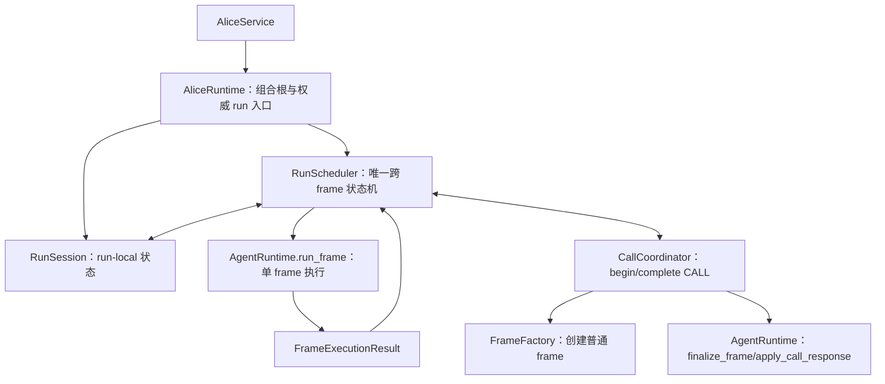

# Alice 父子 Agent 进程调度流程收口计划

## 1. 文档定位

本文规划 Alice 当前单层串行 CALL 的下一阶段控制流收口：将分散在 `RunDriver` 与 `CallCoordinator` 中的 frame 调度责任集中为一个 run-local `RunScheduler`，使 root frame 与 callee frame 都由同一调度循环推进，同时继续保持 `AgentRuntime` 对主/子拓扑无感知。

本计划是已完成的 [Alice Agent Runtime 控制流重构](../archive/plans/alice-agent-runtime-control-flow-refactor.md) 的后续完善，不是恢复旧 `FrameScheduler`，也不是否定前序重构。前序工作已经建立了 `RunSession`、`FrameExecutionResult`、`CallRecord`、`FrameFactory`、`FrameExecutionPolicy`、逐次 cancel event、统一事件 sink、`finalize_frame()/finalize_run()` 与 CALL exactly-once 回填等基础；本计划在这些边界之上补齐真正统一的父子 frame 调度流程。

本文只解决当前父 Agent 派生一个受控 callee、等待其结束并恢复 caller 的进程流程。DAG、fan-out、fan-in、并行 specialist、递归 CALL、review loop、计划编译、动态工作流、持久化 checkpoint 与跨进程 worker 均不纳入本次实现。

---

## 2. 背景与问题

### 2.1 已完成重构解决的是错误调度器实现

历史 `FrameScheduler` 以 AliceRuntime 级共享 `_frame_stack` 保存 caller，并同时承担 main/sub frame 构造、depth/parent 拓扑、prompt 裁剪和 suspend/resume。并发 run 可能交错 push/pop，Runtime 也容易逐渐依赖 main/child、depth 与 parent frame。

前序重构已经完成以下收口：

- 删除共享 frame stack 与 `suspend_frame()/resume_frame()`；
- 以每次 run 独立的 `RunSession` 保存 frame registry、CALL ledger、cancel event 和 stream sequence；
- 以无状态 `FrameFactory` 创建普通 `ExecutionFrame`；
- 从 `RuntimeScope` 删除 `parent_frame_id/depth`，不再使用 `is_main_frame()/is_sub_frame()`；
- 以 `FrameExecutionPolicy` 表达 CALL 权限与迭代上限；
- 以 `caller_frame_id + action_id` 唯一定位 CALL transaction；
- 统一 `AgentRuntime.run_frame()`、流事件 sink 与逐次取消参数；
- 通过 `finalize_frame()` 与 `finalize_run()` 区分 frame 产品和 root run 产品；
- 只有 callee `COMPLETED` 映射为 CALL success，其他状态保持 cancelled 或稳定 error；
- 通过 `AgentRuntime.apply_call_response()` 原子校验并 exactly-once 回填 caller。

这些边界继续有效，本计划不得重新引入共享栈、拓扑字段、depth 权限、Runtime 控制反转或编排层直接修改 caller history。

### 2.2 当前仍存在分布式隐式调度器

当前控制流为：

```text
RunDriver 运行 root frame
  -> root SUSPENDED
  -> RunDriver 注册 CallRecord
  -> CallCoordinator.resolve_call()
       -> 准备 callee
       -> 直接 AgentRuntime.run_frame(callee)
       -> finalize_frame(callee)
       -> 映射 MTPCallResponse
  -> RunDriver 检查取消并 apply caller
  -> RunDriver 继续运行 root frame
```

其中：

- `RunDriver` 是 root frame 的推进器；
- `CallCoordinator` 又内嵌了一次 callee 执行；
- `CallRecord` 的建立、状态迁移、取消门禁和 response apply 分散在两个组件；
- root 与 callee 对取消和终态的解释存在两条实现路径；
- `AgentOrchestrator` 在 session 创建和 initial user event 已经上移/下沉后，主要只剩 root frame 适配、Driver 构造和结果组装。

系统没有真正消除调度职责，而是把它隐式分布到 `RunDriver + CallCoordinator`。这对当前单层同步 CALL 可用，但不利于统一阅读、取消处理、错误边界和后续调度策略演进。

### 2.3 AgentRuntime 与编排调度之间的不可消除边界

`AgentRuntime` 负责运行当前一个 frame，直到自然终态或外部控制流陷入：

```text
COMPLETED / CANCELLED / FAILED / BUDGET_EXHAUSTED / SUSPENDED
```

当 CALL 产生 `SUSPENDED` 时，继续执行必须选择另一个 frame。若同时要求 `AgentRuntime`：

1. 只知道一个普通 frame；
2. 不创建或选择其他 frame；
3. 不回调 Alice 编排层；

那么它就不能独自跨过 CALL 运行到 root 最终终态。跨 frame 的调度循环因此必须位于 Alice。真正应当消除的不是外部调度循环，而是 root 与 callee 分别拥有不同执行路径。

---

## 3. 目标与非目标

### 3.1 目标

1. 建立每次 run 独立的 `RunScheduler`，作为 Alice 内所有 frame 的唯一推进状态机。
2. 在 Alice 编排层中，只允许 `RunScheduler` 调用 `AgentRuntime.run_frame()`；`CallCoordinator` 不再直接运行 callee。
3. root 与 callee 共享相同的 frame 执行、取消归一化和 outcome 分派入口。
4. 将 `CallCoordinator.resolve_call()` 拆为 CALL 开始与完成两个明确阶段，不再包裹一段嵌套执行流程。
5. 将 caller/callee 的等待、恢复和终止关系显式保存到 `RunSession/CallRecord`，但不写入 `ExecutionFrame` 或 `RuntimeScope`。
6. 保持 CALL response 的 exactly-once apply、取消优先、终态映射、PendingAtom 收尾与流事件顺序不变。
7. 让流式与非流式入口共享同一个调度核心，不分别实现 frame 切换逻辑。
8. 评估并移除已经过薄的 `AgentOrchestrator`，将实际调用链收敛为 `AliceRuntime -> RunScheduler -> AgentRuntime`，`CallCoordinator` 作为 Scheduler 的侧向协作者。
9. 为未来增加 ready queue 或执行计划留下稳定边界，但不在本次实现任何真实多智能体编排策略。

### 3.2 非目标

本计划明确不包含：

- DAG、PlanCompiler、ExecutionPlan 或 workflow graph；
- fan-out、fan-in、并行 callee、任务聚合或公平调度；
- callee 再次 CALL、递归调用或多层调用栈；
- reviewer/author loop、条件分支、重试策略或 fallback graph；
- durable frame、checkpoint、进程恢复或跨进程 worker；
- 通用 effect/trap/workflow handler 框架；
- 新的 MTP verb、CALL XML 格式或 error payload XML escaping；
- 修改现有 SSE event name、外部 `AgentRunResult` 或 `MTPCallResponse`；
- 重写普通 SEARCH/READ/RUN/WRITE/UPDATE 的 Agent Loop；
- 改变 PendingAtom 成功 root run 驱动的两阶段进程内 retention epoch；
- 重新引入旧 `FrameScheduler` 的共享栈、main/sub factory API 或 depth 拓扑。

---

## 4. 核心设计决策

### 4.1 系统只保留两级控制循环

重构后只保留两种不同尺度的状态机：

```text
AgentRuntime / AgentLoopExecutor
  = frame 内循环
  = LLM generation -> 普通 MTP -> response -> 下一轮 generation
  = 不改变当前活动 frame

RunScheduler
  = run 内调度循环
  = root/callee 之间的活动 frame 切换
  = 处理 SUSPENDED、callee terminal 与 root terminal
```

判断职责归属的稳定规则为：

> 不改变活动 frame 的控制流属于 AgentRuntime；改变活动 frame 的控制流属于 RunScheduler。

因此普通 MTP 继续完全留在 AgentRuntime；CALL 产生 caller 等待和 callee 切换，必须由 RunScheduler 接管。

### 4.2 RunScheduler 是唯一真正的 Scheduler

新 `RunScheduler` 不是旧共享 `FrameScheduler` 的恢复版本。两者区别如下：

| 边界 | 旧 FrameScheduler | 新 RunScheduler |
|:---|:---|:---|
| 生命周期 | AliceRuntime 级共享 | 每个 `RunSession` 独立 |
| 核心状态 | 隐式 `_frame_stack` | 显式 frame registry、frame state 与 CallRecord |
| 是否运行 frame | 否，真正循环在 Orchestrator | 是，Alice 内唯一调用 `run_frame()` 的组件 |
| frame 构造 | `create_main_frame/fork_sub_frame` | 委托无状态 `FrameFactory` |
| 拓扑 | `parent_frame_id/depth` | `CallRecord(caller, callee, action)` |
| 恢复 | push/pop | 精确 caller/callee/action 关联 |
| 权限 | depth 与 prompt 裁剪 | `FrameExecutionPolicy` |
| 扩展方式 | 栈只能表达嵌套串行 | 后续可替换选帧策略，但本次仍为单活动 frame |

`RunScheduler` 不解析 Profile、不编译 context、不构造 CALL response，也不直接修改 caller history。

### 4.3 CallCoordinator 是 CALL trap 与 IPC 处理者

`CallCoordinator` 不再是 callee runner。它负责两个边界动作：

1. `begin_call()`：把 caller suspension 转换为 callee dispatch 或立即可回填的 CALL error；
2. `complete_call()`：把 callee outcome 转换为 caller 可消费的 `MTPCallResponse`，完成 frame 收尾、事件发布与原子回填。

它可以调用：

- `AgentProfileResolver`；
- `RuntimeAliasResolver`；
- `AgentPromptAssembler`；
- `FrameFactory`；
- `AgentRuntime.finalize_frame()`；
- `AgentRuntime.apply_call_response()`。

它不得调用：

- `AgentRuntime.run_frame()`；
- `AgentRuntime.finalize_run()`；
- 任何 main/sub 专用 Runtime API；
- caller `working_history` 或 `TurnEvent` 的直接写入。

### 4.4 RunSession 是唯一 run-local 调度事实源

`RunSession` 继续拥有：

- `agent_run_id/generation_id`；
- frame registry；
- CallRecord ledger；
- cancel event；
- stream sequence。

本计划补充：

- `root_frame_id`；
- 每个 frame 的 scheduling status；
- callee frame 到 CallRecord 的可验证关联；
- 当前单层串行流程需要的活动/等待事实。

调度状态不写入 `ExecutionFrame`。建议引入 Alice 内部模型：

```python
class FrameSchedulingStatus(str, Enum):
    PENDING = "pending"
    RUNNABLE = "runnable"
    RUNNING = "running"
    WAITING = "waiting"
    TERMINATED = "terminated"
```

当前只允许一个活动 frame，不引入通用 runnable queue。状态模型的作用是消除隐式判断和保护转换，不是提前实现并行调度。

### 4.5 CallRecord 显式关联 caller 与 callee

`CallRecord` 继续以：

```text
caller_frame_id + action_id
```

唯一定位，并补充可选 `callee_frame_id`。父子关系只存在于 CallRecord，不回写 RuntimeScope。

状态主路径保持：

```text
SUSPENDED -> RESOLVING -> RESOLVED -> APPLIED
```

在 `APPLIED` 前观察到 run cancel 时转入 `CANCELLED`。Profile/context/frame preparation 失败属于已解析 CALL error，应通过 `MTPCallResponse` 回填 caller 并进入 `APPLIED`，而不是留下没有终点的 `RESOLVING` record。

### 4.6 CALL 使用专用调度结果，不增加通用 effect 抽象

`MTPCallResponse` 继续是唯一 caller-facing CALL 结果。为了让 Scheduler 只处理“下一步运行谁”，Alice 内部可以增加窄的 CALL transition：

```python
class CallNextAction(str, Enum):
    DISPATCH_CALLEE = "dispatch_callee"
    RESUME_CALLER = "resume_caller"
    CANCEL_RUN = "cancel_run"


@dataclass(frozen=True)
class CallTransition:
    action: CallNextAction
    next_frame: ExecutionFrame | None = None
```

它只表达一次 CALL 边界完成后 Scheduler 的下一步动作，不替代 `FrameExecutionResult`，不进入 AgentRuntime，也不扩展成通用 workflow/effect 模型。

### 4.7 FrameExecutionResult 继续是唯一 frame outcome

`AgentRuntime.run_frame()` 继续返回现有 `FrameExecutionResult`：

- `COMPLETED`；
- `SUSPENDED`；
- `CANCELLED`；
- `FAILED`；
- `BUDGET_EXHAUSTED`。

不增加 root/callee 专用 outcome，也不把调度状态写入该模型。Scheduler 根据 frame 在 RunSession 中的关系解释同一 outcome：

- root terminal 结束 run；
- callee terminal 完成 CALL；
- root `SUSPENDED` 开始 CALL；
- 当前被调用 frame 意外 `SUSPENDED` 仍按稳定 unexpected-suspend error 完成上一层 CALL。

---

## 5. 目标组件关系



核心调用链收敛为：

```text
AliceRuntime
  -> RunScheduler
       -> AgentRuntime.run_frame(current_frame)
       -> CallCoordinator.begin_call()/complete_call()
```

`CallCoordinator` 是 Scheduler 的协作者，不再形成 `Scheduler -> Coordinator -> Runtime.run_frame()` 的嵌套 driver。

---

## 6. 目标控制流程

### 6.1 root 自然结束

```text
RunScheduler marks root RUNNING
  -> AgentRuntime.run_frame(root)
  -> COMPLETED/CANCELLED/FAILED/BUDGET_EXHAUSTED
  -> root TERMINATED
  -> AgentRuntime.finalize_run(run_id, result) exactly once
  -> return FrameExecutionResult
```

### 6.2 CALL 成功派生与恢复

```text
root RUNNING
  -> AgentRuntime returns SUSPENDED
  -> CallCoordinator.begin_call()
       -> validate suspension/action
       -> register CallRecord before first await
       -> resolve profile/context
       -> FrameFactory creates callee
       -> session registers callee and binds CallRecord.callee_frame_id
       -> emit sub_agent_start after concrete frame_id exists
       -> DISPATCH_CALLEE
  -> root WAITING
  -> callee RUNNABLE -> RUNNING
  -> AgentRuntime.run_frame(callee)
  -> callee terminal
  -> CallCoordinator.complete_call()
       -> finalize_frame(callee)
       -> map MTPCallResponse
       -> emit sub_agent_end
       -> cancel-before-apply gate
       -> AgentRuntime.apply_call_response(caller, suspension, response)
       -> CallRecord APPLIED
       -> RESUME_CALLER
  -> callee TERMINATED
  -> root RUNNABLE
```

### 6.3 CALL 准备失败

Profile 不存在、无权访问、context preparation 异常或 model route 无法建立时：

```text
CallCoordinator.begin_call()
  -> create stable error MTPCallResponse
  -> no callee is scheduled
  -> emit sub_agent_end with no frame_id when compatible with current contract
  -> apply error response exactly once
  -> CallRecord APPLIED
  -> RESUME_CALLER
```

CALL 的业务失败不会让 Scheduler 伪造 root `FAILED`，caller 仍可根据结构化 error 调整后续行为。程序不变量错误继续抛出，不包装成普通 Agent-facing error。

### 6.4 callee 非成功终态

| callee outcome | CALL response | Scheduler 下一步 |
|:---|:---|:---|
| `COMPLETED` | success + reply + artifact aliases | 恢复 caller |
| `CANCELLED` 且 run 未全局取消 | cancelled | 回填 caller 后恢复 |
| `FAILED` | stable sub-agent error | 回填 caller 后恢复 |
| `BUDGET_EXHAUSTED` | stable budget error | 回填 caller 后恢复 |
| `SUSPENDED` | stable unexpected-suspend error | 不派生孙 frame，回填 caller 后恢复 |

当前 plan 不允许递归 CALL；callee policy 继续移除 CALL。即使错误路径产生 `SUSPENDED`，也不能在本次计划中递归派生。

### 6.5 全局取消

同一个 `RunSession.cancel_event` 传入所有 frame execution。取消语义为：

- AgentRuntime 负责在 frame 内观察取消并返回 `CANCELLED`；
- Scheduler 负责将全局取消解释为 root run 取消；
- 若 callee success/error 已返回但尚未 apply，取消胜出，CallRecord 进入 `CANCELLED`；
- 迟到的 callee response 不回填 caller；
- active frame 与当前 run 的 PendingAtom 由既有 finalization 入口清理；
- `finalize_run()` 仍只执行一次；
- 协程级 `asyncio.CancelledError` 不被普通异常映射吞掉，尚未 apply 的 CallRecord 必须先终止到 `CANCELLED`。

---

## 7. AgentRuntime 错误契约收紧

为避免 root 与 callee 再次形成两套异常路径，本计划需要审计 `AgentRuntime.run_frame()` 的返回/抛出边界：

### 7.1 operational failure

模型不可用、generation 失败、MTP 无法形成有效执行结果等单 frame 运行故障，应尽量稳定投影为：

```python
FrameExecutionResult(
    status=FrameExecutionStatus.FAILED,
    error=error,
)
```

同一个 `FAILED` 由 Scheduler 外层解释：root 失败结束 run，callee 失败映射为 CALL error。

### 7.2 invariant failure

以下问题继续抛出异常，不包装成普通 frame failure：

- frame 未注册或 run ID 不匹配；
- CALL action ID 缺失、错误或重复；
- response target 不匹配；
- CallRecord 非法状态迁移；
- 已存在 tool result 时重复 apply；
- Scheduler 无法找到 callee 对应的 caller record；
- root 被重复 finalize。

本阶段只统一现有 frame 执行边界，不建立通用错误恢复、retry 或 reconciliation 体系。

---

## 8. 流式与非流式控制

`RunScheduler` 只保留一个 `_drive()` 调度核心：

- 非流式入口使用 `NullFrameEventSink` 并直接等待 `_drive()`；
- 流式入口创建最大容量 256 的 queue sink，在独立 runner 中执行同一个 `_drive()`；
- 所有 root/callee token、MTP 与 sub-agent event 共用 session 单调 `stream_sequence`；
- `ScopedFrameEventSink` 继续补充 callee frame/action 元数据；
- 客户端关闭只取消当前 runner 并设置当前 session cancel event；
- queue 继续使用 `await put()` 背压，不丢弃控制、terminal 或 token 事件；
- `done` 只在 root scheduler 已得到最终 `FrameExecutionResult` 并完成 `finalize_run()` 后发布。

不得为 root 与 callee 分别维护 stream runner，也不得让 CallCoordinator 创建第二条 event queue。

---

## 9. PendingAtom 与 finalization 边界

现有边界保持不变：

- `CallCoordinator.complete_call()` 负责 callee 的一次逻辑 `finalize_frame()`；
- callee 成功时只投影当前 CALL 可见的 `FrameProducts.artifact_aliases`；
- callee 非成功或 harvest 失败时清理该 frame 的 in-flight atoms；
- `RunScheduler` 只在 root 结束时调用一次 `finalize_run()`；
- root `COMPLETED` claim 当前 run materialize tasks 并推进 retention epoch；
- root 非成功取消当前 run in-flight atoms，不产出 materialize tasks，不推进 epoch；
- 编排层不得遍历 PendingAtom store 内部集合；
- caller/callee 继续共享 run ID，callee artifact 不依赖复制到另一个 run。

本计划不引入 timer、TTL、reaper、durable retention controller 或新的 settlement 流程。

---

## 10. AgentOrchestrator 收缩

在 session 创建已经由 `AliceRuntime` 负责、initial user TurnEvent 已由 frame 创建阶段处理后，`AgentOrchestrator` 剩余职责主要为：

- 创建 root frame；
- 构造 RunDriver；
- 组装 `AgentRunResult`；
- 包装流式 `done`。

本计划在统一 RunScheduler 后删除 `AgentOrchestrator`：

1. `AliceRuntime` 继续作为权威 run 入口与组合根；
2. `AliceRuntime` 使用 `FrameFactory` 创建并注册 root frame；
3. 每次 run 创建绑定当前 `RunSession` 的 `RunScheduler`；
4. Scheduler 返回现有 root `FrameExecutionResult` 与 RuntimeProducts；
5. `AgentRunResult` 由 AliceRuntime 内部纯投影函数组装；
6. 现有 `AliceService` 和外部方法签名保持不变。

若实施审查发现 `AgentOrchestrator` 仍有不可替代的 use-case 边界，可以保留为无状态 facade，但它不得再拥有独立控制循环、CallCoordinator 或 frame 调度状态。默认目标仍是删除这一层，缩短主调用链。

---

## 11. 分阶段实施

### Phase R0：固化当前行为与架构门禁

1. 固定 root 五种 outcome 的流式/非流式结果与 `finalize_run()` exactly once。
2. 固定 CALL preparation error、callee 五种 outcome、artifact harvest failure 与 unexpected suspend 映射。
3. 固定 caller suspend -> callee -> caller resume 的 frame progress、TurnEvent、action ID 和 stream sequence 连续性。
4. 固定 cancel before dispatch、during callee、after callee/before apply、stream close 四种路径。
5. 固定两个并发 run 的 frame、CallRecord、cancel 和 stream sequence 相互隔离。
6. 增加临时架构断言，记录当前 CallCoordinator 仍调用 `run_frame()`，供 Phase R3 转正。

本阶段不改变生产控制流。

### Phase R1：补充 run-local 调度状态

1. 为 `RunSession` 增加 `root_frame_id` 与 frame scheduling status。
2. 为 `CallRecord` 增加 `callee_frame_id`，建立 callee -> record 的精确查询。
3. 增加合法状态转换方法，禁止从 TERMINATED 回到 RUNNING、重复注册 root/callee 或跨 run 绑定。
4. 当前仍只允许一个活动 frame，不增加 runnable queue、优先级或并发 task 集合。
5. 为 session 状态转换增加单元测试和并发隔离测试。

### Phase R2：拆分 CallCoordinator 的开始与完成阶段

1. 引入 CALL 专用 `CallTransition`。
2. 提取 `begin_call()`：同步登记 record 后解析 Profile/context，创建并注册 callee，发布 start event。
3. 提取 `complete_call()`：映射 outcome、finalize frame、发布 end event、执行 cancel gate 与原子回填。
4. 将 response mapping、exception mapping、frame finalization 与事件构造拆为可单测的私有阶段；必要时只把纯 outcome projection 移入独立模块。
5. 暂留 `resolve_call()` 作为兼容壳，内部委托新阶段，保证本阶段行为不变。
6. CallCoordinator 内所有 per-call 可变状态必须是局部对象，不得写入共享实例字段。

### Phase R3：建立唯一 RunScheduler 调度循环

1. 将 `RunDriver` 重构/更名为 `RunScheduler`。
2. Scheduler 用同一个循环推进 root 与 callee，并成为 Alice 编排层唯一调用 `AgentRuntime.run_frame()` 的组件。
3. root `SUSPENDED` 调用 `begin_call()`；成功 dispatch 后 root WAITING、callee RUNNABLE。
4. callee terminal 调用 `complete_call()`；完成后 callee TERMINATED、caller RUNNABLE。
5. callee 意外 `SUSPENDED` 不递归派生，继续映射为 unexpected-suspend error。
6. root terminal 统一执行取消归一化和 `finalize_run()` exactly once。
7. 删除 CallCoordinator 对 `run_frame()` 的调用与 `resolve_call()` 兼容壳。
8. 增加架构测试：Alice 内除 RunScheduler 外不得调用 `AgentRuntime.run_frame()`。

### Phase R4：统一流式、取消与异常路径

1. 流式和非流式入口共享 Scheduler `_drive()`。
2. 保持有界 queue、背压、stream sequence 和 scoped event metadata。
3. 协程取消时终止未 apply 的 CallRecord，并只影响当前 RunSession。
4. 审计 operational failure 与 invariant exception 的边界，消除 root/callee 对同一 Runtime 异常的重复转换。
5. 验证全局取消不会回填迟到 callee success，也不会重复 finalize frame/run。
6. 验证 preparation error、callee error 与 root error 分别沿正确外部契约投影。

### Phase R5：收缩 Orchestrator 与清理兼容层

1. 将 root frame bootstrap 与最终 AgentRunResult 投影接入 AliceRuntime。
2. 删除 `AgentOrchestrator`，或将其收缩为不拥有控制状态的纯 facade 后再评估删除。
3. 删除旧 `RunDriver` 命名、兼容 import、无效 callback/adapter 和只为旧测试暴露的属性。
4. 保证 AliceService、Gateway chat flow、SSE event name 与外部 payload 不变。
5. 更新 Alice 总览、Agent Runtime、Orchestration、PendingAtom、MTP contract 与并发隔离文档。
6. 在文档中明确：旧共享 FrameScheduler 仍已删除；新 RunScheduler 是 run-local active state machine，不是共享栈恢复。

### Phase R6：最终审查与计划归档

1. 运行 Alice Runtime、Agent Runtime、Service、Gateway chat flow 的相关回归。
2. 运行默认非 live/non-e2e/non-slow 测试；文件 I/O 使用显式可写 `--basetemp`。
3. 检查所有架构不变量与范围排除项。
4. 将本计划标记完成并移动到 `docs/archive/plans/`，更新 Plans 索引。
5. 当前事实只保留在 `docs/alice/` 与 contracts，不让完成计划继续冒充当前规范。

---

## 12. 测试矩阵与门禁

### 12.1 状态机测试

- root `COMPLETED/CANCELLED/FAILED/BUDGET_EXHAUSTED`；
- root CALL suspension 后恢复同一 frame；
- CALL preparation success/error/cancel；
- callee `COMPLETED/CANCELLED/FAILED/BUDGET_EXHAUSTED/SUSPENDED`；
- CallRecord 合法迁移、重复 apply、错 caller、错 callee、错 action；
- root/callee scheduling status 合法迁移；
- root finalize exactly once、callee logical finalize exactly once；
- caller progress、iteration、sequence、history 与 TurnEvent 连续。

### 12.2 取消与并发测试

- dispatch 前取消；
- Profile/context await 期间取消；
- callee generation/MTP 期间取消；
- callee 返回后、apply 前取消；
- stream consumer close；
- 两个 run 交错 CALL；
- 一个 run 取消、另一个继续；
- 一个 run 失败、另一个成功；
- 共享 CallCoordinator/AgentRuntime 下不存在 per-call 实例字段污染。

### 12.3 流与事件测试

- root/callee token 顺序；
- `sub_agent_start` 只在 callee frame ID 已知后发布；
- `sub_agent_end` terminal status、error code 与 action ID；
- `agent_run_id/frame_id/action_id/stream_sequence` 完整；
- queue 容量 256 与背压；
- terminal/done 只发布一次；
- 非流式与流式最终 AgentRunResult 对齐。

### 12.4 PendingAtom 测试

- callee success aliases 可进入 CALL response；
- callee 非成功不收割 reply/artifact；
- harvest failure 转为稳定 CALL error 并清理 frame atoms；
- root success claim tasks 并推进 retention epoch；
- root cancel/failure 不产出 tasks、不推进 epoch；
- child 不调用 `finalize_run()`。

### 12.5 架构门禁

- `agent_runtime` 不 import Alice；
- AgentRuntime/Loop 不出现 root/callee/main/child 分支；
- RuntimeScope 不重新增加 parent/depth；
- Alice 内只有 RunScheduler 调用 `AgentRuntime.run_frame()`；
- CallCoordinator 不调用 `run_frame()` 或 `finalize_run()`；
- FrameFactory 不持有 run-local 可变状态；
- RunSession 不执行 LLM、MTP 或 Profile 解析；
- 无共享 frame stack、共享 current frame 或共享 cancel event；
- CALL response 仍由 `AgentRuntime.apply_call_response()` exactly once 写入；
- XML formatter escaping 未被顺带修改。

---

## 13. 风险与控制措施

### 13.1 名称相似导致误恢复旧设计

风险：新 `RunScheduler` 被误解为恢复旧 `FrameScheduler`，随后重新加入 stack、depth 或 frame construction。

控制：代码与文档始终使用 `RunScheduler`；明确禁止 `suspend_frame()/resume_frame()` 与 main/sub factory API；所有关系通过 RunSession/CallRecord 校验。

### 13.2 迁移期间出现双控制路径

风险：RunScheduler 与 `resolve_call()` 同时可以运行 callee，导致重复执行或重复 apply。

控制：Phase R2 只做内部阶段提取；Phase R3 在同一提交中切换唯一调用者并删除生产 `resolve_call()` 路径。架构测试检查 CallCoordinator 不得调用 `run_frame()`。

### 13.3 为未来过早引入复杂调度模型

风险：为了“可扩展”立即加入 ready queue、DAG node、并发 task、优先级或通用 trap handler，重新提高复杂度。

控制：当前 Scheduler 只维护一个活动 frame；只实现 root -> callee -> caller 的串行转换；未来需求只通过稳定边界记录，不创建占位框架。

### 13.4 Orchestrator 删除后 AliceRuntime 重新膨胀

风险：把所有旧逻辑机械搬回 AliceRuntime，导致组合根承担复杂状态机。

控制：AliceRuntime 只负责 session/root bootstrap、RuntimeEvent 和外部结果投影；所有跨 frame 循环仍在 RunScheduler；CALL preparation/completion 仍在 CallCoordinator。

### 13.5 取消与异常语义漂移

风险：统一调度时把 callee error 错误提升为 root failure，或把 global cancel 误回填为普通 cancelled CALL response。

控制：Phase R0 先固化矩阵；CallTransition 明确区分恢复 caller 与取消 run；所有迟到结果在 apply 前检查 session cancel。

---

## 14. 为未来编排保留但本次不实现的边界

本计划不定义 DAG，但完成后应保留以下事实：

- RunScheduler 的 frame 选择只读取 RunSession，不依赖 Runtime 内部状态；
- FrameFactory 接收普通 `FrameSpec`，未来计划节点可以在 ready 时再创建 frame；
- AgentRuntime 只消费 frame，未来增加图节点不会改变其接口；
- CallCoordinator 只完成动态 CALL 的 begin/complete，未来可由上层决定是否把 CALL 投影为动态节点；
- RunSession 的调度状态可以在真实需求出现后从单活动 frame 演化为 runnable 集合；
- 执行计划与实际执行轨迹应保持不同模型，不能把活的 `ExecutionFrame` 直接塞入静态计划。

这些只是兼容边界，不授权本计划增加 `ExecutionPlan`、node/edge、DAG compiler、并行聚合或循环工作流。

---

## 15. 完成标准

本计划完成时必须同时满足：

1. Alice 内只有一个 run-local Scheduler 推进所有 root/callee frame。
2. CallCoordinator 不再直接执行任何 frame。
3. root 与 callee 使用相同的 Runtime 调用、取消归一化和 outcome 分派入口。
4. CALL preparation、dispatch、callee terminal、response apply 与 caller resume 都有显式 session/record 状态。
5. `AgentRuntime` 继续不知道 root/callee、下一 frame 或调用拓扑。
6. 旧共享 FrameScheduler、frame stack、depth/parent 与 Runtime callback 不得恢复。
7. 流式与非流式共享一个调度核心，事件名和外部结果保持兼容。
8. CALL exactly-once、取消优先、终态映射和 PendingAtom finalization 回归全部通过。
9. `AgentOrchestrator` 已删除或被证明只是不拥有控制状态的必要 facade。
10. 未引入 DAG、并行、递归 CALL、workflow 或 XML escaping 等范围外改动。

完成后的系统应当能够清楚回答：

```text
谁创建 frame？          FrameFactory
谁保存 run 调度事实？   RunSession
谁选择下一 frame？      RunScheduler
谁执行当前 frame？      AgentRuntime
谁处理 CALL 边界？      CallCoordinator
谁修改 caller journal？ AgentRuntime.apply_call_response
谁收尾 callee？         CallCoordinator -> finalize_frame
谁收尾 root run？        RunScheduler -> finalize_run
```

这构成当前父子 Agent 进程流程的完整初始基础，但不宣称已经实现真实多智能体编排。
